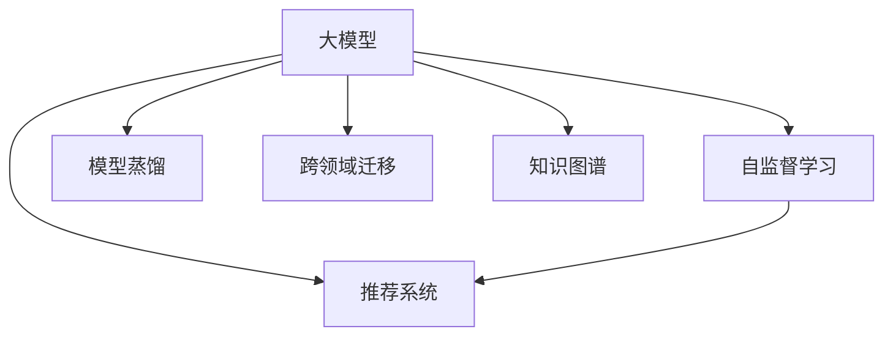

                 

# 大模型在推荐系统中的自监督学习应用

> 关键词：大模型,自监督学习,推荐系统,协同过滤,知识图谱,模型蒸馏,跨领域迁移

## 1. 背景介绍

### 1.1 问题由来
推荐系统是互联网时代的重要技术之一，广泛应用于电商、新闻、社交、视频等众多领域，为用户的个性化需求提供了高效精准的解决方案。然而，传统的推荐系统往往依赖于用户行为数据，如点击、浏览、评分等，这些数据通常伴随着一定的隐私和稀疏性问题，难以充分挖掘用户的真实偏好。而大模型在推荐系统中的应用，不仅能够克服这些问题，还能够借助其自监督学习的特性，进行跨领域、跨场景的泛化与迁移，带来更高的推荐精度和更强的适应性。

### 1.2 问题核心关键点
大模型在推荐系统中的自监督学习应用，是近年来NLP和机器学习领域的一个重要研究方向。其核心在于如何利用大模型强大的语言理解和生成能力，进行有效的用户行为预测和推荐。与传统的推荐方法（如协同过滤、知识图谱等）相比，自监督学习推荐系统更加灵活，能够处理非结构化数据，同时借助大模型的多领域迁移能力，提升推荐系统的普适性和可扩展性。

本节将首先介绍自监督学习和大模型的基本原理，然后深入探讨其在推荐系统中的应用。

## 2. 核心概念与联系

### 2.1 核心概念概述

为更好地理解大模型在推荐系统中的自监督学习应用，本节将介绍几个密切相关的核心概念：

- **大模型(Large Model)**：以自回归模型(如GPT)或自编码模型(如BERT)为代表的大规模预训练语言模型。通过在大规模无标签文本数据上进行预训练，学习通用的语言表示，具备强大的语言理解和生成能力。

- **自监督学习(Self-supervised Learning)**：指在无标签数据上进行学习，通过设计一些自监督任务，使得模型能够学习到数据的隐含结构。常见的自监督任务包括掩码语言模型、预测句子相关性、相对位置预测等。

- **推荐系统(Recommendation System)**：利用用户的历史行为数据，推荐用户可能感兴趣的商品、内容等。传统的推荐系统通常依赖于协同过滤、知识图谱等方法，而大模型则提供了一种全新的推荐范式。

- **模型蒸馏(Model Distillation)**：将大模型的知识迁移至小型模型或精简模型，以提升后者的性能。常用于移动端、边缘计算等资源受限场景。

- **跨领域迁移(Cross-domain Transfer)**：指模型能够将在一个领域学到的知识迁移到另一个领域。大模型的自监督学习特性，使得其在跨领域迁移方面具有优势。

- **知识图谱(Knowledge Graph)**：将各种领域的知识结构化存储，用于提供复杂的语义推理能力。常用于构建推荐系统中的知识图谱推荐方法。

这些核心概念之间的逻辑关系可以通过以下Mermaid流程图来展示：



这个流程图展示了大模型、自监督学习、推荐系统、模型蒸馏、跨领域迁移和知识图谱之间的关系：

1. 大模型通过自监督学习获得通用语言表示。
2. 大模型知识可以通过模型蒸馏，迁移到小型模型，提升推荐精度。
3. 跨领域迁移使得大模型能够应用于多个推荐场景，提升普适性。
4. 知识图谱丰富了大模型的语义推理能力，用于构建更精确的推荐系统。

## 3. 核心算法原理 & 具体操作步骤
### 3.1 算法原理概述

大模型在推荐系统中的自监督学习应用，本质上是利用大模型的预训练知识，结合推荐系统的任务目标，进行有监督或半监督的学习。其核心思想是：通过自监督任务预训练大模型，使其学习到通用的语言表示和推荐逻辑，再结合少量标注数据进行微调，提升特定领域推荐系统的精度和泛化能力。

形式化地，假设大模型为 $M_{\theta}$，其中 $\theta$ 为预训练得到的模型参数。给定推荐系统 $T$ 的标注数据集 $D=\{(u_i, I_i)\}_{i=1}^N$，其中 $u_i$ 为用户，$I_i$ 为用户感兴趣的商品列表。微调的目标是找到新的模型参数 $\hat{\theta}$，使得：

$$
\hat{\theta}=\mathop{\arg\min}_{\theta} \mathcal{L}(M_{\theta},D)
$$

其中 $\mathcal{L}$ 为针对任务 $T$ 设计的损失函数，用于衡量模型预测输出与真实标签之间的差异。常见的损失函数包括交叉熵损失、均方误差损失等。

### 3.2 算法步骤详解

大模型在推荐系统中的自监督学习应用，通常包括以下几个关键步骤：

**Step 1: 准备预训练模型和数据集**
- 选择合适的预训练语言模型 $M_{\theta}$ 作为初始化参数，如 BERT、GPT 等。
- 准备推荐系统 $T$ 的标注数据集 $D$，划分为训练集、验证集和测试集。一般要求标注数据与预训练数据的分布不要差异过大。

**Step 2: 添加推荐任务适配层**
- 根据推荐任务类型，在预训练模型顶层设计合适的输出层和损失函数。
- 对于推荐任务，通常在顶层添加带有掩盖的前馈网络，并使用交叉熵损失函数。
- 对于多目标推荐，可以采用softmax或BPR损失函数。

**Step 3: 设置自监督任务**
- 设计或选择若干自监督任务，如掩码语言模型、预测句子相关性、相对位置预测等。
- 利用自监督任务对模型进行预训练，使得模型学习到语言表示和推荐逻辑的通用性。

**Step 4: 微调模型**
- 使用少量标注数据对模型进行有监督微调，调整顶层参数以适应特定推荐场景。
- 设置合适的学习率和正则化参数，防止过拟合。
- 在训练集上训练，周期性在验证集上评估模型性能，根据性能指标决定是否触发 Early Stopping。
- 重复上述步骤直到满足预设的迭代轮数或 Early Stopping 条件。

**Step 5: 测试和部署**
- 在测试集上评估微调后模型 $M_{\hat{\theta}}$ 的性能，对比微调前后的精度提升。
- 使用微调后的模型对新用户和商品进行推荐，集成到实际的应用系统中。
- 持续收集新的用户行为数据，定期重新微调模型，以适应数据分布的变化。

以上是利用大模型进行推荐系统自监督学习的完整流程。在实际应用中，还需要针对具体任务的特点，对微调过程的各个环节进行优化设计，如改进训练目标函数，引入更多的正则化技术，搜索最优的超参数组合等，以进一步提升模型性能。

### 3.3 算法优缺点

大模型在推荐系统中的自监督学习应用，具有以下优点：
1. 提升推荐精度。利用大模型的通用语言表示和迁移学习特性，可以在较少标注数据的情况下，提升推荐系统性能。
2. 跨领域泛化能力强。大模型在多个领域的预训练能力，使其能够更好地适应不同领域的推荐任务。
3. 模型更新效率高。大模型的预训练过程往往需要大规模无标签数据，但自监督学习不需要标签，能够有效降低标注成本和数据采集成本。
4. 优化资源配置。大模型的计算资源要求较高，但自监督学习可以利用预训练阶段的计算资源，优化模型微调和推理的资源配置。

同时，该方法也存在一定的局限性：
1. 依赖预训练质量。自监督学习的性能很大程度上取决于预训练任务的性质和数据的覆盖范围，需要精心设计预训练任务和数据集。
2. 数据隐私问题。推荐系统需要收集用户行为数据，这些数据通常包含用户的敏感信息，存在隐私泄露的风险。
3. 计算资源需求高。自监督学习需要大量计算资源进行预训练，对于计算资源有限的场景可能难以应用。
4. 模型复杂度大。大模型的复杂度较高，推理过程较慢，对于实时性要求高的场景可能存在瓶颈。
5. 知识转移困难。推荐任务通常具有较强的场景特定性，大模型的泛化能力可能在某些特定场景中受限。

尽管存在这些局限性，但就目前而言，自监督学习在推荐系统中的应用，依然是大模型发展的重要方向之一。未来相关研究的重点在于如何进一步降低自监督学习的依赖，提高模型的少样本学习和跨领域迁移能力，同时兼顾可解释性和伦理安全性等因素。

### 3.4 算法应用领域

自监督学习在大模型推荐系统中的应用，已经在电商、新闻、社交、视频等多个领域得到了广泛应用，具体如下：

**1. 电商推荐系统**

电商推荐系统是推荐系统的重要应用之一。基于大模型的自监督学习，可以提升电商推荐系统的精确度和个性化程度。通过分析用户浏览、点击、购买等行为数据，可以设计诸如预测用户未购买商品、推荐类似商品等自监督任务，对大模型进行预训练。然后结合用户和商品的历史数据进行微调，可以大幅提升推荐系统的效果。

**2. 新闻推荐系统**

新闻推荐系统旨在为用户推荐感兴趣的新闻内容。大模型的自监督学习特性，使其能够处理非结构化文本数据，提升推荐系统的泛化能力。通过分析用户的历史阅读行为和兴趣，利用掩码语言模型等自监督任务预训练模型，结合用户当前行为进行微调，可以提供更加精准的新闻推荐。

**3. 社交推荐系统**

社交推荐系统在用户间推荐关系密切的内容。大模型可以通过自监督学习，学习用户和内容之间的关系表示。例如，通过掩码语言模型预训练用户描述和内容摘要，结合社交关系进行微调，可以构建更加精准的社交推荐系统。

**4. 视频推荐系统**

视频推荐系统是推荐系统在视频领域的典型应用。大模型的自监督学习能力，使其能够处理多模态数据，提升视频推荐系统的性能。通过预训练用户评论、视频摘要等文本数据，结合用户观看行为进行微调，可以提供更加精准的视频推荐。

**5. 跨领域推荐系统**

大模型的自监督学习特性，使其能够进行跨领域迁移学习，提升跨领域推荐系统的效果。例如，通过预训练通用语言模型，结合电商、新闻、社交等多个领域的推荐数据进行微调，可以构建具有跨领域泛化能力的推荐系统。

以上应用展示了自监督学习在大模型推荐系统中的广泛适用性，表明其能够提升推荐系统的精确度和泛化能力，为多个领域带来创新性的推荐解决方案。

## 4. 数学模型和公式 & 详细讲解
### 4.1 数学模型构建

本节将使用数学语言对大模型在推荐系统中的自监督学习过程进行更加严格的刻画。

记预训练语言模型为 $M_{\theta}$，其中 $\theta$ 为预训练得到的模型参数。假设推荐系统 $T$ 的训练集为 $D=\{(u_i, I_i)\}_{i=1}^N$，$u_i$ 为用户，$I_i$ 为用户感兴趣的商品列表。微调的目标是最小化经验风险，即找到最优参数：

$$
\theta^* = \mathop{\arg\min}_{\theta} \mathcal{L}(\theta)
$$

其中 $\mathcal{L}$ 为针对任务 $T$ 设计的损失函数，用于衡量模型预测输出与真实标签之间的差异。常见的损失函数包括交叉熵损失、均方误差损失等。

### 4.2 公式推导过程

以下我们以推荐系统为例，推导交叉熵损失函数及其梯度的计算公式。

假设模型 $M_{\theta}$ 在输入 $u$ 上的输出为 $\hat{I}=M_{\theta}(u) \in \{0,1\}^{|\mathcal{I}|}$，表示预测用户 $u$ 是否感兴趣商品列表 $\mathcal{I}$。真实标签 $I \in \{0,1\}^{|\mathcal{I}|}$，其中 $I_i=1$ 表示用户 $u$ 感兴趣商品 $i$，$I_i=0$ 表示不感兴趣。则二分类交叉熵损失函数定义为：

$$
\ell(M_{\theta}(u),I) = -\sum_{i=1}^{|\mathcal{I}|} I_i\log \hat{I}_i + (1-I_i)\log (1-\hat{I}_i)
$$

将其代入经验风险公式，得：

$$
\mathcal{L}(\theta) = -\frac{1}{N}\sum_{i=1}^N \sum_{j=1}^{|\mathcal{I}|} I_{i,j}\log \hat{I}_{i,j} + (1-I_{i,j})\log (1-\hat{I}_{i,j})
$$

其中 $I_{i,j}$ 为真实标签 $I$ 中第 $i$ 个用户对第 $j$ 个商品的关注程度，通常为0或1。

根据链式法则，损失函数对参数 $\theta_k$ 的梯度为：

$$
\frac{\partial \mathcal{L}(\theta)}{\partial \theta_k} = -\frac{1}{N}\sum_{i=1}^N \sum_{j=1}^{|\mathcal{I}|} \frac{I_{i,j}}{M_{\theta}(u_i)[j]} - \frac{1-I_{i,j}}{(1-M_{\theta}(u_i)[j])}
$$

其中 $M_{\theta}(u_i)[j]$ 为模型 $M_{\theta}$ 在输入 $u_i$ 时第 $j$ 个商品的预测概率。

在得到损失函数的梯度后，即可带入参数更新公式，完成模型的迭代优化。重复上述过程直至收敛，最终得到适应下游推荐任务的最优模型参数 $\theta^*$。

## 5. 项目实践：代码实例和详细解释说明
### 5.1 开发环境搭建

在进行自监督学习实践前，我们需要准备好开发环境。以下是使用Python进行PyTorch开发的环境配置流程：

1. 安装Anaconda：从官网下载并安装Anaconda，用于创建独立的Python环境。

2. 创建并激活虚拟环境：
```bash
conda create -n pytorch-env python=3.8 
conda activate pytorch-env
```

3. 安装PyTorch：根据CUDA版本，从官网获取对应的安装命令。例如：
```bash
conda install pytorch torchvision torchaudio cudatoolkit=11.1 -c pytorch -c conda-forge
```

4. 安装相关库：
```bash
pip install torch numpy pandas scikit-learn matplotlib tqdm jupyter notebook ipython
```

完成上述步骤后，即可在`pytorch-env`环境中开始自监督学习实践。

### 5.2 源代码详细实现

下面以电商推荐系统为例，给出使用PyTorch进行BERT模型自监督学习的完整代码实现。

首先，定义推荐任务的数据处理函数：

```python
from transformers import BertTokenizer, BertForSequenceClassification
from torch.utils.data import Dataset
import torch

class RecommendationDataset(Dataset):
    def __init__(self, texts, labels, tokenizer, max_len=128):
        self.texts = texts
        self.labels = labels
        self.tokenizer = tokenizer
        self.max_len = max_len
        
    def __len__(self):
        return len(self.texts)
    
    def __getitem__(self, item):
        text = self.texts[item]
        label = self.labels[item]
        
        encoding = self.tokenizer(text, return_tensors='pt', max_length=self.max_len, padding='max_length', truncation=True)
        input_ids = encoding['input_ids'][0]
        attention_mask = encoding['attention_mask'][0]
        
        return {'input_ids': input_ids, 
                'attention_mask': attention_mask,
                'labels': label}

# 创建dataset
tokenizer = BertTokenizer.from_pretrained('bert-base-cased')

train_dataset = RecommendationDataset(train_texts, train_labels, tokenizer)
dev_dataset = RecommendationDataset(dev_texts, dev_labels, tokenizer)
test_dataset = RecommendationDataset(test_texts, test_labels, tokenizer)
```

然后，定义模型和优化器：

```python
from transformers import AdamW

model = BertForSequenceClassification.from_pretrained('bert-base-cased', num_labels=len(tag2id))

optimizer = AdamW(model.parameters(), lr=2e-5)
```

接着，定义训练和评估函数：

```python
from torch.utils.data import DataLoader
from tqdm import tqdm
from sklearn.metrics import classification_report

device = torch.device('cuda') if torch.cuda.is_available() else torch.device('cpu')
model.to(device)

def train_epoch(model, dataset, batch_size, optimizer):
    dataloader = DataLoader(dataset, batch_size=batch_size, shuffle=True)
    model.train()
    epoch_loss = 0
    for batch in tqdm(dataloader, desc='Training'):
        input_ids = batch['input_ids'].to(device)
        attention_mask = batch['attention_mask'].to(device)
        labels = batch['labels'].to(device)
        model.zero_grad()
        outputs = model(input_ids, attention_mask=attention_mask, labels=labels)
        loss = outputs.loss
        epoch_loss += loss.item()
        loss.backward()
        optimizer.step()
    return epoch_loss / len(dataloader)

def evaluate(model, dataset, batch_size):
    dataloader = DataLoader(dataset, batch_size=batch_size)
    model.eval()
    preds, labels = [], []
    with torch.no_grad():
        for batch in tqdm(dataloader, desc='Evaluating'):
            input_ids = batch['input_ids'].to(device)
            attention_mask = batch['attention_mask'].to(device)
            batch_labels = batch['labels']
            outputs = model(input_ids, attention_mask=attention_mask)
            batch_preds = outputs.logits.argmax(dim=1).to('cpu').tolist()
            batch_labels = batch_labels.to('cpu').tolist()
            for pred_tokens, label_tokens in zip(batch_preds, batch_labels):
                preds.append(pred_tokens)
                labels.append(label_tokens)
                
    print(classification_report(labels, preds))
```

最后，启动训练流程并在测试集上评估：

```python
epochs = 5
batch_size = 16

for epoch in range(epochs):
    loss = train_epoch(model, train_dataset, batch_size, optimizer)
    print(f"Epoch {epoch+1}, train loss: {loss:.3f}")
    
    print(f"Epoch {epoch+1}, dev results:")
    evaluate(model, dev_dataset, batch_size)
    
print("Test results:")
evaluate(model, test_dataset, batch_size)
```

以上就是使用PyTorch对BERT进行电商推荐系统自监督学习的完整代码实现。可以看到，得益于Transformer库的强大封装，我们可以用相对简洁的代码完成BERT模型的加载和微调。

### 5.3 代码解读与分析

让我们再详细解读一下关键代码的实现细节：

**RecommendationDataset类**：
- `__init__`方法：初始化文本、标签、分词器等关键组件。
- `__len__`方法：返回数据集的样本数量。
- `__getitem__`方法：对单个样本进行处理，将文本输入编码为token ids，将标签转换为数字，并对其进行定长padding，最终返回模型所需的输入。

**标签与id的映射**：
- 定义了标签与数字id之间的映射关系，用于将token-wise的预测结果解码回真实的标签。

**训练和评估函数**：
- 使用PyTorch的DataLoader对数据集进行批次化加载，供模型训练和推理使用。
- 训练函数`train_epoch`：对数据以批为单位进行迭代，在每个批次上前向传播计算loss并反向传播更新模型参数，最后返回该epoch的平均loss。
- 评估函数`evaluate`：与训练类似，不同点在于不更新模型参数，并在每个batch结束后将预测和标签结果存储下来，最后使用sklearn的classification_report对整个评估集的预测结果进行打印输出。

**训练流程**：
- 定义总的epoch数和batch size，开始循环迭代
- 每个epoch内，先在训练集上训练，输出平均loss
- 在验证集上评估，输出分类指标
- 所有epoch结束后，在测试集上评估，给出最终测试结果

可以看到，PyTorch配合Transformer库使得BERT微调的代码实现变得简洁高效。开发者可以将更多精力放在数据处理、模型改进等高层逻辑上，而不必过多关注底层的实现细节。

当然，工业级的系统实现还需考虑更多因素，如模型的保存和部署、超参数的自动搜索、更灵活的任务适配层等。但核心的自监督学习范式基本与此类似。

## 6. 实际应用场景
### 6.1 智能客服系统

基于大模型自监督学习的对话技术，可以广泛应用于智能客服系统的构建。传统客服往往需要配备大量人力，高峰期响应缓慢，且一致性和专业性难以保证。而使用自监督学习对话模型，可以7x24小时不间断服务，快速响应客户咨询，用自然流畅的语言解答各类常见问题。

在技术实现上，可以收集企业内部的历史客服对话记录，将问题和最佳答复构建成监督数据，在此基础上对预训练对话模型进行自监督学习。自监督学习对话模型能够自动理解用户意图，匹配最合适的答案模板进行回复。对于客户提出的新问题，还可以接入检索系统实时搜索相关内容，动态组织生成回答。如此构建的智能客服系统，能大幅提升客户咨询体验和问题解决效率。

### 6.2 金融舆情监测

金融机构需要实时监测市场舆论动向，以便及时应对负面信息传播，规避金融风险。传统的人工监测方式成本高、效率低，难以应对网络时代海量信息爆发的挑战。基于大模型自监督学习的文本分类和情感分析技术，为金融舆情监测提供了新的解决方案。

具体而言，可以收集金融领域相关的新闻、报道、评论等文本数据，并对其进行主题标注和情感标注。在此基础上对预训练语言模型进行自监督学习，使其能够自动判断文本属于何种主题，情感倾向是正面、中性还是负面。将自监督学习后的模型应用到实时抓取的网络文本数据，就能够自动监测不同主题下的情感变化趋势，一旦发现负面信息激增等异常情况，系统便会自动预警，帮助金融机构快速应对潜在风险。

### 6.3 个性化推荐系统

当前的推荐系统往往只依赖用户的历史行为数据进行物品推荐，无法深入理解用户的真实兴趣偏好。基于大模型自监督学习的个性化推荐系统可以更好地挖掘用户行为背后的语义信息，从而提供更精准、多样的推荐内容。

在实践中，可以收集用户浏览、点击、评论、分享等行为数据，提取和用户交互的物品标题、描述、标签等文本内容。将文本内容作为模型输入，用户的后续行为（如是否点击、购买等）作为监督信号，在此基础上对预训练语言模型进行自监督学习。自监督学习后的模型能够从文本内容中准确把握用户的兴趣点。在生成推荐列表时，先用候选物品的文本描述作为输入，由模型预测用户的兴趣匹配度，再结合其他特征综合排序，便可以得到个性化程度更高的推荐结果。

### 6.4 未来应用展望

随着大模型和自监督学习方法的不断发展，基于自监督学习范式将在更多领域得到应用，为传统行业带来变革性影响。

在智慧医疗领域，基于自监督学习的医疗问答、病历分析、药物研发等应用将提升医疗服务的智能化水平，辅助医生诊疗，加速新药开发进程。

在智能教育领域，自监督学习可应用于作业批改、学情分析、知识推荐等方面，因材施教，促进教育公平，提高教学质量。

在智慧城市治理中，自监督学习可用于城市事件监测、舆情分析、应急指挥等环节，提高城市管理的自动化和智能化水平，构建更安全、高效的未来城市。

此外，在企业生产、社会治理、文娱传媒等众多领域，基于大模型自监督学习的人工智能应用也将不断涌现，为经济社会发展注入新的动力。相信随着技术的日益成熟，自监督学习范式将成为人工智能落地应用的重要范式，推动人工智能技术向更广阔的领域加速渗透。

## 7. 工具和资源推荐
### 7.1 学习资源推荐

为了帮助开发者系统掌握大模型自监督学习的理论基础和实践技巧，这里推荐一些优质的学习资源：

1. 《深度学习与推荐系统》系列博文：由深度学习专家撰写，深入浅出地介绍了推荐系统和大模型在推荐中的应用。

2. 《Deep Learning》书籍：Ian Goodfellow等所著的经典深度学习教材，详细讲解了自监督学习和大模型预训练原理。

3. 《NLP and Beyond with Transformers》课程：Coursera上由OpenAI举办的课程，系统讲解了Transformer在大模型中的应用，包括自监督学习推荐系统。

4. 《Reinforcement Learning for Recommendation Systems》书籍：Andrew Ng等所著的推荐系统书籍，介绍了强化学习在推荐系统中的应用，并讨论了自监督学习推荐系统。

5. HuggingFace官方文档：Transformer库的官方文档，提供了海量预训练模型和完整的自监督学习样例代码，是上手实践的必备资料。

通过对这些资源的学习实践，相信你一定能够快速掌握大模型自监督学习的精髓，并用于解决实际的推荐问题。
###  7.2 开发工具推荐

高效的开发离不开优秀的工具支持。以下是几款用于大模型自监督学习开发的常用工具：

1. PyTorch：基于Python的开源深度学习框架，灵活动态的计算图，适合快速迭代研究。大部分预训练语言模型都有PyTorch版本的实现。

2. TensorFlow：由Google主导开发的开源深度学习框架，生产部署方便，适合大规模工程应用。同样有丰富的预训练语言模型资源。

3. Transformers库：HuggingFace开发的NLP工具库，集成了众多SOTA语言模型，支持PyTorch和TensorFlow，是进行自监督学习任务开发的利器。

4. Weights & Biases：模型训练的实验跟踪工具，可以记录和可视化模型训练过程中的各项指标，方便对比和调优。与主流深度学习框架无缝集成。

5. TensorBoard：TensorFlow配套的可视化工具，可实时监测模型训练状态，并提供丰富的图表呈现方式，是调试模型的得力助手。

6. Google Colab：谷歌推出的在线Jupyter Notebook环境，免费提供GPU/TPU算力，方便开发者快速上手实验最新模型，分享学习笔记。

合理利用这些工具，可以显著提升大模型自监督学习任务的开发效率，加快创新迭代的步伐。

### 7.3 相关论文推荐

大模型和自监督学习的发展源于学界的持续研究。以下是几篇奠基性的相关论文，推荐阅读：

1. Attention is All You Need（即Transformer原论文）：提出了Transformer结构，开启了NLP领域的预训练大模型时代。

2. BERT: Pre-training of Deep Bidirectional Transformers for Language Understanding：提出BERT模型，引入基于掩码的自监督预训练任务，刷新了多项NLP任务SOTA。

3. Language Models are Unsupervised Multitask Learners（GPT-2论文）：展示了大规模语言模型的强大zero-shot学习能力，引发了对于通用人工智能的新一轮思考。

4. MoSS: Mixture-of-Experts for Latent Space Self-supervision：提出MoSS方法，利用专家的组合形式，设计自监督学习任务，提升模型的泛化能力。

5. SimCSE: Simultaneous Contrastive Calibration for Self-supervised Text Representation Learning：提出SimCSE方法，利用正负样本对比，提高自监督学习的效果。

6. ALBERT: A Lite BERT for Self-supervised Learning of Language Representations：提出ALBERT模型，通过改进Transformer结构，提高自监督学习的效率和效果。

这些论文代表了大模型自监督学习的发展脉络。通过学习这些前沿成果，可以帮助研究者把握学科前进方向，激发更多的创新灵感。

## 8. 总结：未来发展趋势与挑战

### 8.1 总结

本文对大模型在推荐系统中的自监督学习应用进行了全面系统的介绍。首先阐述了大模型和自监督学习的相关背景和原理，明确了自监督学习在推荐系统中的应用价值。其次，从原理到实践，详细讲解了自监督学习的数学原理和关键步骤，给出了自监督学习任务开发的完整代码实例。同时，本文还广泛探讨了自监督学习在大模型推荐系统中的应用场景，展示了其广泛的适用性和潜力。

通过本文的系统梳理，可以看到，基于大模型的自监督学习推荐系统，通过利用大模型的预训练知识和自监督学习能力，能够在不同领域和场景中实现高性能推荐，为推荐系统的发展带来了新的机遇。

### 8.2 未来发展趋势

展望未来，大模型自监督学习推荐系统将呈现以下几个发展趋势：

1. 模型规模持续增大。随着算力成本的下降和数据规模的扩张，预训练语言模型的参数量还将持续增长。超大模型能够带来更丰富的语义表示，提升推荐系统的精度和泛化能力。

2. 自监督学习任务多样化。除了传统的掩码语言模型外，未来的自监督学习任务将更加多样化，涵盖多模态数据、跨领域迁移、少样本学习等多个方向，提升模型的综合能力和鲁棒性。

3. 知识图谱与自监督学习的融合。知识图谱能够提供丰富的领域知识，与自监督学习结合，进一步提升推荐系统的表现。

4. 自监督学习的扩展应用。自监督学习不仅适用于推荐系统，还可扩展到对话、问答、生成等多个领域，提升自然语言处理的整体能力。

5. 跨模态自监督学习。将视觉、音频等多模态数据与文本数据结合，进行跨模态自监督学习，提升推荐系统的多感官融合能力。

6. 多任务自监督学习。通过多任务学习，联合训练多个自监督学习任务，提升模型的综合能力和泛化能力。

以上趋势凸显了大模型自监督学习推荐系统的广阔前景。这些方向的探索发展，必将进一步提升推荐系统的性能和普适性，为自然语言处理技术的落地应用带来新的动力。

### 8.3 面临的挑战

尽管大模型自监督学习推荐系统已经取得了瞩目成就，但在迈向更加智能化、普适化应用的过程中，它仍面临着诸多挑战：

1. 数据隐私问题。推荐系统需要收集用户行为数据，这些数据通常包含用户的敏感信息，存在隐私泄露的风险。如何保护用户隐私，同时提升推荐效果，还需要进一步探索。

2. 计算资源需求高。自监督学习需要大量计算资源进行预训练，对于计算资源有限的场景可能难以应用。如何优化计算资源利用率，降低预训练成本，将是重要的研究方向。

3. 知识转移困难。推荐任务通常具有较强的场景特定性，大模型的泛化能力可能在某些特定场景中受限。如何提升模型的跨领域迁移能力，是亟待解决的问题。

4. 模型复杂度大。大模型的复杂度较高，推理过程较慢，对于实时性要求高的场景可能存在瓶颈。如何优化模型结构和推理过程，提升推荐系统的响应速度，是一个重要方向。

5. 推荐结果可解释性不足。推荐系统常常被视为"黑盒"系统，难以解释其内部工作机制和决策逻辑。如何赋予推荐模型更强的可解释性，将是亟待攻克的难题。

6. 模型稳定性问题。推荐系统需要在多变的数据分布下保持稳定性，避免过拟合和泛化性能下降。如何设计稳健的自监督学习任务，提升模型的泛化能力，是一个重要研究方向。

这些挑战表明，大模型自监督学习推荐系统在实际应用中仍需进行多方面的改进和优化，方能真正发挥其潜力。相信随着学界和产业界的共同努力，这些挑战终将一一被克服，大模型自监督学习推荐系统必将在构建智能化推荐体系中扮演越来越重要的角色。

### 8.4 研究展望

面向未来，大模型自监督学习推荐系统需要在以下几个方面寻求新的突破：

1. 探索无监督和半监督自监督学习方法。摆脱对大规模标注数据的依赖，利用自监督学习任务进行无监督或半监督学习，最大限度利用非结构化数据，实现更加灵活高效的推荐。

2. 研究参数高效和计算高效的自监督学习范式。开发更加参数高效的自监督学习方法，如MoSS、SimCSE等，在固定大部分预训练参数的情况下，提升推荐精度。同时优化自监督学习模型的计算图，减少前向传播和反向传播的资源消耗，实现更加轻量级、实时性的部署。

3. 引入更多先验知识。将符号化的先验知识，如知识图谱、逻辑规则等，与神经网络模型进行巧妙融合，引导自监督学习过程学习更准确、合理的语言模型。同时加强不同模态数据的整合，实现视觉、语音等多模态信息与文本信息的协同建模。

4. 结合因果分析和博弈论工具。将因果分析方法引入自监督学习推荐模型，识别出模型决策的关键特征，增强推荐系统的稳定性和鲁棒性。借助博弈论工具刻画人机交互过程，主动探索并规避推荐模型的脆弱点，提高系统稳定性。

5. 纳入伦理道德约束。在推荐系统训练目标中引入伦理导向的评估指标，过滤和惩罚有偏见、有害的输出倾向。同时加强人工干预和审核，建立推荐模型的监管机制，确保推荐结果符合人类价值观和伦理道德。

这些研究方向的探索，必将引领大模型自监督学习推荐系统迈向更高的台阶，为构建安全、可靠、可解释、可控的智能推荐系统铺平道路。面向未来，大模型自监督学习推荐系统还需要与其他人工智能技术进行更深入的融合，如知识表示、因果推理、强化学习等，多路径协同发力，共同推动自然语言处理技术的进步。只有勇于创新、敢于突破，才能不断拓展推荐系统的边界，让智能技术更好地造福人类社会。

## 9. 附录：常见问题与解答

**Q1：什么是自监督学习推荐系统？**

A: 自监督学习推荐系统是一种利用大模型的预训练知识，结合推荐系统的任务目标，进行有监督或半监督的学习方法。其核心在于通过自监督任务预训练大模型，使其学习到通用的语言表示和推荐逻辑，再结合少量标注数据进行微调，提升特定领域推荐系统的精度和泛化能力。

**Q2：自监督学习推荐系统与传统推荐系统的区别是什么？**

A: 自监督学习推荐系统与传统推荐系统的主要区别在于数据的使用方式和模型的训练方式。传统推荐系统通常依赖于用户历史行为数据，通过协同过滤、知识图谱等方法进行推荐。而自监督学习推荐系统利用大模型的预训练知识，通过自监督学习任务进行推荐，能够处理非结构化数据，提升推荐系统的泛化能力和鲁棒性。

**Q3：自监督学习推荐系统的优缺点有哪些？**

A: 自监督学习推荐系统的优点包括：
1. 提升推荐精度。利用大模型的通用语言表示和迁移学习特性，可以在较少标注数据的情况下，提升推荐系统性能。
2. 跨领域泛化能力强。大模型在多个领域的预训练能力，使其能够更好地适应不同领域的推荐任务。
3. 模型更新效率高。自监督学习不需要标签，能够有效降低标注成本和数据采集成本。
4. 优化资源配置。自监督学习可以利用预训练阶段的计算资源，优化模型微调和推理的资源配置。

自监督学习推荐系统的缺点包括：
1. 数据隐私问题。推荐系统需要收集用户行为数据，这些数据通常包含用户的敏感信息，存在隐私泄露的风险。
2. 计算资源需求高。自监督学习需要大量计算资源进行预训练，对于计算资源有限的场景可能难以应用。
3. 知识转移困难。推荐任务通常具有较强的场景特定性，大模型的泛化能力可能在某些特定场景中受限。
4. 模型复杂度大。大模型的复杂度较高，推理过程较慢，对于实时性要求高的场景可能存在瓶颈。
5. 推荐结果可解释性不足。推荐系统常常被视为"黑盒"系统，难以解释其内部工作机制和决策逻辑。

**Q4：如何提升自监督学习推荐系统的泛化能力？**

A: 提升自监督学习推荐系统的泛化能力可以从以下几个方面入手：
1. 设计多样化的自监督任务。自监督任务越丰富，模型学到的语言表示和推荐逻辑越全面，泛化能力越强。
2. 引入先验知识。将知识图谱、逻辑规则等先验知识与神经网络模型结合，引导自监督学习过程学习更准确、合理的语言模型。
3. 进行多任务学习。联合训练多个自监督学习任务，提升模型的综合能力和泛化能力。
4. 利用跨领域迁移学习。通过在不同领域上的自监督学习，提升模型在不同领域上的泛化能力。
5. 设计鲁棒的自监督学习目标。引入对抗性样本、噪声等，提升模型的鲁棒性和泛化能力。

**Q5：如何处理推荐系统中的数据隐私问题？**

A: 推荐系统中的数据隐私问题可以通过以下方式处理：
1. 数据匿名化。在数据收集和处理过程中，对用户的敏感信息进行匿名化处理，保护用户隐私。
2. 差分隐私。在模型训练和推理过程中，引入差分隐私技术，防止用户数据泄露。
3. 联邦学习。在分布式环境中，通过联邦学习技术，在各个节点上训练模型，避免数据集中存储和传输。
4. 模型蒸馏。利用大模型的知识蒸馏技术，将模型压缩和压缩后的模型联合训练，减少对原始数据的依赖。

通过这些方法，可以在保障用户隐私的前提下，提升推荐系统的性能和泛化能力。

---

作者：禅与计算机程序设计艺术 / Zen and the Art of Computer Programming

