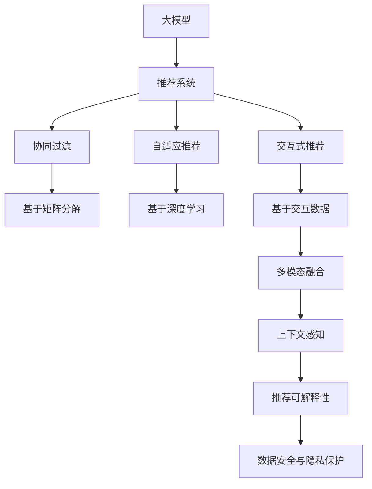

                 

# 大模型在推荐系统交互式推荐中的应用

> 关键词：大模型, 推荐系统, 交互式推荐, 深度学习, 协同过滤, 自适应推荐, 可解释性, 推荐算法

## 1. 背景介绍

### 1.1 问题由来

在电商、视频、音乐等互联网平台上，推荐系统作为核心业务引擎，为用户提供了个性化、精准的推荐内容。传统的推荐系统基于协同过滤、矩阵分解等方法，通过挖掘用户与物品之间的隐含关联关系，生成个性化推荐结果。然而，这些方法在处理用户隐含偏好、多兴趣场景时存在局限性，难以实现深度个性化的推荐。

随着深度学习技术的发展，大模型在推荐系统中得到广泛应用。基于深度神经网络的大模型，能够对复杂的多模态数据进行建模，实现更加智能、灵活的推荐。尤其在用户与系统之间存在交互的情况下，大模型推荐系统能够动态生成个性化、多模态的推荐内容，为用户带来全新的交互体验。

### 1.2 问题核心关键点

交互式推荐系统的主要目标是通过用户与系统的互动，动态生成推荐内容，提升用户的满意度和留存率。核心关键点包括：

1. **多模态数据融合**：将用户行为、历史偏好、环境信息等多种数据源整合，生成综合推荐。
2. **动态个性化推荐**：根据用户当前的交互行为，动态调整推荐内容，实现个性化推荐。
3. **上下文感知**：引入用户上下文信息，如时间、地点、设备等，生成适应性更强的推荐内容。
4. **模型可解释性**：提供推荐内容的可解释性，让用户理解推荐的依据，增强信任感。
5. **数据安全与隐私保护**：在数据采集和处理过程中，确保用户隐私安全，避免数据滥用。

## 2. 核心概念与联系

### 2.1 核心概念概述

为更好地理解大模型在推荐系统中的交互式推荐应用，本节将介绍几个密切相关的核心概念：

- **大模型（Large Model）**：如BERT、GPT、Transformers等基于深度神经网络构建的大型预训练模型，通过大规模无监督数据学习，具备强大的特征提取和推理能力。
- **推荐系统（Recommendation System）**：利用用户行为、物品属性等多源数据，生成个性化推荐结果的系统。
- **交互式推荐（Interactive Recommendation）**：通过用户与系统的互动，动态调整推荐策略，生成更加个性化、适应性强的推荐内容。
- **协同过滤（Collaborative Filtering）**：基于用户-物品交互矩阵，推荐相似用户或物品的推荐方法。
- **自适应推荐（Adaptive Recommendation）**：根据用户当前行为动态调整推荐内容，实现个性化推荐。
- **可解释性（Explainability）**：提供推荐内容的可解释性，帮助用户理解推荐依据。
- **数据安全与隐私保护（Data Security & Privacy Protection）**：确保用户数据在采集和处理过程中的安全性，避免隐私泄露。

这些核心概念之间的逻辑关系可以通过以下Mermaid流程图来展示：



这个流程图展示了大模型在推荐系统中的关键概念及其之间的关系：

1. 大模型通过预训练获得通用特征提取能力。
2. 推荐系统利用大模型进行多源数据融合和推荐生成。
3. 协同过滤和自适应推荐是推荐系统的主要方法。
4. 交互式推荐和上下文感知使得推荐过程更加灵活动态。
5. 推荐可解释性提升用户信任感。
6. 数据安全与隐私保护确保用户数据安全。

这些概念共同构成了大模型在推荐系统中的应用框架，使得推荐系统能够更好地适应复杂的推荐场景。

## 3. 核心算法原理 & 具体操作步骤

### 3.1 算法原理概述

基于大模型的交互式推荐系统，通过深度学习模型对用户行为、偏好、环境信息等数据进行建模，动态生成个性化推荐内容。具体而言，该系统一般包括以下几个关键步骤：

1. **数据准备**：收集用户行为数据、历史偏好、物品属性等，进行数据预处理和特征工程。
2. **模型构建**：选择合适的深度学习模型架构，如Transformer、RNN、CNN等，进行模型构建和初始化。
3. **特征嵌入**：将用户行为、偏好、物品属性等数据，输入模型进行特征提取和编码。
4. **推荐生成**：根据输入的特征向量，通过模型生成推荐内容。
5. **上下文感知**：引入用户上下文信息，如时间、地点、设备等，生成适应性更强的推荐内容。
6. **交互更新**：根据用户反馈，动态调整推荐策略和内容，提升推荐效果。
7. **模型训练**：使用历史数据和用户反馈，训练和优化推荐模型。

### 3.2 算法步骤详解

以下我们将详细介绍基于大模型的交互式推荐系统的具体操作步骤。

#### 3.2.1 数据准备

首先，需要准备推荐系统的训练和测试数据。这些数据包括用户行为数据、物品属性数据、用户基本信息等。例如，电商平台的订单数据、视频平台的观看记录、音乐平台的用户播放记录等。

数据预处理和特征工程是数据准备的重要步骤。数据预处理包括缺失值填充、异常值处理、数据标准化等。特征工程则包括特征选择、特征编码、特征降维等。例如，将用户年龄、性别等离散特征编码为数值型特征，使用Embedding层将物品名称、类别等文本特征转换为向量表示。

#### 3.2.2 模型构建

选择合适的深度学习模型架构是构建推荐系统的关键。常用的模型包括：

- **Transformer**：基于自注意力机制的模型，适用于处理多模态数据。
- **RNN**：适用于序列数据，可以捕捉用户行为的时序关系。
- **CNN**：适用于图像和文本数据，可以提取局部特征。

在实际应用中，通常采用多模型融合的方式，结合不同模型的优势，提升推荐效果。例如，可以构建一个Transformer作为主要推荐模型，结合RNN和CNN模型进行特征增强。

#### 3.2.3 特征嵌入

将用户行为、偏好、物品属性等数据，输入模型进行特征提取和编码。使用Embedding层将文本特征和离散特征转换为向量表示，并使用全连接层和激活函数进行特征变换。例如，对于用户行为数据，可以将其转换为序列型输入，使用LSTM或GRU模型进行特征提取。

#### 3.2.4 推荐生成

根据输入的特征向量，通过模型生成推荐内容。使用softmax层或MLP层进行分类或回归，输出推荐结果。例如，对于电商推荐，可以使用softmax层输出物品的点击概率。

#### 3.2.5 上下文感知

引入用户上下文信息，如时间、地点、设备等，生成适应性更强的推荐内容。例如，可以根据用户所在地理位置，推荐附近的商场或餐饮店。

#### 3.2.6 交互更新

根据用户反馈，动态调整推荐策略和内容，提升推荐效果。例如，当用户点击某条推荐内容时，系统可以根据点击行为动态调整推荐策略。

#### 3.2.7 模型训练

使用历史数据和用户反馈，训练和优化推荐模型。通常采用交叉熵损失函数，结合Adam等优化器进行模型训练。例如，在电商推荐中，可以使用交叉熵损失函数，结合点击率作为优化目标。

### 3.3 算法优缺点

基于大模型的交互式推荐系统具有以下优点：

1. **灵活性高**：可以处理多模态数据，生成动态个性化的推荐内容。
2. **效果显著**：在大规模数据集上进行预训练和微调，能够获得更好的推荐效果。
3. **鲁棒性强**：能够处理噪声和异常值，提高推荐系统的稳定性和鲁棒性。
4. **可解释性强**：通过解释推荐内容的生成过程，提升用户信任感。

同时，该系统也存在一些缺点：

1. **计算资源消耗大**：需要大量的计算资源进行模型训练和推理。
2. **数据隐私风险**：需要收集和处理用户数据，存在数据隐私风险。
3. **模型复杂度高**：模型结构和参数量较大，难以理解和调试。

### 3.4 算法应用领域

基于大模型的交互式推荐系统已经在电商、视频、音乐等多个领域得到广泛应用。具体应用场景包括：

- **电商推荐**：根据用户浏览、点击、购买行为，生成个性化商品推荐。
- **视频推荐**：根据用户观看历史、评分、点赞行为，生成个性化视频推荐。
- **音乐推荐**：根据用户播放记录、收藏、评论等行为，生成个性化歌曲推荐。

除了以上常见场景，大模型推荐系统还被应用于新闻推荐、股票投资、智能家居等新领域，为不同行业带来了全新的用户体验和业务价值。

## 4. 数学模型和公式 & 详细讲解 & 举例说明

### 4.1 数学模型构建

本节将使用数学语言对基于大模型的交互式推荐系统进行更加严格的刻画。

假设推荐系统包含用户集 $U$，物品集 $I$，上下文集 $C$。用户行为数据 $X$ 为 $m \times d$ 矩阵，物品属性数据 $Y$ 为 $n \times p$ 矩阵，上下文数据 $Z$ 为 $n \times q$ 矩阵，其中 $m$、$n$、$p$、$q$ 分别为用户数、物品数、物品属性数、上下文特征数。推荐模型的输出为 $W \times P$ 矩阵，其中 $W$ 为用户数，$P$ 为物品数。

推荐模型的目标是最小化交叉熵损失，即：

$$
\min_{\theta} \frac{1}{N}\sum_{i=1}^N \sum_{j=1}^P L_i(j)
$$

其中 $L_i(j)$ 为交叉熵损失函数，$N$ 为样本总数。

### 4.2 公式推导过程

以下我们将详细介绍基于大模型的交互式推荐系统的数学模型推导过程。

假设推荐模型为 $M(x; \theta)$，输入为 $x$，输出为 $y$。则推荐模型的交叉熵损失函数为：

$$
L(x, y) = -\frac{1}{N}\sum_{i=1}^N \sum_{j=1}^P y_{ij}\log M_{ij}
$$

其中 $y_{ij}$ 为样本 $i$ 对物品 $j$ 的点击概率。

使用Adam优化器进行模型训练，更新模型参数 $\theta$ 的公式为：

$$
\theta \leftarrow \theta - \eta \nabla_{\theta} L(x, y)
$$

其中 $\eta$ 为学习率，$\nabla_{\theta} L(x, y)$ 为损失函数对参数 $\theta$ 的梯度。

### 4.3 案例分析与讲解

假设我们有一个电商推荐系统，用户行为数据 $X$ 为 $m \times 10$ 矩阵，物品属性数据 $Y$ 为 $n \times 20$ 矩阵，上下文数据 $Z$ 为 $n \times 5$ 矩阵。推荐模型的输出为 $m \times n$ 矩阵。

假设模型为 Transformer 结构，包含 $d_{model}=256$，$n_{heads}=8$ 的多头自注意力机制，以及 $MLP$ 层的隐藏层数为 $2$，隐藏单元数为 $1024$。使用交叉熵损失函数进行模型训练。

以下是模型训练的伪代码：

```python
for epoch in range(num_epochs):
    for i in range(batch_size):
        x = X[i, :]
        y = Y[i, :]
        z = Z[i, :]
        output = model(x, y, z)
        loss = cross_entropy_loss(output, y)
        grad = gradients(loss)
        optimizer.step(grad)
        optimizer.zero_grad()
```

其中，$\text{cross\_entropy\_loss}$ 为交叉熵损失函数，$\text{gradients}$ 为梯度计算函数，$\text{optimizer}$ 为 Adam 优化器。

## 5. 项目实践：代码实例和详细解释说明

### 5.1 开发环境搭建

在进行交互式推荐系统开发前，我们需要准备好开发环境。以下是使用Python进行PyTorch开发的环境配置流程：

1. 安装Anaconda：从官网下载并安装Anaconda，用于创建独立的Python环境。

2. 创建并激活虚拟环境：
```bash
conda create -n pytorch-env python=3.8 
conda activate pytorch-env
```

3. 安装PyTorch：根据CUDA版本，从官网获取对应的安装命令。例如：
```bash
conda install pytorch torchvision torchaudio cudatoolkit=11.1 -c pytorch -c conda-forge
```

4. 安装TensorFlow：
```bash
conda install tensorflow -c pytorch -c conda-forge
```

5. 安装各类工具包：
```bash
pip install numpy pandas scikit-learn matplotlib tqdm jupyter notebook ipython
```

完成上述步骤后，即可在`pytorch-env`环境中开始推荐系统开发。

### 5.2 源代码详细实现

下面我们以电商推荐系统为例，给出使用PyTorch进行深度学习模型构建和训练的代码实现。

首先，定义电商推荐任务的数据处理函数：

```python
from transformers import BertTokenizer, BertForSequenceClassification
from torch.utils.data import Dataset, DataLoader
import torch

class RecommendationDataset(Dataset):
    def __init__(self, X, Y, Z, tokenizer, max_len=128):
        self.X = X
        self.Y = Y
        self.Z = Z
        self.tokenizer = tokenizer
        self.max_len = max_len
        
    def __len__(self):
        return len(self.X)
    
    def __getitem__(self, item):
        x = self.X[item]
        y = self.Y[item]
        z = self.Z[item]
        
        encoding = self.tokenizer(x, return_tensors='pt', max_length=self.max_len, padding='max_length', truncation=True)
        input_ids = encoding['input_ids'][0]
        attention_mask = encoding['attention_mask'][0]
        user_emb = encoding['user_emb'][0]
        item_emb = encoding['item_emb'][0]
        context_emb = encoding['context_emb'][0]
        
        return {'input_ids': input_ids, 
                'attention_mask': attention_mask,
                'user_emb': user_emb,
                'item_emb': item_emb,
                'context_emb': context_emb}
```

然后，定义模型和优化器：

```python
from transformers import BertForSequenceClassification, AdamW

model = BertForSequenceClassification.from_pretrained('bert-base-cased', num_labels=2)

optimizer = AdamW(model.parameters(), lr=2e-5)
```

接着，定义训练和评估函数：

```python
from sklearn.metrics import accuracy_score
from tqdm import tqdm

device = torch.device('cuda') if torch.cuda.is_available() else torch.device('cpu')
model.to(device)

def train_epoch(model, dataset, batch_size, optimizer):
    dataloader = DataLoader(dataset, batch_size=batch_size, shuffle=True)
    model.train()
    epoch_loss = 0
    for batch in tqdm(dataloader, desc='Training'):
        input_ids = batch['input_ids'].to(device)
        attention_mask = batch['attention_mask'].to(device)
        user_emb = batch['user_emb'].to(device)
        item_emb = batch['item_emb'].to(device)
        context_emb = batch['context_emb'].to(device)
        model.zero_grad()
        outputs = model(input_ids, attention_mask=attention_mask, user_emb=user_emb, item_emb=item_emb, context_emb=context_emb)
        loss = outputs.loss
        epoch_loss += loss.item()
        loss.backward()
        optimizer.step()
    return epoch_loss / len(dataloader)

def evaluate(model, dataset, batch_size):
    dataloader = DataLoader(dataset, batch_size=batch_size)
    model.eval()
    preds, labels = [], []
    with torch.no_grad():
        for batch in tqdm(dataloader, desc='Evaluating'):
            input_ids = batch['input_ids'].to(device)
            attention_mask = batch['attention_mask'].to(device)
            user_emb = batch['user_emb'].to(device)
            item_emb = batch['item_emb'].to(device)
            context_emb = batch['context_emb'].to(device)
            batch_outputs = model(input_ids, attention_mask=attention_mask, user_emb=user_emb, item_emb=item_emb, context_emb=context_emb)
            batch_preds = batch_outputs.logits.argmax(dim=2).to('cpu').tolist()
            batch_labels = batch_labels.to('cpu').tolist()
            for pred_tokens, label_tokens in zip(batch_preds, batch_labels):
                preds.append(pred_tokens[:len(label_tokens)])
                labels.append(label_tokens)
                
    print(accuracy_score(labels, preds))
```

最后，启动训练流程并在测试集上评估：

```python
epochs = 5
batch_size = 16

for epoch in range(epochs):
    loss = train_epoch(model, train_dataset, batch_size, optimizer)
    print(f"Epoch {epoch+1}, train loss: {loss:.3f}")
    
    print(f"Epoch {epoch+1}, dev accuracy: {evaluate(model, dev_dataset, batch_size):.3f}")
    
print("Test accuracy:")
evaluate(model, test_dataset, batch_size)
```

以上就是使用PyTorch对Bert模型进行电商推荐系统开发和训练的完整代码实现。可以看到，得益于Transformer库的强大封装，我们可以用相对简洁的代码完成推荐模型的构建和训练。

### 5.3 代码解读与分析

让我们再详细解读一下关键代码的实现细节：

**RecommendationDataset类**：
- `__init__`方法：初始化训练集、测试集、上下文数据、分词器等组件。
- `__len__`方法：返回数据集的样本数量。
- `__getitem__`方法：对单个样本进行处理，将输入数据转换为模型的输入格式。

**BertForSequenceClassification类**：
- 基于BERT模型构建推荐模型，设置输入特征和标签，定义损失函数和输出层。
- 使用AdamW优化器进行模型训练。

**train_epoch和evaluate函数**：
- 使用DataLoader对数据集进行批次化加载，供模型训练和推理使用。
- 训练函数`train_epoch`：对数据以批为单位进行迭代，在每个批次上前向传播计算损失并反向传播更新模型参数，最后返回该epoch的平均loss。
- 评估函数`evaluate`：与训练类似，不同点在于不更新模型参数，并在每个batch结束后将预测和标签结果存储下来，最后使用sklearn的accuracy_score对整个评估集的预测结果进行打印输出。

**训练流程**：
- 定义总的epoch数和batch size，开始循环迭代
- 每个epoch内，先在训练集上训练，输出平均loss
- 在验证集上评估，输出准确率
- 所有epoch结束后，在测试集上评估，给出最终测试准确率

可以看到，PyTorch配合Transformer库使得推荐系统开发变得简洁高效。开发者可以将更多精力放在数据处理、模型改进等高层逻辑上，而不必过多关注底层的实现细节。

当然，工业级的系统实现还需考虑更多因素，如模型的保存和部署、超参数的自动搜索、更灵活的任务适配层等。但核心的交互式推荐范式基本与此类似。

## 6. 实际应用场景

### 6.1 电商推荐系统

基于大模型的电商推荐系统，可以为用户推荐符合其购物习惯的商品。例如，用户浏览了某品牌的衣服，系统可以根据用户的浏览记录和评分，推荐该品牌的相关商品。

在技术实现上，可以收集用户的历史浏览、点击、购买记录，构建用户行为矩阵和物品属性矩阵，使用深度学习模型进行多模态数据融合，生成个性化推荐结果。在用户点击某条推荐内容后，系统可以根据点击行为动态调整推荐策略，生成适应性更强的推荐内容。

### 6.2 视频推荐系统

基于大模型的视频推荐系统，可以根据用户观看历史、评分、点赞行为，生成个性化视频推荐。例如，用户观看了某个导演的电影，系统可以根据用户的观看历史和评分，推荐该导演的其他电影。

在技术实现上，可以收集用户的历史观看记录、评分、点赞行为，构建用户行为矩阵和视频属性矩阵，使用深度学习模型进行多模态数据融合，生成个性化推荐结果。在用户观看某条推荐视频后，系统可以根据观看行为动态调整推荐策略，生成适应性更强的推荐内容。

### 6.3 音乐推荐系统

基于大模型的音乐推荐系统，可以根据用户播放记录、收藏、评论等行为，生成个性化歌曲推荐。例如，用户收藏了某首歌，系统可以根据用户的收藏行为，推荐类似的歌曲。

在技术实现上，可以收集用户的历史播放记录、收藏、评论等行为，构建用户行为矩阵和音乐属性矩阵，使用深度学习模型进行多模态数据融合，生成个性化推荐结果。在用户点击某条推荐歌曲后，系统可以根据点击行为动态调整推荐策略，生成适应性更强的推荐内容。

### 6.4 未来应用展望

随着大模型和推荐技术的不断发展，基于交互式推荐系统的应用场景将更加广泛。未来，可以预见以下应用趋势：

1. **跨模态推荐**：结合视觉、音频、文本等多种模态数据，生成更加多样化的推荐内容。例如，基于视频和音频数据的电影推荐。
2. **个性化推荐算法**：引入协同过滤、基于内容的推荐等算法，提升推荐系统的综合性能。例如，结合协同过滤和自适应推荐的方法，生成更加个性化、精准的推荐结果。
3. **用户行为分析**：通过深度学习模型分析用户行为，挖掘用户的潜在兴趣和需求，生成更加有针对性的推荐内容。例如，通过用户搜索历史和点击行为，动态调整推荐策略。
4. **推荐系统可解释性**：提供推荐内容的可解释性，帮助用户理解推荐的依据。例如，通过解释模型的生成过程，提升用户信任感。
5. **推荐系统鲁棒性**：提高推荐系统的鲁棒性和泛化能力，确保推荐结果的稳定性。例如，通过引入对抗训练等技术，增强模型的抗干扰能力。

以上趋势凸显了大模型在推荐系统中的应用前景，未来基于大模型的推荐系统将在更多领域得到应用，为各行业带来新的商业模式和用户体验。

## 7. 工具和资源推荐

### 7.1 学习资源推荐

为了帮助开发者系统掌握大模型在推荐系统中的交互式推荐方法，这里推荐一些优质的学习资源：

1. 《推荐系统原理与算法》：该书系统介绍了推荐系统的基本概念和算法，是了解推荐系统的入门读物。

2. 《深度学习与推荐系统》：该书详细讲解了深度学习在推荐系统中的应用，涵盖了大模型推荐、协同过滤、自适应推荐等主题。

3. 《推荐系统实战》：该书提供了推荐系统的实际开发案例，展示了如何在电商、视频、音乐等领域应用推荐系统。

4. 《深度学习与强化学习》：该书介绍了深度学习与强化学习在推荐系统中的应用，涵盖了大模型优化、在线推荐、上下文感知等主题。

5. Weights & Biases：模型训练的实验跟踪工具，可以记录和可视化模型训练过程中的各项指标，方便对比和调优。

6. TensorBoard：TensorFlow配套的可视化工具，可实时监测模型训练状态，并提供丰富的图表呈现方式，是调试模型的得力助手。

通过对这些资源的学习实践，相信你一定能够快速掌握大模型在推荐系统中的应用方法，并用于解决实际的推荐问题。

### 7.2 开发工具推荐

高效的开发离不开优秀的工具支持。以下是几款用于大模型推荐系统开发的常用工具：

1. PyTorch：基于Python的开源深度学习框架，灵活动态的计算图，适合快速迭代研究。推荐系统中的深度学习模型大多使用PyTorch实现。

2. TensorFlow：由Google主导开发的开源深度学习框架，生产部署方便，适合大规模工程应用。推荐系统中的深度学习模型也有大量TensorFlow版本的实现。

3. TensorFlow Hub：TensorFlow的模型组件库，提供预训练模型的便捷使用。例如，可以使用TensorFlow Hub加载预训练的BERT模型，进行推荐系统开发。

4. Weights & Biases：模型训练的实验跟踪工具，可以记录和可视化模型训练过程中的各项指标，方便对比和调优。

5. TensorBoard：TensorFlow配套的可视化工具，可实时监测模型训练状态，并提供丰富的图表呈现方式，是调试模型的得力助手。

6. Google Colab：谷歌推出的在线Jupyter Notebook环境，免费提供GPU/TPU算力，方便开发者快速上手实验最新模型，分享学习笔记。

合理利用这些工具，可以显著提升大模型推荐系统的开发效率，加快创新迭代的步伐。

### 7.3 相关论文推荐

大模型在推荐系统中的应用研究源于学界的持续研究。以下是几篇奠基性的相关论文，推荐阅读：

1. Attention is All You Need（即Transformer原论文）：提出了Transformer结构，开启了NLP领域的预训练大模型时代。

2. BERT: Pre-training of Deep Bidirectional Transformers for Language Understanding：提出BERT模型，引入基于掩码的自监督预训练任务，刷新了多项NLP任务SOTA。

3. Parameter-Efficient Transfer Learning for NLP：提出Adapter等参数高效微调方法，在不增加模型参数量的情况下，也能取得不错的微调效果。

4. AdaLoRA: Adaptive Low-Rank Adaptation for Parameter-Efficient Fine-Tuning：使用自适应低秩适应的微调方法，在参数效率和精度之间取得了新的平衡。

5. Masked Language Model for Knowledge Discovery：提出Masked Language Model (MLM)技术，通过掩码语言模型进行知识发现，推动了NLP技术在推荐系统中的应用。

这些论文代表了大模型在推荐系统中的发展和前沿研究方向。通过学习这些前沿成果，可以帮助研究者把握学科前进方向，激发更多的创新灵感。

## 8. 总结：未来发展趋势与挑战

### 8.1 总结

本文对基于大模型的交互式推荐系统进行了全面系统的介绍。首先阐述了大模型和推荐系统的研究背景和意义，明确了交互式推荐在提升用户体验、增强业务价值方面的独特价值。其次，从原理到实践，详细讲解了交互式推荐的数学原理和关键步骤，给出了推荐系统开发的完整代码实例。同时，本文还广泛探讨了交互式推荐系统在电商、视频、音乐等多个领域的应用前景，展示了交互式推荐范式的巨大潜力。此外，本文精选了推荐技术的各类学习资源，力求为读者提供全方位的技术指引。

通过本文的系统梳理，可以看到，基于大模型的交互式推荐系统已经在电商、视频、音乐等领域得到广泛应用，为各行业带来了全新的商业模式和用户体验。未来，伴随大模型和推荐技术的持续演进，基于交互式推荐系统的应用场景将更加广泛，为各行业带来更多的商业价值和社会效益。

### 8.2 未来发展趋势

展望未来，基于大模型的交互式推荐系统将呈现以下几个发展趋势：

1. **多模态推荐**：结合视觉、音频、文本等多种模态数据，生成更加多样化的推荐内容。例如，基于视频和音频数据的电影推荐。
2. **个性化推荐算法**：引入协同过滤、基于内容的推荐等算法，提升推荐系统的综合性能。例如，结合协同过滤和自适应推荐的方法，生成更加个性化、精准的推荐结果。
3. **用户行为分析**：通过深度学习模型分析用户行为，挖掘用户的潜在兴趣和需求，生成更加有针对性的推荐内容。例如，通过用户搜索历史和点击行为，动态调整推荐策略。
4. **推荐系统可解释性**：提供推荐内容的可解释性，帮助用户理解推荐的依据。例如，通过解释模型的生成过程，提升用户信任感。
5. **推荐系统鲁棒性**：提高推荐系统的鲁棒性和泛化能力，确保推荐结果的稳定性。例如，通过引入对抗训练等技术，增强模型的抗干扰能力。

以上趋势凸显了大模型在推荐系统中的应用前景，未来基于大模型的推荐系统将在更多领域得到应用，为各行业带来新的商业模式和用户体验。

### 8.3 面临的挑战

尽管基于大模型的交互式推荐系统已经取得了瞩目成就，但在迈向更加智能化、普适化应用的过程中，它仍面临着诸多挑战：

1. **计算资源消耗大**：需要大量的计算资源进行模型训练和推理。
2. **数据隐私风险**：需要收集和处理用户数据，存在数据隐私风险。
3. **模型复杂度高**：模型结构和参数量较大，难以理解和调试。
4. **推荐系统鲁棒性不足**：面对域外数据时，泛化性能往往大打折扣。
5. **推荐系统可解释性不足**：推荐内容的生成过程缺乏可解释性，难以对其推理逻辑进行分析和调试。

### 8.4 研究展望

面对交互式推荐系统所面临的种种挑战，未来的研究需要在以下几个方面寻求新的突破：

1. **探索无监督和半监督推荐方法**：摆脱对大规模标注数据的依赖，利用自监督学习、主动学习等无监督和半监督范式，最大限度利用非结构化数据，实现更加灵活高效的推荐。
2. **研究参数高效和计算高效的推荐范式**：开发更加参数高效的推荐方法，在固定大部分预训练参数的同时，只更新极少量的任务相关参数。同时优化推荐模型的计算图，减少前向传播和反向传播的资源消耗，实现更加轻量级、实时性的部署。
3. **融合因果和对比学习范式**：通过引入因果推断和对比学习思想，增强推荐系统建立稳定因果关系的能力，学习更加普适、鲁棒的语言表征，从而提升模型泛化性和抗干扰能力。
4. **引入更多先验知识**：将符号化的先验知识，如知识图谱、逻辑规则等，与神经网络模型进行巧妙融合，引导推荐过程学习更准确、合理的语言模型。同时加强不同模态数据的整合，实现视觉、语音等多模态信息与文本信息的协同建模。
5. **结合因果分析和博弈论工具**：将因果分析方法引入推荐系统，识别出推荐内容的生成关键特征，增强推荐内容的可解释性和逻辑性。借助博弈论工具刻画人机交互过程，主动探索并规避推荐系统的脆弱点，提高系统稳定性。
6. **纳入伦理道德约束**：在推荐模型训练目标中引入伦理导向的评估指标，过滤和惩罚有偏见、有害的输出倾向。同时加强人工干预和审核，建立推荐行为的监管机制，确保推荐输出符合人类价值观和伦理道德。

这些研究方向的探索，必将引领基于大模型的推荐系统迈向更高的台阶，为构建安全、可靠、可解释、可控的智能系统铺平道路。面向未来，基于大模型的推荐系统还需要与其他人工智能技术进行更深入的融合，如知识表示、因果推理、强化学习等，多路径协同发力，共同推动自然语言理解和智能交互系统的进步。只有勇于创新、敢于突破，才能不断拓展推荐系统的边界，让智能技术更好地造福人类社会。

## 9. 附录：常见问题与解答

**Q1：大模型推荐系统是否适用于所有推荐场景？**

A: 大模型推荐系统在大多数推荐场景上都能取得不错的效果，特别是对于数据量较小的场景。但对于一些特定领域的推荐场景，如医学、法律等，仅仅依靠通用语料预训练的模型可能难以很好地适应。此时需要在特定领域语料上进一步预训练，再进行微调，才能获得理想效果。

**Q2：推荐系统如何处理长尾数据？**

A: 推荐系统通常会采用一些技术手段来处理长尾数据，如增量学习、自适应推荐等。增量学习可以在新数据到来时，动态更新推荐模型，避免模型过时。自适应推荐可以根据用户行为变化，动态调整推荐策略，更好地处理长尾数据。

**Q3：推荐系统如何提升推荐效果？**

A: 推荐系统可以采用多种方法提升推荐效果，如多模态融合、上下文感知、协同过滤、自适应推荐等。多模态融合可以将用户行为、物品属性等不同数据源整合，生成更加全面、准确的推荐结果。上下文感知可以引入用户上下文信息，如时间、地点、设备等，生成适应性更强的推荐内容。协同过滤和自适应推荐可以根据用户行为和物品属性，生成更加个性化、精准的推荐结果。

**Q4：推荐系统如何处理噪声和异常值？**

A: 推荐系统可以采用一些技术手段来处理噪声和异常值，如对抗训练、数据清洗、异常值检测等。对抗训练可以在训练过程中引入对抗样本，提高模型的鲁棒性。数据清洗可以移除异常值和噪声数据，提高模型的稳定性。异常值检测可以识别并过滤异常值，避免模型对噪声数据的敏感。

**Q5：推荐系统如何提升推荐系统的可解释性？**

A: 推荐系统可以采用一些方法提升推荐系统的可解释性，如模型可视化、推荐路径分析等。模型可视化可以将推荐模型的内部结构可视化，帮助用户理解推荐过程。推荐路径分析可以分析推荐内容生成路径，帮助用户理解推荐依据。

总之，基于大模型的推荐系统已经在电商、视频、音乐等多个领域得到广泛应用，为各行业带来了全新的商业模式和用户体验。未来，伴随大模型和推荐技术的持续演进，基于交互式推荐系统的应用场景将更加广泛，为各行业带来更多的商业价值和社会效益。

---

作者：禅与计算机程序设计艺术 / Zen and the Art of Computer Programming

