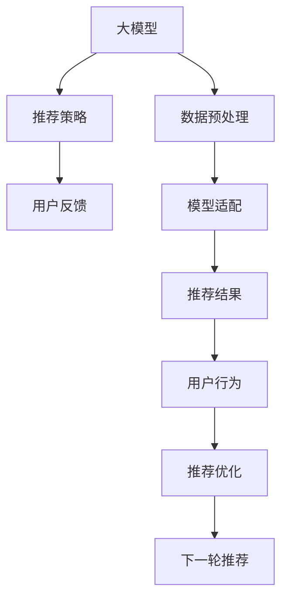

                 

# 大模型在推荐系统交互设计中的应用

> 关键词：大模型,推荐系统,交互设计,自然语言处理,NLP,个性化推荐

## 1. 背景介绍

### 1.1 问题由来

推荐系统是现代信息服务的重要支柱，其作用在于为每个用户推荐最感兴趣的物品。随着用户群体不断扩大，推荐系统已经从简单的信息检索演变为高度个性化的智能推荐。在电商、视频、社交、搜索等诸多场景中，推荐系统对提升用户体验、提升转化率、增加收益等方面有着显著的贡献。

然而，面对海量数据和复杂用户模型，如何设计出高效、精准的推荐系统，依然是一个充满挑战的问题。特别是在用户行为稀疏、偏好动态变化的情况下，推荐系统的推荐效果往往参差不齐。大语言模型和大数据技术的融合，为推荐系统带来了一种全新的智能设计范式，有效解决了传统推荐系统面临的多样性、复杂性和实时性挑战。

### 1.2 问题核心关键点

在推荐系统的交互设计中，大模型的引入带来了一系列颠覆性的变化。具体而言，主要包括以下几个核心关键点：

1. **个性化推荐**：通过分析用户行为和兴趣，推荐系统中位次单点点击、购买、浏览等数据的综合分析，为每个用户定制最符合其兴趣的推荐结果。

2. **交互式体验**：通过与用户的交互反馈，不断调整推荐策略，提升推荐结果的相关性和满意度。

3. **实时动态**：通过实时更新用户行为数据和模型参数，保持推荐结果的时效性和准确性。

4. **数据驱动**：利用大模型的预训练能力和自适应能力，融合多源数据，为推荐系统提供更全面、精准的决策支持。

5. **可解释性**：通过对模型输出进行解释，提升推荐系统的透明度和信任度，帮助用户理解推荐理由。

6. **隐私保护**：通过差分隐私、联邦学习等技术，保障用户隐私的同时实现精准推荐。

### 1.3 问题研究意义

大模型在推荐系统中的应用，将极大地提升推荐系统的智能化水平，实现更加个性化、实时化的推荐服务。具体而言，其研究意义如下：

1. **优化用户体验**：通过深入理解用户行为，构建智能推荐引擎，提升用户满意度和忠诚度，带来更好的体验感。

2. **提高推荐效果**：利用大模型强大的数据处理和建模能力，实现推荐结果的精度和覆盖度，提升用户点击率和转化率。

3. **加速业务增长**：通过精准推荐，降低用户流失率，提升运营效率，为业务发展带来持续动力。

4. **驱动数据应用**：通过引入大模型，推动数据驱动的决策方式，优化业务运营，优化供应链管理，提升整体效率。

## 2. 核心概念与联系

### 2.1 核心概念概述

为了更深入理解大模型在推荐系统中的应用，首先需要了解几个核心概念：

- **大模型**：如BERT、GPT、T5等，通过在大规模无标签数据上进行预训练，学习到丰富的语言知识，具备强大的文本生成和分类能力。

- **推荐系统**：为用户提供个性化物品推荐的服务，可以应用于电商、视频、新闻、社交等多个领域。

- **交互设计**：通过设计用户交互界面，提升用户体验，同时收集用户反馈，优化推荐算法。

- **自然语言处理(NLP)**：涉及文本预处理、语言建模、文本分类、文本生成等技术，为推荐系统提供数据处理和分析支持。

- **个性化推荐**：根据用户的历史行为和实时反馈，动态调整推荐策略，提升推荐相关性。

- **实时动态**：通过持续收集用户行为数据和模型参数，不断调整推荐策略，实现动态推荐。

- **数据驱动**：融合多种数据源，利用大模型的自适应能力，提升推荐系统的决策精度。

- **可解释性**：通过解释模型输出，增强推荐系统的透明度和可信度。

- **隐私保护**：通过差分隐私、联邦学习等技术，保护用户隐私，同时保证推荐效果。

这些核心概念之间相互作用，构建起推荐系统的大模型应用框架，使得推荐系统能够从多维度提升用户体验和运营效果。

### 2.2 核心概念原理和架构的 Mermaid 流程图



该图展示了大模型在推荐系统中的应用流程。首先，大模型通过数据预处理(B)学习到用户行为特征和兴趣倾向。然后，根据模型适配(E)的推荐策略(C)，生成个性化推荐结果(F)。用户反馈(D)经过评估后，用于推荐优化(H)，进入下一轮推荐(I)。这样的交互循环不断进行，使得推荐系统能够持续学习用户的兴趣变化，不断优化推荐结果。

## 3. 核心算法原理 & 具体操作步骤
### 3.1 算法原理概述

基于大模型的推荐系统，核心在于将大模型作为推荐策略的核心组件，通过分析用户行为和兴趣，动态生成推荐结果。该算法主要包括以下几个步骤：

1. **数据预处理**：收集用户的历史行为数据，并进行特征工程处理，提取用户兴趣、行为序列等特征。

2. **模型适配**：将大模型适配为推荐任务所需的结构，如线性层、池化层、注意力机制等，以便进行推荐预测。

3. **推荐策略**：根据用户的兴趣和行为数据，使用大模型进行预测，生成推荐结果。

4. **用户反馈**：收集用户对推荐结果的反馈，用于调整推荐策略和优化模型参数。

5. **推荐优化**：根据用户反馈和推荐效果，动态调整推荐策略和模型参数，以提升推荐效果。

### 3.2 算法步骤详解

以下将详细介绍大模型在推荐系统中的应用步骤：

**Step 1: 数据预处理**

推荐系统的数据预处理涉及用户行为数据的收集和处理。具体步骤如下：

1. **数据采集**：从电商、视频、新闻等平台采集用户的点击、浏览、评分等行为数据。

2. **数据清洗**：处理缺失值、异常值等噪声数据，确保数据质量。

3. **特征工程**：提取用户特征，如历史行为、兴趣偏好、行为序列等，并将数据转换为模型可以处理的形式。

4. **数据划分**：将数据划分为训练集、验证集和测试集，供模型训练和评估。

**Step 2: 模型适配**

将大模型适配为推荐任务所需的结构，以便进行推荐预测。具体步骤如下：

1. **选择预训练模型**：选择适合推荐任务的预训练模型，如BERT、GPT、T5等。

2. **添加任务适配层**：根据任务类型，在模型顶层添加线性分类器、池化层、注意力机制等，以便进行推荐预测。

3. **设置训练参数**：选择合适的优化算法及其参数，如AdamW、SGD等，设置学习率、批大小、迭代轮数等。

4. **保存模型参数**：将训练好的模型参数保存下来，供后续推荐使用。

**Step 3: 推荐策略**

根据用户的兴趣和行为数据，使用大模型进行预测，生成推荐结果。具体步骤如下：

1. **特征编码**：将用户特征转换为向量形式，供模型处理。

2. **模型预测**：将特征向量输入大模型，进行预测，生成推荐结果。

3. **去重排序**：对推荐结果去重、排序，确保结果的相关性和多样性。

4. **输出推荐**：将推荐结果输出给用户，供用户选择。

**Step 4: 用户反馈**

收集用户对推荐结果的反馈，用于调整推荐策略和优化模型参数。具体步骤如下：

1. **反馈收集**：收集用户对推荐结果的评分、点击等反馈数据。

2. **反馈处理**：处理用户反馈，计算用户满意度等指标。

3. **反馈应用**：将用户反馈应用到推荐策略和模型参数优化中。

**Step 5: 推荐优化**

根据用户反馈和推荐效果，动态调整推荐策略和模型参数，以提升推荐效果。具体步骤如下：

1. **评估指标**：选择评估指标，如点击率、转化率等，评估推荐效果。

2. **调整策略**：根据评估指标，调整推荐策略和模型参数。

3. **优化模型**：通过持续学习，优化模型参数，提升推荐效果。

### 3.3 算法优缺点

基于大模型的推荐系统有以下优点：

1. **高效准确**：大模型通过预训练，具备强大的数据处理和建模能力，能够精准捕捉用户行为和兴趣。

2. **泛化能力强**：大模型具备广泛的领域泛化能力，适用于多种推荐任务和场景。

3. **实时动态**：大模型能够实时更新用户行为数据和模型参数，保持推荐结果的时效性和准确性。

4. **个性化推荐**：利用大模型的自适应能力，实现个性化推荐，提升用户满意度。

5. **模型高效**：通过参数高效微调技术，可以在固定大部分预训练参数的情况下，只更新极少量的任务相关参数。

然而，该算法也存在一定的局限性：

1. **标注数据依赖**：微调过程需要依赖标注数据，而标注数据往往需要大量人力和时间成本。

2. **数据隐私风险**：用户行为数据可能包含敏感信息，存在数据隐私泄露风险。

3. **模型复杂度**：大模型参数量大，复杂度高，可能导致推理速度慢、内存占用大等效率问题。

4. **模型可解释性不足**：大模型往往是"黑盒"系统，难以解释其内部工作机制和决策逻辑。

5. **模型鲁棒性不足**：大模型可能存在一定的偏差和噪声，需要进一步优化模型鲁棒性。

### 3.4 算法应用领域

基于大模型的推荐系统已经广泛应用于多个领域，包括但不限于：

1. **电商推荐**：如商品推荐、用户画像生成等，通过分析用户行为数据，提升商品推荐效果。

2. **视频推荐**：如视频内容推荐、用户行为分析等，通过分析视频观看行为，推荐相似视频内容。

3. **新闻推荐**：如新闻标题推荐、用户兴趣分析等，通过分析新闻阅读行为，推荐相关新闻内容。

4. **社交推荐**：如好友推荐、内容推荐等，通过分析用户社交行为，推荐相关用户和内容。

5. **搜索推荐**：如搜索结果推荐、搜索提示等，通过分析用户搜索行为，提升搜索体验。

6. **智能客服**：如问题解答、智能助手等，通过分析用户咨询行为，提供个性化服务。

## 4. 数学模型和公式 & 详细讲解 & 举例说明

### 4.1 数学模型构建

推荐系统的核心在于对用户行为数据的建模和预测。假设用户行为数据为 $\mathcal{X}$，推荐结果为 $\mathcal{Y}$，则推荐系统的建模过程可以表示为：

$$
\mathcal{L}(\theta) = \frac{1}{N}\sum_{i=1}^N \ell(M_{\theta}(x_i),y_i)
$$

其中 $\theta$ 为大模型参数，$M_{\theta}$ 为模型映射函数，$\ell$ 为损失函数，$x_i$ 为用户行为数据，$y_i$ 为推荐结果。目标是最小化损失函数 $\mathcal{L}(\theta)$，以得到最优的推荐结果。

### 4.2 公式推导过程

以点击率预测为例，假设模型输出为 $p(y=1|x;\theta)$，则损失函数可以表示为：

$$
\ell(p(y=1|x;\theta),y) = \begin{cases}
-\log p(y=1|x;\theta) & \text{if } y=1 \\
-\log (1-p(y=1|x;\theta)) & \text{if } y=0
\end{cases}
$$

将其代入经验风险公式，得：

$$
\mathcal{L}(\theta) = -\frac{1}{N}\sum_{i=1}^N [y_i\log p(y=1|x_i;\theta)+(1-y_i)\log(1-p(y=1|x_i;\theta))]
$$

对模型参数 $\theta$ 求导，得到梯度：

$$
\nabla_{\theta}\mathcal{L}(\theta) = -\frac{1}{N}\sum_{i=1}^N \nabla_{\theta}p(y=1|x_i;\theta)
$$

其中 $\nabla_{\theta}p(y=1|x_i;\theta)$ 可以通过链式法则和反向传播算法计算。

### 4.3 案例分析与讲解

以用户画像生成为例，假设用户行为数据为 $\mathcal{X}$，用户画像为 $\mathcal{Y}$，则推荐系统的建模过程可以表示为：

$$
\mathcal{L}(\theta) = \frac{1}{N}\sum_{i=1}^N \ell(M_{\theta}(x_i),y_i)
$$

其中 $\theta$ 为大模型参数，$M_{\theta}$ 为模型映射函数，$\ell$ 为损失函数，$x_i$ 为用户行为数据，$y_i$ 为用户画像。目标是最小化损失函数 $\mathcal{L}(\theta)$，以得到最优的用户画像。

假设模型输出为 $p(y|x;\theta)$，则损失函数可以表示为：

$$
\ell(p(y|x;\theta),y) = \begin{cases}
-\log p(y|x;\theta) & \text{if } y \in \mathcal{Y} \\
0 & \text{if } y \notin \mathcal{Y}
\end{cases}
$$

将其代入经验风险公式，得：

$$
\mathcal{L}(\theta) = -\frac{1}{N}\sum_{i=1}^N \log p(y_i|x_i;\theta)
$$

对模型参数 $\theta$ 求导，得到梯度：

$$
\nabla_{\theta}\mathcal{L}(\theta) = -\frac{1}{N}\sum_{i=1}^N \nabla_{\theta}p(y_i|x_i;\theta)
$$

其中 $\nabla_{\theta}p(y_i|x_i;\theta)$ 可以通过链式法则和反向传播算法计算。

## 5. 项目实践：代码实例和详细解释说明
### 5.1 开发环境搭建

在进行推荐系统开发前，需要先准备好开发环境。以下是使用Python进行PyTorch开发的环境配置流程：

1. 安装Anaconda：从官网下载并安装Anaconda，用于创建独立的Python环境。

2. 创建并激活虚拟环境：
```bash
conda create -n pytorch-env python=3.8 
conda activate pytorch-env
```

3. 安装PyTorch：根据CUDA版本，从官网获取对应的安装命令。例如：
```bash
conda install pytorch torchvision torchaudio cudatoolkit=11.1 -c pytorch -c conda-forge
```

4. 安装TensorFlow：
```bash
pip install tensorflow
```

5. 安装Transformers库：
```bash
pip install transformers
```

6. 安装各类工具包：
```bash
pip install numpy pandas scikit-learn matplotlib tqdm jupyter notebook ipython
```

完成上述步骤后，即可在`pytorch-env`环境中开始推荐系统开发。

### 5.2 源代码详细实现

下面我们以视频推荐系统为例，给出使用Transformers库对BERT模型进行推荐系统开发的PyTorch代码实现。

首先，定义推荐系统的数据处理函数：

```python
from transformers import BertTokenizer
from torch.utils.data import Dataset
import torch

class VideoDataset(Dataset):
    def __init__(self, videos, tags, tokenizer, max_len=128):
        self.videos = videos
        self.tags = tags
        self.tokenizer = tokenizer
        self.max_len = max_len
        
    def __len__(self):
        return len(self.videos)
    
    def __getitem__(self, item):
        video = self.videos[item]
        tag = self.tags[item]
        
        encoding = self.tokenizer(video, return_tensors='pt', max_length=self.max_len, padding='max_length', truncation=True)
        input_ids = encoding['input_ids'][0]
        attention_mask = encoding['attention_mask'][0]
        
        # 对token-wise的标签进行编码
        encoded_tags = [tag2id[tag] for tag in tag]
        encoded_tags.extend([tag2id['O']] * (self.max_len - len(encoded_tags)))
        labels = torch.tensor(encoded_tags, dtype=torch.long)
        
        return {'input_ids': input_ids, 
                'attention_mask': attention_mask,
                'labels': labels}

# 标签与id的映射
tag2id = {'O': 0, 'positive': 1, 'negative': 2, 'neutral': 3}
id2tag = {v: k for k, v in tag2id.items()}

# 创建dataset
tokenizer = BertTokenizer.from_pretrained('bert-base-cased')

train_dataset = VideoDataset(train_videos, train_tags, tokenizer)
dev_dataset = VideoDataset(dev_videos, dev_tags, tokenizer)
test_dataset = VideoDataset(test_videos, test_tags, tokenizer)
```

然后，定义模型和优化器：

```python
from transformers import BertForTokenClassification, AdamW

model = BertForTokenClassification.from_pretrained('bert-base-cased', num_labels=len(tag2id))

optimizer = AdamW(model.parameters(), lr=2e-5)
```

接着，定义训练和评估函数：

```python
from torch.utils.data import DataLoader
from tqdm import tqdm
from sklearn.metrics import classification_report

device = torch.device('cuda') if torch.cuda.is_available() else torch.device('cpu')
model.to(device)

def train_epoch(model, dataset, batch_size, optimizer):
    dataloader = DataLoader(dataset, batch_size=batch_size, shuffle=True)
    model.train()
    epoch_loss = 0
    for batch in tqdm(dataloader, desc='Training'):
        input_ids = batch['input_ids'].to(device)
        attention_mask = batch['attention_mask'].to(device)
        labels = batch['labels'].to(device)
        model.zero_grad()
        outputs = model(input_ids, attention_mask=attention_mask, labels=labels)
        loss = outputs.loss
        epoch_loss += loss.item()
        loss.backward()
        optimizer.step()
    return epoch_loss / len(dataloader)

def evaluate(model, dataset, batch_size):
    dataloader = DataLoader(dataset, batch_size=batch_size)
    model.eval()
    preds, labels = [], []
    with torch.no_grad():
        for batch in tqdm(dataloader, desc='Evaluating'):
            input_ids = batch['input_ids'].to(device)
            attention_mask = batch['attention_mask'].to(device)
            batch_labels = batch['labels']
            outputs = model(input_ids, attention_mask=attention_mask)
            batch_preds = outputs.logits.argmax(dim=2).to('cpu').tolist()
            batch_labels = batch_labels.to('cpu').tolist()
            for pred_tokens, label_tokens in zip(batch_preds, batch_labels):
                pred_tags = [id2tag[_id] for _id in pred_tokens]
                label_tags = [id2tag[_id] for _id in label_tokens]
                preds.append(pred_tags[:len(label_tokens)])
                labels.append(label_tags)
                
    print(classification_report(labels, preds))
```

最后，启动训练流程并在测试集上评估：

```python
epochs = 5
batch_size = 16

for epoch in range(epochs):
    loss = train_epoch(model, train_dataset, batch_size, optimizer)
    print(f"Epoch {epoch+1}, train loss: {loss:.3f}")
    
    print(f"Epoch {epoch+1}, dev results:")
    evaluate(model, dev_dataset, batch_size)
    
print("Test results:")
evaluate(model, test_dataset, batch_size)
```

以上就是使用PyTorch对BERT进行视频推荐系统微调的完整代码实现。可以看到，得益于Transformers库的强大封装，我们可以用相对简洁的代码完成BERT模型的加载和微调。

### 5.3 代码解读与分析

让我们再详细解读一下关键代码的实现细节：

**VideoDataset类**：
- `__init__`方法：初始化视频、标签、分词器等关键组件。
- `__len__`方法：返回数据集的样本数量。
- `__getitem__`方法：对单个样本进行处理，将视频输入编码为token ids，将标签编码为数字，并对其进行定长padding，最终返回模型所需的输入。

**tag2id和id2tag字典**：
- 定义了标签与数字id之间的映射关系，用于将token-wise的预测结果解码回真实的标签。

**训练和评估函数**：
- 使用PyTorch的DataLoader对数据集进行批次化加载，供模型训练和推理使用。
- 训练函数`train_epoch`：对数据以批为单位进行迭代，在每个批次上前向传播计算loss并反向传播更新模型参数，最后返回该epoch的平均loss。
- 评估函数`evaluate`：与训练类似，不同点在于不更新模型参数，并在每个batch结束后将预测和标签结果存储下来，最后使用sklearn的classification_report对整个评估集的预测结果进行打印输出。

**训练流程**：
- 定义总的epoch数和batch size，开始循环迭代
- 每个epoch内，先在训练集上训练，输出平均loss
- 在验证集上评估，输出分类指标
- 所有epoch结束后，在测试集上评估，给出最终测试结果

可以看到，PyTorch配合Transformers库使得BERT微调的代码实现变得简洁高效。开发者可以将更多精力放在数据处理、模型改进等高层逻辑上，而不必过多关注底层的实现细节。

当然，工业级的系统实现还需考虑更多因素，如模型的保存和部署、超参数的自动搜索、更灵活的任务适配层等。但核心的微调范式基本与此类似。

## 6. 实际应用场景
### 6.1 智能推荐系统

基于大语言模型微调的推荐系统已经在多个领域得到广泛应用。

1. **电商推荐**：如商品推荐、用户画像生成等，通过分析用户行为数据，提升商品推荐效果。

2. **视频推荐**：如视频内容推荐、用户行为分析等，通过分析视频观看行为，推荐相似视频内容。

3. **新闻推荐**：如新闻标题推荐、用户兴趣分析等，通过分析新闻阅读行为，推荐相关新闻内容。

4. **社交推荐**：如好友推荐、内容推荐等，通过分析用户社交行为，推荐相关用户和内容。

5. **搜索推荐**：如搜索结果推荐、搜索提示等，通过分析用户搜索行为，提升搜索体验。

6. **智能客服**：如问题解答、智能助手等，通过分析用户咨询行为，提供个性化服务。

### 6.2 未来应用展望

随着大语言模型和微调方法的不断发展，基于微调范式将在更多领域得到应用，为传统行业带来变革性影响。

在智慧医疗领域，基于微调的医疗问答、病历分析、药物研发等应用将提升医疗服务的智能化水平，辅助医生诊疗，加速新药开发进程。

在智能教育领域，微调技术可应用于作业批改、学情分析、知识推荐等方面，因材施教，促进教育公平，提高教学质量。

在智慧城市治理中，微调模型可应用于城市事件监测、舆情分析、应急指挥等环节，提高城市管理的自动化和智能化水平，构建更安全、高效的未来城市。

此外，在企业生产、社会治理、文娱传媒等众多领域，基于大模型微调的人工智能应用也将不断涌现，为经济社会发展注入新的动力。相信随着技术的日益成熟，微调方法将成为人工智能落地应用的重要范式，推动人工智能技术在垂直行业的规模化落地。

## 7. 工具和资源推荐
### 7.1 学习资源推荐

为了帮助开发者系统掌握大语言模型微调的理论基础和实践技巧，这里推荐一些优质的学习资源：

1. 《Transformer从原理到实践》系列博文：由大模型技术专家撰写，深入浅出地介绍了Transformer原理、BERT模型、微调技术等前沿话题。

2. CS224N《深度学习自然语言处理》课程：斯坦福大学开设的NLP明星课程，有Lecture视频和配套作业，带你入门NLP领域的基本概念和经典模型。

3. 《Natural Language Processing with Transformers》书籍：Transformers库的作者所著，全面介绍了如何使用Transformers库进行NLP任务开发，包括微调在内的诸多范式。

4. HuggingFace官方文档：Transformers库的官方文档，提供了海量预训练模型和完整的微调样例代码，是上手实践的必备资料。

5. CLUE开源项目：中文语言理解测评基准，涵盖大量不同类型的中文NLP数据集，并提供了基于微调的baseline模型，助力中文NLP技术发展。

通过对这些资源的学习实践，相信你一定能够快速掌握大语言模型微调的精髓，并用于解决实际的NLP问题。
###  7.2 开发工具推荐

高效的开发离不开优秀的工具支持。以下是几款用于大语言模型微调开发的常用工具：

1. PyTorch：基于Python的开源深度学习框架，灵活动态的计算图，适合快速迭代研究。大部分预训练语言模型都有PyTorch版本的实现。

2. TensorFlow：由Google主导开发的开源深度学习框架，生产部署方便，适合大规模工程应用。同样有丰富的预训练语言模型资源。

3. Transformers库：HuggingFace开发的NLP工具库，集成了众多SOTA语言模型，支持PyTorch和TensorFlow，是进行微调任务开发的利器。

4. Weights & Biases：模型训练的实验跟踪工具，可以记录和可视化模型训练过程中的各项指标，方便对比和调优。与主流深度学习框架无缝集成。

5. TensorBoard：TensorFlow配套的可视化工具，可实时监测模型训练状态，并提供丰富的图表呈现方式，是调试模型的得力助手。

6. Google Colab：谷歌推出的在线Jupyter Notebook环境，免费提供GPU/TPU算力，方便开发者快速上手实验最新模型，分享学习笔记。

合理利用这些工具，可以显著提升大语言模型微调任务的开发效率，加快创新迭代的步伐。

### 7.3 相关论文推荐

大语言模型和微调技术的发展源于学界的持续研究。以下是几篇奠基性的相关论文，推荐阅读：

1. Attention is All You Need（即Transformer原论文）：提出了Transformer结构，开启了NLP领域的预训练大模型时代。

2. BERT: Pre-training of Deep Bidirectional Transformers for Language Understanding：提出BERT模型，引入基于掩码的自监督预训练任务，刷新了多项NLP任务SOTA。

3. Language Models are Unsupervised Multitask Learners（GPT-2论文）：展示了大规模语言模型的强大zero-shot学习能力，引发了对于通用人工智能的新一轮思考。

4. Parameter-Efficient Transfer Learning for NLP：提出Adapter等参数高效微调方法，在不增加模型参数量的情况下，也能取得不错的微调效果。

5. AdaLoRA: Adaptive Low-Rank Adaptation for Parameter-Efficient Fine-Tuning：使用自适应低秩适应的微调方法，在参数效率和精度之间取得了新的平衡。

这些论文代表了大语言模型微调技术的发展脉络。通过学习这些前沿成果，可以帮助研究者把握学科前进方向，激发更多的创新灵感。

## 8. 总结：未来发展趋势与挑战
### 8.1 总结

本文对基于大模型的推荐系统进行了全面系统的介绍。首先阐述了大语言模型和微调技术的研究背景和意义，明确了微调在拓展预训练模型应用、提升推荐系统效果方面的独特价值。其次，从原理到实践，详细讲解了基于微调的推荐系统设计和实现方法，给出了微调任务开发的完整代码实例。同时，本文还广泛探讨了微调方法在多个推荐领域的应用前景，展示了微调范式的巨大潜力。此外，本文精选了微调技术的各类学习资源，力求为读者提供全方位的技术指引。

通过本文的系统梳理，可以看到，基于大语言模型的推荐系统正在成为NLP领域的重要范式，极大地提升推荐系统的智能化水平，实现更加个性化、实时化的推荐服务。得益于大规模语料的预训练，微调推荐系统能够从多维度提升用户体验和运营效果，带来更好的体验感、更高的点击率和转化率，为业务发展带来持续动力。

### 8.2 未来发展趋势

展望未来，大语言模型微调技术将呈现以下几个发展趋势：

1. **模型规模持续增大**：随着算力成本的下降和数据规模的扩张，预训练语言模型的参数量还将持续增长。超大规模语言模型蕴含的丰富语言知识，有望支撑更加复杂多变的推荐任务。

2. **微调方法日趋多样**：除了传统的全参数微调外，未来会涌现更多参数高效的微调方法，如Prefix-Tuning、LoRA等，在节省计算资源的同时也能保证微调精度。

3. **持续学习成为常态**：随着数据分布的不断变化，微调模型也需要持续学习新知识以保持性能。如何在不遗忘原有知识的同时，高效吸收新样本信息，将成为重要的研究课题。

4. **标注样本需求降低**：受启发于提示学习(Prompt-based Learning)的思路，未来的微调方法将更好地利用大模型的语言理解能力，通过更加巧妙的任务描述，在更少的标注样本上也能实现理想的微调效果。

5. **多模态微调崛起**：当前的微调主要聚焦于纯文本数据，未来会进一步拓展到图像、视频、语音等多模态数据微调。多模态信息的融合，将显著提升语言模型对现实世界的理解和建模能力。

6. **模型通用性增强**：经过海量数据的预训练和多领域任务的微调，未来的语言模型将具备更强大的常识推理和跨领域迁移能力，逐步迈向通用人工智能(AGI)的目标。

以上趋势凸显了大语言模型微调技术的广阔前景。这些方向的探索发展，必将进一步提升推荐系统的性能和应用范围，为人工智能技术在垂直行业的规模化落地带来新的突破。

### 8.3 面临的挑战

尽管大语言模型微调技术已经取得了瞩目成就，但在迈向更加智能化、普适化应用的过程中，它仍面临着诸多挑战：

1. **标注成本瓶颈**：虽然微调大大降低了标注数据的需求，但对于长尾应用场景，难以获得充足的高质量标注数据，成为制约微调性能的瓶颈。如何进一步降低微调对标注样本的依赖，将是一大难题。

2. **模型鲁棒性不足**：当前微调模型面对域外数据时，泛化性能往往大打折扣。对于测试样本的微小扰动，微调模型的预测也容易发生波动。如何提高微调模型的鲁棒性，避免灾难性遗忘，还需要更多理论和实践的积累。

3. **推理效率有待提高**：大规模语言模型虽然精度高，但在实际部署时往往面临推理速度慢、内存占用大等效率问题。如何在保证性能的同时，简化模型结构，提升推理速度，优化资源占用，将是重要的优化方向。

4. **可解释性亟需加强**：当前微调模型更像是"黑盒"系统，难以解释其内部工作机制和决策逻辑。对于医疗、金融等高风险应用，算法的可解释性和可审计性尤为重要。如何赋予微调模型更强的可解释性，将是亟待攻克的难题。

5. **安全性有待保障**。预训练语言模型难免会学习到有偏见、有害的信息，通过微调传递到下游任务，产生误导性、歧视性的输出，给实际应用带来安全隐患。如何从数据和算法层面消除模型偏见，避免恶意用途，确保输出的安全性，也将是重要的研究课题。

6. **知识整合能力不足**。现有的微调模型往往局限于任务内数据，难以灵活吸收和运用更广泛的先验知识。如何让微调过程更好地与外部知识库、规则库等专家知识结合，形成更加全面、准确的信息整合能力，还有很大的想象空间。

正视微调面临的这些挑战，积极应对并寻求突破，将是大语言模型微调走向成熟的必由之路。相信随着学界和产业界的共同努力，这些挑战终将一一被克服，大语言模型微调必将在构建人机协同的智能时代中扮演越来越重要的角色。

### 8.4 未来突破

面对大语言模型微调所面临的种种挑战，未来的研究需要在以下几个方面寻求新的突破：

1. **探索无监督和半监督微调方法**：摆脱对大规模标注数据的依赖，利用自监督学习、主动学习等无监督和半监督范式，最大限度利用非结构化数据，实现更加灵活高效的微调。

2. **研究参数高效和计算高效的微调范式**：开发更加参数高效的微调方法，在固定大部分预训练参数的同时，只更新极少量的任务相关参数。同时优化微调模型的计算图，减少前向传播和反向传播的资源消耗，实现更加轻量级、实时性的部署。

3. **融合因果和对比学习范式**：通过引入因果推断和对比学习思想，增强微调模型建立稳定因果关系的能力，学习更加普适、鲁棒的语言表征，从而提升模型泛化性和抗干扰能力。

4. **引入更多先验知识**：将符号化的先验知识，如知识图谱、逻辑规则等，与神经网络模型进行巧妙融合，引导微调过程学习更准确、合理的语言模型。同时加强不同模态数据的整合，实现视觉、语音等多模态信息与文本信息的协同建模。

5. **结合因果分析和博弈论工具**：将因果分析方法引入微调模型，识别出模型决策的关键特征，增强输出解释的因果性和逻辑性。借助博弈论工具刻画人机交互过程，主动探索并规避模型的脆弱点，提高系统稳定性。

6. **纳入伦理道德约束**：在模型训练目标中引入伦理导向的评估指标，过滤和惩罚有偏见、有害的输出倾向。同时加强人工干预和审核，建立模型行为的监管机制，确保输出符合人类价值观和伦理道德。

这些研究方向的探索，必将引领大语言模型微调技术迈向更高的台阶，为构建安全、可靠、可解释、可控的智能系统铺平道路。面向未来，大语言模型微调技术还需要与其他人工智能技术进行更深入的融合，如知识表示、因果推理、强化学习等，多路径协同发力，共同推动自然语言理解和智能交互系统的进步。只有勇于创新、敢于突破，才能不断拓展语言模型的边界，让智能技术更好地造福人类社会。

## 9. 附录：常见问题与解答

**Q1：大语言模型微调是否适用于所有推荐系统？**

A: 大语言模型微调在大多数推荐系统中都能取得不错的效果，特别是对于数据量较小的推荐系统。但对于一些特定领域的推荐系统，如金融、医疗等，仅仅依靠通用语料预训练的模型可能难以很好地适应。此时需要在特定领域语料上进一步预训练，再进行微调，才能获得理想效果。此外，对于一些需要时效性、个性化很强的推荐系统，如电商推荐、社交推荐等，微调方法也需要针对性的改进优化。

**Q2：微调过程中如何选择合适的学习率？**

A: 微调的学习率一般要比预训练时小1-2个数量级，如果使用过大的学习率，容易破坏预训练权重，导致过拟合。一般建议从1e-5开始调参，逐步减小学习率。可以使用warmup策略，在开始阶段使用较小的学习率，再逐渐过渡到预设值。需要注意的是，不同的优化器(如AdamW、Adafactor等)以及不同的学习率调度策略，可能需要设置不同的学习率阈值。

**Q3：采用大模型微调时会面临哪些资源瓶颈？**

A: 目前主流的预训练大模型动辄以亿计的参数规模，对算力、内存、存储都提出了很高的要求。GPU/TPU等高性能设备是必不可少的，但即便如此，超大批次的训练和推理也可能遇到显存不足的问题。因此需要采用一些资源优化技术，如梯度积累、混合精度训练、模型并行等，来突破硬件瓶颈。同时，模型的存储和读取也可能占用大量时间和空间，需要采用模型压缩、稀疏化存储等方法进行优化。

**Q4：如何缓解微调过程中的过拟合问题？**

A: 过拟合是微调面临的主要挑战，尤其是在标注数据不足的情况下。常见的缓解策略包括：
1. 数据增强：通过回译、近义替换等方式扩充训练集
2. 正则化：使用L2正则、Dropout、Early Stopping等避免过拟合
3. 对抗训练：引入对抗样本，提高模型鲁棒性
4. 参数高效微调：只调整少量参数(如Adapter、Prefix等)，减小过拟合风险
5. 多模型集成：训练多个微调模型，取平均输出，抑制过拟合

这些策略往往需要根据具体任务和数据特点进行灵活组合。只有在数据、模型、训练、推理等各环节进行全面优化，才能最大限度地发挥大模型微调的威力。

**Q5：微调模型在落地部署时需要注意哪些问题？**

A: 将微调模型转化为实际应用，还需要考虑以下因素：
1. 模型裁剪：去除不必要的层和参数，减小模型尺寸，加快推理速度
2. 量化加速：将浮点模型转为定点模型，压缩存储空间，提高计算效率
3. 服务化封装：将模型封装为标准化服务接口，便于集成调用
4. 弹性伸缩：根据请求流量动态调整资源配置，平衡服务质量和成本
5. 监控告警：实时采集系统指标，设置异常告警阈值，确保服务稳定性
6. 安全防护：采用访问鉴权、数据脱敏等措施，保障数据和模型安全

大语言模型微调为推荐系统带来了广阔的想象空间，但如何将强大的性能转化为稳定、高效、安全的业务价值，还需要工程实践的不断打磨。唯有从数据、算法、工程、业务等多个维度协同发力，才能真正实现人工智能技术在垂直行业的规模化落地。总之，微调需要开发者根据具体任务，不断迭代和优化模型、数据和算法，方能得到理想的效果。

