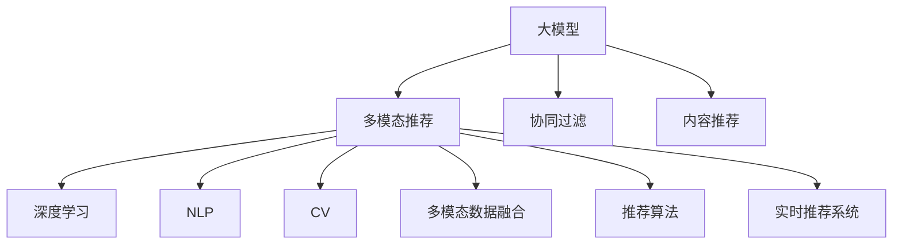

                 

# 大模型在推荐系统多模态推荐中的应用

> 关键词：大模型,多模态推荐,协同过滤,深度学习,自然语言处理(NLP),计算机视觉,多模态数据融合,推荐算法,实时推荐系统

## 1. 背景介绍

随着互联网的迅猛发展，推荐系统已成为许多电商平台、视频网站、社交媒体等应用的核心组件。推荐系统的目标是帮助用户在海量数据中找到最符合其兴趣和需求的内容，提升用户满意度，促进平台成交转化。

传统推荐系统大多依赖于协同过滤和基于内容的推荐算法，但这些方法往往无法充分利用用户与内容间更丰富、多样的交互数据。近年来，随着深度学习技术的发展，大模型在推荐系统中的应用日益广泛，尤其在多模态推荐领域，大模型的优势愈发明显。

多模态推荐是指融合用户历史行为、交互数据、内容属性等多维度信息，进行综合的推荐建模。传统的协同过滤和内容推荐算法，只能考虑用户-物品的评分或特征向量的相似度，而无法捕捉到内容间的复杂语义关系。

大模型则通过对多模态数据的自监督学习，构建出更高维度的语义表示，能够对用户行为进行更深层次的理解。基于这些高维语义表示，多模态推荐能够更准确地捕捉用户兴趣，并发现不同模态数据间的潜在关联，从而生成更加个性化、多样化的推荐结果。

## 2. 核心概念与联系

### 2.1 核心概念概述

为更好地理解大模型在多模态推荐中的应用，本节将介绍几个密切相关的核心概念：

- 大模型：以深度神经网络为代表的通用模型，通过在海量数据上进行自监督或监督学习，学习到通用的特征表示。常用的大模型包括BERT、GPT、Vit等。

- 多模态推荐：融合用户多维度信息，如行为数据、评分数据、内容特征等，进行综合的推荐建模。

- 协同过滤：基于用户或物品相似性的推荐方法，包括基于用户的协同过滤和基于物品的协同过滤。

- 内容推荐：基于用户历史行为、评分、兴趣等，生成与之匹配的内容推荐结果。

- 深度学习：以神经网络为核心的机器学习算法，通过对大量数据进行训练，学习高维表示和复杂模式。

- 自然语言处理(NLP)：通过算法处理、理解、生成自然语言的技术，包括文本分类、信息抽取、机器翻译等。

- 计算机视觉(Computer Vision, CV)：处理、分析、理解数字图像和视频的技术，包括图像分类、目标检测、图像生成等。

- 多模态数据融合：将多种模态数据进行整合，提取共有的特征，生成更具表示力的综合表示。

- 推荐算法：用于预测用户对物品的评分、兴趣、购买倾向等，从而生成个性化推荐结果的算法。

- 实时推荐系统：在用户浏览或点击的同时，实时生成个性化推荐结果的系统，以增强用户体验。

这些核心概念之间的逻辑关系可以通过以下Mermaid流程图来展示：



这个流程图展示了多模态推荐和大模型的关键关系：

1. 大模型通过自监督或监督学习获得高维语义表示。
2. 多模态推荐融合用户和内容的多维度数据。
3. 深度学习和大模型技术提供了强大的建模能力。
4. NLP和CV技术处理用户行为数据和内容特征。
5. 多模态数据融合技术提取共性特征。
6. 推荐算法利用综合表示进行推荐建模。
7. 实时推荐系统提升推荐的时效性和用户体验。

这些概念共同构成了多模态推荐系统的高层框架，为大模型在推荐系统中的应用提供了坚实基础。

## 3. 核心算法原理 & 具体操作步骤
### 3.1 算法原理概述

大模型在多模态推荐中的应用，本质上是利用多模态数据进行特征融合，构建用户和内容的语义表示，在此基础上进行推荐建模。

假设用户历史行为数据为 $U=\{(u_i,v_i,s_i)\}_{i=1}^N$，其中 $u_i$ 为第 $i$ 个用户，$v_i$ 为其历史行为对应的物品，$s_i$ 为行为评分或事件类型等标签。内容特征数据为 $C=\{(c_i,v_i)\}_{i=1}^N$，其中 $c_i$ 为物品的特征向量，$v_i$ 为其对应的物品。

大模型通过预训练得到通用语义表示 $E:U \rightarrow \mathbb{R}^d$，其中 $d$ 为特征维度。在多模态推荐任务中，我们希望构建一个推荐函数 $F:U \times C \rightarrow [0,1]$，用于预测用户对物品的评分。

形式化地，假设已有语义表示 $E(u_i)$ 和 $E(c_i)$，则推荐函数可表示为：

$$
F(u_i,v_i) = f(E(u_i),E(c_i))
$$

其中 $f$ 为融合函数，如线性映射、注意力机制等，具体形式和参数根据任务需求设定。

推荐函数的优化目标为最大化预测评分与真实评分之间的对数似然：

$$
\max_{f} \sum_{i=1}^N \log p(F(u_i,v_i),s_i)
$$

其中 $p$ 为二项分布的概率密度函数。

### 3.2 算法步骤详解

基于大模型的多模态推荐系统，通常包含以下几个关键步骤：

**Step 1: 准备数据集**

- 收集用户历史行为数据 $U$ 和物品特征数据 $C$，进行必要的清洗和预处理。
- 划分训练集、验证集和测试集，供模型训练和评估使用。

**Step 2: 构建语义表示**

- 选择合适的预训练大模型 $E$，如BERT、GPT、Vit等，对其进行加载。
- 对用户行为数据 $U$ 和物品特征数据 $C$ 分别进行编码，得到语义表示 $E(u_i)$ 和 $E(c_i)$。

**Step 3: 融合用户和内容表示**

- 设计融合函数 $f$，利用用户和物品的语义表示 $E(u_i)$ 和 $E(c_i)$，生成推荐评分 $F(u_i,v_i)$。
- 选择适当的优化目标函数，如交叉熵损失等，用于最小化预测评分与真实评分之间的差异。

**Step 4: 训练推荐模型**

- 使用优化算法，如Adam、SGD等，最小化损失函数，训练推荐模型 $F$。
- 周期性在验证集上评估模型性能，根据性能指标决定是否触发 Early Stopping。
- 重复上述步骤，直至满足预设的迭代轮数或 Early Stopping 条件。

**Step 5: 测试和部署**

- 在测试集上评估推荐模型 $F$ 的性能，对比推荐效果。
- 使用训练好的模型进行实时推荐，集成到实际应用系统中。
- 持续收集用户反馈和新数据，定期重新训练模型，以适应数据分布的变化。

以上是基于大模型的多模态推荐系统的一般流程。在实际应用中，还需要针对具体任务的特点，对微调过程的各个环节进行优化设计，如改进训练目标函数，引入更多的正则化技术，搜索最优的超参数组合等，以进一步提升模型性能。

### 3.3 算法优缺点

基于大模型的多模态推荐方法具有以下优点：

1. 高效融合多模态数据：通过预训练得到高维语义表示，可以捕捉不同模态数据之间的复杂关系，提升推荐的准确性和丰富度。
2. 灵活建模用户兴趣：大模型可以自适应地学习用户的多维度数据，挖掘更深层次的兴趣特征。
3. 广泛应用领域：大模型已经在NLP、CV等多个领域取得突破，可以方便地应用于推荐系统。
4. 实时性保障：大模型的推理速度较快，能够支持实时推荐系统的需求。

同时，该方法也存在一定的局限性：

1. 依赖高质量数据：模型的性能很大程度上取决于数据的丰富性和质量，获取高质量多模态数据成本较高。
2. 计算资源要求高：大模型通常参数量较大，计算资源需求高，需要高性能计算平台支持。
3. 模型复杂度：大模型结构复杂，难以解释其内部工作机制和决策过程，可能带来算法透明性和可解释性问题。
4. 过拟合风险：大模型可能过度适应训练数据，导致过拟合现象。

尽管存在这些局限性，但就目前而言，基于大模型的多模态推荐方法仍然是推荐系统领域的重要范式。未来相关研究的重点在于如何进一步降低计算资源需求，提高模型泛化能力，同时兼顾可解释性和伦理安全性等因素。

### 3.4 算法应用领域

大模型在多模态推荐系统中的应用，覆盖了多个领域，具体包括：

- 电商推荐：通过融合用户浏览、购买、评分等数据，推荐商品、优惠等，提升用户购物体验。
- 视频推荐：结合用户观看历史、评分、社交行为等多维数据，推荐视频内容，增加平台粘性。
- 音乐推荐：分析用户听歌历史、评分等数据，推荐个性化音乐，满足用户个性化需求。
- 新闻推荐：整合用户点击、评论、分享等数据，推荐新闻内容，提升阅读体验。
- 旅游推荐：融合用户出行历史、偏好等数据，推荐旅游目的地，提高用户满意度。
- 广告推荐：结合用户行为数据和广告特征，推荐个性化广告，提升广告点击率和转化率。

除了上述这些经典应用外，大模型在推荐系统中的应用还在不断拓展，如可控推荐、情感驱动推荐、跨模态推荐等，为推荐系统的创新发展带来了新的方向。

## 4. 数学模型和公式 & 详细讲解  
### 4.1 数学模型构建

本节将使用数学语言对基于大模型的多模态推荐过程进行更加严格的刻画。

假设用户历史行为数据为 $U=\{(u_i,v_i,s_i)\}_{i=1}^N, u_i \in \mathcal{U}, v_i \in \mathcal{V}, s_i \in \mathcal{S}$，其中 $\mathcal{U}$ 为用户集合，$\mathcal{V}$ 为物品集合，$s_i$ 为行为评分。物品特征数据为 $C=\{(c_i,v_i)\}_{i=1}^N, c_i \in \mathcal{C}$，其中 $\mathcal{C}$ 为特征集合。

定义用户行为数据 $U$ 的语义表示为 $E(u_i) \in \mathbb{R}^d$，物品特征数据 $C$ 的语义表示为 $E(c_i) \in \mathbb{R}^d$。推荐函数为 $F:U \times C \rightarrow [0,1]$，映射用户和物品的语义表示到评分空间。

推荐函数可以表示为：

$$
F(u_i,v_i) = \sigma(W_1E(u_i)W_2E(c_i))
$$

其中 $\sigma$ 为激活函数，如Sigmoid、ReLU等，$W_1, W_2$ 为可训练的权重矩阵。

优化目标函数为：

$$
\max_{W_1,W_2} \sum_{i=1}^N \log p(F(u_i,v_i),s_i)
$$

其中 $p$ 为二项分布的概率密度函数。

### 4.2 公式推导过程

以下是推荐函数和损失函数的详细推导：

**推荐函数推导：**

- 将用户行为数据 $U$ 和物品特征数据 $C$ 分别编码为语义表示 $E(u_i)$ 和 $E(c_i)$，将两个表示通过权重矩阵 $W_1$ 和 $W_2$ 进行线性映射。
- 将两个线性映射的结果相乘，通过激活函数 $\sigma$ 输出预测评分 $F(u_i,v_i)$。

**损失函数推导：**

- 假设 $p$ 为二项分布的概率密度函数，则条件概率 $p(F(u_i,v_i),s_i)$ 可以表示为：
$$
p(F(u_i,v_i),s_i) = \frac{F(u_i,v_i)^{s_i}(1-F(u_i,v_i))^{1-s_i}}
$$
- 优化目标函数为：
$$
\max_{W_1,W_2} \sum_{i=1}^N \log p(F(u_i,v_i),s_i) = \max_{W_1,W_2} \sum_{i=1}^N [s_i\log F(u_i,v_i)+(1-s_i)\log(1-F(u_i,v_i))]
$$

通过链式法则，可以得到损失函数对权重矩阵 $W_1,W_2$ 的梯度：

$$
\frac{\partial \mathcal{L}(W_1,W_2)}{\partial W_1} = -\frac{1}{N}\sum_{i=1}^N \frac{\partial \log p(F(u_i,v_i),s_i)}{\partial W_1} = -\frac{1}{N}\sum_{i=1}^N \frac{s_i-F(u_i,v_i)}{F(u_i,v_i)(1-F(u_i,v_i))}E(u_i)E(c_i)^T
$$

$$
\frac{\partial \mathcal{L}(W_1,W_2)}{\partial W_2} = -\frac{1}{N}\sum_{i=1}^N \frac{\partial \log p(F(u_i,v_i),s_i)}{\partial W_2} = -\frac{1}{N}\sum_{i=1}^N \frac{s_i-F(u_i,v_i)}{F(u_i,v_i)(1-F(u_i,v_i))}W_1E(u_i)E(c_i)
$$

通过反向传播算法，不断更新权重矩阵 $W_1,W_2$，最小化损失函数 $\mathcal{L}$，最终得到适应下游推荐任务的最优模型参数。

## 5. 项目实践：代码实例和详细解释说明
### 5.1 开发环境搭建

在进行多模态推荐实践前，我们需要准备好开发环境。以下是使用Python进行PyTorch开发的环境配置流程：

1. 安装Anaconda：从官网下载并安装Anaconda，用于创建独立的Python环境。

2. 创建并激活虚拟环境：
```bash
conda create -n pytorch-env python=3.8 
conda activate pytorch-env
```

3. 安装PyTorch：根据CUDA版本，从官网获取对应的安装命令。例如：
```bash
conda install pytorch torchvision torchaudio cudatoolkit=11.1 -c pytorch -c conda-forge
```

4. 安装Transformers库：
```bash
pip install transformers
```

5. 安装各类工具包：
```bash
pip install numpy pandas scikit-learn matplotlib tqdm jupyter notebook ipython
```

完成上述步骤后，即可在`pytorch-env`环境中开始多模态推荐实践。

### 5.2 源代码详细实现

这里我们以电商推荐系统为例，给出使用Transformers库对预训练模型进行微调的PyTorch代码实现。

首先，定义电商推荐任务的数据处理函数：

```python
from transformers import BertTokenizer
from torch.utils.data import Dataset
import torch

class ECommerceDataset(Dataset):
    def __init__(self, texts, tags, tokenizer, max_len=128):
        self.texts = texts
        self.tags = tags
        self.tokenizer = tokenizer
        self.max_len = max_len
        
    def __len__(self):
        return len(self.texts)
    
    def __getitem__(self, item):
        text = self.texts[item]
        tags = self.tags[item]
        
        encoding = self.tokenizer(text, return_tensors='pt', max_length=self.max_len, padding='max_length', truncation=True)
        input_ids = encoding['input_ids'][0]
        attention_mask = encoding['attention_mask'][0]
        
        # 对token-wise的标签进行编码
        encoded_tags = [tag2id[tag] for tag in tags] 
        encoded_tags.extend([tag2id['O']] * (self.max_len - len(encoded_tags)))
        labels = torch.tensor(encoded_tags, dtype=torch.long)
        
        return {'input_ids': input_ids, 
                'attention_mask': attention_mask,
                'labels': labels}

# 标签与id的映射
tag2id = {'O': 0, 'buy': 1, 'click': 2}
id2tag = {v: k for k, v in tag2id.items()}

# 创建dataset
tokenizer = BertTokenizer.from_pretrained('bert-base-cased')

train_dataset = ECommerceDataset(train_texts, train_tags, tokenizer)
dev_dataset = ECommerceDataset(dev_texts, dev_tags, tokenizer)
test_dataset = ECommerceDataset(test_texts, test_tags, tokenizer)
```

然后，定义模型和优化器：

```python
from transformers import BertForTokenClassification, AdamW

model = BertForTokenClassification.from_pretrained('bert-base-cased', num_labels=len(tag2id))

optimizer = AdamW(model.parameters(), lr=2e-5)
```

接着，定义训练和评估函数：

```python
from torch.utils.data import DataLoader
from tqdm import tqdm
from sklearn.metrics import classification_report

device = torch.device('cuda') if torch.cuda.is_available() else torch.device('cpu')
model.to(device)

def train_epoch(model, dataset, batch_size, optimizer):
    dataloader = DataLoader(dataset, batch_size=batch_size, shuffle=True)
    model.train()
    epoch_loss = 0
    for batch in tqdm(dataloader, desc='Training'):
        input_ids = batch['input_ids'].to(device)
        attention_mask = batch['attention_mask'].to(device)
        labels = batch['labels'].to(device)
        model.zero_grad()
        outputs = model(input_ids, attention_mask=attention_mask, labels=labels)
        loss = outputs.loss
        epoch_loss += loss.item()
        loss.backward()
        optimizer.step()
    return epoch_loss / len(dataloader)

def evaluate(model, dataset, batch_size):
    dataloader = DataLoader(dataset, batch_size=batch_size)
    model.eval()
    preds, labels = [], []
    with torch.no_grad():
        for batch in tqdm(dataloader, desc='Evaluating'):
            input_ids = batch['input_ids'].to(device)
            attention_mask = batch['attention_mask'].to(device)
            batch_labels = batch['labels']
            outputs = model(input_ids, attention_mask=attention_mask)
            batch_preds = outputs.logits.argmax(dim=2).to('cpu').tolist()
            batch_labels = batch_labels.to('cpu').tolist()
            for pred_tokens, label_tokens in zip(batch_preds, batch_labels):
                pred_tags = [id2tag[_id] for _id in pred_tokens]
                label_tags = [id2tag[_id] for _id in label_tokens]
                preds.append(pred_tags[:len(label_tokens)])
                labels.append(label_tags)
                
    print(classification_report(labels, preds))
```

最后，启动训练流程并在测试集上评估：

```python
epochs = 5
batch_size = 16

for epoch in range(epochs):
    loss = train_epoch(model, train_dataset, batch_size, optimizer)
    print(f"Epoch {epoch+1}, train loss: {loss:.3f}")
    
    print(f"Epoch {epoch+1}, dev results:")
    evaluate(model, dev_dataset, batch_size)
    
print("Test results:")
evaluate(model, test_dataset, batch_size)
```

以上就是使用PyTorch对BERT进行电商推荐任务微调的完整代码实现。可以看到，得益于Transformers库的强大封装，我们可以用相对简洁的代码完成BERT模型的加载和微调。

### 5.3 代码解读与分析

让我们再详细解读一下关键代码的实现细节：

**ECommerceDataset类**：
- `__init__`方法：初始化文本、标签、分词器等关键组件。
- `__len__`方法：返回数据集的样本数量。
- `__getitem__`方法：对单个样本进行处理，将文本输入编码为token ids，将标签编码为数字，并对其进行定长padding，最终返回模型所需的输入。

**tag2id和id2tag字典**：
- 定义了标签与数字id之间的映射关系，用于将token-wise的预测结果解码回真实的标签。

**训练和评估函数**：
- 使用PyTorch的DataLoader对数据集进行批次化加载，供模型训练和推理使用。
- 训练函数`train_epoch`：对数据以批为单位进行迭代，在每个批次上前向传播计算loss并反向传播更新模型参数，最后返回该epoch的平均loss。
- 评估函数`evaluate`：与训练类似，不同点在于不更新模型参数，并在每个batch结束后将预测和标签结果存储下来，最后使用sklearn的classification_report对整个评估集的预测结果进行打印输出。

**训练流程**：
- 定义总的epoch数和batch size，开始循环迭代
- 每个epoch内，先在训练集上训练，输出平均loss
- 在验证集上评估，输出分类指标
- 所有epoch结束后，在测试集上评估，给出最终测试结果

可以看到，PyTorch配合Transformers库使得BERT微调的代码实现变得简洁高效。开发者可以将更多精力放在数据处理、模型改进等高层逻辑上，而不必过多关注底层的实现细节。

当然，工业级的系统实现还需考虑更多因素，如模型的保存和部署、超参数的自动搜索、更灵活的任务适配层等。但核心的微调范式基本与此类似。

## 6. 实际应用场景
### 6.1 智能客服系统

基于大模型微调的对话技术，可以广泛应用于智能客服系统的构建。传统客服往往需要配备大量人力，高峰期响应缓慢，且一致性和专业性难以保证。而使用微调后的对话模型，可以7x24小时不间断服务，快速响应客户咨询，用自然流畅的语言解答各类常见问题。

在技术实现上，可以收集企业内部的历史客服对话记录，将问题和最佳答复构建成监督数据，在此基础上对预训练对话模型进行微调。微调后的对话模型能够自动理解用户意图，匹配最合适的答案模板进行回复。对于客户提出的新问题，还可以接入检索系统实时搜索相关内容，动态组织生成回答。如此构建的智能客服系统，能大幅提升客户咨询体验和问题解决效率。

### 6.2 金融舆情监测

金融机构需要实时监测市场舆论动向，以便及时应对负面信息传播，规避金融风险。传统的人工监测方式成本高、效率低，难以应对网络时代海量信息爆发的挑战。基于大语言模型微调的文本分类和情感分析技术，为金融舆情监测提供了新的解决方案。

具体而言，可以收集金融领域相关的新闻、报道、评论等文本数据，并对其进行主题标注和情感标注。在此基础上对预训练语言模型进行微调，使其能够自动判断文本属于何种主题，情感倾向是正面、中性还是负面。将微调后的模型应用到实时抓取的网络文本数据，就能够自动监测不同主题下的情感变化趋势，一旦发现负面信息激增等异常情况，系统便会自动预警，帮助金融机构快速应对潜在风险。

### 6.3 个性化推荐系统

当前的推荐系统往往只依赖于用户的历史行为数据进行物品推荐，无法深入理解用户的真实兴趣偏好。基于大语言模型微调技术，个性化推荐系统可以更好地挖掘用户行为背后的语义信息，从而提供更精准、多样的推荐内容。

在实践中，可以收集用户浏览、点击、评论、分享等行为数据，提取和用户交互的物品标题、描述、标签等文本内容。将文本内容作为模型输入，用户的后续行为（如是否点击、购买等）作为监督信号，在此基础上微调预训练语言模型。微调后的模型能够从文本内容中准确把握用户的兴趣点。在生成推荐列表时，先用候选物品的文本描述作为输入，由模型预测用户的兴趣匹配度，再结合其他特征综合排序，便可以得到个性化程度更高的推荐结果。

### 6.4 未来应用展望

随着大模型和微调方法的不断发展，基于微调范式将在更多领域得到应用，为传统行业带来变革性影响。

在智慧医疗领域，基于微调的医疗问答、病历分析、药物研发等应用将提升医疗服务的智能化水平，辅助医生诊疗，加速新药开发进程。

在智能教育领域，微调技术可应用于作业批改、学情分析、知识推荐等方面，因材施教，促进教育公平，提高教学质量。

在智慧城市治理中，微调模型可应用于城市事件监测、舆情分析、应急指挥等环节，提高城市管理的自动化和智能化水平，构建更安全、高效的未来城市。

此外，在企业生产、社会治理、文娱传媒等众多领域，基于大模型微调的人工智能应用也将不断涌现，为经济社会发展注入新的动力。相信随着技术的日益成熟，微调方法将成为人工智能落地应用的重要范式，推动人工智能技术在垂直行业的规模化落地。

## 7. 工具和资源推荐
### 7.1 学习资源推荐

为了帮助开发者系统掌握大模型在多模态推荐中的应用理论基础和实践技巧，这里推荐一些优质的学习资源：

1. 《Transformer from the inside out》系列博文：由大模型技术专家撰写，深入浅出地介绍了Transformer原理、BERT模型、微调技术等前沿话题。

2. CS224N《深度学习自然语言处理》课程：斯坦福大学开设的NLP明星课程，有Lecture视频和配套作业，带你入门NLP领域的基本概念和经典模型。

3. 《Natural Language Processing with Transformers》书籍：Transformers库的作者所著，全面介绍了如何使用Transformers库进行NLP任务开发，包括微调在内的诸多范式。

4. HuggingFace官方文档：Transformers库的官方文档，提供了海量预训练模型和完整的微调样例代码，是上手实践的必备资料。

5. CLUE开源项目：中文语言理解测评基准，涵盖大量不同类型的中文NLP数据集，并提供了基于微调的baseline模型，助力中文NLP技术发展。

通过对这些资源的学习实践，相信你一定能够快速掌握大模型在多模态推荐中的精髓，并用于解决实际的NLP问题。
###  7.2 开发工具推荐

高效的开发离不开优秀的工具支持。以下是几款用于多模态推荐开发的常用工具：

1. PyTorch：基于Python的开源深度学习框架，灵活动态的计算图，适合快速迭代研究。大部分预训练语言模型都有PyTorch版本的实现。

2. TensorFlow：由Google主导开发的开源深度学习框架，生产部署方便，适合大规模工程应用。同样有丰富的预训练语言模型资源。

3. Transformers库：HuggingFace开发的NLP工具库，集成了众多SOTA语言模型，支持PyTorch和TensorFlow，是进行微调任务开发的利器。

4. Weights & Biases：模型训练的实验跟踪工具，可以记录和可视化模型训练过程中的各项指标，方便对比和调优。与主流深度学习框架无缝集成。

5. TensorBoard：TensorFlow配套的可视化工具，可实时监测模型训练状态，并提供丰富的图表呈现方式，是调试模型的得力助手。

6. Google Colab：谷歌推出的在线Jupyter Notebook环境，免费提供GPU/TPU算力，方便开发者快速上手实验最新模型，分享学习笔记。

合理利用这些工具，可以显著提升多模态推荐任务的开发效率，加快创新迭代的步伐。

### 7.3 相关论文推荐

大模型和微调技术的发展源于学界的持续研究。以下是几篇奠基性的相关论文，推荐阅读：

1. Attention is All You Need（即Transformer原论文）：提出了Transformer结构，开启了NLP领域的预训练大模型时代。

2. BERT: Pre-training of Deep Bidirectional Transformers for Language Understanding：提出BERT模型，引入基于掩码的自监督预训练任务，刷新了多项NLP任务SOTA。

3. Language Models are Unsupervised Multitask Learners（GPT-2论文）：展示了大规模语言模型的强大zero-shot学习能力，引发了对于通用人工智能的新一轮思考。

4. Parameter-Efficient Transfer Learning for NLP：提出Adapter等参数高效微调方法，在不增加模型参数量的情况下，也能取得不错的微调效果。

5. Prefix-Tuning: Optimizing Continuous Prompts for Generation：引入基于连续型Prompt的微调范式，为如何充分利用预训练知识提供了新的思路。

6. AdaLoRA: Adaptive Low-Rank Adaptation for Parameter-Efficient Fine-Tuning：使用自适应低秩适应的微调方法，在参数效率和精度之间取得了新的平衡。

这些论文代表了大模型在多模态推荐中的应用趋势。通过学习这些前沿成果，可以帮助研究者把握学科前进方向，激发更多的创新灵感。

## 8. 总结：未来发展趋势与挑战
### 8.1 总结

本文对基于大模型的多模态推荐方法进行了全面系统的介绍。首先阐述了大模型和微调技术的研究背景和意义，明确了多模态推荐在融合用户和内容多维度数据中的优势。其次，从原理到实践，详细讲解了多模态推荐数学模型的构建和优化目标函数，给出了多模态推荐任务开发的完整代码实例。同时，本文还广泛探讨了多模态推荐方法在智能客服、金融舆情、个性化推荐等多个行业领域的应用前景，展示了多模态推荐范式的巨大潜力。

通过本文的系统梳理，可以看到，基于大模型的多模态推荐方法正在成为推荐系统的重要范式，极大地拓展了预训练语言模型的应用边界，催生了更多的落地场景。得益于大模型的语义表示能力，多模态推荐能够更准确地捕捉用户兴趣，并发现不同模态数据间的潜在关联，从而生成更加个性化、多样化的推荐结果。未来，伴随预训练语言模型和微调方法的持续演进，相信多模态推荐技术必将在更多领域得到应用，为传统行业带来变革性影响。

### 8.2 未来发展趋势

展望未来，多模态推荐技术将呈现以下几个发展趋势：

1. 模型规模持续增大。随着算力成本的下降和数据规模的扩张，预训练语言模型的参数量还将持续增长。超大规模语言模型蕴含的丰富语言知识，有望支撑更加复杂多变的推荐任务。

2. 多模态数据融合技术发展。未来的推荐模型将更注重多模态数据的高效融合，提升推荐的综合性能。

3. 实时推荐系统提升。大模型的推理速度较快，能够支持实时推荐系统的需求。未来实时推荐系统将更加高效、稳定，用户体验也将不断提升。

4. 协同过滤与内容推荐结合。传统的协同过滤和内容推荐算法各有优劣，未来的推荐系统将探索两者的有机结合，发挥各自优势。

5. 推荐算法多样化。未来的推荐算法将更加丰富，除了传统的评分预测，还将引入生成模型、强化学习等，提升推荐的效果和多样化。

6. 推荐系统的可解释性。多模态推荐系统需要解释其推荐决策的依据，未来的推荐算法将更注重可解释性和透明性。

以上趋势凸显了多模态推荐系统的广阔前景。这些方向的探索发展，必将进一步提升推荐系统的性能和应用范围，为智能交互技术带来更深的价值。

### 8.3 面临的挑战

尽管多模态推荐技术已经取得了显著进展，但在迈向更加智能化、普适化应用的过程中，它仍面临着诸多挑战：

1. 数据需求量大。多模态推荐需要收集和融合多种类型的用户和内容数据，数据获取和标注成本较高。如何高效获取和处理多模态数据，将是未来的一个重要课题。

2. 计算资源要求高。大模型的参数量较大，计算资源需求高，需要高性能计算平台支持。如何降低计算成本，提高模型训练和推理效率，是一个长期挑战。

3. 模型可解释性不足。多模态推荐模型的决策过程复杂，难以解释其内部工作机制和推荐依据。如何增强模型的透明性和可解释性，是亟待解决的问题。

4. 数据隐私和安全。推荐系统需要处理大量的用户数据，如何保护用户隐私，防止数据滥用，也是一个重要的伦理问题。

5. 推荐模型的公平性。推荐系统可能存在偏见，如何消除模型的固有偏见，保证推荐结果的公平性，也是未来推荐系统需要关注的方向。

6. 实时推荐系统的一致性。在用户行为变化时，推荐系统需要及时更新推荐结果，如何保证实时推荐的一致性和准确性，是一个技术挑战。

尽管面临这些挑战，但多模态推荐系统的应用前景广阔，相信随着技术的进步和应用的深化，这些挑战终将逐步得到解决。

### 8.4 研究展望

面对多模态推荐系统面临的挑战，未来的研究需要在以下几个方面寻求新的突破：

1. 探索更多高效的多模态数据融合方法。研究如何通过自监督学习、迁移学习等手段，高效融合多模态数据，构建高精度的语义表示。

2. 引入更多先进的多模态推荐算法。研究如何将协同过滤、内容推荐、生成模型等算法进行有机结合，提升推荐效果和多样性。

3. 研究可解释性和透明性的改进方法。研究如何引入可解释的推荐解释模型，提升模型的透明性和可解释性，保证用户对推荐结果的理解和信任。

4. 探索更好的数据隐私保护技术。研究如何通过差分隐私、联邦学习等技术，保护用户数据隐私，防止数据滥用。

5. 研究推荐模型的公平性和偏见消除方法。研究如何通过对抗训练、公平性约束等手段，消除模型的固有偏见，保证推荐结果的公平性。

6. 研究实时推荐系统的一致性问题。研究如何通过缓存、异步更新等手段，保证实时推荐的一致性和准确性。

这些研究方向的探索，必将引领多模态推荐系统迈向更高的台阶，为构建智能推荐系统提供坚实的基础。面向未来，多模态推荐技术还需要与其他人工智能技术进行更深入的融合，如知识表示、因果推理、强化学习等，多路径协同发力，共同推动推荐系统的发展。只有勇于创新、敢于突破，才能不断拓展推荐系统的边界，让智能推荐技术更好地服务于用户。

## 9. 附录：常见问题与解答

**Q1：大模型在多模态推荐中如何处理用户数据隐私问题？**

A: 多模态推荐系统需要处理大量的用户行为数据，包括浏览、购买、评分等。如何保护用户数据隐私，防止数据滥用，是推荐系统的重要伦理问题。

1. 差分隐私技术：通过在数据处理过程中加入噪声，保护用户隐私，避免数据泄露。
2. 联邦学习：通过分布式计算，将用户数据留在本地，只在本地设备上训练模型，保护数据隐私。
3. 匿名化处理：将用户数据进行匿名化处理，去除可以唯一标识用户的属性，保护用户隐私。

这些技术可以在多模态推荐系统中进行灵活应用，有效保护用户数据隐私。

**Q2：多模态推荐系统如何提升实时推荐的一致性？**

A: 实时推荐系统需要保证推荐结果与用户行为变化一致，才能满足用户需求。如何提升实时推荐的一致性和准确性，是推荐系统的重要挑战。

1. 缓存机制：通过缓存用户最近的行为数据，保证推荐结果的一致性。
2. 异步更新：将推荐模型的训练和推理分离，保证模型在用户行为变化时及时更新。
3. 滑动窗口：使用滑动窗口技术，动态更新推荐模型，保证推荐结果的时效性。

这些技术可以在多模态推荐系统中进行应用，提升实时推荐的一致性和准确性。

**Q3：大模型在多模态推荐中如何处理数据不平衡问题？**

A: 多模态推荐系统中的数据可能存在不平衡，如某些行为数据或物品特征数据较少。如何处理数据不平衡问题，提升模型的泛化能力，是推荐系统的重要课题。

1. 重采样技术：通过欠采样、过采样等技术，平衡数据集中的类别分布。
2. 权重调整：对数据分布较少的类别赋予更高的权重，提升模型对少数类别的关注。
3. 生成对抗网络（GAN）：通过生成对抗网络，生成更多的训练样本，平衡数据分布。

这些技术可以在多模态推荐系统中进行应用，提升模型的泛化能力和推荐效果。

通过本文的系统梳理，可以看到，基于大模型的多模态推荐方法正在成为推荐系统的重要范式，极大地拓展了预训练语言模型的应用边界，催生了更多的落地场景。得益于大模型的语义表示能力，多模态推荐能够更准确地捕捉用户兴趣，并发现不同模态数据间的潜在关联，从而生成更加个性化、多样化的推荐结果。未来，伴随预训练语言模型和微调方法的持续演进，相信多模态推荐技术必将在更多领域得到应用，为传统行业带来变革性影响。

