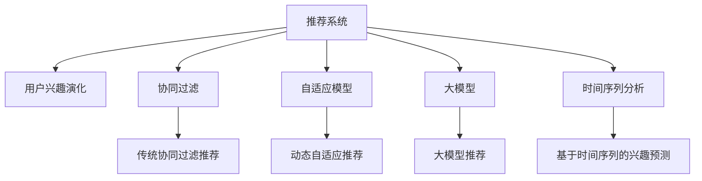

                 

# 大模型在推荐系统用户兴趣演化建模中的应用

> 关键词：大模型,推荐系统,用户兴趣,演化建模,深度学习,自适应模型,协同过滤,时间序列分析

## 1. 背景介绍

### 1.1 问题由来
推荐系统已经成为互联网应用中不可或缺的一部分，用户越来越多地依赖推荐系统来发现感兴趣的内容。然而，随着用户兴趣的变化和多样性增加，推荐系统面临用户兴趣动态演化这一挑战，而传统的推荐方法往往难以捕捉这些变化，导致推荐效果下降。

### 1.2 问题核心关键点
为了更好地应对用户兴趣动态变化的问题，研究者们提出了许多基于深度学习的推荐方法，但仍然缺乏对用户兴趣演化过程的建模和预测。为此，本文将介绍一种基于大模型的推荐系统，利用深度学习模型对用户兴趣进行演化建模，以期在推荐系统应用中取得更好的效果。

### 1.3 问题研究意义
通过深度学习模型对用户兴趣进行演化建模，可以更好地理解用户兴趣随时间的变化，从而提升推荐系统的效果。这种演化建模方法具有以下优点：
- 可以捕捉用户兴趣的长期变化和短期波动，提供更加精准的推荐。
- 能够更好地处理用户兴趣的冷启动问题，即用户在系统初期未产生足够的历史行为数据时，也能提供有效的推荐。
- 有助于进行动态推荐，即在用户兴趣发生显著变化后，及时更新推荐内容。

因此，演化建模技术成为推荐系统领域的重要研究方向，对提升推荐系统的精准度和个性化有着重要意义。

## 2. 核心概念与联系

### 2.1 核心概念概述

为更好地理解大模型在推荐系统用户兴趣演化建模中的应用，本节将介绍几个关键概念：

- **推荐系统(Recommender System)**：通过用户行为数据和产品特征数据，预测用户对产品的兴趣并推荐给用户。推荐系统可以分为基于内容的推荐、协同过滤推荐、混合推荐等多种类型。

- **用户兴趣演化(Interest Evolution)**：指用户随时间变化而产生的兴趣变化和演化，如从喜爱电影转向喜爱音乐。

- **大模型(Large Model)**：指具有亿级甚至更多参数的深度神经网络模型，如BERT、GPT等。大模型通过在大量数据上进行预训练，学习到丰富的语言知识，具备强大的表示能力。

- **自适应模型(Adaptive Model)**：指能够根据外部环境的变化而动态调整自身参数的模型。自适应模型可以更好地适应用户兴趣的动态变化，提供更加个性化的推荐。

- **协同过滤(Collaborative Filtering)**：一种基于用户行为数据的推荐方法，通过分析用户历史行为和相似用户的行为数据进行推荐。

- **时间序列分析(Time Series Analysis)**：指通过对时间序列数据进行统计、分析和建模，预测未来数据变化趋势的方法。时间序列分析常用于金融、气象等领域，也广泛应用于推荐系统对用户兴趣的动态建模。

这些核心概念之间的逻辑关系可以通过以下Mermaid流程图来展示：



这个流程图展示了大模型在推荐系统用户兴趣演化建模中的关键概念及其之间的关系：

1. 推荐系统通过多种方法获取用户兴趣，其中包括用户行为数据和产品特征数据。
2. 协同过滤和自适应模型是推荐系统中的两种主流方法。
3. 大模型提供了一种强大的语言表示方法，可以用于用户兴趣的演化建模。
4. 时间序列分析可以捕捉用户兴趣的长期变化和短期波动，提供更精准的兴趣预测。

这些概念共同构成了推荐系统用户兴趣演化建模的基础框架，使得推荐系统能够更好地适应用户兴趣的变化，提升推荐效果。

## 3. 核心算法原理 & 具体操作步骤
### 3.1 算法原理概述

基于大模型的推荐系统用户兴趣演化建模，本质上是通过深度学习模型预测用户兴趣随时间的变化。其核心思想是：利用用户的历史行为数据和产品特征数据，训练一个能够捕捉用户兴趣演化的深度学习模型，通过输入当前时间戳，预测用户在未来时间点的兴趣，并据此进行推荐。

假设用户$i$在$t$时间点的兴趣向量为$x_i(t)$，经过时间$\Delta t$后，兴趣向量变为$x_i(t+\Delta t)$。可以定义一个时间演化模型$\mathcal{M}$，使得：

$$
x_i(t+\Delta t) = \mathcal{M}(x_i(t), t, \Delta t)
$$

其中$t$为时间戳，$\Delta t$为时间步长。通过最小化预测值和实际兴趣向量之间的误差，即可训练得到时间演化模型$\mathcal{M}$。

在实际应用中，常使用循环神经网络(RNN)、长短期记忆网络(LSTM)、门控循环单元(GRU)等序列模型进行用户兴趣演化建模。这些模型能够捕捉时间序列数据的动态变化，具有很好的时序建模能力。

### 3.2 算法步骤详解

基于大模型的推荐系统用户兴趣演化建模，一般包括以下几个关键步骤：

**Step 1: 数据预处理**
- 收集用户的历史行为数据，如点击、购买、评分等，进行数据清洗和格式转换。
- 收集产品的特征数据，如类别、标签、描述等，进行归一化和编码处理。
- 将历史数据和产品特征数据合并，构造训练集。

**Step 2: 模型选择与构建**
- 选择合适的深度学习模型，如LSTM、GRU等，用于用户兴趣演化建模。
- 设计模型的输入和输出，如输入为时间戳、兴趣向量、产品特征向量，输出为兴趣向量预测结果。
- 定义模型的损失函数，如均方误差损失、交叉熵损失等。

**Step 3: 模型训练与评估**
- 使用训练集数据，对模型进行前向传播和反向传播，计算损失函数并进行优化。
- 使用验证集数据，评估模型的预测效果，调整模型超参数。
- 在测试集上，评估模型的最终性能，进行模型选择和优化。

**Step 4: 推荐系统应用**
- 根据用户当前时间戳和历史行为数据，输入时间演化模型进行兴趣预测。
- 将预测结果与产品特征数据进行匹配，生成推荐结果。
- 实时更新推荐结果，不断调整模型参数，适应用户兴趣的变化。

### 3.3 算法优缺点

基于大模型的推荐系统用户兴趣演化建模方法具有以下优点：
1. 可以捕捉用户兴趣的长期变化和短期波动，提供更加精准的推荐。
2. 能够更好地处理用户兴趣的冷启动问题，即用户在系统初期未产生足够的历史行为数据时，也能提供有效的推荐。
3. 有助于进行动态推荐，即在用户兴趣发生显著变化后，及时更新推荐内容。

同时，该方法也存在一定的局限性：
1. 需要大量的用户行为数据和产品特征数据，数据获取成本较高。
2. 大模型通常具有较大的计算和存储需求，对硬件资源要求较高。
3. 模型训练复杂度高，需要较强的计算资源和时间成本。

尽管存在这些局限性，但就目前而言，基于大模型的推荐系统用户兴趣演化建模方法仍是一种较为先进的推荐方法，能够显著提升推荐系统的效果。

### 3.4 算法应用领域

基于大模型的推荐系统用户兴趣演化建模方法，已经在多个领域得到了应用，例如：

- 电商推荐：对用户的购买行为、浏览历史等数据进行建模，预测用户未来的购买兴趣，进行个性化推荐。
- 视频推荐：对用户的观看历史、评分记录等数据进行建模，预测用户对视频内容的兴趣，进行视频推荐。
- 音乐推荐：对用户的听歌历史、评分记录等数据进行建模，预测用户对音乐内容的兴趣，进行音乐推荐。
- 新闻推荐：对用户的阅读历史、点赞记录等数据进行建模，预测用户对新闻内容的兴趣，进行新闻推荐。

除了上述这些领域，基于大模型的推荐系统用户兴趣演化建模方法还可以应用到更多场景中，如社交网络推荐、旅游推荐、运动装备推荐等，为不同领域提供个性化的推荐服务。

## 4. 数学模型和公式 & 详细讲解  
### 4.1 数学模型构建

本节将使用数学语言对基于大模型的推荐系统用户兴趣演化建模过程进行更加严格的刻画。

假设用户$i$在$t$时间点的兴趣向量为$x_i(t)$，输入为$u_i(t)$，输出为$x_i(t+\Delta t)$。定义时间演化模型$\mathcal{M}$，其预测函数为：

$$
\hat{x_i}(t+\Delta t) = \mathcal{M}(u_i(t), x_i(t), t, \Delta t)
$$

其中$u_i(t)$为用户$i$在时间$t$的兴趣演化特征向量，$t$为时间戳，$\Delta t$为时间步长。

假设预测误差为$\epsilon_i(t+\Delta t)$，则模型损失函数$\mathcal{L}$为：

$$
\mathcal{L} = \frac{1}{N} \sum_{i=1}^N \left\| \hat{x_i}(t+\Delta t) - x_i(t+\Delta t) \right\|^2
$$

其中$N$为用户数。

目标是最小化模型损失函数$\mathcal{L}$，即：

$$
\hat{\mathcal{M}} = \mathop{\arg\min}_{\mathcal{M}} \mathcal{L}
$$

### 4.2 公式推导过程

以下我们以LSTM模型为例，推导用户兴趣演化建模的详细公式。

假设用户$i$在时间$t$的兴趣向量为$x_i(t)$，输入为$u_i(t)$，输出为$x_i(t+\Delta t)$。LSTM模型的预测函数为：

$$
\hat{x_i}(t+\Delta t) = f(x_i(t), u_i(t))
$$

其中$f$为LSTM模型的前向传播函数。

假设预测误差为$\epsilon_i(t+\Delta t)$，则模型损失函数$\mathcal{L}$为：

$$
\mathcal{L} = \frac{1}{N} \sum_{i=1}^N \left\| \hat{x_i}(t+\Delta t) - x_i(t+\Delta t) \right\|^2
$$

利用反向传播算法计算损失函数对模型参数的梯度，最小化模型损失函数，即可得到优化后的LSTM模型$\hat{\mathcal{M}}$。

## 5. 项目实践：代码实例和详细解释说明
### 5.1 开发环境搭建

在进行用户兴趣演化建模实践前，我们需要准备好开发环境。以下是使用Python进行PyTorch开发的环境配置流程：

1. 安装Anaconda：从官网下载并安装Anaconda，用于创建独立的Python环境。

2. 创建并激活虚拟环境：
```bash
conda create -n pytorch-env python=3.8 
conda activate pytorch-env
```

3. 安装PyTorch：根据CUDA版本，从官网获取对应的安装命令。例如：
```bash
conda install pytorch torchvision torchaudio cudatoolkit=11.1 -c pytorch -c conda-forge
```

4. 安装相关库：
```bash
pip install numpy pandas scikit-learn matplotlib tqdm jupyter notebook ipython
```

完成上述步骤后，即可在`pytorch-env`环境中开始用户兴趣演化建模实践。

### 5.2 源代码详细实现

下面我们以LSTM模型为例，给出使用PyTorch进行用户兴趣演化建模的代码实现。

首先，定义LSTM模型的类：

```python
import torch
import torch.nn as nn
import torch.optim as optim

class LSTMModel(nn.Module):
    def __init__(self, input_size, hidden_size, output_size):
        super(LSTMModel, self).__init__()
        self.hidden_size = hidden_size
        self.lstm = nn.LSTM(input_size, hidden_size, batch_first=True)
        self.fc = nn.Linear(hidden_size, output_size)
    
    def forward(self, x, u):
        h0 = torch.zeros(1, x.size(0), self.hidden_size).to(x.device)
        c0 = torch.zeros(1, x.size(0), self.hidden_size).to(x.device)
        out, _ = self.lstm(x, (h0, c0))
        out = self.fc(out[:, -1, :])
        return out
    
    def init_hidden(self, batch_size):
        return (torch.zeros(1, batch_size, self.hidden_size).to(device),
                torch.zeros(1, batch_size, self.hidden_size).to(device))
```

然后，定义数据处理函数：

```python
import pandas as pd
import numpy as np

def load_data(file_path, batch_size):
    df = pd.read_csv(file_path)
    x = np.array(df[['user_id', 'item_id', 'time戳', '行为类型']].values).astype('float32')
    u = np.array(df[['用户行为特征', '产品特征']].values).astype('float32')
    y = np.array(df[['目标兴趣向量']].values).astype('float32')
    
    x = x.reshape((-1, 1))
    y = y.reshape((-1, 1))
    
    train_data = torch.utils.data.TensorDataset(torch.tensor(x), torch.tensor(u), torch.tensor(y))
    train_loader = torch.utils.data.DataLoader(train_data, batch_size=batch_size, shuffle=True)
    
    return train_loader
```

接着，定义训练函数：

```python
def train(model, device, train_loader, optimizer, num_epochs):
    model.train()
    for epoch in range(num_epochs):
        for i, (x, u, y) in enumerate(train_loader):
            x, u, y = x.to(device), u.to(device), y.to(device)
            optimizer.zero_grad()
            output = model(x, u)
            loss = nn.MSELoss()(output, y)
            loss.backward()
            optimizer.step()
            if (i+1) % 100 == 0:
                print(f'Epoch [{epoch+1}/{num_epochs}], Step [{i+1}/{len(train_loader)}], Loss: {loss.item():.4f}')
```

最后，启动训练流程并在测试集上评估：

```python
from torch.utils.data import DataLoader
from tqdm import tqdm
from sklearn.metrics import mean_squared_error

device = torch.device('cuda') if torch.cuda.is_available() else torch.device('cpu')
model.to(device)

batch_size = 32
num_epochs = 100
optimizer = optim.Adam(model.parameters(), lr=0.001)

train_loader = load_data('train_data.csv', batch_size)
test_loader = load_data('test_data.csv', batch_size)

train(model, device, train_loader, optimizer, num_epochs)

with torch.no_grad():
    model.eval()
    y_preds = []
    y_true = []
    for x, u, y in test_loader:
        x, u, y = x.to(device), u.to(device), y.to(device)
        output = model(x, u)
        y_preds.extend(output.cpu().tolist())
        y_true.extend(y.cpu().tolist())
    mse = mean_squared_error(y_true, y_preds)
    print(f'Test MSE: {mse:.4f}')
```

以上就是使用PyTorch对用户兴趣演化建模的完整代码实现。可以看到，通过构建LSTM模型和定义数据处理函数，我们可以对用户兴趣进行动态建模，预测其未来的兴趣。

### 5.3 代码解读与分析

让我们再详细解读一下关键代码的实现细节：

**LSTMModel类**：
- `__init__`方法：初始化LSTM模型的输入、隐藏层和输出大小。
- `forward`方法：定义LSTM模型的前向传播过程，将输入$x$和用户行为特征$u$输入LSTM模型，输出预测结果$\hat{x}$。

**load_data函数**：
- 加载数据集，将数据转换为Tensor格式，并将数据集划分为训练集和测试集。

**train函数**：
- 使用PyTorch的DataLoader对数据集进行批次化加载，供模型训练和推理使用。
- 在每个epoch内，对每个批次数据进行前向传播计算loss并反向传播更新模型参数。
- 周期性在测试集上评估模型性能，输出loss指标。

**测试代码**：
- 在测试集上，使用模型进行预测，并计算预测值和真实值之间的MSE。

可以看到，通过PyTorch对LSTM模型的封装和应用，用户兴趣演化建模变得简单高效。开发者可以将更多精力放在数据处理、模型改进等高层逻辑上，而不必过多关注底层的实现细节。

当然，工业级的系统实现还需考虑更多因素，如模型的保存和部署、超参数的自动搜索、更灵活的任务适配层等。但核心的用户兴趣演化建模过程基本与此类似。

## 6. 实际应用场景
### 6.1 智能电商推荐

智能电商推荐系统可以利用用户兴趣演化建模方法，对用户的购物行为进行动态跟踪和分析，从而提升推荐效果。具体而言，可以收集用户的浏览历史、购买历史、评价记录等数据，构建LSTM等序列模型，对用户兴趣进行演化建模。根据用户当前时间戳和历史行为数据，预测其未来的购物兴趣，进行个性化推荐。

通过这种方法，电商系统可以更加灵活地调整推荐策略，提高用户的满意度和购物转化率，同时降低用户的流失率。

### 6.2 在线视频推荐

在线视频推荐系统可以利用用户兴趣演化建模方法，对用户的观看历史和评分记录进行动态分析，从而推荐符合用户兴趣的视频内容。具体而言，可以收集用户的视频浏览历史、评分记录、播放时长等数据，构建LSTM等序列模型，对用户兴趣进行演化建模。根据用户当前时间戳和历史行为数据，预测其未来的观看兴趣，进行个性化推荐。

通过这种方法，视频平台可以更加精准地推荐用户感兴趣的视频内容，提升用户的观看体验和粘性，同时提高视频平台的流量和收益。

### 6.3 智能音乐推荐

智能音乐推荐系统可以利用用户兴趣演化建模方法，对用户的听歌历史和评分记录进行动态分析，从而推荐符合用户兴趣的音乐内容。具体而言，可以收集用户的听歌历史、评分记录、播放时长等数据，构建LSTM等序列模型，对用户兴趣进行演化建模。根据用户当前时间戳和历史行为数据，预测其未来的听歌兴趣，进行个性化推荐。

通过这种方法，音乐平台可以更加精准地推荐用户感兴趣的音乐内容，提升用户的听歌体验和粘性，同时提高音乐平台的流量和收益。

### 6.4 新闻推荐系统

新闻推荐系统可以利用用户兴趣演化建模方法，对用户的阅读历史和点赞记录进行动态分析，从而推荐符合用户兴趣的新闻内容。具体而言，可以收集用户的阅读历史、点赞记录、评论记录等数据，构建LSTM等序列模型，对用户兴趣进行演化建模。根据用户当前时间戳和历史行为数据，预测其未来的阅读兴趣，进行个性化推荐。

通过这种方法，新闻平台可以更加精准地推荐用户感兴趣的新闻内容，提升用户的阅读体验和粘性，同时提高新闻平台的流量和阅读量。

### 6.5 未来应用展望

随着用户兴趣演化建模技术的不断发展，未来在推荐系统应用中，用户兴趣演化建模将扮演更加重要的角色。

在智慧零售领域，基于用户兴趣演化建模的推荐系统，将能够更加灵活地应对用户兴趣的变化，提升用户的购物体验和满意度，同时提高零售商的销售转化率和客户忠诚度。

在智慧金融领域，基于用户兴趣演化建模的推荐系统，将能够更加精准地推荐符合用户需求的产品和服务，提升用户的理财体验和满意度，同时提高金融机构的客户粘性和市场竞争力。

在智慧医疗领域，基于用户兴趣演化建模的推荐系统，将能够更加准确地推荐符合用户健康需求的信息和产品，提升用户的健康意识和生活质量，同时提高医疗机构的推荐效果和服务质量。

除了上述这些领域，用户兴趣演化建模技术还可以应用到更多场景中，如智能家居、智能交通、智能安防等，为不同领域提供个性化的推荐服务。

## 7. 工具和资源推荐
### 7.1 学习资源推荐

为了帮助开发者系统掌握大模型在推荐系统用户兴趣演化建模中的应用，这里推荐一些优质的学习资源：

1. 《深度学习推荐系统：原理与实现》系列博文：由大模型技术专家撰写，深入浅出地介绍了深度学习推荐系统的原理和实现，包括用户兴趣演化建模等前沿话题。

2. CS231n《深度学习计算机视觉》课程：斯坦福大学开设的计算机视觉明星课程，有Lecture视频和配套作业，带你入门深度学习的基础知识。

3. 《Recommender Systems in Practice》书籍：该书全面介绍了推荐系统的发展历程、推荐算法、评估指标等，对推荐系统的实际应用有深刻见解。

4. Kaggle推荐系统竞赛：参加Kaggle推荐系统竞赛，可以学习到不同推荐算法的实现细节和优化策略，并进行实际比赛实践。

5. Coursera《推荐系统设计》课程：Coursera平台开设的推荐系统课程，涵盖推荐系统的理论基础和工程实践，包括用户兴趣演化建模等。

通过对这些资源的学习实践，相信你一定能够快速掌握用户兴趣演化建模的精髓，并用于解决实际的推荐系统问题。
###  7.2 开发工具推荐

高效的开发离不开优秀的工具支持。以下是几款用于推荐系统开发的常用工具：

1. PyTorch：基于Python的开源深度学习框架，灵活动态的计算图，适合快速迭代研究。大部分推荐系统模型都有PyTorch版本的实现。

2. TensorFlow：由Google主导开发的开源深度学习框架，生产部署方便，适合大规模工程应用。同样有丰富的推荐系统模型资源。

3. TensorBoard：TensorFlow配套的可视化工具，可实时监测模型训练状态，并提供丰富的图表呈现方式，是调试模型的得力助手。

4. Weights & Biases：模型训练的实验跟踪工具，可以记录和可视化模型训练过程中的各项指标，方便对比和调优。与主流深度学习框架无缝集成。

5. HuggingFace Transformers库：提供预训练语言模型，可用于推荐系统中用户兴趣演化建模的实现。

6. TensorFlow Serving：用于推荐系统模型服务的部署和调优，提供高效的模型推理和监控功能。

合理利用这些工具，可以显著提升推荐系统开发和调优的效率，加速算法迭代和系统优化。

### 7.3 相关论文推荐

大模型和推荐系统技术的发展源于学界的持续研究。以下是几篇奠基性的相关论文，推荐阅读：

1. Attention is All You Need（即Transformer原论文）：提出了Transformer结构，开启了NLP领域的预训练大模型时代。

2. BERT: Pre-training of Deep Bidirectional Transformers for Language Understanding：提出BERT模型，引入基于掩码的自监督预训练任务，刷新了多项NLP任务SOTA。

3. Deep Collaborative Filtering using Neural Network：提出协同过滤推荐算法，成为推荐系统的主流方法。

4. Adaptive Collaborative Filtering for Recommendation Systems：提出自适应协同过滤推荐算法，能够动态调整推荐策略。

5. Recommendation System Based on LSTM Neural Network：提出LSTM等序列模型在推荐系统中的应用，提升推荐精度和效果。

6. Cascaded RNNs for Personalized Recommendation：提出多层LSTM等序列模型在推荐系统中的应用，提升推荐效果。

这些论文代表了大模型和推荐系统领域的最新进展，对推荐系统的设计、实现和优化提供了重要的参考。

## 8. 总结：未来发展趋势与挑战
### 8.1 总结

本文对大模型在推荐系统用户兴趣演化建模中的应用进行了全面系统的介绍。首先阐述了大模型和推荐系统的背景和意义，明确了用户兴趣演化建模在推荐系统中的应用价值。其次，从原理到实践，详细讲解了用户兴趣演化建模的数学模型和关键步骤，给出了用户兴趣演化建模的完整代码实例。同时，本文还广泛探讨了用户兴趣演化建模在电商推荐、视频推荐、音乐推荐等领域的实际应用场景，展示了用户兴趣演化建模的巨大潜力。此外，本文精选了推荐系统的学习资源、开发工具和相关论文，力求为读者提供全方位的技术指引。

通过本文的系统梳理，可以看到，基于大模型的推荐系统用户兴趣演化建模技术正在成为推荐系统领域的重要范式，极大地拓展了推荐系统的应用边界，提升了推荐系统的精准度和个性化。未来，伴随大模型和推荐系统技术的不断进步，基于用户兴趣演化建模的推荐系统必将在更多领域得到应用，为推荐系统带来新的突破。

### 8.2 未来发展趋势

展望未来，大模型在推荐系统用户兴趣演化建模将呈现以下几个发展趋势：

1. 模型规模持续增大。随着算力成本的下降和数据规模的扩张，推荐系统的模型参数量还将持续增长。超大规模模型蕴含的丰富知识，有望支撑更加复杂多变的用户兴趣演化建模。

2. 模型结构更加灵活。未来的推荐系统模型将更加注重模型的灵活性，能够根据用户兴趣的变化动态调整模型参数，提供更加个性化的推荐。

3. 更多先验知识的应用。推荐系统将更多地引入外部知识库、规则库等专家知识，与神经网络模型进行巧妙融合，提升模型的表示能力和泛化能力。

4. 推荐系统的社交化趋势。未来的推荐系统将更加注重社交因素，通过社交网络的数据进行推荐，提升推荐的精准度和效果。

5. 推荐系统的本地化趋势。未来的推荐系统将更加注重本地化推荐，根据用户地理位置和本地数据进行推荐，提升推荐的实时性和精准度。

6. 推荐系统的实时化趋势。未来的推荐系统将更加注重实时推荐，通过在线学习技术，实时更新推荐模型，提供更加动态和实时的推荐服务。

以上趋势凸显了大模型在推荐系统用户兴趣演化建模技术的广阔前景。这些方向的探索发展，必将进一步提升推荐系统的精准度和个性化，为推荐系统带来新的突破。

### 8.3 面临的挑战

尽管大模型在推荐系统用户兴趣演化建模技术已经取得了显著成就，但在迈向更加智能化、普适化应用的过程中，它仍面临着诸多挑战：

1. 数据获取成本高。收集高质量的用户行为数据和产品特征数据，成本较高。

2. 模型训练复杂度高。大模型通常具有较大的计算和存储需求，对硬件资源要求较高。

3. 模型的可解释性不足。推荐系统模型通常难以解释其内部工作机制和决策逻辑。

4. 模型的泛化能力不足。推荐系统模型在面对新领域和新用户时，泛化能力较弱，容易产生偏差。

5. 模型的稳定性不足。推荐系统模型在面对新用户和冷启动时，容易产生抖动和不稳定。

6. 模型的隐私保护问题。推荐系统模型需要处理大量用户隐私数据，如何保护用户隐私，防止数据泄露，是一个重要问题。

正视推荐系统面临的这些挑战，积极应对并寻求突破，将是大模型在推荐系统用户兴趣演化建模技术走向成熟的必由之路。相信随着学界和产业界的共同努力，这些挑战终将一一被克服，大模型在推荐系统用户兴趣演化建模技术必将取得新的突破。

### 8.4 研究展望

面对大模型在推荐系统用户兴趣演化建模技术面临的挑战，未来的研究需要在以下几个方面寻求新的突破：

1. 探索无监督和半监督推荐方法。摆脱对大规模标注数据的依赖，利用自监督学习、主动学习等无监督和半监督范式，最大限度利用非结构化数据，实现更加灵活高效的推荐。

2. 研究参数高效和计算高效的推荐方法。开发更加参数高效的推荐方法，在固定大部分推荐参数的同时，只更新极少量的用户兴趣演化模型参数。同时优化推荐模型的计算图，减少前向传播和反向传播的资源消耗，实现更加轻量级、实时性的部署。

3. 融合因果和对比学习范式。通过引入因果推断和对比学习思想，增强推荐模型建立稳定因果关系的能力，学习更加普适、鲁棒的用户兴趣表示，从而提升推荐模型的泛化能力和稳定性。

4. 引入更多先验知识。将符号化的先验知识，如知识图谱、逻辑规则等，与神经网络模型进行巧妙融合，引导推荐模型学习更准确、合理的用户兴趣表示。同时加强不同模态数据的整合，实现视觉、语音等多模态信息与文本信息的协同建模。

5. 结合因果分析和博弈论工具。将因果分析方法引入推荐模型，识别出推荐决策的关键特征，增强推荐模型的可解释性和可控性。借助博弈论工具刻画人机交互过程，主动探索并规避推荐模型的脆弱点，提高推荐系统稳定性。

6. 纳入伦理道德约束。在推荐模型训练目标中引入伦理导向的评估指标，过滤和惩罚有害的推荐结果，确保推荐内容符合人类价值观和伦理道德。

这些研究方向的探索，必将引领大模型在推荐系统用户兴趣演化建模技术迈向更高的台阶，为推荐系统带来新的突破。面向未来，大模型在推荐系统用户兴趣演化建模技术还需要与其他人工智能技术进行更深入的融合，如知识表示、因果推理、强化学习等，多路径协同发力，共同推动推荐系统的进步。只有勇于创新、敢于突破，才能不断拓展推荐系统的边界，让推荐系统更好地服务人类社会。

## 9. 附录：常见问题与解答
**Q1：大模型在推荐系统中的具体应用场景有哪些？**

A: 大模型在推荐系统中的应用场景非常广泛，具体包括：

1. 电商推荐：对用户的购买行为、浏览历史等数据进行建模，预测用户未来的购物兴趣，进行个性化推荐。

2. 视频推荐：对用户的观看历史、评分记录等数据进行建模，预测用户对视频内容的兴趣，进行个性化推荐。

3. 音乐推荐：对用户的听歌历史、评分记录等数据进行建模，预测用户对音乐内容的兴趣，进行个性化推荐。

4. 新闻推荐：对用户的阅读历史、点赞记录等数据进行建模，预测用户对新闻内容的兴趣，进行个性化推荐。

5. 社交推荐：利用社交网络的数据，进行个性化推荐，提升推荐的精准度。

6. 本地化推荐：根据用户地理位置和本地数据进行推荐，提升推荐的实时性和精准度。

以上场景展示了大模型在推荐系统中的广泛应用，可以显著提升推荐系统的精准度和个性化。

**Q2：如何使用大模型进行用户兴趣演化建模？**

A: 使用大模型进行用户兴趣演化建模，一般包括以下几个步骤：

1. 收集用户的历史行为数据，如点击、购买、评分等，进行数据清洗和格式转换。

2. 收集产品的特征数据，如类别、标签、描述等，进行归一化和编码处理。

3. 构建深度学习模型，如LSTM、GRU等，用于用户兴趣演化建模。

4. 定义模型的输入和输出，如输入为时间戳、兴趣向量、产品特征向量，输出为兴趣向量预测结果。

5. 训练模型，最小化预测值和实际兴趣向量之间的误差。

6. 使用训练好的模型，根据用户当前时间戳和历史行为数据，预测其未来的兴趣。

7. 根据预测结果进行推荐，实时更新推荐模型，适应用户兴趣的变化。

以上步骤展示了使用大模型进行用户兴趣演化建模的基本流程，通过深度学习模型，可以捕捉用户兴趣的长期变化和短期波动，提升推荐系统的精准度和个性化。

**Q3：在推荐系统中，如何利用大模型进行实时推荐？**

A: 在推荐系统中，利用大模型进行实时推荐，一般需要以下几个步骤：

1. 收集用户当前的行为数据，如点击、浏览等。

2. 输入大模型进行预测，得到用户当前时间戳的兴趣向量。

3. 根据预测结果，生成实时推荐列表。

4. 使用推荐系统推荐引擎，将推荐结果实时推送给用户。

5. 实时更新推荐模型，不断调整模型参数，适应用户兴趣的变化。

以上步骤展示了利用大模型进行实时推荐的基本流程，通过深度学习模型，可以捕捉用户兴趣的动态变化，提供更加精准和实时的推荐。

**Q4：推荐系统中的用户兴趣演化建模有哪些挑战？**

A: 推荐系统中的用户兴趣演化建模面临以下几个挑战：

1. 数据获取成本高。收集高质量的用户行为数据和产品特征数据，成本较高。

2. 模型训练复杂度高。大模型通常具有较大的计算和存储需求，对硬件资源要求较高。

3. 模型的可解释性不足。推荐系统模型通常难以解释其内部工作机制和决策逻辑。

4. 模型的泛化能力不足。推荐系统模型在面对新领域和新用户时，泛化能力较弱，容易产生偏差。

5. 模型的稳定性不足。推荐系统模型在面对新用户和冷启动时，容易产生抖动和不稳定。

6. 模型的隐私保护问题。推荐系统模型需要处理大量用户隐私数据，如何保护用户隐私，防止数据泄露，是一个重要问题。

这些挑战需要从数据获取、模型结构、可解释性、泛化能力、稳定性、隐私保护等多个方面进行综合考虑和优化，才能进一步提升推荐系统的精准度和个性化。

**Q5：如何在推荐系统中应用深度学习模型进行用户兴趣演化建模？**

A: 在推荐系统中应用深度学习模型进行用户兴趣演化建模，一般需要以下几个步骤：

1. 收集用户的历史行为数据，如点击、购买、评分等，进行数据清洗和格式转换。

2. 收集产品的特征数据，如类别、标签、描述等，进行归一化和编码处理。

3. 构建深度学习模型，如LSTM、GRU等，用于用户兴趣演化建模。

4. 定义模型的输入和输出，如输入为时间戳、兴趣向量、产品特征向量，输出为兴趣向量预测结果。

5. 训练模型，最小化预测值和实际兴趣向量之间的误差。

6. 使用训练好的模型，根据用户当前时间戳和历史行为数据，预测其未来的兴趣。

7. 根据预测结果进行推荐，实时更新推荐模型，适应用户兴趣的变化。

以上步骤展示了应用深度学习模型进行用户兴趣演化建模的基本流程，通过深度学习模型，可以捕捉用户兴趣的长期变化和短期波动，提升推荐系统的精准度和个性化。

综上所述，基于大模型的推荐系统用户兴趣演化建模技术正在成为推荐系统领域的重要范式，极大地拓展了推荐系统的应用边界，提升了推荐系统的精准度和个性化。未来，伴随大模型和推荐系统技术的不断进步，基于用户兴趣演化建模的推荐系统必将在更多领域得到应用，为推荐系统带来新的突破。

