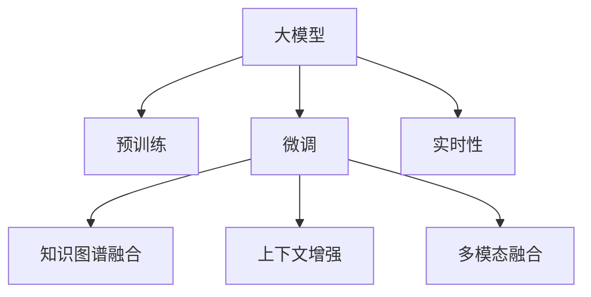

                 

# 大模型在搜索与推荐领域的影响

## 1. 背景介绍

### 1.1 问题由来

随着互联网的普及和电子商务的快速发展，搜索与推荐系统（Search and Recommendation Systems, SRS）在电商、社交媒体、信息检索等领域得到了广泛应用。传统的SRS主要依赖手工规则、统计特征工程和机器学习算法，在数据量增加和用户需求多样化的背景下，面临着数据利用效率低、个性化程度不足、实时性差等挑战。

近年来，大模型在自然语言处理（Natural Language Processing, NLP）领域的突破性进展，为SRS的智能化转型提供了新的思路。大模型通过预训练学习大规模无标签数据，获得了丰富的语言知识，能够自然地处理复杂的语义理解、关系抽取、推理生成等任务。将其应用于SRS中，可以实现更加高效、智能、个性化的搜索与推荐服务。

### 1.2 问题核心关键点

大模型在搜索与推荐领域的应用核心关键点包括：

- 大模型通过预训练学习海量无标签数据，具备强大的语言理解和生成能力，能够处理复杂的NLP任务。
- 将大模型引入SRS，可以实现对用户查询的自然理解、上下文关系抽取、个性化推荐等。
- 与传统机器学习模型相比，大模型可以自动学习隐含特征和规则，具有更好的泛化能力和鲁棒性。
- 大模型可以灵活地结合上下文信息、知识图谱、社交网络等多元数据源，提供更加全面和多样化的服务。
- 大模型的实时响应性和计算效率对实时SRS系统的构建至关重要。

## 2. 核心概念与联系

### 2.1 核心概念概述

为更好地理解大模型在搜索与推荐领域的应用，本节将介绍几个密切相关的核心概念：

- 大模型（Large Model）：指通过大规模无标签数据预训练，具有强大语义理解能力的神经网络模型，如BERT、GPT、T5等。
- 预训练（Pre-training）：指在大规模无标签数据上，通过自监督学习任务训练通用模型的方法。常见的预训练任务包括掩码语言模型、文本生成等。
- 微调（Fine-tuning）：指在预训练模型的基础上，使用下游任务的少量标注数据进行有监督训练，优化模型在特定任务上的性能。
- 知识图谱（Knowledge Graph,KG）：由节点和边组成的图结构，用于存储实体、关系和属性信息，辅助模型进行推理和推荐。
- 上下文增强（Contextual Enhancement）：指结合用户历史行为、上下文信息（如网页、商品）等多元数据源，提升搜索与推荐效果。
- 多模态融合（Multi-modal Fusion）：指结合文本、图像、音频等多模态数据，提高模型的全面感知能力，更好地适应现实世界的复杂性。
- 实时性（Real-time）：指搜索与推荐系统能够快速响应用户查询，实时生成推荐结果。

这些核心概念之间的逻辑关系可以通过以下Mermaid流程图来展示：



这个流程图展示了大模型在搜索与推荐领域的核心概念及其之间的关系：

1. 大模型通过预训练获得基础能力。
2. 微调在大模型的基础上，根据下游任务进行优化。
3. 知识图谱融合和大模型联合使用，提升推理能力。
4. 上下文增强和知识图谱融合，丰富推荐结果。
5. 多模态融合提升模型的全面感知能力。
6. 实时性保障系统的高效响应。

## 3. 核心算法原理 & 具体操作步骤
### 3.1 算法原理概述

大模型在搜索与推荐领域的应用，主要基于大模型的语义理解能力和知识图谱的推理能力。具体步骤如下：

1. 利用预训练大模型进行文本语义理解，提取用户查询的关键词和实体关系。
2. 在知识图谱上对实体关系进行推理，获取推荐结果。
3. 结合用户历史行为和上下文信息，进行个性化推荐。
4. 实时生成推荐结果，返回给用户。

### 3.2 算法步骤详解

具体算法步骤如下：

1. 预训练大模型的构建：使用大规模无标签文本数据进行预训练，获得强大的语义理解能力。常见的预训练任务包括语言建模、掩码语言模型等。

2. 下游任务的微调：收集下游任务的数据集，并对其进行标注。在此基础上，将预训练模型作为初始化参数，使用少量标注数据进行微调，优化模型在特定任务上的性能。微调步骤包括：
   - 选择适当的微调任务和损失函数，如分类、回归、生成等。
   - 设置合适的微调参数，如学习率、批大小、迭代轮数等。
   - 使用梯度下降等优化算法，更新模型参数，最小化损失函数。

3. 知识图谱的构建和融合：构建知识图谱，存储实体、关系和属性信息。将知识图谱与预训练大模型结合，使用图神经网络等技术进行推理，获取推荐结果。

4. 上下文增强：收集用户的历史行为、上下文信息（如网页、商品）等多元数据源，结合预训练大模型进行综合分析，提升推荐效果。

5. 实时性保障：使用缓存、异步计算等技术，提高系统的响应速度和处理能力，保障实时性需求。

### 3.3 算法优缺点

大模型在搜索与推荐领域的应用具有以下优点：

- 强大的语义理解能力：通过预训练学习大规模语料，大模型能够自动抽取用户查询的语义信息，提升推荐精准度。
- 泛化能力强：大模型通过预训练学习通用的语言表示，能够处理多种多样的搜索和推荐场景。
- 实时响应：结合上下文信息进行实时推理，能够快速响应用户查询。
- 自动化程度高：大模型可以自动学习隐含特征和规则，无需手工规则和特征工程。

同时，也存在一些缺点：

- 数据需求高：大模型的预训练需要大量高质量的数据，而下游微调也需要相应的标注数据。
- 计算资源消耗大：大模型参数量庞大，需要高计算能力的硬件支持。
- 可解释性差：大模型更像"黑盒"，缺乏对内部工作机制的解释。
- 存在偏差：预训练和微调过程中可能引入的偏见，需要在应用中注意纠正。

### 3.4 算法应用领域

大模型在搜索与推荐领域的应用领域非常广泛，例如：

- 电商推荐：结合用户历史行为、商品属性和知识图谱，为用户推荐个性化商品。
- 新闻推荐：根据用户历史阅读记录和兴趣，推荐相关新闻和文章。
- 视频推荐：根据用户观看记录和上下文信息，推荐相关视频内容。
- 智能客服：利用大模型理解用户查询，自动匹配问题答案，提供智能客服服务。
- 金融咨询：通过自然语言处理技术，分析用户查询的金融需求，提供个性化咨询建议。
- 健康查询：结合知识图谱和自然语言处理技术，提供医疗健康查询和推荐服务。

除了这些经典应用外，大模型还在更多领域得到了广泛应用，为不同行业带来了新的智能化解决方案。

## 4. 数学模型和公式 & 详细讲解 & 举例说明
### 4.1 数学模型构建

假设有一个搜索与推荐系统，包含预训练大模型 $M$ 和知识图谱 $G$。系统接收用户查询 $q$ 和上下文 $c$，并返回推荐结果 $r$。其中，$M$ 能够自动抽取查询语义信息，$G$ 用于进行推理和知识关联。

1. 预训练大模型 $M$：使用大规模无标签数据进行自监督学习，获得语义表示能力。

2. 下游任务的微调：假设微调任务为二分类任务，输入为 $(x_i, y_i)$，输出为 $h_i$。微调目标为最小化损失函数 $\mathcal{L}$：
   $$
   \mathcal{L} = -\frac{1}{N}\sum_{i=1}^N [y_i\log M(x_i) + (1-y_i)\log (1-M(x_i))]
   $$

3. 知识图谱 $G$：构建知识图谱，存储实体 $e$ 和关系 $r$。使用图神经网络等技术进行推理，得到推荐结果 $r$。

### 4.2 公式推导过程

1. 预训练大模型的构建：使用掩码语言模型进行预训练，优化目标为最大化预测概率：
   $$
   \max_{\theta} \prod_{i=1}^N \prod_{j=1}^L p_{\theta}(x_{ij} | x_{i\backslash j})
   $$

2. 下游任务的微调：以二分类任务为例，微调目标为：
   $$
   \min_{\theta} \mathcal{L} = -\frac{1}{N}\sum_{i=1}^N [y_i\log M_{\theta}(x_i) + (1-y_i)\log (1-M_{\theta}(x_i))]
   $$

3. 知识图谱的推理：假设知识图谱 $G$ 包含实体 $e$ 和关系 $r$，使用图神经网络进行推理，得到推荐结果 $r$：
   $$
   r = f(G, M_{\theta})
   $$

其中，$f$ 为推理函数，结合了上下文信息和知识图谱的推理能力。

### 4.3 案例分析与讲解

以电商推荐系统为例，分析大模型在搜索与推荐中的应用。

1. 用户输入查询 $q$，如“购买手机”。

2. 预训练大模型 $M$ 对查询进行语义理解，提取关键实体和关系。例如，提取“手机”和“购物”关系。

3. 知识图谱 $G$ 根据“手机”和“购物”关系，查询与手机相关的商品信息。

4. 结合用户历史行为和上下文信息，进行个性化推荐。例如，推荐“华为”、“小米”等品牌手机。

5. 实时生成推荐结果，返回给用户。

## 5. 项目实践：代码实例和详细解释说明
### 5.1 开发环境搭建

在进行大模型在搜索与推荐领域的应用开发前，需要准备好开发环境。以下是使用Python进行PyTorch开发的环境配置流程：

1. 安装Anaconda：从官网下载并安装Anaconda，用于创建独立的Python环境。

2. 创建并激活虚拟环境：
```bash
conda create -n search-recommend-env python=3.8 
conda activate search-recommend-env
```

3. 安装PyTorch：根据CUDA版本，从官网获取对应的安装命令。例如：
```bash
conda install pytorch torchvision torchaudio cudatoolkit=11.1 -c pytorch -c conda-forge
```

4. 安装Transformers库：
```bash
pip install transformers
```

5. 安装各类工具包：
```bash
pip install numpy pandas scikit-learn matplotlib tqdm jupyter notebook ipython
```

完成上述步骤后，即可在`search-recommend-env`环境中开始应用开发。

### 5.2 源代码详细实现

下面我们以电商推荐系统为例，给出使用Transformers库对BERT模型进行电商推荐任务微调的PyTorch代码实现。

首先，定义电商推荐任务的数据处理函数：

```python
from transformers import BertTokenizer
from torch.utils.data import Dataset
import torch

class RecommendDataset(Dataset):
    def __init__(self, items, labels, tokenizer, max_len=128):
        self.items = items
        self.labels = labels
        self.tokenizer = tokenizer
        self.max_len = max_len
        
    def __len__(self):
        return len(self.items)
    
    def __getitem__(self, item):
        item_text = self.items[item]
        item_label = self.labels[item]
        
        encoding = self.tokenizer(item_text, return_tensors='pt', max_length=self.max_len, padding='max_length', truncation=True)
        input_ids = encoding['input_ids'][0]
        attention_mask = encoding['attention_mask'][0]
        
        # 对标签进行编码
        encoded_labels = [tag2id[tag] for tag in item_label] 
        encoded_labels.extend([tag2id['O']] * (self.max_len - len(encoded_labels)))
        labels = torch.tensor(encoded_labels, dtype=torch.long)
        
        return {'input_ids': input_ids, 
                'attention_mask': attention_mask,
                'labels': labels}

# 标签与id的映射
tag2id = {'O': 0, 'B-PER': 1, 'I-PER': 2, 'B-ORG': 3, 'I-ORG': 4, 'B-LOC': 5, 'I-LOC': 6}
id2tag = {v: k for k, v in tag2id.items()}

# 创建dataset
tokenizer = BertTokenizer.from_pretrained('bert-base-cased')

train_dataset = RecommendDataset(train_items, train_labels, tokenizer)
dev_dataset = RecommendDataset(dev_items, dev_labels, tokenizer)
test_dataset = RecommendDataset(test_items, test_labels, tokenizer)
```

然后，定义模型和优化器：

```python
from transformers import BertForTokenClassification, AdamW

model = BertForTokenClassification.from_pretrained('bert-base-cased', num_labels=len(tag2id))

optimizer = AdamW(model.parameters(), lr=2e-5)
```

接着，定义训练和评估函数：

```python
from torch.utils.data import DataLoader
from tqdm import tqdm
from sklearn.metrics import classification_report

device = torch.device('cuda') if torch.cuda.is_available() else torch.device('cpu')
model.to(device)

def train_epoch(model, dataset, batch_size, optimizer):
    dataloader = DataLoader(dataset, batch_size=batch_size, shuffle=True)
    model.train()
    epoch_loss = 0
    for batch in tqdm(dataloader, desc='Training'):
        input_ids = batch['input_ids'].to(device)
        attention_mask = batch['attention_mask'].to(device)
        labels = batch['labels'].to(device)
        model.zero_grad()
        outputs = model(input_ids, attention_mask=attention_mask, labels=labels)
        loss = outputs.loss
        epoch_loss += loss.item()
        loss.backward()
        optimizer.step()
    return epoch_loss / len(dataloader)

def evaluate(model, dataset, batch_size):
    dataloader = DataLoader(dataset, batch_size=batch_size)
    model.eval()
    preds, labels = [], []
    with torch.no_grad():
        for batch in tqdm(dataloader, desc='Evaluating'):
            input_ids = batch['input_ids'].to(device)
            attention_mask = batch['attention_mask'].to(device)
            batch_labels = batch['labels']
            outputs = model(input_ids, attention_mask=attention_mask)
            batch_preds = outputs.logits.argmax(dim=2).to('cpu').tolist()
            batch_labels = batch_labels.to('cpu').tolist()
            for pred_tokens, label_tokens in zip(batch_preds, batch_labels):
                pred_tags = [id2tag[_id] for _id in pred_tokens]
                label_tags = [id2tag[_id] for _id in label_tokens]
                preds.append(pred_tags[:len(label_tags)])
                labels.append(label_tags)
                
    print(classification_report(labels, preds))
```

最后，启动训练流程并在测试集上评估：

```python
epochs = 5
batch_size = 16

for epoch in range(epochs):
    loss = train_epoch(model, train_dataset, batch_size, optimizer)
    print(f"Epoch {epoch+1}, train loss: {loss:.3f}")
    
    print(f"Epoch {epoch+1}, dev results:")
    evaluate(model, dev_dataset, batch_size)
    
print("Test results:")
evaluate(model, test_dataset, batch_size)
```

以上就是使用PyTorch对BERT进行电商推荐任务微调的完整代码实现。可以看到，得益于Transformers库的强大封装，我们可以用相对简洁的代码完成BERT模型的加载和微调。

### 5.3 代码解读与分析

让我们再详细解读一下关键代码的实现细节：

**RecommendDataset类**：
- `__init__`方法：初始化商品信息、标签、分词器等关键组件。
- `__len__`方法：返回数据集的样本数量。
- `__getitem__`方法：对单个样本进行处理，将商品信息输入编码为token ids，将标签编码为数字，并对其进行定长padding，最终返回模型所需的输入。

**tag2id和id2tag字典**：
- 定义了标签与数字id之间的映射关系，用于将token-wise的预测结果解码回真实的标签。

**训练和评估函数**：
- 使用PyTorch的DataLoader对数据集进行批次化加载，供模型训练和推理使用。
- 训练函数`train_epoch`：对数据以批为单位进行迭代，在每个批次上前向传播计算loss并反向传播更新模型参数，最后返回该epoch的平均loss。
- 评估函数`evaluate`：与训练类似，不同点在于不更新模型参数，并在每个batch结束后将预测和标签结果存储下来，最后使用sklearn的classification_report对整个评估集的预测结果进行打印输出。

**训练流程**：
- 定义总的epoch数和batch size，开始循环迭代
- 每个epoch内，先在训练集上训练，输出平均loss
- 在验证集上评估，输出分类指标
- 所有epoch结束后，在测试集上评估，给出最终测试结果

可以看到，PyTorch配合Transformers库使得BERT微调的代码实现变得简洁高效。开发者可以将更多精力放在数据处理、模型改进等高层逻辑上，而不必过多关注底层的实现细节。

当然，工业级的系统实现还需考虑更多因素，如模型的保存和部署、超参数的自动搜索、更灵活的任务适配层等。但核心的微调范式基本与此类似。

## 6. 实际应用场景
### 6.1 智能客服系统

基于大模型在搜索与推荐领域的算法，智能客服系统可以实现更加高效、智能、个性化的服务。传统客服往往需要配备大量人力，高峰期响应缓慢，且一致性和专业性难以保证。而使用微调后的搜索与推荐模型，可以7x24小时不间断服务，快速响应客户咨询，用自然流畅的语言解答各类常见问题。

在技术实现上，可以收集企业内部的历史客服对话记录，将问题和最佳答复构建成监督数据，在此基础上对预训练搜索与推荐模型进行微调。微调后的模型能够自动理解用户意图，匹配最合适的答案模板进行回复。对于客户提出的新问题，还可以接入检索系统实时搜索相关内容，动态组织生成回答。如此构建的智能客服系统，能大幅提升客户咨询体验和问题解决效率。

### 6.2 金融舆情监测

金融机构需要实时监测市场舆论动向，以便及时应对负面信息传播，规避金融风险。传统的人工监测方式成本高、效率低，难以应对网络时代海量信息爆发的挑战。基于大模型的搜索与推荐技术，为金融舆情监测提供了新的解决方案。

具体而言，可以收集金融领域相关的新闻、报道、评论等文本数据，并对其进行主题标注和情感标注。在此基础上对预训练搜索与推荐模型进行微调，使其能够自动判断文本属于何种主题，情感倾向是正面、中性还是负面。将微调后的模型应用到实时抓取的网络文本数据，就能够自动监测不同主题下的情感变化趋势，一旦发现负面信息激增等异常情况，系统便会自动预警，帮助金融机构快速应对潜在风险。

### 6.3 个性化推荐系统

当前的推荐系统往往只依赖用户的历史行为数据进行物品推荐，无法深入理解用户的真实兴趣偏好。基于大模型的搜索与推荐技术，个性化推荐系统可以更好地挖掘用户行为背后的语义信息，从而提供更精准、多样的推荐内容。

在实践中，可以收集用户浏览、点击、评论、分享等行为数据，提取和用户交互的物品标题、描述、标签等文本内容。将文本内容作为模型输入，用户的后续行为（如是否点击、购买等）作为监督信号，在此基础上微调预训练搜索与推荐模型。微调后的模型能够从文本内容中准确把握用户的兴趣点。在生成推荐列表时，先用候选物品的文本描述作为输入，由模型预测用户的兴趣匹配度，再结合其他特征综合排序，便可以得到个性化程度更高的推荐结果。

### 6.4 未来应用展望

随着大模型和搜索与推荐技术的不断发展，基于大模型的搜索与推荐系统将在更多领域得到应用，为传统行业带来变革性影响。

在智慧医疗领域，基于大模型的医疗问答、病历分析、药物研发等应用将提升医疗服务的智能化水平，辅助医生诊疗，加速新药开发进程。

在智能教育领域，搜索与推荐技术可应用于作业批改、学情分析、知识推荐等方面，因材施教，促进教育公平，提高教学质量。

在智慧城市治理中，搜索与推荐系统可应用于城市事件监测、舆情分析、应急指挥等环节，提高城市管理的自动化和智能化水平，构建更安全、高效的未来城市。

此外，在企业生产、社会治理、文娱传媒等众多领域，基于大模型的搜索与推荐技术也将不断涌现，为不同行业带来新的智能化解决方案。相信随着技术的日益成熟，搜索与推荐系统必将在更广阔的应用领域大放异彩，深刻影响人类的生产生活方式。

## 7. 工具和资源推荐
### 7.1 学习资源推荐

为了帮助开发者系统掌握搜索与推荐领域的大模型应用理论基础和实践技巧，这里推荐一些优质的学习资源：

1. 《搜索引擎设计与实现》系列博文：深入浅出地介绍了搜索引擎的原理、算法和实现细节，是了解搜索与推荐领域的经典读物。

2. 《推荐系统原理与算法》课程：清华大学开设的推荐系统课程，涵盖了推荐系统的主要原理和算法，并提供了实际案例。

3. 《深度学习与自然语言处理》书籍：介绍深度学习在NLP领域的应用，包括搜索与推荐等任务，适合对大模型应用感兴趣的读者。

4. 《自然语言处理综述》书籍：涵盖了自然语言处理的主要方向和技术，对搜索与推荐领域具有重要参考价值。

5. 《搜索引擎优化与推荐算法》书籍：介绍搜索引擎优化和推荐算法的基本原理和实现方法，适合对技术深度感兴趣的读者。

通过对这些资源的学习实践，相信你一定能够快速掌握搜索与推荐领域的大模型应用，并用于解决实际的NLP问题。

### 7.2 开发工具推荐

高效的开发离不开优秀的工具支持。以下是几款用于搜索与推荐领域的大模型应用的常用工具：

1. PyTorch：基于Python的开源深度学习框架，灵活动态的计算图，适合快速迭代研究。大部分预训练语言模型都有PyTorch版本的实现。

2. TensorFlow：由Google主导开发的开源深度学习框架，生产部署方便，适合大规模工程应用。同样有丰富的预训练语言模型资源。

3. Transformers库：HuggingFace开发的NLP工具库，集成了众多SOTA语言模型，支持PyTorch和TensorFlow，是进行搜索与推荐任务开发的利器。

4. Weights & Biases：模型训练的实验跟踪工具，可以记录和可视化模型训练过程中的各项指标，方便对比和调优。与主流深度学习框架无缝集成。

5. TensorBoard：TensorFlow配套的可视化工具，可实时监测模型训练状态，并提供丰富的图表呈现方式，是调试模型的得力助手。

6. Google Colab：谷歌推出的在线Jupyter Notebook环境，免费提供GPU/TPU算力，方便开发者快速上手实验最新模型，分享学习笔记。

合理利用这些工具，可以显著提升搜索与推荐领域大模型应用的开发效率，加快创新迭代的步伐。

### 7.3 相关论文推荐

搜索与推荐领域的大模型应用源于学界的持续研究。以下是几篇奠基性的相关论文，推荐阅读：

1. Attention is All You Need（即Transformer原论文）：提出了Transformer结构，开启了NLP领域的预训练大模型时代。

2. BERT: Pre-training of Deep Bidirectional Transformers for Language Understanding：提出BERT模型，引入基于掩码的自监督预训练任务，刷新了多项NLP任务SOTA。

3. Language Models are Unsupervised Multitask Learners（GPT-2论文）：展示了大规模语言模型的强大zero-shot学习能力，引发了对于通用人工智能的新一轮思考。

4. Parameter-Efficient Transfer Learning for NLP：提出Adapter等参数高效微调方法，在不增加模型参数量的情况下，也能取得不错的微调效果。

5. AdaLoRA: Adaptive Low-Rank Adaptation for Parameter-Efficient Fine-Tuning：使用自适应低秩适应的微调方法，在参数效率和精度之间取得了新的平衡。

这些论文代表了大模型在搜索与推荐领域的应用研究进展。通过学习这些前沿成果，可以帮助研究者把握学科前进方向，激发更多的创新灵感。

## 8. 总结：未来发展趋势与挑战
### 8.1 总结

本文对大模型在搜索与推荐领域的应用进行了全面系统的介绍。首先阐述了大模型和搜索与推荐系统的发展背景和意义，明确了搜索与推荐领域的应用方向和价值。其次，从原理到实践，详细讲解了大模型在搜索与推荐系统中的应用步骤和关键算法，给出了完整的代码实现。同时，本文还广泛探讨了大模型在智能客服、金融舆情、个性化推荐等多个行业领域的应用前景，展示了搜索与推荐系统的广阔应用场景。此外，本文精选了搜索与推荐领域的各类学习资源，力求为读者提供全方位的技术指引。

通过本文的系统梳理，可以看到，大模型在搜索与推荐领域的应用已经成为当前的热点研究方向，为搜索引擎、推荐系统、智能客服等领域带来了新的活力和突破。得益于大模型的语义理解能力和知识图谱的推理能力，搜索与推荐系统能够提供更加高效、智能、个性化的服务，满足用户的多样化需求。未来，随着大模型的进一步优化和大数据技术的应用，搜索与推荐系统必将在更多场景中大放异彩，为社会的智能化转型提供新的动力。

### 8.2 未来发展趋势

展望未来，大模型在搜索与推荐领域的应用将呈现以下几个发展趋势：

1. 模型的多样性：除了传统的BERT、GPT等模型，未来将涌现更多适合搜索与推荐任务的模型，如GPT-3、T5等。这些模型具有更强的语义理解能力和推理能力，能够更好地处理复杂的搜索与推荐任务。

2. 模型的实时性：随着硬件技术的进步和算法优化，搜索与推荐系统将具备更强的实时响应能力，能够实现毫秒级的响应速度。

3. 模型的多样性：除了文本信息，搜索与推荐系统将结合图像、语音等多模态数据，提升综合感知能力，更好地适应现实世界的复杂性。

4. 模型的多领域适应性：搜索与推荐系统将能够在更多领域实现广泛应用，如医疗、金融、教育等。

5. 模型的个性化推荐：搜索与推荐系统将具备更强的个性化推荐能力，根据用户的多样化需求，提供量身定制的服务。

6. 模型的隐私保护：搜索与推荐系统将更加注重用户隐私保护，采用差分隐私、联邦学习等技术，确保用户数据的安全性。

以上趋势凸显了大模型在搜索与推荐领域的应用前景。这些方向的探索发展，必将进一步提升搜索与推荐系统的性能和应用范围，为各行各业带来新的智能化解决方案。

### 8.3 面临的挑战

尽管大模型在搜索与推荐领域的应用取得了显著进展，但在迈向更加智能化、普适化应用的过程中，它仍面临着诸多挑战：

1. 数据需求高：大模型的预训练和微调需要大量高质量的数据，而数据获取和标注成本高，难以满足实际应用需求。

2. 计算资源消耗大：大模型参数量庞大，需要高计算能力的硬件支持，难以在低资源环境下高效运行。

3. 可解释性差：大模型更像"黑盒"，缺乏对内部工作机制的解释，难以让人理解和信任。

4. 存在偏差：预训练和微调过程中可能引入的偏见，需要在应用中注意纠正。

5. 实时性问题：搜索与推荐系统需要在高并发场景下保证实时性，对系统架构和计算资源要求高。

6. 安全性问题：搜索与推荐系统需要处理敏感信息，如何在保障安全性的同时，提供高效的服务，是重要挑战。

7. 隐私保护问题：搜索与推荐系统需要保护用户隐私，如何在不泄露隐私的前提下，提供个性化的服务，是重要挑战。

这些挑战需要技术社区、产业界和政策制定者共同努力，才能克服。唯有解决这些挑战，大模型在搜索与推荐领域的应用才能真正发挥其潜力，为社会带来更大的价值。

### 8.4 研究展望

面对搜索与推荐领域大模型应用所面临的挑战，未来的研究需要在以下几个方面寻求新的突破：

1. 探索更高效的数据获取和标注方法，降低对高质量数据的依赖。

2. 研究更高效的计算资源优化和模型压缩技术，提升模型的实时响应能力。

3. 开发更加可解释的搜索与推荐系统，增强用户信任和理解。

4. 研究如何更好地纠正和消除模型偏见，提升模型的公平性和安全性。

5. 结合多模态数据，提升搜索与推荐系统的感知能力和综合表现。

6. 研究如何更好地保护用户隐私，保障搜索与推荐系统的安全性。

这些研究方向将推动搜索与推荐系统向更智能、更安全、更公平的方向发展，为社会的智能化转型提供坚实的技术基础。

## 9. 附录：常见问题与解答

**Q1：大模型在搜索与推荐领域的应用是否只限于文本处理？**

A: 大模型在搜索与推荐领域的应用不仅仅限于文本处理，可以结合图像、音频等多模态数据进行综合分析。例如，视频推荐系统可以结合视频的文本描述、标签等信息，进行综合推理和推荐。

**Q2：如何评估搜索与推荐系统的效果？**

A: 搜索与推荐系统的效果评估通常包括精度、召回率、点击率、用户满意度等多个指标。可以通过A/B测试、用户反馈调查等方式，获取用户的实际使用效果，并进行综合分析。

**Q3：大模型在搜索与推荐系统中的学习速率如何选择？**

A: 大模型在搜索与推荐系统中的学习速率需要根据具体任务和数据特点进行选择。一般建议从较小的学习率开始调参，逐步增加学习率，观察模型性能变化。

**Q4：搜索与推荐系统如何结合知识图谱进行推理？**

A: 知识图谱结合大模型进行推理，通常使用图神经网络等技术，将知识图谱中的实体和关系信息嵌入到模型中，通过多层网络进行推理，获取推荐结果。

**Q5：搜索与推荐系统的实时性问题如何解决？**

A: 搜索与推荐系统的实时性问题通常通过优化算法、硬件加速、缓存机制等方式解决。例如，可以采用异步计算、分布式计算等技术，提升系统的响应速度和处理能力。

通过这些问题的解答，相信你能够更好地理解搜索与推荐领域的大模型应用，并解决实际开发中的问题。

