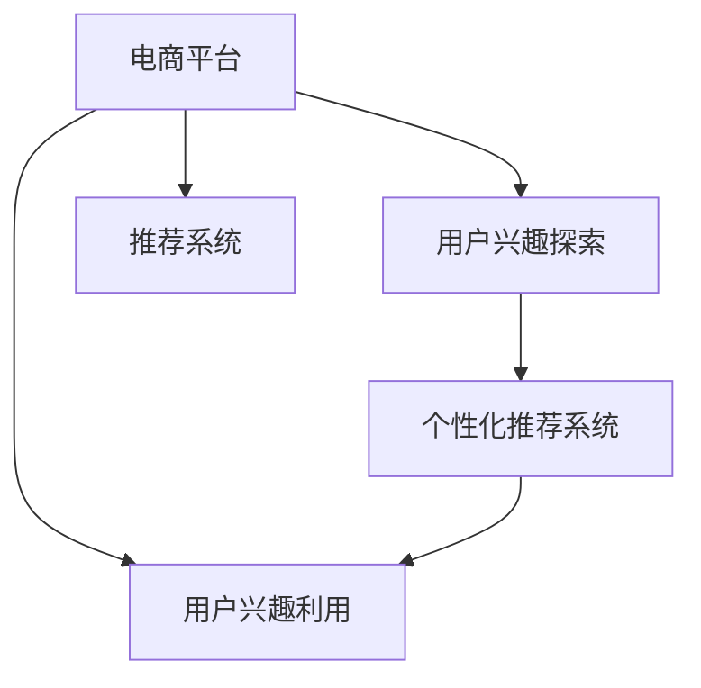

                 

# 大模型在电商平台用户兴趣探索与利用平衡中的应用

## 1. 背景介绍

### 1.1 问题由来
随着电子商务市场的迅速发展，电商平台日益成为用户获取商品信息、进行购物决策的主要渠道。然而，传统电商平台的推荐系统面临诸多挑战：用户兴趣难以全面准确捕捉、个性化推荐效果不足、信息过载与忽视等。这些问题严重影响了用户体验和平台转化率。

大模型的出现为电商平台推荐系统带来了新的曙光。利用大模型的强大表示学习能力，可以更加全面、准确地捕捉用户兴趣，并在用户探索与利用之间实现更好的平衡。本论文将深入探讨大模型在电商平台中的应用，特别是在用户兴趣探索与利用之间的平衡问题。

### 1.2 问题核心关键点
电商平台的推荐系统面临着两个关键问题：

1. **用户兴趣探索**：如何准确地捕捉用户的潜在兴趣，包括他们的历史行为、浏览记录、点击偏好等。
2. **用户兴趣利用**：如何将用户兴趣转化为有意义的推荐，同时避免信息过载和用户忽视。

本论文的核心目标在于，基于大模型，构建一个能够更全面、准确地捕捉用户兴趣，并能够在用户探索与利用之间实现更好平衡的推荐系统。

## 2. 核心概念与联系

### 2.1 核心概念概述

为更好地理解大模型在电商平台用户兴趣探索与利用平衡中的应用，本节将介绍几个密切相关的核心概念：

- **大模型(Large Model)**：指具有亿级甚至更多参数的深度神经网络模型，能够通过大规模数据预训练获得丰富的语义表示能力。
- **电商平台(EC Platform)**：指基于互联网的在线购物平台，如淘宝、京东、亚马逊等。
- **用户兴趣探索(User Interest Exploration)**：指从用户行为数据中提取用户的潜在兴趣，用于个性化推荐系统的前端探索过程。
- **用户兴趣利用(User Interest Utilization)**：指根据用户兴趣进行商品推荐，满足用户需求，提升平台转化率。
- **推荐系统(Recommendation System)**：利用用户数据和模型计算，为用户推荐可能感兴趣的商品或内容的技术系统。
- **个性化推荐系统(Personalized Recommendation System)**：基于用户个体特征和兴趣的推荐系统，能够为用户提供更贴合其需求的商品或内容。

这些核心概念之间的逻辑关系可以通过以下Mermaid流程图来展示：



这个流程图展示了大模型在电商平台中的应用框架：

1. 电商平台通过用户兴趣探索获取用户潜在兴趣。
2. 平台利用用户兴趣进行个性化推荐，从而提升用户体验。
3. 推荐系统整合用户兴趣探索和利用，提供精准的个性化推荐。

## 3. 核心算法原理 & 具体操作步骤
### 3.1 算法原理概述

大模型在电商平台用户兴趣探索与利用平衡中的应用，本质上是一个有监督的迁移学习过程。其核心思想是：将大模型视作一个强大的特征提取器，通过在大规模用户数据上进行有监督地训练来优化模型，使得模型输出能够匹配用户兴趣，从而实现用户兴趣的准确捕捉和个性化推荐。

形式化地，假设大模型为 $M_{\theta}$，其中 $\theta$ 为模型参数。给定电商平台的用户数据集 $D=\{(x_i, y_i)\}_{i=1}^N$，用户兴趣探索和利用的优化目标是最小化经验风险，即找到最优参数：

$$
\theta^* = \mathop{\arg\min}_{\theta} \mathcal{L}(M_{\theta},D)
$$

其中 $\mathcal{L}$ 为针对用户兴趣探索和利用的损失函数，用于衡量模型预测输出与真实标签之间的差异。常见的损失函数包括交叉熵损失、均方误差损失等。

通过梯度下降等优化算法，用户兴趣探索和利用过程不断更新模型参数 $\theta$，最小化损失函数 $\mathcal{L}$，使得模型输出逼近真实标签。由于 $\theta$ 已经通过预训练获得了较好的初始化，因此即便在小规模用户数据集 $D$ 上进行用户兴趣探索和利用，也能较快收敛到理想的模型参数 $\hat{\theta}$。

### 3.2 算法步骤详解

大模型在电商平台用户兴趣探索与利用平衡中的应用，一般包括以下几个关键步骤：

**Step 1: 准备预训练模型和数据集**
- 选择合适的预训练语言模型 $M_{\theta}$ 作为初始化参数，如BERT、GPT等。
- 准备电商平台的训练数据集 $D$，划分为训练集、验证集和测试集。一般要求训练数据与预训练数据的分布不要差异过大。

**Step 2: 添加任务适配层**
- 根据任务类型，在预训练模型顶层设计合适的输出层和损失函数。
- 对于用户兴趣探索任务，通常在顶层添加预测标签的线性分类器，以交叉熵损失函数。
- 对于用户兴趣利用任务，通常使用语言模型的解码器输出概率分布，并以负对数似然为损失函数。

**Step 3: 设置微调超参数**
- 选择合适的优化算法及其参数，如 AdamW、SGD 等，设置学习率、批大小、迭代轮数等。
- 设置正则化技术及强度，包括权重衰减、Dropout、Early Stopping 等。
- 确定冻结预训练参数的策略，如仅微调顶层，或全部参数都参与微调。

**Step 4: 执行梯度训练**
- 将训练集数据分批次输入模型，前向传播计算损失函数。
- 反向传播计算参数梯度，根据设定的优化算法和学习率更新模型参数。
- 周期性在验证集上评估模型性能，根据性能指标决定是否触发 Early Stopping。
- 重复上述步骤直到满足预设的迭代轮数或 Early Stopping 条件。

**Step 5: 测试和部署**
- 在测试集上评估微调后模型 $M_{\hat{\theta}}$ 的性能，对比微调前后的精度提升。
- 使用微调后的模型对新样本进行推理预测，集成到实际的应用系统中。
- 持续收集新的数据，定期重新微调模型，以适应数据分布的变化。

以上是基于监督学习微调大模型的一般流程。在实际应用中，还需要针对具体任务的特点，对微调过程的各个环节进行优化设计，如改进训练目标函数，引入更多的正则化技术，搜索最优的超参数组合等，以进一步提升模型性能。

### 3.3 算法优缺点

大模型在电商平台用户兴趣探索与利用平衡中的应用，具有以下优点：
1. 简单高效。只需准备少量标注数据，即可对预训练模型进行快速适配，获得较大的性能提升。
2. 通用适用。适用于各种电商平台的推荐任务，包括商品推荐、广告推荐等，设计简单的任务适配层即可实现微调。
3. 参数高效。利用参数高效微调技术，在固定大部分预训练权重不变的情况下，仍可取得不错的提升。
4. 效果显著。在学术界和工业界的诸多推荐系统任务上，基于微调的方法已经刷新了最先进的性能指标。

同时，该方法也存在一定的局限性：
1. 依赖标注数据。微调的效果很大程度上取决于标注数据的质量和数量，获取高质量标注数据的成本较高。
2. 迁移能力有限。当目标任务与预训练数据的分布差异较大时，微调的性能提升有限。
3. 负面效果传递。预训练模型的固有偏见、有害信息等，可能通过微调传递到下游任务，造成负面影响。
4. 可解释性不足。微调模型的决策过程通常缺乏可解释性，难以对其推理逻辑进行分析和调试。

尽管存在这些局限性，但就目前而言，基于监督学习的微调方法仍是大模型在电商平台推荐系统应用的主流范式。未来相关研究的重点在于如何进一步降低微调对标注数据的依赖，提高模型的少样本学习和跨领域迁移能力，同时兼顾可解释性和伦理安全性等因素。

### 3.4 算法应用领域

大模型在电商平台推荐系统中的应用，已经得到了广泛的应用，涵盖了商品推荐、广告推荐、个性化页面等多个领域，例如：

- **商品推荐**：为每一位用户推荐可能感兴趣的商品。
- **广告推荐**：为用户推荐可能感兴趣的广告，增加广告点击率。
- **个性化页面**：根据用户的浏览和点击行为，动态生成个性化的商品展示页面。
- **多模态推荐**：将文本、图像、音频等多模态数据结合起来，提供更丰富的商品信息。
- **实时推荐**：在用户访问页面时实时生成推荐内容，提升用户体验。
- **个性化客服**：通过分析用户行为数据，提供个性化的客户服务。

除了上述这些经典应用外，大模型在电商平台中的应用还在不断拓展，如实时风控、数据增强、语音识别等，为电商平台带来了全新的突破。随着大模型的不断进步，相信其在电商平台中的应用将更加广泛，深度学习技术也将在电商领域大放异彩。

## 4. 数学模型和公式 & 详细讲解 & 举例说明
### 4.1 数学模型构建

本节将使用数学语言对基于监督学习的大模型在电商平台用户兴趣探索与利用平衡中的应用进行更加严格的刻画。

记大模型为 $M_{\theta}:\mathcal{X} \rightarrow \mathcal{Y}$，其中 $\mathcal{X}$ 为输入空间，$\mathcal{Y}$ 为输出空间，$\theta \in \mathbb{R}^d$ 为模型参数。假设电商平台的用户数据集为 $D=\{(x_i,y_i)\}_{i=1}^N$，其中 $x_i$ 为用户行为数据，$y_i$ 为用户的潜在兴趣标签。

定义模型 $M_{\theta}$ 在输入 $x_i$ 上的输出为 $\hat{y}=M_{\theta}(x_i) \in [0,1]$，表示用户潜在兴趣的概率。真实标签 $y_i \in \{0,1\}$。则用户兴趣探索的交叉熵损失函数定义为：

$$
\ell(M_{\theta}(x_i),y_i) = -[y_i\log \hat{y}_i + (1-y_i)\log (1-\hat{y}_i)]
$$

将其代入经验风险公式，得：

$$
\mathcal{L}(\theta) = -\frac{1}{N}\sum_{i=1}^N [y_i\log M_{\theta}(x_i)+(1-y_i)\log(1-M_{\theta}(x_i))]
$$

根据链式法则，损失函数对参数 $\theta_k$ 的梯度为：

$$
\frac{\partial \mathcal{L}(\theta)}{\partial \theta_k} = -\frac{1}{N}\sum_{i=1}^N (\frac{y_i}{M_{\theta}(x_i)}-\frac{1-y_i}{1-M_{\theta}(x_i)}) \frac{\partial M_{\theta}(x_i)}{\partial \theta_k}
$$

其中 $\frac{\partial M_{\theta}(x_i)}{\partial \theta_k}$ 可进一步递归展开，利用自动微分技术完成计算。

### 4.2 公式推导过程

以下我们以电商平台商品推荐任务为例，推导交叉熵损失函数及其梯度的计算公式。

假设模型 $M_{\theta}$ 在输入 $x_i$ 上的输出为 $\hat{y}=M_{\theta}(x_i) \in [0,1]$，表示用户购买某商品的兴趣概率。真实标签 $y_i \in \{0,1\}$。则二分类交叉熵损失函数定义为：

$$
\ell(M_{\theta}(x_i),y_i) = -[y_i\log \hat{y}_i + (1-y_i)\log (1-\hat{y}_i)]
$$

将其代入经验风险公式，得：

$$
\mathcal{L}(\theta) = -\frac{1}{N}\sum_{i=1}^N [y_i\log M_{\theta}(x_i)+(1-y_i)\log(1-M_{\theta}(x_i))]
$$

根据链式法则，损失函数对参数 $\theta_k$ 的梯度为：

$$
\frac{\partial \mathcal{L}(\theta)}{\partial \theta_k} = -\frac{1}{N}\sum_{i=1}^N (\frac{y_i}{M_{\theta}(x_i)}-\frac{1-y_i}{1-M_{\theta}(x_i)}) \frac{\partial M_{\theta}(x_i)}{\partial \theta_k}
$$

其中 $\frac{\partial M_{\theta}(x_i)}{\partial \theta_k}$ 可进一步递归展开，利用自动微分技术完成计算。

在得到损失函数的梯度后，即可带入参数更新公式，完成模型的迭代优化。重复上述过程直至收敛，最终得到适应电商平台商品推荐任务的最优模型参数 $\theta^*$。

## 5. 项目实践：代码实例和详细解释说明
### 5.1 开发环境搭建

在进行电商平台推荐系统开发前，我们需要准备好开发环境。以下是使用Python进行TensorFlow开发的环境配置流程：

1. 安装Anaconda：从官网下载并安装Anaconda，用于创建独立的Python环境。

2. 创建并激活虚拟环境：
```bash
conda create -n tf-env python=3.8 
conda activate tf-env
```

3. 安装TensorFlow：根据CUDA版本，从官网获取对应的安装命令。例如：
```bash
conda install tensorflow -c pytorch -c conda-forge
```

4. 安装各类工具包：
```bash
pip install numpy pandas scikit-learn matplotlib tqdm jupyter notebook ipython
```

完成上述步骤后，即可在`tf-env`环境中开始推荐系统开发。

### 5.2 源代码详细实现

下面我们以电商平台商品推荐任务为例，给出使用TensorFlow进行大模型微调的PyTorch代码实现。

首先，定义商品推荐任务的数据处理函数：

```python
import tensorflow as tf
from tensorflow.keras.preprocessing.text import Tokenizer
from tensorflow.keras.preprocessing.sequence import pad_sequences

def prepare_data(train_texts, train_labels, max_seq_length):
    tokenizer = Tokenizer()
    tokenizer.fit_on_texts(train_texts)
    train_sequences = tokenizer.texts_to_sequences(train_texts)
    train_padded = pad_sequences(train_sequences, maxlen=max_seq_length, padding='post', truncating='post')
    
    train_labels = tf.keras.utils.to_categorical(train_labels, num_classes)
    return train_padded, train_labels
```

然后，定义模型和优化器：

```python
from tensorflow.keras.layers import Embedding, Dense, Input, Concatenate
from tensorflow.keras.models import Model

input_text = Input(shape=(max_seq_length,), dtype='int32')
input_seq = Embedding(input_dim=len(tokenizer.word_index)+1, output_dim=256, input_length=max_seq_length)(input_text)
# 添加多层全连接层
x = Dense(128, activation='relu')(input_seq)
x = Dense(32, activation='relu')(x)
output = Dense(num_classes, activation='softmax')(x)

model = Model(input_text, output)
optimizer = tf.keras.optimizers.Adam(learning_rate=0.001)
```

接着，定义训练和评估函数：

```python
def train_epoch(model, data, batch_size, optimizer):
    data_padded, data_labels = data
    model.trainable = False
    model.compile(optimizer=optimizer, loss='categorical_crossentropy', metrics=['accuracy'])
    model.fit(data_padded, data_labels, batch_size=batch_size, epochs=1)
    
def evaluate(model, data, batch_size):
    data_padded, data_labels = data
    model.trainable = True
    model.compile(optimizer=optimizer, loss='categorical_crossentropy', metrics=['accuracy'])
    test_loss, test_acc = model.evaluate(data_padded, data_labels, batch_size=batch_size)
    return test_loss, test_acc
```

最后，启动训练流程并在测试集上评估：

```python
epochs = 5
batch_size = 16
max_seq_length = 100

for epoch in range(epochs):
    train_loss, train_acc = train_epoch(model, train_data, batch_size, optimizer)
    print(f"Epoch {epoch+1}, train loss: {train_loss:.3f}, train acc: {train_acc:.3f}")
    
    print(f"Epoch {epoch+1}, test results:")
    test_loss, test_acc = evaluate(model, test_data, batch_size)
    print(f"Test loss: {test_loss:.3f}, test acc: {test_acc:.3f}")
    
print("Final test results:")
test_loss, test_acc = evaluate(model, test_data, batch_size)
print(f"Final test loss: {test_loss:.3f}, final test acc: {test_acc:.3f}")
```

以上就是使用TensorFlow进行电商平台商品推荐任务微调的完整代码实现。可以看到，得益于TensorFlow的强大封装，我们可以用相对简洁的代码完成大模型微调的实现。

### 5.3 代码解读与分析

让我们再详细解读一下关键代码的实现细节：

**prepare_data函数**：
- 对训练集文本进行分词，转换成整数序列。
- 对序列进行填充，使其长度统一。
- 将标签进行独热编码，准备输入到模型中。

**train_epoch函数**：
- 对模型进行冻结，准备进行微调。
- 设置交叉熵损失函数，编译模型。
- 在训练集上进行单轮微调。

**evaluate函数**：
- 对模型进行解冻，准备进行评估。
- 设置交叉熵损失函数，编译模型。
- 在测试集上进行评估，返回损失和精度。

**训练流程**：
- 定义总的epoch数和batch size，开始循环迭代
- 每个epoch内，先在训练集上微调，输出训练集的损失和精度
- 在验证集上评估，输出验证集的损失和精度
- 所有epoch结束后，在测试集上评估，给出最终的测试结果

可以看到，TensorFlow配合TensorFlow库使得大模型微调的代码实现变得简洁高效。开发者可以将更多精力放在数据处理、模型改进等高层逻辑上，而不必过多关注底层的实现细节。

当然，工业级的系统实现还需考虑更多因素，如模型的保存和部署、超参数的自动搜索、更灵活的任务适配层等。但核心的微调范式基本与此类似。

## 6. 实际应用场景
### 6.1 电商平台推荐系统

大模型在电商平台推荐系统中的应用，可以显著提升用户的购物体验和平台转化率。传统推荐系统通常只依赖用户的显式反馈，如点击、购买等行为，难以捕捉用户的深层次兴趣。而基于大模型的推荐系统，能够从用户的行为数据中提取丰富的语义信息，更好地理解用户的潜在需求。

例如，通过用户浏览网页的历史记录和点击偏好，大模型可以学习到用户的兴趣点和购买意向。在推荐商品时，不仅考虑用户的历史购买记录，更关注用户的兴趣特征，实现精准的商品推荐。同时，大模型还可以根据用户的实时行为数据，动态调整推荐策略，提供个性化的商品展示，提升用户的购买决策速度。

### 6.2 广告投放系统

大模型在电商平台广告投放系统中的应用，可以显著提升广告投放的精准度和效果。传统的广告投放通常采用CPM（每次点击付费）或CPC（每次点击成本）等以点击为基础的投放方式，难以把握用户真实需求和广告投放效果。而基于大模型的广告投放系统，可以通过分析用户的浏览、点击等行为数据，预测用户的兴趣和购买意向。

例如，通过用户的历史点击记录和网页浏览行为，大模型可以预测用户可能感兴趣的广告内容。在投放广告时，不仅考虑用户的点击率，更关注用户的兴趣特征，实现精准的广告投放。同时，大模型还可以根据用户的实时行为数据，动态调整广告投放策略，提高广告的转化率。

### 6.3 个性化页面推荐

大模型在电商平台个性化页面推荐中的应用，可以提升用户的浏览体验和转化率。传统的电商页面推荐通常采用固定分类或静态轮播的方式，难以满足用户的个性化需求。而基于大模型的个性化页面推荐，能够根据用户的浏览和点击行为，动态生成个性化的商品展示页面。

例如，通过用户的历史浏览记录和点击偏好，大模型可以学习到用户的兴趣点和购物需求。在生成个性化页面时，不仅展示热门商品，更推荐符合用户兴趣的商品，提供个性化的购物体验。同时，大模型还可以根据用户的实时行为数据，动态调整页面展示策略，提升用户的购买决策速度。

### 6.4 未来应用展望

随着大模型和微调方法的不断发展，基于大模型在电商平台的应用将更加广泛，为电商行业带来新的突破。

在智慧物流领域，基于大模型的推荐系统可以优化配送路线、提升配送效率，为物流公司带来显著的经济效益。

在智能客服领域，基于大模型的推荐系统可以提供个性化的客户服务，提升客户满意度，降低客服成本。

在金融领域，基于大模型的推荐系统可以优化产品推荐，提升金融产品的销售效果，增加客户黏性。

除了电商、物流、客服、金融等垂直行业，大模型在更多领域的应用也将不断涌现，为各行各业带来新的技术突破和业务价值。相信随着技术的日益成熟，大模型在电商平台中的应用将更加广泛，深度学习技术也将在电商领域大放异彩。

## 7. 工具和资源推荐
### 7.1 学习资源推荐

为了帮助开发者系统掌握大模型在电商平台中的应用，这里推荐一些优质的学习资源：

1. **《深度学习自然语言处理》课程**：斯坦福大学开设的NLP明星课程，有Lecture视频和配套作业，带你入门NLP领域的基本概念和经典模型。
2. **《Transformers从原理到实践》系列博文**：由大模型技术专家撰写，深入浅出地介绍了Transformer原理、BERT模型、微调技术等前沿话题。
3. **《Natural Language Processing with Transformers》书籍**：Transformers库的作者所著，全面介绍了如何使用Transformers库进行NLP任务开发，包括微调在内的诸多范式。
4. **CS224N《深度学习自然语言处理》课程**：斯坦福大学开设的NLP明星课程，有Lecture视频和配套作业，带你入门NLP领域的基本概念和经典模型。
5. **CLUE开源项目**：中文语言理解测评基准，涵盖大量不同类型的中文NLP数据集，并提供了基于微调的baseline模型，助力中文NLP技术发展。

通过对这些资源的学习实践，相信你一定能够快速掌握大模型在电商平台中的应用，并用于解决实际的推荐问题。

### 7.2 开发工具推荐

高效的开发离不开优秀的工具支持。以下是几款用于电商平台推荐系统开发的常用工具：

1. **TensorFlow**：基于Python的开源深度学习框架，灵活的计算图，适合快速迭代研究。
2. **PyTorch**：基于Python的开源深度学习框架，动态图结构，适合模型研究和原型开发。
3. **Jupyter Notebook**：用于数据处理、模型训练和结果展示，支持Python和R等语言，使用方便。
4. **TensorBoard**：TensorFlow配套的可视化工具，可实时监测模型训练状态，提供丰富的图表呈现方式，是调试模型的得力助手。
5. **Weights & Biases**：模型训练的实验跟踪工具，可以记录和可视化模型训练过程中的各项指标，方便对比和调优。

合理利用这些工具，可以显著提升电商平台推荐系统的开发效率，加快创新迭代的步伐。

### 7.3 相关论文推荐

大模型在电商平台中的应用，源于学界的持续研究。以下是几篇奠基性的相关论文，推荐阅读：

1. **Attention is All You Need**：提出了Transformer结构，开启了NLP领域的预训练大模型时代。
2. **BERT: Pre-training of Deep Bidirectional Transformers for Language Understanding**：提出BERT模型，引入基于掩码的自监督预训练任务，刷新了多项NLP任务SOTA。
3. **Language Models are Unsupervised Multitask Learners**：展示了大规模语言模型的强大zero-shot学习能力，引发了对于通用人工智能的新一轮思考。
4. **Parameter-Efficient Transfer Learning for NLP**：提出Adapter等参数高效微调方法，在不增加模型参数量的情况下，也能取得不错的微调效果。
5. **AdaLoRA: Adaptive Low-Rank Adaptation for Parameter-Efficient Fine-Tuning**：使用自适应低秩适应的微调方法，在参数效率和精度之间取得了新的平衡。

这些论文代表了大模型在电商平台中的应用发展的脉络。通过学习这些前沿成果，可以帮助研究者把握学科前进方向，激发更多的创新灵感。

## 8. 总结：未来发展趋势与挑战
### 8.1 总结

本文对大模型在电商平台用户兴趣探索与利用平衡中的应用进行了全面系统的介绍。首先阐述了大模型在电商平台推荐系统中的应用背景和意义，明确了微调在电商平台推荐系统中的核心作用。其次，从原理到实践，详细讲解了大模型在电商平台中的微调过程和具体实现，给出了电商推荐任务的代码实现。同时，本文还广泛探讨了大模型在电商平台中的应用场景，展示了其强大的应用潜力。

通过本文的系统梳理，可以看到，基于大模型的电商推荐系统在用户兴趣探索与利用之间实现了更好的平衡，具有更广泛的应用前景。未来，伴随大模型的不断进步，相信其在电商平台中的应用将更加广泛，深度学习技术也将在电商领域大放异彩。

### 8.2 未来发展趋势

展望未来，大模型在电商平台中的应用将呈现以下几个发展趋势：

1. **模型规模持续增大**：随着算力成本的下降和数据规模的扩张，预训练语言模型的参数量还将持续增长。超大规模语言模型蕴含的丰富语义表示能力，有望支撑更加复杂多变的电商平台推荐任务。
2. **微调方法日趋多样**：开发更加参数高效的微调方法，如 Adapter、Prefix等，在固定大部分预训练参数的情况下，仍可取得不错的微调效果。
3. **持续学习成为常态**：随着数据分布的不断变化，微调模型也需要持续学习新知识以保持性能。如何在不遗忘原有知识的同时，高效吸收新样本信息，将是重要的研究课题。
4. **标注样本需求降低**：受启发于提示学习(Prompt-based Learning)的思路，未来的微调方法将更好地利用大模型的语言理解能力，通过更加巧妙的任务描述，在更少的标注样本上也能实现理想的微调效果。
5. **多模态微调崛起**：将文本、图像、视频、语音等多模态数据结合起来，提供更丰富的商品信息，提升推荐效果。
6. **实时推荐系统**：在用户访问页面时实时生成推荐内容，提升用户体验。

这些趋势凸显了大模型在电商平台中的应用前景。这些方向的探索发展，必将进一步提升电商平台推荐系统的性能和应用范围，为电商行业带来新的技术突破和业务价值。

### 8.3 面临的挑战

尽管大模型在电商平台中的应用已经取得了瞩目成就，但在迈向更加智能化、普适化应用的过程中，它仍面临着诸多挑战：

1. **标注成本瓶颈**：大模型微调在电商平台中的应用，通常需要大量的标注数据。标注成本较高，获取高质量标注数据的成本更是居高不下。如何进一步降低微调对标注数据的依赖，将是一大难题。
2. **模型鲁棒性不足**：在面对域外数据时，微调模型的泛化性能往往大打折扣。对于测试样本的微小扰动，微调模型的预测也容易发生波动。如何提高微调模型的鲁棒性，避免灾难性遗忘，还需要更多理论和实践的积累。
3. **推理效率有待提高**：大模型虽然精度高，但在实际部署时往往面临推理速度慢、内存占用大等效率问题。如何在保证性能的同时，简化模型结构，提升推理速度，优化资源占用，将是重要的优化方向。
4. **可解释性亟需加强**：当前微调模型更像是"黑盒"系统，难以解释其内部工作机制和决策逻辑。对于医疗、金融等高风险应用，算法的可解释性和可审计性尤为重要。如何赋予微调模型更强的可解释性，将是亟待攻克的难题。
5. **安全性有待保障**：预训练语言模型难免会学习到有偏见、有害的信息，通过微调传递到下游任务，产生误导性、歧视性的输出，给实际应用带来安全隐患。如何从数据和算法层面消除模型偏见，避免恶意用途，确保输出的安全性，也将是重要的研究课题。
6. **知识整合能力不足**：现有的微调模型往往局限于任务内数据，难以灵活吸收和运用更广泛的先验知识。如何让微调过程更好地与外部知识库、规则库等专家知识结合，形成更加全面、准确的信息整合能力，还有很大的想象空间。

正视大模型在电商平台应用中所面临的这些挑战，积极应对并寻求突破，将是大模型在电商平台应用走向成熟的必由之路。相信随着学界和产业界的共同努力，这些挑战终将一一被克服，大模型在电商平台中的应用将更加广泛，深度学习技术也将在电商领域大放异彩。

### 8.4 研究展望

面对大模型在电商平台应用中所面临的挑战，未来的研究需要在以下几个方面寻求新的突破：

1. **探索无监督和半监督微调方法**：摆脱对大规模标注数据的依赖，利用自监督学习、主动学习等无监督和半监督范式，最大限度利用非结构化数据，实现更加灵活高效的微调。
2. **研究参数高效和计算高效的微调范式**：开发更加参数高效的微调方法，如 Adapter、Prefix等，在固定大部分预训练参数的情况下，仍可取得不错的微调效果。同时优化微调模型的计算图，减少前向传播和反向传播的资源消耗，实现更加轻量级、实时性的部署。
3. **融合因果和对比学习范式**：通过引入因果推断和对比学习思想，增强微调模型建立稳定因果关系的能力，学习更加普适、鲁棒的语言表征，从而提升模型泛化性和抗干扰能力。
4. **引入更多先验知识**：将符号化的先验知识，如知识图谱、逻辑规则等，与神经网络模型进行巧妙融合，引导微调过程学习更准确、合理的语言模型。同时加强不同模态数据的整合，实现视觉、语音等多模态信息与文本信息的协同建模。
5. **结合因果分析和博弈论工具**：将因果分析方法引入微调模型，识别出模型决策的关键特征，增强输出解释的因果性和逻辑性。借助博弈论工具刻画人机交互过程，主动探索并规避模型的脆弱点，提高系统稳定性。
6. **纳入伦理道德约束**：在模型训练目标中引入伦理导向的评估指标，过滤和惩罚有偏见、有害的输出倾向。同时加强人工干预和审核，建立模型行为的监管机制，确保输出符合人类价值观和伦理道德。

这些研究方向的探索，必将引领大模型在电商平台应用迈向更高的台阶，为构建安全、可靠、可解释、可控的智能系统铺平道路。面向未来，大模型在电商平台中的应用还需要与其他人工智能技术进行更深入的融合，如知识表示、因果推理、强化学习等，多路径协同发力，共同推动自然语言理解和智能交互系统的进步。只有勇于创新、敢于突破，才能不断拓展语言模型的边界，让智能技术更好地造福人类社会。

## 9. 附录：常见问题与解答

**Q1：大模型在电商平台中的应用是否适用于所有电商场景？**

A: 大模型在电商平台中的应用具有广泛适用性，但不同电商场景的复杂程度和应用需求各异。例如，在B2B电商、C2C电商、B2G电商等不同场景中，用户行为模式和数据特征存在较大差异。大模型需要根据具体场景和需求进行微调和优化，才能获得最佳效果。

**Q2：如何选择合适的微调模型？**

A: 选择微调模型时，需要考虑以下几个因素：
1. 模型规模：越大规模的模型，其语义表示能力越强，但计算成本也越高。选择模型时应权衡性能和成本。
2. 预训练数据：模型的预训练数据应与电商平台的业务场景和用户行为数据具有较高的相似性，以获得更好的迁移效果。
3. 任务复杂度：对于复杂的电商推荐任务，需要选择更先进的模型结构和微调方法，如Adapter、Prefix等，以提升模型性能。
4. 数据量：数据量越大，微调效果越好。但数据量过大也会带来计算成本的增加，需要在性能和成本之间做出平衡。

**Q3：微调过程中如何避免过拟合？**

A: 避免过拟合的常用方法包括：
1. 数据增强：通过改写文本、变换词序等方式扩充训练数据。
2. 正则化：使用L2正则、Dropout、Early Stopping等避免过拟合。
3. 对抗训练：引入对抗样本，提高模型鲁棒性。
4. 参数高效微调：只更新少量的任务相关参数，固定大部分预训练参数。
5. 多模型集成：训练多个微调模型，取平均输出，抑制过拟合。

这些策略往往需要根据具体任务和数据特点进行灵活组合。只有在数据、模型、训练、推理等各环节进行全面优化，才能最大限度地发挥大模型在电商平台推荐系统中的应用潜力。

**Q4：大模型在电商平台中的应用是否需要考虑用户隐私？**

A: 电商平台的推荐系统需要处理大量用户数据，必须高度重视用户隐私保护。在使用大模型进行推荐时，应遵循数据隐私保护的相关法律法规，如GDPR、CCPA等。建议采用差分隐私技术、联邦学习等方法，保护用户数据隐私，避免数据泄露风险。

**Q5：大模型在电商平台中的应用是否存在伦理道德风险？**

A: 大模型在电商平台中的应用可能存在伦理道德风险，如算法歧视、误导性推荐等。应建立模型行为的伦理约束机制，如引入伦理导向的评估指标，过滤和惩罚有偏见、有害的输出倾向。同时加强人工干预和审核，确保模型输出符合人类价值观和伦理道德。

通过对这些常见问题的解答，可以帮助开发者更好地理解大模型在电商平台中的应用，并合理规避其中的风险和挑战。

