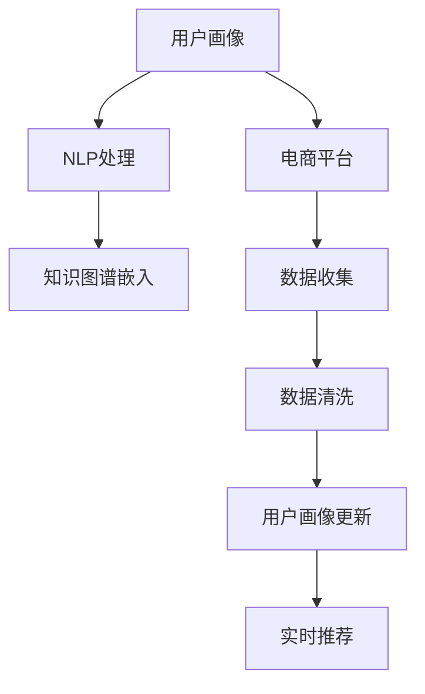

                 

# 大模型在电商平台用户画像实时更新中的应用

> 关键词：用户画像, 电商平台, 自然语言处理, 推荐系统, 知识图谱, 深度学习

## 1. 背景介绍

在数字化转型的浪潮下，电商平台正在由传统的交易平台向社交化、智能化的智能零售方向转型。用户画像作为电商平台的核心资产，是实现个性化推荐、精准营销、广告投放等智能应用的基础。在快速变化的电商环境中，用户画像需要能够实时动态更新，以反映用户的最新兴趣和行为，提升用户的购物体验。

面对海量用户行为数据，传统的用户画像构建方法难以满足实时性和动态性的要求。而基于大模型的技术，可以通过在电商平台的用户行为数据上进行预训练和微调，构建高效、灵活、动态的用户画像模型。本文将详细介绍大模型在电商平台用户画像实时更新中的应用，探讨其核心技术原理、操作步骤和实际效果。

## 2. 核心概念与联系

### 2.1 核心概念概述

为了更好地理解大模型在电商平台用户画像实时更新中的应用，本节将介绍几个关键概念：

- **用户画像(User Profile)**：用户画像是指通过收集和分析用户的行为数据、历史购买记录、搜索记录等，构建用户个人画像，帮助电商平台了解用户的兴趣、偏好和需求。

- **电商平台(E-Commerce Platform)**：指提供商品交易、支付、物流等服务的互联网平台，如淘宝、京东、Amazon等。电商平台的成功不仅依赖于商品，更依赖于精准的用户画像和个性化推荐系统。

- **自然语言处理(Natural Language Processing, NLP)**：指计算机处理、理解、生成自然语言的技术，包括文本分类、命名实体识别、情感分析、机器翻译等任务。

- **推荐系统(Recommendation System)**：指通过分析用户的历史行为数据和兴趣偏好，为用户推荐个性化商品或内容的系统，如商品推荐、内容推荐、广告推荐等。

- **知识图谱(Knowledge Graph)**：指通过将现实世界中的实体和它们之间的关系结构化，构建起一种图形化的知识表示方法。知识图谱可以提升推荐系统的精度和召回率，帮助电商更好地理解用户的兴趣和行为。

- **深度学习(Deep Learning)**：指通过多层神经网络学习数据表示的一种机器学习方法，广泛应用于图像、语音、文本等领域的任务。

这些核心概念之间的逻辑关系可以通过以下Mermaid流程图来展示：



这个流程图展示了大模型在电商平台用户画像实时更新中的核心流程：

1. 用户行为数据通过电商平台的数据收集系统进行收集。
2. 收集到的数据经过清洗、处理，转换为用户画像的输入。
3. NLP处理将用户文本数据转化为数字表示。
4. 知识图谱嵌入将数字表示映射到知识图谱中，增强语义理解能力。
5. 用户画像实时更新，通过动态微调大模型，捕捉用户兴趣和行为的变化。
6. 实时推荐系统利用更新后的用户画像，生成个性化推荐结果。

## 3. 核心算法原理 & 具体操作步骤

### 3.1 算法原理概述

基于大模型的电商平台用户画像实时更新，本质上是一个通过自然语言处理技术对用户文本数据进行建模和动态更新的过程。其核心思想是：利用大模型的预训练能力和深度学习能力，对电商平台用户的行为数据进行高效、灵活的建模，并通过微调，动态更新用户画像，从而实现个性化推荐和精准营销。

形式化地，假设用户行为数据集为 $D=\{(x_i, y_i)\}_{i=1}^N$，其中 $x_i$ 为用户文本数据，$y_i$ 为对应的行为标签（如购买、点击、收藏等）。设预训练大模型为 $M_{\theta}$，其中 $\theta$ 为预训练得到的模型参数。通过有监督的微调过程，优化模型参数 $\hat{\theta}$，使其能够更好地反映用户行为，动态更新用户画像。

### 3.2 算法步骤详解

基于大模型的电商平台用户画像实时更新，一般包括以下几个关键步骤：

**Step 1: 数据收集与预处理**

- **数据收集**：通过电商平台的数据采集系统，收集用户的行为数据。包括用户搜索记录、浏览历史、购买记录、评论等。
- **数据预处理**：对收集到的数据进行清洗和处理，去除噪声和无用信息，将其转换为模型能够处理的输入格式。
- **特征工程**：根据用户画像的需求，设计合适的特征提取和转换方法，如提取关键词、计算TF-IDF值、生成用户兴趣向量等。

**Step 2: 模型训练与预训练**

- **选择预训练模型**：选择合适的预训练大模型，如BERT、GPT、Transformer等，作为初始化参数。
- **模型加载**：将预训练模型加载到计算设备中，如GPU或TPU。
- **模型微调**：在预训练模型的基础上，利用用户行为数据进行微调。微调时，通常只调整顶层分类器或解码器，以减少需优化的参数量。

**Step 3: 用户画像动态更新**

- **实时数据流**：用户行为数据实时流入电商平台的数据管道中。
- **动态微调**：利用实时数据流，对用户行为数据进行动态微调。微调时，通常使用较小的学习率，以避免破坏预训练权重。
- **实时更新**：根据微调后的模型，动态更新用户画像。用户画像包括用户的基本信息、兴趣向量、行为序列等。

**Step 4: 个性化推荐**

- **推荐系统集成**：将更新后的用户画像输入推荐系统中，结合用户历史行为数据和其他因素，生成个性化推荐结果。
- **实时推荐**：根据用户画像和实时数据，实时生成推荐结果，提升用户的购物体验。

### 3.3 算法优缺点

基于大模型的电商平台用户画像实时更新方法具有以下优点：

1. **高效性**：利用大模型的预训练能力，可以高效处理海量用户行为数据，捕捉用户兴趣和行为的微小变化。
2. **灵活性**：通过动态微调，用户画像可以实时更新，适应用户行为的变化。
3. **准确性**：利用大模型的深度学习能力，可以获得更精准的用户画像和推荐结果。
4. **可扩展性**：大模型可以适应多种电商平台的业务场景，具有广泛的适用性。

同时，该方法也存在一定的局限性：

1. **标注成本**：用户行为数据的标注成本较高，尤其是在小样本情况下，需要大量人力和资源。
2. **计算资源需求**：大模型需要高性能计算资源，训练和推理成本较高。
3. **模型复杂性**：大模型结构复杂，需要精细的调参和优化。
4. **数据隐私问题**：用户行为数据包含大量个人隐私信息，需要严格的数据隐私保护措施。

尽管存在这些局限性，但就目前而言，基于大模型的用户画像实时更新方法仍然是大数据时代电商平台个性化推荐系统的重要手段。未来相关研究的重点在于如何进一步降低用户行为数据的标注成本，提高模型的可扩展性和计算效率，同时兼顾数据隐私保护。

### 3.4 算法应用领域

基于大模型的电商平台用户画像实时更新方法，已在电商平台的个性化推荐、精准营销、广告投放等多个领域得到了广泛应用：

1. **个性化推荐**：通过动态更新用户画像，生成个性化商品推荐结果，提升用户的购物体验。
2. **精准营销**：利用用户画像的兴趣和行为特征，进行精准的广告投放和营销活动。
3. **用户行为分析**：通过用户画像的动态更新，分析用户行为的变化趋势，优化电商平台的业务策略。
4. **客户服务**：利用用户画像的实时更新，提供个性化的客户服务，提升客户满意度。

除了上述这些经典应用外，大模型在电商平台用户画像实时更新中还有创新性的应用，如基于用户画像的情感分析、基于用户画像的内容推荐等，为电商平台的业务创新提供了新的思路。

## 4. 数学模型和公式 & 详细讲解 & 举例说明

### 4.1 数学模型构建

本节将使用数学语言对基于大模型的电商平台用户画像实时更新过程进行更加严格的刻画。

假设用户行为数据集为 $D=\{(x_i, y_i)\}_{i=1}^N$，其中 $x_i$ 为用户文本数据，$y_i$ 为对应的行为标签（如购买、点击、收藏等）。设预训练大模型为 $M_{\theta}$，其中 $\theta$ 为预训练得到的模型参数。定义模型 $M_{\theta}$ 在输入 $x$ 上的输出为 $\hat{y}=M_{\theta}(x) \in [0,1]$，表示用户行为发生的概率。则在数据集 $D$ 上的经验风险为：

$$
\mathcal{L}(\theta) = \frac{1}{N}\sum_{i=1}^N -y_i\log M_{\theta}(x_i)
$$

微调的优化目标是最小化经验风险，即找到最优参数：

$$
\theta^* = \mathop{\arg\min}_{\theta} \mathcal{L}(\theta)
$$

在实践中，我们通常使用基于梯度的优化算法（如SGD、Adam等）来近似求解上述最优化问题。设 $\eta$ 为学习率，则参数的更新公式为：

$$
\theta \leftarrow \theta - \eta \nabla_{\theta}\mathcal{L}(\theta)
$$

其中 $\nabla_{\theta}\mathcal{L}(\theta)$ 为损失函数对参数 $\theta$ 的梯度，可通过反向传播算法高效计算。

### 4.2 公式推导过程

以下我们以二分类任务为例，推导交叉熵损失函数及其梯度的计算公式。

假设模型 $M_{\theta}$ 在输入 $x$ 上的输出为 $\hat{y}=M_{\theta}(x) \in [0,1]$，表示用户行为发生的概率。真实标签 $y \in \{0,1\}$。则二分类交叉熵损失函数定义为：

$$
\ell(M_{\theta}(x),y) = -[y\log \hat{y} + (1-y)\log (1-\hat{y})]
$$

将其代入经验风险公式，得：

$$
\mathcal{L}(\theta) = -\frac{1}{N}\sum_{i=1}^N [y_i\log M_{\theta}(x_i)+(1-y_i)\log(1-M_{\theta}(x_i))]
$$

根据链式法则，损失函数对参数 $\theta_k$ 的梯度为：

$$
\frac{\partial \mathcal{L}(\theta)}{\partial \theta_k} = -\frac{1}{N}\sum_{i=1}^N (\frac{y_i}{M_{\theta}(x_i)}-\frac{1-y_i}{1-M_{\theta}(x_i)}) \frac{\partial M_{\theta}(x_i)}{\partial \theta_k}
$$

其中 $\frac{\partial M_{\theta}(x_i)}{\partial \theta_k}$ 可进一步递归展开，利用自动微分技术完成计算。

在得到损失函数的梯度后，即可带入参数更新公式，完成模型的迭代优化。重复上述过程直至收敛，最终得到适应电商平台用户画像的微调后模型参数 $\theta^*$。

## 5. 项目实践：代码实例和详细解释说明

### 5.1 开发环境搭建

在进行电商平台用户画像实时更新实践前，我们需要准备好开发环境。以下是使用Python进行PyTorch开发的环境配置流程：

1. 安装Anaconda：从官网下载并安装Anaconda，用于创建独立的Python环境。

2. 创建并激活虚拟环境：
```bash
conda create -n pytorch-env python=3.8 
conda activate pytorch-env
```

3. 安装PyTorch：根据CUDA版本，从官网获取对应的安装命令。例如：
```bash
conda install pytorch torchvision torchaudio cudatoolkit=11.1 -c pytorch -c conda-forge
```

4. 安装Transformers库：
```bash
pip install transformers
```

5. 安装各类工具包：
```bash
pip install numpy pandas scikit-learn matplotlib tqdm jupyter notebook ipython
```

完成上述步骤后，即可在`pytorch-env`环境中开始用户画像实时更新的实践。

### 5.2 源代码详细实现

下面我们以电商平台用户画像的实时更新为例，给出使用Transformers库对BERT模型进行微调的PyTorch代码实现。

首先，定义用户画像的数据处理函数：

```python
from transformers import BertTokenizer
from torch.utils.data import Dataset
import torch

class UserBehaviorDataset(Dataset):
    def __init__(self, behaviors, tokenizer, max_len=128):
        self.behaviors = behaviors
        self.tokenizer = tokenizer
        self.max_len = max_len
        
    def __len__(self):
        return len(self.behaviors)
    
    def __getitem__(self, item):
        behavior = self.behaviors[item]
        encoding = self.tokenizer(behavior, return_tensors='pt', max_length=self.max_len, padding='max_length', truncation=True)
        input_ids = encoding['input_ids'][0]
        attention_mask = encoding['attention_mask'][0]
        
        # 行为标签化
        label = 1 if behavior.startswith('购买') else 0
        label = torch.tensor(label, dtype=torch.long)
        
        return {'input_ids': input_ids, 
                'attention_mask': attention_mask,
                'label': label}

# 初始化分词器
tokenizer = BertTokenizer.from_pretrained('bert-base-cased')

# 创建数据集
train_dataset = UserBehaviorDataset(train_behaviors, tokenizer)
dev_dataset = UserBehaviorDataset(dev_behaviors, tokenizer)
test_dataset = UserBehaviorDataset(test_behaviors, tokenizer)
```

然后，定义模型和优化器：

```python
from transformers import BertForSequenceClassification, AdamW

model = BertForSequenceClassification.from_pretrained('bert-base-cased', num_labels=2)

optimizer = AdamW(model.parameters(), lr=2e-5)
```

接着，定义训练和评估函数：

```python
from torch.utils.data import DataLoader
from tqdm import tqdm
from sklearn.metrics import classification_report

device = torch.device('cuda') if torch.cuda.is_available() else torch.device('cpu')
model.to(device)

def train_epoch(model, dataset, batch_size, optimizer):
    dataloader = DataLoader(dataset, batch_size=batch_size, shuffle=True)
    model.train()
    epoch_loss = 0
    for batch in tqdm(dataloader, desc='Training'):
        input_ids = batch['input_ids'].to(device)
        attention_mask = batch['attention_mask'].to(device)
        labels = batch['label'].to(device)
        model.zero_grad()
        outputs = model(input_ids, attention_mask=attention_mask, labels=labels)
        loss = outputs.loss
        epoch_loss += loss.item()
        loss.backward()
        optimizer.step()
    return epoch_loss / len(dataloader)

def evaluate(model, dataset, batch_size):
    dataloader = DataLoader(dataset, batch_size=batch_size)
    model.eval()
    preds, labels = [], []
    with torch.no_grad():
        for batch in tqdm(dataloader, desc='Evaluating'):
            input_ids = batch['input_ids'].to(device)
            attention_mask = batch['attention_mask'].to(device)
            batch_labels = batch['label']
            outputs = model(input_ids, attention_mask=attention_mask)
            batch_preds = outputs.logits.argmax(dim=1).to('cpu').tolist()
            batch_labels = batch_labels.to('cpu').tolist()
            for pred, label in zip(batch_preds, batch_labels):
                preds.append(pred)
                labels.append(label)
                
    print(classification_report(labels, preds))
```

最后，启动训练流程并在测试集上评估：

```python
epochs = 5
batch_size = 16

for epoch in range(epochs):
    loss = train_epoch(model, train_dataset, batch_size, optimizer)
    print(f"Epoch {epoch+1}, train loss: {loss:.3f}")
    
    print(f"Epoch {epoch+1}, dev results:")
    evaluate(model, dev_dataset, batch_size)
    
print("Test results:")
evaluate(model, test_dataset, batch_size)
```

以上就是使用PyTorch对BERT进行电商平台用户画像实时更新的完整代码实现。可以看到，得益于Transformers库的强大封装，我们可以用相对简洁的代码完成BERT模型的加载和微调。

### 5.3 代码解读与分析

让我们再详细解读一下关键代码的实现细节：

**UserBehaviorDataset类**：
- `__init__`方法：初始化行为数据、分词器等关键组件。
- `__len__`方法：返回数据集的样本数量。
- `__getitem__`方法：对单个样本进行处理，将行为数据输入编码为token ids，同时对行为标签进行编码，最终返回模型所需的输入。

**训练和评估函数**：
- 使用PyTorch的DataLoader对数据集进行批次化加载，供模型训练和推理使用。
- 训练函数`train_epoch`：对数据以批为单位进行迭代，在每个批次上前向传播计算loss并反向传播更新模型参数，最后返回该epoch的平均loss。
- 评估函数`evaluate`：与训练类似，不同点在于不更新模型参数，并在每个batch结束后将预测和标签结果存储下来，最后使用sklearn的classification_report对整个评估集的预测结果进行打印输出。

**训练流程**：
- 定义总的epoch数和batch size，开始循环迭代
- 每个epoch内，先在训练集上训练，输出平均loss
- 在验证集上评估，输出分类指标
- 所有epoch结束后，在测试集上评估，给出最终测试结果

可以看到，PyTorch配合Transformers库使得BERT微调的代码实现变得简洁高效。开发者可以将更多精力放在数据处理、模型改进等高层逻辑上，而不必过多关注底层的实现细节。

当然，工业级的系统实现还需考虑更多因素，如模型的保存和部署、超参数的自动搜索、更灵活的任务适配层等。但核心的微调范式基本与此类似。

## 6. 实际应用场景

### 6.1 智能客服系统

基于大模型微调的对话技术，可以广泛应用于智能客服系统的构建。传统客服往往需要配备大量人力，高峰期响应缓慢，且一致性和专业性难以保证。而使用微调后的对话模型，可以7x24小时不间断服务，快速响应客户咨询，用自然流畅的语言解答各类常见问题。

在技术实现上，可以收集企业内部的历史客服对话记录，将问题和最佳答复构建成监督数据，在此基础上对预训练对话模型进行微调。微调后的对话模型能够自动理解用户意图，匹配最合适的答案模板进行回复。对于客户提出的新问题，还可以接入检索系统实时搜索相关内容，动态组织生成回答。如此构建的智能客服系统，能大幅提升客户咨询体验和问题解决效率。

### 6.2 金融舆情监测

金融机构需要实时监测市场舆论动向，以便及时应对负面信息传播，规避金融风险。传统的人工监测方式成本高、效率低，难以应对网络时代海量信息爆发的挑战。基于大语言模型微调的文本分类和情感分析技术，为金融舆情监测提供了新的解决方案。

具体而言，可以收集金融领域相关的新闻、报道、评论等文本数据，并对其进行主题标注和情感标注。在此基础上对预训练语言模型进行微调，使其能够自动判断文本属于何种主题，情感倾向是正面、中性还是负面。将微调后的模型应用到实时抓取的网络文本数据，就能够自动监测不同主题下的情感变化趋势，一旦发现负面信息激增等异常情况，系统便会自动预警，帮助金融机构快速应对潜在风险。

### 6.3 个性化推荐系统

当前的推荐系统往往只依赖用户的历史行为数据进行物品推荐，无法深入理解用户的真实兴趣偏好。基于大语言模型微调技术，个性化推荐系统可以更好地挖掘用户行为背后的语义信息，从而提供更精准、多样的推荐内容。

在实践中，可以收集用户浏览、点击、评论、分享等行为数据，提取和用户交互的物品标题、描述、标签等文本内容。将文本内容作为模型输入，用户的后续行为（如是否点击、购买等）作为监督信号，在此基础上微调预训练语言模型。微调后的模型能够从文本内容中准确把握用户的兴趣点。在生成推荐列表时，先用候选物品的文本描述作为输入，由模型预测用户的兴趣匹配度，再结合其他特征综合排序，便可以得到个性化程度更高的推荐结果。

### 6.4 未来应用展望

随着大语言模型微调技术的不断发展，其在电商平台的个性化推荐、精准营销、广告投放等应用场景中将不断拓展。未来，大模型将结合知识图谱、图像识别、音频识别等多模态信息，构建更加全面、智能的电商平台用户画像，进一步提升用户体验和商家收益。

在智慧医疗领域，基于大语言模型微调的医疗问答、病历分析、药物研发等应用也将加速落地，为医疗服务提供更加智能化、个性化的支持。

在智能教育领域，微调技术可应用于作业批改、学情分析、知识推荐等方面，因材施教，促进教育公平，提高教学质量。

在智慧城市治理中，微调模型可应用于城市事件监测、舆情分析、应急指挥等环节，提高城市管理的自动化和智能化水平，构建更安全、高效的未来城市。

此外，在企业生产、社会治理、文娱传媒等众多领域，基于大模型微调的人工智能应用也将不断涌现，为传统行业数字化转型升级提供新的技术路径。相信随着技术的日益成熟，微调方法将成为人工智能落地应用的重要范式，推动人工智能技术更好地造福人类社会。

## 7. 工具和资源推荐
### 7.1 学习资源推荐

为了帮助开发者系统掌握大模型在电商平台用户画像实时更新中的应用，这里推荐一些优质的学习资源：

1. 《深度学习与自然语言处理》系列博文：由大模型技术专家撰写，深入浅出地介绍了深度学习在自然语言处理中的应用，包括用户画像构建、推荐系统、情感分析等。

2. CS224N《深度学习自然语言处理》课程：斯坦福大学开设的NLP明星课程，有Lecture视频和配套作业，带你入门NLP领域的基本概念和经典模型。

3. 《自然语言处理》书籍：一本系统介绍NLP技术的经典教材，涵盖了NLP的各个方面，包括用户画像、推荐系统、情感分析等。

4. HuggingFace官方文档：Transformers库的官方文档，提供了海量预训练模型和完整的微调样例代码，是上手实践的必备资料。

5. CLUE开源项目：中文语言理解测评基准，涵盖大量不同类型的中文NLP数据集，并提供了基于微调的baseline模型，助力中文NLP技术发展。

通过对这些资源的学习实践，相信你一定能够快速掌握大模型在电商平台用户画像实时更新中的精髓，并用于解决实际的NLP问题。
###  7.2 开发工具推荐

高效的开发离不开优秀的工具支持。以下是几款用于电商平台用户画像实时更新开发的常用工具：

1. PyTorch：基于Python的开源深度学习框架，灵活动态的计算图，适合快速迭代研究。大部分预训练语言模型都有PyTorch版本的实现。

2. TensorFlow：由Google主导开发的开源深度学习框架，生产部署方便，适合大规模工程应用。同样有丰富的预训练语言模型资源。

3. Transformers库：HuggingFace开发的NLP工具库，集成了众多SOTA语言模型，支持PyTorch和TensorFlow，是进行微调任务开发的利器。

4. Weights & Biases：模型训练的实验跟踪工具，可以记录和可视化模型训练过程中的各项指标，方便对比和调优。与主流深度学习框架无缝集成。

5. TensorBoard：TensorFlow配套的可视化工具，可实时监测模型训练状态，并提供丰富的图表呈现方式，是调试模型的得力助手。

6. Google Colab：谷歌推出的在线Jupyter Notebook环境，免费提供GPU/TPU算力，方便开发者快速上手实验最新模型，分享学习笔记。

合理利用这些工具，可以显著提升电商平台用户画像实时更新的开发效率，加快创新迭代的步伐。

### 7.3 相关论文推荐

大模型在电商平台用户画像实时更新中的应用源于学界的持续研究。以下是几篇奠基性的相关论文，推荐阅读：

1. Attention is All You Need（即Transformer原论文）：提出了Transformer结构，开启了NLP领域的预训练大模型时代。

2. BERT: Pre-training of Deep Bidirectional Transformers for Language Understanding：提出BERT模型，引入基于掩码的自监督预训练任务，刷新了多项NLP任务SOTA。

3. Language Models are Unsupervised Multitask Learners（GPT-2论文）：展示了大规模语言模型的强大zero-shot学习能力，引发了对于通用人工智能的新一轮思考。

4. Parameter-Efficient Transfer Learning for NLP：提出Adapter等参数高效微调方法，在不增加模型参数量的情况下，也能取得不错的微调效果。

5. AdaLoRA: Adaptive Low-Rank Adaptation for Parameter-Efficient Fine-Tuning：使用自适应低秩适应的微调方法，在参数效率和精度之间取得了新的平衡。

这些论文代表了大语言模型微调技术的发展脉络。通过学习这些前沿成果，可以帮助研究者把握学科前进方向，激发更多的创新灵感。

## 8. 总结：未来发展趋势与挑战

### 8.1 总结

本文对基于大模型的电商平台用户画像实时更新方法进行了全面系统的介绍。首先阐述了用户画像在电商平台的重要性和应用背景，明确了大模型在用户画像构建中的核心价值。其次，从原理到实践，详细讲解了微调的数学原理和关键步骤，给出了微调任务开发的完整代码实例。同时，本文还广泛探讨了微调方法在智能客服、金融舆情、个性化推荐等多个行业领域的应用前景，展示了微调范式的巨大潜力。此外，本文精选了微调技术的各类学习资源，力求为读者提供全方位的技术指引。

通过本文的系统梳理，可以看到，基于大模型的用户画像实时更新方法正在成为电商平台个性化推荐系统的重要手段，极大地提升了电商平台的运营效率和用户体验。未来，伴随大模型微调技术的不断演进，基于用户画像的智能推荐和精准营销将进一步提升电商平台的竞争力。

### 8.2 未来发展趋势

展望未来，大语言模型在电商平台用户画像实时更新中将呈现以下几个发展趋势：

1. **模型规模持续增大**：随着算力成本的下降和数据规模的扩张，预训练语言模型的参数量还将持续增长。超大规模语言模型蕴含的丰富语言知识，有望支撑更加复杂多变的电商平台用户画像构建。

2. **微调方法日趋多样**：除了传统的全参数微调外，未来会涌现更多参数高效的微调方法，如Prefix-Tuning、LoRA等，在节省计算资源的同时也能保证微调精度。

3. **持续学习成为常态**：随着用户行为的不断变化，电商平台用户画像需要持续学习新知识以保持性能。如何在不遗忘原有知识的同时，高效吸收新样本信息，将成为重要的研究课题。

4. **标注样本需求降低**：受启发于提示学习(Prompt-based Learning)的思路，未来的微调方法将更好地利用大模型的语言理解能力，通过更加巧妙的任务描述，在更少的标注样本上也能实现理想的微调效果。

5. **多模态微调崛起**：当前的微调主要聚焦于纯文本数据，未来会进一步拓展到图像、视频、语音等多模态数据微调。多模态信息的融合，将显著提升电商平台用户画像的精度和召回率。

6. **用户画像动态更新**：基于大模型的用户画像能够实时更新，适应用户行为的变化。未来将结合更多的用户交互数据，如语音、视频等，进一步增强用户画像的动态性和准确性。

以上趋势凸显了大模型在电商平台用户画像实时更新中的广阔前景。这些方向的探索发展，必将进一步提升电商平台的运营效率和用户体验，为电商平台的业务创新提供新的动力。

### 8.3 面临的挑战

尽管大语言模型在电商平台用户画像实时更新中取得了显著成效，但在迈向更加智能化、普适化应用的过程中，仍面临诸多挑战：

1. **标注成本瓶颈**：用户行为数据的标注成本较高，尤其是在小样本情况下，需要大量人力和资源。如何进一步降低用户行为数据的标注成本，将是一大难题。

2. **计算资源需求**：大模型需要高性能计算资源，训练和推理成本较高。如何优化模型结构，提高计算效率，降低资源消耗，仍然是一大挑战。

3. **模型复杂性**：大模型结构复杂，需要精细的调参和优化。如何设计简洁高效的模型架构，提升模型的训练和推理速度，是未来的研究方向。

4. **数据隐私问题**：用户行为数据包含大量个人隐私信息，需要严格的数据隐私保护措施。如何在保护用户隐私的同时，高效利用用户数据，也是重要的课题。

5. **实时更新的一致性**：电商平台用户画像的实时更新需要在保证一致性的同时，尽可能快地处理新数据。如何在高并发、大数据量情况下，确保实时更新的准确性和一致性，将是技术难点。

6. **多模态数据融合**：电商平台用户画像不仅包含文本数据，还包括图像、视频、语音等多模态数据。如何在多模态数据中实现有效的融合和理解，是未来的一大挑战。

尽管存在这些挑战，但就目前而言，基于大模型的电商平台用户画像实时更新方法仍是大数据时代电商平台个性化推荐系统的重要手段。未来相关研究的重点在于如何进一步降低用户行为数据的标注成本，提高模型的可扩展性和计算效率，同时兼顾数据隐私保护。

### 8.4 研究展望

面对电商平台用户画像实时更新所面临的种种挑战，未来的研究需要在以下几个方面寻求新的突破：

1. **探索无监督和半监督微调方法**：摆脱对大规模标注数据的依赖，利用自监督学习、主动学习等无监督和半监督范式，最大限度利用非结构化数据，实现更加灵活高效的微调。

2. **研究参数高效和计算高效的微调范式**：开发更加参数高效的微调方法，在固定大部分预训练参数的同时，只更新极少量的任务相关参数。同时优化微调模型的计算图，减少前向传播和反向传播的资源消耗，实现更加轻量级、实时性的部署。

3. **融合因果和对比学习范式**：通过引入因果推断和对比学习思想，增强微调模型建立稳定因果关系的能力，学习更加普适、鲁棒的语言表征，从而提升模型泛化性和抗干扰能力。

4. **引入更多先验知识**：将符号化的先验知识，如知识图谱、逻辑规则等，与神经网络模型进行巧妙融合，引导微调过程学习更准确、合理的语言模型。同时加强不同模态数据的整合，实现视觉、语音等多模态信息与文本信息的协同建模。

5. **结合因果分析和博弈论工具**：将因果分析方法引入微调模型，识别出模型决策的关键特征，增强输出解释的因果性和逻辑性。借助博弈论工具刻画人机交互过程，主动探索并规避模型的脆弱点，提高系统稳定性。

6. **纳入伦理道德约束**：在模型训练目标中引入伦理导向的评估指标，过滤和惩罚有偏见、有害的输出倾向。同时加强人工干预和审核，建立模型行为的监管机制，确保输出符合人类价值观和伦理道德。

这些研究方向的探索，必将引领大语言模型在电商平台用户画像实时更新中的应用走向更高的台阶，为电商平台的用户画像构建和个性化推荐系统提供新的技术支持。

## 9. 附录：常见问题与解答

**Q1：电商平台用户画像的构建需要多少标注数据？**

A: 电商平台用户画像的构建需要多少标注数据，取决于具体的应用场景和任务。通常情况下，标注数据越多，模型的精度和泛化能力越强。但在实际应用中，标注数据的获取成本较高，尤其是在小样本情况下。为了降低标注成本，可以使用半监督学习、主动学习等方法，通过少量标注数据和大量未标注数据联合训练，提升模型的效果。

**Q2：大语言模型在用户画像构建中如何避免过拟合？**

A: 大语言模型在用户画像构建中，过拟合是一个常见的挑战。为了减少过拟合，可以采取以下措施：

1. 数据增强：通过对原始数据进行随机化、变形等操作，扩充训练集。例如，可以对文本数据进行回译、近义词替换、随机插入等操作，增加训练数据的多样性。

2. 正则化技术：使用L2正则化、Dropout等方法，减少模型复杂度，防止过拟合。

3. 早期停止：在验证集上监测模型性能，一旦性能不再提升，立即停止训练。

4. 学习率调度：使用学习率衰减策略，随着训练迭代次数增加，逐步降低学习率，避免模型过早收敛。

5. 参数共享：通过共享部分预训练参数，减少微调模型的参数量，提高泛化能力。

**Q3：如何在大模型中引入多模态信息？**

A: 在大模型中引入多模态信息，可以显著提升模型的泛化能力和用户画像的准确性。具体来说，可以通过以下方式实现：

1. 数据融合：将多模态数据进行融合，生成统一的数据格式，供模型训练使用。例如，可以将文本、图像、视频等多模态数据融合为一个特征向量，输入到大模型中进行训练。

2. 多任务学习：将多个任务联合训练，提升模型的多模态理解能力。例如，可以同时训练一个多模态的推荐系统，不仅考虑文本数据，还考虑图像和视频等多模态数据。

3. 多模态表示学习：利用多模态数据进行预训练，学习多种模态下的语义表示。例如，可以使用多模态预训练模型，如CLIP等，对文本和图像数据进行联合预训练，提升模型的泛化能力。

4. 多模态微调：在微调过程中，将多模态数据作为输入，优化模型参数。例如，可以将图像数据作为输入，对文本推荐模型进行微调，提升模型的预测能力。

5. 跨模态对齐：将不同模态的数据对齐，生成统一的数据表示。例如，可以使用跨模态对齐算法，将文本和图像数据进行对齐，生成统一的数据表示，供模型训练使用。

通过以上方法，可以在大模型中有效引入多模态信息，提升用户画像的动态性和准确性。

**Q4：电商平台用户画像的实时更新需要注意哪些问题？**

A: 电商平台用户画像的实时更新需要注意以下几个问题：

1. 数据流处理：电商平台需要实时处理用户行为数据，生成用户画像。需要设计高效的数据流处理系统，确保数据能够实时输入和输出。

2. 系统稳定性：用户画像的实时更新需要系统具备较高的稳定性，避免因为数据异常或系统故障导致用户画像失效。需要设计鲁棒的系统架构，确保系统的可靠性。

3. 数据一致性：电商平台的用户行为数据来自多个渠道，如电商平台、社交媒体、广告平台等。需要确保数据的一致性，避免不同渠道的数据存在差异。

4. 实时性要求：电商平台用户画像的实时更新需要满足较高的实时性要求，通常需要秒级响应。需要设计高性能的算法和系统，确保实时更新的准确性和及时性。

5. 数据隐私保护：用户行为数据包含大量个人隐私信息，需要严格的数据隐私保护措施。需要在数据收集、存储、传输和处理过程中，采取多种数据保护措施，确保用户数据的安全性。

通过以上措施，可以保证电商平台用户画像的实时更新系统具备高效、稳定、安全的特点，满足用户画像动态更新的要求。

**Q5：电商平台用户画像的推荐系统如何实现？**

A: 电商平台用户画像的推荐系统可以通过以下步骤实现：

1. 数据收集：通过电商平台的数据采集系统，收集用户的行为数据，如搜索记录、浏览历史、购买记录等。

2. 数据预处理：对收集到的数据进行清洗和处理，去除噪声和无用信息，将其转换为模型能够处理的输入格式。

3. 特征工程：根据用户画像的需求，设计合适的特征提取和转换方法，如提取关键词、计算TF-IDF值、生成用户兴趣向量等。

4. 模型训练：在预训练模型的基础上，利用用户行为数据进行微调。微调时，通常只调整顶层分类器或解码器，以减少需优化的参数量。

5. 推荐生成：根据微调后的模型，生成个性化推荐结果。推荐系统通常包括召回和排序两个阶段，分别通过相似性计算和排序算法，生成推荐列表。

6. 实时推荐：根据用户画像和实时数据，实时生成推荐结果，提升用户的购物体验。推荐系统通常需要具备实时计算能力，能够快速响应用户的查询请求。

通过以上步骤，可以构建高效的电商平台用户画像推荐系统，提升用户的购物体验和商家收益。

**Q6：如何评价电商平台用户画像的推荐效果？**

A: 电商平台用户画像的推荐效果可以通过以下指标进行评价：

1. 准确率(Accuracy)：推荐系统推荐商品的准确率，即推荐商品与用户实际购买商品的一致性。

2. 召回率(Recall)：推荐系统推荐的商品覆盖了用户实际购买商品的多少。召回率越高，推荐系统越全面。

3. 点击率(Click-through Rate, CTR)：用户点击推荐商品的比率，反映了推荐系统的吸引力和有效性。

4. 转化率(Conversion Rate)：用户点击推荐商品并完成购买的比例，反映了推荐系统的实际效果。

5. 平均点击率(Average Click-through Rate, ACVR)：用户点击推荐商品的平均比率，反映了推荐系统的整体表现。

6. 平均转化率(Average Conversion Rate, ACR)：用户点击推荐商品并完成购买的平均比例，反映了推荐系统的实际效果。

通过以上指标，可以全面评价电商平台用户画像推荐系统的表现，发现问题和改进空间。

**Q7：电商平台用户画像的推荐系统如何优化？**

A: 电商平台用户画像推荐系统的优化可以从以下几个方面进行：

1. 数据增强：通过数据增强技术，扩充训练集，提升模型的泛化能力。例如，可以对用户行为数据进行回译、近义词替换、随机插入等操作，增加训练数据的多样性。

2. 正则化技术：使用L2正则化、Dropout等方法，减少模型复杂度，防止过拟合。

3. 模型优化：优化模型结构，提升模型的效率和效果。例如，可以使用AdaLoRA等参数高效微调方法，减少模型的计算量和参数量。

4. 多模态融合：通过多模态数据融合，提升模型的表现。例如，可以结合文本、图像、视频等多模态数据，生成更加全面的用户画像。

5. 实时优化：实时更新模型参数，保持模型的最新状态。例如，可以使用增量学习技术，动态更新模型参数，提升推荐系统的实时性。

6. 数据隐私保护：在数据收集、存储、传输和处理过程中，采取多种数据保护措施，确保用户数据的安全性。例如，可以使用差分隐私技术，保护用户数据的隐私。

通过以上优化措施，可以提升电商平台用户画像推荐系统的表现，提高用户的购物体验和商家收益。

---

作者：禅与计算机程序设计艺术 / Zen and the Art of Computer Programming

