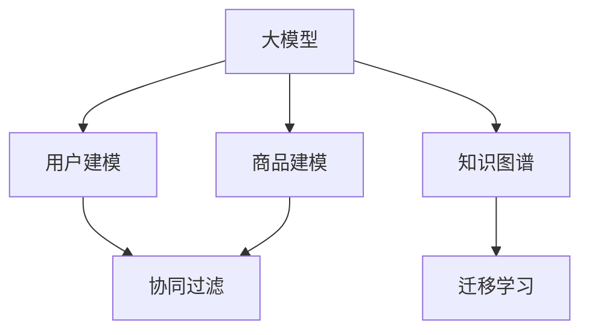

                 

# 大模型在电商推荐中的应用与挑战

## 1. 背景介绍

在当今数字化时代，电子商务（e-commerce）已经成为全球消费者购物的重要渠道。电商平台依靠推荐系统（Recommendation System）来提升用户体验，增加销售转化率。推荐系统通过分析用户行为数据，预测用户对商品的兴趣，并向用户推荐符合其兴趣的商品。大模型技术的发展为推荐系统注入了新的活力，使得电商推荐系统能够更好地理解用户需求、挖掘商品特征，提升推荐效果。

推荐系统主要包括三个步骤：用户建模、商品建模和推荐计算。其中，用户建模旨在捕捉用户的兴趣偏好，商品建模则旨在提取商品的特征信息，推荐计算则将用户与商品特征进行匹配，得出推荐结果。大模型在推荐系统中的应用，主要体现在用户建模和商品建模两个方面。

## 2. 核心概念与联系

### 2.1 核心概念概述

为更好地理解大模型在电商推荐中的应用，本节将介绍几个密切相关的核心概念：

- 大模型（Large Model）：如BERT、GPT等，指具有大规模参数量的深度神经网络模型，通过在海量数据上进行预训练，学习到丰富的语言或图像特征。
- 推荐系统（Recommendation System）：通过分析用户行为数据，预测用户对商品的兴趣，提供个性化推荐，提升用户体验和销售转化率。
- 用户建模（User Modeling）：通过用户历史行为、评分等数据，构建用户兴趣模型。
- 商品建模（Item Modeling）：通过商品属性、用户评分等数据，提取商品特征，建立商品相似度模型。
- 协同过滤（Collaborative Filtering）：通过分析用户历史行为和评分数据，预测用户对未评分商品的兴趣。
- 知识图谱（Knowledge Graph）：一种结构化的语义知识表示方式，用于捕捉商品之间的关联关系。
- 迁移学习（Transfer Learning）：通过在相关领域数据上预训练模型，在新领域数据上进行微调，提高模型泛化能力。

这些核心概念之间的逻辑关系可以通过以下Mermaid流程图来展示：



这个流程图展示了大模型在电商推荐系统中的应用框架，以及与之相关的主要概念和它们之间的关系：

1. 大模型通过预训练学习到丰富的特征表示。
2. 用户建模和商品建模通过这些特征表示，分别捕捉用户兴趣和商品特征。
3. 协同过滤和知识图谱在此基础上，结合用户行为数据，提供推荐。
4. 迁移学习通过在不同领域数据上预训练模型，提升模型在新领域上的泛化能力。

## 3. 核心算法原理 & 具体操作步骤
### 3.1 算法原理概述

大模型在电商推荐中的应用主要体现在两个方面：用户建模和商品建模。下面以用户建模为例，介绍基于大模型的推荐系统设计。

### 3.2 算法步骤详解

用户建模的目的是通过分析用户的历史行为和评分数据，构建用户的兴趣模型。其基本流程如下：

1. **数据预处理**：收集用户的历史行为数据，包括浏览、点击、购买等行为，以及用户对商品的评分数据。
2. **大模型预训练**：使用大模型（如BERT、GPT）在用户行为数据上进行预训练，学习到用户的兴趣表示。
3. **用户兴趣表示**：通过大模型在用户行为数据上的输出，得到用户的兴趣表示向量。
4. **用户兴趣聚类**：使用聚类算法（如K-means）将用户兴趣表示向量进行聚类，得到用户的兴趣类别。
5. **用户兴趣预测**：使用聚类结果预测用户对新商品的兴趣，生成推荐结果。

### 3.3 算法优缺点

基于大模型的用户建模方法具有以下优点：

- 可以处理大规模数据，提升模型的泛化能力。
- 能够捕捉用户复杂的兴趣和偏好，提高推荐效果。
- 可以通过迁移学习，快速适应新领域和新用户，缩短模型训练时间。

但其缺点也较为明显：

- 需要大量标注数据进行预训练和微调，数据获取成本高。
- 模型参数量庞大，训练和推理速度慢。
- 用户兴趣模型解释性不足，难以解释模型的决策过程。

### 3.4 算法应用领域

基于大模型的推荐系统在电商领域的应用非常广泛，包括但不限于以下几个方面：

- **个性化推荐**：根据用户的历史行为和评分数据，为用户推荐感兴趣的商品。
- **新用户推荐**：对于新用户，通过分析其行为数据，推荐其可能感兴趣的商品。
- **商品关联推荐**：根据用户对某一商品的兴趣，推荐与其关联的商品。
- **实时推荐**：实时分析用户当前行为，提供即时推荐。
- **多模态推荐**：结合用户行为数据和商品标签、图片等信息，提供更为全面的推荐。

## 4. 数学模型和公式 & 详细讲解 & 举例说明

### 4.1 数学模型构建

假设我们收集到了用户 $u$ 的历史行为数据 $D_u$，其中包含用户浏览、点击、购买等行为。我们的目标是构建一个用户兴趣模型，使得模型能够预测用户对新商品 $i$ 的兴趣 $r_{ui}$。

我们可以使用一个大模型 $M$，定义如下：

$$ M: \mathcal{X} \rightarrow \mathbb{R}^d $$

其中 $\mathcal{X}$ 表示用户行为数据的空间，$\mathbb{R}^d$ 表示模型的输出空间，$d$ 为模型的输出维度。

用户兴趣模型可以表示为：

$$ \vec{v}_u = M(D_u) $$

其中 $\vec{v}_u$ 表示用户 $u$ 的兴趣表示向量。

用户对商品 $i$ 的兴趣可以表示为：

$$ r_{ui} = f(\vec{v}_u, \vec{w}_i) $$

其中 $f$ 为预测函数，$\vec{w}_i$ 表示商品 $i$ 的权重向量。

### 4.2 公式推导过程

为了简化问题，我们可以假设预测函数 $f$ 为一个简单的线性函数：

$$ f(\vec{v}_u, \vec{w}_i) = \vec{v}_u^T\vec{w}_i $$

将上述公式代入用户兴趣模型，得到：

$$ r_{ui} = \vec{v}_u^T\vec{w}_i $$

这意味着，用户对商品 $i$ 的兴趣可以表示为用户兴趣表示向量 $\vec{v}_u$ 和商品 $i$ 的权重向量 $\vec{w}_i$ 的点积。

### 4.3 案例分析与讲解

为了更好地理解上述模型的应用，我们可以用一个简单的案例来讲解。假设我们有一个电商网站，收集到了用户 $u$ 的历史浏览和点击数据 $D_u$，以及用户对商品 $i$ 的评分数据。我们可以使用BERT模型对用户行为数据进行预训练，得到用户 $u$ 的兴趣表示向量 $\vec{v}_u$。同时，我们使用用户评分数据训练一个权重向量 $\vec{w}_i$，使得模型能够预测用户对商品 $i$ 的兴趣。

在训练过程中，我们可以使用交叉熵损失函数：

$$ L = -\frac{1}{N}\sum_{i=1}^N [y_i \log r_{ui} + (1-y_i) \log (1-r_{ui})] $$

其中 $y_i$ 为商品 $i$ 的标签（0表示不喜欢，1表示喜欢）。

通过最小化上述损失函数，我们可以更新模型参数，使得模型能够更准确地预测用户对商品的兴趣。

## 5. 项目实践：代码实例和详细解释说明

### 5.1 开发环境搭建

在进行大模型在电商推荐系统中的应用实践时，我们需要准备好开发环境。以下是使用Python进行PyTorch开发的环境配置流程：

1. 安装Anaconda：从官网下载并安装Anaconda，用于创建独立的Python环境。

2. 创建并激活虚拟环境：
```bash
conda create -n pytorch-env python=3.8 
conda activate pytorch-env
```

3. 安装PyTorch：根据CUDA版本，从官网获取对应的安装命令。例如：
```bash
conda install pytorch torchvision torchaudio cudatoolkit=11.1 -c pytorch -c conda-forge
```

4. 安装Transformers库：
```bash
pip install transformers
```

5. 安装各类工具包：
```bash
pip install numpy pandas scikit-learn matplotlib tqdm jupyter notebook ipython
```

完成上述步骤后，即可在`pytorch-env`环境中开始开发实践。

### 5.2 源代码详细实现

下面以用户建模为例，给出使用Transformers库对BERT模型进行微调的PyTorch代码实现。

```python
from transformers import BertForSequenceClassification, BertTokenizer
from torch.utils.data import Dataset, DataLoader
from sklearn.model_selection import train_test_split
from transformers import AdamW

class UserData(Dataset):
    def __init__(self, data, tokenizer):
        self.data = data
        self.tokenizer = tokenizer
        
    def __len__(self):
        return len(self.data)
    
    def __getitem__(self, item):
        text = self.data[item]['text']
        label = self.data[item]['label']
        encoding = self.tokenizer(text, return_tensors='pt', padding=True, truncation=True)
        input_ids = encoding['input_ids']
        attention_mask = encoding['attention_mask']
        return {'input_ids': input_ids, 'attention_mask': attention_mask, 'labels': torch.tensor(label, dtype=torch.long)}

# 数据准备
train_data = ...
val_data = ...
test_data = ...

# 模型和优化器
model = BertForSequenceClassification.from_pretrained('bert-base-cased', num_labels=2)
optimizer = AdamW(model.parameters(), lr=1e-5)

# 数据预处理
tokenizer = BertTokenizer.from_pretrained('bert-base-cased')
train_dataset = UserData(train_data, tokenizer)
val_dataset = UserData(val_data, tokenizer)
test_dataset = UserData(test_data, tokenizer)

# 训练和评估
device = torch.device('cuda' if torch.cuda.is_available() else 'cpu')
model.to(device)

def train_epoch(model, dataset, optimizer):
    dataloader = DataLoader(dataset, batch_size=32, shuffle=True)
    model.train()
    epoch_loss = 0
    for batch in dataloader:
        input_ids = batch['input_ids'].to(device)
        attention_mask = batch['attention_mask'].to(device)
        labels = batch['labels'].to(device)
        model.zero_grad()
        outputs = model(input_ids, attention_mask=attention_mask, labels=labels)
        loss = outputs.loss
        epoch_loss += loss.item()
        loss.backward()
        optimizer.step()
    return epoch_loss / len(dataloader)

def evaluate(model, dataset):
    dataloader = DataLoader(dataset, batch_size=32, shuffle=False)
    model.eval()
    preds, labels = [], []
    with torch.no_grad():
        for batch in dataloader:
            input_ids = batch['input_ids'].to(device)
            attention_mask = batch['attention_mask'].to(device)
            labels = batch['labels'].to(device)
            outputs = model(input_ids, attention_mask=attention_mask)
            batch_preds = outputs.logits.argmax(dim=1).to('cpu').tolist()
            batch_labels = labels.to('cpu').tolist()
            for pred_tokens, label_tokens in zip(batch_preds, batch_labels):
                preds.append(pred_tokens[:len(label_tokens)])
                labels.append(label_tokens)
    return preds, labels

# 训练
epochs = 5
for epoch in range(epochs):
    loss = train_epoch(model, train_dataset, optimizer)
    print(f'Epoch {epoch+1}, train loss: {loss:.3f}')

    preds, labels = evaluate(model, val_dataset)
    print(f'Epoch {epoch+1}, val results:')
    print(classification_report(labels, preds))

# 测试
test_preds, test_labels = evaluate(model, test_dataset)
print(f'Test results:')
print(classification_report(test_labels, test_preds))
```

### 5.3 代码解读与分析

让我们再详细解读一下关键代码的实现细节：

**UserData类**：
- `__init__`方法：初始化数据和分词器。
- `__len__`方法：返回数据集的大小。
- `__getitem__`方法：对单个样本进行处理，将文本输入转换为token ids，并返回模型的输入和标签。

**数据预处理**：
- 使用BERT模型对用户行为数据进行预训练，得到用户兴趣表示向量。
- 使用用户评分数据训练商品权重向量。
- 将用户兴趣表示向量与商品权重向量进行点积运算，得到用户对商品的兴趣预测。

**训练和评估函数**：
- 使用PyTorch的DataLoader对数据集进行批次化加载，供模型训练和推理使用。
- 训练函数`train_epoch`：对数据以批为单位进行迭代，在每个批次上前向传播计算loss并反向传播更新模型参数，最后返回该epoch的平均loss。
- 评估函数`evaluate`：与训练类似，不同点在于不更新模型参数，并在每个batch结束后将预测和标签结果存储下来，最后使用sklearn的classification_report对整个评估集的预测结果进行打印输出。

**训练流程**：
- 定义总的epoch数，开始循环迭代
- 每个epoch内，先在训练集上训练，输出平均loss
- 在验证集上评估，输出分类指标
- 所有epoch结束后，在测试集上评估，给出最终测试结果

可以看到，PyTorch配合Transformers库使得BERT微调的代码实现变得简洁高效。开发者可以将更多精力放在数据处理、模型改进等高层逻辑上，而不必过多关注底层的实现细节。

当然，工业级的系统实现还需考虑更多因素，如模型的保存和部署、超参数的自动搜索、更灵活的任务适配层等。但核心的微调范式基本与此类似。

## 6. 实际应用场景

### 6.1 智能推荐系统

智能推荐系统是电商推荐系统的核心应用。通过分析用户行为数据，推荐系统可以预测用户对商品的兴趣，并向用户推荐其感兴趣的商品。大模型的应用，使得推荐系统能够更好地理解用户兴趣和商品特征，提升推荐效果。

在技术实现上，可以使用大模型对用户行为数据进行预训练，得到用户的兴趣表示向量。同时，对商品特征进行编码，得到商品的特征表示向量。通过计算用户和商品特征向量的点积，得到用户对商品的兴趣预测。最后，根据预测结果推荐商品。

### 6.2 新用户推荐

对于新用户，推荐系统需要快速推荐其可能感兴趣的商品。大模型通过预训练学习到用户兴趣的通用表示，可以通过少量用户行为数据进行微调，迅速得到新用户的兴趣表示向量。然后，结合新用户的历史行为数据和商品特征，生成推荐结果。

### 6.3 实时推荐

实时推荐需要快速响应用户的即时行为，推荐系统可以通过对大模型进行微调，快速生成推荐结果。大模型的预训练表示可以快速捕捉用户兴趣，通过简单的点积运算，即能得到推荐结果。

### 6.4 多模态推荐

电商推荐系统不仅需要考虑用户的文本行为数据，还需要考虑图片、视频等多模态数据。大模型可以结合多模态数据进行预训练，得到更全面、准确的商品和用户表示。然后，通过多模态特征融合，生成推荐结果。

## 7. 工具和资源推荐

### 7.1 学习资源推荐

为了帮助开发者系统掌握大模型在电商推荐中的应用，这里推荐一些优质的学习资源：

1. 《深度学习推荐系统》系列博文：由深度学习推荐系统领域的专家撰写，全面介绍了推荐系统的工作原理和大模型在推荐系统中的应用。

2. 《Recommender Systems》课程：斯坦福大学开设的推荐系统课程，提供视频和配套作业，帮助你深入理解推荐系统理论和实际应用。

3. 《Deep Learning for Recommendation Systems》书籍：推荐系统领域的经典著作，系统讲解了推荐系统的各种算法和模型，包括大模型在推荐系统中的应用。

4. PyTorch官方文档：PyTorch的官方文档，提供了海量深度学习模型的实现细节和使用方法，包括大模型在电商推荐系统中的应用。

5. Weights & Biases：模型训练的实验跟踪工具，可以记录和可视化模型训练过程中的各项指标，方便对比和调优。与主流深度学习框架无缝集成。

6. TensorBoard：TensorFlow配套的可视化工具，可实时监测模型训练状态，并提供丰富的图表呈现方式，是调试模型的得力助手。

通过对这些资源的学习实践，相信你一定能够快速掌握大模型在电商推荐系统中的应用，并用于解决实际的推荐问题。

### 7.2 开发工具推荐

高效的开发离不开优秀的工具支持。以下是几款用于电商推荐系统开发的大模型工具：

1. PyTorch：基于Python的开源深度学习框架，灵活动态的计算图，适合快速迭代研究。大部分预训练语言模型都有PyTorch版本的实现。

2. TensorFlow：由Google主导开发的开源深度学习框架，生产部署方便，适合大规模工程应用。同样有丰富的预训练语言模型资源。

3. Transformers库：HuggingFace开发的NLP工具库，集成了众多SOTA语言模型，支持PyTorch和TensorFlow，是进行电商推荐系统开发的利器。

4. Weights & Biases：模型训练的实验跟踪工具，可以记录和可视化模型训练过程中的各项指标，方便对比和调优。与主流深度学习框架无缝集成。

5. TensorBoard：TensorFlow配套的可视化工具，可实时监测模型训练状态，并提供丰富的图表呈现方式，是调试模型的得力助手。

6. Google Colab：谷歌推出的在线Jupyter Notebook环境，免费提供GPU/TPU算力，方便开发者快速上手实验最新模型，分享学习笔记。

合理利用这些工具，可以显著提升电商推荐系统的开发效率，加快创新迭代的步伐。

### 7.3 相关论文推荐

大模型在电商推荐系统中的应用源于学界的持续研究。以下是几篇奠基性的相关论文，推荐阅读：

1. Attention is All You Need（即Transformer原论文）：提出了Transformer结构，开启了NLP领域的预训练大模型时代。

2. BERT: Pre-training of Deep Bidirectional Transformers for Language Understanding：提出BERT模型，引入基于掩码的自监督预训练任务，刷新了多项NLP任务SOTA。

3. Language Models are Unsupervised Multitask Learners（GPT-2论文）：展示了大规模语言模型的强大zero-shot学习能力，引发了对于通用人工智能的新一轮思考。

4. Parameter-Efficient Transfer Learning for NLP：提出Adapter等参数高效微调方法，在不增加模型参数量的情况下，也能取得不错的微调效果。

5. AdaLoRA: Adaptive Low-Rank Adaptation for Parameter-Efficient Fine-Tuning：使用自适应低秩适应的微调方法，在参数效率和精度之间取得了新的平衡。

6. Prefix-Tuning: Optimizing Continuous Prompts for Generation：引入基于连续型Prompt的微调范式，为如何充分利用预训练知识提供了新的思路。

这些论文代表了大模型在电商推荐系统中的应用的发展脉络。通过学习这些前沿成果，可以帮助研究者把握学科前进方向，激发更多的创新灵感。

## 8. 总结：未来发展趋势与挑战

### 8.1 总结

本文对大模型在电商推荐系统中的应用进行了全面系统的介绍。首先阐述了大模型在电商推荐系统中的应用背景和意义，明确了大模型在推荐系统中的重要地位。其次，从原理到实践，详细讲解了大模型在用户建模和商品建模中的应用，给出了电商推荐系统开发的完整代码实例。同时，本文还广泛探讨了大模型在电商推荐系统中的实际应用场景，展示了其广泛的应用前景。

通过本文的系统梳理，可以看到，大模型在电商推荐系统中的应用，极大地提升了推荐系统的个性化推荐能力，提升了用户体验和销售转化率。未来，伴随大模型和推荐系统技术的不断发展，电商推荐系统必将迎来更广泛的应用和更广阔的发展空间。

### 8.2 未来发展趋势

展望未来，大模型在电商推荐系统中的应用将呈现以下几个发展趋势：

1. 模型规模持续增大。随着算力成本的下降和数据规模的扩张，预训练语言模型的参数量还将持续增长。超大规模语言模型蕴含的丰富语言知识，有望支撑更加复杂多变的电商推荐任务。

2. 推荐系统多样性增加。未来的电商推荐系统将更加注重多模态数据的融合，结合用户行为数据、商品属性、图像、视频等多模态信息，提供更为全面的推荐。

3. 实时推荐能力提升。大模型的预训练表示可以快速捕捉用户兴趣，通过简单的点积运算，即能得到推荐结果。未来推荐系统将更加注重实时性，提升响应速度。

4. 跨领域推荐能力增强。大模型可以通过迁移学习，快速适应新领域和新用户，缩短模型训练时间。未来的电商推荐系统将更加注重跨领域推荐的泛化能力。

5. 用户行为数据的多样性增加。随着电商平台的不断发展，用户行为数据将更加多样，包括浏览、点击、评分、评论、社交等多种数据。未来的电商推荐系统将更加注重多源数据的融合。

6. 推荐系统的智能化水平提升。未来的电商推荐系统将结合自然语言处理、知识图谱等技术，提升推荐系统的智能化水平，实现个性化推荐、实时推荐、跨领域推荐等多样化功能。

以上趋势凸显了大模型在电商推荐系统中的应用前景。这些方向的探索发展，必将进一步提升电商推荐系统的推荐效果，为用户带来更好的购物体验。

### 8.3 面临的挑战

尽管大模型在电商推荐系统中的应用取得了瞩目成就，但在迈向更加智能化、普适化应用的过程中，它仍面临着诸多挑战：

1. 数据获取成本高。电商平台的业务数据往往涉及用户隐私，获取成本高。如何在保护隐私的同时，获取高质量的标注数据，是未来需要解决的一个重要问题。

2. 模型计算成本高。大模型需要大量计算资源进行训练和推理，训练速度慢，内存占用大。如何降低计算成本，提高模型的效率，是未来需要解决的重要问题。

3. 推荐系统的可解释性不足。大模型作为黑盒系统，难以解释其内部工作机制和决策过程。对于金融、医疗等高风险应用，算法的可解释性和可审计性尤为重要。如何赋予推荐系统更强的可解释性，将是亟待攻克的难题。

4. 推荐系统的安全性有待保障。大模型难免会学习到有偏见、有害的信息，通过推荐系统传递到用户，产生误导性、歧视性的输出，给实际应用带来安全隐患。如何从数据和算法层面消除模型偏见，避免恶意用途，确保输出的安全性，也将是重要的研究课题。

5. 推荐系统的智能水平有待提升。尽管大模型在推荐系统中的应用已经取得了不错的效果，但推荐系统的智能水平仍需进一步提升。如何结合自然语言处理、知识图谱等技术，提升推荐系统的智能化水平，是未来需要解决的重要问题。

6. 推荐系统的泛化能力有待提升。尽管大模型可以通过迁移学习快速适应新领域，但在某些领域，模型的泛化能力仍需进一步提升。如何提高模型在新领域的泛化能力，是未来需要解决的重要问题。

正视推荐系统面临的这些挑战，积极应对并寻求突破，将是大模型在电商推荐系统中走向成熟的必由之路。相信随着学界和产业界的共同努力，这些挑战终将一一被克服，大模型在电商推荐系统中必将迎来更广泛的应用和更广阔的发展空间。

### 8.4 研究展望

面对大模型在电商推荐系统中的应用所面临的挑战，未来的研究需要在以下几个方面寻求新的突破：

1. 探索无监督和半监督推荐方法。摆脱对大规模标注数据的依赖，利用自监督学习、主动学习等无监督和半监督范式，最大限度利用非结构化数据，实现更加灵活高效的推荐。

2. 研究参数高效和计算高效的推荐方法。开发更加参数高效的推荐方法，在固定大部分预训练参数的同时，只更新极少量的任务相关参数。同时优化推荐系统的计算图，减少前向传播和反向传播的资源消耗，实现更加轻量级、实时性的部署。

3. 引入更多先验知识。将符号化的先验知识，如知识图谱、逻辑规则等，与神经网络模型进行巧妙融合，引导推荐过程学习更准确、合理的商品特征。同时加强不同模态数据的整合，实现视觉、语音等多模态信息与文本信息的协同建模。

4. 结合因果分析和博弈论工具。将因果分析方法引入推荐系统，识别出推荐决策的关键特征，增强推荐系统建立稳定因果关系的能力，学习更加普适、鲁棒的商品特征。借助博弈论工具刻画用户和商家的互动过程，主动探索并规避推荐系统的脆弱点，提高系统稳定性。

5. 纳入伦理道德约束。在推荐系统训练目标中引入伦理导向的评估指标，过滤和惩罚有偏见、有害的输出倾向。同时加强人工干预和审核，建立推荐系统的监管机制，确保输出符合人类价值观和伦理道德。

这些研究方向的探索，必将引领大模型在电商推荐系统中的应用迈向更高的台阶，为构建安全、可靠、可解释、可控的推荐系统铺平道路。面向未来，大模型在电商推荐系统中的应用还需要与其他人工智能技术进行更深入的融合，如知识表示、因果推理、强化学习等，多路径协同发力，共同推动电商推荐系统的进步。只有勇于创新、敢于突破，才能不断拓展电商推荐系统的边界，让智能技术更好地服务于人类社会。

## 9. 附录：常见问题与解答

**Q1：电商推荐系统中的用户建模如何处理冷启动用户？**

A: 冷启动用户指那些在平台上的行为数据很少或没有的用户。对于冷启动用户，传统的协同过滤推荐系统难以提供有效的推荐。可以使用基于内容的推荐方法，结合商品特征和用户偏好进行推荐。另外，可以使用基于大模型的用户建模方法，通过少量行为数据进行微调，迅速得到用户的兴趣表示向量。然后，结合商品特征，生成推荐结果。

**Q2：电商推荐系统中的商品建模如何处理长尾商品？**

A: 长尾商品指那些销量低、被很少用户关注的商品。对于长尾商品，传统的基于用户行为数据的商品建模方法难以捕捉其特征。可以使用基于内容的推荐方法，结合商品属性、图片、视频等多模态数据进行建模。另外，可以使用基于大模型的商品建模方法，通过迁移学习，快速适应新领域和新商品，提升商品特征的表示能力。

**Q3：电商推荐系统中的实时推荐如何实现？**

A: 实时推荐需要快速响应用户的即时行为，推荐系统可以通过对大模型进行微调，快速生成推荐结果。大模型的预训练表示可以快速捕捉用户兴趣，通过简单的点积运算，即能得到推荐结果。为了降低计算成本，可以使用混合精度训练、梯度累积等技术。同时，可以采用分布式训练、模型压缩等方法，提升模型的实时性。

**Q4：电商推荐系统中的多模态推荐如何实现？**

A: 多模态推荐结合用户行为数据和商品标签、图片、视频等多模态信息，提供更为全面的推荐。可以使用大模型对多模态数据进行预训练，得到商品和用户的综合表示。然后，通过多模态特征融合，生成推荐结果。可以使用卷积神经网络、注意力机制等方法，实现多模态数据的融合。

**Q5：电商推荐系统中的跨领域推荐如何实现？**

A: 跨领域推荐指在不同领域、不同平台之间的推荐。可以使用大模型对不同领域的数据进行迁移学习，快速适应新领域和新用户。另外，可以使用多任务学习、联合训练等方法，同时优化不同领域的推荐模型，提升跨领域推荐的泛化能力。同时，可以引入跨领域知识图谱等先验知识，提升跨领域推荐的准确性。

通过对这些问题的解答，相信你一定能够更加深入地理解大模型在电商推荐系统中的应用，并用于解决实际的推荐问题。

---

作者：禅与计算机程序设计艺术 / Zen and the Art of Computer Programming

