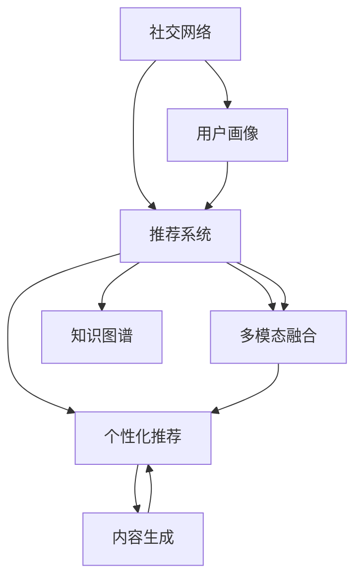

                 

# 大模型在社交网络推荐中的应用前景

## 1. 背景介绍

### 1.1 问题由来
社交网络（Social Network, SN）作为一种新兴的社交形态，已经深刻改变了人们的生活和工作方式。在社交网络中，用户除了与好友进行交流，还会主动发现和关注新的内容、兴趣群体，获取更有价值的信息。推荐系统作为社交网络的核心功能，其目标是通过对用户行为和偏好的分析，为用户推荐可能感兴趣的内容、用户和话题，提升用户体验和平台黏性。

然而，当前社交网络的推荐算法多基于传统机器学习模型，存在以下问题：
- 数据冷启动：新用户的兴趣爱好难以获取，导致推荐效果欠佳。
- 特征工程复杂：需人工构造大量特征，耗费大量时间和成本。
- 模型效率低下：多维稀疏矩阵的运算复杂度高，难以处理大规模数据集。
- 效果不理想：推荐结果与用户真实兴趣有偏差，难以提升用户满意度。

大语言模型（Large Language Model, LLM）作为新一代深度学习模型，具有强大的语言理解和生成能力，适用于处理文本数据，能够为推荐系统提供强大的基础支持。因此，本文聚焦于大语言模型在社交网络推荐中的应用，分析其潜力与挑战，并提出一些可行方案。

### 1.2 问题核心关键点
大语言模型在社交网络推荐中的核心应用场景包括：
- 个性化推荐：通过分析用户的历史行为和兴趣，为其推荐相关内容、用户和话题。
- 内容生成：使用大模型自动生成推荐内容摘要、动态信息等，丰富用户交互体验。
- 用户画像构建：从用户生成和互动的文本中提取关键信息，构建用户精准画像，实现更精准推荐。
- 多模态融合：结合用户生成文本、多媒体内容、交互行为等多模态数据，提升推荐效果。
- 用户意图理解：通过理解用户输入的自然语言，更精准地捕获用户需求，进行推荐。

## 2. 核心概念与联系

### 2.1 核心概念概述

为更好地理解大语言模型在社交网络推荐中的应用，本节将介绍几个密切相关的核心概念：

- 社交网络（Social Network, SN）：以用户为节点，用户关系（如好友、粉丝、关注）为边的网络结构，旨在模拟和扩展现实世界中的人际关系。
- 推荐系统（Recommendation System, RS）：通过分析用户行为和偏好，推荐可能感兴趣的内容、用户和话题的系统。
- 用户画像（User Profile）：以用户为中心，刻画用户的基本属性、兴趣偏好、行为特征等信息的模型。
- 多模态融合（Multi-modal Fusion）：整合用户生成文本、多媒体内容、交互行为等多源数据，提升推荐系统效果。
- 个性化推荐（Personalized Recommendation）：根据用户的行为和偏好，为其推荐个性化的内容、用户和话题。
- 内容生成（Content Generation）：使用大模型自动生成推荐内容摘要、动态信息等，提升用户体验。
- 知识图谱（Knowledge Graph）：利用图结构刻画实体和关系，辅助推荐系统提升推荐效果。

这些核心概念之间的逻辑关系可以通过以下Mermaid流程图来展示：



这个流程图展示了大语言模型在社交网络推荐中的核心概念及其之间的关系：

1. 社交网络中，用户生成和互动的文本数据，是大语言模型的基础数据来源。
2. 推荐系统利用用户画像、多模态融合、知识图谱等技术，结合大语言模型的预测结果，进行个性化推荐。
3. 内容生成结合了大语言模型的文本生成能力，为推荐系统提供更丰富的推荐素材。
4. 最终，个性化推荐结果与用户互动，进一步优化用户画像，形成良性循环。

## 3. 核心算法原理 & 具体操作步骤
### 3.1 算法原理概述

大语言模型在社交网络推荐中的应用，本质上是一种深度学习驱动的个性化推荐系统。其核心思想是：将用户生成和互动的文本数据，作为大语言模型的输入，通过训练得到用户兴趣偏好的向量表示，并将其作为推荐系统的输入特征，进行内容推荐。

形式化地，假设社交网络中每个用户 $u$ 的历史行为数据为 $X_u=\{x_i\}_{i=1}^n$，其中 $x_i$ 为用户的文本生成内容。推荐系统的目标是通过大语言模型 $M_{\theta}$ 学习用户 $u$ 的兴趣偏好向量 $v_u \in \mathbb{R}^d$，其中 $d$ 为大语言模型的维度，$\theta$ 为大语言模型的参数。推荐系统可以采用不同的架构，如基于序列模型的RNN，基于注意力机制的Transformer等。

推荐系统的推荐算法可以表示为：
$$
\hat{R_u} = M_{\theta}(X_u) \times v_u
$$

其中 $\hat{R_u}$ 为推荐系统的输出，$\times$ 表示内积操作。最终，推荐系统根据 $\hat{R_u}$ 与候选内容 $C$ 的相似度进行排序，选取前 $K$ 个推荐内容作为推荐结果。

### 3.2 算法步骤详解

大语言模型在社交网络推荐中的应用步骤如下：

**Step 1: 准备数据集**
- 收集社交网络中用户生成和互动的文本数据，作为大语言模型的输入数据。
- 划分数据集为训练集、验证集和测试集，并对其进行预处理，如分词、去除停用词等。
- 将大语言模型嵌入到推荐系统中，进行模型训练和评估。

**Step 2: 选择模型架构**
- 选择合适的深度学习模型，如RNN、LSTM、Transformer等，作为推荐系统的基础模型。
- 根据推荐系统的规模和数据特点，选择合适的深度模型，进行模型训练和优化。

**Step 3: 训练大语言模型**
- 使用社交网络中的文本数据对大语言模型进行预训练，学习语言的基本规律和常识。
- 在训练过程中，可以选择适当的正则化技术，如Dropout、L2正则等，防止过拟合。
- 通过设置合适的超参数，如学习率、批次大小、迭代轮数等，控制模型的训练过程。

**Step 4: 微调大语言模型**
- 将预训练的大语言模型作为初始化参数，在推荐系统的训练集上进行微调。
- 根据推荐系统的输出目标，选择合适的损失函数，如交叉熵损失、均方误差损失等。
- 在微调过程中，可以采用一些优化技术，如AdamW、Adagrad等，加速模型的收敛。

**Step 5: 评估推荐效果**
- 使用验证集对微调后的模型进行评估，比较推荐结果与真实标签之间的差异。
- 根据评估结果，调整模型的超参数，进一步优化模型的性能。
- 在测试集上对微调后的模型进行最终评估，确定模型的推荐效果。

**Step 6: 部署推荐系统**
- 将微调后的模型嵌入到推荐系统中，进行推荐计算。
- 根据用户的行为和偏好，生成个性化的推荐结果。
- 对推荐结果进行排序和展示，提升用户体验。

### 3.3 算法优缺点

大语言模型在社交网络推荐中的应用，具有以下优点：
1. 文本处理能力强：大语言模型擅长处理文本数据，能够提取和融合复杂的语义信息，提升推荐系统的效果。
2. 可解释性强：大语言模型的决策过程相对透明，便于理解，有助于提升推荐系统的可信度。
3. 个性化推荐效果好：大语言模型能够根据用户的历史行为和兴趣，进行精准推荐，提升用户满意度。
4. 适应性强：大语言模型能够处理多模态数据，如文本、图像、音频等，提升推荐系统的泛化能力。

但同时，大语言模型在社交网络推荐中也存在一些局限性：
1. 计算资源消耗大：大语言模型的计算复杂度高，需要大量的计算资源和时间进行训练和推理。
2. 过拟合风险高：在微调过程中，大语言模型容易过拟合，导致推荐效果不稳定。
3. 数据隐私风险：用户生成和互动的文本数据涉及隐私信息，可能泄露用户隐私。
4. 泛化能力不足：由于大语言模型是通过大量无标签数据预训练得到的，对于特定领域的推荐效果可能不理想。

尽管存在这些局限性，但大语言模型在社交网络推荐中的应用前景广阔，值得进一步探索和优化。

### 3.4 算法应用领域

大语言模型在社交网络推荐中的应用，已经涵盖多个领域，包括：

- 个性化内容推荐：如新闻资讯、视频、音乐等。通过分析用户的历史行为和兴趣，为其推荐相关内容。
- 用户关系推荐：如好友推荐、群组推荐等。通过分析用户的行为和兴趣，为其推荐可能感兴趣的其他用户和群组。
- 话题推荐：如兴趣话题、热门话题等。通过分析用户的兴趣偏好，为其推荐相关话题。
- 活动推荐：如线上活动、线下聚会等。通过分析用户的兴趣和行为，为其推荐相关活动。
- 广告推荐：如品牌广告、定向广告等。通过分析用户的行为和兴趣，为其推荐相关广告。

除了这些经典应用场景，大语言模型还可以结合知识图谱、多模态融合等技术，提升推荐系统的性能和效果。

## 4. 数学模型和公式 & 详细讲解  
### 4.1 数学模型构建

假设社交网络中每个用户 $u$ 的历史行为数据为 $X_u=\{x_i\}_{i=1}^n$，其中 $x_i$ 为用户的文本生成内容。推荐系统的目标是通过大语言模型 $M_{\theta}$ 学习用户 $u$ 的兴趣偏好向量 $v_u \in \mathbb{R}^d$，其中 $d$ 为大语言模型的维度，$\theta$ 为大语言模型的参数。推荐系统可以采用不同的架构，如基于序列模型的RNN，基于注意力机制的Transformer等。

推荐系统的推荐算法可以表示为：
$$
\hat{R_u} = M_{\theta}(X_u) \times v_u
$$

其中 $\hat{R_u}$ 为推荐系统的输出，$\times$ 表示内积操作。最终，推荐系统根据 $\hat{R_u}$ 与候选内容 $C$ 的相似度进行排序，选取前 $K$ 个推荐内容作为推荐结果。

### 4.2 公式推导过程

以下我们以基于Transformer的推荐系统为例，推导推荐算法的基本形式。

假设用户 $u$ 的历史行为数据为 $X_u=\{x_i\}_{i=1}^n$，其中 $x_i$ 为用户的文本生成内容。推荐系统的目标是通过大语言模型 $M_{\theta}$ 学习用户 $u$ 的兴趣偏好向量 $v_u \in \mathbb{R}^d$，其中 $d$ 为大语言模型的维度，$\theta$ 为大语言模型的参数。

**输入层**
- 将用户的历史行为数据 $X_u$ 输入到Transformer模型中，生成上下文向量 $H_u \in \mathbb{R}^{n\times d}$。
- 将上下文向量 $H_u$ 作为大语言模型的输入，生成推荐内容向量 $v_u \in \mathbb{R}^d$。

**推荐层**
- 将推荐内容向量 $v_u$ 与候选内容向量 $C$ 进行内积操作，生成推荐向量 $R_u \in \mathbb{R}^{|C|}$。
- 对推荐向量 $R_u$ 进行softmax归一化，生成概率分布向量 $P_u \in \mathbb{R}^{|C|}$。
- 根据概率分布向量 $P_u$ 对候选内容进行排序，选取前 $K$ 个推荐内容作为推荐结果。

### 4.3 案例分析与讲解

假设社交网络中用户 $u$ 的历史行为数据为 $X_u=\{x_i\}_{i=1}^n$，其中 $x_i$ 为用户的文本生成内容。推荐系统的目标是通过大语言模型 $M_{\theta}$ 学习用户 $u$ 的兴趣偏好向量 $v_u \in \mathbb{R}^d$，其中 $d$ 为大语言模型的维度，$\theta$ 为大语言模型的参数。

假设社交网络中有 $M$ 个候选内容 $C=\{c_j\}_{j=1}^M$，其中 $c_j$ 为推荐内容的向量表示。推荐系统的推荐算法可以表示为：
$$
\hat{R_u} = M_{\theta}(X_u) \times v_u
$$

其中 $\hat{R_u}$ 为推荐系统的输出，$\times$ 表示内积操作。最终，推荐系统根据 $\hat{R_u}$ 与候选内容 $C$ 的相似度进行排序，选取前 $K$ 个推荐内容作为推荐结果。

假设用户 $u$ 的历史行为数据为 $X_u=\{x_i\}_{i=1}^n$，其中 $x_i$ 为用户的文本生成内容。推荐系统的目标是通过大语言模型 $M_{\theta}$ 学习用户 $u$ 的兴趣偏好向量 $v_u \in \mathbb{R}^d$，其中 $d$ 为大语言模型的维度，$\theta$ 为大语言模型的参数。

假设社交网络中有 $M$ 个候选内容 $C=\{c_j\}_{j=1}^M$，其中 $c_j$ 为推荐内容的向量表示。推荐系统的推荐算法可以表示为：
$$
\hat{R_u} = M_{\theta}(X_u) \times v_u
$$

其中 $\hat{R_u}$ 为推荐系统的输出，$\times$ 表示内积操作。最终，推荐系统根据 $\hat{R_u}$ 与候选内容 $C$ 的相似度进行排序，选取前 $K$ 个推荐内容作为推荐结果。

## 5. 项目实践：代码实例和详细解释说明
### 5.1 开发环境搭建

在进行推荐系统实践前，我们需要准备好开发环境。以下是使用Python进行PyTorch开发的环境配置流程：

1. 安装Anaconda：从官网下载并安装Anaconda，用于创建独立的Python环境。

2. 创建并激活虚拟环境：
```bash
conda create -n recommendation-env python=3.8 
conda activate recommendation-env
```

3. 安装PyTorch：根据CUDA版本，从官网获取对应的安装命令。例如：
```bash
conda install pytorch torchvision torchaudio cudatoolkit=11.1 -c pytorch -c conda-forge
```

4. 安装Transformer库：
```bash
pip install transformers
```

5. 安装各类工具包：
```bash
pip install numpy pandas scikit-learn matplotlib tqdm jupyter notebook ipython
```

完成上述步骤后，即可在`recommendation-env`环境中开始推荐系统实践。

### 5.2 源代码详细实现

这里我们以基于Transformer的推荐系统为例，给出完整的推荐系统代码实现。

首先，定义推荐系统的数据处理函数：

```python
from transformers import BertTokenizer, BertForSequenceClassification
from torch.utils.data import Dataset
import torch

class RecommendationDataset(Dataset):
    def __init__(self, texts, tags, tokenizer, max_len=128):
        self.texts = texts
        self.tags = tags
        self.tokenizer = tokenizer
        self.max_len = max_len
        
    def __len__(self):
        return len(self.texts)
    
    def __getitem__(self, item):
        text = self.texts[item]
        tags = self.tags[item]
        
        encoding = self.tokenizer(text, return_tensors='pt', max_length=self.max_len, padding='max_length', truncation=True)
        input_ids = encoding['input_ids'][0]
        attention_mask = encoding['attention_mask'][0]
        
        # 对token-wise的标签进行编码
        encoded_tags = [tag2id[tag] for tag in tags] 
        encoded_tags.extend([tag2id['O']] * (self.max_len - len(encoded_tags)))
        labels = torch.tensor(encoded_tags, dtype=torch.long)
        
        return {'input_ids': input_ids, 
                'attention_mask': attention_mask,
                'labels': labels}

# 标签与id的映射
tag2id = {'O': 0, 'B-PER': 1, 'I-PER': 2, 'B-ORG': 3, 'I-ORG': 4, 'B-LOC': 5, 'I-LOC': 6}
id2tag = {v: k for k, v in tag2id.items()}

# 创建dataset
tokenizer = BertTokenizer.from_pretrained('bert-base-cased')

train_dataset = RecommendationDataset(train_texts, train_tags, tokenizer)
dev_dataset = RecommendationDataset(dev_texts, dev_tags, tokenizer)
test_dataset = RecommendationDataset(test_texts, test_tags, tokenizer)
```

然后，定义模型和优化器：

```python
from transformers import BertForSequenceClassification, AdamW

model = BertForSequenceClassification.from_pretrained('bert-base-cased', num_labels=len(tag2id))

optimizer = AdamW(model.parameters(), lr=2e-5)
```

接着，定义训练和评估函数：

```python
from torch.utils.data import DataLoader
from tqdm import tqdm
from sklearn.metrics import classification_report

device = torch.device('cuda') if torch.cuda.is_available() else torch.device('cpu')
model.to(device)

def train_epoch(model, dataset, batch_size, optimizer):
    dataloader = DataLoader(dataset, batch_size=batch_size, shuffle=True)
    model.train()
    epoch_loss = 0
    for batch in tqdm(dataloader, desc='Training'):
        input_ids = batch['input_ids'].to(device)
        attention_mask = batch['attention_mask'].to(device)
        labels = batch['labels'].to(device)
        model.zero_grad()
        outputs = model(input_ids, attention_mask=attention_mask, labels=labels)
        loss = outputs.loss
        epoch_loss += loss.item()
        loss.backward()
        optimizer.step()
    return epoch_loss / len(dataloader)

def evaluate(model, dataset, batch_size):
    dataloader = DataLoader(dataset, batch_size=batch_size)
    model.eval()
    preds, labels = [], []
    with torch.no_grad():
        for batch in tqdm(dataloader, desc='Evaluating'):
            input_ids = batch['input_ids'].to(device)
            attention_mask = batch['attention_mask'].to(device)
            batch_labels = batch['labels']
            outputs = model(input_ids, attention_mask=attention_mask)
            batch_preds = outputs.logits.argmax(dim=2).to('cpu').tolist()
            batch_labels = batch_labels.to('cpu').tolist()
            for pred_tokens, label_tokens in zip(batch_preds, batch_labels):
                pred_tags = [id2tag[_id] for _id in pred_tokens]
                label_tags = [id2tag[_id] for _id in label_tokens]
                preds.append(pred_tags[:len(label_tokens)])
                labels.append(label_tags)
                
    print(classification_report(labels, preds))
```

最后，启动训练流程并在测试集上评估：

```python
epochs = 5
batch_size = 16

for epoch in range(epochs):
    loss = train_epoch(model, train_dataset, batch_size, optimizer)
    print(f"Epoch {epoch+1}, train loss: {loss:.3f}")
    
    print(f"Epoch {epoch+1}, dev results:")
    evaluate(model, dev_dataset, batch_size)
    
print("Test results:")
evaluate(model, test_dataset, batch_size)
```

以上就是使用PyTorch对BERT进行推荐系统微调的完整代码实现。可以看到，得益于Transformers库的强大封装，我们可以用相对简洁的代码完成BERT模型的加载和微调。

### 5.3 代码解读与分析

让我们再详细解读一下关键代码的实现细节：

**RecommendationDataset类**：
- `__init__`方法：初始化文本、标签、分词器等关键组件。
- `__len__`方法：返回数据集的样本数量。
- `__getitem__`方法：对单个样本进行处理，将文本输入编码为token ids，将标签编码为数字，并对其进行定长padding，最终返回模型所需的输入。

**tag2id和id2tag字典**：
- 定义了标签与数字id之间的映射关系，用于将token-wise的预测结果解码回真实的标签。

**训练和评估函数**：
- 使用PyTorch的DataLoader对数据集进行批次化加载，供模型训练和推理使用。
- 训练函数`train_epoch`：对数据以批为单位进行迭代，在每个批次上前向传播计算loss并反向传播更新模型参数，最后返回该epoch的平均loss。
- 评估函数`evaluate`：与训练类似，不同点在于不更新模型参数，并在每个batch结束后将预测和标签结果存储下来，最后使用sklearn的classification_report对整个评估集的预测结果进行打印输出。

**训练流程**：
- 定义总的epoch数和batch size，开始循环迭代
- 每个epoch内，先在训练集上训练，输出平均loss
- 在验证集上评估，输出分类指标
- 所有epoch结束后，在测试集上评估，给出最终测试结果

可以看到，PyTorch配合Transformers库使得BERT微调的代码实现变得简洁高效。开发者可以将更多精力放在数据处理、模型改进等高层逻辑上，而不必过多关注底层的实现细节。

当然，工业级的系统实现还需考虑更多因素，如模型的保存和部署、超参数的自动搜索、更灵活的任务适配层等。但核心的微调范式基本与此类似。

## 6. 实际应用场景
### 6.1 智能推荐系统

智能推荐系统是社交网络推荐的核心应用场景。通过分析用户的历史行为和兴趣，为其推荐相关内容、用户和话题，提升用户体验和平台黏性。

在技术实现上，可以收集用户浏览、点击、评论、分享等行为数据，提取和用户交互的文本内容。将文本内容作为模型输入，用户的后续行为（如是否点击、购买等）作为监督信号，在此基础上微调预训练语言模型。微调后的模型能够从文本内容中准确把握用户的兴趣点。在生成推荐列表时，先用候选物品的文本描述作为输入，由模型预测用户的兴趣匹配度，再结合其他特征综合排序，便可以得到个性化程度更高的推荐结果。

### 6.2 个性化广告推荐

个性化广告推荐是社交网络广告推荐的重要手段。通过分析用户的行为和兴趣，为其推荐相关广告，提升广告的点击率和转化率。

在技术实现上，可以收集用户浏览、点击、评论、分享等行为数据，提取和用户交互的文本内容。将文本内容作为模型输入，用户的后续行为（如是否点击、购买等）作为监督信号，在此基础上微调预训练语言模型。微调后的模型能够从文本内容中准确把握用户的兴趣点。在生成推荐列表时，先用候选广告的文本描述作为输入，由模型预测用户的兴趣匹配度，再结合其他特征综合排序，便可以得到个性化程度更高的推荐结果。

### 6.3 智能问答系统

智能问答系统是社交网络问答推荐的重要应用。通过分析用户的问题和上下文，为其推荐相关的答案或内容，提升问答体验和效果。

在技术实现上，可以收集用户的问题和互动内容，提取其中的关键词和主题。将问题作为模型输入，答案或内容作为监督信号，在此基础上微调预训练语言模型。微调后的模型能够从文本内容中准确把握用户的问题意图和答案。在生成推荐列表时，先用问题作为输入，由模型预测答案或内容的匹配度，再结合其他特征综合排序，便可以得到更准确的问答结果。

## 7. 工具和资源推荐
### 7.1 学习资源推荐

为了帮助开发者系统掌握大语言模型在社交网络推荐中的应用，这里推荐一些优质的学习资源：

1. 《Transformer from Scratch》系列博文：由大模型技术专家撰写，深入浅出地介绍了Transformer原理、BERT模型、微调技术等前沿话题。

2. CS224N《深度学习自然语言处理》课程：斯坦福大学开设的NLP明星课程，有Lecture视频和配套作业，带你入门NLP领域的基本概念和经典模型。

3. 《Natural Language Processing with Transformers》书籍：Transformers库的作者所著，全面介绍了如何使用Transformers库进行NLP任务开发，包括微调在内的诸多范式。

4. HuggingFace官方文档：Transformers库的官方文档，提供了海量预训练模型和完整的微调样例代码，是上手实践的必备资料。

5. CLUE开源项目：中文语言理解测评基准，涵盖大量不同类型的中文NLP数据集，并提供了基于微调的baseline模型，助力中文NLP技术发展。

通过对这些资源的学习实践，相信你一定能够快速掌握大语言模型在社交网络推荐中的应用，并用于解决实际的NLP问题。
###  7.2 开发工具推荐

高效的开发离不开优秀的工具支持。以下是几款用于社交网络推荐开发的常用工具：

1. PyTorch：基于Python的开源深度学习框架，灵活动态的计算图，适合快速迭代研究。大部分预训练语言模型都有PyTorch版本的实现。

2. TensorFlow：由Google主导开发的开源深度学习框架，生产部署方便，适合大规模工程应用。同样有丰富的预训练语言模型资源。

3. Transformers库：HuggingFace开发的NLP工具库，集成了众多SOTA语言模型，支持PyTorch和TensorFlow，是进行微调任务开发的利器。

4. Weights & Biases：模型训练的实验跟踪工具，可以记录和可视化模型训练过程中的各项指标，方便对比和调优。与主流深度学习框架无缝集成。

5. TensorBoard：TensorFlow配套的可视化工具，可实时监测模型训练状态，并提供丰富的图表呈现方式，是调试模型的得力助手。

6. Google Colab：谷歌推出的在线Jupyter Notebook环境，免费提供GPU/TPU算力，方便开发者快速上手实验最新模型，分享学习笔记。

合理利用这些工具，可以显著提升社交网络推荐任务的开发效率，加快创新迭代的步伐。

### 7.3 相关论文推荐

大语言模型在社交网络推荐中的应用，源于学界的持续研究。以下是几篇奠基性的相关论文，推荐阅读：

1. Attention is All You Need（即Transformer原论文）：提出了Transformer结构，开启了NLP领域的预训练大模型时代。

2. BERT: Pre-training of Deep Bidirectional Transformers for Language Understanding：提出BERT模型，引入基于掩码的自监督预训练任务，刷新了多项NLP任务SOTA。

3. Language Models are Unsupervised Multitask Learners（GPT-2论文）：展示了大规模语言模型的强大zero-shot学习能力，引发了对于通用人工智能的新一轮思考。

4. Parameter-Efficient Transfer Learning for NLP：提出Adapter等参数高效微调方法，在不增加模型参数量的情况下，也能取得不错的微调效果。

5. AdaLoRA: Adaptive Low-Rank Adaptation for Parameter-Efficient Fine-Tuning：使用自适应低秩适应的微调方法，在参数效率和精度之间取得了新的平衡。

这些论文代表了大语言模型在社交网络推荐中的应用发展脉络。通过学习这些前沿成果，可以帮助研究者把握学科前进方向，激发更多的创新灵感。

## 8. 总结：未来发展趋势与挑战

### 8.1 总结

本文对大语言模型在社交网络推荐中的应用进行了全面系统的介绍。首先阐述了社交网络推荐系统的背景和问题，明确了推荐系统在大语言模型中的重要性。其次，从原理到实践，详细讲解了大语言模型在推荐系统中的应用流程，给出了推荐系统微调的完整代码实现。同时，本文还广泛探讨了大语言模型在社交网络推荐中的应用场景，展示了其巨大的潜力。此外，本文精选了推荐系统的各类学习资源，力求为读者提供全方位的技术指引。

通过本文的系统梳理，可以看到，大语言模型在社交网络推荐中具有广阔的应用前景，极大地拓展了推荐系统的性能和效果。未来，伴随大语言模型的不断进步，相信推荐系统必将在更多领域得到应用，为人类社会的智能交互提供新的技术路径。

### 8.2 未来发展趋势

展望未来，大语言模型在社交网络推荐中的应用将呈现以下几个发展趋势：

1. 模型规模持续增大。随着算力成本的下降和数据规模的扩张，预训练语言模型的参数量还将持续增长。超大规模语言模型蕴含的丰富语言知识，有望支撑更加复杂多变的推荐任务。

2. 微调方法日趋多样。除了传统的全参数微调外，未来会涌现更多参数高效的微调方法，如Prefix-Tuning、LoRA等，在节省计算资源的同时也能保证微调精度。

3. 持续学习成为常态。随着数据分布的不断变化，推荐模型也需要持续学习新知识以保持性能。如何在不遗忘原有知识的同时，高效吸收新样本信息，将成为重要的研究课题。

4. 标注样本需求降低。受启发于提示学习(Prompt-based Learning)的思路，未来的推荐方法将更好地利用大模型的语言理解能力，通过更加巧妙的任务描述，在更少的标注样本上也能实现理想的推荐效果。

5. 多模态微调崛起。当前的推荐系统多聚焦于文本数据，未来会进一步拓展到图像、视频、音频等多模态数据微调。多模态信息的融合，将显著提升推荐系统的性能和效果。

6. 知识图谱的融合。利用知识图谱中的实体和关系，丰富推荐系统的信息维度，提升推荐系统的效果和鲁棒性。

以上趋势凸显了大语言模型在社交网络推荐中的广阔前景。这些方向的探索发展，必将进一步提升推荐系统的性能和效果，为人类社会的智能交互提供新的技术路径。

### 8.3 面临的挑战

尽管大语言模型在社交网络推荐中已经取得了一定的进展，但在迈向更加智能化、普适化应用的过程中，仍面临诸多挑战：

1. 数据冷启动问题：新用户的兴趣爱好难以获取，导致推荐效果欠佳。如何通过用户生成文本进行有效的冷启动推荐，将是一大挑战。

2. 数据隐私问题：用户生成和互动的文本数据涉及隐私信息，可能泄露用户隐私。如何在保护用户隐私的前提下进行数据处理和微调，是急需解决的问题。

3. 推荐效果不稳定：大语言模型在微调过程中容易过拟合，导致推荐效果不稳定。如何减少过拟合风险，提升推荐系统的效果和鲁棒性，将是重要的研究课题。

4. 计算资源消耗大：大语言模型的计算复杂度高，需要大量的计算资源和时间进行训练和推理。如何在保证性能的同时，减少计算资源的消耗，是值得关注的挑战。

5. 可解释性不足：当前推荐系统多采用黑盒模型，难以解释其内部工作机制和决策逻辑。如何在保证推荐效果的同时，提升推荐系统的可解释性和可控性，是亟待解决的问题。

6. 泛化能力不足：由于大语言模型是通过大量无标签数据预训练得到的，对于特定领域的推荐效果可能不理想。如何提升模型的泛化能力，提升其在特定领域的推荐效果，是急需解决的问题。

尽管存在这些挑战，但大语言模型在社交网络推荐中的应用前景广阔，值得进一步探索和优化。

### 8.4 未来突破

面对大语言模型在社交网络推荐中所面临的挑战，未来的研究需要在以下几个方面寻求新的突破：

1. 探索无监督和半监督推荐方法。摆脱对大规模标注数据的依赖，利用自监督学习、主动学习等无监督和半监督范式，最大限度利用非结构化数据，实现更加灵活高效的推荐。

2. 研究参数高效和计算高效的推荐方法。开发更加参数高效的推荐方法，在固定大部分预训练参数的同时，只更新极少量的任务相关参数。同时优化推荐模型的计算图，减少前向传播和反向传播的资源消耗，实现更加轻量级、实时性的部署。

3. 融合因果和对比学习范式。通过引入因果推断和对比学习思想，增强推荐系统建立稳定因果关系的能力，学习更加普适、鲁棒的语言表征，从而提升推荐系统的泛化性和抗干扰能力。

4. 引入更多先验知识。将符号化的先验知识，如知识图谱、逻辑规则等，与神经网络模型进行巧妙融合，引导推荐过程学习更准确、合理的语言模型。同时加强不同模态数据的整合，实现视觉、语音等多模态信息与文本信息的协同建模。

5. 结合因果分析和博弈论工具。将因果分析方法引入推荐系统，识别出推荐决策的关键特征，增强推荐系统的可解释性和可控性。借助博弈论工具刻画人机交互过程，主动探索并规避推荐系统的脆弱点，提高系统稳定性。

6. 纳入伦理道德约束。在推荐系统的训练目标中引入伦理导向的评估指标，过滤和惩罚有害的输出倾向。同时加强人工干预和审核，建立推荐系统的监管机制，确保推荐系统的安全和可信。

这些研究方向的探索，必将引领大语言模型在社交网络推荐中的应用迈向更高的台阶，为构建安全、可靠、可解释、可控的智能推荐系统铺平道路。面向未来，大语言模型在社交网络推荐中还需要与其他人工智能技术进行更深入的融合，如知识表示、因果推理、强化学习等，多路径协同发力，共同推动推荐系统的进步。只有勇于创新、敢于突破，才能不断拓展推荐系统的边界，让智能技术更好地造福人类社会。

## 9. 附录：常见问题与解答

**Q1：大语言模型在推荐系统中是如何进行微调的？**

A: 大语言模型在推荐系统中的微调过程，与普通的自然语言处理任务有所不同。在推荐系统中，大语言模型主要用于预测用户的兴趣偏好，而不是生成文本。因此，微调的过程需要结合推荐系统的实际需求，进行一定的修改。

具体而言，推荐系统中的大语言模型通常采用Transformer结构，用于分析用户生成文本的语义信息，并预测用户的兴趣偏好。在微调过程中，需要结合推荐系统的输出目标，选择合适的损失函数。例如，对于二分类任务，可以使用交叉熵损失函数。同时，需要合理设置微调的超参数，如学习率、批次大小、迭代轮数等。在微调过程中，可以通过正则化技术，如Dropout、L2正则等，防止过拟合。

微调后的模型可以作为推荐系统的一部分，进行个性化推荐。在推荐系统生成推荐列表时，先用候选物品的文本描述作为输入，由模型预测用户的兴趣匹配度，再结合其他特征综合排序，便可以得到个性化程度更高的推荐结果。

**Q2：大语言模型在推荐系统中如何进行数据冷启动？**

A: 数据冷启动是推荐系统中的常见问题，特别是在新用户或新物品的情况下，难以获取用户的兴趣爱好或物品的特征信息。大语言模型可以通过以下方法进行数据冷启动：

1. 利用用户生成文本：收集用户生成文本中的关键词和主题，用于分析用户的兴趣爱好。例如，对于社交网络中的新用户，可以收集其发帖内容，提取其中的关键词和主题，用于初步预测用户的兴趣偏好。

2. 利用社交网络数据：分析用户的历史行为数据，提取其中的关键词和主题，用于分析用户的兴趣爱好。例如，对于社交网络中的新用户，可以分析其好友关系、关注关系等，提取其中的关键词和主题，用于初步预测用户的兴趣偏好。

3. 利用多模态数据：结合用户生成文本、多媒体内容、交互行为等多模态数据，提升推荐系统的效果。例如，对于社交网络中的新用户，可以结合其发帖内容、好友关系、关注关系、多媒体内容等，进行多模态融合，提升推荐系统的效果和鲁棒性。

4. 利用先验知识：结合知识图谱、逻辑规则等先验知识，引导推荐过程学习更准确、合理的语言模型。例如，对于社交网络中的新用户，可以结合知识图谱中的实体和关系，进行推荐计算，提升推荐系统的效果和泛化能力。

总之，大语言模型可以通过多种方法进行数据冷启动，提升推荐系统的性能和效果。

**Q3：大语言模型在推荐系统中如何进行多模态融合？**

A: 多模态融合是推荐系统中的重要技术，通过整合用户生成文本、多媒体内容、交互行为等多源数据，提升推荐系统的效果和鲁棒性。大语言模型在多模态融合中的应用，可以采用以下方法：

1. 融合用户生成文本和多媒体内容：结合用户生成文本和多媒体内容，提取其中的关键词和主题，用于分析用户的兴趣爱好。例如，对于社交网络中的新用户，可以结合其发帖内容、多媒体内容等，提取其中的关键词和主题，用于初步预测用户的兴趣偏好。

2. 融合用户生成文本和交互行为：结合用户生成文本和交互行为，提取其中的关键词和主题，用于分析用户的兴趣爱好。例如，对于社交网络中的新用户，可以结合其发帖内容、好友关系、关注关系等，提取其中的关键词和主题，用于初步预测用户的兴趣偏好。

3. 融合多媒体内容和交互行为：结合多媒体内容和交互行为，提取其中的关键词和主题，用于分析用户的兴趣爱好。例如，对于社交网络中的新用户，可以结合其多媒体内容、好友关系、关注关系等，提取其中的关键词和主题，用于初步预测用户的兴趣偏好。

4. 融合多源数据：结合用户生成文本、多媒体内容、交互行为等多源数据，进行多模态融合，提升推荐系统的效果和鲁棒性。例如，对于社交网络中的新用户，可以结合其发帖内容、多媒体内容、好友关系、关注关系等，进行多模态融合，提升推荐系统的效果和鲁棒性。

总之，大语言模型可以通过多种方法进行多模态融合，提升推荐系统的性能和效果。

**Q4：大语言模型在推荐系统中如何进行冷启动推荐？**

A: 数据冷启动是推荐系统中的常见问题，特别是在新用户或新物品的情况下，难以获取用户的兴趣爱好或物品的特征信息。大语言模型可以通过以下方法进行数据冷启动：

1. 利用用户生成文本：收集用户生成文本中的关键词和主题，用于分析用户的兴趣爱好。例如，对于社交网络中的新用户，可以收集其发帖内容，提取其中的关键词和主题，用于初步预测用户的兴趣偏好。

2. 利用社交网络数据：分析用户的历史行为数据，提取其中的关键词和主题，用于分析用户的兴趣爱好。例如，对于社交网络中的新用户，可以分析其好友关系、关注关系等，提取其中的关键词和主题，用于初步预测用户的兴趣偏好。

3. 利用先验知识：结合知识图谱、逻辑规则等先验知识，引导推荐过程学习更准确、合理的语言模型。例如，对于社交网络中的新用户，可以结合知识图谱中的实体和关系，进行推荐计算，提升推荐系统的效果和泛化能力。

4. 利用多模态数据：结合用户生成文本、多媒体内容、交互行为等多模态数据，提升推荐系统的效果和鲁棒性。例如，对于社交网络中的新用户，可以结合其发帖内容、多媒体内容、好友关系、关注关系等，进行多模态融合，提升推荐系统的效果和鲁棒性。

总之，大语言模型可以通过多种方法进行数据冷启动，提升推荐系统的性能和效果。

**Q5：大语言模型在推荐系统中如何进行多模态融合？**

A: 多模态融合是推荐系统中的重要技术，通过整合用户生成文本、多媒体内容、交互行为等多源数据，提升推荐系统的效果和鲁棒性。大语言模型在多模态融合中的应用，可以采用以下方法：

1. 融合用户生成文本和多媒体内容：结合用户生成文本和多媒体内容，提取其中的关键词和主题，用于分析用户的兴趣爱好。例如，对于社交网络中的新用户，可以结合其发帖内容、多媒体内容等，提取其中的关键词和主题，用于初步预测用户的兴趣偏好。

2. 融合用户生成文本和交互行为：结合用户生成文本和交互行为，提取其中的关键词和主题，用于分析用户的兴趣爱好。例如，对于社交网络中的新用户，可以结合其发帖内容、好友关系、关注关系等，提取其中的关键词和主题，用于初步预测用户的兴趣偏好。

3. 融合多媒体内容和交互行为：结合多媒体内容和交互行为，提取其中的关键词和主题，用于分析用户的兴趣爱好。例如，对于社交网络中的新用户，可以结合其多媒体内容、好友关系、关注关系等，提取其中的关键词和主题，用于初步预测用户的兴趣偏好。

4. 融合多源数据：结合用户生成文本、多媒体内容、交互行为等多源数据，进行多模态融合，提升推荐系统的效果和鲁棒性。例如，对于社交网络中的新用户，可以结合其发帖内容、多媒体内容、好友关系、关注关系等，进行多模态融合，提升推荐系统的效果和鲁棒性。

总之，大语言模型可以通过多种方法进行多模态融合，提升推荐系统的性能和效果。

---

作者：禅与计算机程序设计艺术 / Zen and the Art of Computer Programming

