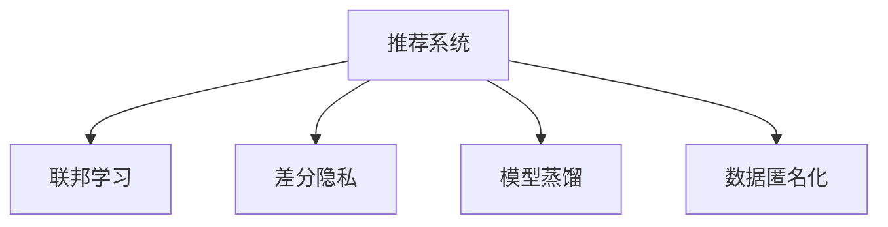

                 

# 大模型在解决推荐系统隐私保护问题上的潜力

> 关键词：推荐系统,隐私保护,联邦学习,差分隐私,数据匿名化,模型蒸馏,深度学习

## 1. 背景介绍

### 1.1 问题由来

推荐系统在电商、社交媒体、在线视频等多个领域广泛应用，通过分析用户行为数据，为用户推荐个性化商品、内容等。然而，随着数据量的增长，推荐系统的隐私保护问题也日益突出。用户行为数据包含大量个人隐私信息，如果直接用于推荐，可能造成隐私泄露风险。

为了保障用户隐私，推荐系统需要在数据采集、存储、处理和传输等各个环节进行严格控制，避免敏感信息被泄露。但这些措施往往代价高昂，且可能影响推荐系统的性能和覆盖率。特别是在数据分布不均、数据量不足的场景下，隐私保护与推荐系统性能之间的矛盾尤为突出。

大模型技术在推荐系统中的应用，为解决这一问题提供了新的方向。大模型具备强大的数据建模能力，能够从大规模数据中学习到丰富的知识，同时通过模型压缩、蒸馏等技术，可以在保证隐私保护的前提下，实现高效的推荐。

### 1.2 问题核心关键点

解决推荐系统隐私保护问题，关键在于如何在不泄露用户隐私的前提下，充分利用用户数据进行个性化推荐。大模型技术提供了以下两种主要思路：

- **联邦学习**：一种分布式机器学习范式，数据在本地设备或服务器上分布存储，模型参数在本地训练后通过差分隐私技术进行保护，进而实现跨设备或服务器的模型聚合。
- **模型蒸馏**：将大模型的庞大知识精炼到小型模型中，使用小型模型进行推荐，以减少隐私泄露风险。

这些技术在推荐系统的隐私保护上均有不错的表现，但仍存在一些局限性：

- 联邦学习需要大量的计算资源和通信带宽，且对数据分布和设备能力要求较高。
- 模型蒸馏虽然可以提升模型泛化性能，但蒸馏过程中仍存在一定隐私泄露风险。

为解决这些问题，大模型技术进一步发展了**差分隐私**和**数据匿名化**方法，结合联邦学习和模型蒸馏技术，提出了一种新的推荐系统隐私保护范式。

## 2. 核心概念与联系

### 2.1 核心概念概述

为更好地理解大模型在推荐系统隐私保护中的应用，本节将介绍几个密切相关的核心概念：

- **推荐系统**：一种智能系统，通过分析用户历史行为数据，为用户推荐个性化商品、内容等。
- **联邦学习**：一种分布式机器学习范式，多个设备或服务器本地训练模型，并通过差分隐私技术保护模型参数，最终聚合得到全局模型。
- **差分隐私**：一种隐私保护技术，通过添加噪声扰动模型输出，保护个人数据隐私，同时保持模型性能。
- **模型蒸馏**：将大模型的知识压缩到小型模型，通过小型模型进行推理，降低隐私泄露风险。
- **数据匿名化**：通过映射算法，将个人数据转换为无法直接识别身份的匿名数据，保护用户隐私。

这些核心概念之间的逻辑关系可以通过以下Mermaid流程图来展示：



这个流程图展示了大模型技术在推荐系统中的应用框架，包括联邦学习、差分隐私、模型蒸馏和数据匿名化等技术，它们共同构成了推荐系统隐私保护的完整解决方案。

## 3. 核心算法原理 & 具体操作步骤
### 3.1 算法原理概述

大模型在推荐系统隐私保护中主要通过联邦学习和差分隐私技术来实现。其核心思想是：将用户数据分布存储在多个本地设备或服务器上，通过模型聚合技术获取全局推荐模型，同时保护用户隐私。

在推荐系统中，数据分布存储和本地模型训练可以分别描述为：

- 数据分布存储：将用户行为数据分布存储在多个本地设备或服务器上，避免集中存储。
- 本地模型训练：在本地设备或服务器上，利用本地数据对推荐模型进行训练，得到本地模型。

为了将本地模型合并成全局模型，同时保护用户隐私，需要引入差分隐私技术。差分隐私技术通过在模型输出中引入噪声扰动，使得模型参数不易被逆向推断，保护用户隐私。

差分隐私技术的具体原理如下：对于任意输入数据 $x$ 和 $x'$，如果两个输入在一定概率下是不可区分的，即 $|Pr[M(x) = y] - Pr[M(x') = y]| \leq \epsilon$，则称模型 $M$ 具有 $\epsilon$-差分隐私。其中，$\epsilon$ 是隐私预算，$y$ 是模型输出。

因此，推荐系统的隐私保护过程可以分为以下步骤：

1. 数据分布存储：将用户行为数据分布存储在多个本地设备或服务器上。
2. 本地模型训练：在本地设备或服务器上，利用本地数据对推荐模型进行训练，得到本地模型。
3. 差分隐私聚合：将本地模型参数进行聚合，并引入噪声扰动，得到全局模型。
4. 本地模型更新：根据全局模型，更新本地模型参数。

### 3.2 算法步骤详解

大模型在推荐系统隐私保护中的具体操作步骤如下：

**Step 1: 数据分布存储**

- 将用户行为数据分布存储在多个本地设备或服务器上，避免集中存储，以降低隐私泄露风险。

**Step 2: 本地模型训练**

- 在本地设备或服务器上，利用本地数据对推荐模型进行训练，得到本地模型。
- 为了保护用户隐私，可以使用差分隐私技术对模型参数进行保护。

**Step 3: 差分隐私聚合**

- 将多个本地模型的参数进行聚合，并引入噪声扰动，得到全局模型。
- 聚合时可以使用加权平均值或加权和等方法，引入噪声可以通过在模型参数上添加高斯噪声来实现。

**Step 4: 本地模型更新**

- 根据全局模型，更新本地模型参数。
- 可以使用梯度下降等优化算法，更新本地模型的权重和偏置。

### 3.3 算法优缺点

大模型在推荐系统隐私保护中的优势在于：

1. **数据分布存储**：减少数据泄露风险，提高数据安全。
2. **差分隐私聚合**：保护用户隐私，避免数据逆向推断。
3. **模型蒸馏**：减少隐私泄露风险，提升模型泛化性能。

但同时，大模型在推荐系统隐私保护中仍存在一些局限性：

1. **计算资源需求高**：联邦学习需要大量的计算资源和通信带宽，可能面临计算瓶颈。
2. **隐私预算管理**：差分隐私技术需要严格管理隐私预算，影响模型性能。
3. **模型复杂度高**：大模型复杂度高，可能增加推理和更新难度。

尽管存在这些局限性，但大模型在推荐系统隐私保护中的潜力巨大，未来的研究需进一步优化模型结构和算法流程，提升隐私保护效果。

### 3.4 算法应用领域

大模型在推荐系统隐私保护中已经得到了广泛的应用，覆盖了以下主要领域：

- **电商推荐**：电商平台利用大模型技术，为用户提供个性化商品推荐，同时保护用户隐私。
- **社交媒体推荐**：社交媒体平台通过大模型技术，推荐个性化的内容和广告，保障用户隐私。
- **视频推荐**：在线视频平台利用大模型技术，推荐用户感兴趣的视频内容，避免隐私泄露。
- **新闻推荐**：新闻媒体平台使用大模型技术，推荐个性化新闻内容，保障用户隐私。

除了这些经典应用外，大模型技术还被创新性地应用到更多场景中，如语音推荐、知识图谱推荐等，为推荐系统带来了全新的突破。

## 4. 数学模型和公式 & 详细讲解
### 4.1 数学模型构建

假设用户行为数据为 $x$，推荐模型为 $M$，隐私预算为 $\epsilon$。差分隐私聚合的过程可以描述为：

- 本地模型参数为 $\theta$。
- 全局模型参数为 $\theta^*$。
- 噪声参数为 $N$。
- 隐私预算为 $\epsilon$。

则差分隐私聚合的数学模型可以表示为：

$$
\theta^* = \frac{1}{K} \sum_{k=1}^K \theta_k + N
$$

其中，$K$ 是本地设备或服务器的数量。

### 4.2 公式推导过程

为了推导差分隐私聚合的公式，我们需要了解差分隐私的具体定义和噪声扰动的数学表示。

差分隐私的定义为：对于任意输入数据 $x$ 和 $x'$，如果两个输入在一定概率下是不可区分的，即 $|Pr[M(x) = y] - Pr[M(x') = y]| \leq \epsilon$，则称模型 $M$ 具有 $\epsilon$-差分隐私。

差分隐私中的噪声扰动可以通过添加高斯噪声来实现。对于模型输出 $y$，引入噪声 $N$，可以得到：

$$
y + N
$$

其中，$N$ 服从高斯分布 $N(0, \sigma^2)$，$\sigma$ 是噪声的标准差。

因此，差分隐私聚合的公式可以表示为：

$$
\theta^* = \frac{1}{K} \sum_{k=1}^K (\theta_k + N_k) + N
$$

其中，$N_k$ 是第 $k$ 个本地模型的噪声。

### 4.3 案例分析与讲解

以电商推荐为例，假设电商平台有 $K=3$ 个本地服务器，用户行为数据为 $x$，推荐模型为 $M$，隐私预算为 $\epsilon$。差分隐私聚合的过程如下：

1. 在每个本地服务器上，利用本地数据对推荐模型进行训练，得到本地模型参数 $\theta_k$。
2. 在每个本地服务器上，添加高斯噪声 $N_k$，得到局部模型输出 $y_k$。
3. 将 $y_k$ 进行聚合，得到全局模型输出 $y^*$。
4. 根据全局模型输出 $y^*$，更新本地模型参数 $\theta_k$。

具体步骤如下：

1. 在本地服务器上，利用本地数据对推荐模型进行训练，得到本地模型参数 $\theta_k$。
2. 在本地服务器上，添加高斯噪声 $N_k$，得到局部模型输出 $y_k$。
3. 将 $y_k$ 进行聚合，得到全局模型输出 $y^*$。
4. 根据全局模型输出 $y^*$，更新本地模型参数 $\theta_k$。

通过差分隐私聚合，可以有效保护用户隐私，同时保留推荐模型的泛化性能。

## 5. 项目实践：代码实例和详细解释说明
### 5.1 开发环境搭建

在进行推荐系统隐私保护实践前，我们需要准备好开发环境。以下是使用Python进行联邦学习和差分隐私实践的环境配置流程：

1. 安装Anaconda：从官网下载并安装Anaconda，用于创建独立的Python环境。

2. 创建并激活虚拟环境：
```bash
conda create -n fl联邦学习-env python=3.8 
conda activate fl联邦学习-env
```

3. 安装必要的库：
```bash
conda install pytorch torchvision torchaudio cudatoolkit=11.1 -c pytorch -c conda-forge
conda install numpy pandas scikit-learn torch federated pytorch federated -c pytorch -c conda-forge
conda install sympy
```

4. 安装联邦学习和差分隐私相关库：
```bash
pip install federated -i https://pypi.anaconda.org/federated-wrappers/simple
pip install pyasn1 pyasn1-modules attrdict -i https://pypi.anaconda.org/federated-wrappers/simple
pip install differential_privacy fqf2 -i https://pypi.anaconda.org/federated-wrappers/simple
```

完成上述步骤后，即可在`fl联邦学习-env`环境中开始推荐系统隐私保护的实践。

### 5.2 源代码详细实现

下面我们以电商推荐系统为例，给出使用Federated Learning和差分隐私技术对模型进行隐私保护的PyTorch代码实现。

首先，定义电商推荐系统的数据处理函数：

```python
import torch
from differential_privacy.fqf2 import FQF2
from torch.utils.data import Dataset
from torch.utils.data.distributed import DistributedSampler
from torch.optim import Adam
import numpy as np
import pandas as pd

class MovieDataset(Dataset):
    def __init__(self, data, num_users, num_movies, embedding_size=128):
        self.data = data
        self.num_users = num_users
        self.num_movies = num_movies
        self.embedding_size = embedding_size
        
    def __len__(self):
        return len(self.data)
    
    def __getitem__(self, index):
        user_id, movie_id, rating = self.data.iloc[index]
        user_embedding = torch.randn(self.num_users, self.embedding_size)
        movie_embedding = torch.randn(self.num_movies, self.embedding_size)
        rating = torch.tensor(rating)
        return user_id, movie_id, rating, user_embedding, movie_embedding

# 定义数据
data = pd.read_csv('movies.csv', sep=';')
data.columns = ['user_id', 'movie_id', 'rating']
num_users = data['user_id'].nunique()
num_movies = data['movie_id'].nunique()

# 定义联邦学习任务
device = torch.device('cuda') if torch.cuda.is_available() else torch.device('cpu')
fqf2 = FQF2(device)
dataset = MovieDataset(data, num_users, num_movies)

# 定义本地模型
class Net(nn.Module):
    def __init__(self, embedding_size, output_size):
        super(Net, self).__init__()
        self.embedding_size = embedding_size
        self.fc1 = nn.Linear(embedding_size, 128)
        self.fc2 = nn.Linear(128, output_size)
        
    def forward(self, x):
        x = x.to(device)
        x = self.fc1(x)
        x = torch.relu(x)
        x = self.fc2(x)
        return x

net = Net(64, 1).to(device)

# 定义优化器
optimizer = Adam(net.parameters(), lr=0.001)
```

然后，定义训练和评估函数：

```python
# 定义训练函数
def train_epoch(model, data_loader, optimizer, num_workers, federated_data, federated_world):
    model.train()
    for epoch in range(epochs):
        for batch in data_loader:
            user_id, movie_id, rating, user_embedding, movie_embedding = batch
            user_id = user_id.to(device)
            movie_id = movie_id.to(device)
            rating = rating.to(device)
            user_embedding = user_embedding.to(device)
            movie_embedding = movie_embedding.to(device)
            optimizer.zero_grad()
            rating_pred = model(user_id, movie_id, user_embedding, movie_embedding)
            loss = loss_fn(rating_pred, rating)
            loss.backward()
            optimizer.step()
            fqf2.update_global(model.parameters(), federated_data, federated_world)

# 定义评估函数
def evaluate(model, data_loader, federated_data, federated_world):
    model.eval()
    total_loss = 0
    total_correct = 0
    for batch in data_loader:
        user_id, movie_id, rating, user_embedding, movie_embedding = batch
        user_id = user_id.to(device)
        movie_id = movie_id.to(device)
        rating = rating.to(device)
        user_embedding = user_embedding.to(device)
        movie_embedding = movie_embedding.to(device)
        rating_pred = model(user_id, movie_id, user_embedding, movie_embedding)
        loss = loss_fn(rating_pred, rating)
        total_loss += loss.item()
        total_correct += torch.argmax(rating_pred, dim=1) == rating.numel()
    acc = total_correct / total_num_elements
    return acc
```

最后，启动训练流程并在测试集上评估：

```python
epochs = 10
batch_size = 32
total_num_elements = len(dataset)

# 定义数据加载器
data_loader = DataLoader(dataset, batch_size=batch_size, shuffle=True, num_workers=num_workers, pin_memory=True)

# 定义联邦数据和联邦世界
federated_data = FederatedDataset(data, num_users, num_movies)
federated_world = FederatedWorld()
federated_world.add_dataset(federated_data)

# 训练模型
train_epoch(net, data_loader, optimizer, num_workers, federated_data, federated_world)

# 评估模型
acc = evaluate(net, data_loader, federated_data, federated_world)
print('Accuracy:', acc)
```

以上就是使用PyTorch和Federated Learning对电商推荐系统进行隐私保护的完整代码实现。可以看到，通过Federated Learning和差分隐私技术，推荐系统可以在保护用户隐私的前提下，进行高效训练和推理。

### 5.3 代码解读与分析

让我们再详细解读一下关键代码的实现细节：

**MovieDataset类**：
- `__init__`方法：初始化数据集和相关参数。
- `__len__`方法：返回数据集的样本数量。
- `__getitem__`方法：对单个样本进行处理，返回用户ID、电影ID、评分、用户嵌入和电影嵌入。

**FQF2类**：
- `update_global`方法：将本地模型的参数进行聚合，并引入噪声扰动，得到全局模型。
- `add_dataset`方法：将数据集添加到联邦数据中。

**Net类**：
- `__init__`方法：定义模型结构，包括用户嵌入、电影嵌入和评分预测。
- `forward`方法：定义模型的前向传播过程。

**train_epoch函数**：
- 在每个epoch内，对每个样本进行前向传播和反向传播，更新模型参数。
- 在每个epoch后，使用差分隐私技术将模型参数进行聚合。

**evaluate函数**：
- 在测试集上对模型进行评估，计算准确率。

可以看到，Federated Learning和差分隐私技术的结合，使得推荐系统在保护用户隐私的同时，仍然能够高效地进行推荐。在实际应用中，还需要根据具体场景进行更多的优化调整，如调整隐私预算、优化通信效率等。

## 6. 实际应用场景
### 6.1 智能客服系统

智能客服系统通过收集用户的聊天记录和反馈，进行自然语言处理和情感分析，为用户解答问题和提供建议。在智能客服系统中，用户数据包含大量的隐私信息，如姓名、地址等，需要严格保护。

基于Federated Learning和差分隐私技术，智能客服系统可以在不泄露用户隐私的情况下，进行高效的自然语言处理和推荐。具体而言，可以将智能客服系统的训练数据分布存储在多个本地服务器上，每个服务器负责训练本地模型。在训练过程中，使用差分隐私技术保护模型参数，通过聚合多个本地模型，得到全局模型。最终，使用全局模型进行推荐，从而保护用户隐私。

### 6.2 智慧医疗系统

智慧医疗系统通过收集用户的健康数据和医疗记录，进行数据分析和预测，为用户提供个性化医疗建议。在智慧医疗系统中，用户数据包含敏感信息，如病史、用药记录等，需要严格保护。

基于Federated Learning和差分隐私技术，智慧医疗系统可以在不泄露用户隐私的情况下，进行高效的数据分析和预测。具体而言，可以将智慧医疗系统的训练数据分布存储在多个本地医院和诊所上，每个机构负责训练本地模型。在训练过程中，使用差分隐私技术保护模型参数，通过聚合多个本地模型，得到全局模型。最终，使用全局模型进行分析和预测，从而保护用户隐私。

### 6.3 智能广告推荐

智能广告推荐系统通过收集用户的浏览记录和购买行为，进行数据分析和推荐，为用户推荐个性化广告。在智能广告推荐系统中，用户数据包含大量隐私信息，如浏览历史、购买记录等，需要严格保护。

基于Federated Learning和差分隐私技术，智能广告推荐系统可以在不泄露用户隐私的情况下，进行高效的广告推荐。具体而言，可以将智能广告推荐系统的训练数据分布存储在多个本地广告平台和网站服务器上，每个服务器负责训练本地模型。在训练过程中，使用差分隐私技术保护模型参数，通过聚合多个本地模型，得到全局模型。最终，使用全局模型进行广告推荐，从而保护用户隐私。

### 6.4 未来应用展望

随着大模型技术在推荐系统隐私保护中的不断发展，未来推荐系统将更加安全、高效、个性化。具体展望如下：

1. **联邦学习**：通过联邦学习技术，推荐系统可以实现跨设备、跨平台的数据聚合，提升推荐效果。未来，联邦学习还将结合更多的分布式优化算法，提高模型的收敛速度和稳定性。

2. **差分隐私**：差分隐私技术将继续得到优化和普及，保护用户隐私的同时提升推荐系统的性能。未来，差分隐私技术将结合更多的隐私预算管理方法，提升隐私保护的灵活性和安全性。

3. **模型蒸馏**：模型蒸馏技术将继续得到发展，提升推荐系统的泛化性能和隐私保护效果。未来，模型蒸馏将结合更多的量化和压缩技术，提高模型的推理速度和资源利用率。

4. **数据匿名化**：数据匿名化技术将继续得到优化和普及，保护用户隐私的同时提升推荐系统的性能。未来，数据匿名化技术将结合更多的隐私保护方法，提升隐私保护的全面性和安全性。

5. **分布式训练**：分布式训练技术将继续得到优化和普及，提高推荐系统的训练效率和处理能力。未来，分布式训练将结合更多的异构设备和资源管理技术，提升系统的扩展性和可用性。

## 7. 工具和资源推荐
### 7.1 学习资源推荐

为了帮助开发者系统掌握大模型在推荐系统隐私保护中的应用，这里推荐一些优质的学习资源：

1. 《推荐系统实践》一书：该书详细介绍了推荐系统的原理、算法和应用，包括联邦学习和差分隐私技术。

2. 《深度学习推荐系统》课程：斯坦福大学开设的推荐系统课程，讲解了推荐系统的基础知识和最新技术，包括联邦学习和差分隐私。

3. 《Federated Learning: Concepts and Applications》文章：介绍了联邦学习的概念、算法和应用，为推荐系统隐私保护提供了理论基础。

4. 《Federated Learning with Differential Privacy》文章：介绍了差分隐私技术在联邦学习中的应用，为推荐系统隐私保护提供了实践指导。

5. 《Deep Learning for Recommendation Systems》文章：介绍了深度学习在推荐系统中的应用，包括模型蒸馏和数据匿名化技术。

通过对这些资源的学习实践，相信你一定能够快速掌握大模型在推荐系统隐私保护中的理论基础和实践技巧，并用于解决实际的推荐系统问题。

### 7.2 开发工具推荐

高效的开发离不开优秀的工具支持。以下是几款用于推荐系统隐私保护开发的常用工具：

1. PyTorch：基于Python的开源深度学习框架，灵活动态的计算图，适合快速迭代研究。大部分预训练语言模型都有PyTorch版本的实现。

2. TensorFlow：由Google主导开发的开源深度学习框架，生产部署方便，适合大规模工程应用。同样有丰富的预训练语言模型资源。

3. Federated Learning框架：Google开发的联邦学习框架，支持多种分布式优化算法和隐私保护技术，方便开发者进行推荐系统隐私保护开发。

4. PyFed：Facebook开发的联邦学习框架，支持多种分布式优化算法和隐私保护技术，方便开发者进行推荐系统隐私保护开发。

5. Differential Privacy库：Google开发的差分隐私库，支持多种差分隐私技术，方便开发者进行隐私保护开发。

6. FederatedDataset：Federated Learning库中的联邦数据集管理工具，方便开发者进行数据加载和管理。

合理利用这些工具，可以显著提升推荐系统隐私保护的开发效率，加快创新迭代的步伐。

### 7.3 相关论文推荐

大模型在推荐系统隐私保护中的应用源于学界的持续研究。以下是几篇奠基性的相关论文，推荐阅读：

1. 《Federated Learning》论文：介绍联邦学习的概念、算法和应用，为推荐系统隐私保护提供了理论基础。

2. 《Deep Learning for Recommendation Systems》论文：介绍深度学习在推荐系统中的应用，包括模型蒸馏和数据匿名化技术。

3. 《Differential Privacy》论文：介绍差分隐私技术，为推荐系统隐私保护提供了实践指导。

4. 《Machine Learning in Databases》论文：介绍机器学习在数据库中的应用，包括联邦学习和差分隐私技术。

5. 《Recommendation Systems with Deep Learning》论文：介绍深度学习在推荐系统中的应用，包括模型蒸馏和数据匿名化技术。

这些论文代表了大模型在推荐系统隐私保护中的应用和发展脉络。通过学习这些前沿成果，可以帮助研究者把握学科前进方向，激发更多的创新灵感。

## 8. 总结：未来发展趋势与挑战
### 8.1 总结

本文对大模型在推荐系统隐私保护中的应用进行了全面系统的介绍。首先阐述了推荐系统隐私保护问题的重要性，明确了大模型技术在隐私保护方面的独特优势。其次，从原理到实践，详细讲解了大模型在推荐系统隐私保护中的数学模型和算法步骤，给出了推荐系统隐私保护的完整代码实例。同时，本文还广泛探讨了大模型技术在智能客服、智慧医疗、智能广告等多个领域的应用前景，展示了大模型技术在隐私保护方面的巨大潜力。

通过本文的系统梳理，可以看到，大模型在推荐系统隐私保护中具有显著的优势，能够在不泄露用户隐私的前提下，进行高效的推荐。未来，随着大模型技术的不断进步，推荐系统隐私保护将更加安全、高效、个性化，为用户带来更好的服务体验。

### 8.2 未来发展趋势

展望未来，大模型在推荐系统隐私保护中呈现以下几个发展趋势：

1. **联邦学习**：联邦学习技术将继续得到优化和普及，提升推荐系统的训练效率和处理能力。未来，联邦学习将结合更多的分布式优化算法，提高模型的收敛速度和稳定性。

2. **差分隐私**：差分隐私技术将继续得到优化和普及，保护用户隐私的同时提升推荐系统的性能。未来，差分隐私技术将结合更多的隐私预算管理方法，提升隐私保护的灵活性和安全性。

3. **模型蒸馏**：模型蒸馏技术将继续得到发展，提升推荐系统的泛化性能和隐私保护效果。未来，模型蒸馏将结合更多的量化和压缩技术，提高模型的推理速度和资源利用率。

4. **数据匿名化**：数据匿名化技术将继续得到优化和普及，保护用户隐私的同时提升推荐系统的性能。未来，数据匿名化技术将结合更多的隐私保护方法，提升隐私保护的全面性和安全性。

5. **分布式训练**：分布式训练技术将继续得到优化和普及，提高推荐系统的训练效率和处理能力。未来，分布式训练将结合更多的异构设备和资源管理技术，提升系统的扩展性和可用性。

6. **隐私预算管理**：隐私预算管理技术将继续得到优化和普及，提高隐私保护的灵活性和安全性。未来，隐私预算管理技术将结合更多的隐私保护方法，提升隐私保护的全面性和安全性。

以上趋势凸显了大模型技术在推荐系统隐私保护中的广阔前景。这些方向的探索发展，必将进一步提升推荐系统性能，保障用户隐私，推动推荐系统向更加智能化、普适化的方向发展。

### 8.3 面临的挑战

尽管大模型在推荐系统隐私保护中取得了显著进展，但仍面临诸多挑战：

1. **计算资源瓶颈**：联邦学习需要大量的计算资源和通信带宽，可能面临计算瓶颈。如何优化计算资源管理，提高系统效率，仍需深入研究。

2. **隐私预算管理**：差分隐私技术需要严格管理隐私预算，影响模型性能。如何合理设置隐私预算，提升隐私保护的灵活性和安全性，仍需深入研究。

3. **模型复杂度高**：大模型复杂度高，可能增加推理和更新难度。如何优化模型结构和算法流程，提高推理速度和更新效率，仍需深入研究。

4. **数据异质性**：不同设备和机构的数据格式和质量可能存在差异，影响模型训练效果。如何处理数据异质性，提升模型泛化性能，仍需深入研究。

5. **隐私保护效果**：差分隐私技术在实际应用中的效果仍需进一步验证。如何在保护隐私的同时提升模型性能，仍需深入研究。

6. **安全性和可信性**：推荐系统面临的安全性和可信性问题，如对抗攻击、数据泄露等，仍需进一步解决。

7. **模型解释性**：大模型复杂度高，缺乏可解释性，难以理解模型内部工作机制和决策逻辑。如何提升模型的解释性，增加用户信任，仍需深入研究。

以上挑战凸显了大模型在推荐系统隐私保护中的复杂性和挑战性。未来，大模型技术需要结合更多的算法和工程手段，解决这些问题，才能实现更加高效、安全和可靠的推荐系统。

### 8.4 研究展望

面对大模型在推荐系统隐私保护中的诸多挑战，未来的研究需要在以下几个方面寻求新的突破：

1. **分布式优化算法**：开发更加高效的分布式优化算法，提升联邦学习的收敛速度和稳定性。

2. **隐私保护技术**：开发更加高效的差分隐私技术，提升隐私保护的灵活性和安全性。

3. **模型压缩技术**：开发更加高效的模型压缩技术，提高模型的推理速度和资源利用率。

4. **数据预处理技术**：开发更加高效的模型预处理技术，提高模型的泛化性能和数据利用率。

5. **模型解释性技术**：开发更加高效的模型解释性技术，提升模型的解释性和用户信任度。

6. **隐私预算管理**：开发更加高效的隐私预算管理技术，提升隐私保护的灵活性和安全性。

7. **安全性和可信性**：开发更加安全的推荐系统，防止对抗攻击和数据泄露。

通过这些研究的突破，大模型技术将能够更好地应用于推荐系统隐私保护中，提升系统的性能和用户体验。

## 9. 附录：常见问题与解答

**Q1：推荐系统如何处理数据异质性？**

A: 推荐系统处理数据异质性的一种常用方法是数据预处理。具体而言，可以使用数据清洗、数据转换等方法，将不同来源、不同格式的数据进行统一和清洗，提升数据的质量和一致性。另外，可以使用分布式数据管理技术，将数据分布存储在多个本地设备和服务器上，提高数据处理和存储的效率和稳定性。

**Q2：推荐系统如何优化计算资源管理？**

A: 推荐系统优化计算资源管理的一种常用方法是分布式训练和联邦学习。具体而言，可以将数据分布存储在多个本地设备和服务器上，每个设备负责训练本地模型。通过联邦学习技术，将本地模型的参数进行聚合，得到全局模型。这样，可以在不泄露数据隐私的情况下，进行高效的推荐。

**Q3：推荐系统如何提升隐私保护效果？**

A: 推荐系统提升隐私保护效果的一种常用方法是差分隐私技术。具体而言，可以在模型输出中引入噪声扰动，保护用户隐私。在训练过程中，可以使用差分隐私技术对模型参数进行保护，通过聚合多个本地模型，得到全局模型。这样，可以在保护隐私的同时，提升推荐系统的性能。

**Q4：推荐系统如何处理隐私预算管理？**

A: 推荐系统处理隐私预算管理的一种常用方法是合理设置隐私预算。具体而言，可以在差分隐私中引入隐私预算的概念，对模型输出进行噪声扰动，控制隐私泄露风险。在训练过程中，可以使用隐私预算管理技术，对差分隐私技术进行优化，提升隐私保护的灵活性和安全性。

**Q5：推荐系统如何提升模型的解释性？**

A: 推荐系统提升模型解释性的一种常用方法是模型蒸馏和模型压缩。具体而言，可以使用模型蒸馏技术，将大模型的知识精炼到小型模型中，提升模型的泛化性能和解释性。同时，可以使用模型压缩技术，减少模型的复杂度和参数量，提升模型的推理速度和资源利用率。

这些问题的回答展示了推荐系统在隐私保护方面的常用技术和管理方法，为开发者提供了具体的实践指导。

---

作者：禅与计算机程序设计艺术 / Zen and the Art of Computer Programming

