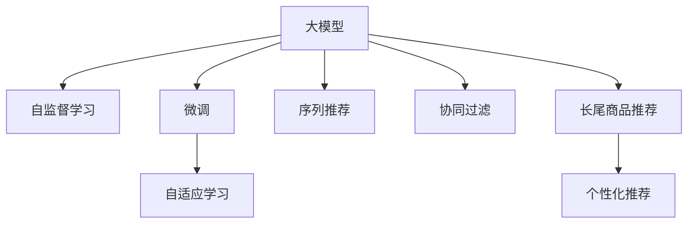

                 

# 大模型在长尾商品推荐中的优势

## 1. 背景介绍

随着电商市场的竞争日趋激烈，越来越多的电商平台开始利用推荐系统来提升用户体验和销售转化率。传统的推荐算法如协同过滤、基于内容的推荐等已经相对成熟，但在处理长尾商品推荐时，由于长尾商品数量多、需求量少，用户分布不均衡，这些算法往往难以满足推荐系统的需求。

为了应对这一挑战，近年来研究人员提出并实践了基于深度学习的大模型推荐系统。大模型通过预训练自监督任务学习到了通用的表示能力，再通过微调来学习特定任务的表示，使得其在处理长尾商品推荐时能够更高效地利用数据，从而提升推荐系统的性能。

## 2. 核心概念与联系

### 2.1 核心概念概述

为更好地理解大模型在长尾商品推荐中的应用，本节将介绍几个密切相关的核心概念：

- 大模型(Large Model)：以自回归或自编码模型为代表的大规模预训练模型。通过在大规模无标签文本或图片数据上进行预训练，学习到通用的表示能力。
- 长尾商品推荐(Long-Tail Item Recommendation)：指针对用户对长尾商品（即销量较低但需求稳定的商品）的推荐需求，通过个性化推荐提升用户体验和销售转化的过程。
- 自监督学习(Self-Supervised Learning)：利用数据本身的特点，如掩码语言模型、图像自编码等，学习模型的表示能力。
- 微调(Fine-Tuning)：在预训练模型的基础上，使用下游任务的少量标注数据，通过有监督学习优化模型在特定任务上的性能。
- 自适应学习(Adaptive Learning)：根据任务复杂度和数据分布，动态调整模型结构和超参数，以提高学习效率和性能。
- 序列推荐(Sequential Recommendation)：考虑用户行为序列，如浏览、点击、购买等，进行跨时间的推荐。
- 协同过滤(Collaborative Filtering)：利用用户-物品之间的协同关系，推荐用户感兴趣的商品。

这些概念之间的逻辑关系可以通过以下Mermaid流程图来展示：



这个流程图展示了大模型的核心概念及其之间的关系：

1. 大模型通过自监督学习获得通用表示能力。
2. 利用微调学习特定任务的表示，如长尾商品推荐。
3. 引入自适应学习，根据任务复杂度和数据分布动态调整模型。
4. 考虑序列推荐，提升推荐的时效性和关联性。
5. 结合协同过滤，利用用户-物品关系进行推荐。

这些概念共同构成了大模型推荐系统的基本框架，使其能够在长尾商品推荐等场景中发挥优势。

## 3. 核心算法原理 & 具体操作步骤

### 3.1 算法原理概述

基于大模型的长尾商品推荐方法，本质上是一种有监督学习范式。其核心思想是：将预训练的大模型视作一个强大的特征提取器，通过微调学习用户对长尾商品的兴趣表示，从而进行个性化推荐。

形式化地，假设预训练模型为 $M_{\theta}$，其中 $\theta$ 为预训练得到的模型参数。给定长尾商品推荐任务 $T$ 的训练集 $D=\{(x_i, y_i)\}_{i=1}^N$，其中 $x_i$ 为历史用户行为序列，$y_i$ 为长尾商品的推荐标签。微调的目标是找到新的模型参数 $\hat{\theta}$，使得模型在推荐任务上的表现最优：

$$
\hat{\theta}=\mathop{\arg\min}_{\theta} \mathcal{L}(M_{\theta},D)
$$

其中 $\mathcal{L}$ 为针对推荐任务设计的损失函数，用于衡量模型预测与真实标签之间的差异。

### 3.2 算法步骤详解

基于大模型的长尾商品推荐一般包括以下几个关键步骤：

**Step 1: 准备预训练模型和数据集**
- 选择合适的预训练模型 $M_{\theta}$，如BERT、GPT等，作为初始化参数。
- 准备长尾商品推荐任务 $T$ 的训练集 $D$，划分为训练集、验证集和测试集。训练集应包含用户的浏览、点击、购买行为序列，以及相应的长尾商品标签。

**Step 2: 添加任务适配层**
- 根据推荐任务类型，在预训练模型顶层设计合适的输出层和损失函数。
- 对于分类推荐任务，通常在顶层添加线性分类器和交叉熵损失函数。
- 对于序列推荐任务，通常使用RNN、GRU或Transformer模型进行跨时间序列预测，并以序列交叉熵为损失函数。

**Step 3: 设置微调超参数**
- 选择合适的优化算法及其参数，如 AdamW、SGD 等，设置学习率、批大小、迭代轮数等。
- 设置正则化技术及强度，包括权重衰减、Dropout、Early Stopping 等。
- 确定冻结预训练参数的策略，如仅微调顶层，或全部参数都参与微调。

**Step 4: 执行梯度训练**
- 将训练集数据分批次输入模型，前向传播计算损失函数。
- 反向传播计算参数梯度，根据设定的优化算法和学习率更新模型参数。
- 周期性在验证集上评估模型性能，根据性能指标决定是否触发 Early Stopping。
- 重复上述步骤直到满足预设的迭代轮数或 Early Stopping 条件。

**Step 5: 测试和部署**
- 在测试集上评估微调后模型 $M_{\hat{\theta}}$ 的性能，对比微调前后的推荐效果。
- 使用微调后的模型对新样本进行推理预测，集成到实际的应用系统中。
- 持续收集新的数据，定期重新微调模型，以适应数据分布的变化。

以上是基于大模型微调的推荐系统的一般流程。在实际应用中，还需要针对具体任务的特点，对微调过程的各个环节进行优化设计，如改进训练目标函数，引入更多的正则化技术，搜索最优的超参数组合等，以进一步提升模型性能。

### 3.3 算法优缺点

基于大模型的长尾商品推荐方法具有以下优点：
1. 简单高效。只需准备少量标注数据，即可对预训练模型进行快速适配，获得较大的性能提升。
2. 通用适用。适用于各种长尾商品推荐任务，包括分类推荐、序列推荐等，设计简单的任务适配层即可实现。
3. 数据利用充分。大模型的预训练能力使得其在数据量较少的长尾商品推荐中也能表现出色。
4. 序列关联性强。能够考虑用户的行为序列，进行跨时间推荐，提升推荐的时效性和相关性。

同时，该方法也存在一定的局限性：
1. 标注成本较高。长尾商品推荐任务需要较多的标注数据，且标注成本较高。
2. 数据稀疏性强。长尾商品的销量较低，数据分布较稀疏，模型容易过拟合。
3. 泛化能力有限。模型对长尾商品的泛化能力相对较弱，可能会对未知商品表现不佳。
4. 资源需求大。大模型的参数量较大，对计算资源和存储空间的需求较高。

尽管存在这些局限性，但就目前而言，基于大模型微调的推荐方法仍是在长尾商品推荐领域的主要技术范式。未来相关研究的重点在于如何进一步降低标注数据的依赖，提高模型的泛化能力，同时兼顾数据稀疏性和资源需求等因素。

### 3.4 算法应用领域

基于大模型微调的推荐方法，已经在电商、音乐、视频等多个领域得到应用，覆盖了各种长尾推荐任务，例如：

- 电商平台：对用户浏览、点击、购买行为进行建模，推荐长尾商品。
- 音乐平台：根据用户的听歌历史，推荐新歌曲和音乐人。
- 视频网站：分析用户的观看历史，推荐长尾视频内容。
- 电影推荐：结合用户的评分和观看历史，推荐长尾电影和电视剧。

除了这些经典应用外，大模型微调推荐技术还在智能家居、智能交通、智慧医疗等诸多场景中得到创新性应用，为长尾商品推荐带来了新的发展方向。

## 4. 数学模型和公式 & 详细讲解 & 举例说明

### 4.1 数学模型构建

本节将使用数学语言对基于大模型的长尾商品推荐过程进行更加严格的刻画。

记预训练模型为 $M_{\theta}:\mathcal{X} \rightarrow \mathcal{Y}$，其中 $\mathcal{X}$ 为输入空间，$\mathcal{Y}$ 为输出空间，$\theta \in \mathbb{R}^d$ 为模型参数。假设推荐任务的训练集为 $D=\{(x_i,y_i)\}_{i=1}^N$，其中 $x_i \in \mathcal{X}$ 为历史用户行为序列，$y_i \in \{0,1\}$ 为长尾商品的推荐标签。

定义模型 $M_{\theta}$ 在输入 $x$ 上的输出为 $\hat{y}=M_{\theta}(x) \in [0,1]$，表示用户对商品 $y$ 的兴趣评分。真实标签 $y \in \{0,1\}$。则推荐任务的损失函数定义为：

$$
\ell(M_{\theta}(x),y) = -[y\log \hat{y} + (1-y)\log(1-\hat{y})]
$$

将其代入经验风险公式，得：

$$
\mathcal{L}(\theta) = -\frac{1}{N}\sum_{i=1}^N [y_i\log M_{\theta}(x_i)+(1-y_i)\log(1-M_{\theta}(x_i))]
$$

在实践中，我们通常使用基于梯度的优化算法（如SGD、Adam等）来近似求解上述最优化问题。设 $\eta$ 为学习率，$\lambda$ 为正则化系数，则参数的更新公式为：

$$
\theta \leftarrow \theta - \eta \nabla_{\theta}\mathcal{L}(\theta) - \eta\lambda\theta
$$

其中 $\nabla_{\theta}\mathcal{L}(\theta)$ 为损失函数对参数 $\theta$ 的梯度，可通过反向传播算法高效计算。

### 4.2 公式推导过程

以下我们以二分类推荐任务为例，推导交叉熵损失函数及其梯度的计算公式。

假设模型 $M_{\theta}$ 在输入 $x$ 上的输出为 $\hat{y}=M_{\theta}(x) \in [0,1]$，表示用户对商品 $y$ 的兴趣评分。真实标签 $y \in \{0,1\}$。则二分类交叉熵损失函数定义为：

$$
\ell(M_{\theta}(x),y) = -[y\log \hat{y} + (1-y)\log(1-\hat{y})]
$$

将其代入经验风险公式，得：

$$
\mathcal{L}(\theta) = -\frac{1}{N}\sum_{i=1}^N [y_i\log M_{\theta}(x_i)+(1-y_i)\log(1-M_{\theta}(x_i))]
$$

根据链式法则，损失函数对参数 $\theta_k$ 的梯度为：

$$
\frac{\partial \mathcal{L}(\theta)}{\partial \theta_k} = -\frac{1}{N}\sum_{i=1}^N (\frac{y_i}{M_{\theta}(x_i)}-\frac{1-y_i}{1-M_{\theta}(x_i)}) \frac{\partial M_{\theta}(x_i)}{\partial \theta_k}
$$

其中 $\frac{\partial M_{\theta}(x_i)}{\partial \theta_k}$ 可进一步递归展开，利用自动微分技术完成计算。

在得到损失函数的梯度后，即可带入参数更新公式，完成模型的迭代优化。重复上述过程直至收敛，最终得到适应长尾商品推荐任务的最优模型参数 $\theta^*$。

## 5. 项目实践：代码实例和详细解释说明

### 5.1 开发环境搭建

在进行长尾商品推荐实践前，我们需要准备好开发环境。以下是使用Python进行TensorFlow开发的环境配置流程：

1. 安装Anaconda：从官网下载并安装Anaconda，用于创建独立的Python环境。

2. 创建并激活虚拟环境：
```bash
conda create -n tf-env python=3.8 
conda activate tf-env
```

3. 安装TensorFlow：根据CUDA版本，从官网获取对应的安装命令。例如：
```bash
conda install tensorflow tensorflow-gpu=2.6.0 -c pytorch -c conda-forge
```

4. 安装各类工具包：
```bash
pip install numpy pandas scikit-learn matplotlib tqdm jupyter notebook ipython
```

完成上述步骤后，即可在`tf-env`环境中开始推荐系统开发。

### 5.2 源代码详细实现

下面我们以长尾商品推荐为例，给出使用TensorFlow对BERT模型进行微调的Python代码实现。

首先，定义推荐任务的数据处理函数：

```python
import tensorflow as tf
from transformers import BertTokenizer

class LongTailRecommendDataset(tf.data.Dataset):
    def __init__(self, texts, labels, tokenizer, max_len=128):
        self.texts = texts
        self.labels = labels
        self.tokenizer = tokenizer
        self.max_len = max_len
        
    def __len__(self):
        return len(self.texts)
    
    def __getitem__(self, item):
        text = self.texts[item]
        label = self.labels[item]
        
        encoding = self.tokenizer(text, return_tensors='tf', max_length=self.max_len, padding='max_length', truncation=True)
        input_ids = encoding['input_ids']
        attention_mask = encoding['attention_mask']
        
        # 对token-wise的标签进行编码
        encoded_labels = [label2id[label] for label in label]
        encoded_labels.extend([label2id['O']] * (self.max_len - len(encoded_labels)))
        labels = tf.constant(encoded_labels, dtype=tf.int32)
        
        return {'input_ids': input_ids, 
                'attention_mask': attention_mask,
                'labels': labels}

# 标签与id的映射
label2id = {'O': 0, '1': 1, '0': 2}
id2label = {v: k for k, v in label2id.items()}

# 创建dataset
tokenizer = BertTokenizer.from_pretrained('bert-base-cased')

train_dataset = LongTailRecommendDataset(train_texts, train_labels, tokenizer)
dev_dataset = LongTailRecommendDataset(dev_texts, dev_labels, tokenizer)
test_dataset = LongTailRecommendDataset(test_texts, test_labels, tokenizer)
```

然后，定义模型和优化器：

```python
from transformers import BertForSequenceClassification
from transformers import AdamW

model = BertForSequenceClassification.from_pretrained('bert-base-cased', num_labels=len(label2id))

optimizer = AdamW(model.parameters(), lr=2e-5)
```

接着，定义训练和评估函数：

```python
from tqdm import tqdm
from sklearn.metrics import accuracy_score

device = tf.device('cuda') if tf.cuda.is_available() else tf.device('cpu')
model.to(device)

def train_epoch(model, dataset, batch_size, optimizer):
    dataloader = tf.data.Dataset.from_generator(lambda: dataset, output_signature={
        'input_ids': tf.TensorSpec(shape=(None, max_len), dtype=tf.int32),
        'attention_mask': tf.TensorSpec(shape=(None, max_len), dtype=tf.int32),
        'labels': tf.TensorSpec(shape=(None,), dtype=tf.int32)
    })
    model.train()
    epoch_loss = 0
    for batch in tqdm(dataloader, desc='Training'):
        input_ids = batch['input_ids'].to(device)
        attention_mask = batch['attention_mask'].to(device)
        labels = batch['labels'].to(device)
        model.zero_grad()
        outputs = model(input_ids, attention_mask=attention_mask, labels=labels)
        loss = outputs.loss
        epoch_loss += loss.numpy().item()
        loss.backward()
        optimizer.apply_gradients(zip(model.trainable_variables, model.trainable_variables))
    return epoch_loss / len(dataloader)

def evaluate(model, dataset, batch_size):
    dataloader = tf.data.Dataset.from_generator(lambda: dataset, output_signature={
        'input_ids': tf.TensorSpec(shape=(None, max_len), dtype=tf.int32),
        'attention_mask': tf.TensorSpec(shape=(None, max_len), dtype=tf.int32),
        'labels': tf.TensorSpec(shape=(None,), dtype=tf.int32)
    })
    model.eval()
    predictions = []
    labels = []
    with tf.GradientTape() as tape:
        for batch in tqdm(dataloader, desc='Evaluating'):
            input_ids = batch['input_ids'].to(device)
            attention_mask = batch['attention_mask'].to(device)
            labels = batch['labels'].to(device)
            outputs = model(input_ids, attention_mask=attention_mask)
            logits = outputs.logits
            logits = logits.numpy()
            predictions.append(logits.argmax(axis=1))
            labels.append(labels.numpy())
    return accuracy_score(labels, predictions)
```

最后，启动训练流程并在测试集上评估：

```python
epochs = 5
batch_size = 16

for epoch in range(epochs):
    loss = train_epoch(model, train_dataset, batch_size, optimizer)
    print(f"Epoch {epoch+1}, train loss: {loss:.3f}")
    
    print(f"Epoch {epoch+1}, dev results:")
    accuracy = evaluate(model, dev_dataset, batch_size)
    print(f"Dev accuracy: {accuracy:.3f}")
    
print("Test results:")
accuracy = evaluate(model, test_dataset, batch_size)
print(f"Test accuracy: {accuracy:.3f}")
```

以上就是使用TensorFlow对BERT进行长尾商品推荐任务微调的完整代码实现。可以看到，得益于TensorFlow的强大封装，我们可以用相对简洁的代码完成BERT模型的加载和微调。

### 5.3 代码解读与分析

让我们再详细解读一下关键代码的实现细节：

**LongTailRecommendDataset类**：
- `__init__`方法：初始化文本、标签、分词器等关键组件。
- `__len__`方法：返回数据集的样本数量。
- `__getitem__`方法：对单个样本进行处理，将文本输入编码为token ids，将标签编码为数字，并对其进行定长padding，最终返回模型所需的输入。

**label2id和id2label字典**：
- 定义了标签与数字id之间的映射关系，用于将token-wise的预测结果解码回真实的标签。

**训练和评估函数**：
- 使用TensorFlow的DataLoader对数据集进行批次化加载，供模型训练和推理使用。
- 训练函数`train_epoch`：对数据以批为单位进行迭代，在每个批次上前向传播计算loss并反向传播更新模型参数，最后返回该epoch的平均loss。
- 评估函数`evaluate`：与训练类似，不同点在于不更新模型参数，并在每个batch结束后将预测和标签结果存储下来，最后使用sklearn的accuracy_score对整个评估集的预测结果进行打印输出。

**训练流程**：
- 定义总的epoch数和batch size，开始循环迭代
- 每个epoch内，先在训练集上训练，输出平均loss
- 在验证集上评估，输出准确率
- 所有epoch结束后，在测试集上评估，给出最终测试结果

可以看到，TensorFlow配合BERT库使得长尾商品推荐任务的微调代码实现变得简洁高效。开发者可以将更多精力放在数据处理、模型改进等高层逻辑上，而不必过多关注底层的实现细节。

当然，工业级的系统实现还需考虑更多因素，如模型的保存和部署、超参数的自动搜索、更灵活的任务适配层等。但核心的微调范式基本与此类似。

## 6. 实际应用场景

### 6.1 电商推荐

电商平台的推荐系统旨在提升用户体验和销售转化率，而长尾商品推荐是其中重要的一环。传统推荐算法往往难以处理长尾商品推荐，因此基于大模型的推荐系统应运而生。

具体而言，电商平台可以收集用户的历史浏览、点击、购买行为，以及相应的长尾商品标签。利用微调后的BERT模型，对用户行为序列进行编码，预测用户对长尾商品的兴趣评分。将评分较高的商品推荐给用户，能够有效提升用户体验和销售转化率。

### 6.2 音乐推荐

音乐平台需要根据用户的听歌历史，推荐新的音乐和音乐人。传统的协同过滤方法在数据稀疏的情况下表现较差，而大模型能够充分利用用户的听歌行为，学习到更全面的音乐推荐模型。

在实践中，音乐平台可以收集用户的听歌历史、评分、标签等数据，以及音乐的数据特征。通过微调BERT模型，能够学习到用户的音乐兴趣和音乐的特征表示。利用学习到的模型，能够更好地推荐用户感兴趣的音乐和音乐人。

### 6.3 视频推荐

视频网站需要根据用户的观看历史，推荐新的视频内容。与音乐推荐类似，视频推荐同样面临数据稀疏性的问题，因此大模型在视频推荐中也得到了广泛应用。

具体而言，视频网站可以收集用户的观看历史、点赞、收藏等行为，以及视频的数据特征。通过微调BERT模型，能够学习到用户的观看兴趣和视频的特征表示。利用学习到的模型，能够更好地推荐用户感兴趣的视频内容。

### 6.4 电影推荐

电影推荐系统需要根据用户的评分和观看历史，推荐新的电影和电视剧。大模型同样能够处理这一任务，提升推荐系统的准确性和用户体验。

在实践中，电影推荐系统可以收集用户的评分、观看历史、社交关系等数据，以及电影的数据特征。通过微调BERT模型，能够学习到用户的观影兴趣和电影的特征表示。利用学习到的模型，能够更好地推荐用户感兴趣的电影和电视剧。

## 7. 工具和资源推荐

### 7.1 学习资源推荐

为了帮助开发者系统掌握大模型在长尾商品推荐中的应用，这里推荐一些优质的学习资源：

1. 《深度学习与推荐系统》系列博文：深入浅出地介绍了深度学习在推荐系统中的应用，包括基于大模型的推荐方法。

2. 《推荐系统实战》书籍：由工业界资深专家所著，涵盖了推荐系统的主要算法和实践，包括长尾推荐算法。

3. 《推荐系统综述》论文：全面综述了推荐系统的发展历程和主要技术，包括长尾推荐技术。

4. Coursera《深度学习与推荐系统》课程：斯坦福大学开设的推荐系统课程，包含推荐系统的理论基础和实践技巧。

5. 《长尾商品推荐算法》书籍：全面介绍了长尾推荐算法的设计和应用，适合实践者参考。

通过对这些资源的学习实践，相信你一定能够快速掌握大模型在长尾商品推荐中的应用，并用于解决实际的推荐系统问题。

### 7.2 开发工具推荐

高效的开发离不开优秀的工具支持。以下是几款用于长尾商品推荐开发的常用工具：

1. TensorFlow：基于Python的开源深度学习框架，灵活动态的计算图，适合快速迭代研究。大部分预训练语言模型都有TensorFlow版本的实现。

2. PyTorch：基于Python的开源深度学习框架，灵活动态的计算图，适合快速迭代研究。部分预训练语言模型也有PyTorch版本的实现。

3. HuggingFace Transformers库：提供了丰富的预训练语言模型，支持TensorFlow和PyTorch，是进行推荐系统开发的利器。

4. Weights & Biases：模型训练的实验跟踪工具，可以记录和可视化模型训练过程中的各项指标，方便对比和调优。与主流深度学习框架无缝集成。

5. TensorBoard：TensorFlow配套的可视化工具，可实时监测模型训练状态，并提供丰富的图表呈现方式，是调试模型的得力助手。

6. Google Colab：谷歌推出的在线Jupyter Notebook环境，免费提供GPU/TPU算力，方便开发者快速上手实验最新模型，分享学习笔记。

合理利用这些工具，可以显著提升长尾商品推荐任务的开发效率，加快创新迭代的步伐。

### 7.3 相关论文推荐

长尾商品推荐技术的发展源于学界的持续研究。以下是几篇奠基性的相关论文，推荐阅读：

1. "A Deep Learning Approach to Recommender Systems"：综述了深度学习在推荐系统中的应用，包括长尾推荐技术。

2. "Large-Scale Machine Learning for Recommender Systems"：介绍了大规模推荐系统的构建方法和实践经验，包括长尾推荐技术。

3. "Adaptive Recommendation"：探讨了推荐系统中的自适应学习策略，包括长尾推荐技术。

4. "Personalized Recommendation using Deep Learning"：介绍了基于深度学习的推荐算法，包括长尾推荐技术。

5. "Long-Tail Item Recommendation using Deep Learning"：介绍了长尾推荐技术的具体算法，包括基于深度学习的模型设计。

这些论文代表了大模型在长尾推荐领域的发展脉络。通过学习这些前沿成果，可以帮助研究者把握学科前进方向，激发更多的创新灵感。

## 8. 总结：未来发展趋势与挑战

### 8.1 总结

本文对基于大模型的长尾商品推荐方法进行了全面系统的介绍。首先阐述了大模型在长尾推荐中的应用背景和优势，明确了长尾推荐在推荐系统中的重要地位。其次，从原理到实践，详细讲解了大模型的推荐过程和关键步骤，给出了长尾推荐任务的完整代码实例。同时，本文还广泛探讨了长尾推荐技术在电商、音乐、视频等多个领域的应用前景，展示了长尾推荐技术的巨大潜力。此外，本文精选了长尾推荐技术的各类学习资源，力求为开发者提供全方位的技术指引。

通过本文的系统梳理，可以看到，基于大模型的长尾推荐方法正在成为推荐系统的主要技术范式，极大地拓展了推荐系统的应用边界，催生了更多的落地场景。得益于大规模语料的预训练，大模型在长尾推荐中能够更高效地利用数据，从而提升推荐系统的性能。未来，伴随预训练语言模型和微调方法的不断演进，相信长尾推荐技术将进一步提升推荐系统的精准性和个性化水平，为用户带来更好的推荐体验。

### 8.2 未来发展趋势

展望未来，长尾商品推荐技术将呈现以下几个发展趋势：

1. 数据稀疏性缓解。长尾商品推荐由于数据稀疏性强，往往难以获得高质量的训练样本。未来，利用生成对抗网络(Generative Adversarial Networks, GANs)等技术，能够生成更多的合成数据，缓解数据稀疏性问题。

2. 个性化推荐提升。大模型能够学习到更全面的用户兴趣和商品特征，未来将进一步提升推荐系统的个性化水平。引入多模态数据融合，结合文本、图像、声音等多方面信息，提升推荐的综合性和多样性。

3. 推荐系统协同化。利用用户的社交关系、行为数据等信息，结合协同过滤和深度学习技术，提升推荐系统的协同性和多样性。

4. 动态推荐增强。基于时间序列的深度学习模型能够更好地处理动态变化的用户行为，未来将进一步增强动态推荐能力。结合时序数据和用户行为模型，提高推荐的时效性和关联性。

5. 多模态推荐普及。长尾推荐中涉及的商品往往是多模态的，结合文本、图像、视频等多种数据形式，能够更全面地理解商品和用户，提升推荐的精准性。

6. 模型可解释性增强。推荐系统作为与用户直接交互的系统，模型的可解释性尤为重要。未来将更多地引入因果分析、解释性AI等技术，提升推荐系统的透明度和可信度。

以上趋势凸显了大模型在长尾推荐中的未来发展方向。这些方向的探索发展，必将进一步提升推荐系统的性能和应用范围，为用户带来更好的推荐体验。

### 8.3 面临的挑战

尽管大模型在长尾商品推荐中已经取得了瞩目成就，但在迈向更加智能化、普适化应用的过程中，它仍面临着诸多挑战：

1. 标注成本较高。长尾商品推荐任务需要较多的标注数据，且标注成本较高。如何降低标注成本，利用用户行为数据进行半监督或无监督学习，是未来研究的重点。

2. 数据稀疏性强。长尾商品的销量较低，数据分布较稀疏，模型容易过拟合。如何处理数据稀疏性问题，增强模型的泛化能力，也是未来研究的重点。

3. 模型资源需求大。大模型的参数量较大，对计算资源和存储空间的需求较高。如何优化模型结构，减少资源消耗，是未来研究的重点。

4. 推荐系统冷启动问题。新用户和老用户的行为数据分布不同，冷启动用户难以获得有效的推荐。如何利用多模态数据和新用户行为，提升冷启动用户的推荐效果，也是未来研究的重点。

5. 推荐系统协同化不足。推荐系统通常只考虑用户的历史行为数据，缺乏对用户社交关系和实时行为的综合考虑。如何利用社交网络和实时数据，提升推荐系统的协同化水平，也是未来研究的重点。

6. 推荐系统偏见问题。长尾推荐中涉及的商品和用户类型多样，推荐系统的偏见问题难以忽视。如何避免推荐系统中的偏见，提高推荐系统的公平性和透明性，也是未来研究的重点。

这些挑战凸显了长尾商品推荐技术的复杂性和多变性，未来需要在多个方面进行深入研究，才能真正实现推荐系统的智能化、普适化目标。相信随着技术的发展和研究的深入，这些挑战终将逐步被克服，长尾商品推荐技术将迎来更加广阔的应用前景。

### 8.4 研究展望

面对长尾商品推荐所面临的种种挑战，未来的研究需要在以下几个方面寻求新的突破：

1. 探索半监督和无监督推荐方法。利用用户行为数据，结合半监督或无监督学习技术，降低标注数据的依赖，提升推荐系统的泛化能力。

2. 研究参数高效和计算高效的推荐方法。开发更加参数高效的推荐方法，在固定大部分预训练参数的同时，只更新极少量的任务相关参数。同时优化推荐模型的计算图，减少前向传播和反向传播的资源消耗，实现更加轻量级、实时性的部署。

3. 融合因果和对比学习范式。通过引入因果推断和对比学习思想，增强推荐模型建立稳定因果关系的能力，学习更加普适、鲁棒的商品表征，从而提升模型泛化性和抗干扰能力。

4. 引入更多先验知识。将符号化的先验知识，如知识图谱、逻辑规则等，与神经网络模型进行巧妙融合，引导推荐过程学习更准确、合理的商品表示。同时加强不同模态数据的整合，实现视觉、语音等多模态信息与文本信息的协同建模。

5. 结合因果分析和博弈论工具。将因果分析方法引入推荐模型，识别出推荐决策的关键特征，增强推荐系统的解释性和可控性。借助博弈论工具刻画人机交互过程，主动探索并规避推荐系统的脆弱点，提高系统稳定性。

6. 纳入伦理道德约束。在推荐系统目标中引入伦理导向的评估指标，过滤和惩罚有偏见、有害的输出倾向。同时加强人工干预和审核，建立推荐系统的监管机制，确保推荐结果符合人类价值观和伦理道德。

这些研究方向的探索，必将引领长尾推荐技术迈向更高的台阶，为构建智能、公正、可控的推荐系统提供新的动力。面向未来，长尾推荐技术还需要与其他人工智能技术进行更深入的融合，如知识表示、因果推理、强化学习等，多路径协同发力，共同推动推荐系统技术的进步。只有勇于创新、敢于突破，才能不断拓展长尾推荐技术的边界，让推荐系统更好地服务于用户。

## 9. 附录：常见问题与解答

**Q1：大模型在长尾推荐中为什么能够优于传统推荐算法？**

A: 大模型在长尾推荐中能够优于传统推荐算法，主要原因在于：

1. 大模型通过预训练学习到了通用的表示能力，能够更全面地理解长尾商品和用户特征。而传统推荐算法往往基于局部统计特征，难以捕捉复杂的特征关系。

2. 大模型可以通过微调学习特定任务的表现，提升推荐系统的精准性。传统推荐算法通常无法进行微调，难以应对长尾商品推荐等复杂任务。

3. 大模型在长尾商品推荐中，可以利用用户行为数据进行推理和预测，避免对标注数据的依赖。而传统推荐算法往往需要大量的标注数据，标注成本较高。

4. 大模型能够结合多模态数据，提升推荐的综合性和多样性。而传统推荐算法通常只考虑单模态数据，无法充分利用多模态信息。

综上所述，大模型在长尾推荐中能够更高效地利用数据，提升推荐系统的性能。

**Q2：长尾商品推荐中如何处理数据稀疏性问题？**

A: 数据稀疏性是长尾推荐中常见的问题，可以通过以下几种方法处理：

1. 利用生成对抗网络(GANs)生成合成数据。GANs能够生成与真实数据相似的高质量合成数据，缓解数据稀疏性问题。

2. 引入先验知识进行推荐。将领域知识、规则等先验知识与推荐模型结合，提升模型的泛化能力。

3. 利用协同过滤进行推荐。协同过滤能够利用用户-物品关系，缓解数据稀疏性问题，提升推荐效果。

4. 引入多模态数据融合。结合文本、图像、视频等多种数据形式，更全面地理解长尾商品和用户特征，提升推荐效果。

5. 使用半监督学习或无监督学习。利用用户行为数据进行半监督或无监督学习，缓解数据稀疏性问题。

通过这些方法，可以有效处理长尾推荐中的数据稀疏性问题，提升推荐系统的精准性和泛化能力。

**Q3：长尾推荐中如何避免推荐系统的偏见问题？**

A: 推荐系统的偏见问题难以忽视，可以通过以下几种方法避免：

1. 引入多模态数据。结合文本、图像、视频等多种数据形式，更全面地理解长尾商品和用户特征，避免推荐系统的偏见。

2. 利用先验知识进行推荐。将领域知识、规则等先验知识与推荐模型结合，提升推荐系统的公平性和透明性。

3. 引入因果分析方法。将因果分析方法引入推荐模型，识别出推荐决策的关键特征，增强推荐系统的解释性和可控性。

4. 利用博弈论工具。借助博弈论工具刻画人机交互过程，主动探索并规避推荐系统的脆弱点，提高系统稳定性。

5. 引入伦理道德约束。在推荐系统目标中引入伦理导向的评估指标，过滤和惩罚有偏见、有害的输出倾向。

通过这些方法，可以有效避免推荐系统中的偏见问题，提升推荐系统的公平性和透明性。

**Q4：长尾推荐中如何处理冷启动用户问题？**

A: 冷启动用户难以获得有效的推荐，可以通过以下几种方法处理：

1. 利用多模态数据。结合用户的社交网络、实时行为等数据，更全面地理解冷启动用户的兴趣和特征，提升推荐效果。

2. 引入协同过滤进行推荐。利用用户-物品关系，结合协同过滤算法进行推荐，提升推荐系统的协同化水平。

3. 利用半监督或无监督学习。利用用户行为数据进行半监督或无监督学习，缓解冷启动用户的问题。

4. 引入先验知识进行推荐。将领域知识、规则等先验知识与推荐模型结合，提升推荐系统的公平性和透明性。

5. 利用推荐算法组合。结合多种推荐算法，提升推荐系统的综合性和多样性，缓解冷启动用户的问题。

通过这些方法，可以有效处理长尾推荐中的冷启动问题，提升推荐系统的效果。

**Q5：长尾推荐中如何提升推荐系统的个性化水平？**

A: 推荐系统的个性化水平可以通过以下几种方法提升：

1. 利用用户行为数据进行推理和预测。结合用户的历史行为数据，利用深度学习模型进行推理和预测，提升推荐系统的个性化水平。

2. 引入多模态数据融合。结合文本、图像、视频等多种数据形式，更全面地理解长尾商品和用户特征，提升推荐效果。

3. 利用先验知识进行推荐。将领域知识、规则等先验知识与推荐模型结合，提升推荐系统的公平性和透明性。

4. 引入因果分析方法。将因果分析方法引入推荐模型，识别出推荐决策的关键特征，增强推荐系统的解释性和可控性。

5. 利用生成对抗网络(GANs)生成合成数据。GANs能够生成与真实数据相似的高质量合成数据，提升推荐系统的泛化能力。

通过这些方法，可以有效提升长尾推荐系统的个性化水平，提升推荐效果和用户体验。

**Q6：长尾推荐中如何处理推荐系统协同化不足的问题？**

A: 推荐系统协同化不足可以通过以下几种方法处理：

1. 利用用户社交网络进行推荐。结合用户的社交网络信息，利用协同过滤算法进行推荐，提升推荐系统的协同化水平。

2. 利用多模态数据融合。结合文本、图像、视频等多种数据形式，更全面地理解长尾商品和用户特征，提升推荐效果。

3. 引入先验知识进行推荐。将领域知识、规则等先验知识与推荐模型结合，提升推荐系统的公平性和透明性。

4. 利用生成对抗网络(GANs)生成合成数据。GANs能够生成与真实数据相似的高质量合成数据，提升推荐系统的泛化能力。

5. 引入因果分析方法。将因果分析方法引入推荐模型，识别出推荐决策的关键特征，增强推荐系统的解释性和可控性。

通过这些方法，可以有效提升长尾推荐系统的协同化水平，提升推荐效果和用户体验。

---

作者：禅与计算机程序设计艺术 / Zen and the Art of Computer Programming

