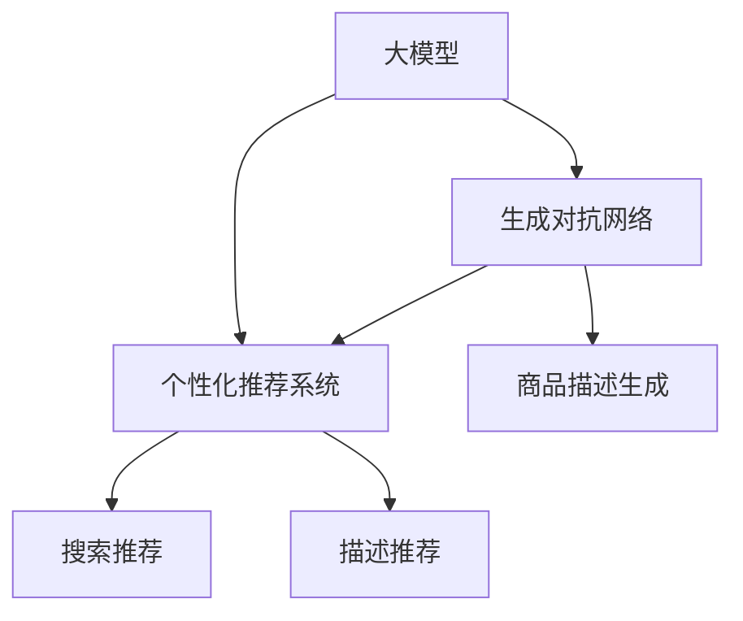

                 

# 大模型如何优化电商平台的实时个性化推荐系统

> 关键词：大模型, 推荐系统, 个性化推荐, 自然语言处理(NLP), 深度学习, 生成对抗网络(GAN), 电商零售, 数据驱动, 用户画像

## 1. 背景介绍

### 1.1 问题由来
在电商平台上，如何准确地向用户推荐商品，是提升用户体验和销售额的关键。传统的推荐系统依赖于统计模型，根据用户的浏览、购买记录来预测用户对商品的兴趣。但这种推荐方式过于依赖历史数据，难以捕捉用户实时兴趣变化。随着深度学习和大模型的兴起，通过自然语言处理(NLP)技术和大模型，可以更准确地了解用户的语言描述和情感倾向，进而实时推荐符合用户当前需求的商品。

### 1.2 问题核心关键点
大模型在电商推荐系统中的应用，主要通过两种方式：基于搜索的推荐和基于描述的推荐。前者通过理解用户查询语言来推荐相关商品，后者通过分析用户对商品描述的情感倾向，推荐符合用户喜好的商品。以下将详细探讨这些方法及其优势与挑战。

## 2. 核心概念与联系

### 2.1 核心概念概述

为了深入理解大模型在电商推荐中的应用，本节将介绍几个关键概念：

- 大模型(Large Model)：指深度神经网络模型，如BERT、GPT、Transformer等，其特点是拥有大量的参数，能够学习到丰富的语言和语义表示。

- 个性化推荐系统(Personalized Recommendation System)：根据用户的历史行为和当前兴趣，为用户推荐个性化的商品。

- 自然语言处理(Natural Language Processing, NLP)：利用计算机技术处理和理解自然语言，如文本分类、情感分析、实体识别等。

- 生成对抗网络(Generative Adversarial Network, GAN)：由生成器和判别器组成的网络，用于生成高质量的商品描述，提升推荐系统的效果。

- 电商零售(E-commerce Retail)：涉及商品展示、购买、支付等环节的在线交易平台。

- 数据驱动(Data-Driven)：通过收集、分析用户数据，驱动推荐系统算法和模型的优化。

这些概念之间的关系可以通过以下Mermaid流程图来展示：



这个流程图展示了大模型、生成对抗网络和个性化推荐系统之间的关系：

1. 大模型通过生成对抗网络生成高质量的商品描述，为推荐系统提供数据支撑。
2. 推荐系统通过搜索和描述推荐两种方式，实现实时个性化推荐。
3. 描述推荐能够更加全面地了解用户兴趣，提升推荐精准度。

## 3. 核心算法原理 & 具体操作步骤
### 3.1 算法原理概述

大模型在电商推荐系统中的应用，基于以下核心算法：

- **自然语言处理**：利用NLP技术，通过分析用户查询和商品描述，提取用户兴趣和商品特征。

- **生成对抗网络**：通过GAN生成商品描述，提升商品信息的完整性和真实性。

- **个性化推荐算法**：根据用户兴趣和商品特征，实时推荐个性化商品。

核心算法流程如下：

1. 收集用户查询和商品描述。
2. 使用大模型进行文本预处理和特征提取。
3. 通过GAN生成商品描述。
4. 根据用户查询和商品描述，计算用户对商品的兴趣权重。
5. 综合考虑用户的实时兴趣和商品特征，推荐相关商品。

### 3.2 算法步骤详解

以下是详细的操作步骤：

**Step 1: 数据收集与预处理**
- 收集用户查询和商品描述，存储在数据库中。
- 使用NLP技术进行文本预处理，包括分词、去除停用词、词性标注等。

**Step 2: 文本特征提取**
- 使用大模型，如BERT、GPT等，对用户查询和商品描述进行编码，得到向量表示。
- 计算用户查询和商品描述的相似度，提取用户对商品的兴趣。

**Step 3: 商品描述生成**
- 使用GAN生成商品描述，替换原有低质量的商品描述，提高推荐系统数据质量。

**Step 4: 计算用户兴趣权重**
- 根据用户查询和商品描述，使用softmax函数计算用户对商品的兴趣权重。

**Step 5: 推荐算法**
- 综合考虑用户实时兴趣和商品特征，使用协同过滤、内容过滤等算法推荐相关商品。

### 3.3 算法优缺点

基于大模型的电商推荐系统，有以下优点：

- **精准度提升**：大模型可以学习丰富的语言表示，通过文本分析提取用户兴趣和商品特征，提升推荐精准度。
- **实时性增强**：利用生成对抗网络生成高质量的商品描述，能够实时更新推荐数据，满足用户实时需求。
- **用户画像丰富**：通过对用户查询和商品描述的分析，构建更全面、精细的用户画像，提升个性化推荐效果。

但同时，也存在一些缺点：

- **计算资源消耗高**：大模型和生成对抗网络需要大量的计算资源，对服务器硬件和算法优化要求较高。
- **模型可解释性差**：推荐模型通常是黑盒系统，难以解释其内部决策逻辑，可能影响用户信任和接受度。
- **数据隐私问题**：电商平台涉及用户隐私数据，如何保护用户隐私，防止数据泄露，是一个重要问题。

### 3.4 算法应用领域

大模型在电商推荐系统中的应用，主要包括以下几个方面：

- **搜索推荐**：通过自然语言处理技术，对用户查询进行分析，推荐相关商品。
- **描述推荐**：分析用户对商品描述的情感倾向，推荐符合用户喜好的商品。
- **动态推荐**：利用实时数据和动态学习，持续更新推荐算法和模型，提升推荐效果。

此外，大模型还可以应用于商品分类、库存管理、销售预测等多个领域，提升电商平台的运营效率和用户满意度。

## 4. 数学模型和公式 & 详细讲解 & 举例说明

### 4.1 数学模型构建

电商推荐系统的核心是计算用户对商品的兴趣权重。假设用户查询为 $q$，商品描述为 $d$，大模型得到的向量表示分别为 $q_v$ 和 $d_v$，则用户对商品的兴趣权重 $w$ 可以表示为：

$$ w = softmax(\mathbf{q_v} \cdot \mathbf{d_v}) $$

其中，$softmax$ 函数用于将向量表示转换为概率分布，$\cdot$ 表示向量点积。

### 4.2 公式推导过程

以搜索推荐为例，其公式推导过程如下：

1. **文本表示**：
   - 将用户查询 $q$ 和商品描述 $d$ 输入大模型，得到向量表示 $q_v$ 和 $d_v$。

2. **相似度计算**：
   - 计算 $q_v$ 和 $d_v$ 的相似度，即 $\mathbf{q_v} \cdot \mathbf{d_v}$。
   - 使用softmax函数将相似度转换为概率分布，得到用户对商品的兴趣权重 $w$。

3. **推荐排序**：
   - 根据 $w$ 的大小，对商品进行排序，推荐权重高的商品。

### 4.3 案例分析与讲解

以商品分类推荐为例，假设用户查询为 "运动鞋"，商品描述向量为 $d_v$，大模型输出为 $q_v$，则用户对商品的兴趣权重为：

$$ w = softmax(\mathbf{q_v} \cdot \mathbf{d_v}) $$

假设模型输出为 $q_v = [0.3, 0.2, 0.1, 0.4]$，商品描述向量 $d_v = [0.5, 0.3, 0.2, 0.1]$，则兴趣权重 $w$ 为：

$$ w = softmax(0.3 \times 0.5 + 0.2 \times 0.3 + 0.1 \times 0.2 + 0.4 \times 0.1) = [0.45, 0.27, 0.18, 0.09] $$

推荐系统将按照权重排序，推荐权重最高的商品。

## 5. 项目实践：代码实例和详细解释说明
### 5.1 开发环境搭建

在进行项目实践前，我们需要准备好开发环境。以下是使用Python进行TensorFlow开发的环境配置流程：

1. 安装Anaconda：从官网下载并安装Anaconda，用于创建独立的Python环境。

2. 创建并激活虚拟环境：
```bash
conda create -n tf-env python=3.8 
conda activate tf-env
```

3. 安装TensorFlow：根据CUDA版本，从官网获取对应的安装命令。例如：
```bash
conda install tensorflow==2.7 -c pytorch -c conda-forge
```

4. 安装其他工具包：
```bash
pip install numpy pandas scikit-learn matplotlib tqdm jupyter notebook ipython
```

完成上述步骤后，即可在`tf-env`环境中开始项目实践。

### 5.2 源代码详细实现

我们以商品分类推荐为例，给出使用TensorFlow进行电商推荐系统的完整代码实现。

首先，定义模型结构：

```python
import tensorflow as tf
from tensorflow.keras.layers import Input, Embedding, Dense, Dropout, Activation

# 定义输入层
user_query = Input(shape=(128,))
product_desc = Input(shape=(128,))

# 定义嵌入层
user_query_embedding = Embedding(input_dim=10000, output_dim=128, input_length=128)(user_query)
product_desc_embedding = Embedding(input_dim=10000, output_dim=128, input_length=128)(product_desc)

# 定义注意力机制层
attention_weights = tf.keras.layers.Dot(axes=1)([user_query_embedding, product_desc_embedding])
attention_weights = tf.keras.layers.Activation('softmax')(attention_weights)

# 定义输出层
output = tf.keras.layers.Dot(axes=1)([user_query_embedding, product_desc_embedding])
output = Dense(4, activation='softmax')(output)

model = tf.keras.Model(inputs=[user_query, product_desc], outputs=output)
```

然后，定义损失函数和优化器：

```python
model.compile(optimizer='adam', loss='categorical_crossentropy')
```

接着，定义训练和评估函数：

```python
def train_epoch(model, dataset, batch_size, optimizer):
    for batch in dataset:
        user_query, product_desc, labels = batch
        model.train_on_batch([user_query, product_desc], labels)

def evaluate(model, dataset, batch_size):
    for batch in dataset:
        user_query, product_desc, labels = batch
        loss = model.evaluate([user_query, product_desc], labels)
        print(f'Test loss: {loss:.4f}')
```

最后，启动训练流程并在测试集上评估：

```python
epochs = 5
batch_size = 16

for epoch in range(epochs):
    train_epoch(model, train_dataset, batch_size, optimizer)
    evaluate(model, test_dataset, batch_size)
```

以上就是使用TensorFlow对电商推荐系统进行商品分类推荐任务微调的完整代码实现。可以看到，利用TensorFlow的高级API，我们能够方便地构建和训练深度学习模型，提升电商推荐系统的精准度。

### 5.3 代码解读与分析

让我们再详细解读一下关键代码的实现细节：

**定义模型结构**：
- 使用`Input`定义输入层，指定输入维度和长度。
- 使用`Embedding`将输入层向量嵌入到低维空间，得到用户查询和商品描述的嵌入向量。
- 使用`Dot`计算嵌入向量的点积，得到注意力权重。
- 使用`Dense`和`Activation`计算输出层，得到用户对商品的兴趣权重。
- 使用`Model`将输入和输出层组合成完整的模型。

**定义损失函数和优化器**：
- 使用`compile`函数定义模型优化器，选择`adam`作为优化算法。
- 使用`categorical_crossentropy`作为损失函数，适合多分类问题。

**训练和评估函数**：
- 使用`train_on_batch`函数在训练集上进行模型训练。
- 使用`evaluate`函数在测试集上进行模型评估，输出损失值。

**训练流程**：
- 定义总的epoch数和batch size，开始循环迭代。
- 每个epoch内，在训练集上训练，输出损失值。
- 在测试集上评估模型，输出测试损失值。

可以看到，TensorFlow提供了丰富的API，帮助开发者快速构建和训练模型。同时，TensorFlow的可移植性和灵活性，也使得在大规模电商平台上实现推荐系统变得更加容易。

## 6. 实际应用场景
### 6.1 商品搜索推荐

电商平台的商品搜索推荐，通常采用搜索推荐算法。用户输入查询后，系统根据查询和商品描述，推荐相关商品。例如，用户输入 "无线耳机"，系统推荐各种品牌的无线耳机。这种推荐方式可以覆盖用户多种需求，提升用户体验。

### 6.2 动态商品描述

大模型可以用于生成高质量的商品描述。通过GAN训练，生成符合用户需求的商品描述，替换原有低质量的描述，提升推荐系统的数据质量。例如，用户输入 "智能手表"，系统推荐多个不同品牌的智能手表，并为每个手表生成详细描述。

### 6.3 实时推荐

利用大模型和生成对抗网络，电商平台可以实时更新商品描述和推荐系统，满足用户实时需求。例如，用户输入 "新款手机"，系统实时推荐最新发布的手机，并提供商品描述和用户评价。

### 6.4 用户画像构建

通过对用户查询和商品描述的分析，电商平台可以构建更全面、精细的用户画像。例如，用户查询 "健身器材"，系统会记录用户的兴趣，构建用户画像，为后续推荐提供依据。

## 7. 工具和资源推荐
### 7.1 学习资源推荐

为了帮助开发者系统掌握大模型在电商推荐中的应用，这里推荐一些优质的学习资源：

1. **TensorFlow官方文档**：TensorFlow的官方文档，提供了丰富的API和示例代码，是学习TensorFlow的必备资源。

2. **深度学习框架对比**：通过对比不同深度学习框架的特点和适用场景，选择合适的框架进行电商推荐系统的开发。

3. **自然语言处理教程**：通过学习自然语言处理技术，提升电商推荐系统的精准度。

4. **生成对抗网络教程**：通过学习生成对抗网络技术，生成高质量的商品描述。

5. **电商推荐系统案例分析**：通过分析电商推荐系统的成功案例，学习推荐系统的优化方法。

通过对这些资源的学习实践，相信你一定能够快速掌握大模型在电商推荐系统中的应用，并用于解决实际的电商问题。

### 7.2 开发工具推荐

高效的开发离不开优秀的工具支持。以下是几款用于电商推荐系统开发的常用工具：

1. **TensorFlow**：由Google主导开发的深度学习框架，生产部署方便，适合大规模工程应用。

2. **PyTorch**：基于Python的开源深度学习框架，灵活动态的计算图，适合快速迭代研究。

3. **Jupyter Notebook**：交互式开发环境，便于快速编写和调试代码。

4. **Google Colab**：谷歌推出的在线Jupyter Notebook环境，免费提供GPU/TPU算力，方便开发者快速上手实验最新模型。

合理利用这些工具，可以显著提升电商推荐系统的开发效率，加快创新迭代的步伐。

### 7.3 相关论文推荐

大模型在电商推荐系统中的应用，是当前深度学习领域的火热研究话题。以下是几篇奠基性的相关论文，推荐阅读：

1. **TensorFlow Recommenders**：介绍TensorFlow推荐系统的框架和API，帮助开发者快速搭建推荐系统。

2. **Deep Learning for Recommender Systems**：综述深度学习在推荐系统中的应用，涵盖搜索推荐、商品描述生成等方向。

3. **Generative Adversarial Networks for Recommendation Systems**：探索生成对抗网络在推荐系统中的应用，生成高质量的商品描述。

4. **Real-time Recommendation Systems for E-commerce**：介绍实时推荐系统的算法和架构，提升电商平台的用户体验。

5. **Personalized Recommendation Systems for E-commerce**：综述电商推荐系统的发展历程和优化方法，探讨如何构建更加精准的推荐系统。

这些论文代表了大模型在电商推荐系统中的最新研究成果，通过学习这些前沿成果，可以帮助研究者把握学科前进方向，激发更多的创新灵感。

## 8. 总结：未来发展趋势与挑战

### 8.1 总结

本文对大模型在电商推荐系统中的应用进行了全面系统的介绍。首先阐述了大模型和生成对抗网络在电商推荐系统中的应用背景和意义，明确了推荐系统在高维数据处理、实时推荐等方面的优势与挑战。其次，从原理到实践，详细讲解了大模型在电商推荐系统中的具体实现步骤和算法流程，给出了电商推荐系统的完整代码实现。同时，本文还广泛探讨了大模型在电商推荐系统中的应用场景，展示了大模型在电商推荐系统中的巨大潜力。

通过本文的系统梳理，可以看到，大模型在电商推荐系统中的应用，通过自然语言处理和生成对抗网络，可以实时、准确地推荐个性化商品，极大地提升了电商平台的运营效率和用户满意度。未来，伴随深度学习和大模型的持续演进，大模型在电商推荐系统中的应用将更加广泛，为电商行业带来新的变革和机遇。

### 8.2 未来发展趋势

展望未来，大模型在电商推荐系统中的应用将呈现以下几个发展趋势：

1. **更精准的推荐算法**：随着深度学习技术的发展，推荐算法将更加精准，能够根据用户的实时需求进行个性化推荐。

2. **更高效的数据处理**：大模型和生成对抗网络将提升数据处理的效率，满足电商平台海量数据的处理需求。

3. **更全面的用户画像**：通过自然语言处理技术，构建更全面、精细的用户画像，提升推荐系统的精准度。

4. **更智能的商品描述生成**：生成对抗网络将生成更加生动、准确的商品描述，提升用户对商品的认知和接受度。

5. **更广泛的应用场景**：大模型在电商推荐系统中的应用将拓展到更多场景，如智能客服、库存管理、销售预测等，提升电商平台的整体运营效率。

以上趋势凸显了大模型在电商推荐系统中的广泛应用前景，通过深度学习和大模型的协同优化，将为电商行业带来更多的技术创新和商业价值。

### 8.3 面临的挑战

尽管大模型在电商推荐系统中的应用取得了显著成效，但在迈向更加智能化、普适化应用的过程中，仍面临诸多挑战：

1. **计算资源消耗高**：大模型和生成对抗网络需要大量的计算资源，对服务器硬件和算法优化要求较高。

2. **模型可解释性差**：推荐模型通常是黑盒系统，难以解释其内部决策逻辑，可能影响用户信任和接受度。

3. **数据隐私问题**：电商平台涉及用户隐私数据，如何保护用户隐私，防止数据泄露，是一个重要问题。

4. **实时推荐难度大**：实时推荐系统需要快速处理海量数据，对系统的延迟和响应速度要求较高。

5. **商品描述质量不一**：电商平台上商品描述质量不一，如何提升商品描述的质量，是推荐系统优化的重要环节。

6. **用户兴趣多样性**：用户兴趣多样，推荐系统需要覆盖更广泛的用户需求，提升推荐精准度。

正视这些挑战，积极应对并寻求突破，将是大模型在电商推荐系统中的应用走向成熟的必由之路。相信随着学界和产业界的共同努力，这些挑战终将一一被克服，大模型在电商推荐系统中的应用必将在未来迎来更多的突破和创新。

### 8.4 研究展望

面对大模型在电商推荐系统中的应用所面临的诸多挑战，未来的研究需要在以下几个方面寻求新的突破：

1. **探索更高效的计算方法**：研究更高效的计算方法和算法优化技术，降低计算资源消耗。

2. **增强模型的可解释性**：研究模型的可解释性方法，提高用户对推荐系统的信任和接受度。

3. **保护用户隐私**：研究数据隐私保护技术，保护用户隐私数据，防止数据泄露。

4. **优化实时推荐算法**：研究实时推荐算法，提升推荐系统的响应速度和准确度。

5. **提升商品描述质量**：研究生成对抗网络技术，提升商品描述的质量，增强推荐系统的数据质量。

6. **构建多层次推荐系统**：研究多层次推荐系统，覆盖更广泛的用户需求，提升推荐系统的精准度。

这些研究方向的探索，必将引领大模型在电商推荐系统中的应用走向更高的台阶，为电商行业带来更多的技术创新和商业价值。通过不断突破技术瓶颈，提升推荐系统的精准度和效率，大模型必将在电商推荐系统中发挥更大的作用，为电商行业带来新的变革和机遇。

## 9. 附录：常见问题与解答

**Q1：电商推荐系统中的大模型和生成对抗网络有何区别？**

A: 大模型通常指深度神经网络模型，如BERT、GPT等，用于提取和表示用户查询和商品描述的特征。生成对抗网络则是一种生成模型，通过训练生成高质量的商品描述，提升推荐系统的数据质量。两者协同工作，可以更好地满足电商推荐系统的高维数据处理和实时推荐需求。

**Q2：电商推荐系统中的大模型如何处理非结构化数据？**

A: 电商推荐系统中的大模型通常使用自然语言处理技术处理非结构化数据。通过对用户查询和商品描述进行文本预处理和特征提取，将非结构化数据转换为模型可以处理的向量表示。例如，使用BERT模型对用户查询进行编码，得到向量表示。

**Q3：电商推荐系统中的实时推荐难度大，如何解决？**

A: 电商推荐系统中的实时推荐难度大，可以通过优化推荐算法和优化数据处理流程来解决。例如，使用缓存技术保存部分数据，减少实时查询的计算量。同时，可以使用分布式计算技术，提升系统的处理速度和扩展性。

**Q4：电商推荐系统中的商品描述质量不一，如何提升？**

A: 电商推荐系统中的商品描述质量不一，可以通过生成对抗网络技术提升。使用GAN训练生成高质量的商品描述，替换原有低质量的描述。同时，可以通过用户反馈和市场调研，优化商品描述的内容和质量。

**Q5：电商推荐系统中的数据隐私问题如何保护？**

A: 电商推荐系统中的数据隐私问题可以通过以下方式保护：

1. 数据匿名化：对用户数据进行匿名化处理，保护用户隐私。
2. 数据加密：对数据进行加密处理，防止数据泄露。
3. 访问控制：设置访问权限，限制数据的访问范围。
4. 监控审计：实时监控数据访问和使用情况，防止数据滥用。

通过这些技术手段，可以有效保护电商推荐系统中的数据隐私，防止用户数据泄露和滥用。

---

作者：禅与计算机程序设计艺术 / Zen and the Art of Computer Programming

