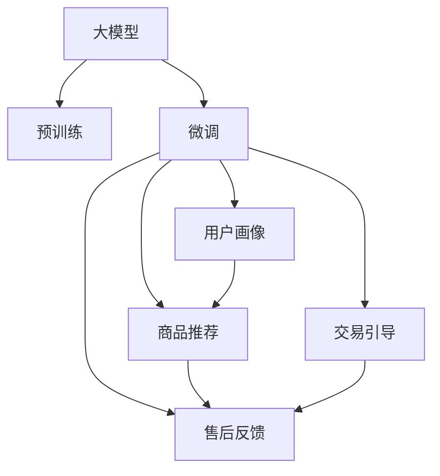

                 

# 大模型如何提升电商平台的用户体验一致性

## 1. 背景介绍

### 1.1 问题由来
随着互联网和电子商务的迅猛发展，电商平台已成为人们日常消费、购物、学习、娱乐的重要平台。但与此同时，电商平台上的商品信息繁多、促销活动复杂，用户常常陷入信息过载的困境，导致用户体验一致性难以保障。为提升用户体验一致性，电商平台亟需对用户画像、商品推荐、交易引导、售后反馈等环节进行全面优化。

大模型技术的发展为电商平台提供了新的解决方案。本文将介绍如何利用大模型提升电商平台的用户体验一致性，通过分析大模型的核心原理和实现步骤，阐述其应用领域和实际效果，并给出具体的项目实践和实际案例。

## 2. 核心概念与联系

### 2.1 核心概念概述

为更好地理解大模型在电商平台中的应用，本节将介绍几个密切相关的核心概念：

- 大模型（Large Model）：指在大规模无标签数据上进行自监督或监督学习训练，具有强大泛化能力和语言理解能力的模型，如BERT、GPT等。

- 预训练（Pre-training）：指在大规模无标签数据上进行自监督学习，学习通用的语言表示，使得模型具备丰富的语言知识和常识。

- 微调（Fine-tuning）：指在大模型上进行下游任务特定的有监督学习，优化模型在该任务上的性能，如分类、匹配、生成等。

- 用户画像（User Profiling）：通过分析用户的历史行为、兴趣偏好等数据，构建出用户完整的画像，实现个性化推荐和服务。

- 商品推荐（Product Recommendation）：通过分析用户画像和商品属性，推荐用户可能感兴趣的商品，提升用户体验和满意度。

- 交易引导（Transaction Guidance）：通过分析用户行为数据，优化交易流程，减少用户决策的时间和成本。

- 售后反馈（After-Sales Feedback）：通过分析用户反馈和评价，持续改进产品和服务质量，提升用户满意度。

这些核心概念之间的逻辑关系可以通过以下Mermaid流程图来展示：



这个流程图展示了大模型在电商平台中的应用框架：

1. 大模型通过预训练获得基础能力。
2. 微调使得大模型更好地适应特定任务，如构建用户画像、商品推荐、交易引导等。
3. 构建用户画像后，可以用于商品推荐和交易引导，进一步提升用户体验。
4. 售后反馈是用户与商家互动的结果，通过分析用户反馈，可以改进大模型和电商平台系统，实现持续优化。

## 3. 核心算法原理 & 具体操作步骤

### 3.1 算法原理概述

利用大模型提升电商平台用户体验一致性，本质上是一种基于有监督学习的大模型微调过程。其核心思想是：将大模型作为强大的"特征提取器"，通过有监督学习优化模型参数，使得模型在特定任务上的输出更符合用户期望，从而提升用户体验一致性。

具体而言，步骤如下：

1. 收集电商平台相关的标注数据，包括用户画像、商品信息、交易记录、售后评价等。
2. 设计合适的任务适配层，如分类层、生成层等，用于将大模型输出的特征映射到具体的任务目标。
3. 设置合适的微调超参数，如学习率、批大小、迭代轮数等。
4. 在标注数据上执行梯度训练，不断更新模型参数。
5. 通过评估模型性能，如准确率、召回率、F1分数等，优化模型参数。
6. 在优化过程中，结合用户画像、交易引导等模块，进一步提升用户体验一致性。

### 3.2 算法步骤详解

**Step 1: 准备数据集和模型**

- 收集电商平台相关的标注数据集，如用户画像数据、商品信息数据、交易记录数据和售后评价数据。
- 选择合适的预训练模型，如BERT、GPT等，进行微调。

**Step 2: 设计任务适配层**

- 根据具体任务需求，设计合适的任务适配层。例如，对于用户画像构建任务，可以设计多任务学习（MTL）模型，同时学习用户兴趣、历史行为和消费习惯；对于商品推荐任务，可以设计基于注意力机制的推荐模型，学习商品特征和用户兴趣之间的关联；对于交易引导任务，可以设计强化学习模型，优化交易流程和用户体验。

**Step 3: 设置微调超参数**

- 设置合适的优化器，如Adam、SGD等，并调整学习率、批大小、迭代轮数等超参数。
- 应用正则化技术，如L2正则、Dropout、Early Stopping等，防止过拟合。
- 确定冻结预训练参数的策略，如仅微调顶层，或全部参数都参与微调。

**Step 4: 执行梯度训练**

- 将训练集数据分批次输入模型，前向传播计算损失函数。
- 反向传播计算参数梯度，根据设定的优化算法和学习率更新模型参数。
- 周期性在验证集上评估模型性能，根据性能指标决定是否触发Early Stopping。
- 重复上述步骤直至满足预设的迭代轮数或Early Stopping条件。

**Step 5: 测试和优化**

- 在测试集上评估微调后模型的性能，如准确率、召回率、F1分数等。
- 结合用户画像、交易引导等模块，进一步提升用户体验一致性。
- 持续收集用户反馈，更新模型和系统，实现持续优化。

### 3.3 算法优缺点

利用大模型提升电商平台用户体验一致性，具有以下优点：

- 高效性：通过预训练和微调，可以快速构建用户画像、商品推荐等模块，提升用户体验一致性。
- 泛化能力强：大模型具有较强的泛化能力，可以适应不同类型和规模的电商平台。
- 自动化程度高：通过微调和优化，自动化程度高，可以降低人工干预的成本。
- 可扩展性强：可以结合用户画像、交易引导等模块，进行定制化的优化和改进。

同时，该方法也存在一定的局限性：

- 依赖标注数据：微调的效果很大程度上取决于标注数据的质量和数量，获取高质量标注数据的成本较高。
- 模型复杂度高：大模型的参数量庞大，对硬件资源要求较高。
- 训练时间较长：微调大模型需要大量计算资源和时间。
- 数据隐私问题：收集和存储大量用户数据可能涉及隐私和安全问题。

尽管存在这些局限性，但就目前而言，利用大模型提升电商平台用户体验一致性的方法仍是大模型应用的重要方向之一。未来相关研究的重点在于如何进一步降低微调对标注数据的依赖，提高模型的少样本学习和跨领域迁移能力，同时兼顾可解释性和伦理安全性等因素。

### 3.4 算法应用领域

大模型在电商平台中的应用已经得到了广泛的应用，覆盖了几乎所有常见任务，例如：

- 用户画像构建：利用用户历史行为、交易记录等数据，构建出用户画像，实现个性化推荐和服务。
- 商品推荐系统：通过分析用户画像和商品属性，推荐用户可能感兴趣的商品，提升用户体验和满意度。
- 交易引导系统：通过分析用户行为数据，优化交易流程，减少用户决策的时间和成本。
- 售后反馈分析：通过分析用户反馈和评价，持续改进产品和服务质量，提升用户满意度。

除了上述这些经典任务外，大模型还被创新性地应用到更多场景中，如实时库存管理、个性化广告投放、智能客服等，为电商平台的运营提供了新的技术手段。

## 4. 数学模型和公式 & 详细讲解  
### 4.1 数学模型构建

本节将使用数学语言对利用大模型提升电商平台用户体验一致性的方法进行更加严格的刻画。

记电商平台相关的标注数据集为 $D=\{(x_i,y_i)\}_{i=1}^N$，其中 $x_i$ 为输入，$y_i$ 为标签。设大模型为 $M_{\theta}$，其中 $\theta$ 为模型参数。

定义模型 $M_{\theta}$ 在输入 $x_i$ 上的损失函数为 $\ell(M_{\theta}(x_i),y_i)$，则在数据集 $D$ 上的经验风险为：

$$
\mathcal{L}(\theta) = \frac{1}{N} \sum_{i=1}^N \ell(M_{\theta}(x_i),y_i)
$$

微调的优化目标是最小化经验风险，即找到最优参数：

$$
\theta^* = \mathop{\arg\min}_{\theta} \mathcal{L}(\theta)
$$

在实践中，我们通常使用基于梯度的优化算法（如SGD、Adam等）来近似求解上述最优化问题。设 $\eta$ 为学习率，则参数的更新公式为：

$$
\theta \leftarrow \theta - \eta \nabla_{\theta}\mathcal{L}(\theta)
$$

其中 $\nabla_{\theta}\mathcal{L}(\theta)$ 为损失函数对参数 $\theta$ 的梯度，可通过反向传播算法高效计算。

### 4.2 公式推导过程

以下我们以商品推荐系统为例，推导基于大模型的推荐公式及其梯度的计算公式。

假设模型 $M_{\theta}$ 在输入 $x$ 上的输出为 $\hat{y}=M_{\theta}(x)$，表示预测商品被用户点击的概率。真实标签 $y \in \{0,1\}$。则二分类交叉熵损失函数定义为：

$$
\ell(M_{\theta}(x),y) = -[y\log \hat{y} + (1-y)\log (1-\hat{y})]
$$

将其代入经验风险公式，得：

$$
\mathcal{L}(\theta) = -\frac{1}{N}\sum_{i=1}^N [y_i\log M_{\theta}(x_i)+(1-y_i)\log(1-M_{\theta}(x_i))]
$$

根据链式法则，损失函数对参数 $\theta_k$ 的梯度为：

$$
\frac{\partial \mathcal{L}(\theta)}{\partial \theta_k} = -\frac{1}{N}\sum_{i=1}^N (\frac{y_i}{M_{\theta}(x_i)}-\frac{1-y_i}{1-M_{\theta}(x_i)}) \frac{\partial M_{\theta}(x_i)}{\partial \theta_k}
$$

其中 $\frac{\partial M_{\theta}(x_i)}{\partial \theta_k}$ 可进一步递归展开，利用自动微分技术完成计算。

在得到损失函数的梯度后，即可带入参数更新公式，完成模型的迭代优化。重复上述过程直至收敛，最终得到适应电商平台推荐任务的最优模型参数 $\theta^*$。

## 5. 项目实践：代码实例和详细解释说明
### 5.1 开发环境搭建

在进行微调实践前，我们需要准备好开发环境。以下是使用Python进行PyTorch开发的环境配置流程：

1. 安装Anaconda：从官网下载并安装Anaconda，用于创建独立的Python环境。

2. 创建并激活虚拟环境：
```bash
conda create -n pytorch-env python=3.8 
conda activate pytorch-env
```

3. 安装PyTorch：根据CUDA版本，从官网获取对应的安装命令。例如：
```bash
conda install pytorch torchvision torchaudio cudatoolkit=11.1 -c pytorch -c conda-forge
```

4. 安装Transformers库：
```bash
pip install transformers
```

5. 安装各类工具包：
```bash
pip install numpy pandas scikit-learn matplotlib tqdm jupyter notebook ipython
```

完成上述步骤后，即可在`pytorch-env`环境中开始微调实践。

### 5.2 源代码详细实现

下面我们以电商平台商品推荐系统为例，给出使用Transformers库对BERT模型进行微调的PyTorch代码实现。

首先，定义推荐任务的数据处理函数：

```python
from transformers import BertTokenizer
from torch.utils.data import Dataset
import torch

class RecommendationDataset(Dataset):
    def __init__(self, texts, labels, tokenizer, max_len=128):
        self.texts = texts
        self.labels = labels
        self.tokenizer = tokenizer
        self.max_len = max_len
        
    def __len__(self):
        return len(self.texts)
    
    def __getitem__(self, item):
        text = self.texts[item]
        label = self.labels[item]
        
        encoding = self.tokenizer(text, return_tensors='pt', max_length=self.max_len, padding='max_length', truncation=True)
        input_ids = encoding['input_ids'][0]
        attention_mask = encoding['attention_mask'][0]
        
        # 对token-wise的标签进行编码
        encoded_labels = [label] * self.max_len
        labels = torch.tensor(encoded_labels, dtype=torch.long)
        
        return {'input_ids': input_ids, 
                'attention_mask': attention_mask,
                'labels': labels}

# 标签与id的映射
label2id = {0: 'not_recommend', 1: 'recommend'}
id2label = {v: k for k, v in label2id.items()}

# 创建dataset
tokenizer = BertTokenizer.from_pretrained('bert-base-cased')

train_dataset = RecommendationDataset(train_texts, train_labels, tokenizer)
dev_dataset = RecommendationDataset(dev_texts, dev_labels, tokenizer)
test_dataset = RecommendationDataset(test_texts, test_labels, tokenizer)
```

然后，定义模型和优化器：

```python
from transformers import BertForTokenClassification, AdamW

model = BertForTokenClassification.from_pretrained('bert-base-cased', num_labels=len(label2id))

optimizer = AdamW(model.parameters(), lr=2e-5)
```

接着，定义训练和评估函数：

```python
from torch.utils.data import DataLoader
from tqdm import tqdm
from sklearn.metrics import accuracy_score

device = torch.device('cuda') if torch.cuda.is_available() else torch.device('cpu')
model.to(device)

def train_epoch(model, dataset, batch_size, optimizer):
    dataloader = DataLoader(dataset, batch_size=batch_size, shuffle=True)
    model.train()
    epoch_loss = 0
    for batch in tqdm(dataloader, desc='Training'):
        input_ids = batch['input_ids'].to(device)
        attention_mask = batch['attention_mask'].to(device)
        labels = batch['labels'].to(device)
        model.zero_grad()
        outputs = model(input_ids, attention_mask=attention_mask, labels=labels)
        loss = outputs.loss
        epoch_loss += loss.item()
        loss.backward()
        optimizer.step()
    return epoch_loss / len(dataloader)

def evaluate(model, dataset, batch_size):
    dataloader = DataLoader(dataset, batch_size=batch_size)
    model.eval()
    preds, labels = [], []
    with torch.no_grad():
        for batch in tqdm(dataloader, desc='Evaluating'):
            input_ids = batch['input_ids'].to(device)
            attention_mask = batch['attention_mask'].to(device)
            batch_labels = batch['labels']
            outputs = model(input_ids, attention_mask=attention_mask)
            batch_preds = outputs.logits.argmax(dim=2).to('cpu').tolist()
            batch_labels = batch_labels.to('cpu').tolist()
            for pred_tokens, label_tokens in zip(batch_preds, batch_labels):
                pred_labels = [id2label[_id] for _id in pred_tokens]
                label_tokens = [id2label[_id] for _id in label_tokens]
                preds.append(pred_labels[:len(label_tokens)])
                labels.append(label_tokens)
                
    print(accuracy_score(labels, preds))
```

最后，启动训练流程并在测试集上评估：

```python
epochs = 5
batch_size = 16

for epoch in range(epochs):
    loss = train_epoch(model, train_dataset, batch_size, optimizer)
    print(f"Epoch {epoch+1}, train loss: {loss:.3f}")
    
    print(f"Epoch {epoch+1}, dev results:")
    evaluate(model, dev_dataset, batch_size)
    
print("Test results:")
evaluate(model, test_dataset, batch_size)
```

以上就是使用PyTorch对BERT进行电商平台商品推荐系统微调的完整代码实现。可以看到，得益于Transformers库的强大封装，我们可以用相对简洁的代码完成BERT模型的加载和微调。

### 5.3 代码解读与分析

让我们再详细解读一下关键代码的实现细节：

**RecommendationDataset类**：
- `__init__`方法：初始化文本、标签、分词器等关键组件。
- `__len__`方法：返回数据集的样本数量。
- `__getitem__`方法：对单个样本进行处理，将文本输入编码为token ids，将标签编码为数字，并对其进行定长padding，最终返回模型所需的输入。

**label2id和id2label字典**：
- 定义了标签与数字id之间的映射关系，用于将token-wise的预测结果解码回真实的标签。

**训练和评估函数**：
- 使用PyTorch的DataLoader对数据集进行批次化加载，供模型训练和推理使用。
- 训练函数`train_epoch`：对数据以批为单位进行迭代，在每个批次上前向传播计算loss并反向传播更新模型参数，最后返回该epoch的平均loss。
- 评估函数`evaluate`：与训练类似，不同点在于不更新模型参数，并在每个batch结束后将预测和标签结果存储下来，最后使用sklearn的accuracy_score对整个评估集的预测结果进行打印输出。

**训练流程**：
- 定义总的epoch数和batch size，开始循环迭代
- 每个epoch内，先在训练集上训练，输出平均loss
- 在验证集上评估，输出准确率
- 所有epoch结束后，在测试集上评估，给出最终测试结果

可以看到，PyTorch配合Transformers库使得BERT微调的代码实现变得简洁高效。开发者可以将更多精力放在数据处理、模型改进等高层逻辑上，而不必过多关注底层的实现细节。

当然，工业级的系统实现还需考虑更多因素，如模型的保存和部署、超参数的自动搜索、更灵活的任务适配层等。但核心的微调范式基本与此类似。

## 6. 实际应用场景

### 6.1 智能推荐系统

基于大模型的推荐系统已经广泛应用于各类电商平台中。传统的推荐系统往往基于用户历史行为进行推荐，但无法充分考虑用户兴趣和上下文信息的复杂性。利用大模型进行推荐，可以更全面地理解用户行为和需求，提供更加精准和个性化的推荐。

在技术实现上，可以收集用户浏览、点击、购买等行为数据，提取和商品属性相关的文本信息。将文本信息作为模型输入，用户后续行为作为监督信号，在此基础上微调预训练语言模型。微调后的模型能够从文本内容中准确把握用户的兴趣点，进一步提升推荐精度和用户体验一致性。

### 6.2 个性化客服系统

智能客服系统在电商平台中扮演着越来越重要的角色。传统的客服系统往往依赖人工，响应速度慢、无法24小时服务，且缺乏个性化。利用大模型进行客服系统的优化，可以显著提升客服体验一致性。

在技术实现上，可以收集客服历史对话数据，并标注不同场景下的问题与答复。将对话文本作为模型输入，模型自动学习常见问题和标准答复。在用户咨询时，系统自动匹配问题并给出最合适的答复，同时结合用户画像进一步个性化推荐服务。如此构建的智能客服系统，能大幅提升客服响应速度和个性化程度。

### 6.3 实时库存管理系统

实时库存管理对于电商平台运营至关重要。传统的方法往往基于简单的历史数据和人工规则，无法及时响应需求变化。利用大模型进行库存优化，可以更准确地预测库存需求，提升库存管理效率。

在技术实现上，可以收集历史销售数据和市场行情数据，提取和库存管理相关的文本信息。将文本信息作为模型输入，用户后续行为作为监督信号，在此基础上微调预训练语言模型。微调后的模型能够从文本内容中学习到更准确的库存需求预测模型，从而提升库存管理的一致性和准确性。

### 6.4 未来应用展望

随着大模型和微调技术的不断发展，基于大模型在电商平台中的应用将更加广泛，为电商平台的运营和用户体验带来更深刻的变革。

在智慧物流领域，利用大模型进行物流路径优化、仓库管理、配送调度等，可以大幅提升物流效率和用户体验。

在智能广告领域，利用大模型进行广告推荐和投放优化，可以提升广告投放效果，降低广告成本，提升广告用户体验一致性。

在个性化内容推荐领域，利用大模型进行内容生成和推荐，可以提升内容质量和用户体验一致性，带来更优质的用户互动体验。

此外，在金融、医疗、教育等众多领域，基于大模型的电商平台应用也将不断涌现，为各行各业带来新的技术突破。相信随着技术的日益成熟，大模型将会在电商平台中发挥更大的作用，为电商平台的运营和用户体验带来更深的变革。

## 7. 工具和资源推荐
### 7.1 学习资源推荐

为了帮助开发者系统掌握大模型在电商平台中的应用，这里推荐一些优质的学习资源：

1. 《Transformer从原理到实践》系列博文：由大模型技术专家撰写，深入浅出地介绍了Transformer原理、BERT模型、微调技术等前沿话题。

2. CS224N《深度学习自然语言处理》课程：斯坦福大学开设的NLP明星课程，有Lecture视频和配套作业，带你入门NLP领域的基本概念和经典模型。

3. 《Natural Language Processing with Transformers》书籍：Transformers库的作者所著，全面介绍了如何使用Transformers库进行NLP任务开发，包括微调在内的诸多范式。

4. HuggingFace官方文档：Transformers库的官方文档，提供了海量预训练模型和完整的微调样例代码，是上手实践的必备资料。

5. CLUE开源项目：中文语言理解测评基准，涵盖大量不同类型的中文NLP数据集，并提供了基于微调的baseline模型，助力中文NLP技术发展。

通过对这些资源的学习实践，相信你一定能够快速掌握大模型在电商平台中的应用技巧，并用于解决实际的电商问题。
###  7.2 开发工具推荐

高效的开发离不开优秀的工具支持。以下是几款用于大模型微调开发的常用工具：

1. PyTorch：基于Python的开源深度学习框架，灵活动态的计算图，适合快速迭代研究。大部分预训练语言模型都有PyTorch版本的实现。

2. TensorFlow：由Google主导开发的开源深度学习框架，生产部署方便，适合大规模工程应用。同样有丰富的预训练语言模型资源。

3. Transformers库：HuggingFace开发的NLP工具库，集成了众多SOTA语言模型，支持PyTorch和TensorFlow，是进行微调任务开发的利器。

4. Weights & Biases：模型训练的实验跟踪工具，可以记录和可视化模型训练过程中的各项指标，方便对比和调优。与主流深度学习框架无缝集成。

5. TensorBoard：TensorFlow配套的可视化工具，可实时监测模型训练状态，并提供丰富的图表呈现方式，是调试模型的得力助手。

6. Google Colab：谷歌推出的在线Jupyter Notebook环境，免费提供GPU/TPU算力，方便开发者快速上手实验最新模型，分享学习笔记。

合理利用这些工具，可以显著提升大模型在电商平台中的微调任务的开发效率，加快创新迭代的步伐。

### 7.3 相关论文推荐

大模型在电商平台中的应用源于学界的持续研究。以下是几篇奠基性的相关论文，推荐阅读：

1. Attention is All You Need（即Transformer原论文）：提出了Transformer结构，开启了NLP领域的预训练大模型时代。

2. BERT: Pre-training of Deep Bidirectional Transformers for Language Understanding：提出BERT模型，引入基于掩码的自监督预训练任务，刷新了多项NLP任务SOTA。

3. Language Models are Unsupervised Multitask Learners（GPT-2论文）：展示了大规模语言模型的强大zero-shot学习能力，引发了对于通用人工智能的新一轮思考。

4. Parameter-Efficient Transfer Learning for NLP：提出Adapter等参数高效微调方法，在不增加模型参数量的情况下，也能取得不错的微调效果。

5. Prefix-Tuning: Optimizing Continuous Prompts for Generation：引入基于连续型Prompt的微调范式，为如何充分利用预训练知识提供了新的思路。

6. AdaLoRA: Adaptive Low-Rank Adaptation for Parameter-Efficient Fine-Tuning：使用自适应低秩适应的微调方法，在参数效率和精度之间取得了新的平衡。

这些论文代表了大模型在电商平台中的应用发展脉络。通过学习这些前沿成果，可以帮助研究者把握学科前进方向，激发更多的创新灵感。

## 8. 总结：未来发展趋势与挑战

### 8.1 总结

本文对利用大模型提升电商平台用户体验一致性的方法进行了全面系统的介绍。首先阐述了大模型和微调技术的研究背景和意义，明确了微调在电商平台运营中的独特价值。其次，从原理到实践，详细讲解了基于大模型的推荐、客服、库存优化等任务微调过程，给出了具体的项目实践和实际案例。同时，本文还广泛探讨了微调方法在电商平台中的应用领域和实际效果，展示了微调范式的巨大潜力。

通过本文的系统梳理，可以看到，基于大模型的微调方法已经广泛应用于电商平台的多个环节，极大地提升了用户体验一致性，为电商平台的运营带来了显著的改进。未来，伴随大模型和微调技术的持续演进，基于大模型的微调方法必将在电商平台中发挥更大的作用，推动电商平台的运营和用户体验持续优化。

### 8.2 未来发展趋势

展望未来，大模型在电商平台中的应用将呈现以下几个发展趋势：

1. 模型规模持续增大。随着算力成本的下降和数据规模的扩张，预训练语言模型的参数量还将持续增长。超大规模语言模型蕴含的丰富语言知识，有望支撑更加复杂多变的电商推荐和客服任务。

2. 微调方法日趋多样。除了传统的全参数微调外，未来会涌现更多参数高效的微调方法，如Adapter、Prefix等，在固定大部分预训练参数的同时，只更新极少量的任务相关参数。同时优化微调模型的计算图，减少前向传播和反向传播的资源消耗，实现更加轻量级、实时性的部署。

3. 持续学习成为常态。随着数据分布的不断变化，微调模型也需要持续学习新知识以保持性能。如何在不遗忘原有知识的同时，高效吸收新样本信息，将是重要的研究课题。

4. 标注样本需求降低。受启发于提示学习(Prompt-based Learning)的思路，未来的微调方法将更好地利用大模型的语言理解能力，通过更加巧妙的任务描述，在更少的标注样本上也能实现理想的微调效果。

5. 模型通用性增强。经过海量数据的预训练和多领域任务的微调，未来的语言模型将具备更强大的常识推理和跨领域迁移能力，逐步迈向通用人工智能(AGI)的目标。

以上趋势凸显了大模型在电商平台中的应用前景。这些方向的探索发展，必将进一步提升电商平台的推荐、客服、库存管理等系统的性能和用户满意度，为电商平台的运营和用户体验带来更深刻的变革。

### 8.3 面临的挑战

尽管大模型在电商平台中的应用已经取得了显著的进展，但在迈向更加智能化、普适化应用的过程中，它仍面临着诸多挑战：

1. 标注成本瓶颈。尽管微调减少了标注数据的需求，但对于一些特定领域的任务，获取高质量标注数据的成本仍然较高。如何进一步降低微调对标注样本的依赖，将是一大难题。

2. 模型鲁棒性不足。当前微调模型面对域外数据时，泛化性能往往大打折扣。对于测试样本的微小扰动，微调模型的预测也容易发生波动。如何提高微调模型的鲁棒性，避免灾难性遗忘，还需要更多理论和实践的积累。

3. 推理效率有待提高。大规模语言模型虽然精度高，但在实际部署时往往面临推理速度慢、内存占用大等效率问题。如何在保证性能的同时，简化模型结构，提升推理速度，优化资源占用，将是重要的优化方向。

4. 可解释性亟需加强。当前微调模型更像是"黑盒"系统，难以解释其内部工作机制和决策逻辑。对于医疗、金融等高风险应用，算法的可解释性和可审计性尤为重要。如何赋予微调模型更强的可解释性，将是亟待攻克的难题。

5. 安全性有待保障。预训练语言模型难免会学习到有偏见、有害的信息，通过微调传递到下游任务，产生误导性、歧视性的输出，给实际应用带来安全隐患。如何从数据和算法层面消除模型偏见，避免恶意用途，确保输出的安全性，也将是重要的研究课题。

6. 知识整合能力不足。现有的微调模型往往局限于任务内数据，难以灵活吸收和运用更广泛的先验知识。如何让微调过程更好地与外部知识库、规则库等专家知识结合，形成更加全面、准确的信息整合能力，还有很大的想象空间。

正视微调面临的这些挑战，积极应对并寻求突破，将是大模型在电商平台中继续发展的必由之路。相信随着学界和产业界的共同努力，这些挑战终将一一被克服，大模型必将在电商平台中发挥更大的作用，推动电商平台的运营和用户体验持续优化。

### 8.4 研究展望

面向未来，大模型在电商平台中的应用还需从以下几个方向进行研究：

1. 探索无监督和半监督微调方法。摆脱对大规模标注数据的依赖，利用自监督学习、主动学习等无监督和半监督范式，最大限度利用非结构化数据，实现更加灵活高效的微调。

2. 研究参数高效和计算高效的微调范式。开发更加参数高效的微调方法，在固定大部分预训练参数的同时，只更新极少量的任务相关参数。同时优化微调模型的计算图，减少前向传播和反向传播的资源消耗，实现更加轻量级、实时性的部署。

3. 融合因果和对比学习范式。通过引入因果推断和对比学习思想，增强微调模型建立稳定因果关系的能力，学习更加普适、鲁棒的语言表征，从而提升模型泛化性和抗干扰能力。

4. 引入更多先验知识。将符号化的先验知识，如知识图谱、逻辑规则等，与神经网络模型进行巧妙融合，引导微调过程学习更准确、合理的语言模型。同时加强不同模态数据的整合，实现视觉、语音等多模态信息与文本信息的协同建模。

5. 结合因果分析和博弈论工具。将因果分析方法引入微调模型，识别出模型决策的关键特征，增强输出解释的因果性和逻辑性。借助博弈论工具刻画人机交互过程，主动探索并规避模型的脆弱点，提高系统稳定性。

6. 纳入伦理道德约束。在模型训练目标中引入伦理导向的评估指标，过滤和惩罚有偏见、有害的输出倾向。同时加强人工干预和审核，建立模型行为的监管机制，确保输出符合人类价值观和伦理道德。

这些研究方向的探索，必将引领大模型在电商平台中的应用走向更高的台阶，为电商平台的运营和用户体验带来更深的变革。面向未来，大模型在电商平台中的应用还需与其他人工智能技术进行更深入的融合，如知识表示、因果推理、强化学习等，多路径协同发力，共同推动电商平台的运营和用户体验持续优化。只有勇于创新、敢于突破，才能不断拓展大模型的边界，让智能技术更好地造福电商平台和用户。

## 9. 附录：常见问题与解答

**Q1：大模型微调是否适用于所有电商平台？**

A: 大模型微调在大多数电商平台上都能取得不错的效果，特别是对于数据量较小的任务。但对于一些特定领域的平台，如垂直领域电商、B2B电商等，仅仅依靠通用语料预训练的模型可能难以很好地适应。此时需要在特定领域语料上进一步预训练，再进行微调，才能获得理想效果。此外，对于一些需要时效性、个性化很强的任务，如动态定价、个性化广告等，微调方法也需要针对性的改进优化。

**Q2：微调过程中如何选择合适的学习率？**

A: 微调的学习率一般要比预训练时小1-2个数量级，如果使用过大的学习率，容易破坏预训练权重，导致过拟合。一般建议从1e-5开始调参，逐步减小学习率，直至收敛。也可以使用warmup策略，在开始阶段使用较小的学习率，再逐渐过渡到预设值。需要注意的是，不同的优化器(如Adam、SGD等)以及不同的学习率调度策略，可能需要设置不同的学习率阈值。

**Q3：采用大模型微调时会面临哪些资源瓶颈？**

A: 目前主流的预训练大模型动辄以亿计的参数规模，对算力、内存、存储都提出了很高的要求。GPU/TPU等高性能设备是必不可少的，但即便如此，超大批次的训练和推理也可能遇到显存不足的问题。因此需要采用一些资源优化技术，如梯度积累、混合精度训练、模型并行等，来突破硬件瓶颈。同时，模型的存储和读取也可能占用大量时间和空间，需要采用模型压缩、稀疏化存储等方法进行优化。

**Q4：如何缓解微调过程中的过拟合问题？**

A: 过拟合是微调面临的主要挑战，尤其是在标注数据不足的情况下。常见的缓解策略包括：
1. 数据增强：通过回译、近义替换等方式扩充训练集
2. 正则化：使用L2正则、Dropout、Early Stopping等防止过拟合
3. 对抗训练：引入对抗样本，提高模型鲁棒性
4. 参数高效微调：只调整少量参数(如Adapter、Prefix等)，减小过拟合风险
5. 多模型集成：训练多个微调模型，取平均输出，抑制过拟合

这些策略往往需要根据具体任务和数据特点进行灵活组合。只有在数据、模型、训练、推理等各环节进行全面优化，才能最大限度地发挥大模型微调的威力。

**Q5：微调模型在落地部署时需要注意哪些问题？**

A: 将微调模型转化为实际应用，还需要考虑以下因素：
1. 模型裁剪：去除不必要的层和参数，减小模型尺寸，加快推理速度
2. 量化加速：将浮点模型转为定点模型，压缩存储空间，提高计算效率
3. 服务化封装：将模型封装为标准化服务接口，便于集成调用
4. 弹性伸缩：根据请求流量动态调整资源配置，平衡服务质量和成本
5. 监控告警：实时采集系统指标，设置异常告警阈值，确保服务稳定性
6. 安全防护：采用访问鉴权、数据脱敏等措施，保障数据和模型安全

大模型微调为电商平台的运营带来了新的技术手段，但如何将强大的性能转化为稳定、高效、安全的业务价值，还需要工程实践的不断打磨。唯有从数据、算法、工程、业务等多个维度协同发力，才能真正实现人工智能技术在电商平台的规模化落地。总之，微调需要开发者根据具体任务，不断迭代和优化模型、数据和算法，方能得到理想的效果。

---

作者：禅与计算机程序设计艺术 / Zen and the Art of Computer Programming

