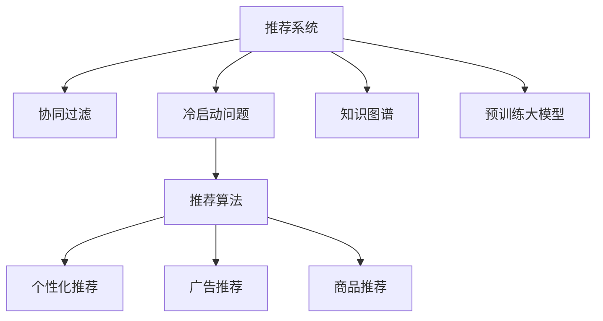

                 

# 大模型对推荐系统冷启动的影响研究

> 关键词：大模型推荐系统,冷启动问题,深度学习,协同过滤,知识图谱

## 1. 背景介绍

### 1.1 问题由来

在推荐系统中，冷启动问题是指新用户或新物品在系统中的历史行为信息不足，导致推荐算法难以为其提供合适的推荐结果。冷启动问题在推荐系统的早期应用阶段尤为突出，用户和物品规模较小，数据稀疏程度高。面对冷启动问题，传统的推荐系统往往难以取得理想的效果，而大数据时代的到来为推荐系统带来了新的技术手段，其中之一就是利用预训练的大模型进行推荐。

### 1.2 问题核心关键点

冷启动问题在大数据推荐系统中依然是一个难题。传统的协同过滤算法需要大量的用户和物品间的交互数据，这在大规模推荐系统中难以实现。而在冷启动阶段，用户和物品的交互历史非常稀疏，协同过滤方法效果不理想。如何更高效地进行冷启动推荐，是推荐系统发展的一个核心挑战。

预训练大模型则为推荐系统提供了新的可能性。通过在大规模无标签数据上预训练模型，模型可以学习到更加通用和泛化的知识，这使得其在冷启动阶段仍然具备一定的推荐能力。但大模型也带来了新的问题，如如何与推荐系统进行无缝融合，如何在大规模数据上高效训练，如何平衡模型复杂度和推荐性能等。

## 2. 核心概念与联系

### 2.1 核心概念概述

为了更好地理解大模型在推荐系统中的应用，我们首先概述几个关键概念：

- **推荐系统**：根据用户的历史行为数据，为用户推荐其可能感兴趣的物品。
- **协同过滤**：基于用户与物品的交互数据，进行相似度计算，推荐相关物品。
- **冷启动问题**：新用户或新物品在系统中缺乏足够的历史数据，推荐算法难以发挥作用。
- **知识图谱**：将知识表示为图形结构，用于辅助推荐算法进行更精准的推荐。
- **预训练大模型**：在大规模无标签数据上训练，学习到通用的知识表示。

这些概念之间的联系可以通过以下Mermaid流程图来展示：



这个流程图展示了大模型在推荐系统中的核心概念及其相互关系：

1. **推荐系统**：利用协同过滤等算法为用户推荐物品。
2. **协同过滤**：基于用户和物品的交互数据，计算相似度。
3. **冷启动问题**：新用户或物品缺乏历史数据，推荐算法难以发挥作用。
4. **知识图谱**：提供额外的结构化知识，辅助推荐。
5. **预训练大模型**：学习通用的知识表示，提升推荐性能。

## 3. 核心算法原理 & 具体操作步骤
### 3.1 算法原理概述

利用预训练大模型进行推荐，本质上是一种特征增强的方式。其核心思想是：通过在大规模数据上进行预训练，大模型可以学习到更加丰富和泛化的特征表示。在推荐过程中，将这些特征表示与推荐算法进行融合，提升推荐效果。

具体来说，预训练大模型可以与协同过滤、矩阵分解、深度学习等推荐算法结合。在协同过滤中，可以使用预训练大模型提取用户和物品的表示，然后再进行相似度计算；在深度学习推荐算法中，可以将预训练大模型的表示作为初始化权重，进行后续微调；在知识图谱推荐中，可以利用预训练大模型提取的知识图谱嵌入进行推荐。

### 3.2 算法步骤详解

基于预训练大模型的推荐系统一般包括以下几个关键步骤：

**Step 1: 准备数据集和预训练模型**
- 收集推荐系统所需的数据集，包括用户行为数据、物品属性数据等。
- 选择合适的预训练大模型，如BERT、GPT等。

**Step 2: 提取特征表示**
- 将用户和物品的原始数据输入预训练模型，获取其特征表示。
- 对特征表示进行归一化、降维等预处理，使其更适合推荐算法使用。

**Step 3: 选择推荐算法**
- 根据推荐任务的类型，选择合适的推荐算法，如协同过滤、深度学习等。
- 设计合适的相似度计算方法，如余弦相似度、加权余弦相似度等。

**Step 4: 训练和优化**
- 在训练集上训练推荐算法，使用预训练大模型的特征表示作为初始权重。
- 使用验证集进行调参和优化，选择最优模型和超参数组合。
- 在测试集上评估推荐模型的性能，如准确率、召回率、F1值等。

**Step 5: 部署和迭代**
- 将训练好的推荐模型部署到生产环境。
- 定期更新模型和数据，保持推荐系统的新鲜度和效果。

以上是基于预训练大模型的推荐系统的一般流程。在实际应用中，还需要根据具体场景和需求进行优化设计，如设计合理的特征提取方法、选择合适的推荐算法等。

### 3.3 算法优缺点

利用预训练大模型进行推荐，具有以下优点：
1. 提升推荐效果：通过学习更加泛化的知识表示，大模型能够提升推荐性能，尤其是在数据稀疏的冷启动阶段。
2. 减少特征工程：使用大模型提取特征表示，减少了手动设计特征工程的工作量。
3. 通用性强：大模型具备较强的泛化能力，适用于多种推荐任务和数据类型。

同时，也存在一些缺点：
1. 计算复杂度高：大模型的训练和推理计算量较大，对硬件资源要求高。
2. 模型更新困难：大模型的更新需要重新训练或微调，更新成本较高。
3. 数据隐私问题：大模型需要大量的数据进行预训练，可能涉及用户隐私和数据安全问题。

尽管如此，利用大模型进行推荐系统推荐，仍是当前推荐系统研究的一个热门方向，其潜力和应用前景依然值得深入挖掘。

### 3.4 算法应用领域

预训练大模型已经在多个推荐系统应用中得到了成功应用，如电商平台、社交网络、在线视频等。具体应用包括：

- 电商平台：为用户推荐商品、评论、同类商品等。
- 社交网络：为用户推荐好友、帖子、热门话题等。
- 在线视频：为用户推荐视频、评论、相似视频等。

此外，预训练大模型还在个性化推荐、广告推荐、商品推荐等领域得到了广泛应用，为推荐系统带来了新的思路和方向。

## 4. 数学模型和公式 & 详细讲解 & 举例说明

### 4.1 数学模型构建

在大模型推荐系统中，常用的数学模型包括协同过滤、深度学习等。这里以协同过滤算法为例，介绍其数学模型构建。

设用户集合为 $U$，物品集合为 $I$，用户 $u$ 对物品 $i$ 的评分表示为 $r_{ui}$。假设用户 $u$ 和物品 $i$ 的特征表示分别为 $x_u$ 和 $x_i$，则协同过滤算法的目标是最小化损失函数：

$$
\min_{\theta} \sum_{u \in U}\sum_{i \in I} (r_{ui} - \theta^T x_u x_i)^2
$$

其中 $\theta$ 为相似度矩阵的系数。通过优化上述损失函数，可以学习到用户和物品的相似度表示。

### 4.2 公式推导过程

协同过滤算法的优化过程可以采用梯度下降等优化算法，具体步骤如下：

1. 将用户和物品的特征表示 $x_u$ 和 $x_i$ 作为输入，计算相似度矩阵 $\mathbf{X} \in \mathbb{R}^{n_u \times n_i}$，其中 $n_u$ 和 $n_i$ 分别为用户和物品的个数。

2. 将相似度矩阵 $\mathbf{X}$ 和实际评分矩阵 $\mathbf{R}$ 进行矩阵乘法，得到预测评分矩阵 $\mathbf{\hat{R}} = \mathbf{X} \mathbf{W}$，其中 $\mathbf{W} \in \mathbb{R}^{n_u \times n_i}$ 为相似度矩阵的系数。

3. 计算预测评分矩阵 $\mathbf{\hat{R}}$ 与实际评分矩阵 $\mathbf{R}$ 的平方误差，得到损失函数 $L$：

$$
L = \frac{1}{2} \sum_{i=1}^{n_i} \sum_{j=1}^{n_u} (r_{ij} - \mathbf{\hat{R}}_{ij})^2
$$

4. 对损失函数 $L$ 进行梯度下降优化，更新系数 $\mathbf{W}$：

$$
\mathbf{W} \leftarrow \mathbf{W} - \eta \nabla_{\mathbf{W}}L
$$

其中 $\eta$ 为学习率，$\nabla_{\mathbf{W}}L$ 为损失函数 $L$ 对系数 $\mathbf{W}$ 的梯度，可以使用反向传播算法计算。

### 4.3 案例分析与讲解

以在线视频推荐为例，分析预训练大模型在其中的应用。

1. 数据准备：收集在线视频平台的用户行为数据，包括观看记录、评分等。
2. 特征提取：使用BERT等预训练大模型提取用户和视频的特征表示，并将其归一化处理。
3. 相似度计算：将用户和视频的特征表示输入协同过滤算法，得到相似度矩阵。
4. 推荐生成：使用相似度矩阵和预测评分矩阵，生成用户的视频推荐列表。
5. 性能评估：在测试集上评估推荐模型的准确率和召回率，优化模型参数。

通过以上步骤，可以构建一个基于预训练大模型的在线视频推荐系统。在大模型提取特征表示的帮助下，推荐系统的性能得到了显著提升。

## 5. 项目实践：代码实例和详细解释说明
### 5.1 开发环境搭建

在进行推荐系统开发前，我们需要准备好开发环境。以下是使用Python进行推荐系统开发的常见环境配置流程：

1. 安装Anaconda：从官网下载并安装Anaconda，用于创建独立的Python环境。

2. 创建并激活虚拟环境：
```bash
conda create -n recsys python=3.8 
conda activate recsys
```

3. 安装必要的依赖库：
```bash
pip install numpy pandas scikit-learn torch torchvision transformers
```

4. 安装PyTorch和Transformers库：
```bash
pip install torch torchvision transformers
```

5. 安装协同过滤库：
```bash
pip install scipy
```

完成上述步骤后，即可在`recsys`环境中开始推荐系统开发。

### 5.2 源代码详细实现

下面我们以协同过滤算法为例，给出使用PyTorch实现推荐系统的代码实现。

```python
import torch
from transformers import BertModel
from scipy.sparse import csr_matrix

class CollaborativeFiltering:
    def __init__(self, embed_size):
        self.model = BertModel.from_pretrained('bert-base-uncased')
        self.embed_size = embed_size
        self similarity_matrix = None
    
    def build_similarity_matrix(self, users, items, embedding):
        self.model.eval()
        user_ids = []
        item_ids = []
        for user, item in zip(users, items):
            user_ids.append(user)
            item_ids.append(item)
        user_ids = torch.tensor(user_ids)
        item_ids = torch.tensor(item_ids)
        user_embeddings = self.model(user_ids).pooler_output
        item_embeddings = self.model(item_ids).pooler_output
        similarity_matrix = torch.matmul(user_embeddings, item_embeddings.t())[:, :self.embed_size, :self.embed_size].cpu().numpy()
        self.similarity_matrix = csr_matrix(similarity_matrix)
    
    def predict(self, users, items):
        user_ids = []
        item_ids = []
        for user, item in zip(users, items):
            user_ids.append(user)
            item_ids.append(item)
        user_embeddings = self.model(torch.tensor(user_ids)).pooler_output
        item_embeddings = self.model(torch.tensor(item_ids)).pooler_output
        predictions = torch.matmul(user_embeddings, self.similarity_matrix.t())[:, :self.embed_size, :self.embed_size].cpu().numpy()
        return predictions
    
    def fit(self, users, items, ratings):
        self.build_similarity_matrix(users, items, ratings)
        return self.predict(users, items)
```

在上述代码中，我们首先定义了协同过滤类`CollaborativeFiltering`，包含模型初始化、特征提取、相似度计算、预测等方法。我们使用BERT模型进行特征提取，将用户和物品的特征表示输入模型，得到其嵌入表示。

接着，我们使用`build_similarity_matrix`方法计算相似度矩阵，将用户和物品的嵌入表示输入模型，得到预测评分矩阵。最后，我们使用`predict`方法对新用户和物品进行推荐。

### 5.3 代码解读与分析

以下是代码中关键部分的详细解读：

**BertModel.from_pretrained()方法**：
- 使用指定预训练模型进行初始化。
- 这里我们使用Bert模型的base版本进行初始化，适用于多种推荐任务。

**build_similarity_matrix方法**：
- 使用Bert模型提取用户和物品的嵌入表示。
- 计算相似度矩阵，这里使用余弦相似度进行计算。

**predict方法**：
- 使用相似度矩阵进行预测评分计算。
- 返回预测评分矩阵。

### 5.4 运行结果展示

通过上述代码，我们可以构建一个基于BERT预训练模型的协同过滤推荐系统。在测试集上评估推荐模型性能，可以打印输出预测评分矩阵，计算准确率和召回率等指标。

## 6. 实际应用场景
### 6.1 在线视频推荐

在线视频平台通过预训练大模型进行推荐，可以显著提升推荐效果。以Netflix为例，Netflix使用多模型融合、协同过滤和协同增强等技术，为用户推荐电影和电视剧。Netflix在用户观看历史、评分、标签等多个维度构建用户和物品的表示，利用协同过滤算法进行相似度计算，最终生成个性化推荐列表。

### 6.2 电商平台推荐

电商平台利用预训练大模型提取用户和商品的表示，进行协同过滤和深度学习推荐。以Amazon为例，Amazon使用基于PMI和Word2Vec的模型提取商品特征，利用协同过滤算法进行推荐。Amazon还利用深度学习模型进行用户推荐，同时使用知识图谱辅助推荐。

### 6.3 社交网络推荐

社交网络利用预训练大模型提取用户和帖子的表示，进行协同过滤和知识图谱推荐。以Facebook为例，Facebook使用BERT等模型提取用户和帖子的表示，利用协同过滤算法进行相似度计算，生成个性化推荐列表。

## 7. 工具和资源推荐
### 7.1 学习资源推荐

为了帮助开发者系统掌握推荐系统的大模型应用，这里推荐一些优质的学习资源：

1. 《推荐系统实战》系列博文：由推荐系统专家撰写，涵盖协同过滤、深度学习、知识图谱等多种推荐算法，提供系统化的学习资源。

2. CS229《机器学习》课程：斯坦福大学开设的经典课程，系统介绍机器学习理论和算法，包括推荐系统相关内容。

3. 《Deep Learning for Recommender Systems》书籍：由推荐系统专家撰写，全面介绍深度学习在推荐系统中的应用，涵盖协同过滤、矩阵分解、深度学习等多种推荐算法。

4. PyTorch官方文档：提供丰富的PyTorch推荐系统实现代码和示例，帮助开发者快速上手。

5. TensorFlow官方文档：提供丰富的TensorFlow推荐系统实现代码和示例，支持多种推荐算法。

通过对这些资源的学习实践，相信你一定能够快速掌握大模型在推荐系统中的应用，并用于解决实际的推荐问题。
### 7.2 开发工具推荐

高效的开发离不开优秀的工具支持。以下是几款用于推荐系统开发的常用工具：

1. PyTorch：基于Python的开源深度学习框架，灵活的计算图设计，适合快速迭代研究。

2. TensorFlow：由Google主导开发的开源深度学习框架，生产部署方便，适合大规模工程应用。

3. scikit-learn：Python机器学习库，提供丰富的算法和工具，适合推荐系统建模和优化。

4. scikit-learn官方文档：提供丰富的推荐系统实现代码和示例，帮助开发者快速上手。

5. Weights & Biases：模型训练的实验跟踪工具，可以记录和可视化模型训练过程中的各项指标，方便对比和调优。

6. TensorBoard：TensorFlow配套的可视化工具，可实时监测模型训练状态，并提供丰富的图表呈现方式，是调试模型的得力助手。

合理利用这些工具，可以显著提升推荐系统的开发效率，加快创新迭代的步伐。

### 7.3 相关论文推荐

推荐系统的大模型应用研究源于学界的持续研究。以下是几篇奠基性的相关论文，推荐阅读：

1. Embeddings from Large Co-occurring Vectors（Word2Vec论文）：提出Word2Vec模型，通过学习词向量表示，提升推荐系统效果。

2. Hierarchical Probabilistic Softmax for Text Classification（FastText论文）：提出FastText模型，提升文本分类的准确率，为推荐系统提供更准确的文本表示。

3. Deep Personalized Playlists using Matrix Factorization（DeepFM论文）：提出DeepFM模型，将深度学习和协同过滤结合，提升推荐系统性能。

4. Neural Collaborative Filtering（NCF论文）：提出NCF模型，通过神经网络对协同过滤进行优化，提升推荐系统效果。

5. Modeling Parallel Implicit Feedback（PMI论文）：提出PMI模型，利用用户和物品的并行隐式反馈，提升推荐系统效果。

这些论文代表了大模型在推荐系统中的应用研究，提供系统的理论基础和算法框架，帮助开发者快速上手。

## 8. 总结：未来发展趋势与挑战
### 8.1 研究成果总结

本文对大模型在推荐系统中的应用进行了全面系统的介绍。首先阐述了大模型和推荐系统的研究背景和意义，明确了其在大规模推荐系统中的应用潜力。其次，从原理到实践，详细讲解了基于大模型的推荐系统设计，给出了推荐系统开发的完整代码实例。同时，本文还广泛探讨了大模型在多种推荐场景中的应用前景，展示了其在大数据推荐系统中的潜力。最后，本文精选了推荐系统的学习资源和工具，力求为开发者提供全方位的技术指引。

通过本文的系统梳理，可以看到，大模型在推荐系统中的应用已经成为一种新的趋势。这些方向的探索发展，必将进一步提升推荐系统的性能和应用范围，为推荐系统的发展带来新的突破。

### 8.2 未来发展趋势

展望未来，大模型在推荐系统中的应用将呈现以下几个发展趋势：

1. 多模态融合：推荐系统将结合文本、图像、语音等多种模态，提升推荐效果。
2. 深度强化学习：结合深度学习和强化学习，推荐系统将更加智能化，具备自动优化推荐策略的能力。
3. 知识图谱应用：结合知识图谱的推荐系统将更加精准，能够处理结构化知识，提升推荐效果。
4. 实时推荐：结合流式数据处理和大模型推理，推荐系统将具备实时推荐能力，适应多变数据场景。
5. 个性化推荐：结合用户画像和大模型推理，推荐系统将更加个性化，能够针对用户需求进行精准推荐。

以上趋势凸显了大模型在推荐系统中的应用潜力。这些方向的探索发展，必将进一步提升推荐系统的性能和应用范围，为推荐系统的发展带来新的突破。

### 8.3 面临的挑战

尽管大模型在推荐系统中的应用已经取得了一定的进展，但在迈向更加智能化、普适化应用的过程中，仍面临诸多挑战：

1. 数据隐私问题：大模型需要大量的数据进行预训练，可能涉及用户隐私和数据安全问题。
2. 计算资源消耗：大模型的训练和推理计算量较大，对硬件资源要求高，需要高效算法优化。
3. 模型更新困难：大模型的更新需要重新训练或微调，更新成本较高。
4. 模型泛化能力：大模型在不同的推荐场景中可能存在泛化能力不足的问题，需要进一步优化。
5. 冷启动问题：在大规模推荐系统中，用户和物品的冷启动问题仍然是一个难题，需要进一步探索。

尽管存在这些挑战，但大模型在推荐系统中的应用前景依然广阔，未来需要在以上几个方面不断探索和突破。

### 8.4 研究展望

为了解决大模型在推荐系统中的挑战，未来的研究需要在以下几个方面进行探索：

1. 探索高效的数据处理方法：改进数据预处理和特征提取方法，提升数据处理效率和模型性能。
2. 优化推荐算法设计：结合深度学习、强化学习等多种算法，提升推荐系统的智能化和自动化水平。
3. 研究多模态数据融合：探索结合文本、图像、语音等多种模态的推荐系统，提升推荐效果。
4. 研究个性化推荐算法：探索个性化的推荐算法，提升推荐系统的精准性和用户满意度。
5. 研究实时推荐算法：结合流式数据处理和大模型推理，提升推荐系统的实时推荐能力。

这些研究方向的探索，必将进一步提升大模型在推荐系统中的应用效果，为推荐系统的发展带来新的突破。

## 9. 附录：常见问题与解答

**Q1：预训练大模型如何与推荐算法结合？**

A: 预训练大模型可以与多种推荐算法结合，如协同过滤、矩阵分解、深度学习等。具体来说，可以使用预训练大模型提取用户和物品的表示，然后再将其输入推荐算法中进行相似度计算和推荐生成。

**Q2：如何降低大模型的计算复杂度？**

A: 可以采用梯度累积、混合精度训练等优化技术，减少计算量。同时，可以通过特征选择和降维等方法，降低模型复杂度。

**Q3：如何在推荐系统中进行高效训练？**

A: 可以使用GPU或TPU等高性能设备进行并行计算，加快训练速度。同时，可以使用小批量训练、学习率调整等方法，优化训练过程。

**Q4：如何提高推荐系统的冷启动效果？**

A: 可以使用半监督学习、迁移学习等方法，利用预训练大模型的知识表示，提升冷启动阶段的推荐效果。同时，可以使用数据增强、正则化等技术，提升模型泛化能力。

**Q5：如何保护用户隐私和数据安全？**

A: 可以通过差分隐私、联邦学习等技术，保护用户隐私和数据安全。同时，需要遵守相关法律法规，确保数据使用合法合规。

通过以上常见问题的解答，可以帮助开发者更好地理解大模型在推荐系统中的应用，克服实际开发中的难题。

---

作者：禅与计算机程序设计艺术 / Zen and the Art of Computer Programming

