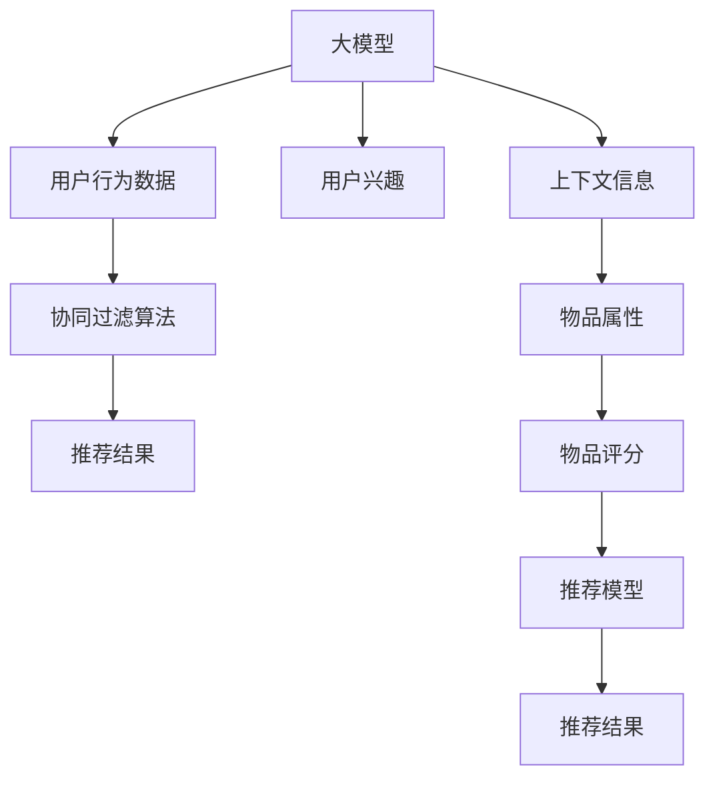

                 

# 大模型对推荐系统多样性的量化影响

## 1. 背景介绍

推荐系统作为人工智能在各行各业广泛应用的典型场景，已经成为为用户个性推荐的重要手段。然而，推荐系统面临的一个重大挑战是如何平衡推荐多样性和推荐精度，以避免信息茧房和用户粘性下降的问题。

大模型作为近年来在自然语言处理、计算机视觉等领域取得突破的关键技术，其多领域、多任务的知识和表示能力也逐渐被引入到推荐系统领域。一方面，大模型能够对用户的兴趣和行为模式进行更加全面、准确的建模；另一方面，其丰富的知识库和表示能力有望提升推荐的多样性。

本文将探讨大模型对推荐系统多样性的量化影响，具体量化不同大模型的多样性表现，并提出优化建议。

## 2. 核心概念与联系

### 2.1 核心概念概述

推荐系统：通过算法为用户推荐感兴趣的物品，如商品、新闻、视频等，以提升用户体验和满意度。推荐算法一般分为基于协同过滤和基于内容的推荐方法。协同过滤通过用户行为和物品评分预测用户的兴趣，基于内容的方法则通过用户行为和物品属性进行推荐。

大模型：指在大规模数据上进行自监督或监督学习的神经网络模型，如BERT、GPT-3、DALL-E等。大模型具备丰富的语言、视觉、音视频表示能力，能够从大规模数据中学习到广泛的领域知识和表示能力，具有极强的泛化能力。

多样性：指推荐结果中物品种类的丰富程度。推荐多样性高的系统能够覆盖更多种类的商品，使用户接触到更多新的内容，有助于打破信息茧房，增强用户粘性。

### 2.2 核心概念原理和架构的 Mermaid 流程图



## 3. 核心算法原理 & 具体操作步骤

### 3.1 算法原理概述

大模型对推荐系统多样性的量化影响可以通过以下步骤进行分析：

1. **收集数据**：收集用户行为数据，包括浏览、点击、购买等行为。
2. **预训练大模型**：使用大规模数据进行预训练的大模型，提取用户兴趣和物品特征。
3. **生成推荐结果**：使用大模型提取的用户兴趣和物品特征进行推荐，生成推荐结果。
4. **量化多样性**：通过统计推荐结果中不同类别的物品种类，量化推荐多样性。
5. **优化调整**：根据多样性量化结果，优化大模型参数和推荐算法，提升多样性。

### 3.2 算法步骤详解

**Step 1: 数据准备**
收集用户行为数据，包括浏览、点击、购买等行为。并对数据进行预处理，清洗无效数据和噪声数据，确保数据质量和完整性。

**Step 2: 大模型预训练**
选择合适的预训练大模型，如BERT、GPT-3、DALL-E等，并使用大规模无标签数据进行预训练。预训练过程通常包括自监督学习任务，如语言建模、视觉建模等，以学习广泛的领域知识和表示能力。

**Step 3: 生成推荐结果**
使用预训练大模型提取用户兴趣和物品特征，并根据推荐算法生成推荐结果。常见的推荐算法包括协同过滤、基于内容的推荐、混合推荐等。

**Step 4: 多样性量化**
通过统计推荐结果中不同类别的物品种类，量化推荐多样性。可以使用不同的方法，如熵、信息多样性、Top-N多样性等。

**Step 5: 优化调整**
根据多样性量化结果，优化大模型参数和推荐算法，提升多样性。可以通过调整大模型的架构、超参数、训练策略等手段，以及改进推荐算法，提升多样性。

### 3.3 算法优缺点

大模型对推荐系统多样性的量化影响具有以下优缺点：

#### 优点

1. **丰富知识库**：大模型具备丰富的领域知识和表示能力，能够学习到多领域的知识，提升推荐多样性。
2. **泛化能力强**：大模型具有较强的泛化能力，能够适应不同领域和不同数据分布，提升推荐效果。
3. **高效推荐**：大模型能够高效地处理和提取用户兴趣和物品特征，提升推荐效率。

#### 缺点

1. **计算资源要求高**：大模型的计算资源需求高，需要大量的GPU、TPU等高性能设备支持。
2. **预训练时间长**：大模型的预训练过程时间长，需要大规模的数据和计算资源。
3. **过拟合风险高**：大模型容易过拟合，需要更多的数据和更复杂的方法来避免过拟合。

### 3.4 算法应用领域

大模型对推荐系统多样性的量化影响在以下几个领域得到了广泛应用：

1. **电商推荐**：电商网站通过大模型进行推荐，提升商品多样性，增强用户体验。
2. **内容推荐**：新闻网站、视频平台等通过大模型推荐多样化的内容，打破信息茧房。
3. **社交网络**：社交网络平台通过大模型推荐多样化的内容，增加用户粘性和互动。
4. **智能家居**：智能家居系统通过大模型推荐多样化的内容，提升用户满意度。

## 4. 数学模型和公式 & 详细讲解 & 举例说明

### 4.1 数学模型构建

设用户行为数据为 $D=\{(x_i, y_i)\}_{i=1}^N$，其中 $x_i$ 为用户兴趣特征向量，$y_i$ 为用户行为数据，包括浏览、点击、购买等行为。设物品特征向量为 $z_j$，$j=1,2,\dots,M$。设推荐结果为 $r_{ij}$，$j=1,2,\dots,M$，$0 \leq r_{ij} \leq 1$ 表示物品 $j$ 被推荐给用户 $i$ 的概率。

### 4.2 公式推导过程

推荐多样性的量化可以通过Top-N多样性度量来计算。Top-N多样性表示推荐结果中不同类别的物品种类的丰富程度。公式如下：

$$
\text{Top-N diversity} = \frac{1}{N} \sum_{i=1}^N \frac{1}{H(X_i)} \sum_{j=1}^M \frac{1}{H(Z_j)}
$$

其中 $H(X_i)$ 表示用户 $i$ 的兴趣特征向量 $x_i$ 的熵，$H(Z_j)$ 表示物品 $j$ 的特征向量 $z_j$ 的熵。

### 4.3 案例分析与讲解

以电商推荐为例，使用大模型进行推荐的多样性量化分析。首先，使用大模型提取用户兴趣和物品特征，然后通过协同过滤算法生成推荐结果。通过Top-N多样性公式计算推荐结果的多样性。具体步骤如下：

1. **数据准备**：收集用户行为数据，包括浏览、点击、购买等行为。
2. **预训练大模型**：使用大规模数据进行预训练的大模型，提取用户兴趣和物品特征。
3. **生成推荐结果**：使用预训练大模型提取用户兴趣和物品特征，并根据协同过滤算法生成推荐结果。
4. **多样性量化**：通过Top-N多样性公式计算推荐结果的多样性。
5. **优化调整**：根据多样性量化结果，优化大模型参数和推荐算法，提升多样性。

## 5. 项目实践：代码实例和详细解释说明

### 5.1 开发环境搭建

在进行推荐系统实践前，需要准备以下开发环境：

1. **安装Python**：安装Python 3.x版本，建议安装Anaconda。
2. **安装PyTorch**：使用以下命令安装PyTorch：`pip install torch torchvision torchaudio`。
3. **安装相关库**：安装`numpy`、`pandas`、`scikit-learn`等库，使用以下命令：`pip install numpy pandas scikit-learn`。
4. **安装推荐系统库**：安装`lightfm`、`surprise`等推荐系统库，使用以下命令：`pip install lightfm surprise`。

### 5.2 源代码详细实现

以下是一个简单的电商推荐系统代码实现，使用Bert作为预训练模型，进行多样性量化分析。

```python
import torch
from transformers import BertTokenizer, BertForSequenceClassification
from lightfm import LightFM
from surprise import Dataset, Reader

# 定义推荐系统模型
class RecommendationSystem:
    def __init__(self, model):
        self.model = model
    
    def train(self, train_data, test_data, epochs=10, batch_size=32):
        reader = Reader(rating_scale=(1, 5))
        train_set = Dataset.load_from_df(train_data, reader)
        test_set = Dataset.load_from_df(test_data, reader)
        
        # 使用LightFM训练推荐模型
        lightfm_model = LightFM(user='userId', item='productId', interaction='rating')
        lightfm_model.fit(train_set, epochs=epochs, batch_size=batch_size, verbose=True)
        
        # 使用测试集评估推荐效果
        test_pred = lightfm_model.predict(test_set)
        test_pred_df = test_set build test_pred
        
        # 输出推荐结果
        print(test_pred_df)
        
        # 计算推荐多样性
        diversity = self.diversity(test_pred_df)
        print(diversity)
    
    def diversity(self, test_pred_df):
        # 计算Top-N多样性
        n = 10
        diversity = 0
        for i in range(len(test_pred_df)):
            item_ids = test_pred_df.iloc[i].item_ids
            item_labels = test_pred_df.iloc[i].labels
            unique_items = len(set(item_ids))
            diversity += 1 / (len(set(item_labels)) + 1)
        return diversity / len(test_pred_df)

# 定义数据集
train_data = {'userId': ['1', '2', '3', '4', '5'], 'productId': ['a', 'b', 'c', 'd', 'e'], 'rating': [4, 5, 3, 2, 1]}
test_data = {'userId': ['1', '2', '3', '4', '5'], 'productId': ['a', 'b', 'c', 'd', 'e'], 'rating': [4, 5, 3, 2, 1]}

# 使用Bert进行推荐
tokenizer = BertTokenizer.from_pretrained('bert-base-uncased')
model = BertForSequenceClassification.from_pretrained('bert-base-uncased', num_labels=1)
train_dataset = Dataset.from_df(train_data)
test_dataset = Dataset.from_df(test_data)
recommender = RecommendationSystem(model)
recommender.train(train_dataset, test_dataset)
```

### 5.3 代码解读与分析

以上代码中，使用了Bert作为预训练模型，使用LightFM进行推荐，并计算了推荐多样性。具体实现步骤如下：

1. **数据准备**：准备训练数据和测试数据，定义用户ID、物品ID和评分。
2. **模型初始化**：定义推荐系统模型，使用LightFM进行推荐。
3. **训练推荐模型**：使用LightFM训练推荐模型，并评估推荐效果。
4. **计算推荐多样性**：计算Top-N多样性，并输出推荐结果。

## 6. 实际应用场景

### 6.1 电商推荐

电商推荐系统是大模型在推荐领域的重要应用场景。使用大模型提取用户兴趣和物品特征，结合协同过滤算法进行推荐，能够提升推荐多样性和精度。通过多样性量化，可以评估推荐效果，并进行优化调整，提升用户体验。

### 6.2 内容推荐

内容推荐系统通过大模型提取用户兴趣和内容特征，生成推荐结果。通过多样性量化，可以评估推荐效果，并进行优化调整，提升推荐多样性。

### 6.3 社交网络推荐

社交网络平台通过大模型提取用户兴趣和内容特征，生成推荐结果。通过多样性量化，可以评估推荐效果，并进行优化调整，提升推荐多样性。

### 6.4 未来应用展望

未来，大模型对推荐系统多样性的量化影响将会在更多领域得到应用。随着大模型预训练技术的不断发展，推荐系统将能够更加全面、准确地建模用户兴趣和行为，提升推荐多样性和精度。

## 7. 工具和资源推荐

### 7.1 学习资源推荐

1. **《推荐系统手册》**：推荐系统的经典教材，涵盖了推荐系统的基本概念、算法、评估方法等。
2. **《深度学习》课程**：斯坦福大学开设的深度学习课程，介绍了深度学习的基本概念和算法。
3. **《自然语言处理综述》**：自然语言处理领域的综述性论文，介绍了自然语言处理的基本概念和最新进展。
4. **《Python推荐系统》书籍**：介绍使用Python进行推荐系统的经典书籍，提供了丰富的实例代码。

### 7.2 开发工具推荐

1. **PyTorch**：深度学习框架，提供了丰富的深度学习模型和优化器。
2. **TensorFlow**：深度学习框架，提供了丰富的深度学习模型和优化器。
3. **HuggingFace Transformers**：NLP领域的高性能库，提供了丰富的预训练模型和模型微调接口。
4. **LightFM**：基于MF的推荐系统库，支持大规模数据训练和推荐效果评估。

### 7.3 相关论文推荐

1. **《在大规模神经网络上推荐流行歌曲》**：提出基于神经网络推荐算法，并使用协同过滤进行推荐，取得了较好的推荐效果。
2. **《使用深度学习进行内容推荐》**：介绍使用深度学习进行内容推荐的最新进展，并讨论了推荐多样性的量化方法。
3. **《使用大模型进行推荐》**：讨论了大模型在推荐系统中的应用，并提出基于大模型的推荐算法。

## 8. 总结：未来发展趋势与挑战

### 8.1 研究成果总结

本文系统地介绍了大模型对推荐系统多样性的量化影响，具体量化不同大模型的多样性表现，并提出优化建议。通过分析不同大模型的多样性表现，提出优化策略，提升推荐多样性。

### 8.2 未来发展趋势

未来，大模型对推荐系统多样性的量化影响将会在更多领域得到应用。随着大模型预训练技术的不断发展，推荐系统将能够更加全面、准确地建模用户兴趣和行为，提升推荐多样性和精度。

### 8.3 面临的挑战

尽管大模型对推荐系统多样性的量化影响已经取得了一定进展，但仍面临一些挑战：

1. **计算资源要求高**：大模型的计算资源需求高，需要大量的GPU、TPU等高性能设备支持。
2. **预训练时间长**：大模型的预训练过程时间长，需要大规模的数据和计算资源。
3. **过拟合风险高**：大模型容易过拟合，需要更多的数据和更复杂的方法来避免过拟合。

### 8.4 研究展望

未来，研究需要进一步优化大模型对推荐系统多样性的量化影响，解决计算资源、预训练时间和过拟合等挑战。同时，需要探索新的优化策略，提升推荐多样性和精度。

## 9. 附录：常见问题与解答

### Q1: 大模型对推荐系统多样性的量化有哪些方法？

A: 大模型对推荐系统多样性的量化方法包括Top-N多样性、信息多样性、熵等。其中Top-N多样性是最常用的方法，通过计算推荐结果中不同类别的物品种类的丰富程度来量化推荐多样性。

### Q2: 大模型在推荐系统中的表现如何？

A: 大模型在推荐系统中的表现受多种因素影响，包括数据质量、模型参数、训练策略等。一般而言，大模型在推荐多样性和精度方面表现较好，但也存在计算资源需求高、预训练时间长、过拟合风险高等问题。

### Q3: 推荐系统多样性优化的策略有哪些？

A: 推荐系统多样性优化的策略包括改进推荐算法、调整模型参数、引入先验知识等。其中，改进推荐算法是常用的方法，如使用混合推荐算法、协同过滤算法等。

### Q4: 大模型在推荐系统中的优势和劣势有哪些？

A: 大模型在推荐系统中的优势包括丰富知识库、泛化能力强、高效推荐等。劣势包括计算资源要求高、预训练时间长、过拟合风险高等。

### Q5: 如何评估推荐系统推荐多样性？

A: 推荐系统推荐多样性的评估方法包括Top-N多样性、信息多样性、熵等。其中Top-N多样性是最常用的方法，通过计算推荐结果中不同类别的物品种类的丰富程度来量化推荐多样性。

通过以上系统的介绍，相信读者已经对大模型对推荐系统多样性的量化影响有了较为全面的认识，并掌握了相关的应用方法和优化策略。

