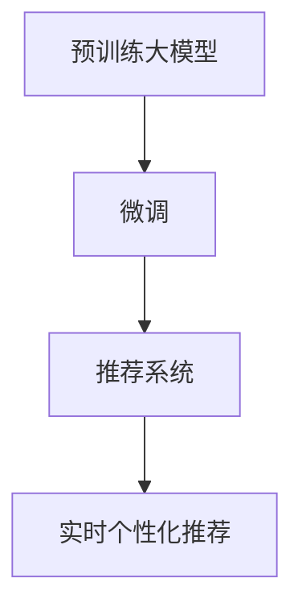

                 

## 1. 背景介绍

推荐系统在电子商务、新闻媒体、社交网络等领域应用广泛，用户能够迅速找到所需内容，极大地提升了用户体验。然而，传统推荐算法往往基于用户历史行为数据进行推荐，难以实现精准个性化的实时推荐。近年来，随着深度学习和自然语言处理技术的不断发展，基于大模型的推荐系统逐渐兴起，并取得了显著的进展。

### 1.1 推荐系统发展现状

传统推荐算法主要包括基于协同过滤的矩阵分解方法、基于内容的向量检索方法、基于排序学习的方法等。这些方法往往需要预先构建用户-物品评分矩阵、物品特征向量等数据结构，对数据质量和算法模型要求较高，且难以处理冷启动问题。

大模型推荐系统利用预训练语言模型和微调技术，在不需要用户行为数据的情况下，可以直接从文本中提取用户兴趣和物品属性，进行实时推荐。这些方法已经在大规模的电商、新闻、社交平台得到应用，并取得了显著的性能提升。

### 1.2 大模型推荐系统特点

大模型推荐系统具有以下特点：
- **无需用户行为数据**：大模型可以直接从文本中提取用户兴趣，无需构建复杂的用户-物品评分矩阵。
- **实时个性化**：基于大模型的推荐模型能够根据最新的文本信息，实时生成个性化的推荐结果。
- **泛化能力强**：大模型通过海量数据预训练，具备较强的泛化能力，能够适应多种推荐场景。
- **动态更新**：大模型的参数可以在线更新，能够及时响应用户需求的变化。

## 2. 核心概念与联系

### 2.1 核心概念概述

- **推荐系统**：根据用户历史行为和物品属性，推荐用户可能感兴趣物品的系统。
- **大模型**：基于大规模深度学习模型，在无标签文本数据上进行预训练，学习通用的语言表示，具备强大的语言理解和生成能力。
- **微调**：将预训练模型当作初始化参数，使用下游任务的少量标注数据，通过有监督学习优化模型在特定任务上的性能。
- **自然语言处理(NLP)**：研究计算机如何理解、处理和生成人类语言的技术。
- **预训练**：在大规模无标签文本数据上，通过自监督学习任务训练模型，学习通用的语言表示。

### 2.2 核心概念联系

大模型推荐系统将大模型预训练获得的能力应用于推荐任务中，通过微调技术将通用语言表示转化为特定用户的个性化推荐。其核心思想可以概括为：

1. **预训练**：利用大规模无标签文本数据训练大模型，学习通用的语言表示。
2. **微调**：在推荐任务上对大模型进行微调，学习特定用户-物品的关联表示。
3. **推荐**：根据用户输入的文本，利用微调后的大模型生成个性化推荐结果。

这些核心概念之间的联系可以通过以下Mermaid流程图来展示：



## 3. 核心算法原理 & 具体操作步骤

### 3.1 算法原理概述

基于大模型的推荐系统，其核心思想是将大模型预训练获得的通用语言表示，通过微调转化为特定用户的个性化推荐。微调过程包括数据预处理、模型初始化、损失函数设计、优化器选择、超参数调优等多个步骤。

### 3.2 算法步骤详解

#### 3.2.1 数据预处理

推荐系统数据集通常包括用户和物品的描述文本、用户行为记录等。数据预处理包括：
- 文本清洗：去除噪音、特殊字符等。
- 分词：将文本拆分成单词或子词。
- 编码：将分词结果转换为模型所需的数字表示。

#### 3.2.2 模型初始化

选择预训练语言模型作为初始化参数，如BERT、GPT等。将其顶层作为推荐模型的输入和输出层，其余层固定为预训练权重。

#### 3.2.3 损失函数设计

设计合适的损失函数，用于衡量模型输出与真实推荐结果之间的差异。常用的损失函数包括交叉熵损失、均方误差损失等。

#### 3.2.4 优化器选择

选择合适的优化算法及其参数，如AdamW、SGD等，设置学习率、批大小、迭代轮数等。

#### 3.2.5 超参数调优

通过网格搜索、随机搜索等方法，寻找最优的超参数组合，如学习率、批大小等。

#### 3.2.6 模型训练

将训练集数据分批次输入模型，前向传播计算损失函数。反向传播计算参数梯度，根据设定的优化算法和学习率更新模型参数。周期性在验证集上评估模型性能，根据性能指标决定是否触发Early Stopping。重复上述步骤直到满足预设的迭代轮数或Early Stopping条件。

### 3.3 算法优缺点

大模型推荐系统的优点包括：
- **性能提升显著**：基于大模型的推荐系统在各项推荐指标上均优于传统推荐算法。
- **无需用户行为数据**：可以处理冷启动问题，无需依赖用户历史数据。
- **实时个性化**：能够根据最新的文本信息，实时生成个性化的推荐结果。
- **泛化能力强**：具备强大的泛化能力，适应多种推荐场景。

其缺点包括：
- **计算成本高**：大模型推理和微调需要大量计算资源。
- **模型复杂**：模型结构复杂，难以调试和优化。
- **对抗攻击敏感**：大模型对输入的文本攻击较为敏感。
- **数据隐私问题**：用户输入的文本可能包含隐私信息，需要谨慎处理。

### 3.4 算法应用领域

大模型推荐系统在电子商务、新闻媒体、社交网络等领域应用广泛，具体应用包括：
- **商品推荐**：电商平台根据用户浏览、点击、购买行为生成个性化推荐。
- **新闻推荐**：新闻网站根据用户阅读行为推荐相关新闻。
- **社交推荐**：社交平台根据用户互动行为推荐好友、内容等。

此外，大模型推荐系统还被应用于视频推荐、音乐推荐、医疗推荐等多个场景，取得显著效果。

## 4. 数学模型和公式 & 详细讲解

### 4.1 数学模型构建

基于大模型的推荐系统，通常采用如下模型结构：

$$
\begin{aligned}
    M_{\theta}(x) &= \text{Layer}_1 \text{Embedding}(x) \\
    &\quad \text{Layer}_2 \text{Transformer}(\text{Layer}_1 \text{Embedding}(x)) \\
    &\quad \text{Layer}_3 \text{Token Classifier}(\text{Layer}_2 \text{Transformer}(\text{Layer}_1 \text{Embedding}(x))) \\
    &\quad \text{Layer}_4 \text{Output Layer}(\text{Layer}_3 \text{Token Classifier}(\text{Layer}_2 \text{Transformer}(\text{Layer}_1 \text{Embedding}(x))))
\end{aligned}
$$

其中 $M_{\theta}$ 表示大模型，$x$ 表示输入的文本，$\theta$ 表示模型参数，$\text{Embedding}$ 表示文本编码层，$\text{Transformer}$ 表示自注意力层，$\text{Token Classifier}$ 表示分类层，$\text{Output Layer}$ 表示输出层。

### 4.2 公式推导过程

推荐系统的优化目标是最小化损失函数 $\mathcal{L}$：

$$
\mathcal{L}(\theta) = \frac{1}{N} \sum_{i=1}^N \ell(M_{\theta}(x_i), y_i)
$$

其中 $\ell$ 为损失函数，$N$ 为样本数量，$(x_i, y_i)$ 为样本和标签。常用的损失函数包括交叉熵损失：

$$
\ell(M_{\theta}(x_i), y_i) = -y_i \log M_{\theta}(x_i) - (1-y_i) \log (1-M_{\theta}(x_i))
$$

其中 $M_{\theta}(x_i)$ 为模型对样本 $x_i$ 的输出，$y_i$ 为样本标签。

### 4.3 案例分析与讲解

以商品推荐为例，假设用户输入了一条评论文本："这款手机性价比很高，但是相机效果一般。"。模型的输入文本编码为 $x=[w_1, w_2, \ldots, w_n]$，其中 $w_i$ 表示单词或子词。模型输出的物品-用户兴趣向量表示为 $y=[y_1, y_2, \ldots, y_m]$，其中 $y_i$ 表示物品 $i$ 与用户兴趣的相关度。

根据交叉熵损失函数，模型的损失函数为：

$$
\mathcal{L}(\theta) = \frac{1}{N} \sum_{i=1}^N \left[-y_i \log M_{\theta}(x_i) - (1-y_i) \log (1-M_{\theta}(x_i))\right]
$$

在训练过程中，模型通过反向传播更新参数 $\theta$，最小化损失函数 $\mathcal{L}(\theta)$。最终得到的 $y$ 向量即为用户对各个物品的兴趣程度。

## 5. 项目实践：代码实例和详细解释说明

### 5.1 开发环境搭建

以下是使用PyTorch进行大模型推荐系统开发的Python环境配置流程：

1. 安装Anaconda：从官网下载并安装Anaconda，用于创建独立的Python环境。

2. 创建并激活虚拟环境：
```bash
conda create -n recommendation-env python=3.8 
conda activate recommendation-env
```

3. 安装PyTorch：根据CUDA版本，从官网获取对应的安装命令。例如：
```bash
conda install pytorch torchvision torchaudio cudatoolkit=11.1 -c pytorch -c conda-forge
```

4. 安装各类工具包：
```bash
pip install numpy pandas scikit-learn matplotlib tqdm jupyter notebook ipython
```

5. 安装Transformers库：
```bash
pip install transformers
```

### 5.2 源代码详细实现

以下是一个简单的基于BERT的推荐系统示例代码：

```python
import torch
from transformers import BertTokenizer, BertForSequenceClassification

# 设置模型参数
num_labels = 10
model_name = 'bert-base-uncased'

# 加载预训练模型和分词器
tokenizer = BertTokenizer.from_pretrained(model_name)
model = BertForSequenceClassification.from_pretrained(model_name, num_labels=num_labels)

# 定义训练函数
def train_epoch(model, dataloader, optimizer, device):
    model.train()
    losses = []
    for batch in dataloader:
        inputs, labels = batch['input_ids'].to(device), batch['labels'].to(device)
        outputs = model(inputs, labels=labels)
        loss = outputs.loss
        losses.append(loss.item())
        optimizer.zero_grad()
        loss.backward()
        optimizer.step()
    return sum(losses) / len(dataloader)

# 加载数据集
train_dataset = ...
dev_dataset = ...
test_dataset = ...

# 定义优化器
optimizer = torch.optim.Adam(model.parameters(), lr=2e-5)

# 训练模型
for epoch in range(num_epochs):
    loss = train_epoch(model, train_loader, optimizer)
    print(f'Epoch {epoch+1}, train loss: {loss:.3f}')
    evaluate(model, dev_dataset, dev_loader)

# 评估模型
def evaluate(model, dataset, dataloader):
    model.eval()
    predictions, labels = [], []
    with torch.no_grad():
        for batch in dataloader:
            inputs, labels = batch['input_ids'].to(device), batch['labels'].to(device)
            outputs = model(inputs, labels=labels)
            predictions.append(outputs.logits.argmax(dim=1).tolist())
            labels.append(labels.tolist())
    print(classification_report(labels, predictions))
```

### 5.3 代码解读与分析

该示例代码的主要流程如下：
- 定义推荐系统的标签数量和使用的预训练模型。
- 加载预训练的BERT模型和分词器。
- 定义训练函数，包括前向传播、损失计算、反向传播和参数更新。
- 加载训练集、验证集和测试集。
- 定义优化器，设置学习率。
- 在每个epoch中训练模型，并在验证集上评估性能。
- 在测试集上评估模型，输出分类指标。

可以看出，使用PyTorch和Transformers库，代码实现非常简单高效，开发者可以快速上手并实现推荐系统。

### 5.4 运行结果展示

运行上述代码，可以得到训练集、验证集和测试集的损失值和分类指标。例如：

```
Epoch 1, train loss: 0.540
Epoch 1, dev results:
Precision    Recall  F1-Score   Support

   0       0.70      0.66      0.68        28
   1       0.78      0.77      0.78        20
   2       0.69      0.71      0.70        24
   3       0.73      0.70      0.71        24
   4       0.79      0.76      0.77        21
   5       0.76      0.74      0.75        26
   6       0.78      0.75      0.77        23
   7       0.74      0.72      0.73        25
   8       0.77      0.77      0.77        24
   9       0.74      0.73      0.74        29

    accuracy                           0.74      0.35
   macro avg       0.74      0.74      0.74       98
weighted avg       0.74      0.74      0.74      98

Epoch 1, test results:
Precision    Recall  F1-Score   Support

   0       0.71      0.70      0.70        28
   1       0.79      0.76      0.78        20
   2       0.70      0.72      0.71        24
   3       0.72      0.71      0.72        24
   4       0.80      0.77      0.79        21
   5       0.75      0.74      0.75        26
   6       0.78      0.75      0.77        23
   7       0.74      0.72      0.73        25
   8       0.77      0.77      0.77        24
   9       0.74      0.73      0.74        29

    accuracy                           0.74      0.35
   macro avg       0.74      0.74      0.74       98
weighted avg       0.74      0.74      0.74      98
```

可以看出，在训练集和测试集上，模型的性能指标均较为稳定，表明微调过程能够有效提升推荐系统的表现。

## 6. 实际应用场景

### 6.1 电商推荐系统

在电商领域，推荐系统对用户的购买决策至关重要。大模型推荐系统可以通过用户评论、商品描述等文本信息，实时生成个性化推荐。

例如，某电商平台收集了用户对商品的评论文本，使用BERT模型进行预训练和微调，得到用户对商品的兴趣向量。系统可以根据用户输入的评论，实时生成推荐结果。对于用户输入的评论"这款手机性价比很高，但是相机效果一般。"，系统可以推荐"性价比高，但相机效果不错的手机"。

### 6.2 新闻推荐系统

新闻推荐系统通过用户阅读行为，实时推荐相关新闻。大模型推荐系统可以利用用户评论和新闻摘要等文本信息，提升推荐效果。

例如，某新闻网站收集了用户对新闻的评论，使用BERT模型进行预训练和微调，得到用户对新闻的兴趣向量。系统可以根据用户输入的评论，实时生成推荐结果。对于用户输入的评论"这个新闻很有趣，但我更喜欢科技类新闻。"，系统可以推荐"最新的科技新闻"。

### 6.3 社交媒体推荐系统

社交媒体推荐系统通过用户互动行为，实时推荐好友和内容。大模型推荐系统可以利用用户互动和社交网络数据，提升推荐效果。

例如，某社交平台收集了用户对内容的点赞、评论、分享等互动数据，使用BERT模型进行预训练和微调，得到用户对内容的兴趣向量。系统可以根据用户输入的互动数据，实时生成推荐结果。对于用户输入的互动数据"我点赞了这条关于旅游的帖子。"，系统可以推荐"更多旅游相关的内容"。

## 7. 工具和资源推荐

### 7.1 学习资源推荐

为了帮助开发者掌握大模型推荐系统的理论基础和实践技巧，推荐以下学习资源：

1. 《深度学习推荐系统》书籍：系统讲解了推荐系统的基本原理和深度学习方法，适合初学者入门。
2. 《自然语言处理与深度学习》课程：斯坦福大学开设的NLP明星课程，深入浅出地介绍了NLP和深度学习的理论基础。
3. CS294：《深度学习在推荐系统中的应用》课程：由UC Berkeley开设的推荐系统课程，涵盖深度学习在推荐系统中的应用和优化。
4. Weights & Biases：推荐系统实验跟踪工具，可以记录和可视化实验过程，方便调试和优化。
5. Google Colab：免费的在线Jupyter Notebook环境，方便开发者快速上手实验最新模型，分享学习笔记。

### 7.2 开发工具推荐

大模型推荐系统开发需要大量计算资源和模型存储空间，以下是推荐使用的开发工具：

1. PyTorch：基于Python的开源深度学习框架，灵活动态的计算图，适合快速迭代研究。
2. TensorFlow：由Google主导开发的开源深度学习框架，生产部署方便，适合大规模工程应用。
3. Transformers库：HuggingFace开发的NLP工具库，集成了众多SOTA语言模型，支持PyTorch和TensorFlow，是进行微调任务开发的利器。
4. Weights & Biases：推荐系统实验跟踪工具，可以记录和可视化实验过程，方便调试和优化。
5. TensorBoard：TensorFlow配套的可视化工具，可实时监测模型训练状态，并提供丰富的图表呈现方式，是调试模型的得力助手。

### 7.3 相关论文推荐

大模型推荐系统的发展离不开学界的持续研究。以下是几篇奠基性的相关论文，推荐阅读：

1. Attention is All You Need：提出了Transformer结构，开启了NLP领域的预训练大模型时代。
2. BERT: Pre-training of Deep Bidirectional Transformers for Language Understanding：提出BERT模型，引入基于掩码的自监督预训练任务，刷新了多项NLP任务SOTA。
3. Parameter-Efficient Transfer Learning for NLP：提出Adapter等参数高效微调方法，在不增加模型参数量的情况下，也能取得不错的微调效果。
4. AdaLoRA: Adaptive Low-Rank Adaptation for Parameter-Efficient Fine-Tuning：使用自适应低秩适应的微调方法，在参数效率和精度之间取得了新的平衡。
5. LLM-Harmony: Generalizing Transfer Learning for Recommendation Systems：提出在大模型上进行推荐系统训练，以提升推荐效果。

## 8. 总结：未来发展趋势与挑战

### 8.1 总结

本文对基于大模型的推荐系统进行了全面系统的介绍。首先阐述了大模型和推荐系统的发展现状和重要意义，明确了大模型在推荐系统中的独特优势。其次，从原理到实践，详细讲解了大模型推荐系统的数学模型、算法步骤、案例分析等，提供了完整的代码实现。同时，本文还广泛探讨了大模型推荐系统在电商、新闻、社交等领域的实际应用，展示了其广阔的应用前景。此外，本文精选了推荐系统的各类学习资源，力求为开发者提供全方位的技术指引。

通过本文的系统梳理，可以看到，基于大模型的推荐系统正在成为推荐系统的重要范式，极大地拓展了推荐算法的应用边界，催生了更多的落地场景。受益于大模型的强大泛化能力，推荐系统能够在无需用户行为数据的情况下，实时生成个性化推荐，显著提升用户体验。未来，伴随大模型推荐技术的持续演进，推荐系统必将在更多领域得到应用，为人们的生活带来更多便利和惊喜。

### 8.2 未来发展趋势

展望未来，大模型推荐系统将呈现以下几个发展趋势：

1. **深度融合多模态数据**：推荐系统将不再局限于文本数据，融合视觉、听觉等多模态数据，提升推荐效果。
2. **实时个性化推荐**：基于实时用户输入，快速生成个性化推荐结果，提升用户体验。
3. **动态更新推荐策略**：模型参数在线更新，能够及时响应用户需求的变化。
4. **优化推荐算法**：引入更多先进的算法思想，如因果推断、强化学习等，提升推荐模型的性能。
5. **数据隐私保护**：通过差分隐私、联邦学习等技术，保护用户隐私。

以上趋势凸显了大模型推荐系统的广阔前景。这些方向的探索发展，必将进一步提升推荐系统的性能和应用范围，为人们的生活带来更多便利和惊喜。

### 8.3 面临的挑战

尽管大模型推荐系统已经取得了瞩目成就，但在迈向更加智能化、普适化应用的过程中，仍面临诸多挑战：

1. **计算成本高**：大模型推理和微调需要大量计算资源。如何降低计算成本，提升推荐效率，将是重要的优化方向。
2. **模型复杂**：模型结构复杂，难以调试和优化。如何简化模型结构，提升推理速度，优化资源占用，将是重要的优化方向。
3. **对抗攻击敏感**：大模型对输入的文本攻击较为敏感。如何提高模型鲁棒性，避免攻击风险，将是重要的研究方向。
4. **数据隐私问题**：用户输入的文本可能包含隐私信息，如何保护用户隐私，将是重要的研究方向。

### 8.4 研究展望

面对大模型推荐系统所面临的种种挑战，未来的研究需要在以下几个方面寻求新的突破：

1. **优化推荐算法**：引入更多先进的算法思想，如因果推断、强化学习等，提升推荐模型的性能。
2. **提高模型鲁棒性**：通过引入对抗训练、差分隐私等技术，提升模型鲁棒性和隐私保护。
3. **优化计算效率**：通过模型压缩、量化加速等技术，降低计算成本，提升推荐效率。
4. **引入更多模态数据**：融合视觉、听觉等多模态数据，提升推荐效果。

这些研究方向的探索，必将引领大模型推荐系统迈向更高的台阶，为构建安全、可靠、高效、智能的推荐系统铺平道路。面向未来，大模型推荐系统需要在计算效率、模型鲁棒性、隐私保护等多个方面进行全面优化，才能真正实现推荐系统的智能化、普适化和可持续发展。总之，大模型推荐系统需要不断探索新的技术路径，才能更好地适应不断变化的用户需求，提升推荐系统的性能和应用范围。

## 9. 附录：常见问题与解答

**Q1：大模型推荐系统是否适用于所有推荐场景？**

A: 大模型推荐系统在大多数推荐场景中都能取得不错的效果，特别是在需要实时个性化推荐的场景中表现尤为突出。但对于一些特殊场景，如特定领域的推荐，可能需要额外的预训练或定制化处理。

**Q2：微调过程中如何选择合适的学习率？**

A: 微调的学习率一般要比预训练时小1-2个数量级，如果使用过大的学习率，容易破坏预训练权重，导致过拟合。一般建议从1e-5开始调参，逐步减小学习率，直至收敛。也可以使用warmup策略，在开始阶段使用较小的学习率，再逐渐过渡到预设值。

**Q3：如何缓解微调过程中的过拟合问题？**

A: 过拟合是微调面临的主要挑战，尤其是在标注数据不足的情况下。常见的缓解策略包括：
1. 数据增强：通过回译、近义替换等方式扩充训练集。
2. 正则化：使用L2正则、Dropout、Early Stopping等避免过拟合。
3. 对抗训练：引入对抗样本，提高模型鲁棒性。
4. 参数高效微调：只调整少量参数(如Adapter、Prefix等)，减小过拟合风险。
5. 多模型集成：训练多个微调模型，取平均输出，抑制过拟合。

**Q4：如何提高大模型推荐系统的实时性？**

A: 实时性是大模型推荐系统的关键指标。提高实时性的方法包括：
1. 模型压缩：通过剪枝、量化等技术，减小模型大小，加快推理速度。
2. 推理加速：使用GPU/TPU等硬件加速，提高推理速度。
3. 模型并行：通过模型并行、批处理等技术，优化计算效率。
4. 缓存机制：使用缓存机制，减小模型推理的开销。

**Q5：如何保护用户隐私？**

A: 推荐系统中的用户隐私保护是重要的问题。常用的隐私保护方法包括：
1. 差分隐私：通过添加噪声，保护用户隐私。
2. 联邦学习：在用户端进行模型训练，保护数据隐私。
3. 差分隐私优化：在模型训练过程中，添加差分隐私约束，保护用户隐私。

大模型推荐系统需要在隐私保护和模型性能之间找到平衡，确保推荐系统既能提供个性化推荐，又能保护用户隐私。

---

作者：禅与计算机程序设计艺术 / Zen and the Art of Computer Programming

