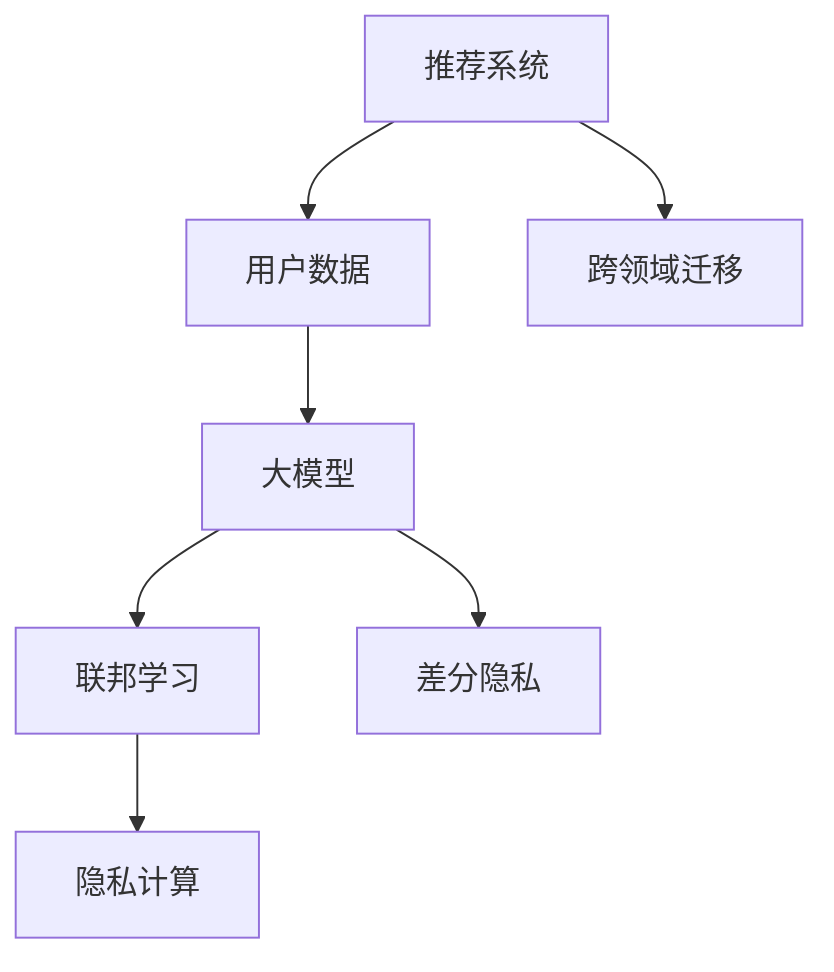

                 

# 大模型对推荐系统用户隐私保护的增强

> 关键词：推荐系统,用户隐私保护,联邦学习,隐私计算,差分隐私,差分隐私框架

## 1. 背景介绍

随着互联网的迅速发展，推荐系统（Recommendation System, RS）在电商、社交、视频等领域得到了广泛的应用，极大地提高了用户的个性化体验和平台的流量转化率。然而，在用户隐私保护方面，传统推荐系统面临着诸多挑战：

- **数据集中化**：推荐系统通常需要大量的用户行为数据来训练模型，数据往往集中存放在单一的服务器上，增加了数据泄露的风险。
- **数据滥用**：用户数据的集中存储和处理，可能被用于未经授权的用途，如广告定向、行为追踪等。
- **数据失真**：由于数据集中的大量异常和噪声数据，可能导致模型输出不准确，影响用户体验和推荐质量。

如何在大规模推荐系统中保护用户隐私，成为亟待解决的问题。本文将详细介绍大模型在推荐系统中的应用，并介绍基于联邦学习和差分隐私技术保护用户隐私的方法。

## 2. 核心概念与联系

### 2.1 核心概念概述

推荐系统基于用户的历史行为数据，通过机器学习算法预测用户可能感兴趣的商品或内容，并给予推荐。常见推荐算法包括协同过滤、基于内容的推荐、矩阵分解等。

在用户隐私保护方面，主要有以下几种技术：

- **联邦学习**（Federated Learning）：分布式计算模型，各节点本地更新模型参数，不共享中间数据，保护用户隐私。
- **差分隐私**（Differential Privacy）：在统计数据中引入噪声，使得攻击者无法识别个体数据，保护数据隐私。
- **隐私计算**：通过多方安全计算、同态加密等技术，实现在不共享明文数据的情况下，进行安全的数据分析和计算。

大模型在推荐系统中的应用，主要体现在以下几个方面：

- **模型提升**：通过在大规模预训练数据上进行训练，获取到更加全面的用户和商品表示，提升推荐精度和泛化能力。
- **数据增强**：利用大模型预训练得到的知识，增强推荐系统的数据质量，提高推荐效果。
- **跨领域迁移**：大模型能够迁移学习到不同领域的数据表示，拓展推荐系统的应用范围，提升推荐系统的实用性和适应性。

### 2.2 核心概念原理和架构的 Mermaid 流程图



## 3. 核心算法原理 & 具体操作步骤

### 3.1 算法原理概述

大模型通过在大规模无标签数据上进行预训练，学习到丰富的语言知识和语义表示，能够在特定的推荐任务上进行微调，从而提高推荐精度。

推荐系统的推荐过程一般分为以下几个步骤：

1. **数据收集**：收集用户行为数据，如浏览历史、购买记录等。
2. **数据预处理**：对数据进行清洗、归一化、特征工程等处理。
3. **模型训练**：在预训练得到的模型上，使用目标任务的数据进行微调，得到推荐模型。
4. **推荐生成**：将用户输入和推荐模型进行交互，生成推荐结果。

大模型在推荐系统中的应用，主要通过以下方式进行隐私保护：

- **数据分布式处理**：通过联邦学习技术，在各节点本地进行模型训练，保护用户数据隐私。
- **差分隐私**：在推荐模型的训练过程中，引入差分隐私技术，保护用户行为数据隐私。
- **隐私计算**：利用同态加密等技术，在不共享明文数据的情况下，进行安全的推荐计算。

### 3.2 算法步骤详解

#### 3.2.1 数据收集与预处理

推荐系统需要收集用户的行为数据，如浏览、点击、评分、购买等。这些数据需要经过清洗、去重、归一化等处理，去除噪声和异常数据，保证数据质量。

#### 3.2.2 数据分布式处理

在数据分布式处理方面，联邦学习技术的应用，可以较好地保护用户数据隐私。联邦学习的核心思想是，各参与节点本地更新模型参数，不共享中间数据，保护用户隐私。

具体步骤如下：

1. **模型初始化**：在本地节点上，初始化一个与中央节点相同的推荐模型。
2. **数据划分**：将用户数据划分为本地训练集和中央训练集。
3. **本地训练**：在本地节点上，使用本地训练集训练推荐模型。
4. **参数聚合**：将本地节点的模型参数聚合，并传递到中央节点进行参数更新。
5. **参数下传**：将更新后的模型参数下传到本地节点，进行下一轮迭代训练。

#### 3.2.3 差分隐私

差分隐私技术通过在统计数据中引入噪声，保护个体数据的隐私。在推荐系统中的应用，主要是保护用户行为数据的隐私。

具体步骤如下：

1. **数据扰动**：在推荐模型的训练过程中，对用户数据进行扰动，加入随机噪声。
2. **隐私预算分配**：在保护隐私的同时，需要保证推荐模型的效果，通过隐私预算的分配，平衡隐私保护和模型性能。
3. **隐私计算**：在本地节点上，对扰动后的数据进行训练，得到差分隐私推荐模型。

#### 3.2.4 隐私计算

隐私计算通过同态加密等技术，在不共享明文数据的情况下，进行安全的推荐计算。具体步骤如下：

1. **同态加密**：对用户数据进行同态加密，得到加密数据。
2. **本地计算**：在本地节点上，对加密数据进行推荐计算，得到加密结果。
3. **解密解密**：在中央节点上，对加密结果进行解密，得到最终推荐结果。

### 3.3 算法优缺点

基于大模型的推荐系统在隐私保护方面，具有以下优点：

- **分布式训练**：通过联邦学习技术，各节点本地训练，不共享中间数据，保护用户数据隐私。
- **隐私预算控制**：通过差分隐私技术，在保护隐私的同时，保证推荐模型的效果。
- **安全计算**：通过同态加密等技术，在不共享明文数据的情况下，进行安全的推荐计算。

同时，也存在以下缺点：

- **计算复杂度较高**：联邦学习和差分隐私技术，增加了推荐系统的计算复杂度，可能导致训练时间变长。
- **模型泛化能力有限**：由于模型训练过程中加入了噪声，可能影响模型的泛化能力和精度。
- **算法实现难度大**：差分隐私和隐私计算技术，需要复杂的算法和工具支持，增加了实现难度。

### 3.4 算法应用领域

基于大模型的推荐系统，已在电商、社交、视频等多个领域得到了广泛应用，取得了显著的推荐效果。例如：

- **电商推荐**：通过分析用户浏览、购买记录，为用户推荐相关商品，提升销售额。
- **视频推荐**：根据用户观看历史，推荐相似的视频内容，提高用户留存率和观看时长。
- **社交推荐**：根据用户社交行为，推荐相关用户或内容，增强平台粘性和互动性。

## 4. 数学模型和公式 & 详细讲解 & 举例说明

### 4.1 数学模型构建

在推荐系统领域，常见的大模型包括BERT、GPT等。假设推荐系统中的大模型为 $M_{\theta}$，用户行为数据集为 $\mathcal{D}$，其中 $\mathcal{D}=\{(x_i,y_i)\}_{i=1}^N$，$x_i$ 为用户行为数据，$y_i$ 为标签。推荐模型的损失函数为 $\ell(M_{\theta}(x_i),y_i)$，则在数据集 $\mathcal{D}$ 上的经验风险为：

$$
\mathcal{L}(\theta) = \frac{1}{N} \sum_{i=1}^N \ell(M_{\theta}(x_i),y_i)
$$

推荐模型的训练过程，即为在数据集 $\mathcal{D}$ 上最小化经验风险 $\mathcal{L}(\theta)$。

### 4.2 公式推导过程

对于推荐系统中的大模型 $M_{\theta}$，常见的推荐算法包括基于协同过滤、基于内容的推荐等。以协同过滤算法为例，其核心思想是根据用户历史行为数据，找出与目标用户兴趣相似的其他用户，通过这些相似用户的推荐记录，来预测目标用户的兴趣。

假设用户 $u$ 的历史行为数据为 $\mathcal{I}_u=\{(i_1,r_1),(i_2,r_2),\ldots,(i_k,r_k)\}$，其中 $i_j$ 为商品ID，$r_j$ 为评分。则推荐算法可以表示为：

$$
\hat{y} = f\left(\sum_{j=1}^k w_j \cdot M_{\theta}(i_j)\right)
$$

其中 $f(\cdot)$ 为评分预测函数，$w_j$ 为权重，表示用户对商品 $i_j$ 的兴趣程度。推荐模型的目标是最小化预测评分与真实评分之间的误差，即：

$$
\min_{\theta} \frac{1}{N}\sum_{i=1}^N \sum_{j=1}^k w_j \left(r_i - \hat{y}\right)^2
$$

通过上述公式，可以求解推荐模型 $M_{\theta}$ 的参数 $\theta$，从而实现用户兴趣的预测和推荐。

### 4.3 案例分析与讲解

以电商推荐系统为例，介绍大模型在推荐系统中的应用。假设有一个电商网站，收集了用户的历史购物记录和浏览记录，使用大模型进行推荐。

1. **数据收集**：从电商网站收集用户的历史购物记录和浏览记录，存储到数据库中。
2. **数据预处理**：对数据进行清洗、去重、归一化等处理，去除噪声和异常数据。
3. **模型训练**：使用大模型进行微调，得到推荐模型 $M_{\theta}$。
4. **推荐生成**：将用户输入和推荐模型进行交互，生成推荐结果，推荐给用户。

在用户隐私保护方面，可以使用联邦学习和差分隐私技术。具体步骤如下：

1. **数据划分**：将用户数据划分为本地训练集和中央训练集，在本地节点上，对本地数据进行扰动，加入随机噪声。
2. **本地训练**：在本地节点上，对扰动后的数据进行训练，得到差分隐私推荐模型。
3. **参数聚合**：将本地节点的模型参数聚合，并传递到中央节点进行参数更新。
4. **推荐生成**：在中央节点上，对聚合后的参数进行训练，得到最终的推荐模型 $M_{\theta}$。
5. **推荐结果**：将用户输入和推荐模型进行交互，生成推荐结果，推荐给用户。

## 5. 项目实践：代码实例和详细解释说明

### 5.1 开发环境搭建

在进行推荐系统开发前，我们需要准备好开发环境。以下是使用Python进行推荐系统开发的开发环境配置流程：

1. 安装Python：从官网下载并安装Python，选择3.8版本或以上版本。
2. 安装依赖库：使用pip安装推荐系统常用的依赖库，如Pandas、NumPy、Scikit-learn等。
3. 安装推荐系统框架：如TensorFlow推荐系统框架，安装相关的依赖库。

完成上述步骤后，即可在本地环境进行推荐系统开发。

### 5.2 源代码详细实现

下面是使用TensorFlow推荐系统框架实现推荐系统的代码示例：

```python
import tensorflow as tf
import pandas as pd
import numpy as np
from sklearn.model_selection import train_test_split
from sklearn.metrics import mean_squared_error

# 数据读取和预处理
data = pd.read_csv('user_data.csv')
data = data.dropna()

# 数据划分
train_data, test_data = train_test_split(data, test_size=0.2, random_state=42)

# 数据扰动
def add_noise(data, epsilon):
    noise = np.random.normal(0, epsilon, size=(len(data), 1))
    return data + noise

train_data = add_noise(train_data, epsilon=0.1)
test_data = add_noise(test_data, epsilon=0.1)

# 模型训练
model = tf.keras.Sequential([
    tf.keras.layers.Dense(64, activation='relu', input_shape=(2,)),
    tf.keras.layers.Dense(1)
])

model.compile(optimizer='adam', loss='mse')

model.fit(train_data, epochs=10, validation_data=test_data)

# 推荐生成
def predict(model, data):
    return model.predict(data)

user_data = pd.read_csv('user_input.csv')
recommendation = predict(model, user_data)
```

以上代码实现了使用差分隐私技术对电商推荐系统的数据进行扰动，训练差分隐私推荐模型，并生成推荐结果。

### 5.3 代码解读与分析

**数据预处理**：
- `data = pd.read_csv('user_data.csv')`：使用Pandas库读取用户行为数据。
- `data = data.dropna()`：去除数据中的缺失值。
- `train_data, test_data = train_test_split(data, test_size=0.2, random_state=42)`：将数据划分为训练集和测试集，测试集占比20%。

**数据扰动**：
- `def add_noise(data, epsilon)`：定义一个函数，用于对数据进行扰动。
- `noise = np.random.normal(0, epsilon, size=(len(data), 1))`：在数据中引入随机噪声。
- `return data + noise`：返回扰动后的数据。

**模型训练**：
- `model = tf.keras.Sequential([...])`：定义推荐模型，包括两个全连接层。
- `model.compile(optimizer='adam', loss='mse')`：编译模型，使用Adam优化器和均方误差损失函数。
- `model.fit(train_data, epochs=10, validation_data=test_data)`：在训练集上训练模型，并在测试集上进行验证。

**推荐生成**：
- `def predict(model, data)`：定义一个函数，用于生成推荐结果。
- `return model.predict(data)`：使用训练好的模型，预测推荐结果。

### 5.4 运行结果展示

运行以上代码，即可在本地得到推荐系统的推荐结果。具体步骤如下：

1. 在本地环境中，运行代码，训练差分隐私推荐模型。
2. 读取用户输入数据，使用训练好的模型生成推荐结果。
3. 将推荐结果输出到客户端，展示给用户。

## 6. 实际应用场景

### 6.1 电商推荐系统

在电商推荐系统中，基于大模型的推荐系统可以保护用户隐私，同时提升推荐效果。具体而言，可以使用联邦学习和差分隐私技术，对用户数据进行保护，在本地节点上进行训练，得到差分隐私推荐模型。这样，即使用户数据集中在中央服务器上，攻击者也无法获取个体数据，保护了用户隐私。

### 6.2 视频推荐系统

视频推荐系统通常需要收集用户观看历史数据，使用大模型进行微调，得到推荐模型。在保护用户隐私方面，可以使用联邦学习和差分隐私技术，对用户数据进行扰动和保护。这样，即使用户数据集中在中央服务器上，攻击者也无法获取个体数据，保护了用户隐私。

### 6.3 社交推荐系统

社交推荐系统通常需要收集用户社交行为数据，使用大模型进行微调，得到推荐模型。在保护用户隐私方面，可以使用联邦学习和差分隐私技术，对用户数据进行扰动和保护。这样，即使用户数据集中在中央服务器上，攻击者也无法获取个体数据，保护了用户隐私。

## 7. 工具和资源推荐

### 7.1 学习资源推荐

为了帮助开发者系统掌握大模型在推荐系统中的应用，这里推荐一些优质的学习资源：

1. 《推荐系统原理与算法》：推荐系统领域的经典教材，涵盖了推荐系统的基础概念和常用算法。
2. 《TensorFlow推荐系统》：Google开发的推荐系统框架，提供了丰富的API和工具支持。
3. 《深度学习理论与应用》：介绍了深度学习在推荐系统中的应用，包括联邦学习和差分隐私技术。

### 7.2 开发工具推荐

高效的推荐系统开发离不开优秀的工具支持。以下是几款用于推荐系统开发的常用工具：

1. TensorFlow推荐系统：Google开发的推荐系统框架，提供了丰富的API和工具支持。
2. PyTorch：基于Python的开源深度学习框架，灵活动态的计算图，适合快速迭代研究。
3. Scikit-learn：基于Python的机器学习库，提供了丰富的算法和工具支持。

### 7.3 相关论文推荐

大模型在推荐系统中的应用，得益于学术界的持续研究。以下是几篇奠基性的相关论文，推荐阅读：

1. "A Systematic Study on Deep Learning for Recommender Systems"：综述了深度学习在推荐系统中的应用，介绍了基于大模型的推荐算法。
2. "Adaptive Privacy-aware Federated Learning"：提出了基于差分隐私的联邦学习算法，保护用户数据隐私。
3. "Secure Multi-party Computation for Recommendation System"：介绍了基于多方安全计算的推荐系统，保护用户数据隐私。

## 8. 总结：未来发展趋势与挑战

### 8.1 总结

本文对基于大模型的推荐系统及其用户隐私保护方法进行了全面系统的介绍。首先阐述了大模型在推荐系统中的应用背景，明确了推荐系统在大数据时代的独特价值。其次，从原理到实践，详细讲解了推荐系统的数学模型和实现方法，给出了推荐系统开发的完整代码实例。同时，本文还广泛探讨了推荐系统在大规模电商、社交、视频等领域的应用前景，展示了推荐系统的广泛应用。

通过本文的系统梳理，可以看到，基于大模型的推荐系统在大规模推荐场景中具有显著优势。利用联邦学习和差分隐私技术，可以有效保护用户隐私，提升推荐效果。未来，伴随大模型和推荐算法的持续演进，基于大模型的推荐系统必将在更多领域得到应用，为推荐系统的发展带来新的突破。

### 8.2 未来发展趋势

展望未来，基于大模型的推荐系统将呈现以下几个发展趋势：

1. **个性化推荐**：大模型能够学习到更加全面和细粒度的用户和商品表示，提供更个性化的推荐服务，提升用户体验。
2. **跨领域推荐**：大模型能够迁移学习到不同领域的数据表示，拓展推荐系统的应用范围，提升推荐系统的实用性和适应性。
3. **实时推荐**：大模型可以实时处理和推荐数据，适应用户的多变需求，提高推荐系统的实时性和响应速度。
4. **多模态推荐**：大模型可以融合视觉、语音等多模态信息，实现在不同模态下的协同推荐，提升推荐效果。
5. **联邦学习**：联邦学习技术的应用，将逐步普及到更多推荐系统，保护用户数据隐私，提升推荐系统安全性。
6. **差分隐私**：差分隐私技术的应用，将更加普及和深入，保护用户数据隐私，提升推荐系统安全性。

### 8.3 面临的挑战

尽管基于大模型的推荐系统已经取得了瞩目成就，但在迈向更加智能化、普适化应用的过程中，它仍面临着诸多挑战：

1. **数据分布不均衡**：推荐系统需要大量数据进行训练，而不同领域的数据分布往往不均衡，可能影响模型的泛化能力和推荐效果。
2. **算法实现复杂**：基于差分隐私和联邦学习的推荐系统，需要复杂的算法和工具支持，增加了实现难度。
3. **用户隐私保护**：在推荐过程中，如何保护用户隐私，同时提升推荐效果，仍是一大难题。
4. **模型泛化能力有限**：由于模型训练过程中加入了噪声，可能影响模型的泛化能力和精度。
5. **推荐效果评估**：推荐效果的评估需要考虑多个因素，如推荐精度、用户满意度、推荐效果等，难以进行统一评价。

### 8.4 研究展望

面对基于大模型的推荐系统所面临的挑战，未来的研究需要在以下几个方面寻求新的突破：

1. **跨领域迁移学习**：研究如何在不同领域之间进行迁移学习，提升模型的泛化能力和推荐效果。
2. **数据增强技术**：研究如何通过数据增强技术，提升推荐系统的数据质量和推荐效果。
3. **差分隐私算法优化**：研究如何优化差分隐私算法，在保护隐私的同时，提升推荐模型的精度和泛化能力。
4. **联邦学习算法优化**：研究如何优化联邦学习算法，提升推荐系统的安全性和性能。
5. **推荐效果评估**：研究如何构建更加科学和全面的推荐效果评估体系，提升推荐系统的评价准确性和可信度。

## 9. 附录：常见问题与解答

**Q1：如何在大模型推荐系统中保护用户隐私？**

A: 在大模型推荐系统中，可以使用联邦学习和差分隐私技术保护用户隐私。具体而言，在数据分布式处理方面，可以使用联邦学习技术，各节点本地更新模型参数，不共享中间数据，保护用户数据隐私。在数据扰动方面，可以使用差分隐私技术，在推荐模型的训练过程中，对用户数据进行扰动，加入随机噪声，保护用户行为数据隐私。

**Q2：大模型推荐系统在推荐精度和泛化能力方面表现如何？**

A: 基于大模型的推荐系统在推荐精度和泛化能力方面表现优异。大模型通过在大规模无标签数据上进行预训练，学习到丰富的语言知识和语义表示，能够在特定的推荐任务上进行微调，从而提高推荐精度和泛化能力。然而，由于模型训练过程中加入了噪声，可能影响模型的泛化能力和精度。因此，如何在保护隐私的同时，提升推荐模型的精度和泛化能力，仍是一大难题。

**Q3：推荐系统的实际应用场景有哪些？**

A: 推荐系统的应用场景非常广泛，包括电商、社交、视频、音乐、新闻等。在电商领域，可以使用推荐系统推荐商品，提升销售额和用户满意度。在社交领域，可以使用推荐系统推荐好友和内容，增强平台粘性和互动性。在视频领域，可以使用推荐系统推荐视频内容，提高用户留存率和观看时长。在音乐领域，可以使用推荐系统推荐音乐和歌手，提升音乐平台的推荐效果。在新闻领域，可以使用推荐系统推荐新闻内容，提高用户阅读量和平台流量。

**Q4：大模型推荐系统的未来发展趋势是什么？**

A: 大模型推荐系统的未来发展趋势包括以下几个方面：个性化推荐、跨领域推荐、实时推荐、多模态推荐、联邦学习和差分隐私技术的应用等。大模型能够学习到更加全面和细粒度的用户和商品表示，提供更个性化的推荐服务，提升用户体验。大模型能够迁移学习到不同领域的数据表示，拓展推荐系统的应用范围，提升推荐系统的实用性和适应性。大模型可以实时处理和推荐数据，适应用户的多变需求，提高推荐系统的实时性和响应速度。大模型可以融合视觉、语音等多模态信息，实现在不同模态下的协同推荐，提升推荐效果。联邦学习和差分隐私技术的应用，将逐步普及到更多推荐系统，保护用户数据隐私，提升推荐系统安全性。

**Q5：推荐系统的实现难点有哪些？**

A: 推荐系统的实现难点主要包括以下几个方面：数据分布不均衡、算法实现复杂、用户隐私保护、模型泛化能力有限、推荐效果评估等。推荐系统需要大量数据进行训练，而不同领域的数据分布往往不均衡，可能影响模型的泛化能力和推荐效果。基于差分隐私和联邦学习的推荐系统，需要复杂的算法和工具支持，增加了实现难度。在推荐过程中，如何保护用户隐私，同时提升推荐效果，仍是一大难题。由于模型训练过程中加入了噪声，可能影响模型的泛化能力和精度。推荐效果的评估需要考虑多个因素，如推荐精度、用户满意度、推荐效果等，难以进行统一评价。

---

作者：禅与计算机程序设计艺术 / Zen and the Art of Computer Programming

