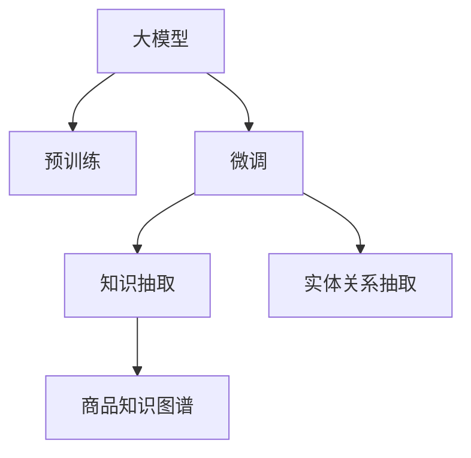

                 

# 大模型技术在电商平台商品知识图谱构建中的应用

## 1. 背景介绍

在电商平台上，构建商品知识图谱是一个至关重要且极具挑战的任务。它不仅可以帮助电商平台提升搜索和推荐的准确性，还能为市场分析、库存管理等业务提供坚实的底层数据支持。随着自然语言处理和大模型技术的迅猛发展，使用大模型技术进行商品知识图谱构建，已经成为了电商平台智能化升级的新方向。

### 1.1 问题由来

传统的商品知识图谱构建需要人工构建实体和关系，成本高、效率低，并且很难覆盖所有商品信息。大模型技术，尤其是预训练语言模型，通过海量的文本数据自监督训练，已经具备了强大的语义理解能力，可以自动地从电商网站和用户评论中抽取商品实体、属性和关系，大大降低了构建知识图谱的人力成本和时间成本。

大模型技术在商品知识图谱构建中的应用，将极大地提高电商平台的智能化水平，为商家和消费者提供更加个性化的服务和商品推荐，同时也为数据分析和决策提供了坚实的基础。

## 2. 核心概念与联系

### 2.1 核心概念概述

- **商品知识图谱**：以商品为节点，以属性和关系为边，构建的网络结构。可以用于商品搜索、推荐、市场分析等应用。

- **大模型**：指通过大规模语料库自监督预训练的语言模型，如BERT、GPT、GPT-3等。这些模型经过预训练后，具有强大的语义理解和生成能力。

- **预训练语言模型(Pretrained Language Model, PLM)**：在大量无标签文本数据上预训练的语言模型，具有通用的语言知识，可用于特定任务的微调。

- **微调(Fine-Tuning)**：在大模型基础上，利用标注数据进行有监督学习，调整模型参数以适应特定任务。

- **迁移学习(Transfer Learning)**：将在大规模数据上预训练的知识，迁移应用到小规模数据上的特定任务中，以提高模型性能。

- **自监督学习(Self-Supervised Learning)**：利用数据的自我关系进行无监督学习，无需人工标注，适用于大规模预训练阶段。

- **知识抽取(Information Extraction)**：从文本中自动提取实体、属性和关系等结构化信息。

- **实体关系抽取(ER extraction)**：识别出文本中的实体及它们之间的关系。

### 2.2 核心概念原理和架构的 Mermaid 流程图



这个流程图展示了从大模型到商品知识图谱的构建流程：首先，大模型通过预训练获得语言知识，然后利用这些知识对特定任务进行微调，提取知识图谱中的实体和关系，最终构建出商品知识图谱。

## 3. 核心算法原理 & 具体操作步骤

### 3.1 算法原理概述

基于大模型技术构建商品知识图谱的核心算法分为以下几个步骤：

1. **预训练**：在电商网站的商品描述、用户评论等大量无标签文本上，使用自监督任务进行预训练，学习通用的语言表征。

2. **微调**：在标注的商品信息上，使用有监督任务进行微调，学习特定的商品实体、属性和关系等知识。

3. **知识抽取**：利用微调后的模型，从电商网站的文本数据中自动抽取实体、属性和关系，生成结构化数据。

4. **知识融合**：将抽取出的结构化数据进行整合和融合，构建出完整的商品知识图谱。

### 3.2 算法步骤详解

#### 3.2.1 预训练阶段

**预训练目标**：
- 从电商网站的商品描述、用户评论等文本中学习通用的语言表示。

**预训练数据**：
- 电商网站的商品描述、用户评论等文本。

**预训练任务**：
- Masked Language Modeling（MLM）：预测文本中被屏蔽的词。
- Next Sentence Prediction（NSP）：预测两个句子是否为连续的。

**预训练算法**：
- 使用深度学习模型（如BERT、GPT等），在大规模无标签数据上进行自监督预训练。

#### 3.2.2 微调阶段

**微调目标**：
- 在标注的商品信息上，学习特定的商品实体、属性和关系。

**微调数据**：
- 标注的商品信息，包括商品名称、品牌、价格、用户评论等。

**微调算法**：
- 使用深度学习模型，在标注数据上进行有监督学习。

**微调优化器**：
- 常见的优化器包括AdamW、SGD等。

**微调策略**：
- 选择合适的学习率，通常比从头训练时小，以避免过拟合。
- 应用正则化技术，如L2正则、Dropout等，防止模型过拟合。
- 保留预训练的部分层，只微调顶层，减少需优化的参数。
- 数据增强，如回译、近义替换等方式，丰富训练集多样性。

#### 3.2.3 知识抽取阶段

**知识抽取目标**：
- 从电商网站的文本中自动抽取实体、属性和关系。

**知识抽取算法**：
- 利用微调后的模型，进行序列标注或分类任务，识别出商品实体和属性。

**知识抽取过程**：
- 将商品描述、用户评论等文本作为输入，输出实体、属性和关系等结构化数据。

**知识抽取模型**：
- BERT、GPT等深度学习模型，通过序列标注任务，识别出商品实体和属性。

#### 3.2.4 知识融合阶段

**知识融合目标**：
- 将抽取出的结构化数据进行整合和融合，构建出完整的商品知识图谱。

**知识融合算法**：
- 利用图神经网络（GNN）等算法，将抽取出的实体、属性和关系进行整合。

**知识融合过程**：
- 将抽取出的结构化数据导入图数据库，使用GNN等算法进行融合，构建出商品知识图谱。

### 3.3 算法优缺点

**算法优点**：
- 利用大模型技术，大大降低了构建商品知识图谱的人力成本和时间成本。
- 自动从电商网站的文本中抽取实体、属性和关系，减少了人工标注的需求。
- 大模型技术能够处理海量数据，构建更加全面和准确的商品知识图谱。

**算法缺点**：
- 对标注数据的依赖仍然较大，标注数据质量直接影响微调效果。
- 微调过程对计算资源需求较高，需要高性能设备支持。
- 模型复杂度较高，推理速度较慢，需要优化以提高效率。

### 3.4 算法应用领域

大模型技术在商品知识图谱构建中主要应用于以下领域：

- **商品搜索**：利用商品知识图谱，提升搜索的准确性和召回率。
- **推荐系统**：构建商品推荐引擎，为用户提供个性化的商品推荐。
- **市场分析**：通过分析商品知识图谱，进行市场趋势预测和分析。
- **库存管理**：利用商品知识图谱，优化库存管理和调配策略。

## 4. 数学模型和公式 & 详细讲解 & 举例说明

### 4.1 数学模型构建

假设大模型为 $M_{\theta}$，其中 $\theta$ 为预训练后的模型参数。商品知识图谱中的实体、属性和关系可以表示为三元组 $(E, R, E)$，其中 $E$ 表示实体，$R$ 表示关系，$E$ 表示实体。

知识抽取任务可以表示为序列标注问题，即从文本中识别出实体和属性，可以表示为序列标注问题：

$$
y_i = \mathop{\arg\min}_{y} \mathcal{L}(M_{\theta}(x_i),y_i)
$$

其中 $\mathcal{L}$ 为交叉熵损失函数，$x_i$ 为输入的文本，$y_i$ 为标注的序列。

### 4.2 公式推导过程

#### 4.2.1 预训练模型表示

预训练模型 $M_{\theta}$ 可以表示为：

$$
M_{\theta}(x_i) = [M_{\theta}(x_i)]_i \quad \text{where} \quad [M_{\theta}(x_i)]_i \in \mathbb{R}^d
$$

其中 $x_i$ 为输入的文本，$d$ 为模型的维度。

#### 4.2.2 微调模型表示

微调后的模型 $M_{\hat{\theta}}$ 可以表示为：

$$
M_{\hat{\theta}}(x_i) = [M_{\hat{\theta}}(x_i)]_i \quad \text{where} \quad [M_{\hat{\theta}}(x_i)]_i = \text{softmax}(\hat{V}_i)
$$

其中 $\hat{\theta}$ 为微调后的模型参数，$\hat{V}_i$ 为微调模型的输出，$\text{softmax}$ 表示输出概率分布。

#### 4.2.3 序列标注任务

序列标注任务可以表示为：

$$
y_i = [y_{e_i}, y_{p_i}, y_{r_i}]
$$

其中 $y_{e_i}$ 表示实体的标注，$y_{p_i}$ 表示属性的标注，$y_{r_i}$ 表示关系的标注。

序列标注的损失函数可以表示为：

$$
\mathcal{L}(M_{\hat{\theta}}(x_i),y_i) = \sum_{j=1}^N \mathcal{L}_{e}(M_{\hat{\theta}}(x_i),y_{e_i}) + \mathcal{L}_{p}(M_{\hat{\theta}}(x_i),y_{p_i}) + \mathcal{L}_{r}(M_{\hat{\theta}}(x_i),y_{r_i})
$$

其中 $\mathcal{L}_e$、$\mathcal{L}_p$ 和 $\mathcal{L}_r$ 分别为实体标注、属性标注和关系标注的损失函数。

### 4.3 案例分析与讲解

#### 案例1：商品搜索

假设电商网站上有大量商品描述，可以预训练一个大模型 $M_{\theta}$，然后在商品描述上进行微调 $M_{\hat{\theta}}$，抽取商品名称、品牌和价格等实体，构建商品知识图谱。

具体步骤如下：

1. **预训练**：使用无标签的商品描述进行预训练，学习通用的语言表示。

2. **微调**：在标注的商品信息上进行微调，学习特定的商品实体、属性和关系。

3. **知识抽取**：利用微调后的模型，从电商网站的文本中抽取商品实体和属性。

4. **知识融合**：将抽取出的结构化数据进行整合和融合，构建出完整的商品知识图谱。

通过商品知识图谱，可以构建商品搜索系统，提高搜索的准确性和召回率。

#### 案例2：推荐系统

电商网站可以利用商品知识图谱进行个性化推荐。假设用户输入搜索词 "T恤"，可以通过商品知识图谱找到相关商品，并进行推荐。

具体步骤如下：

1. **预训练**：使用无标签的商品描述进行预训练，学习通用的语言表示。

2. **微调**：在标注的商品信息上进行微调，学习特定的商品实体、属性和关系。

3. **知识抽取**：利用微调后的模型，从电商网站的文本中抽取商品实体和属性。

4. **推荐引擎**：利用商品知识图谱中的信息，构建推荐引擎，为用户推荐相关商品。

通过商品知识图谱，可以提高推荐的精准性和个性化程度。

## 5. 项目实践：代码实例和详细解释说明

### 5.1 开发环境搭建

在使用大模型技术构建商品知识图谱之前，需要准备好开发环境。以下是使用Python进行PyTorch开发的环境配置流程：

1. 安装Anaconda：从官网下载并安装Anaconda，用于创建独立的Python环境。

2. 创建并激活虚拟环境：
```bash
conda create -n pytorch-env python=3.8 
conda activate pytorch-env
```

3. 安装PyTorch：根据CUDA版本，从官网获取对应的安装命令。例如：
```bash
conda install pytorch torchvision torchaudio cudatoolkit=11.1 -c pytorch -c conda-forge
```

4. 安装Transformers库：
```bash
pip install transformers
```

5. 安装各类工具包：
```bash
pip install numpy pandas scikit-learn matplotlib tqdm jupyter notebook ipython
```

完成上述步骤后，即可在`pytorch-env`环境中开始微调实践。

### 5.2 源代码详细实现

下面以实体关系抽取为例，给出使用Transformers库对BERT模型进行微调的PyTorch代码实现。

首先，定义实体关系抽取任务的训练集和验证集：

```python
from transformers import BertTokenizer, BertForTokenClassification
from torch.utils.data import Dataset, DataLoader
import torch

class ERDataset(Dataset):
    def __init__(self, texts, tags, tokenizer, max_len=128):
        self.texts = texts
        self.tags = tags
        self.tokenizer = tokenizer
        self.max_len = max_len
        
    def __len__(self):
        return len(self.texts)
    
    def __getitem__(self, item):
        text = self.texts[item]
        tags = self.tags[item]
        
        encoding = self.tokenizer(text, return_tensors='pt', max_length=self.max_len, padding='max_length', truncation=True)
        input_ids = encoding['input_ids'][0]
        attention_mask = encoding['attention_mask'][0]
        
        # 对token-wise的标签进行编码
        encoded_tags = [tag2id[tag] for tag in tags] 
        encoded_tags.extend([tag2id['O']] * (self.max_len - len(encoded_tags)))
        labels = torch.tensor(encoded_tags, dtype=torch.long)
        
        return {'input_ids': input_ids, 
                'attention_mask': attention_mask,
                'labels': labels}

# 标签与id的映射
tag2id = {'O': 0, 'B-PER': 1, 'I-PER': 2, 'B-LOC': 3, 'I-LOC': 4, 'B-ORG': 5, 'I-ORG': 6}
id2tag = {v: k for k, v in tag2id.items()}

# 创建dataset
tokenizer = BertTokenizer.from_pretrained('bert-base-cased')

train_dataset = ERDataset(train_texts, train_tags, tokenizer)
dev_dataset = ERDataset(dev_texts, dev_tags, tokenizer)
test_dataset = ERDataset(test_texts, test_tags, tokenizer)
```

然后，定义模型和优化器：

```python
from transformers import BertForTokenClassification, AdamW

model = BertForTokenClassification.from_pretrained('bert-base-cased', num_labels=len(tag2id))

optimizer = AdamW(model.parameters(), lr=2e-5)
```

接着，定义训练和评估函数：

```python
from torch.utils.data import DataLoader
from tqdm import tqdm
from sklearn.metrics import classification_report

device = torch.device('cuda') if torch.cuda.is_available() else torch.device('cpu')
model.to(device)

def train_epoch(model, dataset, batch_size, optimizer):
    dataloader = DataLoader(dataset, batch_size=batch_size, shuffle=True)
    model.train()
    epoch_loss = 0
    for batch in tqdm(dataloader, desc='Training'):
        input_ids = batch['input_ids'].to(device)
        attention_mask = batch['attention_mask'].to(device)
        labels = batch['labels'].to(device)
        model.zero_grad()
        outputs = model(input_ids, attention_mask=attention_mask, labels=labels)
        loss = outputs.loss
        epoch_loss += loss.item()
        loss.backward()
        optimizer.step()
    return epoch_loss / len(dataloader)

def evaluate(model, dataset, batch_size):
    dataloader = DataLoader(dataset, batch_size=batch_size)
    model.eval()
    preds, labels = [], []
    with torch.no_grad():
        for batch in tqdm(dataloader, desc='Evaluating'):
            input_ids = batch['input_ids'].to(device)
            attention_mask = batch['attention_mask'].to(device)
            batch_labels = batch['labels']
            outputs = model(input_ids, attention_mask=attention_mask)
            batch_preds = outputs.logits.argmax(dim=2).to('cpu').tolist()
            batch_labels = batch_labels.to('cpu').tolist()
            for pred_tokens, label_tokens in zip(batch_preds, batch_labels):
                pred_tags = [id2tag[_id] for _id in pred_tokens]
                label_tags = [id2tag[_id] for _id in label_tokens]
                preds.append(pred_tags[:len(label_tags)])
                labels.append(label_tags)
                
    print(classification_report(labels, preds))
```

最后，启动训练流程并在测试集上评估：

```python
epochs = 5
batch_size = 16

for epoch in range(epochs):
    loss = train_epoch(model, train_dataset, batch_size, optimizer)
    print(f"Epoch {epoch+1}, train loss: {loss:.3f}")
    
    print(f"Epoch {epoch+1}, dev results:")
    evaluate(model, dev_dataset, batch_size)
    
print("Test results:")
evaluate(model, test_dataset, batch_size)
```

以上就是使用PyTorch对BERT进行实体关系抽取任务微调的完整代码实现。可以看到，得益于Transformers库的强大封装，我们可以用相对简洁的代码完成BERT模型的加载和微调。

### 5.3 代码解读与分析

让我们再详细解读一下关键代码的实现细节：

**ERDataset类**：
- `__init__`方法：初始化文本、标签、分词器等关键组件。
- `__len__`方法：返回数据集的样本数量。
- `__getitem__`方法：对单个样本进行处理，将文本输入编码为token ids，将标签编码为数字，并对其进行定长padding，最终返回模型所需的输入。

**tag2id和id2tag字典**：
- 定义了标签与数字id之间的映射关系，用于将token-wise的预测结果解码回真实的标签。

**训练和评估函数**：
- 使用PyTorch的DataLoader对数据集进行批次化加载，供模型训练和推理使用。
- 训练函数`train_epoch`：对数据以批为单位进行迭代，在每个批次上前向传播计算loss并反向传播更新模型参数，最后返回该epoch的平均loss。
- 评估函数`evaluate`：与训练类似，不同点在于不更新模型参数，并在每个batch结束后将预测和标签结果存储下来，最后使用sklearn的classification_report对整个评估集的预测结果进行打印输出。

**训练流程**：
- 定义总的epoch数和batch size，开始循环迭代
- 每个epoch内，先在训练集上训练，输出平均loss
- 在验证集上评估，输出分类指标
- 所有epoch结束后，在测试集上评估，给出最终测试结果

可以看到，PyTorch配合Transformers库使得BERT微调的代码实现变得简洁高效。开发者可以将更多精力放在数据处理、模型改进等高层逻辑上，而不必过多关注底层的实现细节。

当然，工业级的系统实现还需考虑更多因素，如模型的保存和部署、超参数的自动搜索、更灵活的任务适配层等。但核心的微调范式基本与此类似。

## 6. 实际应用场景

### 6.1 智能客服系统

基于大语言模型微调的对话技术，可以广泛应用于智能客服系统的构建。传统客服往往需要配备大量人力，高峰期响应缓慢，且一致性和专业性难以保证。而使用微调后的对话模型，可以7x24小时不间断服务，快速响应客户咨询，用自然流畅的语言解答各类常见问题。

在技术实现上，可以收集企业内部的历史客服对话记录，将问题和最佳答复构建成监督数据，在此基础上对预训练对话模型进行微调。微调后的对话模型能够自动理解用户意图，匹配最合适的答案模板进行回复。对于客户提出的新问题，还可以接入检索系统实时搜索相关内容，动态组织生成回答。如此构建的智能客服系统，能大幅提升客户咨询体验和问题解决效率。

### 6.2 金融舆情监测

金融机构需要实时监测市场舆论动向，以便及时应对负面信息传播，规避金融风险。传统的人工监测方式成本高、效率低，难以应对网络时代海量信息爆发的挑战。基于大语言模型微调的文本分类和情感分析技术，为金融舆情监测提供了新的解决方案。

具体而言，可以收集金融领域相关的新闻、报道、评论等文本数据，并对其进行主题标注和情感标注。在此基础上对预训练语言模型进行微调，使其能够自动判断文本属于何种主题，情感倾向是正面、中性还是负面。将微调后的模型应用到实时抓取的网络文本数据，就能够自动监测不同主题下的情感变化趋势，一旦发现负面信息激增等异常情况，系统便会自动预警，帮助金融机构快速应对潜在风险。

### 6.3 个性化推荐系统

当前的推荐系统往往只依赖用户的历史行为数据进行物品推荐，无法深入理解用户的真实兴趣偏好。基于大语言模型微调技术，个性化推荐系统可以更好地挖掘用户行为背后的语义信息，从而提供更精准、多样的推荐内容。

在实践中，可以收集用户浏览、点击、评论、分享等行为数据，提取和用户交互的物品标题、描述、标签等文本内容。将文本内容作为模型输入，用户的后续行为（如是否点击、购买等）作为监督信号，在此基础上微调预训练语言模型。微调后的模型能够从文本内容中准确把握用户的兴趣点。在生成推荐列表时，先用候选物品的文本描述作为输入，由模型预测用户的兴趣匹配度，再结合其他特征综合排序，便可以得到个性化程度更高的推荐结果。

### 6.4 未来应用展望

随着大语言模型微调技术的发展，基于微调范式将在更多领域得到应用，为传统行业带来变革性影响。

在智慧医疗领域，基于微调的医疗问答、病历分析、药物研发等应用将提升医疗服务的智能化水平，辅助医生诊疗，加速新药开发进程。

在智能教育领域，微调技术可应用于作业批改、学情分析、知识推荐等方面，因材施教，促进教育公平，提高教学质量。

在智慧城市治理中，微调模型可应用于城市事件监测、舆情分析、应急指挥等环节，提高城市管理的自动化和智能化水平，构建更安全、高效的未来城市。

此外，在企业生产、社会治理、文娱传媒等众多领域，基于大模型微调的人工智能应用也将不断涌现，为经济社会发展注入新的动力。相信随着技术的日益成熟，微调方法将成为人工智能落地应用的重要范式，推动人工智能技术在垂直行业的规模化落地。总之，微调需要开发者根据具体任务，不断迭代和优化模型、数据和算法，方能得到理想的效果。

## 7. 工具和资源推荐

### 7.1 学习资源推荐

为了帮助开发者系统掌握大模型技术在商品知识图谱构建中的应用，这里推荐一些优质的学习资源：

1. 《Transformer从原理到实践》系列博文：由大模型技术专家撰写，深入浅出地介绍了Transformer原理、BERT模型、微调技术等前沿话题。

2. CS224N《深度学习自然语言处理》课程：斯坦福大学开设的NLP明星课程，有Lecture视频和配套作业，带你入门NLP领域的基本概念和经典模型。

3. 《Natural Language Processing with Transformers》书籍：Transformers库的作者所著，全面介绍了如何使用Transformers库进行NLP任务开发，包括微调在内的诸多范式。

4. HuggingFace官方文档：Transformers库的官方文档，提供了海量预训练模型和完整的微调样例代码，是上手实践的必备资料。

5. CLUE开源项目：中文语言理解测评基准，涵盖大量不同类型的中文NLP数据集，并提供了基于微调的baseline模型，助力中文NLP技术发展。

通过对这些资源的学习实践，相信你一定能够快速掌握大模型技术在商品知识图谱构建中的精髓，并用于解决实际的NLP问题。
###  7.2 开发工具推荐

高效的开发离不开优秀的工具支持。以下是几款用于大模型技术商品知识图谱构建开发的常用工具：

1. PyTorch：基于Python的开源深度学习框架，灵活动态的计算图，适合快速迭代研究。大部分预训练语言模型都有PyTorch版本的实现。

2. TensorFlow：由Google主导开发的开源深度学习框架，生产部署方便，适合大规模工程应用。同样有丰富的预训练语言模型资源。

3. Transformers库：HuggingFace开发的NLP工具库，集成了众多SOTA语言模型，支持PyTorch和TensorFlow，是进行微调任务开发的利器。

4. Weights & Biases：模型训练的实验跟踪工具，可以记录和可视化模型训练过程中的各项指标，方便对比和调优。与主流深度学习框架无缝集成。

5. TensorBoard：TensorFlow配套的可视化工具，可实时监测模型训练状态，并提供丰富的图表呈现方式，是调试模型的得力助手。

6. Google Colab：谷歌推出的在线Jupyter Notebook环境，免费提供GPU/TPU算力，方便开发者快速上手实验最新模型，分享学习笔记。

合理利用这些工具，可以显著提升大模型技术商品知识图谱构建任务的开发效率，加快创新迭代的步伐。

### 7.3 相关论文推荐

大语言模型和微调技术的发展源于学界的持续研究。以下是几篇奠基性的相关论文，推荐阅读：

1. Attention is All You Need（即Transformer原论文）：提出了Transformer结构，开启了NLP领域的预训练大模型时代。

2. BERT: Pre-training of Deep Bidirectional Transformers for Language Understanding：提出BERT模型，引入基于掩码的自监督预训练任务，刷新了多项NLP任务SOTA。

3. Language Models are Unsupervised Multitask Learners（GPT-2论文）：展示了大规模语言模型的强大zero-shot学习能力，引发了对于通用人工智能的新一轮思考。

4. Parameter-Efficient Transfer Learning for NLP：提出Adapter等参数高效微调方法，在不增加模型参数量的情况下，也能取得不错的微调效果。

5. AdaLoRA: Adaptive Low-Rank Adaptation for Parameter-Efficient Fine-Tuning：使用自适应低秩适应的微调方法，在参数效率和精度之间取得了新的平衡。

这些论文代表了大语言模型微调技术的发展脉络。通过学习这些前沿成果，可以帮助研究者把握学科前进方向，激发更多的创新灵感。

## 8. 总结：未来发展趋势与挑战

### 8.1 总结

本文对大模型技术在电商平台商品知识图谱构建中的应用进行了全面系统的介绍。首先阐述了大模型技术和商品知识图谱构建的研究背景和意义，明确了微调在构建商品知识图谱中的独特价值。其次，从原理到实践，详细讲解了微调的数学原理和关键步骤，给出了微调任务开发的完整代码实例。同时，本文还广泛探讨了微调方法在智能客服、金融舆情、个性化推荐等多个行业领域的应用前景，展示了微调范式的巨大潜力。此外，本文精选了微调技术的各类学习资源，力求为读者提供全方位的技术指引。

通过本文的系统梳理，可以看到，基于大模型技术的微调方法正在成为构建商品知识图谱的重要手段，极大地提高了电商平台的智能化水平，为商家和消费者提供更加个性化的服务和商品推荐，同时也为数据分析和决策提供了坚实的基础。未来，伴随预训练语言模型和微调方法的持续演进，相信商品知识图谱构建技术将迎来更多的突破和创新。

### 8.2 未来发展趋势

展望未来，大模型技术在商品知识图谱构建中呈现以下几个发展趋势：

1. **规模化扩展**：随着计算资源的增加，大模型的规模将不断增大，模型参数量将进一步提升，构建的商品知识图谱将更加全面和准确。

2. **融合多模态数据**：未来的商品知识图谱构建将融合图像、视频、语音等多模态数据，构建多模态商品知识图谱，提升对商品的综合理解能力。

3. **实时动态更新**：商品知识图谱需要实时动态更新，以适应市场变化和消费者需求的变化，增强系统的时效性。

4. **跨领域迁移能力**：大模型在跨领域迁移学习中表现优异，商品知识图谱构建将借鉴这一技术，提高跨领域的知识抽取和融合能力。

5. **零样本学习**：受启发于提示学习(Prompt-based Learning)的思路，未来的商品知识图谱构建将更多依赖预训练语言模型，通过精心设计的输入文本，在更少的标注样本上实现良好的微调效果。

6. **知识图谱嵌入技术**：通过知识图谱嵌入技术，将商品知识图谱与词向量表示融合，提升商品相关信息的表达能力。

### 8.3 面临的挑战

尽管大模型技术在商品知识图谱构建中取得了显著进展，但在迈向更加智能化、普适化应用的过程中，它仍面临着诸多挑战：

1. **数据质量和标注成本**：构建商品知识图谱需要大量标注数据，标注成本高，数据质量对微调效果影响较大。

2. **计算资源需求**：大模型训练和微调需要高性能设备，计算资源需求大，对算力、内存、存储等硬件条件要求较高。

3. **模型复杂性和推理效率**：大模型结构复杂，推理速度较慢，需要优化以提高效率。

4. **系统部署和维护**：大模型部署到生产环境需要考虑系统稳定性和安全性，需要持续维护和优化。

5. **知识图谱的稀疏性**：商品知识图谱中的数据稀疏，影响模型的训练效果和应用效果。

6. **隐私和安全问题**：商品知识图谱构建需要处理大量的用户隐私数据，需要考虑隐私保护和数据安全。

### 8.4 研究展望

面对大模型技术在商品知识图谱构建中面临的挑战，未来的研究需要在以下几个方面寻求新的突破：

1. **分布式训练和计算**：利用分布式训练和计算技术，降低大模型训练和微调的计算资源需求，提高训练效率。

2. **轻量化模型和压缩技术**：开发轻量化模型和压缩技术，减小模型体积，提高推理速度和系统部署的灵活性。

3. **多模态知识融合**：开发多模态知识融合技术，将图像、视频、语音等多模态信息与文本信息协同建模，提升对商品信息的理解能力。

4. **跨领域迁移学习**：借鉴跨领域迁移学习技术，提高商品知识图谱在跨领域的应用能力。

5. **知识图谱嵌入**：结合知识图谱嵌入技术，将商品知识图谱与词向量表示融合，提升商品相关信息的表达能力。

6. **隐私保护和数据安全**：开发隐私保护和数据安全技术，保护用户隐私，确保商品知识图谱构建的安全性。

这些研究方向将推动大模型技术在商品知识图谱构建中的创新发展，为电商平台的智能化升级提供强有力的技术支持。相信随着研究者的不懈努力，大模型技术将在构建商品知识图谱中发挥更大的作用，推动商品知识图谱构建技术的成熟与完善。

## 9. 附录：常见问题与解答

**Q1：大模型技术在商品知识图谱构建中是否适用于所有电商平台？**

A: 大模型技术在商品知识图谱构建中具有普适性，适用于各类电商平台。不同类型的电商平台可以根据自身需求，选择合适的预训练模型和微调策略，构建符合自身特点的商品知识图谱。

**Q2：微调过程中的学习率设置有什么建议？**

A: 微调过程中的学习率通常比从头训练时小，一般建议从1e-5开始调参，逐步减小学习率，直至收敛。也可以使用warmup策略，在开始阶段使用较小的学习率，再逐渐过渡到预设值。需要注意的是，不同的优化器(如AdamW、Adafactor等)以及不同的学习率调度策略，可能需要设置不同的学习率阈值。

**Q3：商品知识图谱的构建过程中，如何处理长尾商品和缺失信息？**

A: 长尾商品和缺失信息是商品知识图谱构建中的常见问题。针对长尾商品，可以通过多任务学习或自监督学习，进一步优化模型，提升长尾商品的抽取效果。针对缺失信息，可以引入知识图谱嵌入技术，通过嵌入空间中的相似性度量，推测缺失信息的值。

**Q4：商品知识图谱的构建过程中，如何提高系统的实时性和动态更新能力？**

A: 商品知识图谱的构建需要实时动态更新，以适应市场变化和消费者需求的变化。可以采用分布式训练和计算技术，提高训练和微调的效率。同时，可以使用增量学习技术，对新的商品信息进行增量更新，提高系统的实时性和动态更新能力。

**Q5：商品知识图谱的构建过程中，如何保护用户隐私和数据安全？**

A: 商品知识图谱的构建需要处理大量的用户隐私数据，需要考虑隐私保护和数据安全。可以采用差分隐私、联邦学习等技术，保护用户隐私。同时，需要对数据进行去标识化处理，防止数据泄露。在商品知识图谱的部署过程中，需要加强访问控制和权限管理，确保数据安全。

通过解决这些常见问题，可以更好地应用于实际商品知识图谱构建项目，构建出更加全面、准确、安全的商品知识图谱。

---

作者：禅与计算机程序设计艺术 / Zen and the Art of Computer Programming

