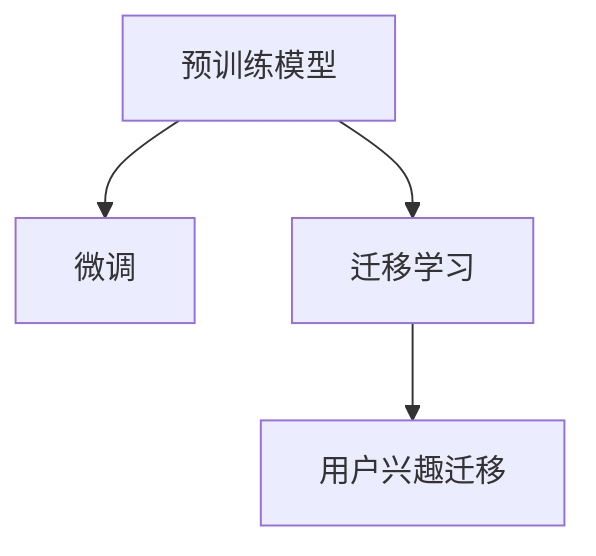

                 

## 1. 背景介绍

在当今数字化时代，电商平台已成为人们日常购物的重要渠道。用户通过电商平台可以便捷地浏览、购买各种商品，并享受购物的乐趣。然而，对于电商平台而言，如何更精准地预测用户兴趣并推荐商品，是提高用户粘性和提升销售额的关键。传统的推荐算法往往依赖用户历史行为数据，但随着用户行为的多样化和复杂化，单一的数据来源已难以充分挖掘用户的潜在需求。

近年来，大模型技术在自然语言处理(NLP)领域取得了显著进展，特别是基于Transformer的预训练模型，如GPT、BERT等，在处理大规模文本数据方面展现出强大的能力。本文聚焦于如何利用大模型技术，通过分析用户的文本评论和反馈，实现用户兴趣的精准迁移，进而提升电商平台推荐系统的精准度。

## 2. 核心概念与联系

为了更好地理解大模型技术在电商平台用户兴趣迁移中的应用，本节将介绍几个核心概念及其相互之间的关系。

### 2.1 核心概念概述

- **大模型技术**：以Transformer结构为代表的大规模预训练语言模型，如GPT、BERT等，通过在大规模无标签文本数据上进行预训练，学习到丰富的语言知识和表示。

- **预训练**：指在大规模无标签文本数据上，通过自监督学习任务训练通用语言模型的过程。预训练使得模型学习到语言的通用表示，可以适应不同的下游任务。

- **微调(Fine-tuning)**：在预训练模型的基础上，使用下游任务的少量标注数据，通过有监督地训练优化模型在特定任务上的性能。微调使得通用大模型更好地适应特定任务，从而提高推荐系统的精准度。

- **迁移学习(Transfer Learning)**：将一个领域学习到的知识，迁移应用到另一个不同但相关的领域的学习范式。通过微调，可以从通用大模型中提取知识，应用于电商平台的用户兴趣迁移。

- **用户兴趣迁移**：基于用户文本评论和反馈，分析其兴趣点的转移和变化，从而为用户提供更个性化和精准的推荐。

### 2.2 核心概念联系

大模型技术在电商平台用户兴趣迁移中的应用，本质上是一个迁移学习的过程。具体而言，通过预训练模型学习到通用的语言知识，然后在电商平台的标注数据上微调，使得模型能够理解和预测用户评论和反馈中的潜在需求，从而实现用户兴趣的精准迁移。这一过程可以概括为如下Mermaid流程图：



这个流程图展示了预训练模型、微调和迁移学习三者之间的关系：

1. **预训练模型**：提供通用的语言表示能力。
2. **微调**：通过特定任务的标注数据，优化模型，使其更好地适应电商平台推荐系统的需求。
3. **迁移学习**：将预训练模型中的知识迁移到用户兴趣迁移任务中，实现个性化推荐。

## 3. 核心算法原理 & 具体操作步骤

### 3.1 算法原理概述

基于大模型的用户兴趣迁移算法，可以分为两个主要阶段：预训练和微调。具体步骤如下：

1. **预训练阶段**：在大规模无标签文本数据上，使用自监督学习任务（如掩码语言模型、下一句预测等）训练预训练模型，学习语言的通用表示。
2. **微调阶段**：在电商平台的标注数据集上，使用微调方法优化预训练模型，使其能够理解和预测用户评论和反馈中的潜在需求，从而实现用户兴趣的精准迁移。

### 3.2 算法步骤详解

#### 3.2.1 预训练模型选择

预训练模型是用户兴趣迁移的基础。目前常用的预训练模型包括GPT系列、BERT、XLNet等。这些模型通过在大规模语料上进行预训练，学习到丰富的语言知识和表示，具备良好的通用性和泛化能力。

#### 3.2.2 数据准备

电商平台的数据通常包含用户的评论、反馈、评分等信息。首先，需要对这些数据进行清洗和标注，确保数据的质量和一致性。

#### 3.2.3 微调模型结构

在微调阶段，需要设计适合电商平台推荐系统的模型结构。一般而言，可以基于预训练模型构建多个任务适配器（如分类、回归、生成器等），每个适配器对应一个特定的推荐任务。例如，分类器用于判断用户评论中的情感极性，生成器用于生成推荐文本，回归器用于预测用户对某商品的评分等。

#### 3.2.4 微调过程

微调过程通常包括以下步骤：

1. **模型初始化**：使用预训练模型的权重作为初始化权重。
2. **数据加载**：将标注数据集加载到模型中，进行前向传播计算。
3. **模型训练**：使用优化器更新模型参数，最小化损失函数。
4. **模型评估**：在验证集上评估模型性能，根据评估结果调整超参数和模型结构。
5. **模型部署**：将微调后的模型部署到推荐系统中，实现实时推荐。

#### 3.2.5 损失函数

在微调过程中，需要选择合适的损失函数。对于分类任务，常用的损失函数包括交叉熵损失、二分类对数损失等；对于回归任务，常用的损失函数包括均方误差损失、平均绝对误差损失等；对于生成任务，常用的损失函数包括负对数似然损失、KL散度损失等。

### 3.3 算法优缺点

#### 3.3.1 优点

- **通用性**：预训练模型在处理大规模文本数据时表现优异，可以适应不同领域和任务的需求。
- **泛化能力**：通过微调，模型能够从标注数据中学习到特定任务的知识，提升推荐系统的精准度。
- **可解释性**：基于大模型的微调方法，其决策过程可以部分解释，便于理解和调试。

#### 3.3.2 缺点

- **数据依赖**：微调的效果很大程度上取决于标注数据的质量和数量，高质量标注数据的获取成本较高。
- **过拟合风险**：微调过程中，如果数据量较少或模型复杂度过高，容易发生过拟合。
- **计算资源消耗大**：大规模预训练模型的参数量通常较大，微调过程中需要大量的计算资源。

### 3.4 算法应用领域

基于大模型的用户兴趣迁移算法，已经在电商平台推荐系统中得到了广泛应用。具体应用场景包括：

- **商品推荐**：通过分析用户评论和评分数据，预测用户对商品的需求，推荐相似商品。
- **用户画像**：构建用户兴趣模型，帮助电商平台了解用户需求和偏好，提升个性化推荐质量。
- **广告投放**：分析用户评论和反馈，优化广告内容，提高广告点击率和转化率。
- **客服服务**：基于用户评论和反馈，提供个性化的客户服务，提升用户满意度。

## 4. 数学模型和公式 & 详细讲解 & 举例说明

### 4.1 数学模型构建

假设电商平台的数据集为 $\{(x_i, y_i)\}_{i=1}^N$，其中 $x_i$ 表示用户评论文本，$y_i$ 表示用户对商品的评分。基于大模型的用户兴趣迁移算法可以形式化为：

$$
\min_{\theta} \mathcal{L}(f_{\theta}(x_i), y_i) = \frac{1}{N} \sum_{i=1}^N \ell(f_{\theta}(x_i), y_i)
$$

其中，$f_{\theta}(x_i)$ 表示基于预训练模型微调后的推荐模型对用户评论 $x_i$ 的预测结果，$\ell$ 表示损失函数。

### 4.2 公式推导过程

对于分类任务，常用的损失函数包括交叉熵损失（Cross-Entropy Loss）：

$$
\ell(f_{\theta}(x_i), y_i) = -\sum_{j=1}^K y_{ij} \log f_{\theta}(x_i)_j
$$

其中，$K$ 表示分类数量，$y_{ij}$ 表示样本 $i$ 在类别 $j$ 上的真实标签。

对于回归任务，常用的损失函数包括均方误差损失（Mean Squared Error，MSE）：

$$
\ell(f_{\theta}(x_i), y_i) = \frac{1}{2} \| f_{\theta}(x_i) - y_i \|_2^2
$$

其中，$\| \cdot \|_2$ 表示L2范数。

对于生成任务，常用的损失函数包括负对数似然损失（Negative Log-Likelihood Loss）：

$$
\ell(f_{\theta}(x_i), y_i) = -\sum_{j=1}^K y_{ij} \log f_{\theta}(x_i)_j
$$

其中，$K$ 表示生成文本中的词汇数量。

### 4.3 案例分析与讲解

以商品推荐任务为例，假设我们需要预测用户对某商品的评分。首先，使用预训练模型 $M_{\theta}$ 对用户评论 $x_i$ 进行编码，得到表示向量 $z_i$。然后，将 $z_i$ 输入到回归器 $f_{\theta}$ 中，得到预测评分 $\hat{y_i}$。最后，使用均方误差损失计算预测值与真实值之间的差异，更新模型参数 $\theta$。

## 5. 项目实践：代码实例和详细解释说明

### 5.1 开发环境搭建

在进行大模型技术应用实践前，需要先搭建好开发环境。以下是Python环境下使用PyTorch和Transformers库搭建环境的步骤：

1. 安装Anaconda并创建虚拟环境。
2. 安装PyTorch和Transformers库。
3. 安装必要的辅助工具，如Numpy、Pandas、Scikit-learn等。
4. 配置GPU/TPU环境。

### 5.2 源代码详细实现

以下是一个基于预训练模型GPT-3进行商品推荐任务的微调示例代码：

```python
import torch
from transformers import GPT3Tokenizer, GPT3ForSequenceClassification
from torch.utils.data import Dataset, DataLoader
from torch.nn import BCELoss, MSELoss

class RecommendationDataset(Dataset):
    def __init__(self, reviews, ratings):
        self.reviews = reviews
        self.ratings = ratings
        self.tokenizer = GPT3Tokenizer.from_pretrained('gpt3')
        
    def __len__(self):
        return len(self.reviews)
    
    def __getitem__(self, idx):
        review = self.reviews[idx]
        rating = self.ratings[idx]
        encoding = self.tokenizer(review, return_tensors='pt')
        input_ids = encoding['input_ids'][0]
        attention_mask = encoding['attention_mask'][0]
        rating_tensor = torch.tensor([rating], dtype=torch.float)
        return {'input_ids': input_ids, 
                'attention_mask': attention_mask,
                'rating': rating_tensor}

# 加载预训练模型
model = GPT3ForSequenceClassification.from_pretrained('gpt3', num_labels=5)

# 加载数据集
train_dataset = RecommendationDataset(train_reviews, train_ratings)
val_dataset = RecommendationDataset(val_reviews, val_ratings)
test_dataset = RecommendationDataset(test_reviews, test_ratings)

# 定义训练和评估函数
device = torch.device('cuda') if torch.cuda.is_available() else torch.device('cpu')
model.to(device)

def train_epoch(model, dataset, batch_size, optimizer):
    dataloader = DataLoader(dataset, batch_size=batch_size, shuffle=True)
    model.train()
    epoch_loss = 0
    for batch in dataloader:
        input_ids = batch['input_ids'].to(device)
        attention_mask = batch['attention_mask'].to(device)
        rating = batch['rating'].to(device)
        model.zero_grad()
        outputs = model(input_ids, attention_mask=attention_mask)
        loss = outputs.loss
        epoch_loss += loss.item()
        loss.backward()
        optimizer.step()
    return epoch_loss / len(dataloader)

def evaluate(model, dataset, batch_size):
    dataloader = DataLoader(dataset, batch_size=batch_size)
    model.eval()
    preds, labels = [], []
    with torch.no_grad():
        for batch in dataloader:
            input_ids = batch['input_ids'].to(device)
            attention_mask = batch['attention_mask'].to(device)
            batch_labels = batch['rating']
            outputs = model(input_ids, attention_mask=attention_mask)
            batch_preds = outputs.logits.argmax(dim=1).to('cpu').tolist()
            batch_labels = batch_labels.to('cpu').tolist()
            for pred, label in zip(batch_preds, batch_labels):
                preds.append(pred.item())
                labels.append(label.item())
                
    print(f'Accuracy: {torch.tensor(preds) == torch.tensor(labels)}.sum().item() / len(labels)')

# 训练和评估模型
epochs = 5
batch_size = 16

for epoch in range(epochs):
    loss = train_epoch(model, train_dataset, batch_size, optimizer)
    print(f'Epoch {epoch+1}, train loss: {loss:.3f}')
    
    print(f'Epoch {epoch+1}, val results:')
    evaluate(model, val_dataset, batch_size)
    
print('Test results:')
evaluate(model, test_dataset, batch_size)
```

### 5.3 代码解读与分析

以上代码展示了如何使用GPT-3模型进行商品推荐任务的微调。具体步骤如下：

1. **数据准备**：首先，定义了一个名为`RecommendationDataset`的Dataset类，用于加载和预处理电商平台的用户评论和评分数据。
2. **模型初始化**：使用预训练模型GPT-3，加载对应的权重和配置。
3. **数据加载**：将训练集、验证集和测试集分别加载到模型中，进行前向传播计算。
4. **模型训练**：使用优化器更新模型参数，最小化损失函数。
5. **模型评估**：在验证集和测试集上评估模型性能。

需要注意的是，由于GPT-3模型本身比较复杂，代码实现时可能会遇到一些性能瓶颈，需要进行针对性的优化。例如，可以采用分布式训练、模型裁剪、混合精度训练等技术，提升模型的训练和推理效率。

## 6. 实际应用场景

### 6.1 电商平台推荐系统

在电商平台推荐系统中，基于大模型的用户兴趣迁移算法可以显著提升推荐系统的精准度。具体而言，通过分析用户评论和评分数据，模型可以理解用户的购买倾向和需求，从而生成个性化的推荐结果。

### 6.2 用户画像构建

电商平台可以根据用户的购买历史、评论内容等数据，构建详细的用户画像。这些画像可以用于个性化推荐、广告投放等场景，提升用户体验和业务价值。

### 6.3 广告推荐

通过分析用户的评论和反馈，可以优化广告内容，提升广告点击率和转化率。大模型的用户兴趣迁移算法可以预测用户对不同广告的兴趣，从而实现精准投放。

### 6.4 未来应用展望

未来，大模型技术在电商平台用户兴趣迁移中的应用将更加广泛。例如，结合用户行为数据和实时反馈，可以实现动态推荐，提高推荐系统的实时性和精准度。此外，结合其他AI技术，如图像识别、语音识别等，可以实现多模态推荐，提升推荐系统的多样性和趣味性。

## 7. 工具和资源推荐

### 7.1 学习资源推荐

1. **《自然语言处理基础》**：了解自然语言处理的基本概念和技术，为后续学习大模型技术打下基础。
2. **《Transformers实战》**：介绍如何使用Transformers库进行NLP任务开发，包括微调在内的多种范式。
3. **HuggingFace官方文档**：提供丰富的预训练模型和微调样例，适合上手实践。

### 7.2 开发工具推荐

1. **PyTorch**：灵活的动态计算图，适合快速迭代研究。
2. **TensorFlow**：生产部署方便，适合大规模工程应用。
3. **Transformers库**：封装了多种预训练模型，支持微调任务开发。

### 7.3 相关论文推荐

1. **《BERT: Pre-training of Deep Bidirectional Transformers for Language Understanding》**：介绍BERT模型的预训练和微调过程，刷新了多项NLP任务SOTA。
2. **《AdaLoRA: Adaptive Low-Rank Adaptation for Parameter-Efficient Fine-Tuning》**：提出AdaLoRA方法，在参数效率和精度之间取得新的平衡。
3. **《AdaLM: Adaptive Learning Rate for Continual Learning with Multiple Tasks》**：提出AdaLM方法，解决模型持续学习和任务迁移的问题。

## 8. 总结：未来发展趋势与挑战

### 8.1 研究成果总结

本文介绍了基于大模型的用户兴趣迁移算法在电商平台推荐系统中的应用。通过预训练和微调，模型可以理解用户评论和反馈中的潜在需求，实现精准推荐。未来，随着大模型技术的发展和应用场景的拓展，基于大模型的用户兴趣迁移算法将更加广泛地应用于各个领域。

### 8.2 未来发展趋势

1. **模型规模增大**：随着算力成本的下降和数据规模的扩张，预训练模型的参数量将进一步增大，从而提升模型的性能和泛化能力。
2. **计算效率提升**：采用分布式训练、混合精度训练等技术，提升模型的训练和推理效率。
3. **多模态融合**：结合图像、语音等多种模态数据，实现多模态推荐，提升推荐系统的多样性和准确性。

### 8.3 面临的挑战

1. **数据质量和标注成本**：高质量标注数据的获取和维护成本较高，限制了模型的应用范围。
2. **模型复杂度和资源消耗**：大模型复杂度高，计算资源消耗大，需要优化模型结构，降低资源消耗。
3. **模型的可解释性和鲁棒性**：大模型往往具有黑盒特性，缺乏可解释性，且对输入数据的扰动较为敏感。

### 8.4 研究展望

未来，大模型技术在电商平台用户兴趣迁移中的应用将面临更多的挑战。如何降低数据标注成本，提升模型可解释性，增强模型鲁棒性，是需要深入研究的课题。结合其他AI技术，如知识图谱、因果推理等，将进一步提升模型的性能和应用效果。

## 9. 附录：常见问题与解答

### Q1：大模型技术在电商平台推荐系统中如何降低数据标注成本？

A: 可以通过结合用户行为数据和实时反馈，使用半监督学习和主动学习等技术，减少对标注数据的依赖。例如，在电商平台推荐系统中，可以使用用户点击数据和转化数据进行模型训练，从而降低数据标注成本。

### Q2：大模型技术如何实现个性化推荐？

A: 通过分析用户评论和评分数据，构建用户兴趣模型，预测用户对不同商品的兴趣，从而实现个性化推荐。具体而言，可以使用分类器预测用户对商品类别的偏好，使用回归器预测用户对商品评分的期望，结合生成器生成推荐文本，提高推荐系统的多样性和个性化。

### Q3：大模型技术在电商平台推荐系统中如何避免过拟合？

A: 可以使用正则化技术（如L2正则、Dropout等），限制模型的复杂度，防止过拟合。此外，可以使用对抗训练和数据增强等技术，提升模型的鲁棒性和泛化能力。

### Q4：大模型技术在电商平台推荐系统中如何提升实时性？

A: 可以通过分布式训练、模型裁剪、混合精度训练等技术，提升模型的训练和推理效率，从而实现实时推荐。同时，结合其他AI技术，如流计算和缓存技术，实现高效的实时推荐系统。

### Q5：大模型技术在电商平台推荐系统中如何提高推荐系统的多样性？

A: 可以结合图像、语音等多种模态数据，实现多模态推荐。例如，在商品推荐系统中，结合商品的图像和用户评论中的情感极性，生成更具吸引力的推荐结果。同时，使用生成模型（如GPT-3）生成个性化的推荐文本，提高推荐系统的多样性和趣味性。

---

作者：禅与计算机程序设计艺术 / Zen and the Art of Computer Programming

