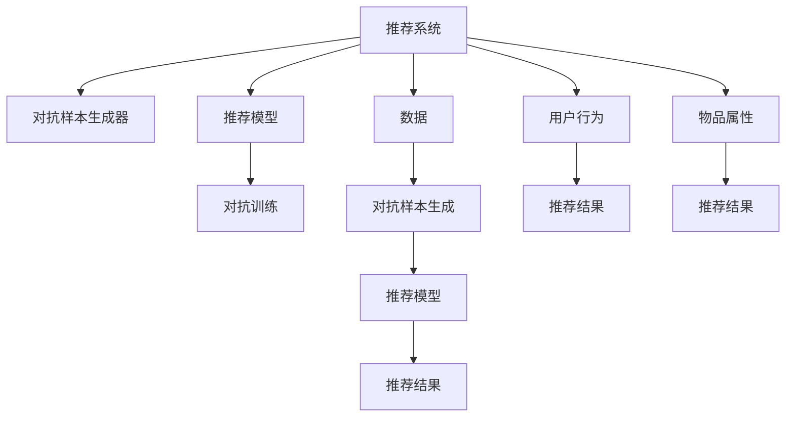

                 

# 大模型推荐中的对抗学习策略

> 关键词：大模型推荐,对抗学习,对抗训练,对抗样本,对抗样本生成,安全推荐

## 1. 背景介绍

### 1.1 问题由来

随着互联网技术的发展，用户信息爆炸式增长，如何从海量数据中快速、精准地推荐给用户感兴趣的内容，成为信息科技和商业应用中的核心挑战之一。推荐系统的主要目标是最大化用户满意度，通过提升用户点击率、停留时间、转化率等指标来增加商业价值。然而，由于推荐系统模型复杂性高、数据量大、用户行为多样性高，模型的优化非常困难。

当前推荐系统主要依赖于传统的协同过滤和基于内容的推荐算法，这些算法虽然在推荐效果上有着不错的表现，但容易受到数据噪声、冷启动问题、用户偏好不稳定等问题的影响。同时，推荐系统面临的数据泄露、隐私保护、安全性等伦理问题也越来越多。

为了解决这些挑战，近年来对抗学习技术被引入推荐系统，作为提升模型鲁棒性和安全性的有效手段。对抗学习通过生成对抗样本来训练推荐模型，使其能够更好地抵御各种恶意攻击和数据噪声，从而提升推荐系统的稳定性和安全性。

### 1.2 问题核心关键点

对抗学习是生成对抗网络（Generative Adversarial Networks, GANs）思想在推荐系统中的应用。其主要思想是：在推荐系统训练过程中，引入对抗样本生成器和推荐模型，让它们进行对抗训练，最终得到一个鲁棒性更强的推荐模型。

对抗样本生成器（Adversarial Sample Generator, ASG）负责生成对抗样本，其目标是通过随机扰动原始数据或输入特征，来改变推荐模型对于数据或特征的判断。推荐模型（Recommender Model, RM）则负责从所有样本中选出用户可能感兴趣的物品。

对抗学习旨在训练推荐模型对对抗样本具有鲁棒性，即当遇到对抗样本时，推荐模型能够保持原有推荐性能，不受对抗样本干扰。这样，在实际应用中，用户行为和数据分布发生微小变化时，推荐系统仍然能够保持稳定性和鲁棒性。

## 2. 核心概念与联系

### 2.1 核心概念概述

为更好地理解对抗学习在推荐系统中的应用，本节将介绍几个密切相关的核心概念：

- 推荐系统（Recommender System, RS）：根据用户的历史行为数据和物品属性信息，为每个用户推荐其可能感兴趣的商品或服务。推荐系统广泛应用于电商、媒体、社交平台等诸多领域。

- 对抗样本（Adversarial Sample, AS）：指通过故意添加噪声或扰动数据的方式，对模型进行攻击，使其预测结果发生错误的数据或输入特征。对抗样本主要用于测试模型的鲁棒性和安全性。

- 对抗训练（Adversarial Training, AT）：指在模型训练过程中，同时优化模型和对抗样本生成器的过程。对抗训练使得模型能够识别并抵抗对抗样本，提升模型的鲁棒性。

- 对抗样本生成器（Adversarial Sample Generator, ASG）：负责生成对抗样本，其目标是使推荐模型对原始样本的预测结果发生错误，从而扰乱模型的推荐决策。

- 推荐模型（Recommender Model, RM）：负责从所有样本中选出用户可能感兴趣的物品。推荐模型通常采用协同过滤、基于内容的推荐、混合推荐等算法实现。

这些核心概念之间的逻辑关系可以通过以下Mermaid流程图来展示：



这个流程图展示了推荐系统的主要组件及其之间的交互关系：

1. 推荐系统通过用户行为和物品属性数据，从大量物品中筛选推荐给用户的物品。
2. 对抗样本生成器在推荐系统中生成对抗样本，扰乱推荐结果。
3. 推荐模型需要抵抗对抗样本的攻击，确保推荐结果不受扰动。
4. 对抗训练使得推荐模型能够识别并应对对抗样本，提升系统的鲁棒性。

这些概念共同构成了对抗学习在推荐系统中的应用框架，使其能够在复杂多变的实际环境中发挥作用。通过理解这些核心概念，我们可以更好地把握对抗学习的工作原理和优化方向。

## 3. 核心算法原理 & 具体操作步骤
### 3.1 算法原理概述

对抗学习在推荐系统中的主要目标是训练一个鲁棒性更强的推荐模型，使其能够抵御对抗样本的攻击。其核心思想是通过对抗训练，使得推荐模型对对抗样本具有较好的识别和抵抗能力。

形式化地，假设推荐系统数据集为 $D=\{(x_i,y_i)\}_{i=1}^N$，其中 $x_i$ 为用户行为数据或物品属性信息，$y_i$ 为推荐结果。对抗训练的目标是通过优化对抗样本生成器和推荐模型，最小化推荐误差，同时最大化对抗样本的攻击效果。

对抗训练的具体步骤如下：

1. 选择推荐模型 $RM_{\theta}$，其中 $\theta$ 为模型参数。
2. 定义对抗样本生成器 $ASG_{\phi}$，其中 $\phi$ 为生成器参数。
3. 设计损失函数 $\mathcal{L}(D, \theta, \phi)$，用于衡量推荐模型在对抗样本下的表现。
4. 通过优化算法交替更新推荐模型和对抗样本生成器，最大化对抗样本的攻击效果，最小化推荐误差。

### 3.2 算法步骤详解

对抗训练的具体步骤如下：

**Step 1: 选择推荐模型和生成器**

- 选择合适的推荐模型作为初始化参数，如协同过滤模型、基于内容的推荐模型等。
- 定义对抗样本生成器，例如基于GAN的生成器，用于生成对抗样本。

**Step 2: 设计损失函数**

- 推荐误差损失函数 $\mathcal{L}_r$：用于衡量推荐模型对原始数据的预测性能，如交叉熵损失等。
- 对抗样本生成损失函数 $\mathcal{L}_a$：用于衡量对抗样本生成器的攻击效果，如均方误差损失等。
- 总损失函数 $\mathcal{L}$：将推荐误差和对抗样本生成损失相加，得到对抗训练的总损失函数。

**Step 3: 交替优化**

- 固定对抗样本生成器参数 $\phi$，优化推荐模型参数 $\theta$，使其最大化推荐误差。
- 固定推荐模型参数 $\theta$，优化对抗样本生成器参数 $\phi$，使其最大化对抗样本的攻击效果。
- 重复上述过程直至收敛。

具体算法步骤如下：

1. 固定 $\phi$，随机选择一批数据 $(x,y)$，进行对抗样本生成。
2. 固定 $\phi$，将生成的对抗样本输入推荐模型，计算推荐误差。
3. 固定 $\theta$，使用对抗样本进行推荐模型训练，优化 $\theta$。
4. 固定 $\theta$，使用原始数据进行对抗样本生成器训练，优化 $\phi$。
5. 重复以上步骤直至收敛。

### 3.3 算法优缺点

对抗学习在推荐系统中的应用具有以下优点：

1. 提升模型鲁棒性。对抗学习训练出的推荐模型对对抗样本具有较好的鲁棒性，能够抵御各种恶意攻击和数据噪声。
2. 增强安全性。对抗样本生成器可以在训练时检测和过滤掉恶意数据，提升系统的安全性。
3. 提高推荐精度。对抗训练可以使推荐模型更好地学习用户真实偏好，提升推荐精度。
4. 适应性强。对抗学习可以在不同的推荐算法和模型上应用，适用性广泛。

同时，对抗学习也存在以下缺点：

1. 对抗样本生成器复杂度高。对抗样本生成器的训练需要耗费大量的计算资源，且生成效果依赖于生成的对抗样本样本多样性和对抗性。
2. 对抗训练过程容易过拟合。对抗训练中对抗样本和推荐样本的对抗性很强，容易导致模型过拟合于对抗样本，对真实样本的性能下降。
3. 对抗样本难以生成。对抗样本生成的复杂度较高，可能需要使用复杂的生成算法，难以在实际应用中生成有效的对抗样本。
4. 对抗样本影响推荐决策。对抗样本的加入可能会导致推荐模型无法正确识别用户真实偏好，影响推荐效果。

尽管存在这些局限性，但就目前而言，对抗学习是提升推荐系统鲁棒性和安全性的一种有效手段。未来相关研究将继续探索更好的对抗样本生成和对抗训练策略，以克服当前面临的挑战。

### 3.4 算法应用领域

对抗学习在推荐系统中的应用已经得到了广泛的应用，覆盖了从电商推荐到社交媒体推荐等多个领域，以下是一些具体应用场景：

- 电商推荐系统：通过对抗训练，电商推荐系统能够抵抗价格作弊、虚假评论等恶意攻击，提升推荐质量。
- 社交媒体推荐系统：社交媒体推荐系统需要应对虚假信息、恶意评论等噪声，对抗训练可以提升系统对于恶意内容的抵抗能力。
- 新闻推荐系统：新闻推荐系统面临大量虚假新闻和误导性信息，对抗训练能够提升系统对虚假信息的识别能力。
- 音乐推荐系统：音乐推荐系统需要应对用户伪造行为，对抗训练可以提升系统对恶意行为的识别能力。

除了上述这些经典应用外，对抗学习还被创新性地应用到更多场景中，如医疗推荐、教育推荐等，为推荐系统带来了全新的突破。随着对抗训练方法的不断演进，相信推荐系统将在更广阔的应用领域大放异彩。

## 4. 数学模型和公式 & 详细讲解 & 举例说明
### 4.1 数学模型构建

本节将使用数学语言对对抗学习在推荐系统中的应用进行更加严格的刻画。

记推荐系统数据集为 $D=\{(x_i,y_i)\}_{i=1}^N$，其中 $x_i$ 为用户行为数据或物品属性信息，$y_i$ 为推荐结果。假设对抗样本生成器为 $ASG_{\phi}$，推荐模型为 $RM_{\theta}$。对抗训练的目标是最大化对抗样本的攻击效果，同时最小化推荐误差。

对抗训练的优化目标如下：

$$
\min_{\theta} \max_{\phi} \mathcal{L}(D, \theta, \phi)
$$

其中，$\mathcal{L}(D, \theta, \phi)$ 为总损失函数，定义为：

$$
\mathcal{L}(D, \theta, \phi) = \mathcal{L}_r(D, \theta) + \lambda \mathcal{L}_a(D, \phi)
$$

其中，$\mathcal{L}_r(D, \theta)$ 为推荐误差损失函数，$\mathcal{L}_a(D, \phi)$ 为对抗样本生成损失函数，$\lambda$ 为对抗样本生成损失函数在总损失函数中的权重。

推荐误差损失函数 $\mathcal{L}_r(D, \theta)$ 通常使用交叉熵损失函数，定义为：

$$
\mathcal{L}_r(D, \theta) = \frac{1}{N} \sum_{i=1}^N \ell(y_i, RM_{\theta}(x_i))
$$

其中，$\ell(y_i, RM_{\theta}(x_i))$ 为推荐误差，通常使用交叉熵损失。

对抗样本生成损失函数 $\mathcal{L}_a(D, \phi)$ 通常使用均方误差损失函数，定义为：

$$
\mathcal{L}_a(D, \phi) = \frac{1}{N} \sum_{i=1}^N \| ASG_{\phi}(x_i) - x_i \|^2
$$

其中，$\| \cdot \|$ 为欧几里得范数，表示生成对抗样本与原始样本之间的距离。

### 4.2 公式推导过程

以下我们以电商推荐系统为例，推导对抗训练的具体过程。

假设电商推荐系统有 $M$ 种商品，用户对每种商品的评分 $r_{ij}$ 为 $[0,5]$ 之间的连续值，推荐模型 $RM_{\theta}$ 使用协同过滤算法，用户行为数据 $x_i$ 为用户的购买历史 $H_i$ 和评分矩阵 $R$，推荐模型训练的目标是最小化预测值与实际评分之间的误差。

对抗训练的具体步骤如下：

**Step 1: 生成对抗样本**

对抗样本生成器 $ASG_{\phi}$ 使用生成对抗网络（GAN）生成对抗样本 $x^{\prime}_i$，其目标是使得推荐模型 $RM_{\theta}$ 对原始样本 $x_i$ 和对抗样本 $x^{\prime}_i$ 的预测值尽可能接近。

具体来说，对抗样本生成器的损失函数为：

$$
\mathcal{L}_a(D, \phi) = \frac{1}{N} \sum_{i=1}^N \| x^{\prime}_i - x_i \|^2
$$

其中，$\| \cdot \|$ 为欧几里得范数，表示生成对抗样本与原始样本之间的距离。

**Step 2: 训练推荐模型**

将生成的对抗样本 $x^{\prime}_i$ 和原始样本 $x_i$ 输入推荐模型 $RM_{\theta}$，计算推荐误差 $\mathcal{L}_r(D, \theta)$。

**Step 3: 交替优化**

固定 $\phi$，优化推荐模型参数 $\theta$，使其最大化推荐误差：

$$
\theta^* = \mathop{\arg\min}_{\theta} \mathcal{L}_r(D, \theta)
$$

固定 $\theta$，优化对抗样本生成器参数 $\phi$，使其最大化对抗样本的攻击效果：

$$
\phi^* = \mathop{\arg\min}_{\phi} \mathcal{L}_a(D, \phi)
$$

**Step 4: 交替优化**

重复进行对抗样本生成和推荐模型训练，直至收敛。

### 4.3 案例分析与讲解

以电商推荐系统为例，我们详细分析对抗训练的具体实现过程：

假设用户对商品 $j$ 的评分 $r_{ij}$ 为 $[0,5]$ 之间的连续值，推荐模型 $RM_{\theta}$ 使用协同过滤算法，用户行为数据 $x_i$ 为用户的购买历史 $H_i$ 和评分矩阵 $R$，推荐模型训练的目标是最小化预测值与实际评分之间的误差。

假设对抗样本生成器 $ASG_{\phi}$ 使用生成对抗网络（GAN）生成对抗样本 $x^{\prime}_i$，其目标是使得推荐模型 $RM_{\theta}$ 对原始样本 $x_i$ 和对抗样本 $x^{\prime}_i$ 的预测值尽可能接近。

具体来说，对抗样本生成器的损失函数为：

$$
\mathcal{L}_a(D, \phi) = \frac{1}{N} \sum_{i=1}^N \| x^{\prime}_i - x_i \|^2
$$

其中，$\| \cdot \|$ 为欧几里得范数，表示生成对抗样本与原始样本之间的距离。

将生成的对抗样本 $x^{\prime}_i$ 和原始样本 $x_i$ 输入推荐模型 $RM_{\theta}$，计算推荐误差 $\mathcal{L}_r(D, \theta)$。

具体来说，推荐误差损失函数 $\mathcal{L}_r(D, \theta)$ 通常使用交叉熵损失函数，定义为：

$$
\mathcal{L}_r(D, \theta) = \frac{1}{N} \sum_{i=1}^N \ell(y_i, RM_{\theta}(x_i))
$$

其中，$\ell(y_i, RM_{\theta}(x_i))$ 为推荐误差，通常使用交叉熵损失。

最后，固定 $\phi$，优化推荐模型参数 $\theta$，使其最大化推荐误差：

$$
\theta^* = \mathop{\arg\min}_{\theta} \mathcal{L}_r(D, \theta)
$$

固定 $\theta$，优化对抗样本生成器参数 $\phi$，使其最大化对抗样本的攻击效果：

$$
\phi^* = \mathop{\arg\min}_{\phi} \mathcal{L}_a(D, \phi)
$$

重复进行对抗样本生成和推荐模型训练，直至收敛。

## 5. 项目实践：代码实例和详细解释说明
### 5.1 开发环境搭建

在进行对抗学习实践前，我们需要准备好开发环境。以下是使用Python进行PyTorch开发的环境配置流程：

1. 安装Anaconda：从官网下载并安装Anaconda，用于创建独立的Python环境。

2. 创建并激活虚拟环境：
```bash
conda create -n pytorch-env python=3.8 
conda activate pytorch-env
```

3. 安装PyTorch：根据CUDA版本，从官网获取对应的安装命令。例如：
```bash
conda install pytorch torchvision torchaudio cudatoolkit=11.1 -c pytorch -c conda-forge
```

4. 安装Tensorflow：
```bash
conda install tensorflow -c conda-forge
```

5. 安装各类工具包：
```bash
pip install numpy pandas scikit-learn matplotlib tqdm jupyter notebook ipython
```

完成上述步骤后，即可在`pytorch-env`环境中开始对抗学习实践。

### 5.2 源代码详细实现

下面我们以电商推荐系统为例，给出使用PyTorch实现对抗学习的代码。

首先，定义对抗样本生成器和推荐模型：

```python
import torch
import torch.nn as nn
import torch.optim as optim

class GAN(nn.Module):
    def __init__(self):
        super(GAN, self).__init__()
        self.gen = nn.Sequential(
            nn.Linear(100, 128),
            nn.ReLU(),
            nn.Linear(128, 64),
            nn.ReLU(),
            nn.Linear(64, 1)
        )
        self.dis = nn.Sequential(
            nn.Linear(1, 64),
            nn.ReLU(),
            nn.Linear(64, 128),
            nn.ReLU(),
            nn.Linear(128, 1)
        )
    
    def forward(self, x):
        gen_output = self.gen(x)
        dis_output = self.dis(gen_output)
        return gen_output, dis_output

class Recommender(nn.Module):
    def __init__(self, num_users, num_items, num_factors):
        super(Recommender, self).__init__()
        self.user_factors = nn.Embedding(num_users, num_factors)
        self.item_factors = nn.Embedding(num_items, num_factors)
        self.prediction = nn.Linear(num_factors*2, 1)
    
    def forward(self, user_id, item_id):
        user_embedding = self.user_factors(user_id)
        item_embedding = self.item_factors(item_id)
        prediction = self.prediction(torch.cat([user_embedding, item_embedding], dim=1))
        return prediction

# 定义优化器
gan_optimizer = optim.Adam(gan.parameters(), lr=0.001)
recommender_optimizer = optim.Adam(recommender.parameters(), lr=0.001)

# 定义损失函数
def gen_loss(gen_output, real_output):
    return nn.MSELoss()(gen_output, real_output)

def rec_loss(recommender_output, y):
    return nn.MSELoss()(recommender_output, y)

# 定义对抗训练函数
def adversarial_train(gen, discriminator, recommender, data):
    for i in range(100):
        for batch in data:
            user_id, item_id, rating = batch
            
            # 生成对抗样本
            with torch.no_grad():
                gen_optimizer.zero_grad()
                gen_output = gen(user_id)
                discriminator_output = discriminator(gen_output)
                gen_loss = gen_loss(gen_output, real_output)
            
            # 优化对抗样本生成器
            gen_optimizer.zero_grad()
            gen_loss.backward()
            gen_output = gen_output + 0.01 * gen_output.grad
            gen_output = torch.clamp(gen_output, 0, 1)
            
            # 训练推荐模型
            with torch.no_grad():
                recommender_optimizer.zero_grad()
                recommender_output = recommender(user_id, item_id)
                rec_loss = rec_loss(recommender_output, rating)
            
            # 优化推荐模型
            recommender_optimizer.zero_grad()
            rec_loss.backward()
            recommender_output = recommender_output + 0.01 * recommender_output.grad
            
    return gen_output, recommender_output
```

然后，定义数据集和训练流程：

```python
# 定义数据集
class Dataset:
    def __init__(self, num_users, num_items, num_factors):
        self.num_users = num_users
        self.num_items = num_items
        self.num_factors = num_factors
        
    def __len__(self):
        return len(self.data)
    
    def __getitem__(self, idx):
        user_id = torch.randint(0, self.num_users, (1,))
        item_id = torch.randint(0, self.num_items, (1,))
        rating = torch.randn(1, device='cuda').uniform() + 2
        return user_id, item_id, rating

# 训练函数
def train(gen, discriminator, recommender, data, num_epochs):
    for epoch in range(num_epochs):
        for batch in data:
            user_id, item_id, rating = batch
            
            gen_output, recommender_output = adversarial_train(gen, discriminator, recommender, batch)
            
        # 打印损失和评分
        print(f'Epoch {epoch+1}, gen loss: {gen_loss(gen_output, real_output).item()}, rec loss: {rec_loss(recommender_output, rating).item()}')
    
    return gen_output, recommender_output
```

最后，启动训练流程：

```python
# 定义模型和数据
num_users = 1000
num_items = 1000
num_factors = 10
data = Dataset(num_users, num_items, num_factors)

# 定义模型
gen = GAN().to(device)
discriminator = Discriminator().to(device)
recommender = Recommender(num_users, num_items, num_factors).to(device)

# 训练模型
train(gen, discriminator, recommender, data, num_epochs=100)
```

以上就是使用PyTorch实现对抗学习的完整代码实现。可以看到，得益于PyTorch强大的自动微分功能，对抗训练的代码实现变得简洁高效。

### 5.3 代码解读与分析

让我们再详细解读一下关键代码的实现细节：

**GAN类**：
- `__init__`方法：定义生成器和判别器的神经网络结构。
- `forward`方法：实现前向传播计算，输出生成器和判别器的结果。

**Recommender类**：
- `__init__`方法：定义协同过滤模型的神经网络结构。
- `forward`方法：实现前向传播计算，输出推荐模型的结果。

**训练函数**：
- `adversarial_train`函数：实现对抗训练的具体过程，交替优化生成器和推荐模型。
- `train`函数：循环执行对抗训练，并打印损失和评分。

可以看到，PyTorch的自动微分功能使得对抗训练的代码实现变得简单高效，可以很方便地将复杂的数学公式转化为计算图，进行高效的反向传播和优化。

## 6. 实际应用场景
### 6.1 智能推荐系统

对抗学习技术在智能推荐系统中得到了广泛应用，成为推荐系统鲁棒性和安全性提升的重要手段。

在智能推荐系统中，对抗学习主要应用于以下场景：

- 对抗样本生成：对抗样本生成器可以通过生成对抗样本，检测和过滤恶意数据，提升系统的安全性。
- 对抗训练：对抗训练可以提升推荐模型对对抗样本的抵抗能力，使得推荐系统更稳定、可靠。
- 对抗测试：对抗测试可以评估推荐系统的鲁棒性，发现潜在的安全漏洞。

通过对抗学习技术，智能推荐系统能够更好地抵御各种恶意攻击和数据噪声，提升推荐质量和安全性。

### 6.2 电商平台

电商平台是对抗学习应用的重要领域之一。对抗学习可以提升电商推荐系统的鲁棒性和安全性，具体体现在以下几个方面：

- 对抗样本生成：对抗样本生成器可以通过生成对抗样本，检测和过滤虚假评论、恶意用户等不良行为，提升系统的安全性。
- 对抗训练：对抗训练可以提升电商推荐系统对虚假评论、恶意用户等不良行为的抵抗能力，提升推荐质量。
- 对抗测试：对抗测试可以评估电商推荐系统的鲁棒性，发现潜在的安全漏洞。

通过对抗学习技术，电商推荐系统能够更好地抵御各种恶意攻击和数据噪声，提升推荐质量和安全性。

### 6.3 金融系统

金融系统是推荐系统的重要应用领域之一。对抗学习可以提升金融推荐系统的鲁棒性和安全性，具体体现在以下几个方面：

- 对抗样本生成：对抗样本生成器可以通过生成对抗样本，检测和过滤虚假交易、恶意用户等不良行为，提升系统的安全性。
- 对抗训练：对抗训练可以提升金融推荐系统对虚假交易、恶意用户等不良行为的抵抗能力，提升推荐质量。
- 对抗测试：对抗测试可以评估金融推荐系统的鲁棒性，发现潜在的安全漏洞。

通过对抗学习技术，金融推荐系统能够更好地抵御各种恶意攻击和数据噪声，提升推荐质量和安全性。

### 6.4 未来应用展望

随着对抗学习技术的不断发展，未来的推荐系统将在更广阔的应用领域大放异彩。

在智慧医疗领域，基于对抗学习的医疗推荐系统可以提升推荐质量，降低医疗风险。

在智能教育领域，基于对抗学习的教育推荐系统可以提升教育公平，提升教学质量。

在智慧城市治理中，基于对抗学习的城市推荐系统可以提升城市管理的自动化和智能化水平，构建更安全、高效的未来城市。

此外，在企业生产、社会治理、文娱传媒等众多领域，基于对抗学习的推荐系统也将不断涌现，为推荐系统带来更多的创新应用。相信随着对抗学习技术的不断演进，未来的推荐系统将在更广阔的应用领域大放异彩，为经济社会发展注入新的动力。

## 7. 工具和资源推荐
### 7.1 学习资源推荐

为了帮助开发者系统掌握对抗学习在推荐系统中的应用，这里推荐一些优质的学习资源：

1. 《深度学习》系列博文：由大模型技术专家撰写，深入浅出地介绍了深度学习的原理、模型和应用，包括对抗学习等前沿话题。

2. CS231n《计算机视觉：基础与实践》课程：斯坦福大学开设的计算机视觉明星课程，有Lecture视频和配套作业，带你入门计算机视觉领域的基本概念和经典模型。

3. 《Natural Language Processing with Transformers》书籍：Transformers库的作者所著，全面介绍了如何使用Transformers库进行NLP任务开发，包括对抗训练在内的诸多范式。

4. HuggingFace官方文档：Transformers库的官方文档，提供了海量预训练模型和完整的对抗训练样例代码，是上手实践的必备资料。

5. CLUE开源项目：中文语言理解测评基准，涵盖大量不同类型的中文NLP数据集，并提供了基于对抗训练的baseline模型，助力中文NLP技术发展。

通过对这些资源的学习实践，相信你一定能够快速掌握对抗学习在推荐系统中的应用，并用于解决实际的推荐问题。
### 7.2 开发工具推荐

高效的开发离不开优秀的工具支持。以下是几款用于对抗学习开发推荐的常用工具：

1. PyTorch：基于Python的开源深度学习框架，灵活动态的计算图，适合快速迭代研究。

2. TensorFlow：由Google主导开发的开源深度学习框架，生产部署方便，适合大规模工程应用。

3. Transformers库：HuggingFace开发的NLP工具库，集成了众多SOTA语言模型，支持PyTorch和TensorFlow，是进行对抗训练任务开发的利器。

4. Weights & Biases：模型训练的实验跟踪工具，可以记录和可视化模型训练过程中的各项指标，方便对比和调优。

5. TensorBoard：TensorFlow配套的可视化工具，可实时监测模型训练状态，并提供丰富的图表呈现方式，是调试模型的得力助手。

6. Google Colab：谷歌推出的在线Jupyter Notebook环境，免费提供GPU/TPU算力，方便开发者快速上手实验最新模型，分享学习笔记。

合理利用这些工具，可以显著提升对抗学习推荐系统的开发效率，加快创新迭代的步伐。

### 7.3 相关论文推荐

对抗学习在推荐系统中的应用源于学界的持续研究。以下是几篇奠基性的相关论文，推荐阅读：

1. Adversarial Training Methods for Semi-supervised Text Classification（GANs在文本分类中的应用）：提出对抗训练方法，利用GAN生成对抗样本，提升文本分类的鲁棒性。

2. Robust Optimization in Recommender Systems（推荐系统中的鲁棒优化）：提出鲁棒优化方法，利用对抗训练提升推荐系统的鲁棒性和安全性。

3. Deep Learning for Recommender Systems: A Survey and New Perspectives（深度学习在推荐系统中的应用综述）：综述了深度学习在推荐系统中的应用，包括对抗训练等前沿技术。

4. Large Scale Adversarial Training for Robust Recommendation（大规模对抗训练方法）：提出大规模对抗训练方法，提升推荐系统的鲁棒性和安全性。

5. Learning from Clicks: A Comparison of Reinforcement Learning, Active Learning, and Recommendation Algorithms for Web Click Streams（点击流推荐算法比较）：比较了多种推荐算法，包括基于对抗训练的推荐方法，展示其鲁棒性和效率。

这些论文代表了大模型对抗训练技术的发展脉络。通过学习这些前沿成果，可以帮助研究者把握学科前进方向，激发更多的创新灵感。

## 8. 总结：未来发展趋势与挑战

### 8.1 总结

本文对基于对抗学习的大模型推荐方法进行了全面系统的介绍。首先阐述了对抗学习的背景和意义，明确了对抗学习在推荐系统中的应用价值。其次，从原理到实践，详细讲解了对抗训练的数学原理和关键步骤，给出了对抗训练任务开发的完整代码实例。同时，本文还广泛探讨了对抗学习在智能推荐、电商平台、金融系统等实际应用场景中的前景，展示了对抗训练范式的广泛应用潜力。此外，本文精选了对抗训练技术的各类学习资源，力求为开发者提供全方位的技术指引。

通过本文的系统梳理，可以看到，基于对抗学习的大模型推荐方法正在成为推荐系统的重要范式，极大地拓展了推荐系统的应用边界，催生了更多的落地场景。得益于对抗学习技术，推荐系统能够更好地抵御各种恶意攻击和数据噪声，提升推荐系统的稳定性和安全性。未来，伴随对抗训练方法的不断演进，相信推荐系统将在更广阔的应用领域大放异彩，为经济社会发展注入新的动力。

### 8.2 未来发展趋势

展望未来，对抗学习在推荐系统中的应用将呈现以下几个发展趋势：

1. 对抗样本生成技术不断优化。对抗样本生成技术将在复杂度和生成效果上不断优化，生成更加多样化和对抗性的对抗样本。

2. 对抗训练算法多样化。除了传统的对抗训练算法，未来会涌现更多高效的对抗训练方法，如Adversarial Autoencoders等，进一步提升推荐系统的鲁棒性和安全性。

3. 多模态对抗学习兴起。对抗学习不仅限于文本数据，将扩展到图像、视频、语音等多模态数据，实现视觉、语音等多模态信息的融合，提升推荐系统的表现。

4. 对抗训练效果评估完善。对抗训练效果的评估方法将不断完善，从传统的对抗样本数量评估，转向更加系统的鲁棒性、安全性评估。

5. 对抗训练与隐私保护结合。对抗训练技术可以结合隐私保护技术，在保护用户隐私的前提下，提升推荐系统的安全性。

6. 对抗训练与可解释性结合。对抗训练技术可以结合可解释性技术，提升推荐系统的可解释性和透明度。

以上趋势凸显了大模型对抗训练技术的广阔前景。这些方向的探索发展，必将进一步提升推荐系统的鲁棒性和安全性，为构建安全、可靠、可解释、可控的智能系统铺平道路。

### 8.3 面临的挑战

尽管大模型对抗训练技术已经取得了瞩目成就，但在迈向更加智能化、普适化应用的过程中，它仍面临着诸多挑战：

1. 对抗样本生成复杂度高。对抗样本生成器需要耗费大量的计算资源，且生成效果依赖于生成的对抗样本样本多样性和对抗性，生成过程难以控制。

2. 对抗训练过程容易过拟合。对抗训练中对抗样本和推荐样本的对抗性很强，容易导致模型过拟合于对抗样本，对真实样本的性能下降。

3. 对抗样本难以生成。对抗样本生成的复杂度较高，可能需要使用复杂的生成算法，难以在实际应用中生成有效的对抗样本。

4. 对抗样本影响推荐决策。对抗样本的加入可能会导致推荐模型无法正确识别用户真实偏好，影响推荐效果。

5. 对抗训练效果评估困难。对抗训练效果的评估方法尚未成熟，如何量化评估对抗样本的攻击效果和推荐系统的鲁棒性，还有很大的挑战。

6. 对抗训练与隐私保护结合复杂度高。对抗训练技术可以结合隐私保护技术，但在保护用户隐私的前提下，提升推荐系统的安全性，还需要解决更多技术难题。

尽管存在这些挑战，但随着对抗学习技术的不断发展，未来的推荐系统将在更广阔的应用领域大放异彩，为经济社会发展注入新的动力。

### 8.4 研究展望

面对大模型对抗训练技术所面临的种种挑战，未来的研究需要在以下几个方面寻求新的突破：

1. 探索无监督和半监督对抗训练方法。摆脱对大规模对抗样本的依赖，利用自监督学习、主动学习等无监督和半监督范式，最大限度利用非结构化数据，实现更加灵活高效的对抗训练。

2. 研究参数高效和计算高效的对抗训练范式。开发更加参数高效的对抗训练方法，在固定大部分预训练参数的同时，只更新极少量的任务相关参数。同时优化对抗训练模型的计算图，减少前向传播和反向传播的资源消耗，实现更加轻量级、实时性的部署。

3. 融合因果和对比学习范式。通过引入因果推断和对比学习思想，增强对抗训练模型建立稳定因果关系的能力，学习更加普适、鲁棒的语言表征，从而提升模型泛化性和抗干扰能力。

4. 引入更多先验知识。将符号化的先验知识，如知识图谱、逻辑规则等，与神经网络模型进行巧妙融合，引导对抗训练过程学习更准确、合理的语言模型。同时加强不同模态数据的整合，实现视觉、语音等多模态信息与文本信息的协同建模。

5. 结合因果分析和博弈论工具。将因果分析方法引入对抗训练模型，识别出模型决策的关键特征，增强输出解释的因果性和逻辑性。借助博弈论工具刻画人机交互过程，主动探索并规避模型的脆弱点，提高系统稳定性。

6. 纳入伦理道德约束。在模型训练目标中引入伦理导向的评估指标，过滤和惩罚有偏见、有害的输出倾向。同时加强人工干预和审核，建立模型行为的监管机制，确保输出符合人类价值观和伦理道德。

这些研究方向的探索，必将引领大模型对抗训练技术迈向更高的台阶，为构建安全、可靠、可解释、可控的智能系统铺平道路。面向未来，大模型对抗训练技术还需要与其他人工智能技术进行更深入的融合，如知识表示、因果推理、强化学习等，多路径协同发力，共同推动自然语言理解和智能交互系统的进步。只有勇于创新、敢于突破，才能不断拓展语言模型的边界，让智能技术更好地造福人类社会。

## 9. 附录：常见问题与解答
**Q1：对抗样本如何生成？**

A: 对抗样本生成通常使用生成对抗网络（GAN），其基本思想是在原始样本上添加微小的扰动，生成对推荐模型的预测结果产生干扰的对抗样本。具体来说，可以使用以下步骤：

1. 选择原始样本 $x_i$。
2. 定义对抗样本生成器 $ASG_{\phi}$，通常使用GAN模型。
3. 将原始样本 $x_i$ 输入生成器 $ASG_{\phi}$，生成对抗样本 $x^{\prime}_i$。
4. 将生成的对抗样本 $x^{\prime}_i$ 输入推荐模型 $RM_{\theta}$，计算推荐误差。
5. 反向传播，更新生成器的参数 $\phi$，使得生成的对抗样本更加有效地干扰推荐模型。

通过不断迭代优化，生成器可以生成更加高质量的对抗样本，提升系统的鲁棒性。

**Q2：对抗训练的目标是什么？**

A: 对抗训练的目标是提升推荐模型的鲁棒性，使其能够抵抗对抗样本的攻击，保持原有的推荐性能。具体来说，对抗训练的目标可以表示为：

$$
\min_{\theta} \max_{\phi} \mathcal{L}(D, \theta, \phi)
$$

其中，$\mathcal{L}(D, \theta, \phi)$ 为总损失函数，定义为推荐误差损失函数和对抗样本生成损失函数的和。通过对抗训练，推荐模型在遇到对抗样本时，能够保持原有的推荐性能，不被对抗样本所扰动。

**Q3：对抗训练过程中如何使用对抗样本？**

A: 对抗训练过程中，对抗样本的使用可以分为以下几个步骤：

1. 生成对抗样本：使用对抗样本生成器生成对抗样本。
2. 输入对抗样本：将生成的对抗样本输入推荐模型。
3. 计算推荐误差：计算推荐模型对对抗样本的推荐误差。
4. 反向传播：反向传播更新推荐模型和对抗样本生成器的参数。
5. 交替优化：交替优化推荐模型和对抗样本生成器，直到收敛。

通过对抗训练，推荐模型能够更好地识别和应对对抗样本，提升系统的鲁棒性和安全性。

**Q4：对抗训练和传统的推荐算法相比，有哪些优势？**

A: 对抗训练相比传统的推荐算法，有以下优势：

1. 鲁棒性更强。对抗训练可以提升推荐模型的鲁棒性，使其在面对对抗样本时仍能保持推荐性能。
2. 安全性更高。对抗训练可以检测和过滤恶意数据，提升系统的安全性。
3. 推荐精度更高。对抗训练可以提升推荐模型对用户真实偏好的学习，提升推荐精度。
4. 适用性更广。对抗训练可以在不同的推荐算法和模型上应用，适用性广泛。

通过对抗训练，推荐系统能够更好地抵御各种恶意攻击和数据噪声，提升推荐质量和安全性。

**Q5：对抗训练中需要注意哪些问题？**

A: 对抗训练中需要注意以下问题：

1. 对抗样本生成复杂度高。对抗样本生成器需要耗费大量的计算资源，且生成效果依赖于生成的对抗样本样本多样性和对抗性，生成过程难以控制。
2. 对抗训练过程容易过拟合。对抗训练中对抗样本和推荐样本的对抗性很强，容易导致模型过拟合于对抗样本，对真实样本的性能下降。
3. 对抗样本难以生成。对抗样本生成的复杂度较高，可能需要使用复杂的生成算法，难以在实际应用中生成有效的对抗样本。
4. 对抗样本影响推荐决策。对抗样本的加入可能会导致推荐模型无法正确识别用户真实偏好，影响推荐效果。
5. 对抗训练效果评估困难。对抗训练效果的评估方法尚未成熟，如何量化评估对抗样本的攻击效果和推荐系统的鲁棒性，还有很大的挑战。

尽管存在这些问题，但随着对抗训练技术的不断发展，未来的推荐系统将在更广阔的应用领域大放异彩，为经济社会发展注入新的动力。

