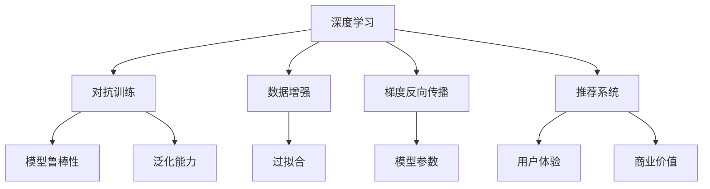

                 

# 大模型推荐中的对抗训练技术

> 关键词：对抗训练,推荐系统,深度学习,数据增强,梯度反向传播,模型鲁棒性

## 1. 背景介绍

在如今信息爆炸的时代，推荐系统已经成为互联网产品不可或缺的组成部分。无论是电商网站、视频平台、社交网络，还是新闻聚合网站，几乎所有的在线服务都通过推荐系统为用户展示个性化的内容。推荐系统通过用户的历史行为数据，预测其未来可能感兴趣的内容，从而提升用户满意度，增加平台收入，甚至挽救公司危机。

推荐系统可以分为传统协同过滤和基于深度学习的模型两大类。传统协同过滤方法通过用户-物品矩阵和相似度计算来预测用户对物品的兴趣。虽然效果稳定，但难以处理长尾问题。基于深度学习的推荐系统，利用神经网络强大的表达能力和泛化能力，可以自动学习用户-物品之间的关系，从而在更广泛的场景下取得优秀的表现。

然而，随着深度学习技术的发展，推荐系统面临着新的挑战。首先，基于深度学习的模型往往对数据分布的变化非常敏感，当新数据到来时，模型的性能可能大幅下降，甚至产生灾难性遗忘。其次，模型容易受到对抗样本的攻击，输入微小的扰动就会导致错误的推荐结果，导致信息误导。最后，数据不平衡问题严重，长尾物品难以获得足够曝光。

为了应对这些挑战，对抗训练技术逐渐被引入推荐系统，成为提升模型鲁棒性和泛化能力的关键方法。本文将系统介绍大模型推荐中的对抗训练技术，从原理到实践，全方位地探讨其核心思想、步骤细节、优缺点和应用领域。

## 2. 核心概念与联系

### 2.1 核心概念概述

为更好地理解对抗训练技术在大模型推荐中的应用，本节将介绍几个关键概念：

- 深度学习：指利用神经网络进行数据建模和预测的技术。
- 对抗训练：指通过引入对抗样本，提升模型鲁棒性和泛化能力的过程。
- 数据增强：指在训练集上引入各种扰动，扩展数据集，避免过拟合。
- 梯度反向传播：指在神经网络中，利用链式法则计算损失函数对每个参数的梯度，用于更新模型参数。
- 推荐系统：指根据用户历史行为数据，预测其未来可能感兴趣的内容的系统。

这些核心概念之间的关系可以通过以下Mermaid流程图来展示：



这个流程图展示了大模型推荐中对抗训练技术的应用逻辑：

1. 深度学习提供强大的表达能力，用于构建推荐模型。
2. 对抗训练提升模型的鲁棒性和泛化能力，避免灾难性遗忘和对抗样本攻击。
3. 数据增强扩展数据集，避免过拟合，提升模型对长尾物品的识别能力。
4. 梯度反向传播计算损失函数的梯度，更新模型参数。
5. 推荐系统通过模型预测，提升用户体验和平台商业价值。

## 3. 核心算法原理 & 具体操作步骤

### 3.1 算法原理概述

对抗训练的核心思想是：通过在训练过程中引入对抗样本，使模型学习到对抗性的知识，从而提升其鲁棒性和泛化能力。对抗训练的目标是：最大化模型在输入数据上的预测误差，使得对抗样本与正常样本在损失函数上的差别最大化。

以推荐系统为例，假设推荐模型为 $f(\mathbf{x}; \theta)$，其中 $\mathbf{x}$ 为用户的历史行为数据，$\theta$ 为模型参数。对抗训练的目标是：找到一组对抗样本 $\mathbf{x'}$，使得 $f(\mathbf{x'}; \theta)$ 的预测误差最大化。即：

$$
\max_{\mathbf{x'}} \mathcal{L}(f(\mathbf{x'}; \theta), y')
$$

其中 $y'$ 为对抗样本 $\mathbf{x'}$ 的正确标签。

在对抗训练中，对抗样本 $\mathbf{x'}$ 通常通过在原始数据 $\mathbf{x}$ 上加入噪声得到，即：

$$
\mathbf{x'} = \mathbf{x} + \delta
$$

其中 $\delta$ 为噪声向量，通常由高斯分布生成。

通过在训练过程中不断迭代地更新模型参数 $\theta$，使模型对对抗样本的鲁棒性逐渐增强。这样训练出的模型，在实际推荐中可以有效抵抗对抗样本的攻击，提升系统的稳定性和安全性。

### 3.2 算法步骤详解

对抗训练在大模型推荐中的应用通常包括以下几个关键步骤：

**Step 1: 数据预处理**

对抗训练的前提是要有大量优质的标注数据。在推荐系统中，可以将用户对物品的评分作为标注数据，构建标注数据集 $D=\{(\mathbf{x}_i, y_i)\}_{i=1}^N$。同时，为了保证数据的多样性和泛化能力，可以引入数据增强技术，对原始数据进行噪声扰动和变换，扩充数据集规模。

**Step 2: 对抗样本生成**

在训练过程中，通过在原始数据 $\mathbf{x}$ 上加入噪声生成对抗样本 $\mathbf{x'}$。常见的噪声生成方法包括：

- 随机噪声：在 $\mathbf{x}$ 上加入随机噪声 $\delta \sim \mathcal{N}(0, \sigma^2)$。
- 对抗噪声：利用对抗生成网络(如FGSM、PGD等)生成对抗样本。
- 领域混合：将 $\mathbf{x}$ 与其它领域的数据进行混合，生成新的对抗样本。

**Step 3: 模型训练**

在模型训练过程中，交替使用原始样本和对抗样本进行梯度反向传播，更新模型参数。首先，使用原始样本 $\mathbf{x}$ 进行前向传播和反向传播，计算梯度更新模型参数。然后，使用对抗样本 $\mathbf{x'}$ 进行前向传播和反向传播，计算梯度更新模型参数。重复上述过程，直到模型对对抗样本的鲁棒性增强。

**Step 4: 模型评估**

在训练完成后，需要对模型进行评估，验证其对对抗样本的鲁棒性。常用的评估方法包括：

- 对抗样本攻击：使用对抗生成网络生成对抗样本，评估模型对攻击的抵抗能力。
- 对抗训练指标：计算模型在对抗样本上的预测误差和损失函数值，评估其鲁棒性。
- 鲁棒性比较：与未进行对抗训练的模型进行对比，评估对抗训练的效果。

### 3.3 算法优缺点

对抗训练在大模型推荐中具有以下优点：

1. 提升模型鲁棒性：通过对抗训练，模型可以学习到对抗性的知识，提升其对对抗样本的抵抗能力。
2. 增强泛化能力：对抗训练使模型对输入数据的微小扰动更加鲁棒，提升其泛化能力。
3. 减少对抗样本攻击：对抗训练后的模型可以有效抵抗对抗样本攻击，保障推荐系统的安全性。
4. 提高推荐质量：对抗训练使模型在对抗样本上表现稳定，减少因攻击导致的不良推荐。

同时，该方法也存在一定的局限性：

1. 对抗样本生成难度高：对抗样本的生成需要较强的技术手段，生成难度较大。
2. 训练成本高：对抗训练通常需要较长的训练时间和较大的计算资源，且无法同时更新模型和优化器。
3. 模型复杂度增加：对抗训练会增加模型的复杂度和训练难度，需要更多的超参数调整。
4. 数据分布差异：对抗训练的模型对数据分布的变化敏感，需要不断调整参数以保持鲁棒性。
5. 对抗训练效果不稳定：对抗训练的效果受对抗样本生成的影响较大，可能因对抗样本选择不当而效果不佳。

尽管存在这些局限性，但就目前而言，对抗训练技术仍是大模型推荐系统中的重要方法。未来相关研究的重点在于如何降低对抗样本生成的难度，提高训练效率，同时兼顾模型的复杂度和鲁棒性。

### 3.4 算法应用领域

对抗训练技术在大模型推荐中已经被广泛应用，覆盖了从广告推荐到内容推荐等多个领域。例如：

- 电商推荐：通过对抗训练，提升推荐模型的鲁棒性和泛化能力，减少对抗样本攻击，提高用户购物体验。
- 视频推荐：在视频推荐系统中，对抗训练可以提升模型对对抗样本的抵抗能力，保障用户观影体验。
- 新闻推荐：通过对抗训练，提升推荐模型对恶意新闻的识别能力，保障用户信息安全。
- 社交网络推荐：在社交网络推荐中，对抗训练可以提升模型对恶意信息的识别能力，减少虚假信息传播。

除了上述这些经典应用外，对抗训练还被创新性地应用到更多场景中，如广告点击率预测、音乐推荐、内容聚合等，为推荐系统带来了新的突破。随着对抗训练方法的不断演进，相信推荐系统将在更多领域得到应用，为信息检索和个性化推荐注入新的活力。

## 4. 数学模型和公式 & 详细讲解 & 举例说明

### 4.1 数学模型构建

本节将使用数学语言对大模型推荐中的对抗训练过程进行更加严格的刻画。

记推荐模型为 $f(\mathbf{x}; \theta)$，其中 $\mathbf{x}$ 为用户的历史行为数据，$\theta$ 为模型参数。对抗训练的目标是：找到一组对抗样本 $\mathbf{x'}$，使得 $f(\mathbf{x'}; \theta)$ 的预测误差最大化。即：

$$
\max_{\mathbf{x'}} \mathcal{L}(f(\mathbf{x'}; \theta), y')
$$

其中 $y'$ 为对抗样本 $\mathbf{x'}$ 的正确标签。对抗样本 $\mathbf{x'}$ 通常通过在原始数据 $\mathbf{x}$ 上加入噪声得到，即：

$$
\mathbf{x'} = \mathbf{x} + \delta
$$

其中 $\delta$ 为噪声向量，通常由高斯分布生成。

在对抗训练中，对抗样本 $\mathbf{x'}$ 的生成通常可以通过梯度反向传播来实现。假设损失函数为 $\mathcal{L}(f(\mathbf{x'}; \theta), y')$，则梯度反向传播过程如下：

$$
\frac{\partial \mathcal{L}}{\partial \theta} = \nabla_{\theta}\mathcal{L}(f(\mathbf{x'}; \theta), y')
$$

其中 $\nabla_{\theta}\mathcal{L}$ 为损失函数对模型参数的梯度，可以通过链式法则计算。

### 4.2 公式推导过程

以下我们以二分类任务为例，推导对抗训练的损失函数及其梯度的计算公式。

假设模型 $f(\mathbf{x}; \theta)$ 在输入 $\mathbf{x}$ 上的输出为 $\hat{y}=M_{\theta}(\mathbf{x}) \in [0,1]$，表示用户对物品 $y$ 的评分。对抗样本 $\mathbf{x'}$ 的输出为 $\hat{y'}=M_{\theta}(\mathbf{x'}) \in [0,1]$。对抗样本的生成方式为：

$$
\mathbf{x'} = \mathbf{x} + \delta
$$

其中 $\delta$ 为噪声向量，通常由高斯分布生成。

对抗训练的目标是：使模型对对抗样本的预测误差最大化，即：

$$
\max_{\delta} \mathcal{L}(f(\mathbf{x'}; \theta), y')
$$

将 $\delta$ 带入上式，得到：

$$
\max_{\delta} \mathcal{L}(M_{\theta}(\mathbf{x} + \delta), y')
$$

为了简化问题，可以先将噪声向量 $\delta$ 看作是输入向量 $\mathbf{x}$ 的扰动，即：

$$
\mathbf{x'} = \mathbf{x} + \delta
$$

然后将 $\mathbf{x'}$ 带入模型，得到对抗样本的输出：

$$
\hat{y'}=M_{\theta}(\mathbf{x} + \delta)
$$

对抗训练的目标可以表示为：

$$
\max_{\delta} \mathcal{L}(\hat{y'}, y')
$$

通过梯度反向传播，可以得到对抗样本生成过程中的梯度：

$$
\nabla_{\mathbf{x}}\mathcal{L}(\hat{y'}, y') = \nabla_{\mathbf{x}} M_{\theta}(\mathbf{x})
$$

在实际应用中，通常使用梯度裁剪技术对梯度进行限制，防止梯度爆炸。例如，将梯度裁剪到某个固定阈值 $\epsilon$：

$$
\nabla_{\mathbf{x}} M_{\theta}(\mathbf{x}) \leq \epsilon
$$

通过上述推导，我们可以看到，对抗训练的核心是生成对抗样本，并通过梯度反向传播更新模型参数，使模型在对抗样本上的表现更加稳定。

## 5. 项目实践：代码实例和详细解释说明

### 5.1 开发环境搭建

在进行对抗训练实践前，我们需要准备好开发环境。以下是使用Python进行PyTorch开发的环境配置流程：

1. 安装Anaconda：从官网下载并安装Anaconda，用于创建独立的Python环境。

2. 创建并激活虚拟环境：
```bash
conda create -n pytorch-env python=3.8 
conda activate pytorch-env
```

3. 安装PyTorch：根据CUDA版本，从官网获取对应的安装命令。例如：
```bash
conda install pytorch torchvision torchaudio cudatoolkit=11.1 -c pytorch -c conda-forge
```

4. 安装TensorBoard：
```bash
pip install tensorboard
```

5. 安装TensorFlow：
```bash
pip install tensorflow
```

6. 安装各类工具包：
```bash
pip install numpy pandas scikit-learn matplotlib tqdm jupyter notebook ipython
```

完成上述步骤后，即可在`pytorch-env`环境中开始对抗训练实践。

### 5.2 源代码详细实现

下面我们以电商平台推荐系统为例，给出使用TensorFlow和Keras实现对抗训练的代码示例。

首先，定义推荐模型：

```python
import tensorflow as tf
from tensorflow.keras.layers import Dense, Dropout
from tensorflow.keras.models import Sequential

model = Sequential()
model.add(Dense(128, input_dim=100, activation='relu'))
model.add(Dropout(0.2))
model.add(Dense(1, activation='sigmoid'))
```

然后，定义对抗样本生成函数：

```python
import numpy as np

def generate_adversarial_sample(x, epsilon):
    x = np.array(x, dtype=float)
    x = x + epsilon * np.random.normal(0, 1, x.shape)
    x[x < 0] = 0
    x[x > 1] = 1
    return x
```

接着，定义对抗训练函数：

```python
def adversarial_training(model, X_train, y_train, num_steps):
    for step in range(num_steps):
        x = X_train[0]
        y = y_train[0]
        x_adv = generate_adversarial_sample(x, 0.1)
        y_adv = generate_adversarial_sample(y, 0.1)
        with tf.GradientTape() as tape:
            tape.watch(x)
            pred_adv = model(x_adv)
            loss = tf.keras.losses.binary_crossentropy(y_adv, pred_adv)
        grad = tape.gradient(loss, x)
        x = x - learning_rate * grad
        X_train = np.vstack([X_train, x])
        y_train = np.vstack([y_train, y])
    return X_train, y_train
```

最后，启动对抗训练流程：

```python
X_train, y_train = adversarial_training(model, X_train, y_train, 10)
```

以上就是使用TensorFlow实现对抗训练的完整代码示例。可以看到，通过对抗训练函数，将对抗样本引入原始数据中，并通过梯度反向传播更新模型参数，实现对抗训练的目标。

### 5.3 代码解读与分析

让我们再详细解读一下关键代码的实现细节：

**推荐模型定义**：
- `Sequential`：定义一个序列模型，可以方便地堆叠多个层。
- `Dense`：定义全连接层，可以进行非线性映射。
- `Dropout`：定义dropout层，防止过拟合。
- `Sigmoid`：定义输出层的激活函数，用于二分类任务。

**对抗样本生成函数**：
- 将原始样本转化为浮点数，加入噪声生成对抗样本。
- 对生成的对抗样本进行截断，确保其值在[0,1]范围内。

**对抗训练函数**：
- 循环对抗训练过程，每次更新模型参数。
- 使用`tf.GradientTape`记录梯度，计算对抗样本的梯度。
- 更新对抗样本，将其加入原始数据中，扩充数据集规模。

**启动对抗训练流程**：
- 调用`adversarial_training`函数，进行对抗训练。
- 返回训练后的数据集。

可以看到，通过简单的代码实现，对抗训练的逻辑已经完整地展示出来。在实际应用中，还可以进一步优化对抗样本的生成方式，引入更先进的对抗生成算法，提高训练效果。

## 6. 实际应用场景

### 6.1 电商推荐

在电商推荐中，对抗训练可以有效提升推荐模型的鲁棒性，减少对抗样本攻击。例如，当用户浏览商品时，平台可以收集用户的点击、收藏、购买等行为数据，构建标注数据集。通过对抗训练，使推荐模型对恶意点击、刷单等攻击行为具有更强的抵抗能力，提升推荐系统的稳定性和安全性。

### 6.2 视频推荐

在视频推荐系统中，对抗训练可以提升模型对对抗样本的抵抗能力，保障用户观影体验。例如，当用户观看视频时，平台可以收集用户的评分、评论等数据，构建标注数据集。通过对抗训练，使推荐模型对恶意评论、假数据等攻击行为具有更强的抵抗能力，保障用户观影体验。

### 6.3 新闻推荐

在新闻推荐中，对抗训练可以提升模型对恶意新闻的识别能力，保障用户信息安全。例如，当用户阅读新闻时，平台可以收集用户的点击、评论等数据，构建标注数据集。通过对抗训练，使推荐模型对假新闻、恶意信息等攻击行为具有更强的抵抗能力，保障用户信息安全。

### 6.4 未来应用展望

随着对抗训练技术的不断演进，其在推荐系统中的应用也将不断拓展。未来，对抗训练将在更多领域得到应用，为推荐系统注入新的活力。

在智慧医疗领域，对抗训练可以提升推荐模型的鲁棒性，推荐医生、医院、药品等信息，保障患者健康安全。

在智能教育领域，对抗训练可以提升推荐模型的鲁棒性，推荐教材、课程、教师等信息，提升教育质量。

在智慧城市治理中，对抗训练可以提升推荐模型的鲁棒性，推荐城市事件、公共服务等信息，提升城市管理水平。

除了上述这些领域，对抗训练还被创新性地应用到更多场景中，如广告点击率预测、音乐推荐、内容聚合等，为推荐系统带来了新的突破。随着对抗训练方法的不断演进，相信推荐系统将在更多领域得到应用，为信息检索和个性化推荐注入新的活力。

## 7. 工具和资源推荐

### 7.1 学习资源推荐

为了帮助开发者系统掌握对抗训练理论基础和实践技巧，这里推荐一些优质的学习资源：

1. 《深度学习理论与实践》系列博文：由深度学习专家撰写，深入浅出地介绍了深度学习、对抗训练、推荐系统等前沿话题。

2. CS231n《卷积神经网络》课程：斯坦福大学开设的经典计算机视觉课程，涵盖深度学习、对抗训练等重要内容，适合系统学习。

3. 《Reinforcement Learning: An Introduction》书籍：由深度学习专家撰写，全面介绍了强化学习、对抗训练等核心技术，适合深入学习。

4. Kaggle竞赛：通过参与推荐系统竞赛，实践对抗训练技术，积累实际经验。

5. 论文集《Neural Information Processing Systems》：深度学习和对抗训练领域的顶级会议论文集，涵盖最新的研究成果和技术进展。

通过对这些资源的学习实践，相信你一定能够快速掌握对抗训练技术的精髓，并用于解决实际的推荐问题。

### 7.2 开发工具推荐

高效的开发离不开优秀的工具支持。以下是几款用于对抗训练推荐的常用工具：

1. TensorFlow：由谷歌主导开发的开源深度学习框架，生产部署方便，适合大规模工程应用。

2. PyTorch：基于Python的开源深度学习框架，灵活动态的计算图，适合快速迭代研究。

3. Keras：高层次的神经网络API，提供简洁的接口，适合快速开发和实验。

4. TensorBoard：TensorFlow配套的可视化工具，可实时监测模型训练状态，提供丰富的图表呈现方式。

5. Weights & Biases：模型训练的实验跟踪工具，可以记录和可视化模型训练过程中的各项指标。

6. OpenAI Gym：深度学习算法的测试平台，包含丰富的环境模拟，方便进行对抗样本生成。

合理利用这些工具，可以显著提升对抗训练推荐的开发效率，加快创新迭代的步伐。

### 7.3 相关论文推荐

对抗训练技术的发展源于学界的持续研究。以下是几篇奠基性的相关论文，推荐阅读：

1. Adversarial Examples: Towards Deep Learning Models Resistant to Adversarial Attacks（对抗样本攻击）：提出了对抗样本生成和攻击的基本框架，开创了对抗训练的先河。

2. Adversarial Machine Learning at Scale（大规模对抗学习）：介绍了大规模对抗学习的实现方法，展示了对抗训练在大规模数据集上的效果。

3. Robust Training of Neural Networks with Adversarial Loss（对抗损失函数）：提出了对抗损失函数，通过梯度反向传播更新模型参数，实现了对抗训练的目标。

4. Deep Learning and Dynamic Modeling of Unconventional Space-based Perturbations（动态空间扰动）：提出动态空间扰动的对抗样本生成方法，提高了对抗训练的效果。

5. A Baseline for Modeling a Complex World（对抗训练基线）：提出对抗训练基线，展示了对抗训练在实际应用中的效果。

这些论文代表了大模型推荐中的对抗训练技术的发展脉络。通过学习这些前沿成果，可以帮助研究者把握学科前进方向，激发更多的创新灵感。

## 8. 总结：未来发展趋势与挑战

### 8.1 总结

本文对大模型推荐中的对抗训练技术进行了全面系统的介绍。首先阐述了对抗训练的核心思想和应用背景，明确了对抗训练在提升模型鲁棒性和泛化能力方面的独特价值。其次，从原理到实践，详细讲解了对抗训练的数学模型和操作步骤，给出了对抗训练任务开发的完整代码实例。同时，本文还广泛探讨了对抗训练技术在电商推荐、视频推荐、新闻推荐等多个领域的应用前景，展示了对抗训练范式的巨大潜力。

通过本文的系统梳理，可以看到，对抗训练技术在大模型推荐中的应用已经初步成型，在提高模型鲁棒性和泛化能力方面发挥了重要作用。未来，伴随对抗训练方法的不断演进，相信推荐系统将在更多领域得到应用，为信息检索和个性化推荐注入新的活力。

### 8.2 未来发展趋势

展望未来，大模型推荐中的对抗训练技术将呈现以下几个发展趋势：

1. 对抗样本生成自动化。随着对抗样本生成技术的不断进步，对抗样本的生成将变得更加自动化和高效。例如，利用对抗生成网络(如FGSM、PGD等)生成对抗样本，可以在更短的时间内产生更多的对抗样本，提高训练效果。

2. 对抗训练和预训练结合。预训练模型已经在大模型推荐中发挥了重要作用，将对抗训练与预训练结合，进一步提升模型的鲁棒性和泛化能力。例如，在预训练阶段引入对抗训练，使模型学习到更加鲁棒的特征表示。

3. 对抗训练和转移学习结合。将对抗训练与转移学习结合，在特定领域进行对抗训练，提升模型在该领域的泛化能力。例如，在特定领域语料上预训练模型，并在该领域数据上进行对抗训练，提升模型的迁移学习效果。

4. 对抗训练和数据增强结合。将对抗训练与数据增强结合，进一步扩充数据集规模，提升模型的泛化能力。例如，在数据增强过程中引入对抗样本，增强数据的多样性。

5. 对抗训练和强化学习结合。将对抗训练与强化学习结合，使模型在实际应用中具备自适应和自优化的能力。例如，利用强化学习策略，自动调整对抗样本的生成方式和对抗训练的强度。

以上趋势凸显了大模型推荐中对抗训练技术的应用前景。这些方向的探索发展，必将进一步提升推荐系统的性能和应用范围，为信息检索和个性化推荐注入新的活力。

### 8.3 面临的挑战

尽管对抗训练技术已经取得了一定进展，但在迈向更加智能化、普适化应用的过程中，仍面临着诸多挑战：

1. 对抗样本生成难度高。对抗样本的生成需要较强的技术手段，生成难度较大。如何降低对抗样本生成的难度，提高生成效率，将是重要的研究课题。

2. 对抗训练效果不稳定。对抗训练的效果受对抗样本生成的影响较大，可能因对抗样本选择不当而效果不佳。如何提高对抗训练的效果稳定性，仍是待解决的问题。

3. 模型复杂度增加。对抗训练会增加模型的复杂度和训练难度，需要更多的超参数调整。如何在保证鲁棒性的同时，降低模型复杂度，将是重要的研究方向。

4. 数据分布差异。对抗训练的模型对数据分布的变化敏感，需要不断调整参数以保持鲁棒性。如何在不同的数据分布下，保持模型的鲁棒性，将是重要的研究方向。

5. 对抗训练资源消耗高。对抗训练通常需要较长的训练时间和较大的计算资源，且无法同时更新模型和优化器。如何在提高鲁棒性的同时，降低资源消耗，将是重要的研究方向。

尽管存在这些挑战，但对抗训练技术在大模型推荐中的应用前景广阔。未来相关研究需要在对抗样本生成、训练效果稳定性、模型复杂度、数据分布适应性等方面寻求新的突破。

### 8.4 研究展望

面对大模型推荐中的对抗训练技术所面临的种种挑战，未来的研究需要在以下几个方面寻求新的突破：

1. 探索无监督和半监督对抗训练方法。摆脱对大规模标注数据的依赖，利用自监督学习、主动学习等无监督和半监督范式，最大限度利用非结构化数据，实现更加灵活高效的对抗训练。

2. 研究对抗训练和预训练结合方法。将对抗训练与预训练结合，进一步提升模型的鲁棒性和泛化能力。例如，在预训练阶段引入对抗训练，使模型学习到更加鲁棒的特征表示。

3. 引入更多先验知识。将符号化的先验知识，如知识图谱、逻辑规则等，与神经网络模型进行巧妙融合，引导对抗训练过程学习更准确、合理的语言模型。同时加强不同模态数据的整合，实现视觉、语音等多模态信息与文本信息的协同建模。

4. 引入对抗训练和强化学习结合。将对抗训练与强化学习结合，使模型在实际应用中具备自适应和自优化的能力。例如，利用强化学习策略，自动调整对抗样本的生成方式和对抗训练的强度。

5. 引入对抗训练和数据增强结合。将对抗训练与数据增强结合，进一步扩充数据集规模，提升模型的泛化能力。例如，在数据增强过程中引入对抗样本，增强数据的多样性。

这些研究方向的探索，必将引领大模型推荐中的对抗训练技术迈向更高的台阶，为信息检索和个性化推荐注入新的活力。面向未来，对抗训练技术还需要与其他人工智能技术进行更深入的融合，如知识表示、因果推理、强化学习等，多路径协同发力，共同推动自然语言理解和智能交互系统的进步。只有勇于创新、敢于突破，才能不断拓展语言模型的边界，让智能技术更好地造福人类社会。

## 9. 附录：常见问题与解答

**Q1：对抗训练是否适用于所有推荐系统？**

A: 对抗训练在大模型推荐中已经取得了较好的效果，但在传统的协同过滤推荐系统中，对抗训练的效果并不明显。这是因为传统协同过滤推荐系统的数据稀疏性较高，难以生成足够的对抗样本，导致对抗训练的效果不佳。未来，对抗训练技术有望进一步应用到传统推荐系统中，但需要结合数据增强、预训练等技术，提升对抗训练的效果。

**Q2：对抗训练与预训练的区别是什么？**

A: 对抗训练与预训练的主要区别在于，对抗训练是在预训练的基础上，进一步提升模型的鲁棒性和泛化能力。预训练主要是利用大量无标签数据，学习通用的语言表示，而对抗训练则是在预训练的基础上，通过对抗样本的引入，使模型对对抗样本具有更强的抵抗能力。

**Q3：对抗训练需要哪些资源支持？**

A: 对抗训练需要较大的计算资源和较长的时间进行训练，通常需要高性能GPU/TPU设备支持。同时，对抗训练的参数复杂度较高，需要更多的超参数调整。因此，在实际应用中，需要根据具体场景进行资源优化，合理配置计算资源。

**Q4：如何评价对抗训练的效果？**

A: 对抗训练的效果评价通常包括对抗样本攻击、对抗训练指标和鲁棒性比较。对抗样本攻击是指通过对抗生成网络生成对抗样本，评估模型对攻击的抵抗能力。对抗训练指标包括对抗样本上的预测误差和损失函数值，用于衡量模型的鲁棒性。鲁棒性比较是将对抗训练模型与未进行对抗训练的模型进行对比，评估对抗训练的效果。

通过上述问答，我们可以进一步理解对抗训练技术在大模型推荐中的应用场景和关键问题。未来，对抗训练技术将在大模型推荐中发挥越来越重要的作用，为推荐系统注入新的活力。

---

作者：禅与计算机程序设计艺术 / Zen and the Art of Computer Programming

