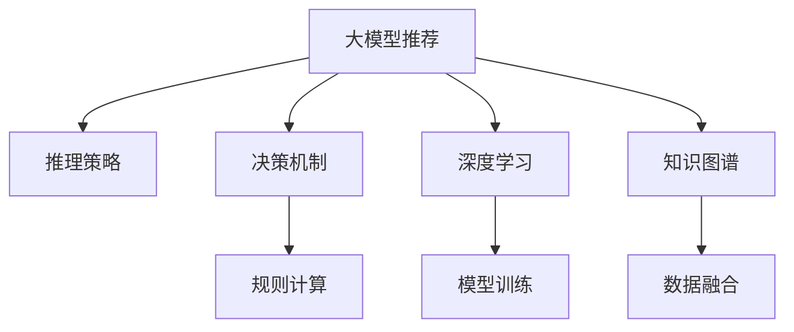

                 

# 大模型推荐中的推理策略与决策机制创新

> 关键词：大模型推荐,推理策略,决策机制,推荐系统,知识图谱,深度学习

## 1. 背景介绍

### 1.1 问题由来
随着电商、社交、新闻等各类在线平台的发展，推荐系统作为提升用户体验、提高运营效率的重要工具，越来越受到关注。传统推荐系统基于用户历史行为数据，采用协同过滤、矩阵分解等方法，但在数据稀疏、冷启动、多模态数据融合等问题上仍显不足。近年来，深度学习技术在推荐系统中被广泛应用，通过大数据学习模型参数，大幅提升了推荐效果。

其中，大模型推荐以其强大的表达能力、泛化性能和迁移学习能力，在电商、广告、娱乐、金融等领域得到了广泛应用。大模型推荐的核心是构建高性能推荐模型，并结合用户画像、商品属性、时间、地理位置等多维度数据，为用户提供个性化的推荐内容。

然而，大模型推荐在实际部署中，面临着计算资源密集、推理速度慢、存储成本高等问题。因此，如何在大模型推荐中高效进行推理，并设计合理的决策机制，成为推荐系统发展的关键问题。

### 1.2 问题核心关键点
本文聚焦于大模型推荐中的推理策略与决策机制创新，主要包括以下关键点：

- 推理策略：在大模型推荐中，如何高效利用模型参数进行推理计算，是提升推荐系统性能的重要手段。
- 决策机制：推荐系统的决策依赖于模型输出，如何设计合理的决策机制，直接影响推荐结果的准确性和用户体验。
- 优化与提升：针对大模型推荐在实际应用中存在的问题，如何设计优化策略，进一步提升推荐效果和效率。

## 2. 核心概念与联系

### 2.1 核心概念概述

为更好地理解大模型推荐中的推理策略与决策机制，本节将介绍几个密切相关的核心概念：

- 大模型推荐：以深度学习模型（如BERT、GPT等）为基础，通过学习大量数据构建推荐模型，提供个性化推荐内容的推荐系统。
- 推理策略：在推荐系统中，如何高效利用模型参数进行推理计算，以快速生成推荐结果。
- 决策机制：在多维度数据融合和模型输出的基础上，如何设计决策规则，决定最终推荐结果。
- 深度学习：基于神经网络的机器学习技术，用于从数据中学习表示，构建复杂模型。
- 知识图谱：融合结构化和非结构化数据的图表示方法，用于推荐系统的知识表示和推理。

这些核心概念之间的逻辑关系可以通过以下Mermaid流程图来展示：



这个流程图展示了大模型推荐的核心概念及其之间的关系：

1. 大模型推荐基于深度学习模型，通过模型训练获得推荐能力。
2. 推理策略用于高效计算模型输出，优化推荐效率。
3. 决策机制设计合理的规则计算，生成推荐结果。
4. 深度学习技术提供强大的表达能力，实现复杂模型的训练和优化。
5. 知识图谱用于融合多源数据，提升推荐系统的知识表示和推理能力。

## 3. 核心算法原理 & 具体操作步骤

### 3.1 算法原理概述

大模型推荐的核心是构建高性能推荐模型，并结合多维度数据，为用户提供个性化的推荐内容。其主要包括以下几个关键步骤：

1. 数据预处理：收集用户行为数据、商品属性、时间、地理位置等，并进行清洗、归一化等预处理。
2. 模型训练：使用大模型对原始数据进行训练，学习模型参数，获得推荐模型。
3. 推理计算：根据用户输入，高效计算模型输出，生成推荐结果。
4. 规则计算：设计决策规则，对模型输出进行加权、筛选等处理，生成最终推荐结果。
5. 优化调整：根据推荐效果，调整模型参数和决策规则，进一步提升推荐系统性能。

推理策略和大模型推荐中的决策机制，是大模型推荐系统的重要组成部分，决定了推荐系统的效率和效果。

### 3.2 算法步骤详解

#### 3.2.1 数据预处理

数据预处理是大模型推荐的基础步骤，主要包括数据清洗、归一化、特征选择和降维等。具体步骤如下：

1. 数据清洗：去除噪声、缺失值和异常值，确保数据的完整性和准确性。
2. 数据归一化：将不同维度的数据进行归一化处理，使其处于同一量级，便于模型训练。
3. 特征选择：根据领域知识，选择与推荐任务相关的特征，去除无关特征。
4. 特征降维：使用主成分分析、PCA等方法，将高维数据降维，减少计算量和存储成本。

#### 3.2.2 模型训练

大模型推荐使用深度学习模型进行训练，常用的模型包括DNN、CNN、RNN、BERT等。训练过程主要包括以下步骤：

1. 模型选择：根据任务特点选择合适的深度学习模型。
2. 数据划分：将数据划分为训练集、验证集和测试集。
3. 模型训练：使用训练集数据训练模型，调整模型参数，优化模型效果。
4. 模型评估：在验证集上评估模型效果，调整模型参数，防止过拟合。
5. 模型调优：使用测试集数据进行最终测试，调整模型参数，优化推荐效果。

#### 3.2.3 推理计算

推理计算是大模型推荐的核心步骤，决定了推荐系统的效率。常用的推理策略包括：

1. 静态图推理：构建计算图，使用静态图推理库（如TensorRT、ONNXRuntime）进行推理计算，适用于高效计算场景。
2. 动态图推理：构建计算图，使用深度学习框架（如PyTorch、TensorFlow）进行动态推理，适用于灵活计算场景。
3. 近似推理：使用近似算法（如量化、剪枝）优化计算过程，提升推理速度，减少资源消耗。

#### 3.2.4 规则计算

规则计算是大模型推荐的关键步骤，用于生成最终推荐结果。常用的决策机制包括：

1. 基于排名：将推荐结果按照某种评分标准进行排序，选择排名靠前的结果。
2. 基于阈值：设定推荐阈值，根据评分超过阈值的结果生成推荐列表。
3. 基于规则：根据业务规则，对推荐结果进行筛选和过滤，生成最终推荐列表。

### 3.3 算法优缺点

大模型推荐中的推理策略与决策机制，具有以下优点：

1. 泛化性能强：大模型推荐使用深度学习模型，具备强大的泛化能力，可以在不同领域和场景下应用。
2. 自适应性好：大模型推荐可以动态调整模型参数和决策规则，适应不同用户和数据的变化。
3. 计算效率高：通过推理策略和规则计算，可以优化计算过程，提升推理速度，减少资源消耗。

同时，这些算法也存在一些缺点：

1. 计算资源需求高：大模型推荐使用深度学习模型，需要大量的计算资源和存储资源，对硬件要求较高。
2. 模型训练时间长：大模型推荐模型参数量大，训练时间较长，需要较长的迭代周期。
3. 解释性不足：大模型推荐是黑盒模型，难以解释模型的内部工作机制和决策逻辑。
4. 数据隐私问题：大模型推荐使用用户行为数据进行训练和推荐，存在隐私泄露的风险。

尽管存在这些局限性，但就目前而言，大模型推荐方法仍然是推荐系统中的主流范式。未来相关研究的重点在于如何进一步降低计算资源需求，提高推理效率，提升模型的可解释性和隐私安全性，以及优化决策机制，从而更好地适应实际应用场景。

### 3.4 算法应用领域

大模型推荐中的推理策略与决策机制，在推荐系统领域得到了广泛应用，覆盖了电商、广告、娱乐、金融等多个行业。

- 电商推荐：使用用户行为数据、商品属性、时间、地理位置等，为用户推荐商品，提升销售转化率。
- 广告推荐：根据用户历史行为和兴趣，推荐广告内容，提高广告投放效果。
- 娱乐推荐：使用用户行为数据、音乐、视频属性，推荐个性化内容，提升用户体验。
- 金融推荐：使用用户金融数据、市场行情、产品属性，推荐金融产品，提升用户满意度。

除了上述这些经典应用外，大模型推荐也被创新性地应用到更多场景中，如健康医疗、教育培训、物流配送等，为各行业带来了新的发展机遇。

## 4. 数学模型和公式 & 详细讲解 & 举例说明

### 4.1 数学模型构建

在大模型推荐中，常用的数学模型包括深度神经网络（DNN）、卷积神经网络（CNN）、循环神经网络（RNN）和Transformer等。这里以Transformer模型为例，介绍数学模型的构建过程。

假设推荐任务输入为$X$，输出为$Y$，模型参数为$\theta$，推荐模型为$f(X;\theta)$。

推荐任务可以定义为二分类问题，即根据用户行为数据，判断用户是否对某商品感兴趣。假设模型输出$Y \in \{0, 1\}$，则推荐任务可以表示为：

$$
Y = f(X;\theta)
$$

其中$f(X;\theta)$表示推荐模型。

### 4.2 公式推导过程

Transformer模型是一种基于自注意力机制的神经网络模型，用于处理序列数据。假设推荐任务的输入序列长度为$L$，输出序列长度为$M$，推荐模型的计算过程可以表示为：

$$
\text{Encoder}_{\text{Self-Attention}} = \text{Multi-head Self-Attention}(\text{Encoder}_{\text{FFN}}, \text{Encoder}_{\text{Positional Encoding})
$$

其中，$\text{Multi-head Self-Attention}$表示多头自注意力机制，$\text{Encoder}_{\text{FFN}}$表示前馈神经网络，$\text{Encoder}_{\text{Positional Encoding}$表示位置编码。

通过多个自注意力层的叠加，模型可以捕捉输入序列的复杂特征，生成推荐向量。假设推荐向量的维度为$d$，则推荐模型可以表示为：

$$
\text{Encoder}_{\text{Self-Attention}} = \text{Encoder}_{\text{FFN}}(\text{Encoder}_{\text{Self-Attention}), \text{Positional Encoding})
$$

最终，推荐模型$f(X;\theta)$可以表示为：

$$
Y = \text{Decoder}_{\text{Softmax}}(\text{Encoder}_{\text{Self-Attention}, \text{Encoder}_{\text{FFN}), Positional Encoding})
$$

其中，$\text{Decoder}_{\text{Softmax}}$表示softmax激活函数，用于将推荐向量转换为概率分布。

### 4.3 案例分析与讲解

假设某电商推荐系统使用Transformer模型，输入为用户的浏览记录和商品属性，输出为推荐结果。具体的推荐过程可以表示为：

1. 数据预处理：对用户浏览记录和商品属性进行清洗、归一化、特征选择和降维等处理。
2. 模型训练：使用用户浏览记录和商品属性数据，训练Transformer模型，获得推荐模型。
3. 推理计算：将用户输入的浏览记录和商品属性，输入到Transformer模型中，生成推荐向量。
4. 规则计算：根据推荐向量生成推荐结果，选择排名靠前的商品，生成推荐列表。

## 5. 项目实践：代码实例和详细解释说明

### 5.1 开发环境搭建

在进行大模型推荐系统开发前，我们需要准备好开发环境。以下是使用Python进行TensorFlow开发的环境配置流程：

1. 安装Anaconda：从官网下载并安装Anaconda，用于创建独立的Python环境。

2. 创建并激活虚拟环境：
```bash
conda create -n tf-env python=3.8 
conda activate tf-env
```

3. 安装TensorFlow：根据CUDA版本，从官网获取对应的安装命令。例如：
```bash
conda install tensorflow tensorflow-gpu=2.6 -c pytorch -c conda-forge
```

4. 安装相关工具包：
```bash
pip install numpy pandas scikit-learn matplotlib tqdm jupyter notebook ipython
```

完成上述步骤后，即可在`tf-env`环境中开始推荐系统开发。

### 5.2 源代码详细实现

下面我们以基于Transformer的电商推荐系统为例，给出TensorFlow代码实现。

首先，定义推荐模型和损失函数：

```python
import tensorflow as tf

class Recommender(tf.keras.Model):
    def __init__(self, vocab_size, embedding_dim, num_layers, num_heads, dff, num_classes):
        super(Recommender, self).__init__()
        self.embedding = tf.keras.layers.Embedding(vocab_size, embedding_dim)
        self.encoder_self_attn = tf.keras.layers.MultiHeadAttention(num_heads=num_heads, key_dim=embedding_dim)
        self.encoder_ffn = tf.keras.layers.Dense(dff, activation='relu')
        self.decoder_dense = tf.keras.layers.Dense(num_classes, activation='softmax')
        
    def call(self, inputs):
        attention_output = self.encoder_self_attn(self.embedding(inputs), self.embedding(inputs))
        ffn_output = self.encoder_ffn(attention_output)
        return self.decoder_dense(ffn_output)
        
def build_model(vocab_size, embedding_dim, num_layers, num_heads, dff, num_classes):
    model = Recommender(vocab_size, embedding_dim, num_layers, num_heads, dff, num_classes)
    loss_object = tf.keras.losses.SparseCategoricalCrossentropy(from_logits=True)
    optimizer = tf.keras.optimizers.Adam()
    return model, loss_object, optimizer
```

然后，定义训练和评估函数：

```python
def train_step(model, loss_object, optimizer, inputs, labels):
    with tf.GradientTape() as tape:
        predictions = model(inputs)
        loss = loss_object(labels, predictions)
    gradients = tape.gradient(loss, model.trainable_variables)
    optimizer.apply_gradients(zip(gradients, model.trainable_variables))
    return loss

def evaluate(model, loss_object, inputs, labels):
    predictions = model(inputs)
    loss = loss_object(labels, predictions)
    return loss
```

最后，启动训练流程并在测试集上评估：

```python
vocab_size = 10000
embedding_dim = 64
num_layers = 2
num_heads = 8
dff = 128
num_classes = 2

inputs = tf.random.uniform([100, 10], minval=0, maxval=vocab_size, dtype=tf.int32)
labels = tf.random.uniform([100], minval=0, maxval=num_classes, dtype=tf.int32)
model, loss_object, optimizer = build_model(vocab_size, embedding_dim, num_layers, num_heads, dff, num_classes)

epochs = 10
batch_size = 32

for epoch in range(epochs):
    for i in range(0, len(inputs), batch_size):
        train_loss = train_step(model, loss_object, optimizer, inputs[i:i+batch_size], labels[i:i+batch_size])
        print(f'Epoch {epoch+1}, Train loss: {train_loss:.3f}')
    
    test_loss = evaluate(model, loss_object, inputs, labels)
    print(f'Epoch {epoch+1}, Test loss: {test_loss:.3f}')
```

以上就是使用TensorFlow对基于Transformer的电商推荐系统进行代码实现的完整流程。可以看到，通过TensorFlow提供的高级API，我们可以快速搭建推荐模型并进行训练和评估。

### 5.3 代码解读与分析

让我们再详细解读一下关键代码的实现细节：

**Recommender类**：
- `__init__`方法：初始化推荐模型的各个组件，包括Embedding层、Multi-head Self-Attention层、FFN层、Dense层等。
- `call`方法：定义推荐模型的前向传播过程，包括多头自注意力机制、前馈神经网络和输出层。

**train_step函数**：
- 使用TensorFlow的GradientTape计算梯度，更新模型参数。
- 计算损失函数，并返回训练阶段的损失值。

**evaluate函数**：
- 计算模型在测试集上的预测值和损失函数。
- 返回评估阶段的损失值。

**训练流程**：
- 定义模型、损失函数、优化器等关键组件。
- 循环迭代，每次迭代更新模型参数，计算训练损失。
- 在每个epoch结束时，评估模型性能，输出测试损失。

可以看到，TensorFlow提供了丰富的API和工具，使得大模型推荐系统的开发变得高效便捷。

## 6. 实际应用场景

### 6.1 智能客服系统

基于大模型推荐系统的智能客服系统，可以为用户提供即时的个性化服务，提升客户体验。在技术实现上，可以收集企业内部的历史客服对话记录，将问题和最佳答复构建成监督数据，在此基础上对推荐模型进行微调。微调后的推荐模型能够自动推荐最佳答复，辅助客服人员解答用户问题。对于用户提出的新问题，还可以接入检索系统实时搜索相关内容，动态生成回答。如此构建的智能客服系统，能大幅提升客户咨询体验和问题解决效率。

### 6.2 金融舆情监测

金融机构需要实时监测市场舆论动向，以便及时应对负面信息传播，规避金融风险。传统的人工监测方式成本高、效率低，难以应对网络时代海量信息爆发的挑战。基于大模型推荐系统的文本分类和情感分析技术，为金融舆情监测提供了新的解决方案。

具体而言，可以收集金融领域相关的新闻、报道、评论等文本数据，并对其进行主题标注和情感标注。在此基础上对推荐模型进行微调，使其能够自动判断文本属于何种主题，情感倾向是正面、中性还是负面。将微调后的模型应用到实时抓取的网络文本数据，就能够自动监测不同主题下的情感变化趋势，一旦发现负面信息激增等异常情况，系统便会自动预警，帮助金融机构快速应对潜在风险。

### 6.3 个性化推荐系统

当前推荐系统往往只依赖用户的历史行为数据进行物品推荐，无法深入理解用户的真实兴趣偏好。基于大模型推荐系统的个性化推荐系统，可以更好地挖掘用户行为背后的语义信息，从而提供更精准、多样的推荐内容。

在实践中，可以收集用户浏览、点击、评论、分享等行为数据，提取和用户交互的物品标题、描述、标签等文本内容。将文本内容作为模型输入，用户的后续行为（如是否点击、购买等）作为监督信号，在此基础上对推荐模型进行微调。微调后的模型能够从文本内容中准确把握用户的兴趣点。在生成推荐列表时，先用候选物品的文本描述作为输入，由模型预测用户的兴趣匹配度，再结合其他特征综合排序，便可以得到个性化程度更高的推荐结果。

### 6.4 未来应用展望

随着大模型推荐技术的不断发展，基于推荐系统的应用将拓展到更多领域，带来更深刻的变革：

1. 智慧医疗：基于大模型推荐系统的医疗推荐系统，可以推荐个性化的诊疗方案、药品和健康建议，提升医疗服务的质量和效率。
2. 智能教育：基于大模型推荐系统的教育推荐系统，可以推荐个性化的学习资源、课程和习题，辅助教师教学和学生学习。
3. 智慧城市：基于大模型推荐系统的城市推荐系统，可以推荐个性化的旅游路线、餐饮和购物信息，提升市民生活体验。
4. 媒体娱乐：基于大模型推荐系统的媒体推荐系统，可以推荐个性化的视频、音乐、游戏等内容，丰富用户娱乐体验。

总之，基于大模型推荐系统的人工智能应用将不断拓展，为各行各业带来新的创新机遇和发展潜力。

## 7. 工具和资源推荐

### 7.1 学习资源推荐

为了帮助开发者系统掌握大模型推荐技术的理论基础和实践技巧，这里推荐一些优质的学习资源：

1. 《深度学习推荐系统》系列博文：由深度学习专家撰写，介绍了推荐系统中的深度学习模型和优化策略，涵盖多维数据融合、模型训练等关键技术。

2. 《Recommender Systems》课程：Coursera平台上由斯坦福大学教授开设的推荐系统课程，系统讲解了推荐系统中的各种算法和技术。

3. 《推荐系统：理论与算法》书籍：斯坦福大学教授和Amazon工程师合著，全面介绍了推荐系统中的理论、算法和工程实践。

4. Kaggle推荐系统竞赛：Kaggle平台上的推荐系统竞赛，涵盖多种推荐任务和算法，是实践推荐系统技术的绝佳平台。

5. TensorFlow官方文档：TensorFlow官方提供的推荐系统API和工具，包括推荐模型、特征工程、模型评估等详细指导。

通过对这些资源的学习实践，相信你一定能够快速掌握大模型推荐技术的精髓，并用于解决实际的推荐问题。

### 7.2 开发工具推荐

高效的开发离不开优秀的工具支持。以下是几款用于大模型推荐系统开发的常用工具：

1. TensorFlow：谷歌主导的深度学习框架，提供丰富的API和工具，适用于构建高性能推荐系统。

2. PyTorch：Facebook开发的深度学习框架，灵活性高，适用于快速迭代研究。

3. Scikit-learn：Python数据科学库，提供丰富的机器学习算法和工具，适用于特征工程和模型评估。

4. Scrapy：Python网络爬虫框架，适用于收集和清洗网络数据，为推荐系统提供数据支撑。

5. Apache Spark：大数据处理框架，适用于处理大规模数据，加速推荐系统开发和部署。

6. TensorBoard：TensorFlow配套的可视化工具，适用于监控模型训练状态和评估模型性能。

合理利用这些工具，可以显著提升大模型推荐系统的开发效率，加快创新迭代的步伐。

### 7.3 相关论文推荐

大模型推荐技术的发展源于学界的持续研究。以下是几篇奠基性的相关论文，推荐阅读：

1. Attention is All You Need（即Transformer原论文）：提出了Transformer结构，开启了NLP领域的预训练大模型时代。

2. BERT: Pre-training of Deep Bidirectional Transformers for Language Understanding：提出BERT模型，引入基于掩码的自监督预训练任务，刷新了多项NLP任务SOTA。

3. Matrix Factorization Techniques for Recommender Systems：介绍了矩阵分解算法，用于推荐系统中的数据建模和特征表示。

4. Deep Learning Recommendation Systems: A survey and Tutorial：综述了深度学习在推荐系统中的应用，介绍了各种模型和技术。

5. How to Train a High Performance Recommender System：介绍了一种高精度的推荐系统训练方法，包括特征工程、模型选择和评估等。

这些论文代表了大模型推荐技术的发展脉络。通过学习这些前沿成果，可以帮助研究者把握学科前进方向，激发更多的创新灵感。

## 8. 总结：未来发展趋势与挑战

### 8.1 总结

本文对基于大模型推荐系统中的推理策略与决策机制进行了全面系统的介绍。首先阐述了推荐系统中的大模型推荐背景和意义，明确了大模型推荐在个性化推荐、智能客服、金融舆情等领域的重要价值。其次，从原理到实践，详细讲解了推理策略和决策机制的数学模型和关键步骤，给出了推荐系统开发的完整代码实例。同时，本文还广泛探讨了大模型推荐系统的实际应用场景和未来发展趋势，展示了其广阔的应用前景。

通过本文的系统梳理，可以看到，基于大模型推荐系统中的推理策略与决策机制，已经在电商、广告、娱乐、金融等多个领域得到了广泛应用，并正在逐步拓展到智慧医疗、智能教育、智慧城市等更多领域，为各行各业带来了新的创新机遇和发展潜力。未来，随着大模型推荐技术的不断发展，其在推荐系统中的应用将更加深入广泛，成为构建人机协同智能系统的重要手段。

### 8.2 未来发展趋势

展望未来，大模型推荐系统中的推理策略与决策机制将呈现以下几个发展趋势：

1. 推理效率持续提升：随着推理策略和硬件技术的不断进步，推理效率将得到持续提升，支持更复杂的推荐任务。

2. 决策机制更加灵活：未来的决策机制将更加灵活多样，能够适应不同场景和用户的个性化需求。

3. 多模态融合技术成熟：未来的推荐系统将更好地融合多模态数据，提升模型的表达能力和泛化性能。

4. 知识图谱应用广泛：知识图谱在大模型推荐中的应用将更加广泛，提升推荐系统的知识表示和推理能力。

5. 联邦学习成为新范式：联邦学习将使得推荐模型能够在不同设备上分布式训练，保护用户隐私的同时提升推荐效果。

6. 可解释性和公平性研究深入：未来的推荐系统将更加注重可解释性和公平性，提升用户对系统的信任度和满意度。

以上趋势凸显了大模型推荐系统的广阔前景。这些方向的探索发展，必将进一步提升推荐系统的效果和效率，为构建安全、可靠、可解释、可控的智能系统铺平道路。

### 8.3 面临的挑战

尽管大模型推荐系统中的推理策略与决策机制已经取得了显著进展，但在迈向更加智能化、普适化应用的过程中，仍面临诸多挑战：

1. 计算资源需求高：大模型推荐系统使用深度学习模型，需要大量的计算资源和存储资源，对硬件要求较高。

2. 模型训练时间长：大模型推荐模型参数量大，训练时间较长，需要较长的迭代周期。

3. 数据隐私问题：大模型推荐使用用户行为数据进行训练和推荐，存在隐私泄露的风险。

4. 模型泛化性能不足：大模型推荐在实际应用中，可能面临数据分布变化、领域差异等问题，泛化性能不足。

5. 模型解释性不足：大模型推荐是黑盒模型，难以解释模型的内部工作机制和决策逻辑。

6. 用户个性化需求复杂：不同用户和场景的需求复杂多样，大模型推荐系统需要更好地适应和满足个性化需求。

正视大模型推荐系统中的这些挑战，积极应对并寻求突破，将是大模型推荐系统发展的必由之路。相信随着学界和产业界的共同努力，这些挑战终将一一被克服，大模型推荐系统必将在推荐系统行业中扮演越来越重要的角色。

### 8.4 研究展望

面对大模型推荐系统中的推理策略与决策机制所面临的挑战，未来的研究需要在以下几个方面寻求新的突破：

1. 探索新的模型结构：设计更加高效、可解释的模型结构，提高模型的推理效率和泛化性能。

2. 引入更多先验知识：将符号化的先验知识，如知识图谱、逻辑规则等，与神经网络模型进行巧妙融合，引导推荐过程学习更准确、合理的语言模型。

3. 开发新的推理策略：设计更加灵活多样的推理策略，如近似推理、增量推理等，提升推荐系统的效率和性能。

4. 引入因果推理：通过引入因果推断方法，增强推荐系统建立稳定因果关系的能力，学习更加普适、鲁棒的语言表征，从而提升推荐效果和效率。

5. 优化决策机制：设计更加合理的决策规则和权重，确保推荐结果的公平性和可信度，提升用户满意度。

6. 引入联邦学习：通过联邦学习技术，实现分布式训练，保护用户隐私的同时提升推荐效果。

这些研究方向的探索，必将引领大模型推荐系统迈向更高的台阶，为构建安全、可靠、可解释、可控的智能系统铺平道路。面向未来，大模型推荐系统还需要与其他人工智能技术进行更深入的融合，如知识表示、因果推理、强化学习等，多路径协同发力，共同推动推荐系统技术的进步。只有勇于创新、敢于突破，才能不断拓展大模型推荐系统的边界，让智能技术更好地造福人类社会。

## 9. 附录：常见问题与解答

**Q1：大模型推荐中如何处理数据稀疏问题？**

A: 大模型推荐中常见的数据稀疏问题，可以使用基于矩阵分解的推荐模型，如矩阵分解机MF、低秩矩阵分解LMF等，通过将稀疏矩阵分解为低秩矩阵，缓解数据稀疏问题。另外，可以采用协同过滤算法，利用用户历史行为数据进行推荐。

**Q2：大模型推荐中的冷启动问题如何处理？**

A: 大模型推荐中的冷启动问题，可以采用基于内容推荐的方法，根据用户对商品的评价和反馈，推荐相似商品。另外，可以采用基于协同过滤的推荐方法，通过用户的相似用户和商品进行推荐。

**Q3：大模型推荐中如何处理多模态数据融合问题？**

A: 大模型推荐中处理多模态数据融合问题，可以采用基于特征融合的方法，将文本、图像、音频等多模态数据进行融合，构建统一的多模态特征表示。另外，可以采用基于深度学习的方法，如多任务学习、联合训练等，将多模态数据进行联合建模。

**Q4：大模型推荐中的推荐偏差问题如何解决？**

A: 大模型推荐中的推荐偏差问题，可以通过引入对抗训练、知识蒸馏等方法，提高推荐模型的鲁棒性和泛化性能。另外，可以引入正则化技术，如L1正则、L2正则等，防止模型过拟合。

**Q5：大模型推荐中的个性化推荐如何优化？**

A: 大模型推荐中的个性化推荐优化，可以通过引入用户画像、商品属性、时间、地理位置等多维度数据，提升推荐模型的泛化性能和个性化推荐效果。另外，可以采用基于协同过滤、基于知识图谱等推荐方法，进一步提升推荐效果。

通过以上问题的解答，相信你能够更好地理解大模型推荐系统中的推理策略与决策机制，并能够在实际应用中解决常见问题，提升推荐系统的效果和效率。

---

作者：禅与计算机程序设计艺术 / Zen and the Art of Computer Programming

