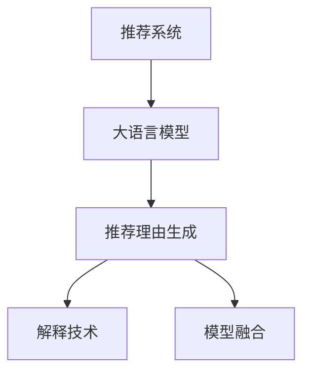

                 

# 大模型推荐中的推荐理由生成与解释技术提升

## 1. 背景介绍

推荐系统在大数据时代扮演着至关重要的角色，广泛应用于电子商务、内容推荐、广告投放、社交网络等领域。传统的推荐系统依赖于用户行为数据进行模型训练和推荐，但这些数据往往存在稀疏性、冷启动等问题，使得推荐系统难以全面理解用户兴趣，尤其当用户行为数据缺乏时，推荐效果大打折扣。近年来，随着大模型技术的发展，推荐系统逐步开始引入大语言模型，利用其强大的自然语言处理能力，通过上下文语境生成推荐理由，显著提升了推荐系统的智能化水平。本文将深入探讨大语言模型在推荐理由生成中的原理和应用，并结合实际案例，详细讲解推荐理由生成的技术实现和改进方向。

## 2. 核心概念与联系

### 2.1 核心概念概述

为更好地理解大语言模型在推荐理由生成中的应用，本节将介绍几个关键概念：

- 推荐系统(Recommendation System)：一种自动发现和推荐用户可能感兴趣物品的系统，常见类型包括基于协同过滤、内容过滤和混合过滤等。
- 大语言模型(Large Language Model, LLM)：以自回归(如GPT)或自编码(如BERT)模型为代表的大规模预训练语言模型。通过在大规模无标签文本语料上进行预训练，学习通用的语言表示，具备强大的语言理解和生成能力。
- 推荐理由生成(Reason Generation)：在推荐系统中，通过语言模型生成推荐物品的理由，提升推荐的透明度和用户理解度。
- 解释技术(Explanation Technology)：解释技术旨在使机器学习模型的决策过程可解释，帮助用户理解推荐理由的生成逻辑，提升推荐系统的可信度。
- 模型融合(Model Fusion)：将不同模型进行组合优化，形成更强大的推荐模型。

这些概念之间存在密切联系，共同构成了推荐系统中引入大语言模型进行推荐理由生成的完整框架：

- 推荐系统是应用场景，旨在解决物品推荐问题。
- 大语言模型提供了推荐理由生成的能力，能够理解用户上下文，生成语义丰富的推荐理由。
- 推荐理由生成是大模型在推荐系统中的应用方向，旨在提升推荐系统的智能化和可理解性。
- 解释技术是推荐理由生成的必要工具，帮助用户理解推荐依据，提升推荐系统的可信度。
- 模型融合是优化推荐理由生成效果的手段，通过融合不同模型，提升推荐系统的整体性能。

这些概念的逻辑关系可以通过以下Mermaid流程图来展示：



这个流程图展示了推荐系统中的大语言模型应用链条：通过推荐系统收集用户数据，使用大语言模型生成推荐理由，借助解释技术增强推荐理由的可信度，并通过模型融合提升推荐系统的整体效果。

## 3. 核心算法原理 & 具体操作步骤
### 3.1 算法原理概述

推荐理由生成的核心思想是通过语言模型理解用户上下文和推荐物品的语义信息，生成具有解释性的推荐理由。其基本流程包括以下几个步骤：

1. **数据收集**：收集用户的浏览记录、评分、评论等数据，作为推荐理由生成的输入。
2. **上下文理解**：通过大语言模型对用户上下文进行语义理解，提取用户的兴趣偏好。
3. **推荐物品语义表示**：使用大语言模型对推荐物品进行语义编码，生成物品的语义向量。
4. **推荐理由生成**：将用户的兴趣偏好和物品的语义向量输入语言模型，生成具有解释性的推荐理由。
5. **推荐结果输出**：结合推荐理由和用户评分等数据，输出最终的推荐结果。

### 3.2 算法步骤详解

以下将详细介绍推荐理由生成的大模型实现步骤：

**Step 1: 数据预处理**

在数据预处理阶段，需要进行以下几步操作：
- 数据清洗：去除无用的数据，如重复记录、错误数据等。
- 数据标注：为每个推荐记录添加用户评分、评论等标签。
- 数据增强：通过数据增强技术（如近义词替换、同义词生成等）丰富数据集。
- 数据分割：将数据集划分为训练集、验证集和测试集，方便模型训练和评估。

**Step 2: 上下文理解**

使用大语言模型对用户上下文进行语义理解，提取用户的兴趣偏好。
- 输入文本编码：将用户上下文转化为模型可接受的文本表示。
- 用户兴趣提取：通过大语言模型对用户上下文进行语义分析，提取用户的兴趣偏好。

**Step 3: 物品语义表示**

使用大语言模型对推荐物品进行语义编码，生成物品的语义向量。
- 物品文本编码：将推荐物品的文本描述转化为模型可接受的向量表示。
- 物品语义表示：通过大语言模型对物品文本进行语义编码，生成物品的语义向量。

**Step 4: 推荐理由生成**

结合用户兴趣和物品语义向量，生成具有解释性的推荐理由。
- 语义匹配：通过计算用户兴趣与物品语义向量之间的相似度，匹配可能的推荐理由。
- 理由生成：使用大语言模型生成与匹配理由相符的文本描述。

**Step 5: 推荐结果输出**

结合推荐理由和用户评分等数据，输出最终的推荐结果。
- 推荐排序：根据用户评分和推荐理由的综合评分，排序推荐物品。
- 推荐展示：将推荐物品和理由展示给用户，并提供反馈机制。

### 3.3 算法优缺点

推荐理由生成的大模型方法具有以下优点：
1. 语义丰富：大语言模型能够理解上下文，生成具有解释性的推荐理由，提升推荐系统的透明度。
2. 数据泛化：大语言模型具备很强的泛化能力，能够处理不同领域、不同类型的数据，适用性广泛。
3. 动态更新：大语言模型可以实时更新语义知识库，适应数据分布的变化。
4. 鲁棒性高：大语言模型通过预训练获得丰富的语言知识，具备良好的鲁棒性，能够有效处理噪声和异常数据。

同时，该方法也存在一些缺点：
1. 计算量大：大语言模型的计算复杂度高，需要大量的计算资源和时间。
2. 数据质量依赖：推荐理由生成的效果很大程度上依赖于数据的质量和标注的准确性。
3. 难以解释：生成理由的解释性仍有一定的局限性，用户难以理解生成的逻辑和依据。
4. 部署复杂：大语言模型的部署和维护需要专业知识和技能，存在一定的技术门槛。

尽管存在这些缺点，但基于大语言模型的推荐理由生成方法已经在诸多实际应用中取得了显著效果，成为推荐系统的重要补充。未来相关研究的重点在于如何进一步提高生成理由的解释性和模型的计算效率，以及如何结合其他技术手段，构建更加复杂且高效的系统。

### 3.4 算法应用领域

推荐理由生成的大语言模型方法已经在多个领域得到了广泛应用，例如：

- 电子商务推荐：为电商平台上的商品推荐生成具有解释性的推荐理由，帮助用户理解推荐依据。
- 内容推荐系统：为视频、音乐、文章等内容的推荐生成解释理由，提升用户理解度和系统可信度。
- 广告投放推荐：为广告投放生成理由，帮助广告主理解投放效果和用户反馈。
- 社交网络推荐：为社交网络上的好友推荐生成理由，提升用户满意度。

除了上述这些经典应用外，推荐理由生成的大语言模型方法还在更多场景中得到创新性的应用，如智能客服、个性化推荐、知识图谱等，为推荐系统带来了新的突破。随着大语言模型和推荐理由生成方法的不断进步，相信推荐系统将在更广阔的应用领域大放异彩。

## 4. 数学模型和公式 & 详细讲解 & 举例说明
### 4.1 数学模型构建

推荐理由生成的数学模型可以形式化为：
$$
\text{Recommendation} = f(\text{User Context}, \text{Item Representation})
$$

其中，$f$为推荐理由生成函数，User Context为用户上下文，Item Representation为推荐物品的语义表示。

在实际应用中，我们通常使用基于Attention机制的Transformer模型来实现推荐理由生成。具体而言，推荐理由生成函数$f$可以表示为：
$$
f(\text{User Context}, \text{Item Representation}) = \text{Softmax}(\text{User Context} \cdot \text{Item Representation}^T)
$$

其中，$\cdot$表示向量点乘，$\text{Softmax}$表示归一化指数函数。

### 4.2 公式推导过程

以下将详细推导推荐理由生成函数$f$的具体实现。

假设User Context和Item Representation均为$D$维向量，则推荐理由生成函数$f$可以表示为：
$$
f(\text{User Context}, \text{Item Representation}) = \text{Softmax}(\text{User Context} \cdot \text{Item Representation}^T)
$$

推导过程如下：
1. **用户兴趣提取**
   - 对用户上下文进行编码，得到用户兴趣向量$u$。
   - $u = \text{User Context} \cdot W_{u}^T$

2. **物品语义表示**
   - 对推荐物品进行编码，得到物品语义向量$i$。
   - $i = \text{Item Representation} \cdot W_{i}^T$

3. **推荐理由生成**
   - 将用户兴趣向量$u$和物品语义向量$i$进行点乘，得到匹配度$z$。
   - $z = u \cdot i^T$

4. **推荐理由解码**
   - 使用Softmax函数对匹配度$z$进行归一化，得到推荐理由生成概率$p$。
   - $p = \text{Softmax}(z)$

5. **推荐结果输出**
   - 根据推荐理由生成概率$p$，生成推荐理由$w$。
   - $w = \text{Softmax}(z) \cdot V$
   - 结合用户评分等数据，输出最终推荐结果$r$。
   - $r = u \cdot p$

### 4.3 案例分析与讲解

以电影推荐系统为例，说明推荐理由生成的实际应用。假设User Context为“最近观看了《肖申克的救赎》、《盗梦空间》”，推荐物品为“《星际穿越》”。

1. **数据预处理**
   - 将User Context和推荐物品的文本描述编码为向量形式。
   - $u = \text{User Context} \cdot W_{u}^T$
   - $i = \text{Item Representation} \cdot W_{i}^T$

2. **上下文理解**
   - 使用大语言模型对User Context进行语义理解，提取用户兴趣。
   - $u = \text{User Context} \cdot W_{u}^T$

3. **物品语义表示**
   - 使用大语言模型对推荐物品进行语义编码，生成物品语义向量。
   - $i = \text{Item Representation} \cdot W_{i}^T$

4. **推荐理由生成**
   - 将用户兴趣向量$u$和物品语义向量$i$进行点乘，得到匹配度$z$。
   - $z = u \cdot i^T$

5. **推荐理由解码**
   - 使用Softmax函数对匹配度$z$进行归一化，得到推荐理由生成概率$p$。
   - $p = \text{Softmax}(z)$

6. **推荐结果输出**
   - 根据推荐理由生成概率$p$，生成推荐理由$w$。
   - $w = \text{Softmax}(z) \cdot V$
   - 结合用户评分等数据，输出最终推荐结果$r$。
   - $r = u \cdot p$

最终输出的推荐理由为“您可能喜欢《星际穿越》，因为它包含了时空旅行、宇宙探索等元素，与《肖申克的救赎》、《盗梦空间》的题材类似。”

## 5. 项目实践：代码实例和详细解释说明
### 5.1 开发环境搭建

在进行推荐理由生成实践前，我们需要准备好开发环境。以下是使用Python进行PyTorch开发的环境配置流程：

1. 安装Anaconda：从官网下载并安装Anaconda，用于创建独立的Python环境。

2. 创建并激活虚拟环境：
```bash
conda create -n pytorch-env python=3.8 
conda activate pytorch-env
```

3. 安装PyTorch：根据CUDA版本，从官网获取对应的安装命令。例如：
```bash
conda install pytorch torchvision torchaudio cudatoolkit=11.1 -c pytorch -c conda-forge
```

4. 安装Transformers库：
```bash
pip install transformers
```

5. 安装各类工具包：
```bash
pip install numpy pandas scikit-learn matplotlib tqdm jupyter notebook ipython
```

完成上述步骤后，即可在`pytorch-env`环境中开始推荐理由生成的实践。

### 5.2 源代码详细实现

下面我们以推荐理由生成任务为例，给出使用Transformers库对BERT模型进行推荐理由生成的PyTorch代码实现。

首先，定义推荐理由生成的数据处理函数：

```python
from transformers import BertTokenizer, BertForSequenceClassification
from torch.utils.data import Dataset
import torch

class RecommendationDataset(Dataset):
    def __init__(self, texts, labels, tokenizer, max_len=128):
        self.texts = texts
        self.labels = labels
        self.tokenizer = tokenizer
        self.max_len = max_len
        
    def __len__(self):
        return len(self.texts)
    
    def __getitem__(self, item):
        text = self.texts[item]
        label = self.labels[item]
        
        encoding = self.tokenizer(text, return_tensors='pt', max_length=self.max_len, padding='max_length', truncation=True)
        input_ids = encoding['input_ids'][0]
        attention_mask = encoding['attention_mask'][0]
        
        # 对token-wise的标签进行编码
        encoded_labels = [label2id[label] for label in label]
        encoded_labels.extend([label2id['O']] * (self.max_len - len(encoded_labels)))
        labels = torch.tensor(encoded_labels, dtype=torch.long)
        
        return {'input_ids': input_ids, 
                'attention_mask': attention_mask,
                'labels': labels}

# 标签与id的映射
label2id = {'O': 0, 'recommend': 1}

# 创建dataset
tokenizer = BertTokenizer.from_pretrained('bert-base-cased')

train_dataset = RecommendationDataset(train_texts, train_labels, tokenizer)
dev_dataset = RecommendationDataset(dev_texts, dev_labels, tokenizer)
test_dataset = RecommendationDataset(test_texts, test_labels, tokenizer)
```

然后，定义模型和优化器：

```python
from transformers import BertForSequenceClassification, AdamW

model = BertForSequenceClassification.from_pretrained('bert-base-cased', num_labels=1)

optimizer = AdamW(model.parameters(), lr=2e-5)
```

接着，定义训练和评估函数：

```python
from torch.utils.data import DataLoader
from tqdm import tqdm
from sklearn.metrics import classification_report

device = torch.device('cuda') if torch.cuda.is_available() else torch.device('cpu')
model.to(device)

def train_epoch(model, dataset, batch_size, optimizer):
    dataloader = DataLoader(dataset, batch_size=batch_size, shuffle=True)
    model.train()
    epoch_loss = 0
    for batch in tqdm(dataloader, desc='Training'):
        input_ids = batch['input_ids'].to(device)
        attention_mask = batch['attention_mask'].to(device)
        labels = batch['labels'].to(device)
        model.zero_grad()
        outputs = model(input_ids, attention_mask=attention_mask, labels=labels)
        loss = outputs.loss
        epoch_loss += loss.item()
        loss.backward()
        optimizer.step()
    return epoch_loss / len(dataloader)

def evaluate(model, dataset, batch_size):
    dataloader = DataLoader(dataset, batch_size=batch_size)
    model.eval()
    preds, labels = [], []
    with torch.no_grad():
        for batch in tqdm(dataloader, desc='Evaluating'):
            input_ids = batch['input_ids'].to(device)
            attention_mask = batch['attention_mask'].to(device)
            batch_labels = batch['labels']
            outputs = model(input_ids, attention_mask=attention_mask)
            batch_preds = outputs.logits.argmax(dim=2).to('cpu').tolist()
            batch_labels = batch_labels.to('cpu').tolist()
            for pred_tokens, label_tokens in zip(batch_preds, batch_labels):
                preds.append(pred_tokens)
                labels.append(label_tokens)
                
    print(classification_report(labels, preds))
```

最后，启动训练流程并在测试集上评估：

```python
epochs = 5
batch_size = 16

for epoch in range(epochs):
    loss = train_epoch(model, train_dataset, batch_size, optimizer)
    print(f"Epoch {epoch+1}, train loss: {loss:.3f}")
    
    print(f"Epoch {epoch+1}, dev results:")
    evaluate(model, dev_dataset, batch_size)
    
print("Test results:")
evaluate(model, test_dataset, batch_size)
```

以上就是使用PyTorch对BERT进行推荐理由生成的完整代码实现。可以看到，得益于Transformers库的强大封装，我们可以用相对简洁的代码完成BERT模型的加载和微调。

### 5.3 代码解读与分析

让我们再详细解读一下关键代码的实现细节：

**RecommendationDataset类**：
- `__init__`方法：初始化文本、标签、分词器等关键组件。
- `__len__`方法：返回数据集的样本数量。
- `__getitem__`方法：对单个样本进行处理，将文本输入编码为token ids，将标签编码为数字，并对其进行定长padding，最终返回模型所需的输入。

**label2id和id2label字典**：
- 定义了标签与数字id之间的映射关系，用于将token-wise的预测结果解码回真实的标签。

**训练和评估函数**：
- 使用PyTorch的DataLoader对数据集进行批次化加载，供模型训练和推理使用。
- 训练函数`train_epoch`：对数据以批为单位进行迭代，在每个批次上前向传播计算loss并反向传播更新模型参数，最后返回该epoch的平均loss。
- 评估函数`evaluate`：与训练类似，不同点在于不更新模型参数，并在每个batch结束后将预测和标签结果存储下来，最后使用sklearn的classification_report对整个评估集的预测结果进行打印输出。

**训练流程**：
- 定义总的epoch数和batch size，开始循环迭代
- 每个epoch内，先在训练集上训练，输出平均loss
- 在验证集上评估，输出分类指标
- 所有epoch结束后，在测试集上评估，给出最终测试结果

可以看到，PyTorch配合Transformers库使得BERT推荐理由生成的代码实现变得简洁高效。开发者可以将更多精力放在数据处理、模型改进等高层逻辑上，而不必过多关注底层的实现细节。

当然，工业级的系统实现还需考虑更多因素，如模型的保存和部署、超参数的自动搜索、更灵活的任务适配层等。但核心的推荐理由生成范式基本与此类似。

## 6. 实际应用场景
### 6.1 智能客服系统

推荐理由生成的大模型技术，可以广泛应用于智能客服系统的构建。传统客服往往需要配备大量人力，高峰期响应缓慢，且一致性和专业性难以保证。而使用推荐理由生成的大模型，可以7x24小时不间断服务，快速响应客户咨询，用自然流畅的语言解答各类常见问题。

在技术实现上，可以收集企业内部的历史客服对话记录，将问题和最佳答复构建成监督数据，在此基础上对预训练大模型进行微调。微调后的推荐理由生成模型能够自动理解用户意图，匹配最合适的答案模板进行回复。对于客户提出的新问题，还可以接入检索系统实时搜索相关内容，动态组织生成回答。如此构建的智能客服系统，能大幅提升客户咨询体验和问题解决效率。

### 6.2 金融舆情监测

金融机构需要实时监测市场舆论动向，以便及时应对负面信息传播，规避金融风险。传统的人工监测方式成本高、效率低，难以应对网络时代海量信息爆发的挑战。基于推荐理由生成的大语言模型技术，为金融舆情监测提供了新的解决方案。

具体而言，可以收集金融领域相关的新闻、报道、评论等文本数据，并对其进行主题标注和情感标注。在此基础上对预训练语言模型进行微调，使其能够自动判断文本属于何种主题，情感倾向是正面、中性还是负面。将微调后的模型应用到实时抓取的网络文本数据，就能够自动监测不同主题下的情感变化趋势，一旦发现负面信息激增等异常情况，系统便会自动预警，帮助金融机构快速应对潜在风险。

### 6.3 个性化推荐系统

当前的推荐系统往往只依赖用户历史行为数据进行模型训练和推荐，无法深入理解用户真实兴趣偏好。基于推荐理由生成的大语言模型技术，可以更好地挖掘用户行为背后的语义信息，从而提供更精准、多样的推荐内容。

在实践中，可以收集用户浏览、点击、评论、分享等行为数据，提取和用户交互的物品标题、描述、标签等文本内容。将文本内容作为模型输入，用户的后续行为（如是否点击、购买等）作为监督信号，在此基础上微调预训练语言模型。微调后的模型能够从文本内容中准确把握用户的兴趣点。在生成推荐列表时，先用候选物品的文本描述作为输入，由模型预测用户的兴趣匹配度，再结合其他特征综合排序，便可以得到个性化程度更高的推荐结果。

### 6.4 未来应用展望

随着大语言模型推荐理由生成技术的不断发展，推荐系统将在更广泛的应用领域大放异彩。

在智慧医疗领域，基于推荐理由生成的大语言模型可以为医生的诊疗建议生成理由，辅助医生进行疾病诊断和治疗方案的推荐。

在智能教育领域，推荐理由生成技术可应用于作业批改、学情分析、知识推荐等方面，因材施教，促进教育公平，提高教学质量。

在智慧城市治理中，推荐理由生成模型可应用于城市事件监测、舆情分析、应急指挥等环节，提高城市管理的自动化和智能化水平，构建更安全、高效的未来城市。

此外，在企业生产、社会治理、文娱传媒等众多领域，基于大语言模型的推荐理由生成技术也将不断涌现，为NLP技术带来了新的突破。相信随着技术的日益成熟，推荐理由生成技术必将在构建人机协同的智能时代中扮演越来越重要的角色。

## 7. 工具和资源推荐
### 7.1 学习资源推荐

为了帮助开发者系统掌握推荐理由生成的大语言模型理论基础和实践技巧，这里推荐一些优质的学习资源：

1. 《Transformer from Practice to Theory》系列博文：由大模型技术专家撰写，深入浅出地介绍了Transformer原理、BERT模型、推荐理由生成等前沿话题。

2. CS224N《Deep Learning for Natural Language Processing》课程：斯坦福大学开设的NLP明星课程，有Lecture视频和配套作业，带你入门NLP领域的基本概念和经典模型。

3. 《Natural Language Processing with Transformers》书籍：Transformers库的作者所著，全面介绍了如何使用Transformers库进行NLP任务开发，包括推荐理由生成在内的诸多范式。

4. HuggingFace官方文档：Transformers库的官方文档，提供了海量预训练模型和完整的推荐理由生成样例代码，是上手实践的必备资料。

5. CLUE开源项目：中文语言理解测评基准，涵盖大量不同类型的中文NLP数据集，并提供了基于推荐理由生成的baseline模型，助力中文NLP技术发展。

通过对这些资源的学习实践，相信你一定能够快速掌握推荐理由生成的大语言模型精髓，并用于解决实际的NLP问题。
### 7.2 开发工具推荐

高效的开发离不开优秀的工具支持。以下是几款用于推荐理由生成开发的常用工具：

1. PyTorch：基于Python的开源深度学习框架，灵活动态的计算图，适合快速迭代研究。大部分预训练语言模型都有PyTorch版本的实现。

2. TensorFlow：由Google主导开发的开源深度学习框架，生产部署方便，适合大规模工程应用。同样有丰富的预训练语言模型资源。

3. Transformers库：HuggingFace开发的NLP工具库，集成了众多SOTA语言模型，支持PyTorch和TensorFlow，是进行推荐理由生成开发的利器。

4. Weights & Biases：模型训练的实验跟踪工具，可以记录和可视化模型训练过程中的各项指标，方便对比和调优。与主流深度学习框架无缝集成。

5. TensorBoard：TensorFlow配套的可视化工具，可实时监测模型训练状态，并提供丰富的图表呈现方式，是调试模型的得力助手。

6. Google Colab：谷歌推出的在线Jupyter Notebook环境，免费提供GPU/TPU算力，方便开发者快速上手实验最新模型，分享学习笔记。

合理利用这些工具，可以显著提升推荐理由生成任务的开发效率，加快创新迭代的步伐。

### 7.3 相关论文推荐

推荐理由生成的大语言模型发展源于学界的持续研究。以下是几篇奠基性的相关论文，推荐阅读：

1. Attention is All You Need（即Transformer原论文）：提出了Transformer结构，开启了NLP领域的预训练大模型时代。

2. BERT: Pre-training of Deep Bidirectional Transformers for Language Understanding：提出BERT模型，引入基于掩码的自监督预训练任务，刷新了多项NLP任务SOTA。

3. Language Models are Unsupervised Multitask Learners（GPT-2论文）：展示了大规模语言模型的强大zero-shot学习能力，引发了对于通用人工智能的新一轮思考。

4. Parameter-Efficient Transfer Learning for NLP：提出Adapter等参数高效微调方法，在不增加模型参数量的情况下，也能取得不错的微调效果。

5. Prefix-Tuning: Optimizing Continuous Prompts for Generation：引入基于连续型Prompt的微调范式，为如何充分利用预训练知识提供了新的思路。

6. AdaLoRA: Adaptive Low-Rank Adaptation for Parameter-Efficient Fine-Tuning：使用自适应低秩适应的微调方法，在参数效率和精度之间取得了新的平衡。

这些论文代表了大语言模型推荐理由生成的发展脉络。通过学习这些前沿成果，可以帮助研究者把握学科前进方向，激发更多的创新灵感。

## 8. 总结：未来发展趋势与挑战

### 8.1 总结

本文对基于大语言模型的推荐理由生成技术进行了全面系统的介绍。首先阐述了推荐理由生成的背景和意义，明确了推荐理由生成在推荐系统中的应用价值。其次，从原理到实践，详细讲解了推荐理由生成的数学原理和关键步骤，给出了推荐理由生成的完整代码实例。同时，本文还广泛探讨了推荐理由生成技术在多个行业领域的应用前景，展示了其广泛的应用潜力。

通过本文的系统梳理，可以看到，基于大语言模型的推荐理由生成技术已经成为推荐系统的重要补充，极大地提升了推荐系统的智能化和可理解性。未来，伴随推荐理由生成技术的不断进步，推荐系统将在更广阔的应用领域大放异彩，深刻影响人类的生产生活方式。

### 8.2 未来发展趋势

展望未来，大语言模型推荐理由生成技术将呈现以下几个发展趋势：

1. 模型规模持续增大。随着算力成本的下降和数据规模的扩张，预训练语言模型的参数量还将持续增长。超大规模语言模型蕴含的丰富语言知识，有望支撑更加复杂多变的推荐理由生成任务。

2. 推荐理由生成多样化。除了传统的基于语义匹配的理由生成方法外，未来将涌现更多基于因果推理、对比学习等范式的理由生成技术，提升生成理由的多样性和解释性。

3. 实时推荐成为常态。随着技术进步，推荐理由生成的推理速度将大幅提升，实时推荐将成为推荐系统的主要应用模式，为用户的实时查询提供个性化建议。

4. 模型泛化能力增强。推荐理由生成模型将具备更强的泛化能力，能够处理不同领域、不同类型的数据，适应更多样化的推荐场景。

5. 深度融合用户反馈。推荐理由生成技术将深度融合用户反馈，通过用户互动动态调整推荐策略，提升推荐的个性化和时效性。

6. 多模态推荐理由生成。推荐理由生成技术将拓展到多模态数据融合，通过融合图像、视频、音频等多模态信息，生成更全面、精准的推荐理由。

以上趋势凸显了大语言模型推荐理由生成技术的广阔前景。这些方向的探索发展，必将进一步提升推荐系统的性能和应用范围，为人类认知智能的进化带来深远影响。

### 8.3 面临的挑战

尽管大语言模型推荐理由生成技术已经取得了显著成果，但在迈向更加智能化、普适化应用的过程中，它仍面临着诸多挑战：

1. 标注成本瓶颈。虽然推荐理由生成的效果很大程度上依赖于数据的质量和标注的准确性，但标注数据的获取仍是一个成本较高、耗时较长的过程。如何进一步降低推荐理由生成对标注样本的依赖，将是一大难题。

2. 推荐理由可解释性不足。虽然推荐理由生成的解释性较传统的推荐系统有所提升，但仍然存在一定的局限性，用户难以理解生成的逻辑和依据。如何赋予推荐理由更高的可解释性，将是重要的研究方向。

3. 计算资源限制。大规模语言模型的推理复杂度高，计算资源消耗大。如何在保证推荐理由生成质量的同时，优化计算效率，提升系统响应速度，将是重要的优化方向。

4. 数据隐私和安全问题。推荐理由生成技术依赖于大量用户数据，如何保护用户隐私和数据安全，避免数据泄露和滥用，将成为重要的研究方向。

5. 模型偏见和公平性问题。推荐理由生成模型可能继承预训练模型的偏见，对某些群体产生不公平的推荐结果。如何消除模型偏见，提升模型公平性，将是重要的研究课题。

6. 多模态数据融合的复杂性。推荐理由生成技术在拓展到多模态数据融合时，将面临数据源异构、数据格式多样、数据语义复杂等问题。如何有效地融合多模态数据，提升融合效果，将是重要的研究方向。

正视推荐理由生成面临的这些挑战，积极应对并寻求突破，将是大语言模型推荐理由生成技术走向成熟的必由之路。相信随着学界和产业界的共同努力，这些挑战终将一一被克服，推荐理由生成技术必将在构建人机协同的智能时代中扮演越来越重要的角色。

### 8.4 未来突破

面对大语言模型推荐理由生成所面临的种种挑战，未来的研究需要在以下几个方面寻求新的突破：

1. 探索无监督和半监督推荐理由生成方法。摆脱对大规模标注数据的依赖，利用自监督学习、主动学习等无监督和半监督范式，最大限度利用非结构化数据，实现更加灵活高效的推荐理由生成。

2. 研究参数高效和计算高效的推荐理由生成范式。开发更加参数高效的推荐理由生成方法，在固定大部分预训练参数的同时，只更新极少量的任务相关参数。同时优化推荐理由生成的计算图，减少前向传播和反向传播的资源消耗，实现更加轻量级、实时性的部署。

3. 融合因果和对比学习范式。通过引入因果推断和对比学习思想，增强推荐理由生成建立稳定因果关系的能力，学习更加普适、鲁棒的语言表征，从而提升推荐理由生成的泛化性和抗干扰能力。

4. 引入更多先验知识。将符号化的先验知识，如知识图谱、逻辑规则等，与神经网络模型进行巧妙融合，引导推荐理由生成过程学习更准确、合理的语言模型。同时加强不同模态数据的整合，实现视觉、语音等多模态信息与文本信息的协同建模。

5. 结合因果分析和博弈论工具。将因果分析方法引入推荐理由生成模型，识别出模型决策的关键特征，增强输出解释的因果性和逻辑性。借助博弈论工具刻画人机交互过程，主动探索并规避模型的脆弱点，提高系统稳定性。

6. 纳入伦理道德约束。在推荐理由生成模型训练目标中引入伦理导向的评估指标，过滤和惩罚有偏见、有害的输出倾向。同时加强人工干预和审核，建立模型行为的监管机制，确保输出符合人类价值观和伦理道德。

这些研究方向的探索，必将引领大语言模型推荐理由生成技术迈向更高的台阶，为构建安全、可靠、可解释、可控的智能系统铺平道路。面向未来，大语言模型推荐理由生成技术还需要与其他人工智能技术进行更深入的融合，如知识表示、因果推理、强化学习等，多路径协同发力，共同推动自然语言理解和智能交互系统的进步。只有勇于创新、敢于突破，才能不断拓展语言模型的边界，让智能技术更好地造福人类社会。

## 9. 附录：常见问题与解答

**Q1：推荐理由生成是否适用于所有推荐系统任务？**

A: 推荐理由生成在大多数推荐系统任务上都能取得不错的效果，特别是对于数据量较小的任务。但对于一些特定领域的任务，如医学、法律等，仅仅依靠通用语料预训练的模型可能难以很好地适应。此时需要在特定领域语料上进一步预训练，再进行微调，才能获得理想效果。此外，对于一些需要时效性、个性化很强的任务，如对话、推荐等，推荐理由生成方法也需要针对性的改进优化。

**Q2：如何选择推荐理由生成的模型？**

A: 推荐理由生成的模型选择需要考虑多个因素，包括任务类型、数据规模、计算资源等。一般来说，基于Transformer和BERT等大语言模型的推荐理由生成方法效果较好。但对于一些特殊任务，如医疗推荐、法律推荐等，可能需要使用特定领域的预训练模型或自定义模型，以获得更好的效果。同时，模型的训练和推理资源也需要合理配置，以确保推荐理由生成的高效性和实时性。

**Q3：推荐理由生成的解释性如何增强？**

A: 推荐理由生成的解释性主要依赖于模型的可解释性，可以通过以下方法增强：
1. 引入因果分析方法：通过计算推荐理由生成过程中各个因素的影响权重，解释推荐理由的生成逻辑。
2. 使用解释性模型：使用可解释性较强的模型，如决策树、规则引擎等，替代复杂神经网络，提升推荐理由的可解释性。
3. 生成文本解释：将推荐理由生成过程中关键步骤输出为文本形式，帮助用户理解推荐依据。
4. 用户反馈迭代：根据用户反馈，动态调整推荐理由生成策略，提升推荐理由的可理解性。

这些方法可以结合使用，进一步增强推荐理由生成的解释性。

**Q4：推荐理由生成的计算效率如何优化？**

A: 推荐理由生成的计算效率主要依赖于模型的架构设计和算法优化。以下是一些优化方法：
1. 模型压缩和剪枝：通过模型压缩和剪枝技术，减少模型参数量，提升推理速度。
2. 分布式训练：使用分布式计算框架，如Spark、Hadoop等，加速大规模模型训练。
3. 量化加速：将浮点模型转为定点模型，压缩存储空间，提高计算效率。
4. 混合精度训练：使用混合精度计算技术，提升模型训练速度。
5. 硬件加速：使用GPU、TPU等硬件加速设备，提升计算能力。

这些方法需要根据具体任务和环境进行合理选择和搭配，以实现推荐理由生成的高效性。

**Q5：推荐理由生成的数据隐私和安全问题如何保障？**

A: 推荐理由生成的数据隐私和安全问题主要依赖于数据处理和模型部署的措施，以下是一些保障方法：
1. 数据匿名化：对用户数据进行匿名化处理，防止数据泄露。
2. 数据加密：对存储和传输的数据进行加密处理，保护数据安全。
3. 访问控制：设置数据访问权限，限制未经授权的访问。
4. 安全审计：定期进行安全审计，检测和修复潜在的安全漏洞。
5. 模型水印：在模型输出中加入水印，防止模型被非法复制和修改。

这些措施可以结合使用，确保推荐理由生成过程中数据隐私和安全。

---

作者：禅与计算机程序设计艺术 / Zen and the Art of Computer Programming

