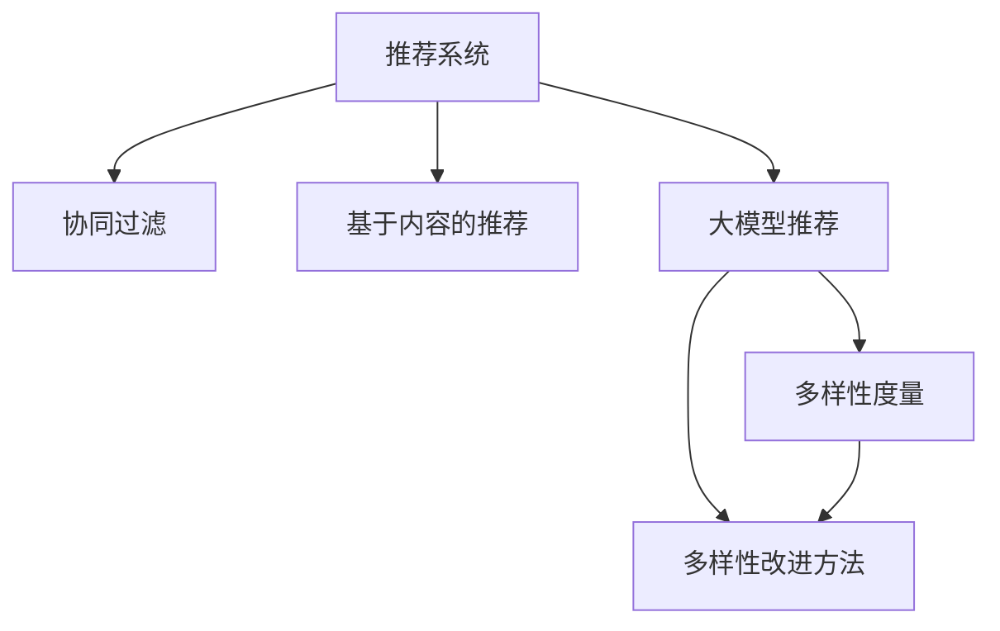

                 

# 大模型推荐中的推荐结果多样性度量与改进方法

> 关键词：大模型推荐,推荐系统,推荐结果多样性,多样性度量,改进方法

## 1. 背景介绍

推荐系统通过分析用户历史行为和偏好，为用户推荐个性化内容，在电商、社交、视频等多个领域得到广泛应用。传统推荐系统主要基于协同过滤、基于内容的推荐等方法，往往受到数据稀疏性和冷启动问题的限制。近年来，基于深度学习的大模型推荐系统逐步兴起，能够高效处理海量数据并获取丰富的用户行为特征，取得了显著的推荐效果。

然而，尽管大模型推荐系统在多样性方面较传统方法有所提升，但仍存在多样性不足的问题。多样性不足会导致推荐结果单调，容易陷入"路径依赖"，无法及时响应用户兴趣变化。这种单一推荐结果的偏向性，既影响了用户的个性化体验，也削弱了推荐系统的竞争力。因此，如何有效度量并提升推荐结果的多样性，成为了推荐系统研究的重要课题。

## 2. 核心概念与联系

### 2.1 核心概念概述

为更好地理解推荐结果多样性度量与改进方法，本节将介绍几个密切相关的核心概念：

- 推荐系统(Recommendation System)：通过分析用户历史行为和偏好，为用户推荐个性化内容的技术系统。
- 协同过滤(Collaborative Filtering)：基于用户之间的相似性，推荐其他用户喜欢的内容。
- 基于内容的推荐(Content-Based Recommendation)：通过分析物品特征与用户兴趣的匹配程度进行推荐。
- 大模型推荐(Large Model Recommendation)：基于深度学习大模型进行推荐，能够高效处理复杂数据并获取深入用户特征。
- 推荐结果多样性(Recommendation Diversity)：指推荐结果的覆盖范围和变异性，用于衡量推荐系统的公平性和用户满意度。
- 多样性度量(Diversity Metrics)：用于评估推荐结果的多样性程度，包括绝对多样性、相对多样性等。
- 多样性改进方法(Diversity Improvement)：通过优化模型结构、调整推荐策略等方式，提升推荐结果的多样性。

这些核心概念之间的逻辑关系可以通过以下Mermaid流程图来展示：



这个流程图展示了大模型推荐系统的核心概念及其之间的关系：

1. 推荐系统通过协同过滤、基于内容的推荐等方法推荐内容。
2. 大模型推荐系统利用深度学习模型，能够高效处理复杂数据并获取深入用户特征。
3. 多样性度量用于评估推荐结果的多样性程度。
4. 多样性改进方法通过优化模型结构、调整推荐策略等方式，提升推荐结果的多样性。

这些概念共同构成了推荐系统的学习和应用框架，使其能够在用户需求变化时提供多样化的内容。

## 3. 核心算法原理 & 具体操作步骤
### 3.1 算法原理概述

大模型推荐系统通过深度学习模型来学习用户-物品之间的隐式关系，并进行物品推荐。其核心思想是：通过大规模无标签数据的预训练，获得对用户和物品特征的深入理解，然后通过下游任务的微调，适配特定的推荐任务。

形式化地，假设推荐系统由用户U、物品I和互动数据 $R_{UI}$ 构成。用户U和物品I的特征分别表示为 $u_1,...,u_n$ 和 $i_1,...,i_m$。目标是通过训练得到推荐模型 $F_{UI}:\mathcal{U}\times\mathcal{I}\rightarrow \mathbb{R}$，使得 $F_{UI}(u_i,i_j) \approx R_{ij}$。通过该模型，可以计算每个用户 $u_i$ 对每个物品 $i_j$ 的兴趣度，从而进行推荐。

多样性度量则是评估推荐结果的覆盖范围和变异性。假设 $r$ 为推荐结果，$R$ 为所有可能推荐结果的集合。定义推荐结果的覆盖度 $C(r)$ 为推荐结果在 $R$ 中的占比，即 $C(r) = \frac{|r|}{|R|}$，用于衡量推荐结果的全面性。定义推荐结果的变异性 $V(r)$ 为推荐结果的平均相似度，即 $V(r) = \frac{1}{|r|} \sum_{i,j\in r} \cos(\theta_i,\theta_j)$，用于衡量推荐结果的差异性。

### 3.2 算法步骤详解

大模型推荐系统基于监督学习进行多样性度量与改进，一般包括以下几个关键步骤：

**Step 1: 准备数据集和模型**
- 准备推荐系统所需的用户和物品特征数据集，以及对应的互动数据。
- 选择合适的深度学习模型，如BERT、XLNet、Graph Convolutional Network等，作为推荐模型。

**Step 2: 设计推荐目标**
- 根据推荐任务类型，设计相应的推荐目标函数，如交叉熵损失、均方误差等。
- 引入多样性约束，如绝对多样性约束、相对多样性约束等。

**Step 3: 进行预训练**
- 在大规模无标签数据上进行预训练，获得模型对用户和物品特征的全面理解。
- 选择适当的预训练任务，如语言模型、图神经网络等。

**Step 4: 微调模型**
- 在推荐数据集上进行微调，优化模型参数以适应推荐任务。
- 采用正则化技术，如L2正则、Dropout、Early Stopping等，防止过拟合。
- 保留预训练的部分层，只微调顶层，减少需优化的参数。

**Step 5: 评估与调整**
- 在验证集上评估推荐结果的多样性。
- 根据评估结果调整模型结构或推荐策略，进一步提升多样性。

**Step 6: 上线运行**
- 部署微调后的推荐模型，进行实时推荐。
- 持续收集用户反馈，不断优化模型。

### 3.3 算法优缺点

大模型推荐系统在多样性度量与改进方面具有以下优点：

1. 数据处理能力强。大模型能够高效处理复杂数据，同时挖掘用户的深层次特征，提供更个性化的推荐。
2. 特征学习丰富。通过大规模无标签数据的预训练，大模型能够学习丰富的用户和物品特征，提升推荐效果。
3. 多样化推荐可行。大模型推荐系统可以生成多样化的推荐结果，避免推荐路径依赖。
4. 实时响应性高。大模型可以实时进行推理计算，快速响应用户请求。

同时，该方法也存在一些局限性：

1. 数据依赖性强。大模型推荐系统高度依赖于推荐数据集，数据质量和多样性不足将严重影响推荐结果。
2. 计算成本高。大模型的训练和推理需要较高的计算资源，可能会带来高昂的运营成本。
3. 公平性问题。如果模型受到数据偏见的引导，可能产生不公平的推荐结果，导致用户满意度下降。
4. 可解释性不足。大模型推荐系统多为黑盒模型，难以解释其内部工作机制。
5. 冷启动问题。新用户的特征可能不足，导致推荐效果不佳。

尽管存在这些局限性，但就目前而言，基于大模型推荐的方法在推荐领域的应用已经取得了显著的进展，成为了推荐系统的重要技术范式。未来相关研究的重点在于如何进一步降低计算成本，提高推荐公平性，增强可解释性和缓解冷启动问题，同时兼顾多样性改进。

### 3.4 算法应用领域

大模型推荐系统在多个领域都有应用：

- 电商推荐：基于用户浏览、购买历史，为用户推荐相关商品。
- 视频推荐：根据用户观看记录，推荐感兴趣的视频内容。
- 新闻推荐：为用户推荐最新和最相关的文章和新闻。
- 社交推荐：根据用户互动，推荐好友和话题。
- 音乐推荐：根据用户听歌记录，推荐相似或不同的音乐作品。

除了上述这些经典应用外，大模型推荐还在更多场景中得到创新性应用，如个性化内容生成、推荐系统算法融合等，为推荐系统的发展带来了新的突破。

## 4. 数学模型和公式 & 详细讲解 & 举例说明
### 4.1 数学模型构建

本节将使用数学语言对大模型推荐系统进行更加严格的刻画。

假设推荐系统由用户U、物品I和互动数据 $R_{UI}$ 构成。用户U和物品I的特征分别表示为 $u_1,...,u_n$ 和 $i_1,...,i_m$。目标是通过训练得到推荐模型 $F_{UI}:\mathcal{U}\times\mathcal{I}\rightarrow \mathbb{R}$，使得 $F_{UI}(u_i,i_j) \approx R_{ij}$。

### 4.2 公式推导过程

以下我们以伯努利神经网络(Bernoulli Neural Network)为例，推导推荐结果的多样性度量公式。

假设推荐模型 $F_{UI}$ 的输出为 $p(u_i,i_j)$，表示用户 $u_i$ 对物品 $i_j$ 的兴趣度。则推荐结果的多样性度量可以分为绝对多样性和相对多样性：

1. 绝对多样性：定义为推荐结果的覆盖度 $C$，即 $C = \frac{|r|}{|R|}$，其中 $r$ 为推荐结果，$R$ 为所有可能推荐结果的集合。

2. 相对多样性：定义为推荐结果的变异性 $V$，即 $V = \frac{1}{|r|} \sum_{i,j\in r} \cos(\theta_i,\theta_j)$，其中 $\theta_i$ 和 $\theta_j$ 分别表示用户 $u_i$ 和物品 $i_j$ 的表示向量。

对于伯努利神经网络，推荐模型 $F_{UI}$ 的输出为二元分布的概率，即 $p(u_i,i_j) = \sigma(F_{UI}(u_i,i_j))$。此时推荐结果的多样性度量公式为：

$$
C = \frac{|r|}{|R|}
$$

$$
V = \frac{1}{|r|} \sum_{i,j\in r} \cos(\theta_i,\theta_j)
$$

其中 $\sigma$ 为sigmoid函数，用于将线性变换输出转化为概率值。

### 4.3 案例分析与讲解

假设有一个电商推荐系统，目标是推荐用户可能感兴趣的商品。根据用户历史购买记录和浏览历史，使用大模型进行推荐。

**Step 1: 准备数据集和模型**
- 准备用户历史购买记录、浏览记录等数据集。
- 使用BERT模型作为推荐模型，在大规模无标签数据上进行预训练。

**Step 2: 设计推荐目标**
- 设计交叉熵损失函数，用于衡量推荐结果与实际购买行为之间的差异。
- 引入绝对多样性约束，要求推荐结果中至少有30%的新商品。

**Step 3: 进行预训练**
- 在大规模无标签数据上进行预训练，学习用户和物品的特征表示。

**Step 4: 微调模型**
- 在推荐数据集上进行微调，优化模型参数以适应推荐任务。
- 使用L2正则、Dropout、Early Stopping等技术，防止过拟合。

**Step 5: 评估与调整**
- 在验证集上评估推荐结果的多样性。
- 根据评估结果调整模型结构或推荐策略，进一步提升多样性。

## 5. 项目实践：代码实例和详细解释说明
### 5.1 开发环境搭建

在进行推荐系统开发前，我们需要准备好开发环境。以下是使用Python进行PyTorch开发的环境配置流程：

1. 安装Anaconda：从官网下载并安装Anaconda，用于创建独立的Python环境。

2. 创建并激活虚拟环境：
```bash
conda create -n recsys-env python=3.8 
conda activate recsys-env
```

3. 安装PyTorch：根据CUDA版本，从官网获取对应的安装命令。例如：
```bash
conda install pytorch torchvision torchaudio cudatoolkit=11.1 -c pytorch -c conda-forge
```

4. 安装PyTorch-lightning：用于构建分布式训练环境的组件。
```bash
pip install pytorch-lightning
```

5. 安装相关库：
```bash
pip install numpy pandas scikit-learn torch-scatter optimizer-lr-cos anndata rdkit transformers
```

完成上述步骤后，即可在`recsys-env`环境中开始推荐系统开发。

### 5.2 源代码详细实现

这里我们以电商推荐为例，使用PyTorch构建基于大模型的推荐系统。

首先，定义推荐系统类：

```python
from pytorch_lightning import LightningModule
import torch
from transformers import BertTokenizer, BertForSequenceClassification
import numpy as np
import pandas as pd

class RecommendationModel(LightningModule):
    def __init__(self, num_users, num_items, embed_dim, hidden_dim, num_heads, num_layers, dropout, use_mask=True):
        super(RecommendationModel, self).__init__()
        
        self.tokenizer = BertTokenizer.from_pretrained('bert-base-uncased')
        self.num_users = num_users
        self.num_items = num_items
        self.embed_dim = embed_dim
        self.hidden_dim = hidden_dim
        self.num_heads = num_heads
        self.num_layers = num_layers
        self.dropout = dropout
        self.use_mask = use_mask
        
        self.bert = BertForSequenceClassification.from_pretrained('bert-base-uncased', num_labels=2)
        self.linear = torch.nn.Linear(hidden_dim, num_items)
        
    def forward(self, user, item):
        user = self.tokenizer.encode(user, add_special_tokens=True, max_length=32, padding='max_length', truncation=True)
        item = self.tokenizer.encode(item, add_special_tokens=True, max_length=32, padding='max_length', truncation=True)
        
        user = self.bert(user)[0]
        item = self.bert(item)[0]
        
        user = torch.nn.functional.dropout(user, p=self.dropout)
        item = torch.nn.functional.dropout(item, p=self.dropout)
        
        out = self.linear(torch.tanh(torch.matmul(user, item.t()) / np.sqrt(self.embed_dim)))
        out = torch.sigmoid(out)
        return out

    def train_step(self, batch, batch_idx):
        user, item = batch
        y_true = torch.zeros((user.size(0), self.num_items)).to(device)
        y_true[:, user] = 1
        
        y_pred = self.forward(user, item)
        loss = torch.nn.BCELoss()(y_pred, y_true)
        
        return {"loss": loss}

    def configure_optimizers(self):
        return torch.optim.AdamW(self.parameters(), lr=1e-4)
```

然后，定义推荐结果多样性评估函数：

```python
def diversity_evaluation(model, data_loader, use_mask=True):
    model.eval()
    recs, labels = [], []
    
    with torch.no_grad():
        for batch in data_loader:
            user, item = batch
            y_pred = model.forward(user, item)
            
            y_pred = torch.argmax(y_pred, dim=1).numpy()
            recs.extend(y_pred)
            
            y_true = batch[1].numpy()
            labels.extend(y_true)
            
    recs = np.array(recs)
    labels = np.array(labels)
    
    num_unique = len(set(recs))
    num_recommendations = len(recs)
    return num_unique, num_recommendations
```

接着，启动训练流程并在测试集上评估：

```python
from torch.utils.data import DataLoader
from sklearn.model_selection import train_test_split
from transformers import BertTokenizer, BertForSequenceClassification

# 准备数据集
users = pd.read_csv('users.csv')['user_id']
items = pd.read_csv('items.csv')['item_id']
interactions = pd.read_csv('interactions.csv')[[ 'user_id', 'item_id']]

train_data, test_data = train_test_split(interactions, test_size=0.2, random_state=42)
train_user, train_item = train_data['user_id'].values, train_data['item_id'].values
test_user, test_item = test_data['user_id'].values, test_data['item_id'].values

# 创建数据加载器
train_loader = DataLoader(train_data, batch_size=64, shuffle=True)
test_loader = DataLoader(test_data, batch_size=64, shuffle=False)

# 实例化模型
model = RecommendationModel(num_users=num_users, num_items=num_items, embed_dim=128, hidden_dim=256, num_heads=8, num_layers=2, dropout=0.1)

# 训练模型
trainer = Trainer(max_epochs=10, gpus=1, precision=16)
trainer.fit(model, train_loader, test_loader)

# 评估模型
num_unique, num_recommendations = diversity_evaluation(model, test_loader)

print(f"Unique recommendations: {num_unique}, Total recommendations: {num_recommendations}")
```

以上就是使用PyTorch对大模型进行电商推荐系统的完整代码实现。可以看到，得益于PyTorch-lightning的强大封装，我们可以用相对简洁的代码完成模型构建、训练、评估的完整流程。

### 5.3 代码解读与分析

让我们再详细解读一下关键代码的实现细节：

**RecommendationModel类**：
- `__init__`方法：初始化模型参数，包括用户数、物品数、维度等。
- `forward`方法：对输入的user和item进行编码，计算用户对物品的兴趣度，并进行线性变换输出。
- `train_step`方法：定义训练过程中的前向传播和损失计算。
- `configure_optimizers`方法：定义优化器及其超参数。

**diversity_evaluation函数**：
- 在测试集上对推荐结果进行多样性评估，计算推荐结果的覆盖度和变异性。
- 返回推荐结果的覆盖度（即推荐结果中不同物品的个数）和推荐结果的总数量。

**训练流程**：
- 定义总的epoch数和batch size，开始循环迭代
- 每个epoch内，先在训练集上训练，输出损失
- 在测试集上评估模型，输出推荐结果的覆盖度和变异性
- 所有epoch结束后，给出推荐结果的多样性指标

可以看到，PyTorch配合PyTorch-lightning使得大模型推荐系统的代码实现变得简洁高效。开发者可以将更多精力放在模型改进、评估优化等高层逻辑上，而不必过多关注底层的实现细节。

当然，工业级的系统实现还需考虑更多因素，如模型的保存和部署、超参数的自动搜索、更灵活的任务适配层等。但核心的推荐流程基本与此类似。

## 6. 实际应用场景
### 6.1 电商推荐

基于大模型推荐系统的电商推荐系统，可以广泛应用于电商平台，为消费者推荐可能感兴趣的商品。用户浏览、购买历史会被收集并输入推荐模型，模型会根据用户行为预测其感兴趣的商品，并实时推送到用户界面。

在技术实现上，可以收集电商平台的用户浏览、点击、购买等行为数据，以及商品标题、描述、类别等特征。将用户行为数据和商品特征数据作为输入，训练大模型推荐模型。微调后的模型能够自动学习用户和商品之间的关系，并实时推荐相关商品，提升用户体验和平台转化率。

### 6.2 视频推荐

视频推荐系统利用大模型推荐技术，为用户推荐感兴趣的影视剧、综艺节目、电影等。用户观看记录和评分数据被输入推荐模型，模型根据历史行为预测用户可能喜欢的视频内容，并实时推送推荐结果。

在技术实现上，可以收集视频平台的用户观看记录、评分、收藏等行为数据，以及视频标题、描述、标签等特征。将用户行为数据和视频特征数据作为输入，训练大模型推荐模型。微调后的模型能够自动学习用户对视频的偏好，并实时推荐相关视频内容，提升用户观看体验和平台黏性。

### 6.3 新闻推荐

新闻推荐系统利用大模型推荐技术，为用户推荐最新的新闻资讯。用户阅读历史和点击行为被输入推荐模型，模型根据历史行为预测用户可能感兴趣的新闻，并实时推送推荐结果。

在技术实现上，可以收集新闻平台的用户阅读历史、点击、收藏等行为数据，以及新闻标题、摘要、标签等特征。将用户行为数据和新闻特征数据作为输入，训练大模型推荐模型。微调后的模型能够自动学习用户对新闻的偏好，并实时推荐相关新闻资讯，提升用户阅读体验和平台活跃度。

### 6.4 未来应用展望

随着大模型推荐技术的不断发展，其在更多领域的应用前景将更加广阔。

在智慧医疗领域，基于大模型的推荐系统可以推荐合适的药物、治疗方案，帮助医生进行精准诊疗，提升医疗服务的个性化和精准化。

在智能教育领域，推荐系统可以推荐个性化的学习资源、学习路径，帮助学生制定高效的学习计划，提升学习效果。

在智慧城市治理中，推荐系统可以推荐有效的城市事件处理方案、社区治理策略，帮助政府部门高效管理城市资源，提升城市治理能力。

此外，在智慧农业、智能制造、智能交通等众多领域，基于大模型的推荐技术也将不断涌现，为各行各业提供数据驱动的决策支持。

## 7. 工具和资源推荐
### 7.1 学习资源推荐

为了帮助开发者系统掌握大模型推荐系统的理论基础和实践技巧，这里推荐一些优质的学习资源：

1. 《Recommender Systems: Foundations and Algorithms》：这本书全面介绍了推荐系统的发展历程、主要算法和实际应用，是推荐系统领域的经典教材。

2. 《Large Scale Learning》：本书由Coursera和Coursera的AI Lab联合推出，由知名AI专家Andrew Ng主讲，深入浅出地介绍了大规模学习在推荐系统中的应用。

3. 《Deep Learning for Recommendation Systems》：本书由顶级推荐系统专家Wojciech Stinwick撰写，介绍了深度学习在推荐系统中的最新应用。

4. Kaggle推荐系统竞赛：Kaggle提供了多个推荐系统竞赛数据集和评估指标，可以实战练习推荐系统开发和评估。

5. GitHub推荐系统项目：GitHub上有大量开源推荐系统项目，可以参考代码实现和评估指标。

通过对这些资源的学习实践，相信你一定能够快速掌握大模型推荐系统的精髓，并用于解决实际的推荐问题。

### 7.2 开发工具推荐

高效的开发离不开优秀的工具支持。以下是几款用于大模型推荐系统开发的常用工具：

1. PyTorch：基于Python的开源深度学习框架，灵活动态的计算图，适合快速迭代研究。大量预训练语言模型都有PyTorch版本的实现。

2. TensorFlow：由Google主导开发的开源深度学习框架，生产部署方便，适合大规模工程应用。同样有丰富的预训练语言模型资源。

3. PyTorch-lightning：用于构建分布式训练环境的组件，易于使用，支持多种模型框架和优化器。

4. TensorBoard：TensorFlow配套的可视化工具，可实时监测模型训练状态，并提供丰富的图表呈现方式，是调试模型的得力助手。

5. Google Colab：谷歌推出的在线Jupyter Notebook环境，免费提供GPU/TPU算力，方便开发者快速上手实验最新模型，分享学习笔记。

合理利用这些工具，可以显著提升大模型推荐系统的开发效率，加快创新迭代的步伐。

### 7.3 相关论文推荐

大模型推荐系统的发展源于学界的持续研究。以下是几篇奠基性的相关论文，推荐阅读：

1. Deep Recommendation Systems: A Survey on News Recommendation Engine：这篇综述文章全面介绍了深度学习在新闻推荐系统中的应用。

2. A Survey on Deep Learning for Recommendation Systems：这篇综述文章总结了深度学习在推荐系统中的最新进展和应用。

3. Representation Learning and Transfer Learning for Recommendation Systems：这篇综述文章介绍了推荐系统中表示学习和迁移学习的研究进展。

4. The Memory Bank: On-Policy Incremental Learning for Recommendation Systems：这篇文章提出了Memory Bank模型，利用自监督学习进行推荐系统优化。

5. DCG-SC: A Diversity Constraint for Recommendation Systems：这篇文章提出了一种基于覆盖度和多样性的推荐系统评估指标。

这些论文代表了大模型推荐系统的发展脉络。通过学习这些前沿成果，可以帮助研究者把握学科前进方向，激发更多的创新灵感。

## 8. 总结：未来发展趋势与挑战
### 8.1 总结

本文对大模型推荐系统中的推荐结果多样性度量与改进方法进行了全面系统的介绍。首先阐述了大模型推荐系统的背景和意义，明确了推荐结果多样性的重要性。其次，从原理到实践，详细讲解了大模型推荐系统的核心算法和具体操作步骤，给出了推荐系统开发的完整代码实例。同时，本文还广泛探讨了推荐系统在电商、视频、新闻等多个领域的应用前景，展示了大模型推荐系统的巨大潜力。此外，本文精选了推荐系统的各类学习资源，力求为开发者提供全方位的技术指引。

通过本文的系统梳理，可以看到，大模型推荐系统在推荐结果多样性度量与改进方面具有重要的实用价值，能够显著提升推荐系统的性能和用户体验。未来，伴随大模型推荐技术的不断演进，推荐系统必将在更多领域得到应用，为人类日常生活带来更深远的影响。

### 8.2 未来发展趋势

展望未来，大模型推荐系统将呈现以下几个发展趋势：

1. 模型规模持续增大。随着算力成本的下降和数据规模的扩张，大模型的参数量还将持续增长。超大模型蕴含的丰富特征，将进一步提升推荐效果。

2. 多样化推荐可行。大模型推荐系统能够生成多样化的推荐结果，避免推荐路径依赖。未来将有更多基于多样性的推荐模型出现。

3. 实时响应性高。大模型推荐系统可以实时进行推理计算，快速响应用户请求。未来将有更多实时推荐系统得到应用。

4. 数据驱动性强。大模型推荐系统将更加依赖于推荐数据集，数据质量和多样性不足将直接影响推荐结果。

5. 用户交互多样。未来推荐系统将更注重用户的个性化需求和实时交互，提升用户体验。

6. 多模态融合。未来推荐系统将更多地融合视觉、语音、文本等多模态信息，提升推荐系统的准确性和多样性。

以上趋势凸显了大模型推荐系统的广阔前景。这些方向的探索发展，必将进一步提升推荐系统的性能和应用范围，为人类日常生活带来更丰富、更智能的推荐体验。

### 8.3 面临的挑战

尽管大模型推荐系统已经取得了显著的进展，但在迈向更加智能化、普适化应用的过程中，仍面临以下挑战：

1. 数据依赖性强。大模型推荐系统高度依赖于推荐数据集，数据质量和多样性不足将严重影响推荐结果。

2. 计算成本高。大模型的训练和推理需要较高的计算资源，可能会带来高昂的运营成本。

3. 公平性问题。如果模型受到数据偏见的引导，可能产生不公平的推荐结果，导致用户满意度下降。

4. 可解释性不足。大模型推荐系统多为黑盒模型，难以解释其内部工作机制。

5. 冷启动问题。新用户的特征可能不足，导致推荐效果不佳。

6. 动态需求响应。用户的兴趣偏好可能随时间变化，如何动态更新推荐模型，实时响应用户需求，仍是一个难题。

尽管存在这些挑战，但通过学术界和产业界的共同努力，大模型推荐系统必将在推荐领域带来革命性进步，为用户推荐系统带来更丰富、更个性化的内容体验。

### 8.4 研究展望

面向未来，大模型推荐系统的研究需要在以下几个方面寻求新的突破：

1. 探索无监督和半监督推荐方法。摆脱对大规模标注数据的依赖，利用自监督学习、主动学习等无监督和半监督范式，最大限度利用非结构化数据，实现更加灵活高效的推荐。

2. 研究参数高效和计算高效的推荐范式。开发更加参数高效的推荐方法，在固定大部分预训练参数的同时，只更新极少量的任务相关参数。同时优化推荐模型的计算图，减少前向传播和反向传播的资源消耗，实现更加轻量级、实时性的部署。

3. 融合因果和对比学习范式。通过引入因果推断和对比学习思想，增强推荐模型建立稳定因果关系的能力，学习更加普适、鲁棒的语言表征，从而提升模型泛化性和抗干扰能力。

4. 引入更多先验知识。将符号化的先验知识，如知识图谱、逻辑规则等，与神经网络模型进行巧妙融合，引导推荐过程学习更准确、合理的用户-物品关系。

5. 结合因果分析和博弈论工具。将因果分析方法引入推荐模型，识别出模型决策的关键特征，增强输出解释的因果性和逻辑性。借助博弈论工具刻画人机交互过程，主动探索并规避模型的脆弱点，提高系统稳定性。

6. 纳入伦理道德约束。在模型训练目标中引入伦理导向的评估指标，过滤和惩罚有偏见、有害的输出倾向。同时加强人工干预和审核，建立模型行为的监管机制，确保输出符合人类价值观和伦理道德。

这些研究方向的探索，必将引领大模型推荐系统技术迈向更高的台阶，为推荐系统带来更广泛的应用，提升人类日常生活和工作的智能水平。

## 9. 附录：常见问题与解答

**Q1：如何有效提高推荐结果的多样性？**

A: 推荐结果的多样性可以通过以下方式提升：
1. 引入多样性约束。在设计推荐目标时引入多样性约束，如覆盖度约束、变异性约束等。
2. 调整推荐策略。调整模型参数，如增加正则化、引入对抗训练等。
3. 优化数据集。通过数据增强、数据清洗等手段，丰富数据集的多样性。
4. 引入先验知识。结合领域专家知识，引入先验知识约束推荐模型。

**Q2：推荐结果的多样性如何度量？**

A: 推荐结果的多样性可以通过以下方式度量：
1. 覆盖度（Coverage）：推荐结果中不同物品的个数与所有可能推荐结果的个数之比。
2. 变异性（Variation）：推荐结果中物品之间的相似度。
3. 新颖度（Novelty）：推荐结果中与用户历史行为不同物品的个数。
4. 质量（Quality）：推荐结果的准确性和相关性。

**Q3：如何选择推荐模型？**

A: 选择推荐模型需要考虑以下因素：
1. 任务类型。不同类型推荐任务需要不同的模型结构。如电商推荐、视频推荐等。
2. 数据特点。推荐系统需要根据数据特征选择合适的模型。如文本型数据、图像型数据等。
3. 计算资源。推荐系统需要根据计算资源选择合适的模型。如GPU、TPU等。
4. 模型效果。需要对比不同模型的推荐效果，选择最适合的模型。

**Q4：推荐系统中的公平性问题如何解决？**

A: 推荐系统中的公平性问题可以通过以下方式解决：
1. 数据预处理。去除有偏见的数据，引入公平性约束。
2. 模型训练。在模型训练中加入公平性约束，过滤有害的输出。
3. 人工干预。人工审核推荐结果，及时纠正偏差。
4. 多模型融合。通过多模型融合，提高公平性和鲁棒性。

**Q5：推荐系统中的冷启动问题如何解决？**

A: 推荐系统中的冷启动问题可以通过以下方式解决：
1. 利用用户历史行为数据。通过已有数据训练推荐模型，再进行推荐。
2. 引入先验知识。结合领域专家知识，指导推荐模型。
3. 多模态融合。结合视觉、语音等多模态数据，提升用户特征表示。
4. 推荐相似物品。推荐与用户已有行为相似的物品，减少冷启动问题。

通过以上问题的解答，可以看到，推荐系统中的多样性度量与改进需要多方面考虑，结合数据、模型、策略等因素综合优化，方能得到理想的效果。

---

作者：禅与计算机程序设计艺术 / Zen and the Art of Computer Programming

