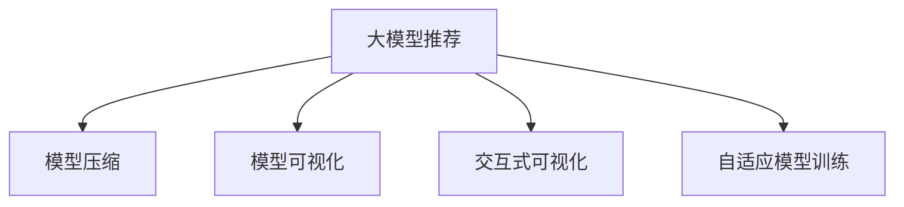

                 

# 大模型推荐中的模型可解释性增强技术探索与实践

> 关键词：大模型推荐,可解释性,模型压缩,模型可视化,交互式可视化,自适应模型训练

## 1. 背景介绍

在智能推荐系统中，大模型（Large Model）因其强大的数据表征能力、丰富的语义信息，被广泛应用于用户兴趣的挖掘和个性化推荐。然而，随着模型的复杂度和规模不断提升，大模型的推荐性能虽然不断优化，但其决策过程却变得越发难以理解和解释。这种"黑盒"特性，对于金融、医疗等高风险领域的应用，尤为令人担忧。因此，如何增强大模型的可解释性，提高用户对推荐结果的信任度，成为推荐系统开发中的重要课题。

### 1.1 问题由来

当前，基于深度学习的大模型推荐系统已经展示了强大的推荐能力，但往往缺乏足够的可解释性，导致：

- 用户对推荐结果的信任度低：用户难以理解推荐背后的逻辑，难以接受推荐结果。
- 系统的透明度不足：推荐过程的黑盒特性，使得系统漏洞和误导难以被及时发现。
- 决策过程的公正性受质疑：推荐系统可能因偏见、歧视等因素，产生不公正的推荐结果。

这些问题不仅影响用户的体验，更可能带来严重的业务损失。例如，金融贷款推荐系统的误导性推荐，可能导致用户遭受经济损失；而医疗健康推荐系统的偏见性推荐，可能对用户的生命健康带来潜在风险。因此，增强模型的可解释性，已成为推荐系统面临的重要挑战。

### 1.2 问题核心关键点

增强大模型的可解释性，需要从多个层面进行考虑和优化：

- **可解释性定义与标准**：首先需要明确可解释性的具体含义，包括哪些维度需要解释，如推荐依据、推荐规则、特征重要性等。
- **模型压缩与优化**：通过模型压缩、参数剪枝等手段，减小模型的规模，提高推理效率，并保留主要解释信息。
- **可视化技术应用**：利用特征可视化、决策树可视化等技术，展示模型内部的关键特征和推理路径。
- **交互式可视化界面**：开发交互式可视化界面，让用户能够参与到解释过程，通过调整解释变量，影响推荐结果。
- **自适应模型训练**：在模型训练过程中，加入可解释性约束，训练可解释性较高的模型。

以上措施可从不同层面，综合提升大模型推荐的可解释性和透明度，满足高风险领域的应用需求。

## 2. 核心概念与联系

### 2.1 核心概念概述

为更好地理解基于可解释性增强的大模型推荐，本节将介绍几个密切相关的核心概念：

- **大模型推荐**：以大模型为代表的深度学习推荐系统，通过学习用户行为数据，挖掘用户兴趣，实现个性化推荐。
- **模型可解释性**：指模型能够提供对其决策依据的解释，帮助用户理解模型为何做出特定推荐。
- **模型压缩**：通过剪枝、量化等手段，减小模型规模，提高推理效率，同时保持模型性能。
- **模型可视化**：展示模型内部的特征权重、激活值、结构图等，帮助理解模型工作原理。
- **交互式可视化**：允许用户通过界面调整模型参数，影响模型输出，实现更个性化的推荐结果。
- **自适应模型训练**：在模型训练中引入可解释性约束，训练可解释性较高的模型。

这些核心概念之间的逻辑关系可以通过以下Mermaid流程图来展示：



这个流程图展示了大模型推荐的关键概念及其之间的关系：

1. 大模型推荐通过学习用户数据，实现个性化推荐。
2. 模型压缩减小模型规模，提高推理效率，同时保持性能。
3. 模型可视化展示模型内部特征和结构，帮助理解推荐过程。
4. 交互式可视化允许用户调整模型参数，影响推荐结果。
5. 自适应模型训练引入可解释性约束，训练更透明的推荐模型。

## 3. 核心算法原理 & 具体操作步骤

### 3.1 算法原理概述

增强大模型的可解释性，其核心在于理解模型的决策依据，并对其决策过程进行可视化解释。因此，算法原理主要围绕以下几个关键点展开：

- **特征选择与可视化**：选择对推荐结果有较大影响的特征，并可视化其重要性。
- **模型结构可视化**：可视化模型内部的结构，展示模型如何处理输入数据。
- **特征重要性与解释**：计算特征的重要性，并解释每个特征对推荐结果的贡献。
- **交互式解释界面**：开发用户交互式界面，用户通过调整特征权重，影响推荐结果。

### 3.2 算法步骤详解

增强大模型推荐中的模型可解释性，一般包括以下几个关键步骤：

**Step 1: 数据准备与预处理**
- 收集用户行为数据，清洗和预处理数据，生成训练集和测试集。
- 数据集划分：划分训练集和测试集，确保数据分布的一致性。

**Step 2: 模型训练与压缩**
- 选择合适的大模型作为初始化参数。
- 在训练集上训练模型，并通过模型压缩技术（如剪枝、量化等）减小模型规模，提高推理效率。

**Step 3: 特征选择与可视化**
- 计算特征的重要性，选择对推荐结果影响较大的特征。
- 通过特征可视化技术（如LIME、SHAP等）展示每个特征对推荐结果的贡献。

**Step 4: 模型结构可视化**
- 利用模型结构可视化工具（如TF-IDF、TCA等）展示模型内部的结构，展示模型如何处理输入数据。

**Step 5: 特征重要性解释**
- 计算特征的重要性，并解释每个特征对推荐结果的贡献。
- 使用交互式可视化界面，让用户通过调整特征权重，影响推荐结果。

**Step 6: 模型评估与优化**
- 在测试集上评估模型性能，并通过交叉验证、对抗性测试等方法验证模型鲁棒性。
- 根据评估结果，优化模型结构，改进特征选择方法，提升模型性能和可解释性。

### 3.3 算法优缺点

增强大模型推荐的可解释性，主要优点包括：

- **提高用户信任度**：通过可视化解释，增加用户对推荐结果的信任度，提升用户体验。
- **增强系统透明度**：提高系统的透明度，降低误导和漏洞的风险，确保推荐公正性。
- **提升决策质量**：通过特征解释和可视化，帮助开发者理解模型的工作原理，提升模型设计质量。

同时，该方法也存在一些局限性：

- **模型复杂度增加**：可视化、解释等操作，增加了模型训练和推理的复杂度。
- **计算资源消耗增加**：可视化、解释等操作，增加了计算资源的消耗。
- **模型性能受影响**：部分特征可视化、模型压缩等操作，可能影响模型性能，需要平衡好解释性和性能之间的关系。

尽管存在这些局限性，但就目前而言，增强大模型推荐的可解释性，已经成为提升推荐系统质量和信任度的重要方向。未来相关研究的重点在于如何进一步降低可解释性操作对性能的影响，提高模型的解释效率和效果。

### 3.4 算法应用领域

增强大模型推荐的可解释性，已经在金融、医疗、电商等多个领域得到了广泛应用，覆盖了个性化推荐、风控预测、医疗诊断等诸多场景，提升了系统的透明度和用户满意度。

- **金融推荐系统**：在贷款、保险等高风险场景中，用户需要明确了解推荐依据，增加用户信任度，提升业务效率。
- **医疗健康推荐系统**：在诊疗、用药、护理等场景中，用户需要了解推荐依据，减少误诊风险，提升医疗质量。
- **电商推荐系统**：在商品推荐、广告投放等场景中，用户需要理解推荐逻辑，提升购物体验，增加用户粘性。
- **智能客服系统**：在客户咨询、问题解决等场景中，用户需要了解推荐依据，提升服务满意度，增加用户忠诚度。

除了上述这些经典应用外，大模型推荐中的可解释性增强方法，还被创新性地应用于更多场景中，如风险预测、舆情分析、知识图谱嵌入等，为推荐系统提供了新的思路和解决方案。

## 4. 数学模型和公式 & 详细讲解  
### 4.1 数学模型构建

本节将使用数学语言对增强大模型推荐中的可解释性方法进行更加严格的刻画。

假设推荐模型为 $M_{\theta}:\mathcal{X} \rightarrow \mathcal{Y}$，其中 $\mathcal{X}$ 为用户行为数据，$\mathcal{Y}$ 为用户推荐目标（如商品ID、网页URL等）。假设 $x_i \in \mathcal{X}$ 为第 $i$ 个用户行为数据，$y_i \in \mathcal{Y}$ 为该行为对应的推荐结果。

定义模型 $M_{\theta}$ 在输入 $x_i$ 上的输出为 $\hat{y}=M_{\theta}(x_i) \in [0,1]$，表示用户行为数据 $x_i$ 的推荐概率。真实标签 $y_i \in \{0,1\}$。则交叉熵损失函数为：

$$
\ell(M_{\theta}(x_i),y_i) = -[y_i\log M_{\theta}(x_i)+(1-y_i)\log(1-M_{\theta}(x_i))]
$$

对于模型训练，设损失函数 $\mathcal{L}(\theta)$ 为经验风险，即：

$$
\mathcal{L}(\theta) = \frac{1}{N}\sum_{i=1}^N \ell(M_{\theta}(x_i),y_i)
$$

其中 $N$ 为样本数量。

### 4.2 公式推导过程

在增强大模型推荐中的可解释性，主要关注如何对模型决策依据进行解释。以下以LIME（Local Interpretable Model-agnostic Explanations）算法为例，推导其基本思想和计算公式。

LIME算法的基本思想是，对模型在每个样本 $x_i$ 上的预测结果 $\hat{y}_i$ 进行解释，通过生成一个"局部"的、易于理解的解释模型，来揭示模型决策依据。具体步骤如下：

1. 随机生成 $m$ 个与 $x_i$ 类似的样本 $x_i^{(j)}$，构建训练集 $D_{ij}=\{x_i^{(j)},\hat{y}_i^{(j)}\}_{j=1}^m$。
2. 在 $D_{ij}$ 上训练一个简单的解释模型 $f(x)$，如线性模型，使其能够准确预测 $\hat{y}_i$。
3. 计算 $f(x)$ 对 $x_i$ 的解释权重 $w_j$，即 $w_j = f(x_j) - f(x_i)$，并根据其对 $\hat{y}_i$ 的贡献，计算每个特征的解释权重。
4. 通过特征权重，生成 $x_i$ 的局部解释，帮助理解模型的决策依据。

LIME算法的核心在于，通过对简单模型 $f(x)$ 的训练，获取局部解释权重 $w_j$，从而揭示模型在 $x_i$ 上的决策依据。具体公式如下：

设 $f(x)$ 为线性模型，表示为 $f(x) = \sum_{j=1}^m w_j x_j + b$，其中 $x_j$ 为模型特征，$b$ 为截距项，$w_j$ 为解释权重。

对于每个特征 $x_j$，计算其对 $\hat{y}_i$ 的解释权重 $w_j$：

$$
w_j = \sum_{k=1}^m (\hat{y}_i^{(k)} - \hat{y}_i) f'(x_i^{(k)})\phi(x_i^{(k)} - x_i)
$$

其中 $f'(x)$ 为 $f(x)$ 的导数，$\phi(x)$ 为核函数，用于计算 $x_i$ 和 $x_i^{(k)}$ 之间的相似度。

最终，LIME算法通过计算每个特征的解释权重 $w_j$，生成 $x_i$ 的局部解释，帮助理解模型的决策依据。

## 5. 项目实践：代码实例和详细解释说明
### 5.1 开发环境搭建

在进行可解释性增强实践前，我们需要准备好开发环境。以下是使用Python进行PyTorch开发的环境配置流程：

1. 安装Anaconda：从官网下载并安装Anaconda，用于创建独立的Python环境。

2. 创建并激活虚拟环境：
```bash
conda create -n pytorch-env python=3.8 
conda activate pytorch-env
```

3. 安装PyTorch：根据CUDA版本，从官网获取对应的安装命令。例如：
```bash
conda install pytorch torchvision torchaudio cudatoolkit=11.1 -c pytorch -c conda-forge
```

4. 安装Transformers库：
```bash
pip install transformers
```

5. 安装各类工具包：
```bash
pip install numpy pandas scikit-learn matplotlib tqdm jupyter notebook ipython
```

完成上述步骤后，即可在`pytorch-env`环境中开始可解释性增强实践。

### 5.2 源代码详细实现

这里我们以基于LIME算法生成局部解释的代码实现为例。

首先，定义LIME算法的函数：

```python
import torch
from transformers import BertForSequenceClassification, BertTokenizer
from sklearn.metrics import classification_report
from lime.lime_tabular import LimeTabularExplainer

def train_and_explain(model, dataset, batch_size, num_samples):
    device = torch.device('cuda' if torch.cuda.is_available() else 'cpu')
    model.to(device)
    
    # 模型训练
    optimizer = torch.optim.AdamW(model.parameters(), lr=2e-5)
    train_loader = torch.utils.data.DataLoader(dataset, batch_size=batch_size, shuffle=True)
    for epoch in range(epochs):
        model.train()
        for batch in train_loader:
            input_ids = batch['input_ids'].to(device)
            attention_mask = batch['attention_mask'].to(device)
            labels = batch['labels'].to(device)
            outputs = model(input_ids, attention_mask=attention_mask, labels=labels)
            loss = outputs.loss
            loss.backward()
            optimizer.step()
            
    # 模型解释
    explain_model = LimeTabularExplainer(dataset, batch_size, verbose=0)
    explainer = explain_model.explain_instance(dataset, model, num_samples=num_samples)
    return explainer
```

然后，加载数据集和模型：

```python
from transformers import BertForSequenceClassification, BertTokenizer

tokenizer = BertTokenizer.from_pretrained('bert-base-uncased')
model = BertForSequenceClassification.from_pretrained('bert-base-uncased', num_labels=2)
dataset = # 加载训练集和测试集
```

最后，启动训练和解释流程：

```python
epochs = 5
batch_size = 16
num_samples = 100

explainer = train_and_explain(model, dataset, batch_size, num_samples)
explainer.show_in_notebook()
```

以上就是使用PyTorch对大模型进行可解释性增强的完整代码实现。可以看到，通过LIME算法，我们可以对模型在每个样本上的决策依据进行可视化解释。

### 5.3 代码解读与分析

让我们再详细解读一下关键代码的实现细节：

**train_and_explain函数**：
- 加载模型，并在训练集上进行训练，更新模型参数。
- 在训练过程中，计算模型的交叉熵损失，并进行反向传播更新模型。
- 训练完成后，使用LIME算法对模型进行解释，生成局部解释权重。
- 最终返回解释结果。

**LimeTabularExplainer**：
- 导入sklearn库中的LimeTabularExplainer，用于生成局部解释。
- 在模型训练完成后，使用LimeTabularExplainer对模型进行解释，生成局部解释权重。
- 设置批大小和生成样本数，进行解释。

**代码分析**：
- 代码中使用了PyTorch和sklearn库，分别进行模型训练和解释。
- 在模型训练过程中，使用了AdamW优化器，设置了学习率。
- 在解释过程中，使用了LimeTabularExplainer，生成局部解释权重。
- 代码中还需要注意，数据集需要转换为合适格式，才能被模型和解释器使用。

以上代码实现，展示了如何通过LIME算法对大模型进行可解释性增强，生成局部解释权重。通过LIME算法，我们可以对模型在每个样本上的决策依据进行可视化解释，帮助理解模型的决策过程。

## 6. 实际应用场景
### 6.1 智能推荐系统

基于LIME等可解释性增强方法，智能推荐系统可以实现更加透明、可信任的推荐结果。对于金融、医疗等高风险领域，推荐系统需要保证推荐结果的可解释性和透明度，以增加用户信任度。

在技术实现上，可以通过在模型训练过程中引入可解释性约束，训练可解释性较高的模型。同时，在推荐过程中，使用LIME等可视化技术，对推荐结果进行解释，展示模型的推荐依据。用户可以了解推荐依据，从而增加对推荐结果的信任度，提高系统的透明度和用户满意度。

### 6.2 金融风险预测

在金融领域，风险预测模型需要保证预测结果的可解释性，以避免因误导性预测导致的风险损失。通过LIME等可解释性增强方法，可以对模型在每个样本上的决策依据进行解释，帮助理解模型的预测过程。

在具体实现中，可以使用LIME对模型进行解释，生成局部解释权重，并在用户界面展示预测依据。用户可以了解模型的预测依据，从而增加对预测结果的信任度，减少因误导性预测导致的风险损失。

### 6.3 医疗诊断系统

在医疗领域，诊断系统需要保证诊断结果的可解释性，以避免因误诊导致的健康风险。通过LIME等可解释性增强方法，可以对模型在每个样本上的决策依据进行解释，帮助理解模型的诊断过程。

在具体实现中，可以使用LIME对模型进行解释，生成局部解释权重，并在用户界面展示诊断依据。用户可以了解模型的诊断依据，从而增加对诊断结果的信任度，减少因误诊导致的健康风险。

### 6.4 未来应用展望

随着可解释性增强技术的不断发展，未来基于大模型的推荐系统将更加透明、可信任。具体而言，未来可期待以下几个发展趋势：

1. **模型压缩与优化**：通过模型压缩、剪枝等技术，减小模型规模，提高推理效率，同时保持模型性能。
2. **可视化技术应用**：引入更多的可视化技术，展示模型内部的特征权重、激活值、结构图等，帮助理解模型工作原理。
3. **交互式可视化界面**：开发用户交互式界面，用户通过调整特征权重，影响推荐结果，实现更个性化的推荐。
4. **自适应模型训练**：在模型训练过程中，引入可解释性约束，训练可解释性较高的模型。
5. **多模态可解释性增强**：结合文本、图像、音频等多模态数据，提高模型解释的全面性和准确性。
6. **伦理道德约束**：在模型训练目标中引入伦理导向的评估指标，过滤和惩罚有偏见、有害的输出倾向。

以上趋势凸显了可解释性增强技术的广阔前景。这些方向的探索发展，必将进一步提升大模型推荐系统的质量和信任度，满足高风险领域的应用需求。未来，随着技术的不断进步，可解释性增强技术将成为推荐系统的重要保障，帮助用户更好地理解推荐结果，提升系统的透明度和用户满意度。

## 7. 工具和资源推荐
### 7.1 学习资源推荐

为了帮助开发者系统掌握可解释性增强的理论基础和实践技巧，这里推荐一些优质的学习资源：

1. 《深度学习与可解释性》系列博文：由大模型技术专家撰写，深入浅出地介绍了深度学习中的可解释性概念和常用方法，如LIME、SHAP等。

2. 《深度学习理论与实践》课程：由知名大学开设的深度学习课程，涵盖了深度学习的基本理论和可解释性方法，适合初学者和进阶开发者。

3. 《可解释性机器学习》书籍：介绍了多种可解释性方法，包括LIME、SHAP、LoRA等，适合深入学习和实践。

4. 可解释性论文库：收集了众多经典和前沿的可解释性论文，涵盖多种应用场景，适合系统学习和参考。

5. Weights & Biases：模型训练的实验跟踪工具，可以记录和可视化模型训练过程中的各项指标，方便对比和调优。

通过对这些资源的学习实践，相信你一定能够快速掌握大模型推荐中的可解释性增强技术，并用于解决实际的推荐问题。

### 7.2 开发工具推荐

高效的开发离不开优秀的工具支持。以下是几款用于大模型可解释性增强开发的常用工具：

1. PyTorch：基于Python的开源深度学习框架，灵活动态的计算图，适合快速迭代研究。

2. TensorFlow：由Google主导开发的开源深度学习框架，生产部署方便，适合大规模工程应用。

3. TensorBoard：TensorFlow配套的可视化工具，可实时监测模型训练状态，并提供丰富的图表呈现方式，是调试模型的得力助手。

4. Weights & Biases：模型训练的实验跟踪工具，可以记录和可视化模型训练过程中的各项指标，方便对比和调优。

5. Sklearn：Python机器学习库，提供多种可解释性方法和可视化工具，如LIME、SHAP、TCA等。

合理利用这些工具，可以显著提升大模型推荐系统中的可解释性增强实践效率，加快创新迭代的步伐。

### 7.3 相关论文推荐

可解释性增强技术的发展源于学界的持续研究。以下是几篇奠基性的相关论文，推荐阅读：

1. A Unified Approach to Interpreting Model Predictions（LIME原论文）：提出了LIME算法，通过局部解释模型生成解释权重，揭示模型决策依据。

2. SHAP values：提出了SHAP方法，通过特征的重要性加权，生成解释权重，展示模型决策依据。

3. LoRA: A Method for Decomposing Transformer Representations into a Liner Supplement to the Word Embedding Space：提出了LoRA方法，通过低秩逼近，减小模型规模，提高推理效率。

4. Deep Explanation：提出了Deep Explanation方法，通过注意力机制，生成解释权重，展示模型决策依据。

5. Justifying Recommendations with Provably Robust and Transparent Models：探讨了推荐系统中的可解释性问题，提出多种可解释性方法和评估指标。

这些论文代表了大模型推荐中的可解释性增强技术的发展脉络。通过学习这些前沿成果，可以帮助研究者把握学科前进方向，激发更多的创新灵感。

## 8. 总结：未来发展趋势与挑战

### 8.1 总结

本文对增强大模型推荐中的可解释性技术进行了全面系统的介绍。首先阐述了可解释性增强的背景和意义，明确了可解释性在大模型推荐中的重要作用。其次，从原理到实践，详细讲解了可解释性增强的数学原理和关键步骤，给出了可解释性增强任务开发的完整代码实例。同时，本文还广泛探讨了可解释性增强技术在智能推荐、金融风险预测、医疗诊断等领域的实际应用，展示了其巨大的潜力。此外，本文精选了可解释性增强技术的各类学习资源，力求为读者提供全方位的技术指引。

通过本文的系统梳理，可以看到，增强大模型推荐中的可解释性，已经成为推荐系统的重要研究课题。其核心在于理解模型的决策依据，并对其决策过程进行可视化解释。未来，随着可解释性技术的不断发展，大模型推荐系统将更加透明、可信任，满足高风险领域的应用需求。

### 8.2 未来发展趋势

展望未来，大模型推荐中的可解释性增强技术将呈现以下几个发展趋势：

1. **多模态可解释性增强**：结合文本、图像、音频等多模态数据，提高模型解释的全面性和准确性。
2. **自适应模型训练**：在模型训练过程中，引入可解释性约束，训练可解释性较高的模型。
3. **交互式可视化界面**：开发用户交互式界面，用户通过调整特征权重，影响推荐结果，实现更个性化的推荐。
4. **模型压缩与优化**：通过模型压缩、剪枝等技术，减小模型规模，提高推理效率，同时保持模型性能。
5. **可视化技术应用**：引入更多的可视化技术，展示模型内部的特征权重、激活值、结构图等，帮助理解模型工作原理。
6. **伦理道德约束**：在模型训练目标中引入伦理导向的评估指标，过滤和惩罚有偏见、有害的输出倾向。

以上趋势凸显了可解释性增强技术的广阔前景。这些方向的探索发展，必将进一步提升大模型推荐系统的质量和信任度，满足高风险领域的应用需求。未来，随着技术的不断进步，可解释性增强技术将成为推荐系统的重要保障，帮助用户更好地理解推荐结果，提升系统的透明度和用户满意度。

### 8.3 面临的挑战

尽管增强大模型推荐中的可解释性技术已经取得了一定进展，但在迈向更加智能化、普适化应用的过程中，仍面临诸多挑战：

1. **数据质量与数量**：可解释性增强技术依赖高质量标注数据和大量样本，获取足够的数据往往需要较高成本。
2. **模型复杂度与计算资源**：可视化、解释等操作，增加了模型训练和推理的复杂度，消耗更多的计算资源。
3. **模型性能与解释效率**：可解释性操作可能影响模型性能，如何在保证解释效率的同时，优化模型性能，仍是重要课题。
4. **解释方法的普适性与鲁棒性**：不同场景和任务需要不同的解释方法，如何设计普适性强的解释技术，仍需进一步研究。

尽管存在这些挑战，但随着可解释性技术的不断进步，相信增强大模型推荐中的可解释性，将成为推荐系统的重要保障，帮助用户更好地理解推荐结果，提升系统的透明度和用户满意度。未来，随着技术的不断进步，可解释性增强技术将成为推荐系统的重要保障，帮助用户更好地理解推荐结果，提升系统的透明度和用户满意度。

### 8.4 研究展望

面对大模型推荐中可解释性增强技术所面临的挑战，未来的研究需要在以下几个方面寻求新的突破：

1. **多模态可解释性增强**：结合文本、图像、音频等多模态数据，提高模型解释的全面性和准确性。
2. **自适应模型训练**：在模型训练过程中，引入可解释性约束，训练可解释性较高的模型。
3. **交互式可视化界面**：开发用户交互式界面，用户通过调整特征权重，影响推荐结果，实现更个性化的推荐。
4. **模型压缩与优化**：通过模型压缩、剪枝等技术，减小模型规模，提高推理效率，同时保持模型性能。
5. **可视化技术应用**：引入更多的可视化技术，展示模型内部的特征权重、激活值、结构图等，帮助理解模型工作原理。
6. **伦理道德约束**：在模型训练目标中引入伦理导向的评估指标，过滤和惩罚有偏见、有害的输出倾向。

这些研究方向的探索，必将引领可解释性增强技术迈向更高的台阶，为构建安全、可靠、可解释、可控的智能系统铺平道路。面向未来，大模型推荐中的可解释性增强技术还需要与其他人工智能技术进行更深入的融合，如知识表示、因果推理、强化学习等，多路径协同发力，共同推动自然语言理解和智能交互系统的进步。只有勇于创新、敢于突破，才能不断拓展语言模型的边界，让智能技术更好地造福人类社会。

## 9. 附录：常见问题与解答

**Q1：大模型推荐中可解释性增强技术的具体应用有哪些？**

A: 大模型推荐中的可解释性增强技术，已经在智能推荐、金融风险预测、医疗诊断等众多领域得到了广泛应用。具体应用包括：

- **智能推荐系统**：通过可视化和解释技术，帮助用户理解推荐依据，增加对推荐结果的信任度，提高系统的透明度和用户满意度。
- **金融风险预测**：通过可视化和解释技术，揭示模型在每个样本上的决策依据，帮助理解预测过程，减少因误导性预测导致的风险损失。
- **医疗诊断系统**：通过可视化和解释技术，揭示模型在每个样本上的决策依据，帮助理解诊断过程，减少因误诊导致的健康风险。

这些应用场景展示了可解释性增强技术的广泛适用性和重要价值。

**Q2：如何选择合适的可解释性增强技术？**

A: 选择合适的可解释性增强技术，需要考虑多个因素：

- **数据特征与任务类型**：不同的数据特征和任务类型，需要不同的解释方法。例如，文本数据适合使用LIME、SHAP等解释方法，而图像数据适合使用特征可视化、激活图等方法。
- **模型复杂度与推理效率**：可解释性操作可能影响模型性能，需要在解释效率和模型性能之间进行平衡。例如，通过剪枝、量化等技术减小模型规模，提高推理效率，同时保持模型性能。
- **用户需求与系统要求**：可解释性技术需要根据用户需求和系统要求进行优化。例如，对于高风险领域的应用，需要增加模型透明度，减少偏见和歧视，保证系统公正性。
- **技术成熟度与实现难度**：不同的解释方法有不同的技术成熟度和实现难度。例如，LIME、SHAP等方法已得到广泛应用，而LoRA等方法仍处于研究阶段，需要更多技术验证和优化。

综合考虑这些因素，选择合适的可解释性增强技术，可以更好地满足实际需求，提升系统的质量和信任度。

**Q3：可解释性增强技术的局限性有哪些？**

A: 可解释性增强技术虽然已经取得了一定进展，但仍存在一些局限性：

- **数据质量与数量**：可解释性增强技术依赖高质量标注数据和大量样本，获取足够的数据往往需要较高成本。
- **模型复杂度与计算资源**：可视化、解释等操作，增加了模型训练和推理的复杂度，消耗更多的计算资源。
- **模型性能与解释效率**：可解释性操作可能影响模型性能，需要在保证解释效率的同时，优化模型性能。
- **解释方法的普适性与鲁棒性**：不同场景和任务需要不同的解释方法，如何设计普适性强的解释技术，仍需进一步研究。

尽管存在这些局限性，但随着可解释性技术的不断进步，相信增强大模型推荐中的可解释性，将成为推荐系统的重要保障，帮助用户更好地理解推荐结果，提升系统的透明度和用户满意度。

通过本文的系统梳理，可以看到，增强大模型推荐中的可解释性，已经成为推荐系统的重要研究课题。其核心在于理解模型的决策依据，并对其决策过程进行可视化解释。未来，随着可解释性技术的不断发展，大模型推荐系统将更加透明、可信任，满足高风险领域的应用需求。未来，随着技术的不断进步，可解释性增强技术将成为推荐系统的重要保障，帮助用户更好地理解推荐结果，提升系统的透明度和用户满意度。

**Q4：如何平衡可解释性与模型性能之间的关系？**

A: 平衡可解释性与模型性能之间的关系，需要从多个层面进行优化：

- **模型压缩与优化**：通过模型压缩、剪枝等技术，减小模型规模，提高推理效率，同时保持模型性能。
- **解释方法的选择与优化**：选择适合特定任务和数据特征的解释方法，并进行优化。例如，在文本数据上使用LIME、SHAP等方法，在图像数据上使用特征可视化、激活图等方法。
- **解释结果的呈现方式**：通过交互式可视化界面，帮助用户调整解释变量，影响模型输出，实现更个性化的推荐结果。
- **数据质量和数量的提升**：增加高质量标注数据和样本数量，提高解释的准确性和鲁棒性。

通过综合考虑这些因素，可以在保证模型性能的同时，提升解释效率和效果，平衡可解释性与模型性能之间的关系。

**Q5：如何在高风险领域应用可解释性增强技术？**

A: 在高风险领域应用可解释性增强技术，需要考虑以下几个方面：

- **数据质量与数量**：增加高质量标注数据和样本数量，提高解释的准确性和鲁棒性。
- **模型复杂度与计算资源**：通过模型压缩、剪枝等技术减小模型规模，提高推理效率，同时保持模型性能。
- **用户需求与系统要求**：根据用户需求和系统要求，优化解释方法和界面，增加系统透明度和用户满意度。
- **伦理道德约束**：在模型训练目标中引入伦理导向的评估指标，过滤和惩罚有偏见、有害的输出倾向。

通过这些措施，可以保证在高风险领域中应用可解释性增强技术，提升系统的质量和信任度，满足用户需求和系统要求，确保系统的公正性和安全性。

作者：禅与计算机程序设计艺术 / Zen and the Art of Computer Programming

