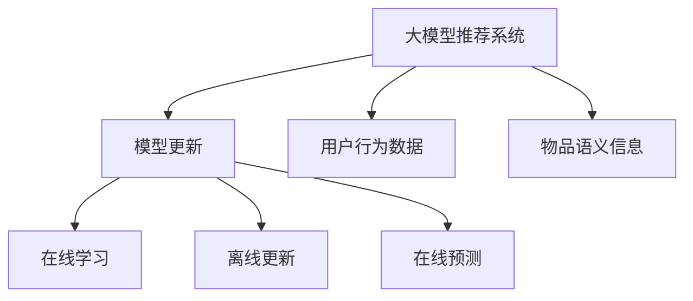

                 

# 大模型推荐中的模型更新与在线学习技术创新

> 关键词：推荐系统, 在线学习, 模型更新, 自然语言处理(NLP), 深度学习

## 1. 背景介绍

### 1.1 问题由来
随着互联网和电子商务的飞速发展，推荐系统已经成为了各种平台上的标配功能，旨在为用户提供个性化的内容推荐，提升用户体验和平台留存率。传统的推荐系统以基于协同过滤和基于内容的推荐为主，但随着数据量和用户行为复杂性的增加，这两种方法逐渐表现出一定的局限性。近年来，基于大模型的推荐系统开始兴起，利用语言模型和大数据，能够对用户的行为进行深度理解，实现更精准的推荐。

### 1.2 问题核心关键点
大模型推荐系统的核心在于将大语言模型应用于推荐任务中，通过大量的用户行为数据进行训练，学习到用户的兴趣和行为模式，并结合物品的语义信息，生成个性化的推荐结果。与传统推荐方法相比，大模型推荐系统具有以下几个优点：
- 语义理解能力更强，能够处理自然语言文本数据，理解用户意图和上下文。
- 具备高度的泛化能力，能够适应不同类型的推荐场景。
- 能够对长尾物品进行推荐，有助于挖掘和推广冷门商品。
- 支持零样本和少样本学习，能够在少量标注数据下进行高效的推荐。

尽管大模型推荐系统具有诸多优势，但面对海量用户数据和实时更新要求，其训练和更新过程也面临诸多挑战：
- 数据处理和计算资源的巨大需求。
- 在线学习模型的实时更新和维护难度。
- 推荐系统的高实时性要求。
- 模型的稳定性和可解释性需求。

本文将详细介绍大模型推荐中的模型更新与在线学习技术创新，探讨其核心算法原理、具体操作步骤，并结合实际应用场景给出指导。

## 2. 核心概念与联系

### 2.1 核心概念概述

在大模型推荐中，模型更新与在线学习技术创新是其核心概念，它们通过不断地训练和调整模型，以适应数据分布的变化，提升推荐系统的性能。以下是对这些核心概念的详细解释：

- **大模型推荐系统**：基于大语言模型的推荐系统，通过预训练模型对用户的兴趣进行建模，并结合物品的语义信息，生成推荐结果。
- **模型更新**：指在推荐系统中，随着新数据和用户行为的不断加入，需要周期性地对模型进行训练和调整，以适应新的数据分布和用户需求。
- **在线学习**：指在实时数据流中对模型进行训练和更新，能够迅速响应数据变化，并保持模型的高实时性。

这些概念之间的联系可以通过以下Mermaid流程图进行展示：



这个流程图展示了从大模型推荐系统到模型更新和在线学习的全过程：

1. 用户行为数据和物品语义信息被输入到大模型推荐系统中。
2. 模型更新模块负责对模型进行周期性训练和调整。
3. 在线学习模块能够在实时数据流中迅速响应和更新模型。
4. 模型更新和在线学习模块的结合，保证了推荐系统的实时性和适应性。

## 3. 核心算法原理 & 具体操作步骤
### 3.1 算法原理概述

大模型推荐中的模型更新与在线学习技术创新，本质上是基于在线学习算法，通过不断地对模型进行迭代训练和调整，以适应新的数据分布和用户需求。常用的在线学习算法包括增量学习、小批量随机梯度下降、分布式训练等。

具体而言，基于在线学习的大模型推荐系统流程如下：

1. 收集用户行为数据和物品语义信息，构建训练集。
2. 利用大语言模型对用户行为和物品语义进行编码，生成推荐模型。
3. 使用在线学习算法，对推荐模型进行周期性更新和调整。
4. 利用更新后的模型，对用户输入进行实时预测和推荐。

### 3.2 算法步骤详解

**Step 1: 数据预处理**

在大模型推荐系统中，数据预处理是至关重要的环节。需要将用户行为数据和物品语义信息进行清洗、标准化和特征工程，构建训练集。

- **用户行为数据**：包括用户的点击、购买、评分等行为数据，需要对其进行去重、标准化和归一化处理。
- **物品语义信息**：从物品的描述、标签、分类信息中提取语义特征，以便模型能够更好地理解物品。

**Step 2: 模型构建**

选择合适的预训练语言模型，如BERT、GPT等，作为初始化参数。通过大模型对用户行为和物品语义进行编码，生成推荐模型。

**Step 3: 模型训练**

在在线学习算法中，常用的算法包括增量学习、小批量随机梯度下降和分布式训练等。

- **增量学习**：针对新数据的到来，动态更新模型参数，适用于数据分布变化较大的场景。
- **小批量随机梯度下降**：在每次迭代中使用一小批数据进行梯度更新，能够快速收敛，适用于数据分布稳定的场景。
- **分布式训练**：将模型训练任务分配到多个节点上进行并行计算，能够加速模型训练，适用于数据量大的场景。

**Step 4: 模型更新**

定期对模型进行离线更新，以适应新的数据分布和用户需求。

- **离线更新**：定期使用全部或部分历史数据对模型进行训练，更新模型参数。
- **在线预测**：使用更新后的模型对用户输入进行实时预测和推荐。

**Step 5: 模型评估**

通过A/B测试等方法，评估模型的性能和效果。

- **离线评估**：在训练集或验证集上进行评估，评估模型的准确率、召回率、F1分数等指标。
- **在线评估**：在实际推荐系统上进行评估，评估模型的实时性和用户满意度。

### 3.3 算法优缺点

大模型推荐中的模型更新与在线学习技术创新，具有以下优点：

- 快速响应数据变化。在线学习算法能够在实时数据流中快速更新模型，适应数据分布的变化。
- 模型泛化能力强。大模型具备强大的语义理解能力，能够适应不同类型的推荐场景。
- 支持少样本学习。利用在线学习技术，可以在少量标注数据下进行高效的推荐。
- 实时性高。在线学习技术能够实时响应用户行为，提高推荐系统的响应速度。

但同时也存在以下缺点：

- 计算资源需求大。大模型推荐系统需要大量的计算资源，包括GPU、TPU等高性能设备。
- 更新过程复杂。模型更新过程需要考虑数据的实时性和系统的稳定性，需要复杂的技术支持。
- 可解释性不足。大模型推荐系统通常被视为"黑盒"模型，难以解释其内部工作机制和决策逻辑。
- 鲁棒性不足。模型可能会受到输入噪声和数据偏差的影响，导致性能下降。

### 3.4 算法应用领域

大模型推荐中的模型更新与在线学习技术创新，可以应用于以下领域：

- **电子商务推荐**：在电商平台中，利用用户行为数据和商品语义信息，生成个性化的推荐结果。
- **新闻推荐**：在新闻平台上，利用用户阅读历史和文章语义信息，生成个性化新闻内容。
- **视频推荐**：在视频平台上，利用用户观看历史和视频描述，生成个性化的视频内容。
- **金融推荐**：在金融平台中，利用用户交易历史和产品语义信息，生成个性化的金融产品推荐。
- **健康推荐**：在健康平台中，利用用户健康数据和产品语义信息，生成个性化的健康产品推荐。

## 4. 数学模型和公式 & 详细讲解  
### 4.1 数学模型构建

在大模型推荐系统中，常用的数学模型包括神经网络模型和深度学习模型。以下以神经网络模型为例，给出具体的数学模型构建过程。

假设推荐系统输入为 $x$，输出为 $y$，模型参数为 $\theta$，目标函数为 $L$。则模型构建过程如下：

$$
\min_{\theta} L(y; \theta)
$$

其中，目标函数 $L$ 可以是均方误差损失函数、交叉熵损失函数等。

### 4.2 公式推导过程

以均方误差损失函数为例，其公式推导过程如下：

假设模型输出为 $\hat{y}$，真实标签为 $y$，则均方误差损失函数为：

$$
L(\hat{y}, y) = \frac{1}{N}\sum_{i=1}^N (\hat{y}_i - y_i)^2
$$

其中 $N$ 为样本数量。

使用随机梯度下降算法，最小化目标函数 $L$，更新模型参数 $\theta$：

$$
\theta \leftarrow \theta - \eta \nabla_{\theta}L
$$

其中 $\eta$ 为学习率，$\nabla_{\theta}L$ 为损失函数对模型参数的梯度。

### 4.3 案例分析与讲解

以BERT模型为例，其推荐系统构建过程如下：

1. 收集用户行为数据和物品语义信息，构建训练集。
2. 使用BERT模型对用户行为和物品语义进行编码，生成推荐模型。
3. 使用增量学习算法，对推荐模型进行实时更新和调整。
4. 利用更新后的模型，对用户输入进行实时预测和推荐。

以下是一个简单的代码示例：

```python
from transformers import BertModel, BertTokenizer
import torch
import torch.nn as nn

# 初始化BERT模型和tokenizer
model = BertModel.from_pretrained('bert-base-uncased')
tokenizer = BertTokenizer.from_pretrained('bert-base-uncased')

# 定义推荐模型的输出层
class RecommendationHead(nn.Module):
    def __init__(self, num_labels):
        super(RecommendationHead, self).__init__()
        self.num_labels = num_labels
        self.dense = nn.Linear(768, self.num_labels)
        self.dropout = nn.Dropout(0.1)

    def forward(self, sequence_output):
        sequence_output = self.dropout(sequence_output)
        logits = self.dense(sequence_output)
        return logits

# 定义推荐模型
class RecommendationModel(nn.Module):
    def __init__(self):
        super(RecommendationModel, self).__init__()
        self.bert = BertModel.from_pretrained('bert-base-uncased')
        self.recommendation_head = RecommendationHead(num_labels)

    def forward(self, input_ids, attention_mask):
        sequence_output = self.bert(input_ids, attention_mask=attention_mask)
        recommendation_logits = self.recommendation_head(sequence_output)
        return recommendation_logits

# 构建数据集
class RecommendationDataset(Dataset):
    def __init__(self, data):
        self.data = data

    def __len__(self):
        return len(self.data)

    def __getitem__(self, index):
        input_ids = self.data[index]['input_ids']
        attention_mask = self.data[index]['attention_mask']
        labels = self.data[index]['labels']
        return input_ids, attention_mask, labels

# 训练和评估函数
def train(model, train_dataset, device, optimizer, epoch):
    model.train()
    total_loss = 0
    for i, batch in enumerate(train_dataset):
        input_ids, attention_mask, labels = batch
        input_ids = input_ids.to(device)
        attention_mask = attention_mask.to(device)
        labels = labels.to(device)

        optimizer.zero_grad()
        recommendation_logits = model(input_ids, attention_mask)
        loss = nn.CrossEntropyLoss()(recommendation_logits, labels)
        loss.backward()
        optimizer.step()
        total_loss += loss.item()

    return total_loss / len(train_dataset)

def evaluate(model, test_dataset, device, optimizer, epoch):
    model.eval()
    total_loss = 0
    total_correct = 0
    for i, batch in enumerate(test_dataset):
        input_ids, attention_mask, labels = batch
        input_ids = input_ids.to(device)
        attention_mask = attention_mask.to(device)
        labels = labels.to(device)

        with torch.no_grad():
            recommendation_logits = model(input_ids, attention_mask)
            loss = nn.CrossEntropyLoss()(recommendation_logits, labels)
            total_loss += loss.item()
            total_correct += torch.sum(torch.argmax(recommendation_logits, 1) == labels).item()

    accuracy = total_correct / len(test_dataset)
    return total_loss / len(test_dataset), accuracy

# 训练和评估
model = RecommendationModel().to(device)
optimizer = torch.optim.Adam(model.parameters(), lr=1e-5)

train_dataset = RecommendationDataset(train_data)
test_dataset = RecommendationDataset(test_data)

for epoch in range(num_epochs):
    train_loss = train(model, train_dataset, device, optimizer, epoch)
    test_loss, accuracy = evaluate(model, test_dataset, device, optimizer, epoch)

    print('Epoch: {}, Train Loss: {:.4f}, Test Loss: {:.4f}, Accuracy: {:.4f}'.format(epoch+1, train_loss, test_loss, accuracy))
```

## 5. 项目实践：代码实例和详细解释说明
### 5.1 开发环境搭建

在进行大模型推荐系统开发前，需要搭建好相应的开发环境。以下是Python环境下大模型推荐系统开发环境搭建的步骤：

1. 安装Python：推荐使用Python 3.8及以上版本，以保证支持的库和语言特性。
2. 安装Anaconda：下载并安装Anaconda，以便创建虚拟环境。
3. 创建虚拟环境：
```bash
conda create -n recommendation python=3.8
conda activate recommendation
```
4. 安装必要的库：
```bash
pip install torch torchvision transformers sklearn pandas
```

完成上述步骤后，即可在虚拟环境中进行大模型推荐系统的开发和实验。

### 5.2 源代码详细实现

以下是一个简单的基于BERT模型的大模型推荐系统的代码实现：

```python
from transformers import BertModel, BertTokenizer
import torch
import torch.nn as nn

# 初始化BERT模型和tokenizer
model = BertModel.from_pretrained('bert-base-uncased')
tokenizer = BertTokenizer.from_pretrained('bert-base-uncased')

# 定义推荐模型的输出层
class RecommendationHead(nn.Module):
    def __init__(self, num_labels):
        super(RecommendationHead, self).__init__()
        self.num_labels = num_labels
        self.dense = nn.Linear(768, self.num_labels)
        self.dropout = nn.Dropout(0.1)

    def forward(self, sequence_output):
        sequence_output = self.dropout(sequence_output)
        logits = self.dense(sequence_output)
        return logits

# 定义推荐模型
class RecommendationModel(nn.Module):
    def __init__(self):
        super(RecommendationModel, self).__init__()
        self.bert = BertModel.from_pretrained('bert-base-uncased')
        self.recommendation_head = RecommendationHead(num_labels)

    def forward(self, input_ids, attention_mask):
        sequence_output = self.bert(input_ids, attention_mask=attention_mask)
        recommendation_logits = self.recommendation_head(sequence_output)
        return recommendation_logits

# 构建数据集
class RecommendationDataset(Dataset):
    def __init__(self, data):
        self.data = data

    def __len__(self):
        return len(self.data)

    def __getitem__(self, index):
        input_ids = self.data[index]['input_ids']
        attention_mask = self.data[index]['attention_mask']
        labels = self.data[index]['labels']
        return input_ids, attention_mask, labels

# 训练和评估函数
def train(model, train_dataset, device, optimizer, epoch):
    model.train()
    total_loss = 0
    for i, batch in enumerate(train_dataset):
        input_ids, attention_mask, labels = batch
        input_ids = input_ids.to(device)
        attention_mask = attention_mask.to(device)
        labels = labels.to(device)

        optimizer.zero_grad()
        recommendation_logits = model(input_ids, attention_mask)
        loss = nn.CrossEntropyLoss()(recommendation_logits, labels)
        loss.backward()
        optimizer.step()
        total_loss += loss.item()

    return total_loss / len(train_dataset)

def evaluate(model, test_dataset, device, optimizer, epoch):
    model.eval()
    total_loss = 0
    total_correct = 0
    for i, batch in enumerate(test_dataset):
        input_ids, attention_mask, labels = batch
        input_ids = input_ids.to(device)
        attention_mask = attention_mask.to(device)
        labels = labels.to(device)

        with torch.no_grad():
            recommendation_logits = model(input_ids, attention_mask)
            loss = nn.CrossEntropyLoss()(recommendation_logits, labels)
            total_loss += loss.item()
            total_correct += torch.sum(torch.argmax(recommendation_logits, 1) == labels).item()

    accuracy = total_correct / len(test_dataset)
    return total_loss / len(test_dataset), accuracy

# 训练和评估
model = RecommendationModel().to(device)
optimizer = torch.optim.Adam(model.parameters(), lr=1e-5)

train_dataset = RecommendationDataset(train_data)
test_dataset = RecommendationDataset(test_data)

for epoch in range(num_epochs):
    train_loss = train(model, train_dataset, device, optimizer, epoch)
    test_loss, accuracy = evaluate(model, test_dataset, device, optimizer, epoch)

    print('Epoch: {}, Train Loss: {:.4f}, Test Loss: {:.4f}, Accuracy: {:.4f}'.format(epoch+1, train_loss, test_loss, accuracy))
```

## 6. 实际应用场景

### 6.1 智能推荐系统

智能推荐系统是大模型推荐系统的主要应用场景之一。通过收集用户的浏览、购买和评分等行为数据，以及物品的描述和标签信息，利用BERT模型进行训练和预测，生成个性化的推荐结果。在实际应用中，可以部署在电商平台、视频平台、新闻平台等场景中，提升用户体验和平台留存率。

### 6.2 个性化视频推荐

在视频平台上，用户观看历史和视频描述是推荐的重要依据。通过收集用户的观看历史和视频描述，利用BERT模型进行训练和预测，生成个性化的视频推荐结果。在实际应用中，可以部署在视频平台推荐模块中，提升用户观看体验。

### 6.3 金融产品推荐

在金融平台中，用户交易历史和产品描述是推荐的重要依据。通过收集用户的交易历史和产品描述，利用BERT模型进行训练和预测，生成个性化的金融产品推荐结果。在实际应用中，可以部署在金融产品推荐模块中，提升用户投资体验。

### 6.4 未来应用展望

随着大模型推荐技术的不断发展，未来的应用场景将更加多样和广泛。除了智能推荐系统、个性化视频推荐和金融产品推荐等场景外，还将在健康产品推荐、旅游推荐、教育推荐等多个领域得到应用。大模型推荐技术的泛化能力和在线学习能力，将为各行各业带来更多的数字化转型机遇。

## 7. 工具和资源推荐

### 7.1 学习资源推荐

为了帮助开发者系统掌握大模型推荐中的模型更新与在线学习技术创新，以下是一些优质的学习资源：

1. 《推荐系统》书籍：推荐系统领域的经典教材，介绍了推荐系统的发展历程、算法原理和应用案例。
2. 《深度学习与推荐系统》课程：斯坦福大学的在线课程，涵盖深度学习在推荐系统中的应用。
3. 《机器学习实战》书籍：介绍了机器学习在推荐系统中的应用，包括协同过滤和基于内容的推荐。
4. Kaggle竞赛平台：参与推荐系统竞赛，积累实战经验，掌握最新的推荐算法和技术。
5. HuggingFace官方文档：提供了BERT、GPT等大模型的详细使用指南，帮助开发者快速上手。

### 7.2 开发工具推荐

以下推荐的开发工具可以帮助开发者高效实现大模型推荐系统：

1. PyTorch：基于Python的开源深度学习框架，灵活的动态计算图，适合研究性开发。
2. TensorFlow：由Google主导的深度学习框架，易于部署，适合大规模工程应用。
3. TensorBoard：TensorFlow的可视化工具，实时监测模型训练状态，提供丰富的图表呈现方式。
4. Weights & Biases：模型训练的实验跟踪工具，记录和可视化模型训练过程中的各项指标，方便对比和调优。
5. Jupyter Notebook：交互式开发环境，支持Python和R等多种语言，方便进行实验和研究。

### 7.3 相关论文推荐

以下是几篇关于大模型推荐系统的经典论文，推荐阅读：

1. "Deep Interest Networks for News Recommendation"：提出了Deep Interest Networks（DIN）模型，利用用户行为数据进行个性化推荐。
2. "Feature-Rich Personalized Web Search Ranking"：提出了基于内容的推荐方法，利用文本特征进行个性化搜索推荐。
3. "Neural Factorization Machines for Recommender Systems"：提出了神经因子机模型，融合深度学习和传统协同过滤算法。
4. "Recommender Systems as Feature Extraction"：提出了推荐系统作为特征提取的方法，利用推荐模型进行特征提取和筛选。
5. "Deep Recommendations: A Unified Framework"：提出了深度推荐框架，结合深度学习和协同过滤算法，提升推荐系统性能。

## 8. 总结：未来发展趋势与挑战

### 8.1 研究成果总结

本文对大模型推荐中的模型更新与在线学习技术创新进行了全面系统的介绍。从原理到实践，详细讲解了模型更新和在线学习的核心算法和具体操作步骤，并通过实际应用场景给出了指导。通过本文的系统梳理，可以看到大模型推荐系统在推荐系统中的应用前景，以及在线学习技术的重要性。

### 8.2 未来发展趋势

未来大模型推荐系统将呈现以下几个发展趋势：

1. 模型规模持续增大。随着计算资源和数据量的增加，大模型推荐系统的规模将不断扩大，模型性能和覆盖范围也将进一步提升。
2. 在线学习技术不断优化。增量学习、分布式训练等在线学习技术将不断优化，提升模型实时性和适应性。
3. 跨模态推荐兴起。推荐系统将不仅仅局限于文本数据，而是融合视觉、音频等多种模态数据，提升推荐效果。
4. 个性化推荐更精准。利用大模型推荐系统，可以更准确地理解用户需求，实现更精准的个性化推荐。
5. 实时性要求更高。推荐系统对实时性的要求将越来越高，在线学习技术将得到更广泛的应用。

### 8.3 面临的挑战

尽管大模型推荐系统取得了显著进展，但仍面临诸多挑战：

1. 计算资源瓶颈。大模型推荐系统需要大量的计算资源，如何提高资源利用率将是未来的重要课题。
2. 模型更新难度大。在线学习技术需要保证模型的稳定性和可解释性，如何设计高效的模型更新策略将是一个重要挑战。
3. 数据隐私问题。用户数据隐私保护是一个重要的问题，如何在推荐系统中保护用户隐私将是一个难题。
4. 鲁棒性不足。模型可能会受到输入噪声和数据偏差的影响，导致性能下降。
5. 跨领域推荐难度大。推荐系统在不同领域的应用需要适应不同的数据分布和用户需求，如何设计通用的推荐模型将是一个重要课题。

### 8.4 研究展望

面对大模型推荐系统面临的挑战，未来的研究需要在以下几个方面寻求新的突破：

1. 探索高效的在线学习算法。设计更高效的增量学习算法，提升模型实时性和适应性。
2. 结合多种数据源。融合视觉、音频等多种模态数据，提升推荐效果。
3. 开发更高效的推荐模型。利用深度学习模型和传统协同过滤算法，设计更高效的推荐模型。
4. 注重用户隐私保护。利用差分隐私等技术，保护用户数据隐私。
5. 提升推荐系统鲁棒性。引入鲁棒性学习算法，提高模型的鲁棒性和抗干扰能力。

这些研究方向将推动大模型推荐技术的发展，使其更好地应用于实际场景中，提升用户体验和平台价值。面向未来，大模型推荐系统需要更多的理论研究和实际应用验证，才能真正实现其价值。

## 9. 附录：常见问题与解答

**Q1：大模型推荐系统中如何处理数据稀疏性问题？**

A: 数据稀疏性是大模型推荐系统中的一个重要问题。通过以下方法可以有效处理数据稀疏性问题：

1. 数据增强：利用用户的历史行为数据进行推荐，增加推荐结果的丰富度。
2. 协同过滤：通过利用用户的相似性进行推荐，增加推荐结果的多样性。
3. 深度学习模型：利用深度学习模型，对数据进行更好的建模，提升推荐效果。
4. 在线学习：利用在线学习技术，动态更新模型参数，适应数据分布的变化。

**Q2：大模型推荐系统中的模型更新如何保证模型的稳定性？**

A: 模型更新是保证模型稳定性的关键。通过以下方法可以保证模型的稳定性：

1. 学习率衰减：在训练过程中逐渐减小学习率，避免模型参数的过度更新。
2. 正则化：引入L2正则化、Dropout等正则化技术，避免模型过拟合。
3. 小批量随机梯度下降：使用小批量随机梯度下降算法，减少计算资源消耗，提升模型稳定性。
4. 模型剪枝：在模型训练过程中进行剪枝，减少冗余参数，提升模型稳定性。

**Q3：大模型推荐系统中如何提升推荐系统的实时性？**

A: 实时性是大模型推荐系统的关键指标。通过以下方法可以提升推荐系统的实时性：

1. 分布式训练：使用分布式训练技术，提升模型训练效率，缩短训练时间。
2. 增量学习：使用增量学习算法，及时更新模型参数，保持模型的高实时性。
3. 缓存技术：使用缓存技术，减少计算资源的消耗，提升推荐系统的实时性。
4. 模型压缩：对模型进行压缩，减小模型大小，提升推荐系统的实时性。

**Q4：大模型推荐系统中如何保护用户隐私？**

A: 用户隐私保护是大模型推荐系统中的一个重要问题。通过以下方法可以有效保护用户隐私：

1. 差分隐私：利用差分隐私技术，保护用户数据隐私，防止数据泄露。
2. 数据匿名化：对用户数据进行匿名化处理，保护用户隐私。
3. 加密技术：使用加密技术，保护用户数据安全。
4. 访问控制：对用户数据进行访问控制，防止数据滥用。

这些方法可以有效地保护用户隐私，保障用户数据安全。

---

作者：禅与计算机程序设计艺术 / Zen and the Art of Computer Programming

