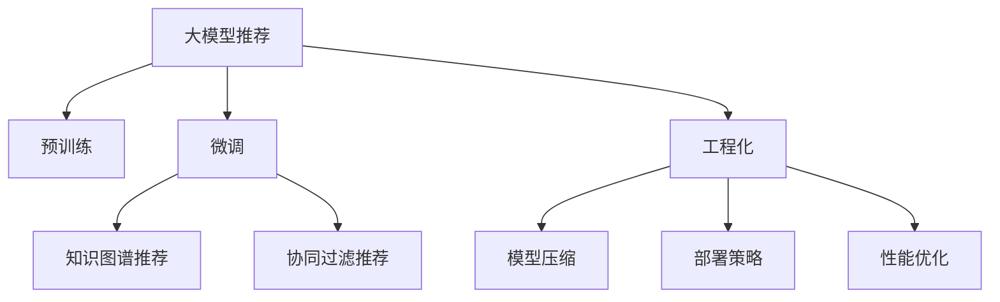

                 

# 大模型推荐落地中的工程化挑战与应对

> 关键词：大模型推荐,工程化,落地挑战,性能优化,部署策略,模型压缩

## 1. 背景介绍

### 1.1 问题由来
随着人工智能技术的不断进步，大模型推荐系统（如基于大模型的知识图谱推荐、协同过滤推荐等）在电子商务、社交网络、内容推荐等领域得到了广泛应用，并取得了显著的成效。这些推荐系统往往基于大规模预训练语言模型（Large Language Model, LLM），通过在海量数据上进行预训练，学习到丰富的语义表示，进而通过微调（Fine-tuning）和优化得到高精度的推荐结果。然而，从预训练到微调再到工程化落地的过程中，面临诸多工程化挑战，如模型过大导致的资源限制、推理速度慢、部署成本高等。这些问题严重影响了推荐系统的实际应用效果和用户体验，因此，对大模型推荐落地的工程化挑战与应对进行深入研究具有重要意义。

## 2. 核心概念与联系

### 2.1 核心概念概述

为更好地理解大模型推荐落地的工程化挑战与应对方法，本节将介绍几个密切相关的核心概念：

- **大模型推荐系统（Large Model Recommendation System）**：基于预训练语言模型和微调技术，通过大模型对用户行为数据和产品特征进行建模，并提供个性化推荐服务的系统。
- **知识图谱推荐（Knowledge Graph Recommendation）**：结合知识图谱和预训练语言模型，通过节点之间的链接关系和语义关系，对产品进行更精准的推荐。
- **协同过滤推荐（Collaborative Filtering Recommendation）**：基于用户和产品的历史交互数据，通过相似性度量，预测用户可能感兴趣的产品。
- **工程化（Engineering）**：将模型从研究到实际部署的过程中的所有步骤和技术进行系统化和标准化，以提高模型性能、效率和可维护性。
- **模型压缩（Model Compression）**：通过减少模型大小、加快推理速度、减少内存消耗等方法，使得大模型能够在有限的资源下进行高效运行。
- **部署策略（Deployment Strategy）**：确定模型部署的具体方案，包括模型版本管理、模型调度、模型存储等。
- **性能优化（Performance Optimization）**：通过算法优化、硬件优化、模型优化等手段，提升模型的响应速度和准确率。

这些核心概念之间的逻辑关系可以通过以下Mermaid流程图来展示：



这个流程图展示了大模型推荐系统的核心概念及其之间的关系：

1. 大模型推荐系统通过预训练获得基础能力。
2. 微调是对预训练模型进行任务特定的优化，可以通过知识图谱推荐或协同过滤推荐等多种方式实现。
3. 工程化是连接模型微调和实际应用的关键环节，涵盖从数据处理到模型部署的全流程。
4. 模型压缩和部署策略是提升模型效率和可维护性的重要手段。
5. 性能优化可以进一步提高模型的实际运行效果。

## 3. 核心算法原理 & 具体操作步骤

### 3.1 算法原理概述

基于大模型推荐系统的工程化挑战与应对，本质上是将大模型的预训练和微调成果，通过系统化、工程化的手段进行优化和部署，以提升推荐系统的性能和可用性。其核心思想是：在大模型的基础上，通过工程化手段，如模型压缩、部署策略、性能优化等，提升推荐系统在实际应用中的运行效率和稳定性，满足用户的多样化需求，提升用户体验。

### 3.2 算法步骤详解

大模型推荐系统落地的工程化挑战与应对，一般包括以下几个关键步骤：

**Step 1: 数据准备与预处理**
- 收集和清洗用户行为数据，包括浏览历史、购买记录、评分等。
- 对用户和产品进行编码，如将用户ID和产品ID转化为独热编码向量。
- 对数据进行分片、采样和标准化处理，以确保数据分布的均衡性和一致性。

**Step 2: 选择合适的模型**
- 根据任务特点选择合适的预训练语言模型，如BERT、GPT等。
- 考虑模型的参数量、计算资源和推理速度等因素，选择适合于特定应用的模型架构。

**Step 3: 模型微调和优化**
- 在微调过程中，选择合适的优化算法（如Adam、SGD等）和损失函数（如交叉熵、均方误差等）。
- 应用正则化技术（如L2正则、Dropout、Early Stopping等）防止过拟合。
- 使用数据增强技术（如数据扩充、对抗样本等）提高模型的泛化能力。

**Step 4: 模型压缩与优化**
- 针对大模型进行模型压缩，如剪枝、量化、权重分享等。
- 利用模型蒸馏（Knowledge Distillation）技术将大模型知识传递给小型模型，以降低推理资源消耗。

**Step 5: 部署策略与工程化实现**
- 确定模型部署的具体方案，包括模型版本管理、模型存储、模型调度等。
- 使用分布式计算、容器化技术（如Docker、Kubernetes等）进行模型部署。
- 对模型进行监控和调优，确保模型在实际运行中稳定可靠。

**Step 6: 性能优化与测试**
- 对推荐系统进行全面测试，确保模型的准确率和响应速度满足业务需求。
- 通过A/B测试等手段，评估模型在不同用户群体中的表现，进行持续优化。

### 3.3 算法优缺点

大模型推荐系统落地的工程化挑战与应对方法具有以下优点：
1. 提高推荐系统的性能和稳定性，满足用户的多样化需求，提升用户体验。
2. 降低部署成本，通过模型压缩和优化，减少硬件资源消耗，提高系统可扩展性。
3. 提升系统的可维护性和可重用性，通过工程化手段，简化模型开发和部署流程。
4. 实现模型的快速迭代和优化，通过持续性能优化和调优，保持系统的高效运行。

同时，该方法也存在一定的局限性：
1. 对数据质量和处理要求高，需要高质量的标注数据和稳定的数据处理流程。
2. 需要较强的工程能力，对系统架构和优化技术要求较高。
3. 对计算资源和部署环境要求高，需要高性能计算设备和稳定的部署环境。
4. 模型复杂度高，优化难度大，需要持续的研究和探索。

尽管存在这些局限性，但就目前而言，大模型推荐系统落地的工程化挑战与应对方法是推荐系统领域的主流范式。未来相关研究的重点在于如何进一步降低对数据和计算资源的依赖，提高模型的可维护性和可扩展性，同时兼顾模型性能和效率等因素。

### 3.4 算法应用领域

基于大模型推荐系统落地的工程化挑战与应对方法，已经在推荐系统领域得到了广泛的应用，涵盖了许多不同类型的推荐任务，例如：

- 商品推荐：如电商平台上的商品推荐，结合用户浏览历史和产品特征，推荐用户可能感兴趣的商品。
- 内容推荐：如视频网站上的内容推荐，根据用户观看历史和视频特征，推荐用户可能感兴趣的视频。
- 个性化推荐：如智能电视上的个性化推荐，根据用户历史操作和电视机特征，推荐用户可能感兴趣的内容。
- 社交推荐：如社交网络上的好友推荐，根据用户社交关系和用户行为，推荐用户可能感兴趣的人。
- 广告推荐：如广告平台的广告推荐，根据用户浏览行为和广告特征，推荐用户可能感兴趣的广告。

除了上述这些经典任务外，大模型推荐系统落地的工程化挑战与应对方法也被创新性地应用到更多场景中，如基于知识图谱的推荐、协同过滤推荐、多模态推荐等，为推荐系统带来了新的突破。

## 4. 数学模型和公式 & 详细讲解 & 举例说明

### 4.1 数学模型构建

本节将使用数学语言对大模型推荐系统落地的工程化挑战与应对方法进行更加严格的刻画。

记推荐系统中的用户为 $U$，产品为 $I$，用户与产品的交互矩阵为 $X \in \mathbb{R}^{N\times M}$，其中 $N$ 为用户数，$M$ 为产品数。设 $\theta$ 为推荐模型的参数，模型 $M_{\theta}:\mathcal{X} \rightarrow \mathcal{Y}$，其中 $\mathcal{X}$ 为输入空间，$\mathcal{Y}$ 为输出空间。推荐任务可以定义为预测用户对产品的评分 $y_i \in [1, 5]$。

定义模型 $M_{\theta}$ 在输入 $(x_i,y_i)$ 上的损失函数为 $\ell(M_{\theta}(x_i),y_i)$，则在训练集 $D=\{(x_i,y_i)\}_{i=1}^N$ 上的经验风险为：

$$
\mathcal{L}(\theta) = \frac{1}{N}\sum_{i=1}^N \ell(M_{\theta}(x_i),y_i)
$$

微调的优化目标是最小化经验风险，即找到最优参数：

$$
\theta^* = \mathop{\arg\min}_{\theta} \mathcal{L}(\theta)
$$

在实践中，我们通常使用基于梯度的优化算法（如Adam、SGD等）来近似求解上述最优化问题。设 $\eta$ 为学习率，$\lambda$ 为正则化系数，则参数的更新公式为：

$$
\theta \leftarrow \theta - \eta \nabla_{\theta}\mathcal{L}(\theta) - \eta\lambda\theta
$$

其中 $\nabla_{\theta}\mathcal{L}(\theta)$ 为损失函数对参数 $\theta$ 的梯度，可通过反向传播算法高效计算。

### 4.2 公式推导过程

以下我们以协同过滤推荐为例，推导损失函数及其梯度的计算公式。

假设推荐模型 $M_{\theta}$ 在用户 $u$ 对产品 $i$ 的评分预测为 $y_i=M_{\theta}(x_i)$，其中 $x_i$ 为用户与产品的交互记录，即用户行为矩阵的编码向量。假设真实评分 $y_i$ 服从高斯分布，则协同过滤推荐的损失函数定义为：

$$
\ell(M_{\theta}(x_i),y_i) = \frac{1}{2}(y_i - M_{\theta}(x_i))^2
$$

将其代入经验风险公式，得：

$$
\mathcal{L}(\theta) = \frac{1}{N}\sum_{i=1}^N (y_i - M_{\theta}(x_i))^2
$$

根据链式法则，损失函数对参数 $\theta_k$ 的梯度为：

$$
\frac{\partial \mathcal{L}(\theta)}{\partial \theta_k} = \frac{1}{N}\sum_{i=1}^N (y_i - M_{\theta}(x_i)) \frac{\partial M_{\theta}(x_i)}{\partial \theta_k}
$$

其中 $\frac{\partial M_{\theta}(x_i)}{\partial \theta_k}$ 可进一步递归展开，利用自动微分技术完成计算。

在得到损失函数的梯度后，即可带入参数更新公式，完成模型的迭代优化。重复上述过程直至收敛，最终得到适应推荐任务的最优模型参数 $\theta^*$。

## 5. 项目实践：代码实例和详细解释说明

### 5.1 开发环境搭建

在进行推荐系统落地的工程化实践前，我们需要准备好开发环境。以下是使用Python进行TensorFlow开发的环境配置流程：

1. 安装Anaconda：从官网下载并安装Anaconda，用于创建独立的Python环境。

2. 创建并激活虚拟环境：
```bash
conda create -n tf-env python=3.8 
conda activate tf-env
```

3. 安装TensorFlow：根据CUDA版本，从官网获取对应的安装命令。例如：
```bash
conda install tensorflow tensorflow-estimator tensorflow-addons -c tf -c conda-forge
```

4. 安装TensorBoard：
```bash
pip install tensorboard
```

5. 安装各类工具包：
```bash
pip install numpy pandas scikit-learn matplotlib tqdm jupyter notebook ipython
```

完成上述步骤后，即可在`tf-env`环境中开始推荐系统落地的工程化实践。

### 5.2 源代码详细实现

下面我们以协同过滤推荐为例，给出使用TensorFlow实现协同过滤推荐模型的完整代码实现。

首先，定义协同过滤推荐的任务数据处理函数：

```python
import numpy as np
import tensorflow as tf
from tensorflow.keras.layers import Input, Dense, Embedding, Dot
from tensorflow.keras.models import Model
from tensorflow.keras.losses import MeanSquaredError
from tensorflow.keras.optimizers import Adam

def build_model(n_users, n_items, embedding_dim=64, num_epochs=100, batch_size=256, learning_rate=0.001):
    # 定义用户和产品的嵌入向量
    user_input = Input(shape=(1,), dtype='int32', name='user')
    item_input = Input(shape=(1,), dtype='int32', name='item')
    
    # 定义嵌入层
    user_embedding = Embedding(input_dim=n_users, output_dim=embedding_dim)(user_input)
    item_embedding = Embedding(input_dim=n_items, output_dim=embedding_dim)(item_input)
    
    # 定义内积层，计算用户对产品的评分预测
    dot = Dot(axes=1)([user_embedding, item_embedding])
    dot_output = Dense(1)(dot)
    
    # 定义损失函数和优化器
    model = Model(inputs=[user_input, item_input], outputs=dot_output)
    loss_fn = MeanSquaredError()
    optimizer = Adam(learning_rate)
    
    # 编译模型
    model.compile(optimizer=optimizer, loss=loss_fn)
    
    return model
```

然后，加载和预处理数据集：

```python
# 加载数据集
n_users = 10000
n_items = 10000
user_data = np.random.randint(0, n_users, size=(n_users, 10))
item_data = np.random.randint(0, n_items, size=(n_items, 10))
rating_data = np.random.randint(1, 5, size=(n_users, n_items))

# 预处理数据集
user_idx = np.unique(user_data[:, 0])
item_idx = np.unique(item_data[:, 0])
user_idx, item_idx = user_idx[np.argsort(user_idx)], item_idx[np.argsort(item_idx)]

# 构建输入输出矩阵
user_data = np.array([user_idx.index(i) for i in user_data[:, 0]], dtype=np.int32)
item_data = np.array([item_idx.index(i) for i in item_data[:, 0]], dtype=np.int32)
rating_data = rating_data[:, np.argsort(user_data)]

# 加载模型
model = build_model(n_users, n_items)
```

接着，执行模型训练和评估：

```python
# 训练模型
model.fit([user_data, item_data], rating_data, epochs=num_epochs, batch_size=batch_size, validation_split=0.1)

# 评估模型
test_user_data = np.random.randint(0, n_users, size=(n_users, 1))
test_item_data = np.random.randint(0, n_items, size=(n_items, 1))
test_rating_data = np.random.randint(1, 5, size=(n_users, n_items))

# 预测评分
preds = model.predict([test_user_data, test_item_data])

# 输出预测结果
print(preds)
```

### 5.3 代码解读与分析

让我们再详细解读一下关键代码的实现细节：

**build_model函数**：
- 定义用户和产品的嵌入向量，使用Embedding层将用户ID和产品ID转化为嵌入向量。
- 使用内积层计算用户对产品的评分预测，并使用Dense层将内积结果转化为评分预测值。
- 定义损失函数和优化器，并编译模型。

**预处理数据集**：
- 对用户和产品数据进行去重和排序，构建输入输出矩阵。
- 使用unique函数获取用户和产品的ID索引，并进行排序，以减少重复ID。
- 对输入输出矩阵进行排序，确保训练和推理的一致性。

**模型训练和评估**：
- 使用TensorFlow的fit函数对模型进行训练，设置epochs、batch_size和validation_split等参数。
- 使用随机生成的新样本进行预测，评估模型性能。

可以看到，TensorFlow配合Keras等高级API，使得推荐系统落地的工程化实践变得简单高效。开发者可以将更多精力放在数据处理、模型优化等高层逻辑上，而不必过多关注底层的实现细节。

当然，工业级的系统实现还需考虑更多因素，如模型的保存和部署、超参数的自动搜索、更灵活的任务适配层等。但核心的工程化挑战与应对逻辑基本与此类似。

## 6. 实际应用场景

### 6.1 智能推荐系统

基于协同过滤推荐技术的推荐系统，可以广泛应用于智能推荐领域。传统推荐系统往往依赖于用户行为数据，难以预测用户的兴趣变化和偏好转移。而使用协同过滤推荐，可以更全面地考虑用户和产品的历史交互数据，从而提供更加精准的推荐。

在技术实现上，可以收集用户的历史浏览、购买、评分等行为数据，构建用户行为矩阵和产品特征向量，通过协同过滤推荐模型进行预测。推荐系统可以根据预测结果，为用户推荐最感兴趣的商品、视频、文章等内容。

### 6.2 广告推荐系统

广告推荐系统是推荐系统在广告领域的重要应用。通过协同过滤推荐技术，广告平台可以根据用户的浏览行为和广告特征，预测用户对不同广告的兴趣程度，为用户推荐最可能感兴趣的广告。

在广告投放过程中，平台可以实时调整广告投放策略，根据用户的实际反应和反馈，动态优化广告投放效果，提升广告主的投资回报率。协同过滤推荐系统在提升广告投放精准性和效果方面具有重要价值。

### 6.3 个性化服务推荐

个性化服务推荐系统是推荐系统在垂直领域的重要应用。通过协同过滤推荐技术，医疗、教育、旅游等领域的推荐系统可以为用户推荐最合适的服务。

在医疗推荐系统中，可以收集用户的病历、体检数据、搜索记录等，结合医生的经验知识，为用户推荐最适合的医疗服务。在教育推荐系统中，可以收集学生的学习记录、成绩数据、兴趣爱好等，为用户推荐最合适的学习资源和课程。

## 7. 工具和资源推荐

### 7.1 学习资源推荐

为了帮助开发者系统掌握大模型推荐落地的工程化挑战与应对方法，这里推荐一些优质的学习资源：

1. TensorFlow官方文档：TensorFlow作为主流的深度学习框架，提供了详尽的文档和示例代码，是学习和使用TensorFlow的重要资源。

2. Keras官方文档：Keras作为TensorFlow的高层API，提供了简洁易用的编程接口，适合快速原型设计和模型开发。

3. PyTorch官方文档：PyTorch作为另一主流深度学习框架，提供了灵活的动态计算图，适合进行复杂的模型研究和优化。

4. 《深度学习》书籍：由深度学习领域的权威专家Ian Goodfellow撰写，深入浅出地介绍了深度学习的核心概念和算法。

5. 《TensorFlow实战》书籍：由TensorFlow社区成员撰写，介绍了TensorFlow在推荐系统等领域的实际应用案例和工程实践经验。

通过对这些资源的学习实践，相信你一定能够快速掌握大模型推荐落地的工程化挑战与应对方法，并用于解决实际的推荐问题。

### 7.2 开发工具推荐

高效的开发离不开优秀的工具支持。以下是几款用于大模型推荐系统落地的开发工具：

1. TensorFlow：由Google主导开发的开源深度学习框架，生产部署方便，适合大规模工程应用。

2. Keras：Keras作为TensorFlow的高层API，提供了简洁易用的编程接口，适合快速原型设计和模型开发。

3. PyTorch：由Facebook主导开发的开源深度学习框架，灵活动态的计算图，适合快速迭代研究。

4. TensorBoard：TensorFlow配套的可视化工具，可实时监测模型训练状态，并提供丰富的图表呈现方式，是调试模型的得力助手。

5. Weights & Biases：模型训练的实验跟踪工具，可以记录和可视化模型训练过程中的各项指标，方便对比和调优。

6. Jupyter Notebook：开源的交互式编程环境，支持多种编程语言和数据格式，适合进行研究和实验。

合理利用这些工具，可以显著提升大模型推荐落地的工程化实践的开发效率，加快创新迭代的步伐。

### 7.3 相关论文推荐

大模型推荐系统落地的工程化挑战与应对技术的发展源于学界的持续研究。以下是几篇奠基性的相关论文，推荐阅读：

1. A Survey on Recommendation System Techniques: Structure, Metrics, and Applications（推荐系统综述）：介绍了推荐系统的主要技术和应用场景，涵盖了协同过滤推荐、知识图谱推荐等。

2. Neural Collaborative Filtering（神经协同过滤）：提出基于神经网络的结构化协同过滤推荐方法，提升了模型的泛化能力和表达能力。

3. Knowledge Graph-Based Recommender Systems（基于知识图谱的推荐系统）：介绍了知识图谱在推荐系统中的应用，提高了推荐系统的精度和多样性。

4. Deep Matrix Factorization（深度矩阵分解）：提出深度神经网络架构，对协同过滤推荐模型进行优化，提升了模型的表现。

5. Recommender Systems for Online Platforms（在线平台的推荐系统）：介绍了在线平台推荐系统的主要技术和应用场景，如广告推荐、个性化推荐等。

这些论文代表了大模型推荐系统落地的工程化挑战与应对技术的发展脉络。通过学习这些前沿成果，可以帮助研究者把握学科前进方向，激发更多的创新灵感。

## 8. 总结：未来发展趋势与挑战

### 8.1 总结

本文对大模型推荐系统落地的工程化挑战与应对方法进行了全面系统的介绍。首先阐述了大模型推荐系统的背景和重要性，明确了工程化挑战与应对在推荐系统中的应用价值。其次，从原理到实践，详细讲解了推荐系统落地的数学模型和关键步骤，给出了推荐系统落地的完整代码实例。同时，本文还广泛探讨了推荐系统落地的实际应用场景，展示了工程化挑战与应对的巨大潜力。此外，本文精选了推荐系统落地的各类学习资源，力求为读者提供全方位的技术指引。

通过本文的系统梳理，可以看到，大模型推荐系统落地的工程化挑战与应对技术正在成为推荐系统领域的重要范式，极大地拓展了预训练语言模型的应用边界，催生了更多的落地场景。得益于大规模语料的预训练，推荐系统在实际应用中能够更好地处理用户行为数据，提供个性化推荐，提升用户体验。未来，伴随预训练语言模型和推荐系统技术的持续演进，相信推荐系统必将在更多领域大放异彩，深刻影响人类的生产生活方式。

### 8.2 未来发展趋势

展望未来，大模型推荐系统落地的工程化挑战与应对技术将呈现以下几个发展趋势：

1. 模型规模持续增大。随着算力成本的下降和数据规模的扩张，推荐系统的模型参数量还将持续增长。超大规模推荐模型蕴含的丰富知识，有望支撑更加复杂多变的推荐任务。

2. 推荐算法日趋多样。除了协同过滤推荐外，未来会涌现更多推荐算法，如基于深度学习的方法、基于知识图谱的方法、基于用户行为序列的方法等，以适应不同的推荐场景。

3. 持续学习成为常态。推荐系统需要持续学习新数据，以保持推荐内容的实时性和多样性。如何在不遗忘原有知识的同时，高效吸收新数据信息，将成为重要的研究课题。

4. 用户个性化需求不断提升。用户对推荐系统的要求日益增高，个性化推荐将成为推荐系统的重要方向。如何利用用户行为数据，挖掘用户兴趣点和需求，提高推荐的个性化和精准度，将是重要的优化方向。

5. 推荐系统与多模态数据融合。当前的推荐系统往往只依赖于文本数据，未来会进一步拓展到图像、视频、音频等多模态数据推荐。多模态信息的融合，将显著提升推荐系统的表现力和用户满意度。

6. 推荐系统跨领域应用拓展。推荐系统不仅在电商、社交等领域有广泛应用，未来还将拓展到医疗、教育、交通等更多垂直领域，为各行各业带来变革性影响。

以上趋势凸显了大模型推荐系统落地的工程化挑战与应对技术的广阔前景。这些方向的探索发展，必将进一步提升推荐系统的性能和用户体验，为构建人机协同的智能系统铺平道路。面向未来，大模型推荐系统落地的工程化挑战与应对技术还需要与其他人工智能技术进行更深入的融合，如知识表示、因果推理、强化学习等，多路径协同发力，共同推动智能推荐系统的进步。只有勇于创新、敢于突破，才能不断拓展推荐系统的边界，让智能技术更好地造福人类社会。

### 8.3 面临的挑战

尽管大模型推荐系统落地的工程化挑战与应对技术已经取得了显著成效，但在迈向更加智能化、普适化应用的过程中，仍面临诸多挑战：

1. 数据质量和处理要求高。推荐系统对数据质量和处理要求极高，需要高质量的标注数据和稳定的数据处理流程。数据预处理过程中的特征工程、异常处理等环节，往往是系统优化的瓶颈。

2. 计算资源和部署环境要求高。大模型推荐系统需要高性能计算设备和稳定的部署环境，特别是在实时推荐系统中，数据流处理和模型推理的效率问题尤为重要。

3. 系统复杂度高，优化难度大。推荐系统需要考虑多维数据融合、模型架构设计、实时推荐算法等多个环节，系统复杂度高，优化难度大，需要持续的研究和探索。

4. 模型鲁棒性和泛化能力不足。推荐系统需要面对多种异常数据和噪声数据，如何在不破坏模型鲁棒性的前提下，提升模型的泛化能力，是重要的研究方向。

5. 用户隐私和安全问题。推荐系统需要收集和分析用户行为数据，如何在保护用户隐私的同时，确保数据的安全性和模型的公平性，是重要的研究课题。

6. 系统可解释性和可信度问题。推荐系统需要向用户解释推荐结果的依据，增强系统的可信度和透明度，避免用户的误信和误解。

这些挑战凸显了大模型推荐系统落地的工程化挑战与应对技术的复杂性和现实性。只有从数据、模型、算法、工程等各个环节进行全面优化，才能真正实现推荐系统的高效运行和用户体验的提升。相信随着学界和产业界的共同努力，这些挑战终将一一被克服，大模型推荐系统落地的工程化挑战与应对技术必将在构建智能推荐系统方面发挥更大的作用。

### 8.4 未来突破

面对大模型推荐系统落地的工程化挑战与应对技术所面临的种种挑战，未来的研究需要在以下几个方面寻求新的突破：

1. 探索无监督和半监督推荐方法。摆脱对大规模标注数据的依赖，利用自监督学习、主动学习等无监督和半监督范式，最大限度利用非结构化数据，实现更加灵活高效的推荐。

2. 研究参数高效和计算高效的推荐算法。开发更加参数高效的推荐方法，在固定大部分推荐参数的同时，只更新极少量的推荐任务相关参数。同时优化推荐算法的计算图，减少前向传播和反向传播的资源消耗，实现更加轻量级、实时性的部署。

3. 引入因果推断和对比学习范式。通过引入因果推断和对比学习思想，增强推荐系统建立稳定因果关系的能力，学习更加普适、鲁棒的知识图谱推荐。

4. 引入更多先验知识。将符号化的先验知识，如知识图谱、逻辑规则等，与神经网络模型进行巧妙融合，引导推荐过程学习更准确、合理的知识图谱推荐。

5. 结合因果分析和博弈论工具。将因果分析方法引入推荐系统，识别出推荐决策的关键特征，增强推荐结果的因果性和逻辑性。借助博弈论工具刻画人机交互过程，主动探索并规避推荐系统的脆弱点，提高系统稳定性。

6. 纳入伦理道德约束。在推荐系统的训练目标中引入伦理导向的评估指标，过滤和惩罚有偏见、有害的推荐结果，确保推荐系统符合用户价值观和伦理道德。

这些研究方向的探索，必将引领大模型推荐系统落地的工程化挑战与应对技术迈向更高的台阶，为构建安全、可靠、可解释、可控的智能推荐系统铺平道路。面向未来，大模型推荐系统落地的工程化挑战与应对技术还需要与其他人工智能技术进行更深入的融合，如知识表示、因果推理、强化学习等，多路径协同发力，共同推动智能推荐系统的进步。只有勇于创新、敢于突破，才能不断拓展推荐系统的边界，让智能技术更好地造福人类社会。

## 9. 附录：常见问题与解答

**Q1：大模型推荐系统落地的工程化挑战与应对是否适用于所有推荐任务？**

A: 大模型推荐系统落地的工程化挑战与应对方法在大多数推荐任务上都能取得不错的效果，特别是对于数据量较小的任务。但对于一些特定领域的任务，如医学、法律等，仅仅依靠通用语料预训练的模型可能难以很好地适应。此时需要在特定领域语料上进一步预训练，再进行微调，才能获得理想效果。此外，对于一些需要时效性、个性化很强的任务，如对话、推荐等，推荐方法也需要针对性的改进优化。

**Q2：推荐系统落地的工程化挑战与应对中，如何选择最优的超参数？**

A: 推荐系统落地的工程化挑战与应对中，选择最优的超参数是至关重要的。常用的方法包括网格搜索、随机搜索、贝叶斯优化等。具体选择哪种方法取决于数据规模、模型复杂度和资源限制等因素。一般来说，网格搜索和随机搜索适用于小规模数据，贝叶斯优化适用于大规模数据。在实际应用中，还可以使用交叉验证等方法评估不同超参数组合的效果，选择最优的超参数配置。

**Q3：推荐系统落地的工程化挑战与应对中，如何处理推荐系统的冷启动问题？**

A: 冷启动问题是指新用户或新商品加入系统后，缺乏足够的历史数据，难以进行推荐。常见的处理方式包括：

1. 引入内容标签或属性特征，对新用户或新商品进行预训练，提高推荐模型的泛化能力。
2. 使用类似物品推荐、标签关联推荐等方法，利用用户已有的兴趣点，对新用户或新商品进行推荐。
3. 采用协同过滤推荐、基于深度学习的方法等，对新用户或新商品进行推荐。

以上处理方式可以综合应用，提升推荐系统的覆盖面和推荐效果。

**Q4：推荐系统落地的工程化挑战与应对中，如何提高推荐系统的鲁棒性和泛化能力？**

A: 提高推荐系统的鲁棒性和泛化能力是推荐系统落地的重要研究方向。以下是一些常见的处理方法：

1. 引入更多数据来源和数据类型，如用户行为数据、物品属性数据、用户画像数据等，增加推荐系统的数据多样性。
2. 引入先验知识，如知识图谱、逻辑规则等，提高推荐系统的语义表达能力。
3. 引入因果推断和对比学习思想，增强推荐系统建立稳定因果关系的能力，学习更加普适、鲁棒的知识图谱推荐。
4. 引入对抗样本和噪声数据，提高推荐系统的鲁棒性和泛化能力。

以上处理方法可以综合应用，提升推荐系统的鲁棒性和泛化能力，使其在多变复杂的环境中仍能稳定运行。

**Q5：推荐系统落地的工程化挑战与应对中，如何平衡推荐系统的个性化和多样性？**

A: 推荐系统的个性化和多样性是推荐系统落地的重要挑战。以下是一些常见的处理方法：

1. 引入多臂老虎机算法，平衡推荐系统的个性化和多样性。多臂老虎机算法可以在推荐系统中同时考虑用户和物品的特征，从而实现个性化和多样性的平衡。
2. 引入知识图谱推荐，结合用户兴趣和物品属性，提升推荐系统的多样性。
3. 引入协同过滤推荐，通过用户和物品的相似性度量，提升推荐系统的个性化。

以上处理方法可以综合应用，平衡推荐系统的个性化和多样性，提升用户满意度。

**Q6：推荐系统落地的工程化挑战与应对中，如何处理推荐系统中的异常数据和噪声数据？**

A: 处理推荐系统中的异常数据和噪声数据是推荐系统落地的重要研究方向。以下是一些常见的处理方法：

1. 引入异常检测算法，如孤立森林、离群值检测等，对异常数据进行识别和剔除。
2. 引入数据清洗算法，如缺失值填补、数据去重等，对噪声数据进行处理。
3. 引入鲁棒性推荐算法，如基于梯度的优化算法、基于核函数的推荐算法等，增强推荐系统的鲁棒性。

以上处理方法可以综合应用，处理推荐系统中的异常数据和噪声数据，提高推荐系统的准确性和稳定性。

**Q7：推荐系统落地的工程化挑战与应对中，如何提高推荐系统的可解释性和可信度？**

A: 提高推荐系统的可解释性和可信度是推荐系统落地的重要研究方向。以下是一些常见的处理方法：

1. 引入可解释性推荐算法，如基于规则的推荐算法、基于决策树的推荐算法等，增强推荐系统的可解释性。
2. 引入用户反馈机制，如用户评分、用户反馈等，增强推荐系统的可信度。
3. 引入因果推断方法，如因果图模型、鲁棒因果推断等，增强推荐系统的因果性和逻辑性。

以上处理方法可以综合应用，提高推荐系统的可解释性和可信度，增强用户信任和满意度。

**Q8：推荐系统落地的工程化挑战与应对中，如何优化推荐系统的计算资源和部署环境？**

A: 优化推荐系统的计算资源和部署环境是推荐系统落地的重要研究方向。以下是一些常见的处理方法：

1. 引入分布式计算技术，如Apache Spark、Hadoop等，提高推荐系统的计算效率。
2. 引入模型压缩技术，如剪枝、量化、权重分享等，减小推荐系统的计算资源消耗。
3. 引入容器化技术，如Docker、Kubernetes等，提高推荐系统的部署效率和可管理性。
4. 引入云计算平台，如AWS、Azure等，提供高效、稳定的计算和存储资源。

以上处理方法可以综合应用，优化推荐系统的计算资源和部署环境，提升系统的运行效率和稳定性。

---

作者：禅与计算机程序设计艺术 / Zen and the Art of Computer Programming

