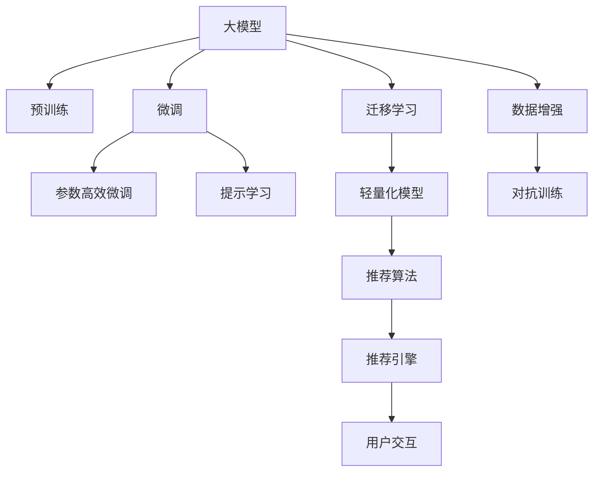

                 

# 大模型直接生成个性化推荐结果的可能性

> 关键词：大模型, 推荐系统, 个性化推荐, 深度学习, 自然语言处理(NLP), 模型压缩, 轻量化模型, 实时推荐, 安全性, 可解释性

## 1. 背景介绍

在当今信息爆炸的时代，个性化推荐系统已经深入各行各业，如电子商务、社交媒体、视频平台等。推荐系统的目标是帮助用户在海量信息中找到他们感兴趣的内容，从而提高用户满意度和平台留存率。然而，传统的推荐系统依赖于用户历史行为数据进行协同过滤、矩阵分解等推理计算，需要用户提供大量交互数据才能提供精准推荐，用户隐私和数据安全问题也逐渐受到关注。

近年来，随着深度学习技术的兴起，基于深度学习模型的推荐系统取得了显著进展。尤其是基于大模型的推荐方法，如利用预训练语言模型进行推荐，其预测能力和表达能力都得到了大幅提升。本文将重点探讨使用大模型进行个性化推荐的可能性，并详细讨论其背后的原理、技术挑战和未来应用。

## 2. 核心概念与联系

### 2.1 核心概念概述

- **大模型**：指参数量巨大的深度学习模型，如BERT、GPT-3等。这些模型通过在海量数据上进行自监督或监督学习，学习到丰富的语言表征，具备强大的语义理解能力和生成能力。
- **个性化推荐系统**：根据用户历史行为数据或用户画像，预测用户可能感兴趣的内容，并主动推荐给用户。传统推荐系统依赖于协同过滤、矩阵分解等方法，而新兴的基于深度学习的方法，尤其是使用大模型的推荐方法，正逐渐成为主流。
- **深度学习**：一类利用多层神经网络逼近非线性复杂函数，进行特征学习和数据建模的机器学习方法。深度学习已经在计算机视觉、自然语言处理等领域取得了重要突破。
- **自然语言处理(NLP)**：涉及语言模型、文本分类、语义分析、机器翻译等技术，通过深度学习模型，实现对自然语言的处理和理解。NLP技术能够帮助推荐系统更好地理解和描述用户的兴趣。
- **模型压缩**：通过剪枝、量化等技术对大模型进行优化，降低模型参数量和计算量，提升模型在硬件上的部署效率。
- **轻量化模型**：通过模型压缩等手段构建的、计算资源消耗较小的模型，适合在移动端、嵌入式等资源受限的环境下部署。

### 2.2 核心概念原理和架构的 Mermaid 流程图



该图展示了从预训练大模型到个性化推荐系统的整个流程。大模型经过预训练和微调，得到具备特定推荐能力的轻量化模型。利用推荐算法和推荐引擎，最终生成个性化推荐结果并反馈给用户。整个过程中，数据增强、对抗训练等技术可以帮助模型更好地适应推荐任务。

## 3. 核心算法原理 & 具体操作步骤

### 3.1 算法原理概述

基于大模型的个性化推荐，本质上是通过对大模型的微调，学习到特定推荐任务的知识，并进行推荐。其核心思想是利用大模型的强大表达能力，学习用户的兴趣表示和商品特征表示，从而在推荐过程中动态计算用户与商品的匹配度。

形式化地，设大模型为 $M_{\theta}$，其中 $\theta$ 为预训练得到的模型参数。假设推荐系统输入为用户 $u$ 的兴趣表示 $\textit{repr}_u$ 和商品 $i$ 的特征表示 $\textit{repr}_i$，输出为 $u$ 对 $i$ 的兴趣评分 $s_{u,i}$。微调的目标是最小化预测评分与实际用户评分之间的差距，即：

$$
\min_{\theta} \mathcal{L}(\textit{repr}_u, \textit{repr}_i, s_{u,i})
$$

其中 $\mathcal{L}$ 为损失函数，可以通过交叉熵等方法衡量预测值和真实值之间的差异。

### 3.2 算法步骤详解

基于大模型的个性化推荐算法主要包括以下步骤：

**Step 1: 数据准备**
- 收集用户的历史行为数据，包括点击、浏览、购买等记录。
- 清洗数据，处理缺失值、异常值，并进行特征工程。
- 将用户行为数据编码为用户兴趣表示 $\textit{repr}_u$，将商品特征信息编码为商品表示 $\textit{repr}_i$。

**Step 2: 大模型微调**
- 使用用户行为数据作为微调数据，对大模型进行微调。
- 选择合适的微调任务，如预测用户对商品的评分、点击概率等。
- 选择合适的优化器和损失函数，设置适当的超参数，如学习率、批大小、迭代次数等。

**Step 3: 轻量化模型构建**
- 对微调后的模型进行剪枝、量化等处理，降低模型复杂度和计算量。
- 引入高效推理引擎，支持模型在特定硬件环境下的部署。

**Step 4: 推荐引擎开发**
- 将轻量化模型集成到推荐引擎中，利用推荐算法进行个性化推荐。
- 根据推荐结果，生成个性化推荐页面，供用户浏览。

**Step 5: 反馈循环**
- 收集用户对推荐结果的反馈，如点击、购买等行为，进行二次训练和微调。
- 动态更新用户兴趣表示和商品特征表示，提高推荐准确度。

### 3.3 算法优缺点

基于大模型的个性化推荐方法具有以下优点：

- **高效性**：利用大模型的强大表达能力，可以在少量标注数据上进行微调，提升模型精度。
- **灵活性**：大模型可以在不同任务上微调，适应不同类型的推荐需求。
- **可解释性**：大模型可以提供详细的特征权重和梯度信息，有助于理解推荐过程。

但同时，该方法也存在以下缺点：

- **计算资源要求高**：大模型在微调和推理时，计算资源消耗较大，需要高性能硬件支持。
- **数据隐私问题**：用户历史行为数据涉及隐私信息，需要严格的隐私保护措施。
- **模型解释性不足**：大模型通常被视为"黑盒"模型，难以解释其内部决策过程。

### 3.4 算法应用领域

基于大模型的个性化推荐系统已经在电商、社交媒体、视频平台等诸多领域得到广泛应用，具体包括：

- **电商推荐**：利用用户浏览和购买记录，推荐商品、优惠等。
- **社交媒体推荐**：根据用户兴趣和互动历史，推荐相关文章、视频等。
- **视频推荐**：分析用户观看记录和行为，推荐影片、频道等。
- **新闻推荐**：预测用户对不同新闻的兴趣，推荐相关新闻报道。
- **音乐推荐**：分析用户听歌记录和偏好，推荐音乐和艺人。

## 4. 数学模型和公式 & 详细讲解 & 举例说明

### 4.1 数学模型构建

在大模型推荐系统中，用户兴趣表示 $\textit{repr}_u$ 和商品特征表示 $\textit{repr}_i$ 可以是词向量、句子嵌入等形式。设用户对商品 $i$ 的兴趣评分 $s_{u,i}$ 的预测模型为：

$$
s_{u,i} = M_{\theta}(\textit{repr}_u, \textit{repr}_i)
$$

其中 $M_{\theta}$ 为微调后的推荐模型，$\theta$ 为模型参数。

假设训练数据集为 $D=\{(u_i, i_j)\}_{i=1}^N$，其中 $u_i$ 为第 $i$ 个用户，$i_j$ 为第 $j$ 个商品。则推荐模型的损失函数为：

$$
\mathcal{L}(\theta) = \frac{1}{N}\sum_{i=1}^N \sum_{j=1}^N \ell(s_{u_i, i_j}, r_{u_i, i_j})
$$

其中 $\ell$ 为损失函数，如交叉熵损失，$r_{u_i, i_j}$ 为真实用户评分。

### 4.2 公式推导过程

以用户对商品的评分预测为例，假设 $\textit{repr}_u$ 和 $\textit{repr}_i$ 均为 $d$ 维向量，则推荐模型的预测公式为：

$$
s_{u,i} = M_{\theta}(\textit{repr}_u, \textit{repr}_i) = \text{softmax}(W_u \textit{repr}_u + W_i \textit{repr}_i + b)
$$

其中 $W_u$ 和 $W_i$ 为线性层权重，$b$ 为偏置。

设真实用户评分 $r_{u,i}$ 为 $0$ 或 $1$，则交叉熵损失函数为：

$$
\ell(s_{u,i}, r_{u,i}) = -r_{u,i} \log(s_{u,i}) - (1-r_{u,i})\log(1-s_{u,i})
$$

将 $\ell$ 代入损失函数 $\mathcal{L}(\theta)$，得：

$$
\mathcal{L}(\theta) = \frac{1}{N}\sum_{i=1}^N \sum_{j=1}^N \left(-r_{u_i, i_j} \log(s_{u_i, i_j}) - (1-r_{u_i, i_j})\log(1-s_{u_i, i_j})\right)
$$

### 4.3 案例分析与讲解

以一个简单的电商推荐系统为例，分析大模型的微调过程：

1. **数据准备**：收集用户的历史行为数据，如浏览、点击、购买记录，构建用户兴趣表示 $\textit{repr}_u$ 和商品特征表示 $\textit{repr}_i$。
2. **模型微调**：将用户行为数据输入大模型，微调得到推荐模型 $M_{\theta}$。
3. **轻量化模型构建**：对微调后的模型进行剪枝、量化等处理，得到轻量化模型 $M_{\theta'}$。
4. **推荐引擎开发**：将轻量化模型集成到推荐引擎中，使用推荐算法进行个性化推荐。
5. **反馈循环**：收集用户反馈数据，对模型进行二次训练，动态更新用户兴趣表示和商品特征表示。

## 5. 项目实践：代码实例和详细解释说明

### 5.1 开发环境搭建

在开始项目实践前，需要准备以下开发环境：

1. **安装Python**：从官网下载安装Python 3.x版本，并确保pip环境正常工作。
2. **安装PyTorch**：使用pip安装最新的PyTorch版本。
3. **安装Transformer库**：使用pip安装HuggingFace的Transformer库，支持大模型的微调和推理。
4. **准备数据集**：将用户历史行为数据、商品特征信息等数据进行预处理，构建训练集、验证集和测试集。
5. **准备硬件资源**：确保计算机具备高性能的GPU/TPU等硬件资源，以支持大模型的训练和推理。

### 5.2 源代码详细实现

以下是使用PyTorch进行大模型微调的示例代码：

```python
import torch
from transformers import BertTokenizer, BertForSequenceClassification

# 数据预处理
tokenizer = BertTokenizer.from_pretrained('bert-base-uncased')
def preprocess_data(texts, labels):
    input_ids = []
    attention_masks = []
    labels = []
    for text, label in zip(texts, labels):
        tokenized_text = tokenizer.encode(text, add_special_tokens=True, padding='max_length', max_length=128, truncation=True)
        input_ids.append(tokenized_text)
        attention_masks.append([float(i>0) for i in tokenized_text])
        labels.append(label)
    return input_ids, attention_masks, labels

# 构建模型
model = BertForSequenceClassification.from_pretrained('bert-base-uncased', num_labels=2)

# 加载数据集
train_data, dev_data, test_data = preprocess_data(train_data, train_labels), preprocess_data(dev_data, dev_labels), preprocess_data(test_data, test_labels)

# 设置超参数
optimizer = torch.optim.Adam(model.parameters(), lr=2e-5)
epochs = 5
batch_size = 16

# 训练过程
model.train()
for epoch in range(epochs):
    for batch in DataLoader(train_data, batch_size=batch_size, shuffle=True):
        input_ids, attention_masks, labels = map(torch.tensor, batch)
        model.zero_grad()
        outputs = model(input_ids, attention_mask=attention_masks)
        loss = outputs.loss
        loss.backward()
        optimizer.step()
        if (epoch+1) % 1 == 0:
            print(f'Epoch {epoch+1}, training loss: {loss:.4f}')
    
# 评估过程
model.eval()
with torch.no_grad():
    dev_preds = []
    dev_labels = []
    for batch in DataLoader(dev_data, batch_size=batch_size, shuffle=False):
        input_ids, attention_masks, labels = map(torch.tensor, batch)
        outputs = model(input_ids, attention_mask=attention_masks)
        dev_preds.extend(outputs.logits.argmax(dim=1))
        dev_labels.extend(labels)
    print(classification_report(dev_labels, dev_preds))

# 测试过程
model.eval()
with torch.no_grad():
    test_preds = []
    test_labels = []
    for batch in DataLoader(test_data, batch_size=batch_size, shuffle=False):
        input_ids, attention_masks, labels = map(torch.tensor, batch)
        outputs = model(input_ids, attention_mask=attention_masks)
        test_preds.extend(outputs.logits.argmax(dim=1))
        test_labels.extend(labels)
    print(classification_report(test_labels, test_preds))
```

### 5.3 代码解读与分析

上述代码实现了基于大模型(BERT)的序列分类任务微调，具体步骤如下：

1. **数据预处理**：使用BertTokenizer对用户行为数据进行分词和编码，构建输入特征和标签。
2. **模型构建**：加载预训练的BERT模型，并设置微调任务为二分类任务。
3. **模型训练**：使用Adam优化器训练模型，在训练集上进行多轮迭代。
4. **模型评估**：在验证集上评估模型性能，输出分类指标。
5. **模型测试**：在测试集上测试模型性能，输出分类指标。

通过该示例，可以看到，使用PyTorch和Transformer库进行大模型微调，需要经过数据预处理、模型加载、超参数设置、训练和评估等环节。开发者可以根据具体任务，进一步改进和优化模型微调过程。

## 6. 实际应用场景

### 6.1 电商推荐

电商推荐系统可以基于用户浏览和购买历史，利用大模型预测用户对商品的评分，从而推荐商品。大模型能够学习到商品的语义特征，并结合用户兴趣表示，生成更加精准的推荐结果。此外，大模型还能够进行商品关联推荐，提高用户发现新商品的可能性。

### 6.2 社交媒体推荐

社交媒体推荐系统可以根据用户互动历史和兴趣，预测用户对文章的兴趣评分，从而推荐相关文章。大模型能够捕捉文章的语义信息，并结合用户兴趣，生成高质量的推荐结果。同时，大模型还能够进行内容生成，帮助平台推荐原创文章，提升用户黏性。

### 6.3 视频推荐

视频推荐系统可以根据用户观看历史和评分，预测用户对视频的兴趣，从而推荐相关视频。大模型能够学习视频中的视觉和音频信息，结合用户兴趣，生成更加个性化和多样化的推荐结果。同时，大模型还可以用于视频摘要生成，提升视频内容的可读性。

### 6.4 新闻推荐

新闻推荐系统可以根据用户阅读历史和兴趣，预测用户对不同新闻的兴趣评分，从而推荐相关新闻。大模型能够学习新闻内容的语义信息，结合用户兴趣，生成高质量的推荐结果。同时，大模型还可以用于自动摘要和关键词提取，提升新闻的可读性。

## 7. 工具和资源推荐

### 7.1 学习资源推荐

1. **《深度学习基础》课程**：斯坦福大学提供的深度学习入门课程，涵盖机器学习基础和深度学习基础，适合初学者学习。
2. **《自然语言处理综述》论文**：DeepMind发表的综述论文，全面介绍了NLP领域的最新进展和技术挑战，适合进阶学习。
3. **《推荐系统》课程**：由Tsinghua University提供的推荐系统课程，涵盖推荐算法和系统设计，适合工程实践者学习。
4. **《Transformers》书籍**：HuggingFace官方文档，详细介绍Transformer模型的原理和应用，适合开发者学习。
5. **《PyTorch深度学习》书籍**：深入浅出地介绍了PyTorch框架的使用，适合深度学习开发人员学习。

### 7.2 开发工具推荐

1. **PyTorch**：灵活的深度学习框架，支持动态计算图，适合深度学习研究和实验。
2. **TensorFlow**：由Google主导的深度学习框架，生产部署方便，适合大规模工程应用。
3. **TensorBoard**：TensorFlow配套的可视化工具，可以实时监测模型训练状态，适合调试模型。
4. **Weights & Biases**：模型训练的实验跟踪工具，适合记录和分析模型训练过程。
5. **Grafana**：开源的可视化工具，支持多数据源整合，适合展示模型训练和推理结果。

### 7.3 相关论文推荐

1. **Attention is All You Need**：Transformer模型，开启了NLP领域的预训练大模型时代。
2. **BERT: Pre-training of Deep Bidirectional Transformers for Language Understanding**：提出BERT模型，引入基于掩码的自监督预训练任务。
3. **Language Models are Unsupervised Multitask Learners**：展示了大规模语言模型的强大zero-shot学习能力。
4. **Parameter-Efficient Transfer Learning for NLP**：提出Adapter等参数高效微调方法。
5. **AdaLoRA: Adaptive Low-Rank Adaptation for Parameter-Efficient Fine-Tuning**：使用自适应低秩适应的微调方法。

## 8. 总结：未来发展趋势与挑战

### 8.1 研究成果总结

本文详细介绍了基于大模型的个性化推荐系统，探讨了其原理、步骤、优缺点和应用场景。通过系统梳理，可以看出，大模型在个性化推荐中具有高效性和灵活性，能够学习到丰富的语义信息，生成高质量的推荐结果。然而，大模型也面临着计算资源要求高、数据隐私问题和模型解释性不足等挑战。

### 8.2 未来发展趋势

展望未来，基于大模型的个性化推荐系统将呈现以下几个发展趋势：

1. **模型压缩和优化**：进一步优化大模型的结构和推理过程，降低计算资源消耗，提升模型在移动端和嵌入式设备上的部署效率。
2. **轻量化模型研究**：构建更加轻量化和高效的模型，支持实时推荐和个性化推荐。
3. **隐私保护技术**：研究差分隐私、联邦学习等隐私保护技术，保护用户数据隐私。
4. **模型解释性**：研究可解释性技术，如因果推断、公平性分析等，提高模型可解释性。
5. **跨模态推荐**：研究视频、语音等多模态数据的融合，提升推荐系统的综合表现。
6. **实时推荐系统**：研究实时推荐算法和系统架构，支持大规模用户个性化推荐。

### 8.3 面临的挑战

尽管大模型在个性化推荐中表现出色，但未来仍面临诸多挑战：

1. **计算资源瓶颈**：大模型在训练和推理过程中，计算资源消耗较大，需要高性能硬件支持。
2. **数据隐私问题**：用户数据涉及隐私信息，需要严格的隐私保护措施。
3. **模型解释性不足**：大模型通常被视为"黑盒"模型，难以解释其内部决策过程。
4. **实时推荐性能**：实时推荐系统需要高效的算法和架构支持，以应对大规模用户请求。
5. **跨模态数据融合**：多模态数据融合技术尚不成熟，难以实现高效的多模态推荐。

### 8.4 研究展望

未来的研究需要从以下几个方面寻求新的突破：

1. **模型压缩和优化**：开发更加高效的模型压缩和优化技术，降低模型参数量和计算量。
2. **轻量化模型研究**：构建更加轻量化和高效的推荐模型，支持实时推荐和个性化推荐。
3. **隐私保护技术**：研究差分隐私、联邦学习等隐私保护技术，保护用户数据隐私。
4. **模型解释性**：研究可解释性技术，如因果推断、公平性分析等，提高模型可解释性。
5. **跨模态推荐**：研究视频、语音等多模态数据的融合，提升推荐系统的综合表现。
6. **实时推荐系统**：研究实时推荐算法和系统架构，支持大规模用户个性化推荐。

总之，基于大模型的个性化推荐技术具有广阔的应用前景，但也需要面对诸多挑战。只有不断优化模型结构、提升计算效率、保护用户隐私、增强模型可解释性，才能真正实现大模型在个性化推荐领域的落地应用。

## 9. 附录：常见问题与解答

### Q1: 大模型在个性化推荐中的应用有哪些局限性？

A: 大模型在个性化推荐中的应用存在以下局限性：
1. 计算资源需求高：大模型在训练和推理过程中，计算资源消耗较大，需要高性能硬件支持。
2. 数据隐私问题：用户数据涉及隐私信息，需要严格的隐私保护措施。
3. 模型解释性不足：大模型通常被视为"黑盒"模型，难以解释其内部决策过程。

### Q2: 大模型在个性化推荐中如何进行微调？

A: 大模型在个性化推荐中需要进行微调，步骤如下：
1. 数据预处理：收集用户历史行为数据，构建用户兴趣表示和商品特征表示。
2. 模型加载：加载预训练的大模型，设置微调任务。
3. 超参数设置：设置优化器、学习率、批大小等超参数。
4. 模型训练：使用优化器训练模型，在训练集上进行多轮迭代。
5. 模型评估：在验证集上评估模型性能，输出分类指标。
6. 模型测试：在测试集上测试模型性能，输出分类指标。

### Q3: 大模型在个性化推荐中如何进行模型压缩？

A: 大模型在个性化推荐中进行模型压缩，可以采用以下方法：
1. 剪枝：去除模型中的冗余参数和冗余层，降低模型复杂度。
2. 量化：将浮点模型转为定点模型，压缩存储空间，提高计算效率。
3. 混合精度训练：使用混合精度技术，降低计算资源消耗。
4. 模型并行：将模型进行并行优化，提高模型在分布式系统上的部署效率。

### Q4: 大模型在个性化推荐中如何进行实时推荐？

A: 大模型在个性化推荐中进行实时推荐，可以采用以下方法：
1. 模型优化：优化模型结构和推理过程，降低计算资源消耗。
2. 异步更新：采用异步更新机制，支持实时数据输入和模型更新。
3. 在线学习：利用在线学习算法，持续优化模型参数。
4. 分布式部署：将模型部署在分布式系统中，支持大规模用户请求。

### Q5: 大模型在个性化推荐中如何进行隐私保护？

A: 大模型在个性化推荐中进行隐私保护，可以采用以下方法：
1. 差分隐私：在模型训练和推理过程中，加入噪声，保护用户隐私。
2. 联邦学习：在分布式系统中，将数据分成多个片段，各节点进行本地训练，最终合并结果。
3. 数据脱敏：在数据预处理阶段，对敏感数据进行脱敏处理。
4. 匿名化：对用户数据进行匿名化处理，保护用户隐私。

---

作者：禅与计算机程序设计艺术 / Zen and the Art of Computer Programming

