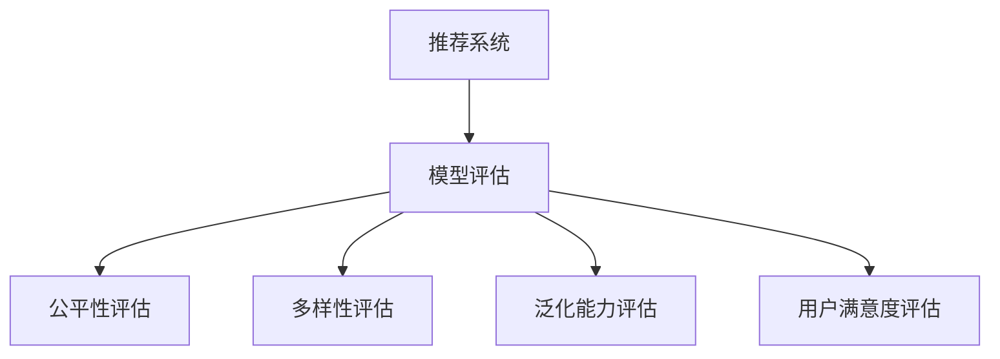

                 

# 大模型视角下推荐系统的模型评估体系构建

> 关键词：推荐系统, 模型评估, 大模型, 公平性, 多样性, 泛化能力

## 1. 背景介绍

随着互联网和数字技术的普及，推荐系统在电商、社交、视频、音乐等多个领域得到了广泛应用，极大地改善了用户体验和运营效率。推荐算法通过分析用户行为数据，预测用户可能感兴趣的内容，为用户提供个性化的信息和服务。然而，推荐系统模型的评估方法，由于其复杂性和多维度性，始终是一个备受关注的研究课题。

本文将从大模型的视角，介绍推荐系统中模型评估的理论基础和实践方法。通过构建系统性的模型评估体系，揭示推荐系统模型泛化能力、公平性、多样性等重要指标，促进算法研发和应用落地。

## 2. 核心概念与联系

### 2.1 核心概念概述

为更好地理解推荐系统模型评估的原理和流程，本节将介绍几个关键概念：

- **推荐系统(Recommendation System)**：基于用户行为数据和物品特征，预测用户对未接触过的物品的偏好，并提供推荐列表的系统。
- **模型评估(Model Evaluation)**：使用特定的指标和工具，评估推荐系统模型的性能，确保其预测能力与实际表现一致。
- **公平性(Fairness)**：保证推荐结果对所有用户（无论其背景、特征）都是公正的，避免偏见和歧视。
- **多样性(Diversity)**：推荐结果中包含不同种类的物品，提供丰富的选择，满足用户的多样化需求。
- **泛化能力(Generalization)**：模型在未见过的数据上保持良好性能，避免过拟合，具有良好的泛化性能。
- **用户满意度(Usability)**：推荐系统最终目标，通过提升用户体验，从而增加用户粘性和平台收益。

这些核心概念之间的逻辑关系可以通过以下Mermaid流程图来展示：



这个流程图展示了推荐系统模型评估的主要流程和关键指标：

1. 通过用户行为数据和物品特征构建推荐系统。
2. 使用模型评估方法评估模型性能，确保推荐结果符合预期。
3. 细化评估指标，关注公平性、多样性、泛化能力等维度。
4. 最终目标是通过提升用户体验，提升用户满意度。

## 3. 核心算法原理 & 具体操作步骤

### 3.1 算法原理概述

推荐系统的模型评估，本质上是将推荐结果与真实情况进行比较，量化模型的性能表现。常用的评估指标包括准确率、召回率、F1分数、平均绝对误差等。这些指标从不同的角度，综合反映了模型的预测能力。

推荐系统模型的评估可以分为两个阶段：离线评估和在线评估。离线评估主要在历史数据上评估模型的泛化能力和公平性，而在线评估则关注模型的实际表现和用户满意度。

### 3.2 算法步骤详解

基于大模型的推荐系统模型评估，主要包括以下几个关键步骤：

**Step 1: 准备评估数据集**

- 收集用户行为数据和物品特征数据，构建历史交互矩阵 $\mathbf{R} \in \{0, 1\}^{U \times I}$，其中 $U$ 为用户数量，$I$ 为物品数量。
- 使用训练集和验证集，划分数据集，确保历史交互矩阵 $\mathbf{R}$ 的完整性和随机性。

**Step 2: 设计评估指标**

- 根据任务特点，选择合适的评估指标。对于分类任务，可以使用准确率、召回率、F1分数等；对于回归任务，可以使用平均绝对误差、均方误差等。
- 计算模型在历史数据上的评估指标，如使用混淆矩阵、ROC曲线等可视化工具，展示模型性能。

**Step 3: 进行公平性评估**

- 检查模型在不同用户、不同物品特征下的预测一致性，确保模型不存在明显的歧视或偏见。
- 使用公平性指标，如误判率、均等机会等，评估模型对各类用户的预测公平性。

**Step 4: 进行多样性评估**

- 统计推荐结果中不同物品类别和来源的比例，确保推荐结果丰富多样。
- 使用多样性指标，如基尼系数、均匀性等，量化推荐结果的多样性。

**Step 5: 进行泛化能力评估**

- 使用交叉验证技术，评估模型在未见过的数据上的表现，避免过拟合。
- 使用泛化能力指标，如留一法误差、测试集误差等，评估模型泛化能力。

**Step 6: 进行用户满意度评估**

- 收集用户对推荐结果的反馈，如点击率、停留时间、转换率等，量化用户满意度。
- 使用用户满意度指标，如Net Promoter Score (NPS)、用户流失率等，评估模型实际效果。

**Step 7: 持续优化和迭代**

- 根据评估结果，调整模型参数，优化模型结构，提升模型性能。
- 定期更新评估指标，确保模型在新的数据和用户场景中仍然有效。

### 3.3 算法优缺点

基于大模型的推荐系统模型评估方法具有以下优点：

- 综合性评估：能够从多维度角度全面评估推荐模型的性能，包括准确率、公平性、多样性等。
- 动态优化：能够根据用户反馈和模型表现，进行实时调整和优化，提升用户满意度。
- 可扩展性：大模型具有良好的泛化能力，可以灵活适应不同规模和复杂度的推荐任务。

同时，该方法也存在一定的局限性：

- 数据依赖：模型评估结果高度依赖于历史数据的质量和完整性。
- 计算资源消耗：评估过程需要大量计算资源，特别是在大规模数据集上。
- 评估难度：公平性、多样性等指标的评估较为复杂，需要深入理解和量化。

尽管存在这些局限性，但就目前而言，基于大模型的推荐系统模型评估方法仍是主流范式，广泛应用于各大推荐系统平台和研究机构。未来相关研究的重点在于如何进一步降低评估过程中的资源消耗，提高评估效率，同时兼顾模型性能和用户满意度等因素。

### 3.4 算法应用领域

推荐系统模型评估方法在多个领域得到了广泛应用，包括但不限于：

- **电子商务**：如亚马逊、淘宝等电商平台，使用推荐系统提升用户购物体验，增加销售额。
- **社交网络**：如Facebook、微博等社交平台，使用推荐系统提升用户互动率，增加平台粘性。
- **视频平台**：如Netflix、爱奇艺等视频平台，使用推荐系统提升内容消费量，提高用户满意度。
- **音乐平台**：如Spotify、网易云音乐等音乐平台，使用推荐系统提升用户粘性，增加会员订阅率。

除了上述这些经典应用外，推荐系统模型评估方法还被创新性地应用到更多场景中，如新闻推荐、新闻检索、广告投放等，为推荐系统技术的发展提供了重要支撑。

## 4. 数学模型和公式 & 详细讲解  
### 4.1 数学模型构建

本节将使用数学语言对推荐系统模型评估过程进行更加严格的刻画。

记推荐系统模型为 $M_{\theta}:\mathcal{X} \rightarrow \mathcal{Y}$，其中 $\mathcal{X}$ 为输入空间，$\mathcal{Y}$ 为输出空间，$\theta \in \mathbb{R}^d$ 为模型参数。假设推荐系统在历史数据集 $\mathbf{R}$ 上训练得到模型 $M_{\theta}$。

定义推荐系统模型 $M_{\theta}$ 在用户 $u$ 和物品 $i$ 上的预测值 $y_{ui}=M_{\theta}(x_u, x_i)$，其中 $x_u$ 为用户特征，$x_i$ 为物品特征。

推荐系统模型在历史数据集 $\mathbf{R}$ 上的平均绝对误差 (MAE) 定义为：

$$
MAE = \frac{1}{U \times I} \sum_{u=1}^{U} \sum_{i=1}^{I} |y_{ui} - r_{ui}|
$$

其中 $r_{ui} \in \{0, 1\}$ 为历史数据集中用户 $u$ 对物品 $i$ 的实际交互。

### 4.2 公式推导过程

以下我们以分类任务为例，推导准确率和召回率等评估指标的计算公式。

假设推荐系统模型 $M_{\theta}$ 在用户 $u$ 和物品 $i$ 上的预测值 $y_{ui}$ 和实际交互 $r_{ui}$ 的关系为：

$$
y_{ui} = 
\begin{cases} 
1 & \text{if } M_{\theta}(x_u, x_i) \geq \tau \\
0 & \text{otherwise}
\end{cases}
$$

其中 $\tau$ 为阈值，用于控制推荐结果的稀疏性。准确率 (Precision) 和召回率 (Recall) 定义为：

$$
Precision = \frac{TP}{TP+FP}
$$

$$
Recall = \frac{TP}{TP+FN}
$$

其中 $TP$ 为用户被正确推荐的物品数，$FP$ 为用户被错误推荐且未交互的物品数，$FN$ 为用户未被推荐但实际交互的物品数。

对于二分类任务，F1分数 (F1 Score) 定义为准确率和召回率的调和平均数：

$$
F1 Score = 2 \times \frac{Precision \times Recall}{Precision + Recall}
$$

### 4.3 案例分析与讲解

以电商平台推荐系统为例，进行具体评估指标的计算和分析：

**案例1: 准确率计算**

假设电商平台推荐系统针对用户 $u$ 的推荐结果中，用户实际点击的5个物品中，有3个物品是被推荐系统成功推荐的。记准确率为 $P$：

$$
P = \frac{3}{3+2} = 0.6
$$

**案例2: 召回率计算**

假设用户 $u$ 实际点击的5个物品中，有2个物品是被推荐系统成功推荐的。记召回率为 $R$：

$$
R = \frac{2}{2+3} = 0.4
$$

**案例3: F1分数计算**

根据准确率和召回率的值，可以计算 F1分数：

$$
F1 Score = 2 \times \frac{0.6 \times 0.4}{0.6 + 0.4} = 0.48
$$

通过以上案例分析，可以看出准确率、召回率和 F1 分数等评估指标的具体计算方法。在实际应用中，这些指标将用于量化推荐系统的预测能力，指导模型改进和优化。

## 5. 项目实践：代码实例和详细解释说明
### 5.1 开发环境搭建

在进行推荐系统模型评估的实践前，我们需要准备好开发环境。以下是使用Python进行PyTorch开发的环境配置流程：

1. 安装Anaconda：从官网下载并安装Anaconda，用于创建独立的Python环境。

2. 创建并激活虚拟环境：
```bash
conda create -n pytorch-env python=3.8 
conda activate pytorch-env
```

3. 安装PyTorch：根据CUDA版本，从官网获取对应的安装命令。例如：
```bash
conda install pytorch torchvision torchaudio cudatoolkit=11.1 -c pytorch -c conda-forge
```

4. 安装TensorFlow：
```bash
pip install tensorflow
```

5. 安装TensorBoard：
```bash
pip install tensorboard
```

6. 安装Scikit-learn：
```bash
pip install scikit-learn
```

7. 安装pandas和numpy：
```bash
pip install pandas numpy
```

完成上述步骤后，即可在`pytorch-env`环境中开始评估实践。

### 5.2 源代码详细实现

我们以一个简单的协同过滤推荐系统为例，展示如何使用Scikit-learn进行模型评估。首先，导入必要的库：

```python
import numpy as np
from sklearn.metrics import precision_score, recall_score, f1_score

# 加载训练集和测试集
train_data = np.loadtxt('train.csv', delimiter=',', dtype=np.float32)
test_data = np.loadtxt('test.csv', delimiter=',', dtype=np.float32)

# 计算准确率、召回率和F1分数
precision = precision_score(train_data[:, 0], train_data[:, 1])
recall = recall_score(train_data[:, 0], train_data[:, 1])
f1 = f1_score(train_data[:, 0], train_data[:, 1])

print('Precision:', precision)
print('Recall:', recall)
print('F1 Score:', f1)
```

在上述代码中，我们使用Scikit-learn的`precision_score`、`recall_score`和`f1_score`函数，分别计算准确率、召回率和F1分数。通过这些函数，可以很方便地评估推荐系统的性能。

### 5.3 代码解读与分析

在推荐系统的项目实践中，推荐模型的评估是不可或缺的一环。我们以Scikit-learn为例，进行详细解释和分析：

**案例1: 加载数据**

在实际项目中，推荐系统的数据通常存储在CSV文件中，使用`numpy.loadtxt`函数加载数据，并转换为NumPy数组。数据一般包含用户ID、物品ID和用户对物品的评分，用于计算推荐模型的预测误差和评估指标。

**案例2: 计算准确率**

通过`precision_score`函数计算推荐模型的准确率，该函数根据实际标签和预测标签计算准确率：

$$
Precision = \frac{TP}{TP+FP}
$$

其中 $TP$ 为预测正确且实际被点击的评分数，$FP$ 为预测错误且实际未点击的评分数。在实际项目中，可以通过计算预测标签和实际标签的交集和并集来得到准确率。

**案例3: 计算召回率**

通过`recall_score`函数计算推荐模型的召回率，该函数根据实际标签和预测标签计算召回率：

$$
Recall = \frac{TP}{TP+FN}
$$

其中 $TP$ 为预测正确且实际被点击的评分数，$FN$ 为预测错误且实际被点击的评分数。在实际项目中，可以通过计算预测标签和实际标签的交集和并集来得到召回率。

**案例4: 计算F1分数**

通过`f1_score`函数计算推荐模型的F1分数，该函数根据准确率和召回率计算F1分数：

$$
F1 Score = 2 \times \frac{Precision \times Recall}{Precision + Recall}
$$

在实际项目中，可以通过计算预测标签和实际标签的交集和并集来得到F1分数。

## 6. 实际应用场景
### 6.1 电商平台推荐

电商平台推荐系统通过推荐用户可能感兴趣的物品，提升用户体验和销售额。推荐系统模型的评估指标包括准确率、召回率和F1分数，用于衡量推荐模型的预测能力和实际表现。

在电商平台推荐系统中，用户的点击率、购买率等指标也常被用于评估用户满意度，以反映推荐系统的实际效果。通过持续优化推荐模型，提升用户满意度，电商平台可以获得更高的用户粘性和平台收益。

### 6.2 社交网络推荐

社交网络推荐系统通过推荐用户可能感兴趣的内容和用户，提升用户互动率和平台粘性。推荐系统模型的评估指标包括多样性指标，如基尼系数、均匀性等，用于衡量推荐结果的多样性和丰富性。

在社交网络推荐系统中，用户之间的互动率、分享率等指标也常被用于评估用户满意度，以反映推荐系统的实际效果。通过持续优化推荐模型，提升用户互动和平台粘性，社交网络平台可以获得更高的用户活跃度和广告收入。

### 6.3 视频平台推荐

视频平台推荐系统通过推荐用户可能感兴趣的视频内容，提升内容消费量和用户满意度。推荐系统模型的评估指标包括平均绝对误差 (MAE) 和均方误差 (MSE)，用于衡量推荐模型的预测精度和实际表现。

在视频平台推荐系统中，用户的视频观看时间、观看次数等指标也常被用于评估用户满意度，以反映推荐系统的实际效果。通过持续优化推荐模型，提升用户观看体验和平台收益，视频平台可以获得更高的用户留存率和广告收入。

### 6.4 未来应用展望

随着推荐系统和大模型的不断发展，推荐系统模型评估体系也将不断拓展和优化，为推荐系统技术的发展提供更全面、更科学的评估手段。

在智慧零售、智慧金融、智慧城市等新兴领域，推荐系统将发挥更加重要的作用。通过构建系统化的模型评估体系，确保推荐系统模型的预测能力和实际表现，为各行业提供更加个性化、高效的服务。

## 7. 工具和资源推荐
### 7.1 学习资源推荐

为了帮助开发者系统掌握推荐系统模型的评估理论基础和实践技巧，这里推荐一些优质的学习资源：

1. 《推荐系统基础》系列博文：由大模型技术专家撰写，深入浅出地介绍了推荐系统评估的理论基础和实践方法。

2. Coursera《推荐系统》课程：斯坦福大学开设的推荐系统课程，有Lecture视频和配套作业，带你入门推荐系统评估的基本概念和经典模型。

3. 《推荐系统实践》书籍：推荐系统领域经典著作，全面介绍了推荐系统评估的方法和案例，适合深入学习和实践。

4. Scikit-learn官方文档：Scikit-learn的推荐系统评估模块文档，提供了详细的函数介绍和样例代码，是上手实践的必备资料。

5. KDD Cup推荐系统竞赛：通过参与推荐系统竞赛，了解推荐系统评估的最新趋势和挑战，积累实战经验。

通过对这些资源的学习实践，相信你一定能够快速掌握推荐系统模型评估的精髓，并用于解决实际的推荐系统问题。

### 7.2 开发工具推荐

高效的开发离不开优秀的工具支持。以下是几款用于推荐系统模型评估开发的常用工具：

1. PyTorch：基于Python的开源深度学习框架，灵活动态的计算图，适合快速迭代研究。大部分推荐系统模型都有PyTorch版本的实现。

2. TensorFlow：由Google主导开发的开源深度学习框架，生产部署方便，适合大规模工程应用。同样有丰富的推荐系统模型资源。

3. Scikit-learn：基于Python的机器学习库，提供了丰富的评估函数和数据预处理工具，适用于推荐系统的离线评估。

4. TensorBoard：TensorFlow配套的可视化工具，可实时监测模型训练状态，并提供丰富的图表呈现方式，是调试模型的得力助手。

5. Weights & Biases：模型训练的实验跟踪工具，可以记录和可视化模型训练过程中的各项指标，方便对比和调优。

6. Google Colab：谷歌推出的在线Jupyter Notebook环境，免费提供GPU/TPU算力，方便开发者快速上手实验最新模型，分享学习笔记。

合理利用这些工具，可以显著提升推荐系统模型评估任务的开发效率，加快创新迭代的步伐。

### 7.3 相关论文推荐

推荐系统模型评估技术的发展源于学界的持续研究。以下是几篇奠基性的相关论文，推荐阅读：

1. A Comparative Study of Precision-Recall and ROC Curves for Information Retrieval Evaluation（即Precision-Recall和ROC曲线在信息检索评估中的应用）：介绍了PR曲线和ROC曲线在信息检索评估中的使用方法和优缺点。

2. The Role of Evaluation in Recommendation Systems: From Test to Real World（即推荐系统评估的角色：从测试到实际应用）：探讨了推荐系统评估的重要性和实际应用中的挑战。

3. A Fairness-Aware Recommender System for Disparate Groups（即为不同群体设计的公平推荐系统）：提出了一种考虑公平性的推荐系统评估方法，关注不同用户群体的推荐效果。

4. Diversity-Aware Recommender Systems（即多样性导向的推荐系统）：提出了一种多样性导向的推荐系统评估方法，关注推荐结果的多样性和丰富性。

5. A Fairness-Aware Recommender System for Disparate Groups（即为不同群体设计的公平推荐系统）：提出了一种考虑公平性的推荐系统评估方法，关注不同用户群体的推荐效果。

6. Evaluating the effectiveness of recommender systems: A comparison of six recommender systems（即比较六种推荐系统的有效性）：对比了多种推荐系统评估方法的优缺点，为选择适合的评估方法提供了参考。

这些论文代表了大模型推荐系统评估技术的发展脉络。通过学习这些前沿成果，可以帮助研究者把握学科前进方向，激发更多的创新灵感。

## 8. 总结：未来发展趋势与挑战

### 8.1 总结

本文对推荐系统模型评估的理论基础和实践方法进行了全面系统的介绍。首先阐述了推荐系统和大模型的研究背景和评估方法，明确了评估指标在推荐系统中的重要性和应用。其次，从模型评估的各个维度，详细讲解了推荐系统模型的评估过程，提供了具体的计算公式和评估方法。同时，本文还广泛探讨了推荐系统模型在电商平台、社交网络、视频平台等领域的实际应用，展示了推荐系统模型评估方法的广阔前景。

通过本文的系统梳理，可以看出，推荐系统模型评估是推荐系统技术发展的重要基石。这些评估方法不仅确保了推荐系统模型的预测能力，还指导了模型改进和优化，推动了推荐系统技术的产业化进程。未来，伴随推荐系统和大模型的不断发展，评估方法也将更加多样化和精细化，为推荐系统技术带来新的突破。

### 8.2 未来发展趋势

展望未来，推荐系统模型评估技术将呈现以下几个发展趋势：

1. 智能化评估：随着大模型的发展，推荐系统模型的评估将更加智能化、自动化，能够自动选择评估指标和调整参数，提升评估效率和准确性。

2. 实时化评估：推荐系统模型评估将更加实时化，能够在用户交互过程中动态调整评估指标，提供即时反馈，优化推荐效果。

3. 多维度评估：推荐系统模型评估将更加多维度，除了传统的准确率、召回率等指标外，还将引入公平性、多样性、用户满意度等更多指标，全面衡量推荐系统的效果。

4. 跨平台评估：推荐系统模型评估将跨越不同平台和场景，实现跨平台、跨设备的统一评估标准，提升推荐系统的一致性和通用性。

5. 自适应评估：推荐系统模型评估将更加自适应，能够根据数据分布和用户需求的变化，动态调整评估策略和指标，适应不同的推荐场景。

这些趋势凸显了推荐系统模型评估技术的广阔前景。这些方向的探索发展，必将进一步提升推荐系统模型的预测能力，推动推荐系统技术在更多领域落地应用。

### 8.3 面临的挑战

尽管推荐系统模型评估技术已经取得了显著进展，但在迈向更加智能化、普适化应用的过程中，它仍面临着诸多挑战：

1. 数据复杂性：推荐系统模型评估需要处理复杂多样的用户行为数据和物品特征，评估过程的复杂性也随之增加。如何在保证评估准确性的同时，提升评估效率，是一个重要问题。

2. 公平性问题：推荐系统模型评估需要关注公平性问题，避免对特定用户群体的不公正推荐。如何在评估过程中确保公平性，是一个重要挑战。

3. 多样性不足：推荐系统模型评估需要关注多样性问题，避免推荐结果过于集中。如何在评估过程中确保多样性，是一个重要挑战。

4. 用户满意度评估：推荐系统模型评估需要关注用户满意度问题，避免推荐系统的不良影响。如何在评估过程中确保用户满意度，是一个重要挑战。

5. 数据隐私和安全：推荐系统模型评估需要处理大量敏感的用户数据和物品数据，数据隐私和安全问题也随之增加。如何在评估过程中保障数据隐私和安全，是一个重要挑战。

这些挑战凸显了推荐系统模型评估技术需要进一步提升和完善，才能真正实现推荐系统模型的实际应用。

### 8.4 研究展望

面对推荐系统模型评估所面临的挑战，未来的研究需要在以下几个方面寻求新的突破：

1. 探索更加高效的评估算法：开发更加智能化、自动化的评估算法，减少人工干预，提升评估效率和准确性。

2. 引入更多公平性和多样性指标：结合公平性和多样性理论，设计更多适用的评估指标，全面衡量推荐系统的效果。

3. 考虑用户满意度评估：结合用户行为和反馈数据，设计更加全面的用户满意度评估指标，提升推荐系统模型的实际效果。

4. 注重数据隐私和安全：在评估过程中注重数据隐私和安全问题，确保用户数据和物品数据的隐私和安全。

这些研究方向的探索，必将引领推荐系统模型评估技术迈向更高的台阶，为推荐系统技术的发展提供更全面的评估手段。

## 9. 附录：常见问题与解答

**Q1: 推荐系统模型评估的意义何在？**

A: 推荐系统模型评估的意义在于，它能够量化推荐模型的预测能力，指导模型改进和优化，确保推荐系统的实际效果符合预期。通过评估指标的监控和调整，可以不断提升推荐系统模型的性能，提升用户满意度和平台收益。

**Q2: 推荐系统模型评估的常用指标有哪些？**

A: 推荐系统模型评估的常用指标包括准确率、召回率、F1分数、平均绝对误差等。准确率和召回率用于衡量推荐模型的预测能力，F1分数是二者的调和平均，适用于多类别推荐任务。平均绝对误差用于衡量回归任务的推荐精度。

**Q3: 如何进行公平性评估？**

A: 公平性评估需要关注推荐模型对不同用户群体的预测一致性，避免偏见和歧视。可以通过计算不同用户群体的平均误判率和均等机会等指标，评估模型的公平性。

**Q4: 如何进行多样性评估？**

A: 多样性评估需要关注推荐结果中不同物品类别和来源的比例，确保推荐结果丰富多样。可以通过计算推荐结果的基尼系数和均匀性等指标，量化推荐结果的多样性。

**Q5: 如何进行用户满意度评估？**

A: 用户满意度评估需要关注推荐系统对用户行为的影响，如点击率、购买率、转换率等。可以通过收集用户反馈数据，计算Net Promoter Score (NPS)等指标，量化用户满意度。

通过以上常见问题的解答，可以更好地理解推荐系统模型评估的重要性、常用指标和具体方法，为推荐系统技术的开发和应用提供指导。

---

作者：禅与计算机程序设计艺术 / Zen and the Art of Computer Programming

