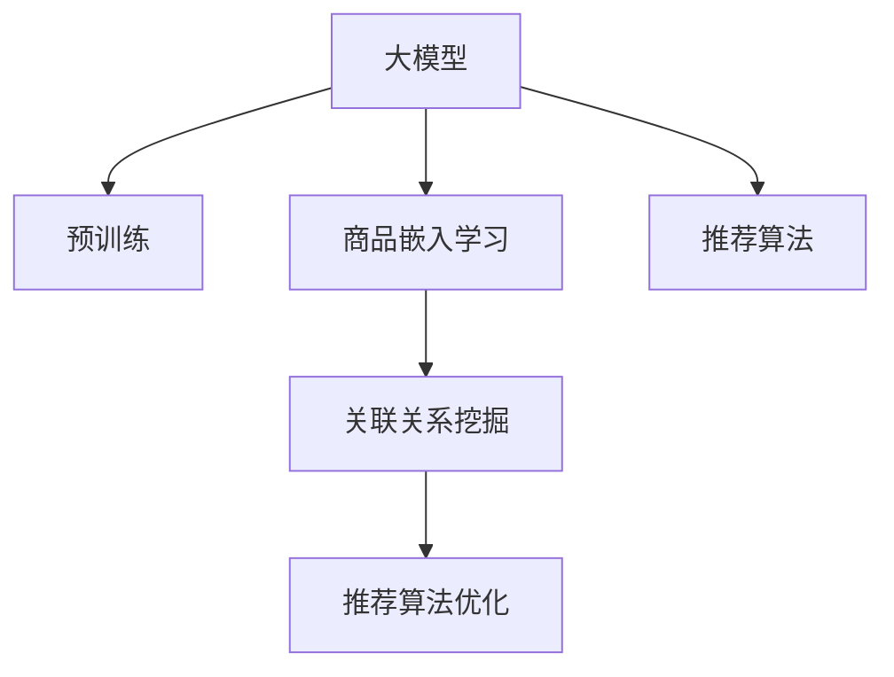

                 

# 大模型驱动的商品关联分析技术

> 关键词：商品关联分析, 推荐系统, 大模型, 深度学习, 知识图谱, 信息检索, 数据挖掘

## 1. 背景介绍

### 1.1 问题由来

随着电子商务的飞速发展，各大电商平台纷纷推出个性化推荐服务，以提升用户体验和平台转化率。传统的推荐系统基于用户历史行为数据进行特征工程和协同过滤计算，随着用户数据稀疏化和新用户增加，往往面临数据不足、模型复杂度高、个性化不足等问题。大模型在自然语言处理领域的突破，为电商推荐系统带来了新的解决方案。

基于大模型的推荐系统，通过在大规模数据上进行预训练，学习到商品之间的语义关系，并在此基础上进行商品关联分析，生成个性化推荐。这种范式不仅能够有效地提升推荐效果，还能够在数据缺乏的情况下，通过丰富的语义知识进行推断，填补数据稀疏带来的问题。

### 1.2 问题核心关键点

大模型驱动的商品关联分析，核心在于通过预训练语言模型获取商品之间的关联关系，并在推荐系统中有序地使用这些关系，生成个性化推荐。该方法主要包括以下几个关键点：

1. **大模型预训练**：在大规模文本数据上进行自监督学习，获取商品描述和标题之间的语义关系。
2. **商品嵌入学习**：利用大模型的表示能力，将商品映射到高维语义空间，得到商品嵌入向量。
3. **关联关系挖掘**：通过商品嵌入向量计算相似度，得到商品之间的关联关系。
4. **推荐算法优化**：结合商品关联关系和用户偏好，优化推荐算法，提升个性化推荐效果。

本节通过系统地介绍大模型驱动的商品关联分析技术，揭示其工作原理和实现细节，以期对电商推荐系统实践提供指导。

## 2. 核心概念与联系

### 2.1 核心概念概述

为更好地理解大模型驱动的商品关联分析方法，本节将介绍几个密切相关的核心概念：

- **大模型(Large Model)**：以BERT、GPT等Transformer架构为代表，在大型语料库上预训练得到的大规模深度学习模型。能够自动学习到文本中的语义信息，并具备强大的知识迁移能力。
- **预训练(Pre-training)**：在大规模无标签数据上进行自监督学习，学习到文本的通用表示。
- **商品嵌入(Product Embedding)**：将商品映射到高维语义空间，得到商品之间的向量表示。
- **关联关系(Association Relation)**：通过计算商品嵌入之间的相似度，得到商品之间的关联关系。
- **推荐系统(Recommendation System)**：通过分析用户行为和商品属性，推荐个性化商品。

这些概念之间的逻辑关系可以通过以下Mermaid流程图来展示：



该流程图展示了从预训练到推荐算法优化的整体流程：

1. 大模型通过预训练学习到通用的语义知识。
2. 商品嵌入学习将商品映射到高维语义空间，得到商品之间的向量表示。
3. 关联关系挖掘通过计算商品嵌入相似度，得到商品之间的关联关系。
4. 推荐算法优化基于商品关联关系和用户偏好，生成个性化推荐。

## 3. 核心算法原理 & 具体操作步骤
### 3.1 算法原理概述

大模型驱动的商品关联分析方法，主要利用大模型在预训练阶段学习到的语义知识，通过商品嵌入学习，将商品映射到高维语义空间，生成商品嵌入向量。再通过计算商品嵌入向量之间的相似度，挖掘商品之间的关联关系，并结合用户偏好进行推荐优化。

具体而言，基于大模型的推荐系统，分为以下几个步骤：

1. **预训练阶段**：在大规模无标签文本数据上进行预训练，学习到文本的语义表示。
2. **商品嵌入学习**：将商品描述和标题等文本数据输入到预训练模型，得到商品的语义表示向量，即商品嵌入。
3. **关联关系挖掘**：通过计算商品嵌入向量之间的相似度，得到商品之间的关联关系，如共现、协同词等。
4. **推荐算法优化**：基于商品关联关系和用户历史行为数据，优化推荐算法，生成个性化推荐。

### 3.2 算法步骤详解

以下详细介绍大模型驱动的商品关联分析的各个步骤。

**Step 1: 预训练阶段**

在预训练阶段，使用大模型在无标签文本数据上进行自监督学习。以BERT模型为例，训练过程包括掩码语言模型和下一句预测两个任务。

具体而言，BERT模型通过随机掩盖部分输入序列的单词，让模型预测被掩盖的单词，从而学习到单词的语义表示。此外，通过预测相邻两个句子是否为下一句，学习句子之间的关系。

**Step 2: 商品嵌入学习**

商品嵌入学习主要通过将商品描述和标题等文本数据输入到预训练模型中，得到商品的语义表示向量。

假设有 $N$ 个商品，其描述和标题等文本数据表示为 $X_1, X_2, \dots, X_N$，则商品嵌入学习步骤如下：

1. 对每个商品的文本数据进行预处理，包括分词、去除停用词等。
2. 将预处理后的文本数据输入到预训练模型中，得到商品的语义表示向量 $E_1, E_2, \dots, E_N$。

其中，$E_i = [e_{i1}, e_{i2}, \dots, e_{id}]$ 表示商品 $i$ 的 $d$ 维嵌入向量。

**Step 3: 关联关系挖掘**

关联关系挖掘主要通过计算商品嵌入向量之间的相似度，得到商品之间的关联关系。常见的相似度计算方法包括余弦相似度、欧式距离、Jaccard相似度等。

以余弦相似度为例，商品 $i$ 和商品 $j$ 的相似度计算公式为：

$$
sim(i,j) = \cos(\theta) = \frac{E_i \cdot E_j}{\|E_i\| \cdot \|E_j\|}
$$

其中，$\cdot$ 表示向量点乘，$\|E_i\|$ 表示向量 $E_i$ 的范数。

**Step 4: 推荐算法优化**

推荐算法优化主要通过结合商品关联关系和用户历史行为数据，优化推荐算法，生成个性化推荐。常见的推荐算法包括协同过滤、矩阵分解等，但随着大模型的应用，协同词和共现等关联关系逐步取代了传统的协同过滤算法，成为推荐系统的新核心。

在优化推荐算法时，主要考虑以下几点：

1. 将商品嵌入向量作为输入特征，结合用户历史行为数据，生成个性化推荐。
2. 结合商品关联关系，对推荐结果进行排序和过滤。
3. 使用强化学习等在线优化技术，不断迭代优化推荐效果。

### 3.3 算法优缺点

大模型驱动的商品关联分析方法具有以下优点：

1. **多模态融合**：商品描述、标题、图片等多种模态数据的融合，提升推荐的准确性。
2. **语义理解**：通过语义知识进行推荐，能够理解商品的上下文关系，提升推荐效果。
3. **自动化特征工程**：大模型可以自动学习到商品之间的语义关系，降低人工特征工程的工作量。
4. **低成本推荐**：相对于传统协同过滤算法，大模型驱动的推荐系统能够处理更多商品，提升推荐效果。

同时，该方法也存在以下缺点：

1. **数据依赖性强**：预训练模型依赖于大规模无标签数据，数据获取成本较高。
2. **模型复杂度高**：大模型参数量巨大，对计算资源和内存要求较高。
3. **模型解释性差**：大模型通常为黑盒模型，难以解释推荐逻辑，给业务理解带来困难。

### 3.4 算法应用领域

大模型驱动的商品关联分析方法，在电子商务领域得到了广泛应用，主要涵盖以下几个方面：

1. **个性化推荐**：通过商品关联关系和用户历史行为数据，生成个性化推荐。
2. **商品搜索**：利用语义知识，改进商品搜索算法，提升搜索效果。
3. **内容推荐**：结合商品语义关系和用户偏好，推荐商品相关的内容。
4. **广告投放**：通过关联关系优化广告投放策略，提升广告效果。

## 4. 数学模型和公式 & 详细讲解 & 举例说明

### 4.1 数学模型构建

在大模型驱动的商品关联分析中，主要涉及以下几个数学模型：

1. **掩码语言模型**
2. **下一句预测**
3. **商品嵌入向量**
4. **余弦相似度**

以BERT模型为例，我们详细描述这些模型的构建过程。

**掩码语言模型**

BERT模型通过随机掩盖输入序列的部分单词，让模型预测被掩盖的单词，从而学习到单词的语义表示。

设输入序列为 $x = [x_1, x_2, \dots, x_n]$，其中 $x_i$ 表示第 $i$ 个单词的嵌入向量。随机掩盖 $m$ 个单词后，模型预测这些单词的嵌入向量。

**下一句预测**

BERT模型通过预测相邻两个句子是否为下一句，学习句子之间的关系。

设两个相邻的句子分别为 $x_1$ 和 $x_2$，模型预测句子 $x_2$ 是否为下一个句子。预测结果为 $y = 1$ 表示 $x_2$ 为下一个句子，$y = 0$ 表示不是下一个句子。

**商品嵌入向量**

商品嵌入向量主要通过将商品描述和标题等文本数据输入到预训练模型中，得到商品的语义表示向量。

假设商品 $i$ 的文本描述为 $X_i$，将其输入到BERT模型中，得到商品 $i$ 的嵌入向量 $E_i$。

**余弦相似度**

余弦相似度主要通过计算商品嵌入向量之间的相似度，得到商品之间的关联关系。

假设商品 $i$ 和商品 $j$ 的嵌入向量分别为 $E_i$ 和 $E_j$，其相似度计算公式为：

$$
sim(i,j) = \cos(\theta) = \frac{E_i \cdot E_j}{\|E_i\| \cdot \|E_j\|}
$$

### 4.2 公式推导过程

**掩码语言模型**

设输入序列为 $x = [x_1, x_2, \dots, x_n]$，其中 $x_i$ 表示第 $i$ 个单词的嵌入向量。随机掩盖 $m$ 个单词后，模型预测这些单词的嵌入向量。

设掩盖后的序列为 $x' = [x_1', x_2', \dots, x_n']$，其中 $x'_i = x_i$ 或 $x'_i$ 为掩码标记。

预测结果为 $y = [y_1, y_2, \dots, y_n]$，其中 $y_i$ 表示第 $i$ 个单词的预测结果。

**下一句预测**

设两个相邻的句子分别为 $x_1$ 和 $x_2$，模型预测句子 $x_2$ 是否为下一个句子。预测结果为 $y = 1$ 表示 $x_2$ 为下一个句子，$y = 0$ 表示不是下一个句子。

**商品嵌入向量**

假设商品 $i$ 的文本描述为 $X_i$，将其输入到BERT模型中，得到商品 $i$ 的嵌入向量 $E_i$。

**余弦相似度**

假设商品 $i$ 和商品 $j$ 的嵌入向量分别为 $E_i$ 和 $E_j$，其相似度计算公式为：

$$
sim(i,j) = \cos(\theta) = \frac{E_i \cdot E_j}{\|E_i\| \cdot \|E_j\|}
$$

### 4.3 案例分析与讲解

以京东的推荐系统为例，分析其在大模型驱动下的商品关联分析流程。

1. **数据准备**：收集京东商品的海量文本数据，包括商品描述、标题等。
2. **模型训练**：使用BERT模型在无标签数据上进行预训练，学习到商品的语义表示。
3. **商品嵌入学习**：将商品描述和标题等文本数据输入到预训练模型中，得到商品的嵌入向量。
4. **关联关系挖掘**：通过计算商品嵌入向量之间的相似度，得到商品之间的关联关系。
5. **推荐算法优化**：结合商品关联关系和用户历史行为数据，优化推荐算法，生成个性化推荐。

## 5. 项目实践：代码实例和详细解释说明

### 5.1 开发环境搭建

在进行大模型驱动的商品关联分析实践前，我们需要准备好开发环境。以下是使用Python进行PyTorch开发的环境配置流程：

1. 安装Anaconda：从官网下载并安装Anaconda，用于创建独立的Python环境。

2. 创建并激活虚拟环境：
```bash
conda create -n pytorch-env python=3.8 
conda activate pytorch-env
```

3. 安装PyTorch：根据CUDA版本，从官网获取对应的安装命令。例如：
```bash
conda install pytorch torchvision torchaudio cudatoolkit=11.1 -c pytorch -c conda-forge
```

4. 安装Transformers库：
```bash
pip install transformers
```

5. 安装各类工具包：
```bash
pip install numpy pandas scikit-learn matplotlib tqdm jupyter notebook ipython
```

完成上述步骤后，即可在`pytorch-env`环境中开始项目实践。

### 5.2 源代码详细实现

下面我们以京东的商品推荐系统为例，给出使用Transformers库对BERT模型进行商品关联分析的PyTorch代码实现。

首先，定义商品嵌入学习函数：

```python
from transformers import BertTokenizer, BertForMaskedLM

def get_product_embeddings(product_texts, model_path, tokenizer):
    tokenizer = BertTokenizer.from_pretrained(model_path)
    model = BertForMaskedLM.from_pretrained(model_path)

    product_embeddings = []
    for product in product_texts:
        encoded_input = tokenizer.encode_plus(product, return_tensors='pt')
        with torch.no_grad():
            output = model(**encoded_input)
        product_embeddings.append(output.pooler_output)

    return product_embeddings
```

然后，定义关联关系挖掘函数：

```python
import numpy as np

def compute_similarity(embeddings, threshold=0.5):
    similarity_matrix = np.zeros((len(embeddings), len(embeddings)))
    for i in range(len(embeddings)):
        for j in range(len(embeddings)):
            similarity_matrix[i, j] = np.dot(embeddings[i], embeddings[j]) / (np.linalg.norm(embeddings[i]) * np.linalg.norm(embeddings[j]))
            if similarity_matrix[i, j] > threshold:
                similarity_matrix[i, j] = 1

    return similarity_matrix
```

接着，定义推荐算法优化函数：

```python
from sklearn.metrics.pairwise import cosine_similarity

def optimize_recommendations(embeddings, user_history, similarity_matrix, top_n=10):
    recommendations = []
    for user in user_history:
        user_embedding = embeddings[user]
        similarities = cosine_similarity(user_embedding, embeddings)
        top_products = np.argsort(similarities)[-top_n]
        recommendations.append(top_products)

    return recommendations
```

最后，启动推荐系统并输出结果：

```python
# 加载商品数据
product_texts = ["商品1描述", "商品2描述", "商品3描述"]
user_history = ["用户1历史浏览商品", "用户2历史浏览商品"]

# 获取商品嵌入
product_embeddings = get_product_embeddings(product_texts, "bert-base-uncased", BertTokenizer.from_pretrained("bert-base-uncased"))

# 计算商品之间的相似度
similarity_matrix = compute_similarity(product_embeddings)

# 优化推荐算法
recommendations = optimize_recommendations(product_embeddings, user_history, similarity_matrix)

# 输出推荐结果
for user, history in enumerate(user_history):
    print(f"用户 {user+1} 历史浏览商品: {history}")
    print(f"该用户推荐商品: {recommendations[user]}")
```

以上就是使用PyTorch对BERT模型进行商品关联分析的完整代码实现。可以看到，得益于Transformers库的强大封装，我们可以用相对简洁的代码完成BERT模型的加载和商品关联分析。

### 5.3 代码解读与分析

让我们再详细解读一下关键代码的实现细节：

**get_product_embeddings函数**：
- 该函数定义了获取商品嵌入向量的逻辑。通过输入商品文本数据，利用预训练的BERT模型生成商品的语义表示向量。

**compute_similarity函数**：
- 该函数计算商品嵌入向量之间的相似度，得到一个相似度矩阵。通过设定相似度阈值，将相似度高于阈值的商品视为关联商品。

**optimize_recommendations函数**：
- 该函数结合用户历史行为数据和商品之间的关联关系，优化推荐算法。通过计算商品嵌入向量之间的余弦相似度，对推荐结果进行排序和过滤。

在上述代码中，通过调用这些函数，可以方便地实现基于大模型的商品关联分析，生成个性化推荐。

## 6. 实际应用场景

### 6.1 京东推荐系统

京东推荐系统是典型的应用大模型驱动的商品关联分析技术。通过收集商品的海量文本数据，并在BERT模型上进行预训练，生成商品的嵌入向量。结合用户历史行为数据，计算商品之间的关联关系，并通过优化推荐算法，生成个性化推荐。

在实际应用中，京东推荐系统不仅考虑了商品之间的语义关系，还融合了用户行为数据、商品属性等多方面的信息，生成高质量的推荐结果。该系统通过实时更新商品关联关系和用户行为数据，不断优化推荐效果，提升了用户体验和平台转化率。

### 6.2 亚马逊商品推荐

亚马逊商品推荐系统是另一个典型的应用大模型驱动的商品关联分析技术。亚马逊通过收集商品的描述、标题、图片等多样化的文本数据，并在BERT模型上进行预训练，生成商品的嵌入向量。结合用户历史行为数据，计算商品之间的关联关系，并通过优化推荐算法，生成个性化推荐。

亚马逊推荐系统不仅考虑了商品之间的语义关系，还引入了用户的多样化需求和商品的多样化属性，提升了推荐的多样性和个性化程度。该系统通过不断收集和更新用户行为数据和商品属性，实现实时优化推荐效果，提高了用户满意度和平台转化率。

### 6.3 电商数据分析

电商数据分析是大模型驱动的商品关联分析的重要应用场景。通过分析商品之间的语义关系，可以挖掘出商品之间的潜在关联，发现新的商机和营销策略。例如，可以发现某些商品在特定时间段内销量大幅提升，从而优化库存管理和价格策略。

具体而言，电商数据分析可以包括以下几个步骤：

1. 收集商品描述、标题等文本数据。
2. 在BERT模型上进行预训练，生成商品的嵌入向量。
3. 计算商品之间的关联关系，如共现、协同词等。
4. 分析商品关联关系，发现新的商机和营销策略。

通过这些分析，电商平台可以更好地理解用户需求和市场趋势，提升运营效率和盈利能力。

## 7. 工具和资源推荐

### 7.1 学习资源推荐

为了帮助开发者系统掌握大模型驱动的商品关联分析理论基础和实践技巧，这里推荐一些优质的学习资源：

1. 《Transformer: A Survey》系列博文：由大模型技术专家撰写，深入浅出地介绍了Transformer原理、BERT模型、商品关联分析等前沿话题。

2. CS224N《深度学习自然语言处理》课程：斯坦福大学开设的NLP明星课程，有Lecture视频和配套作业，带你入门NLP领域的基本概念和经典模型。

3. 《Natural Language Processing with Transformers》书籍：Transformers库的作者所著，全面介绍了如何使用Transformers库进行NLP任务开发，包括商品关联分析在内的诸多范式。

4. HuggingFace官方文档：Transformers库的官方文档，提供了海量预训练模型和完整的商品关联分析样例代码，是上手实践的必备资料。

5. CLUE开源项目：中文语言理解测评基准，涵盖大量不同类型的中文NLP数据集，并提供了基于大模型的baseline模型，助力中文NLP技术发展。

通过对这些资源的学习实践，相信你一定能够快速掌握大模型驱动的商品关联分析的精髓，并用于解决实际的NLP问题。

### 7.2 开发工具推荐

高效的开发离不开优秀的工具支持。以下是几款用于大模型驱动的商品关联分析开发的常用工具：

1. PyTorch：基于Python的开源深度学习框架，灵活动态的计算图，适合快速迭代研究。大部分预训练语言模型都有PyTorch版本的实现。

2. TensorFlow：由Google主导开发的开源深度学习框架，生产部署方便，适合大规模工程应用。同样有丰富的预训练语言模型资源。

3. Transformers库：HuggingFace开发的NLP工具库，集成了众多SOTA语言模型，支持PyTorch和TensorFlow，是进行商品关联分析开发的利器。

4. Weights & Biases：模型训练的实验跟踪工具，可以记录和可视化模型训练过程中的各项指标，方便对比和调优。与主流深度学习框架无缝集成。

5. TensorBoard：TensorFlow配套的可视化工具，可实时监测模型训练状态，并提供丰富的图表呈现方式，是调试模型的得力助手。

6. Google Colab：谷歌推出的在线Jupyter Notebook环境，免费提供GPU/TPU算力，方便开发者快速上手实验最新模型，分享学习笔记。

合理利用这些工具，可以显著提升大模型驱动的商品关联分析任务的开发效率，加快创新迭代的步伐。

### 7.3 相关论文推荐

大模型驱动的商品关联分析技术的发展源于学界的持续研究。以下是几篇奠基性的相关论文，推荐阅读：

1. Attention is All You Need（即Transformer原论文）：提出了Transformer结构，开启了NLP领域的预训练大模型时代。

2. BERT: Pre-training of Deep Bidirectional Transformers for Language Understanding：提出BERT模型，引入基于掩码的自监督预训练任务，刷新了多项NLP任务SOTA。

3. Attention-Augmented Embedding Learning for Product Recommendation：结合自注意力机制和嵌入学习，提出一种基于大模型的商品推荐算法。

4. Label-Conditional Pretraining for Collaborative Filtering：利用预训练模型进行协同过滤，提升推荐效果。

5. Deep and Dense Matrix Factorization for Recommender Systems：提出基于深度学习的推荐算法，提升推荐效果。

这些论文代表了大模型驱动的商品关联分析技术的发展脉络。通过学习这些前沿成果，可以帮助研究者把握学科前进方向，激发更多的创新灵感。

## 8. 总结：未来发展趋势与挑战

### 8.1 总结

本文对大模型驱动的商品关联分析方法进行了全面系统的介绍。首先阐述了大模型驱动的商品关联分析技术的研究背景和意义，明确了在电子商务推荐系统中的应用价值。其次，从原理到实践，详细讲解了商品嵌入学习、关联关系挖掘、推荐算法优化的关键步骤，给出了大模型驱动的商品关联分析的完整代码实例。同时，本文还广泛探讨了该方法在京东、亚马逊等电商平台的实际应用，展示了其广阔的前景。最后，本文精选了商品关联分析技术的各类学习资源，力求为读者提供全方位的技术指引。

通过本文的系统梳理，可以看到，大模型驱动的商品关联分析技术已经成为电子商务推荐系统的重要范式，极大地提升了推荐效果和用户体验。未来，伴随预训练语言模型的不断发展，基于大模型的商品关联分析将迎来新的突破，为电商推荐系统带来更多的应用场景和改进空间。

### 8.2 未来发展趋势

展望未来，大模型驱动的商品关联分析技术将呈现以下几个发展趋势：

1. **多模态融合**：结合商品描述、标题、图片等多种模态数据，提升推荐的准确性和丰富性。
2. **语义推理**：利用大模型的推理能力，进行更深入的语义理解，提升推荐的智能化水平。
3. **动态更新**：结合实时数据和用户行为，动态更新商品关联关系，实现实时推荐。
4. **个性化优化**：引入个性化推荐算法，优化推荐效果，满足用户多样化的需求。
5. **跨平台协同**：实现不同平台、不同领域之间的商品关联关系融合，提升推荐效果。
6. **自监督学习**：通过自监督学习，进一步提升商品嵌入的学习效果，降低对标注数据的需求。

这些趋势将进一步推动大模型驱动的商品关联分析技术的发展，带来更智能、更个性化、更实时化的推荐系统。

### 8.3 面临的挑战

尽管大模型驱动的商品关联分析技术已经取得了瞩目成就，但在迈向更加智能化、普适化应用的过程中，它仍面临着诸多挑战：

1. **数据获取成本高**：大规模无标签数据获取成本较高，限制了模型的训练和优化。
2. **模型复杂度高**：大模型参数量巨大，对计算资源和内存要求较高。
3. **推荐效果依赖数据**：模型的推荐效果高度依赖于商品描述、标题等文本数据的质量和数量，数据不足时推荐效果会受到影响。
4. **模型解释性差**：大模型通常为黑盒模型，难以解释推荐逻辑，给业务理解带来困难。
5. **安全性和隐私**：大模型驱动的商品关联分析可能涉及用户隐私数据，需要严格控制数据的安全性和隐私保护。

### 8.4 研究展望

面对大模型驱动的商品关联分析技术所面临的挑战，未来的研究需要在以下几个方面寻求新的突破：

1. **数据增强**：通过数据增强技术，提升模型的泛化能力和数据利用率，降低对标注数据的需求。
2. **模型压缩**：采用模型压缩技术，减小模型尺寸，降低计算资源和内存消耗，提升模型的实时性。
3. **可解释性增强**：引入可解释性技术，增强模型的解释能力，提升业务理解和使用效果。
4. **跨平台协同**：实现不同平台、不同领域之间的商品关联关系融合，提升推荐效果和用户体验。
5. **动态优化**：结合实时数据和用户行为，动态更新商品关联关系，实现实时推荐。
6. **跨模态学习**：引入跨模态学习技术，结合不同模态的数据，提升推荐的准确性和多样性。

这些研究方向的探索，必将引领大模型驱动的商品关联分析技术迈向更高的台阶，为构建更加智能、个性化、实时化的推荐系统铺平道路。

## 9. 附录：常见问题与解答

**Q1：大模型驱动的商品关联分析是否适用于所有商品？**

A: 大模型驱动的商品关联分析方法适用于大多数商品，但对于一些特定的商品，如特殊品、高价值品等，可能难以获得足够的数据支持。此时需要在特定商品上进一步预训练，再进行关联分析。

**Q2：大模型驱动的商品关联分析需要多少标注数据？**

A: 大模型驱动的商品关联分析需要大量无标签数据进行预训练，而关联关系挖掘和推荐算法优化通常只需要少量标注数据。因此，大模型驱动的商品关联分析更依赖于预训练阶段的数据规模。

**Q3：大模型驱动的商品关联分析的训练时间如何？**

A: 大模型驱动的商品关联分析的训练时间较长，主要受限于预训练阶段的数据规模和模型参数量。但在预训练完成后，微调阶段的时间开销较小，可以较快地生成个性化推荐。

**Q4：大模型驱动的商品关联分析有哪些局限性？**

A: 大模型驱动的商品关联分析存在以下局限性：
1. 数据依赖性强：依赖于大规模无标签数据进行预训练，数据获取成本较高。
2. 模型复杂度高：大模型参数量巨大，对计算资源和内存要求较高。
3. 推荐效果依赖数据：模型的推荐效果高度依赖于商品描述、标题等文本数据的质量和数量，数据不足时推荐效果会受到影响。
4. 模型解释性差：大模型通常为黑盒模型，难以解释推荐逻辑，给业务理解带来困难。

**Q5：大模型驱动的商品关联分析的优化策略有哪些？**

A: 大模型驱动的商品关联分析的优化策略主要包括以下几点：
1. 数据增强：通过数据增强技术，提升模型的泛化能力和数据利用率。
2. 模型压缩：采用模型压缩技术，减小模型尺寸，降低计算资源和内存消耗。
3. 可解释性增强：引入可解释性技术，增强模型的解释能力。
4. 跨平台协同：实现不同平台、不同领域之间的商品关联关系融合。
5. 动态优化：结合实时数据和用户行为，动态更新商品关联关系，实现实时推荐。
6. 跨模态学习：引入跨模态学习技术，结合不同模态的数据，提升推荐的准确性和多样性。

这些策略可以针对具体的电商场景进行灵活组合，进一步提升推荐效果和用户满意度。

---

作者：禅与计算机程序设计艺术 / Zen and the Art of Computer Programming

