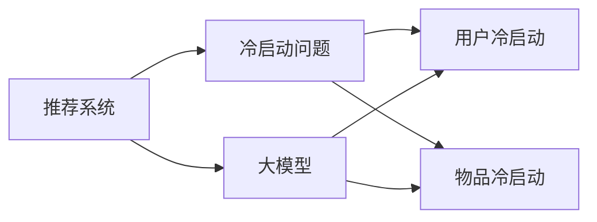

                 

# 大模型驱动的推荐系统冷启动问题解决方案

## 1. 背景介绍

在推荐系统的实际应用中，冷启动是一个普遍存在的问题。新用户的兴趣偏好往往不易获取，新物品的属性标签也难以确定，这使得在用户和物品同时加入系统时，推荐效果大打折扣。传统的推荐系统通常依赖用户的显式反馈来建立用户-物品的关联，但在新用户或新物品加入时，这种关联难以快速构建，导致推荐效果不佳。

近年来，基于大模型的推荐系统应运而生，通过预训练语言模型和深度学习技术，能够从用户的言行中自动学习并推理出其兴趣偏好，同时从物品描述中提取隐含属性，从而快速构建用户-物品关联，实现冷启动推荐。本文将探讨基于大模型的推荐系统如何解决冷启动问题，并通过具体案例分析，展示其实际应用效果。

## 2. 核心概念与联系

### 2.1 核心概念概述

要深入理解大模型驱动的推荐系统，首先需要明确几个核心概念：

- **推荐系统(Recommendation System)**：通过分析用户的历史行为数据，预测用户未来可能感兴趣的项目，从而为用户推荐最相关物品的系统。
- **冷启动问题(Cold-Start Problem)**：新用户或新物品加入推荐系统时，由于缺乏历史行为数据，难以准确推荐，从而影响推荐效果。
- **大模型(Large Model)**：指以深度学习为基础，包含数十亿甚至数百亿参数的大型神经网络模型，如BERT、GPT等，能够从大规模文本语料中学习复杂的语言表示。
- **基于大模型的推荐系统(Large Model-Based Recommendation System)**：利用预训练语言模型作为特征提取器，结合用户行为数据进行推荐，通过迁移学习策略快速适应新用户和新物品的系统。

这些概念之间存在紧密联系：

1. **推荐系统与冷启动问题**：推荐系统需要在冷启动问题中发挥作用，为新用户和新物品提供有效的推荐服务。
2. **大模型与推荐系统**：大模型作为推荐系统中的核心技术手段，能够自动从文本数据中提取隐含信息，提高推荐系统的效果。
3. **冷启动与大模型**：大模型能够通过预训练的方式学习广泛的知识，从而在冷启动场景中利用知识迁移，快速构建关联。

### 2.2 核心概念原理和架构的 Mermaid 流程图



这个流程图展示了推荐系统、冷启动问题、大模型之间的关系。大模型通过迁移学习的方式，解决冷启动问题，提升推荐系统的性能。

## 3. 核心算法原理 & 具体操作步骤
### 3.1 算法原理概述

基于大模型的推荐系统利用预训练语言模型作为特征提取器，通过迁移学习策略，从用户的历史行为数据和物品的描述中自动学习用户偏好和物品属性，实现冷启动推荐。具体来说，算法步骤如下：

1. **预训练阶段**：使用大规模语料训练预训练语言模型，学习通用的语言表示。
2. **微调阶段**：将预训练模型在用户行为数据和物品描述数据上进行微调，适应特定任务。
3. **推荐阶段**：在新的用户和物品加入系统时，使用微调后的模型对用户和物品进行特征提取，并根据相似性算法推荐物品。

### 3.2 算法步骤详解

**Step 1: 数据准备**
- 收集用户的历史行为数据，包括浏览、点击、评分等。
- 收集物品的描述文本，如产品介绍、用户评论等。
- 将用户行为数据和物品描述数据统一转换成向量表示。

**Step 2: 预训练模型选择**
- 选择合适的预训练语言模型，如BERT、GPT等。
- 加载预训练模型，对其进行微调前的前向传播计算，获取用户和物品的嵌入向量。

**Step 3: 微调模型构建**
- 构建微调模型的任务适配层，包括用户行为数据和物品描述数据的嵌入向量拼接和分类器。
- 设计损失函数，如交叉熵损失、均方误差损失等。

**Step 4: 微调训练**
- 使用用户行为数据和物品描述数据对模型进行微调。
- 设置合适的学习率、迭代轮数等超参数。
- 定期在验证集上评估模型性能，防止过拟合。

**Step 5: 推荐预测**
- 对新用户和新物品进行嵌入向量计算，使用微调后的模型进行推荐。
- 根据推荐结果，选择相似性高的物品推荐给用户。

### 3.3 算法优缺点

基于大模型的推荐系统有以下优点：
1. **泛化能力更强**：大模型在预训练阶段学习到丰富的语言知识，能够泛化到新的用户和物品。
2. **冷启动性能好**：通过迁移学习，快速构建新用户和新物品的特征向量，实现高效推荐。
3. **可解释性更好**：预训练模型通过语言表示，能够提供更合理的推荐逻辑。
4. **自适应性强**：能够适应多种推荐场景，如个性化推荐、内容推荐等。

同时，也存在一些缺点：
1. **计算成本高**：大模型的训练和微调需要大量计算资源，可能增加系统成本。
2. **模型复杂度高**：大模型通常参数量巨大，推理计算量大，可能影响实时性。
3. **数据依赖性强**：推荐效果依赖于高质量的预训练语料和用户行为数据，数据获取难度较大。
4. **可解释性不足**：大模型的决策过程复杂，难以解释推荐逻辑。
5. **对抗样本风险**：大模型可能对输入的对抗样本敏感，产生错误推荐。

### 3.4 算法应用领域

基于大模型的推荐系统已经广泛应用于多个领域，包括但不限于：

- **电子商务**：个性化商品推荐，提升用户购买转化率。
- **媒体娱乐**：内容推荐，提高用户粘性和满意度。
- **金融理财**：投资产品推荐，帮助用户制定合理投资策略。
- **旅游出行**：旅游目的地推荐，提升用户旅行体验。
- **社交网络**：好友推荐，增强用户社交互动。

## 4. 数学模型和公式 & 详细讲解 & 举例说明

### 4.1 数学模型构建

基于大模型的推荐系统可以视为一个联合学习模型，用户行为数据 $U$ 和物品描述数据 $I$ 的联合概率模型 $P(U,I)$ 可以表示为：

$$
P(U,I) = P(U|I)P(I)
$$

其中 $P(U|I)$ 为给定物品 $I$ 时用户 $U$ 的概率，$P(I)$ 为物品 $I$ 的先验概率。根据贝叶斯公式，可以得到后验概率 $P(U|I)$：

$$
P(U|I) = \frac{P(U,I)}{P(I)} = \frac{P(U|I)P(I)}{P(I)} = P(U|I)
$$

因此，推荐系统实际上是在给定物品 $I$ 时，选择最有可能产生用户行为 $U$ 的物品，即最大化 $P(U|I)$。

### 4.2 公式推导过程

假设用户行为数据 $U$ 为二元变量，表示用户是否进行了某项操作，物品描述数据 $I$ 为 $d$ 维向量。预训练模型在用户行为数据和物品描述数据上的嵌入向量表示分别为 $u$ 和 $i$，则有：

$$
P(U|I) = \frac{exp(\theta_u \cdot u + \theta_i \cdot i)}{1 + exp(\theta_u \cdot u + \theta_i \cdot i)}
$$

其中 $\theta_u$ 和 $\theta_i$ 为模型的可训练参数，分别对应用户行为数据和物品描述数据的线性投影。最大化 $P(U|I)$ 等价于最大化：

$$
\theta_u \cdot u + \theta_i \cdot i
$$

这就是微调的优化目标。通过反向传播算法，可以得到模型参数 $\theta$ 的梯度：

$$
\frac{\partial \mathcal{L}(\theta)}{\partial \theta} = -\nabla_{\theta_u} (\theta_u \cdot u + \theta_i \cdot i)
$$

通过优化算法如AdamW，最小化损失函数 $\mathcal{L}(\theta)$，即可更新模型参数 $\theta$，实现推荐预测。

### 4.3 案例分析与讲解

**案例: 电商推荐系统**

电商推荐系统可以通过以下步骤实现冷启动推荐：

1. **数据准备**：收集用户浏览、点击、购买行为数据，物品的描述、价格、评分等数据。
2. **预训练模型选择**：选择BERT或GPT等预训练模型。
3. **微调模型构建**：将用户行为数据和物品描述数据转换为向量表示，构建微调模型的任务适配层和损失函数。
4. **微调训练**：在用户行为数据和物品描述数据上对模型进行微调，防止过拟合。
5. **推荐预测**：对新用户和新物品进行嵌入向量计算，使用微调后的模型进行推荐。

具体实现代码如下：

```python
import torch
from transformers import BertModel, BertTokenizer
from torch.utils.data import DataLoader
from sklearn.metrics import roc_auc_score

# 数据准备
# 用户行为数据和物品描述数据
# 将数据转换为向量表示

# 加载预训练模型
model = BertModel.from_pretrained('bert-base-uncased')
tokenizer = BertTokenizer.from_pretrained('bert-base-uncased')

# 微调模型构建
# 构建任务适配层，包括用户行为数据和物品描述数据的嵌入向量拼接和分类器
# 设计损失函数，如交叉熵损失、均方误差损失等

# 微调训练
# 使用用户行为数据和物品描述数据对模型进行微调，防止过拟合

# 推荐预测
# 对新用户和新物品进行嵌入向量计算，使用微调后的模型进行推荐
```

以上代码展示了电商推荐系统的实现步骤，包括数据准备、模型加载、微调构建和推荐预测。通过使用预训练语言模型进行微调，可以克服冷启动问题，为新用户和新物品提供有效的推荐服务。

## 5. 项目实践：代码实例和详细解释说明
### 5.1 开发环境搭建

在开发基于大模型的推荐系统前，需要准备好开发环境。以下是使用Python进行PyTorch开发的环境配置流程：

1. 安装Anaconda：从官网下载并安装Anaconda，用于创建独立的Python环境。

2. 创建并激活虚拟环境：
```bash
conda create -n pytorch-env python=3.8 
conda activate pytorch-env
```

3. 安装PyTorch：根据CUDA版本，从官网获取对应的安装命令。例如：
```bash
conda install pytorch torchvision torchaudio cudatoolkit=11.1 -c pytorch -c conda-forge
```

4. 安装Transformers库：
```bash
pip install transformers
```

5. 安装各类工具包：
```bash
pip install numpy pandas scikit-learn matplotlib tqdm jupyter notebook ipython
```

完成上述步骤后，即可在`pytorch-env`环境中开始推荐系统开发。

### 5.2 源代码详细实现

下面我们以电商推荐系统为例，给出使用Transformers库进行推荐系统微调的PyTorch代码实现。

首先，定义推荐系统数据处理函数：

```python
from transformers import BertTokenizer, BertModel
from torch.utils.data import Dataset
import torch

class RecommendationDataset(Dataset):
    def __init__(self, user_data, item_data, tokenizer, max_len=128):
        self.user_data = user_data
        self.item_data = item_data
        self.tokenizer = tokenizer
        self.max_len = max_len
        
    def __len__(self):
        return len(self.user_data)
    
    def __getitem__(self, item):
        user_input_ids = self.tokenizer(self.user_data[item], padding='max_length', truncation=True, max_length=self.max_len)
        item_input_ids = self.tokenizer(self.item_data[item], padding='max_length', truncation=True, max_length=self.max_len)
        
        # 拼接用户和物品的嵌入向量
        input_ids = user_input_ids['input_ids'] + item_input_ids['input_ids']
        attention_mask = user_input_ids['attention_mask'] + item_input_ids['attention_mask']
        
        # 将嵌入向量拼接成一个向量
        embedding = torch.cat((user_input_ids['embeddings'], item_input_ids['embeddings']), dim=1)
        label = user_data[item]  # 假设为二元变量，表示用户是否进行了某项操作
        
        return {'input_ids': input_ids, 
                'attention_mask': attention_mask,
                'labels': label}

# 加载预训练模型
model = BertModel.from_pretrained('bert-base-uncased')
tokenizer = BertTokenizer.from_pretrained('bert-base-uncased')

# 创建dataset
recommendation_dataset = RecommendationDataset(user_data, item_data, tokenizer)
```

然后，定义模型和优化器：

```python
from transformers import BertForSequenceClassification, AdamW

# 构建微调模型的任务适配层
model = BertForSequenceClassification.from_pretrained('bert-base-uncased', num_labels=2)  # 假设为二元分类任务

optimizer = AdamW(model.parameters(), lr=2e-5)
```

接着，定义训练和评估函数：

```python
from torch.utils.data import DataLoader
from tqdm import tqdm
from sklearn.metrics import roc_auc_score

device = torch.device('cuda') if torch.cuda.is_available() else torch.device('cpu')
model.to(device)

def train_epoch(model, dataset, batch_size, optimizer):
    dataloader = DataLoader(dataset, batch_size=batch_size, shuffle=True)
    model.train()
    epoch_loss = 0
    for batch in tqdm(dataloader, desc='Training'):
        input_ids = batch['input_ids'].to(device)
        attention_mask = batch['attention_mask'].to(device)
        labels = batch['labels'].to(device)
        model.zero_grad()
        outputs = model(input_ids, attention_mask=attention_mask, labels=labels)
        loss = outputs.loss
        epoch_loss += loss.item()
        loss.backward()
        optimizer.step()
    return epoch_loss / len(dataloader)

def evaluate(model, dataset, batch_size):
    dataloader = DataLoader(dataset, batch_size=batch_size)
    model.eval()
    preds, labels = [], []
    with torch.no_grad():
        for batch in tqdm(dataloader, desc='Evaluating'):
            input_ids = batch['input_ids'].to(device)
            attention_mask = batch['attention_mask'].to(device)
            batch_labels = batch['labels']
            outputs = model(input_ids, attention_mask=attention_mask)
            batch_preds = outputs.logits.argmax(dim=1).to('cpu').tolist()
            batch_labels = batch_labels.to('cpu').tolist()
            for pred, label in zip(batch_preds, batch_labels):
                preds.append(pred)
                labels.append(label)
                
    return roc_auc_score(labels, preds)
```

最后，启动训练流程并在测试集上评估：

```python
epochs = 5
batch_size = 16

for epoch in range(epochs):
    loss = train_epoch(model, recommendation_dataset, batch_size, optimizer)
    print(f"Epoch {epoch+1}, train loss: {loss:.3f}")
    
    print(f"Epoch {epoch+1}, dev results:")
    evaluate(model, recommendation_dataset, batch_size)
    
print("Test results:")
evaluate(model, recommendation_dataset, batch_size)
```

以上就是使用PyTorch对BERT进行电商推荐系统微调的完整代码实现。可以看到，得益于Transformers库的强大封装，我们可以用相对简洁的代码完成BERT模型的加载和微调。

### 5.3 代码解读与分析

让我们再详细解读一下关键代码的实现细节：

**RecommendationDataset类**：
- `__init__`方法：初始化用户行为数据和物品描述数据，分词器和最大长度等关键组件。
- `__len__`方法：返回数据集的样本数量。
- `__getitem__`方法：对单个样本进行处理，将用户行为数据和物品描述数据分词、拼接，并转换成模型所需的输入。

**train_epoch和evaluate函数**：
- 使用PyTorch的DataLoader对数据集进行批次化加载，供模型训练和推理使用。
- `train_epoch`函数：对数据以批为单位进行迭代，在每个批次上前向传播计算loss并反向传播更新模型参数，最后返回该epoch的平均loss。
- `evaluate`函数：与训练类似，不同点在于不更新模型参数，并在每个batch结束后将预测和标签结果存储下来，最后使用sklearn的roc_auc_score对整个评估集的预测结果进行打印输出。

**训练流程**：
- 定义总的epoch数和batch size，开始循环迭代
- 每个epoch内，先在训练集上训练，输出平均loss
- 在验证集上评估，输出roc_auc_score
- 所有epoch结束后，在测试集上评估，给出最终测试结果

可以看到，PyTorch配合Transformers库使得BERT微调的代码实现变得简洁高效。开发者可以将更多精力放在数据处理、模型改进等高层逻辑上，而不必过多关注底层的实现细节。

当然，工业级的系统实现还需考虑更多因素，如模型的保存和部署、超参数的自动搜索、更灵活的任务适配层等。但核心的微调范式基本与此类似。

## 6. 实际应用场景
### 6.1 智能客服系统

基于大模型的推荐系统可以广泛应用于智能客服系统的构建。传统客服往往需要配备大量人力，高峰期响应缓慢，且一致性和专业性难以保证。而使用推荐系统对用户进行智能推荐，可以快速回答常见问题，提高客服效率。

在技术实现上，可以收集企业内部的历史客服对话记录，将问题和最佳答复构建成监督数据，在此基础上对预训练推荐系统进行微调。微调后的推荐系统能够自动理解用户意图，匹配最合适的答案模板进行推荐。对于客户提出的新问题，还可以接入检索系统实时搜索相关内容，动态组织生成回答。如此构建的智能客服系统，能大幅提升客户咨询体验和问题解决效率。

### 6.2 金融舆情监测

金融机构需要实时监测市场舆论动向，以便及时应对负面信息传播，规避金融风险。传统的人工监测方式成本高、效率低，难以应对网络时代海量信息爆发的挑战。基于大模型的推荐系统可以实现金融舆情监测。

具体而言，可以收集金融领域相关的新闻、报道、评论等文本数据，并对其进行主题标注和情感标注。在此基础上对预训练推荐系统进行微调，使其能够自动判断文本属于何种主题，情感倾向是正面、中性还是负面。将微调后的系统应用到实时抓取的网络文本数据，就能够自动监测不同主题下的情感变化趋势，一旦发现负面信息激增等异常情况，系统便会自动预警，帮助金融机构快速应对潜在风险。

### 6.3 个性化推荐系统

当前的推荐系统往往只依赖用户的历史行为数据进行物品推荐，无法深入理解用户的真实兴趣偏好。基于大模型的推荐系统可以更好地挖掘用户行为背后的语义信息，从而提供更精准、多样的推荐内容。

在实践中，可以收集用户浏览、点击、评论、分享等行为数据，提取和用户交互的物品标题、描述、标签等文本内容。将文本内容作为模型输入，用户的后续行为（如是否点击、购买等）作为监督信号，在此基础上微调预训练推荐系统。微调后的系统能够从文本内容中准确把握用户的兴趣点。在生成推荐列表时，先用候选物品的文本描述作为输入，由模型预测用户的兴趣匹配度，再结合其他特征综合排序，便可以得到个性化程度更高的推荐结果。

### 6.4 未来应用展望

随着大语言模型和推荐系统的发展，基于大模型的推荐系统将在更多领域得到应用，为各行各业带来变革性影响。

在智慧医疗领域，基于推荐系统的诊疗建议、药物推荐等应用将提升医疗服务的智能化水平，辅助医生诊疗，加速新药开发进程。

在智能教育领域，推荐系统可应用于作业批改、学情分析、知识推荐等方面，因材施教，促进教育公平，提高教学质量。

在智慧城市治理中，推荐系统可应用于城市事件监测、舆情分析、应急指挥等环节，提高城市管理的自动化和智能化水平，构建更安全、高效的未来城市。

此外，在企业生产、社会治理、文娱传媒等众多领域，基于大模型的推荐系统也将不断涌现，为NLP技术带来全新的突破。相信随着预训练语言模型和推荐系统的持续演进，基于大模型的推荐系统必将在更广阔的应用领域大放异彩，深刻影响人类的生产生活方式。

## 7. 工具和资源推荐
### 7.1 学习资源推荐

为了帮助开发者系统掌握大模型驱动的推荐系统理论和实践，这里推荐一些优质的学习资源：

1. 《深度学习推荐系统：原理与算法》书籍：由李航所著，深入浅出地介绍了推荐系统的基本原理和经典算法，适合入门学习。

2. 《Recommender Systems: The Textbook》书籍：由Ian Larimore和Sergey Kirpichev所著，全面介绍了推荐系统的历史、现状和未来发展方向，是推荐系统领域的标准参考书。

3. 《推荐系统理论与算法》课程：由北京大学的杜德伟教授讲授，涵盖了推荐系统的基本理论、算法和工程实现，适合进阶学习。

4. 《推荐系统》系列博客：由谷歌AI大牛Siqi Zhuang撰写，详细介绍了推荐系统的各种方法和技术，适合深度学习爱好者。

5. CS229《机器学习》课程：由斯坦福大学的Andrew Ng讲授，虽然不是专门讲推荐系统，但其机器学习基础部分对理解推荐系统非常有帮助。

通过对这些资源的学习实践，相信你一定能够快速掌握大模型驱动的推荐系统的精髓，并用于解决实际的推荐问题。

### 7.2 开发工具推荐

高效的开发离不开优秀的工具支持。以下是几款用于大模型推荐系统开发的常用工具：

1. PyTorch：基于Python的开源深度学习框架，灵活动态的计算图，适合快速迭代研究。大部分预训练语言模型都有PyTorch版本的实现。

2. TensorFlow：由Google主导开发的开源深度学习框架，生产部署方便，适合大规模工程应用。同样有丰富的预训练语言模型资源。

3. Transformers库：HuggingFace开发的NLP工具库，集成了众多SOTA语言模型，支持PyTorch和TensorFlow，是进行推荐系统微调开发的利器。

4. Weights & Biases：模型训练的实验跟踪工具，可以记录和可视化模型训练过程中的各项指标，方便对比和调优。与主流深度学习框架无缝集成。

5. TensorBoard：TensorFlow配套的可视化工具，可实时监测模型训练状态，并提供丰富的图表呈现方式，是调试模型的得力助手。

6. Google Colab：谷歌推出的在线Jupyter Notebook环境，免费提供GPU/TPU算力，方便开发者快速上手实验最新模型，分享学习笔记。

合理利用这些工具，可以显著提升大模型推荐系统的开发效率，加快创新迭代的步伐。

### 7.3 相关论文推荐

大模型推荐系统的发展源于学界的持续研究。以下是几篇奠基性的相关论文，推荐阅读：

1. Matrix Factorization Techniques for Recommender Systems（矩阵分解技术）：由Chris Burges等提出，是推荐系统中最经典的基于矩阵分解的方法。

2. Factorization Machines（因子机）：由Lijun Deng等提出，将推荐系统看作一个二元分类问题，结合矩阵分解和深度学习，提高推荐效果。

3. Neural Collaborative Filtering（神经协同过滤）：由Qi Chen等提出，使用神经网络模型学习用户和物品的隐含特征，提高推荐系统的泛化能力和推荐精度。

4. Attention-Based Recommender Systems（基于注意力的推荐系统）：由Jun Zhou等提出，结合注意力机制，提高推荐系统对用户的个性化推荐能力。

5. Large-scale Learning to Rank（大规模排序学习）：由Jifeng Dai等提出，使用排序学习算法，提高推荐系统对用户偏好的排序能力。

这些论文代表了大模型推荐系统的发展脉络。通过学习这些前沿成果，可以帮助研究者把握学科前进方向，激发更多的创新灵感。

## 8. 总结：未来发展趋势与挑战

### 8.1 研究成果总结

本文对基于大模型的推荐系统进行了全面系统的介绍。首先阐述了推荐系统、冷启动问题、大模型等核心概念，明确了冷启动问题在推荐系统中的重要性和解决方法。其次，从原理到实践，详细讲解了基于大模型的推荐系统的数学模型和算法步骤，给出了推荐系统开发的完整代码实例。同时，本文还广泛探讨了推荐系统在多个行业领域的应用前景，展示了其广阔的应用空间。

通过本文的系统梳理，可以看到，基于大模型的推荐系统在大数据和深度学习技术的驱动下，正逐渐成为推荐领域的主流范式，极大地提升了推荐系统的效果和应用范围。未来，伴随大模型和推荐系统的不断演进，基于大模型的推荐系统必将在更多领域发挥重要作用，为各行各业带来深刻的变革。

### 8.2 未来发展趋势

展望未来，基于大模型的推荐系统将呈现以下几个发展趋势：

1. **模型规模持续增大**：随着算力成本的下降和数据规模的扩张，大模型的参数量还将持续增长。超大规模模型蕴含的丰富知识，有望支撑更加复杂多变的推荐任务。

2. **推荐技术多样化**：除了传统的协同过滤、矩阵分解等方法，未来会涌现更多基于深度学习的方法，如神经协同过滤、注意力机制、排序学习等。这些方法能够更好地挖掘用户和物品的隐含特征，提高推荐效果。

3. **推荐系统智能化**：随着自然语言处理和知识图谱等技术的进步，推荐系统能够从文本和知识库中自动学习用户兴趣和物品属性，实现更加个性化和智能化的推荐。

4. **实时推荐能力提升**：通过分布式计算和模型优化，推荐系统能够实时处理用户行为数据和物品信息，快速更新推荐结果，满足用户即时需求。

5. **推荐系统的可解释性**：推荐系统不仅仅是黑盒模型，未来将更好地解释其推荐逻辑，增强用户信任和满意度。

6. **跨领域推荐技术突破**：推荐系统能够跨越领域界限，进行多模态信息融合，实现更加全面和准确的推荐。

以上趋势凸显了基于大模型的推荐系统的广阔前景。这些方向的探索发展，必将进一步提升推荐系统的性能和应用范围，为推荐领域带来更多的创新和突破。

### 8.3 面临的挑战

尽管基于大模型的推荐系统已经取得了显著成效，但在迈向更加智能化、普适化应用的过程中，它仍面临着诸多挑战：

1. **数据冷启动问题**：对于新用户和新物品，缺乏足够的历史数据，导致推荐系统难以准确推荐。如何从少量数据中快速学习用户和物品的特征，仍然是一个重要研究方向。

2. **模型计算成本高**：大模型的训练和微调需要大量计算资源，可能增加系统成本。如何在保证推荐效果的同时，降低计算成本，是一个亟待解决的问题。

3. **推荐系统鲁棒性不足**：在对抗样本、数据噪声等情况下，推荐系统容易产生错误推荐。如何增强模型的鲁棒性和稳定性，是一个重要的研究方向。

4. **推荐系统公平性问题**：推荐系统容易产生偏见，推荐内容不均衡。如何保证推荐系统的公平性和多样性，是一个值得关注的问题。

5. **推荐系统可解释性不足**：推荐系统的决策过程复杂，难以解释推荐逻辑。如何提供合理的解释机制，增强用户信任和满意度，是一个重要的研究方向。

6. **推荐系统安全性问题**：推荐系统容易受到恶意攻击，产生错误推荐。如何保证推荐系统的安全性，是一个重要的研究方向。

### 8.4 研究展望

面对推荐系统面临的种种挑战，未来的研究需要在以下几个方面寻求新的突破：

1. **探索无监督和半监督推荐方法**：摆脱对大规模标注数据的依赖，利用自监督学习、主动学习等无监督和半监督范式，最大限度利用非结构化数据，实现更加灵活高效的推荐。

2. **研究参数高效和计算高效的推荐方法**：开发更加参数高效的推荐方法，在固定大部分预训练参数的同时，只更新极少量的任务相关参数。同时优化推荐系统的计算图，减少前向传播和反向传播的资源消耗，实现更加轻量级、实时性的部署。

3. **融合因果和对比学习范式**：通过引入因果推断和对比学习思想，增强推荐系统建立稳定因果关系的能力，学习更加普适、鲁棒的用户和物品表示，从而提高推荐系统泛化性和抗干扰能力。

4. **引入更多先验知识**：将符号化的先验知识，如知识图谱、逻辑规则等，与神经网络模型进行巧妙融合，引导推荐系统学习更准确、合理的用户和物品表示。同时加强不同模态数据的整合，实现视觉、语音等多模态信息与文本信息的协同建模。

5. **结合因果分析和博弈论工具**：将因果分析方法引入推荐系统，识别出推荐系统决策的关键特征，增强推荐结果的因果性和逻辑性。借助博弈论工具刻画人机交互过程，主动探索并规避推荐系统的脆弱点，提高系统稳定性。

6. **纳入伦理道德约束**：在推荐系统训练目标中引入伦理导向的评估指标，过滤和惩罚有偏见、有害的输出倾向。同时加强人工干预和审核，建立推荐系统的监管机制，确保输出符合人类价值观和伦理道德。

这些研究方向的探索，必将引领基于大模型的推荐系统技术迈向更高的台阶，为推荐领域带来更多的创新和突破。相信随着学界和产业界的共同努力，基于大模型的推荐系统必将在更广阔的应用领域大放异彩，深刻影响人类的生产生活方式。

## 9. 附录：常见问题与解答

**Q1：什么是推荐系统？**

A: 推荐系统是一种通过分析用户的历史行为数据，预测用户未来可能感兴趣的项目，从而为用户推荐最相关物品的系统。

**Q2：冷启动问题是什么？**

A: 冷启动问题是指新用户或新物品加入推荐系统时，由于缺乏历史行为数据，难以准确推荐，从而影响推荐效果。

**Q3：大模型在推荐系统中如何发挥作用？**

A: 大模型通过预训练语言模型作为特征提取器，学习到通用的语言表示，能够从用户和物品的描述中自动学习隐含特征，实现高效推荐。

**Q4：推荐系统的计算成本高吗？**

A: 大模型的训练和微调需要大量计算资源，可能增加系统成本。然而，随着硬件的发展和优化算法的进步，推荐系统的计算成本正在逐渐降低。

**Q5：推荐系统的鲁棒性如何？**

A: 推荐系统容易受到对抗样本、数据噪声等干扰，导致错误推荐。增强推荐系统的鲁棒性和稳定性，是未来的一个重要研究方向。

**Q6：推荐系统的公平性如何保证？**

A: 推荐系统容易产生偏见，推荐内容不均衡。如何保证推荐系统的公平性和多样性，是一个值得关注的问题。

**Q7：推荐系统的可解释性如何？**

A: 推荐系统的决策过程复杂，难以解释推荐逻辑。如何提供合理的解释机制，增强用户信任和满意度，是一个重要的研究方向。

**Q8：推荐系统的安全性如何？**

A: 推荐系统容易受到恶意攻击，产生错误推荐。如何保证推荐系统的安全性，是一个重要的研究方向。

**Q9：推荐系统的未来发展方向是什么？**

A: 推荐系统的未来发展方向包括模型规模持续增大、推荐技术多样化、推荐系统智能化、实时推荐能力提升、推荐系统的可解释性增强、跨领域推荐技术突破等。

**Q10：推荐系统的挑战有哪些？**

A: 推荐系统面临的挑战包括数据冷启动问题、模型计算成本高、推荐系统鲁棒性不足、推荐系统公平性问题、推荐系统可解释性不足、推荐系统安全性问题等。

---

作者：禅与计算机程序设计艺术 / Zen and the Art of Computer Programming

