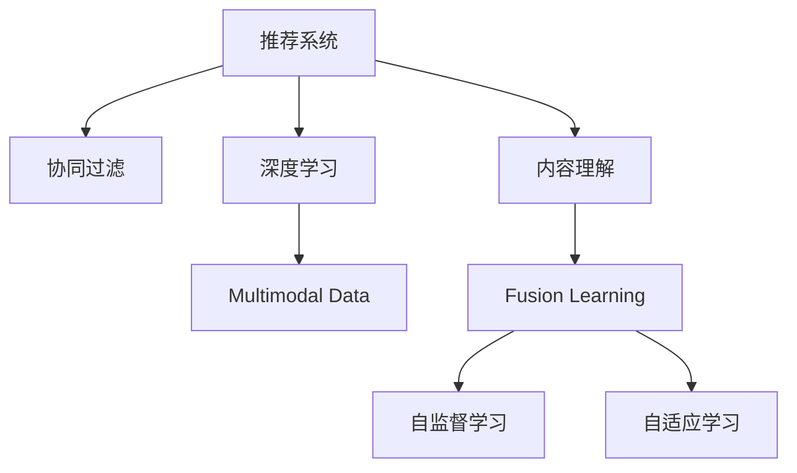

                 

# 大模型驱动的推荐系统多模态内容理解

> 关键词：推荐系统,多模态,内容理解,大模型,特征表示,协同过滤,深度学习,自然语言处理(NLP),计算机视觉(CV)

## 1. 背景介绍

### 1.1 问题由来

推荐系统(Recommendation Systems)作为互联网时代重要的信息过滤技术，已经被广泛应用于电商、社交、新闻、视频等多个垂直领域，极大地提升了用户体验和商业价值。然而，传统的推荐系统大多基于静态的用户行为数据，忽略了对用户兴趣的深入理解。如何从多维度数据中提取更全面、细腻的特征，提升推荐效果，成为当前研究的热点问题。

### 1.2 问题核心关键点

推荐系统的核心任务是使用用户行为数据，预测用户可能感兴趣的内容。传统的推荐方法主要包括基于协同过滤的矩阵分解算法和基于内容的特征提取算法。随着深度学习技术的发展，深度神经网络被引入到推荐系统，极大地提升了推荐的精度和多样性。然而，这些方法大多基于单模态数据，无法充分利用用户行为中的多维度信息，也无法整合多模态数据进行内容理解，因此在面对复杂多变的用户需求时，仍存在一定的局限性。

## 2. 核心概念与联系

### 2.1 核心概念概述

为更好地理解基于大模型推荐系统，本节将介绍几个密切相关的核心概念：

- 推荐系统(Recommendation Systems)：基于用户的历史行为数据，预测用户可能感兴趣的内容。

- 协同过滤(Collaborative Filtering)：利用用户行为数据对用户和物品进行相似度计算，推荐与用户兴趣相似的物品。

- 深度学习(Deep Learning)：通过多层神经网络结构，自动学习和提取数据特征，提升推荐效果。

- 多模态数据(Multimodal Data)：不同模态的原始数据，如文本、图像、音频等，可提供更丰富的用户信息。

- 大模型(Large Model)：如BERT、GPT等预训练语言模型，通过在大规模无标签数据上进行预训练，获得了丰富的语言和知识表示。

- 内容理解(Content Understanding)：通过多模态特征融合，理解用户兴趣和物品属性，实现推荐内容的个性化匹配。

- 融合学习(Ensemble Learning)：通过融合多个模型或模型的不同部分的输出，提高推荐的稳定性和泛化能力。

- 自监督学习(Self-Supervised Learning)：利用无标签数据，自动学习特征，减少对标注数据的依赖。

- 自适应学习(Adaptive Learning)：根据用户行为变化，动态调整模型参数，提升推荐效果。

这些核心概念之间的逻辑关系可以通过以下Mermaid流程图来展示：



这个流程图展示了大模型推荐系统的核心概念及其之间的关系：

1. 推荐系统通过协同过滤和深度学习获取用户和物品的相似性。
2. 利用多模态数据获取更全面的用户兴趣和物品属性信息。
3. 通过内容理解，将多模态数据进行特征融合，提升推荐准确性。
4. 融合学习通过融合多个模型，增强推荐稳定性和泛化能力。
5. 自监督学习和自适应学习进一步提升推荐模型的智能化水平。

这些概念共同构成了大模型推荐系统的学习和应用框架，使其能够充分利用用户的多维度信息，实现更加个性化和智能化的推荐。通过理解这些核心概念，我们可以更好地把握大模型推荐系统的优化方向。

## 3. 核心算法原理 & 具体操作步骤
### 3.1 算法原理概述

基于大模型的推荐系统多模态内容理解，本质上是一个多任务学习(Multitask Learning)的过程。其核心思想是：将大模型应用于推荐系统的各个任务中，通过多任务联合训练，学习多模态数据与用户兴趣之间的映射关系。

具体来说，假设用户历史行为数据包含多个模态的特征，如文本评论、图片描述、观看时间等。这些多模态数据分别由不同的模型处理，通过多任务联合训练，使得模型学习到每个模态对用户兴趣的不同影响，实现多模态特征的整合。

### 3.2 算法步骤详解

基于大模型的推荐系统多模态内容理解一般包括以下几个关键步骤：

**Step 1: 准备数据集**

- 收集用户行为数据，包括用户对物品的评分、浏览、购买等信息，并记录相应的时间戳。
- 对用户行为数据进行预处理，包括缺失值处理、数据归一化、特征工程等，以提高数据质量和模型训练效率。
- 将数据集分为训练集、验证集和测试集，划分比例一般为6:2:2。

**Step 2: 多模态特征提取**

- 对不同模态的数据分别进行特征提取，得到用户的多模态特征向量。如对文本评论使用BERT模型提取特征，对图片描述使用卷积神经网络提取特征。
- 对同一用户的多模态特征向量进行拼接或融合，得到该用户的多模态特征表示。

**Step 3: 大模型训练**

- 使用大模型进行多模态特征的联合训练，损失函数为多任务联合损失。
- 通过正则化技术防止模型过拟合，如L2正则、Dropout等。
- 设定合适的学习率和学习策略，如Adam、SGD等。

**Step 4: 模型微调**

- 对大模型进行微调，以适应特定推荐任务。如对评分预测任务进行微调，调整最后一层全连接层。
- 根据具体任务需求，设计合适的输出层和损失函数。
- 设定合适的学习率和学习策略，进行模型参数更新。

**Step 5: 评估与部署**

- 在测试集上评估微调后的推荐模型性能，对比微调前后的效果。
- 使用微调后的模型进行推荐，集成到实际的应用系统中。
- 持续收集用户反馈，定期重新微调模型，以适应数据分布的变化。

以上是基于大模型的推荐系统多模态内容理解的一般流程。在实际应用中，还需要针对具体任务的特点，对各个环节进行优化设计，如改进特征提取方法，引入更多的正则化技术，搜索最优的超参数组合等，以进一步提升模型性能。

### 3.3 算法优缺点

基于大模型的推荐系统多模态内容理解方法具有以下优点：

1. 能够充分利用多模态数据，获取更丰富的用户信息，提升推荐效果。
2. 利用大模型的通用知识，降低特征工程的复杂度，减少人工干预。
3. 能够适应不同的推荐任务，如评分预测、排序推荐、内容生成等。
4. 融合学习增强了模型的泛化能力和鲁棒性，减少了因单一任务泛化不佳导致的推荐失败。
5. 能够结合自监督学习、自适应学习等技术，进一步提升模型的智能化水平。

同时，该方法也存在一定的局限性：

1. 数据需求量大。需要大量多模态的用户行为数据，才能训练出高质量的模型。
2. 训练成本高。大模型和深度学习模型通常需要较高的计算资源和存储空间。
3. 模型复杂度高。多模态特征的融合和联合训练，增加了模型复杂度和训练难度。
4. 鲁棒性不足。多模态数据中可能存在噪声和缺失，影响模型性能。
5. 可解释性差。深度学习模型的黑盒特性，难以解释推荐过程和决策逻辑。

尽管存在这些局限性，但就目前而言，基于大模型的推荐系统多模态内容理解方法仍是大模型推荐应用的主流范式。未来相关研究的重点在于如何进一步降低训练成本，提高数据利用率，增强模型鲁棒性，同时兼顾可解释性和伦理安全性等因素。

### 3.4 算法应用领域

基于大模型的推荐系统多模态内容理解方法，在推荐系统领域已经得到了广泛的应用，覆盖了几乎所有常见的推荐任务，例如：

- 电商推荐：根据用户浏览和购买记录，推荐可能感兴趣的商品。通过联合训练模型，综合利用文本、图片、价格等多模态数据，实现更加个性化和精准的推荐。
- 新闻推荐：根据用户阅读和互动行为，推荐可能感兴趣的新闻文章。通过联合训练模型，结合新闻标题、摘要、作者等多模态信息，提升推荐相关性和时效性。
- 视频推荐：根据用户观看历史和评分，推荐可能感兴趣的视频内容。通过联合训练模型，结合视频标题、描述、时长等多模态数据，实现更加多样和高质量的视频推荐。
- 音乐推荐：根据用户听歌记录和评分，推荐可能感兴趣的歌曲。通过联合训练模型，结合歌曲标题、歌词、歌手等多模态数据，提升推荐的音乐多样性和贴合度。
- 游戏推荐：根据用户游戏行为数据，推荐可能感兴趣的游戏。通过联合训练模型，结合游戏任务、进度、评分等多模态数据，实现个性化和高效的游戏推荐。

除了上述这些经典任务外，基于多模态大模型的推荐方法也被创新性地应用到更多场景中，如可控推荐、推荐系统融合、推荐系统对抗攻击等，为推荐系统带来了全新的突破。随着大模型和联合训练方法的不断进步，相信推荐系统必将在更广阔的应用领域大放异彩。

## 4. 数学模型和公式 & 详细讲解
### 4.1 数学模型构建

本节将使用数学语言对基于大模型的推荐系统多模态内容理解过程进行更加严格的刻画。

记用户行为数据集为 $D=\{(x_i, y_i)\}_{i=1}^N$，其中 $x_i$ 为用户的行为数据，$y_i$ 为用户对物品的评分。假设大模型为 $M_{\theta}$，其中 $\theta$ 为模型参数。

定义用户的多模态特征表示为 $F(x_i)$，其中 $F(\cdot)$ 为特征提取函数，输入为 $x_i$，输出为多模态特征向量。设多模态特征表示的维度为 $d$，则用户的多模态特征表示可以表示为 $F(x_i)=(f_{1,i}, f_{2,i}, ..., f_{d,i})$。

在用户行为数据上，定义二分类任务 $T=\{(x_i, y_i)\}_{i=1}^N$，其中 $y_i$ 表示用户对物品的评分。假设存在 $K$ 个不同的推荐任务，记为 $T_k=\{(x_i, y_i)\}_{i=1}^N$，其中 $y_i$ 为特定推荐任务下的输出。

在多模态特征 $F(x_i)$ 上，定义多任务联合损失为：

$$
\mathcal{L}(\theta) = \sum_{k=1}^K \mathcal{L}_k(\theta)
$$

其中 $\mathcal{L}_k(\theta)$ 为特定推荐任务 $T_k$ 的损失函数。假设 $T_k$ 的任务类型为评分预测，则 $\mathcal{L}_k(\theta)$ 可以表示为：

$$
\mathcal{L}_k(\theta) = \frac{1}{N}\sum_{i=1}^N [y_i - M_{\theta}(f_{1,i})]^2
$$

在多模态特征 $F(x_i)$ 上，定义多任务联合损失函数为：

$$
\mathcal{L}(\theta) = \sum_{k=1}^K \frac{1}{N}\sum_{i=1}^N [y_i - M_{\theta}(f_{1,i})]^2
$$

### 4.2 公式推导过程

以下我们以评分预测任务为例，推导多任务联合损失函数及其梯度的计算公式。

假设用户的多模态特征表示为 $F(x_i)=(f_{1,i}, f_{2,i}, ..., f_{d,i})$，其中 $f_{1,i}$ 为文本特征，$f_{2,i}$ 为图片特征，$f_{3,i}$ 为价格特征等。假设大模型为BERT，将文本特征 $f_{1,i}$ 输入BERT模型，得到用户的多模态特征表示。

在用户行为数据上，定义评分预测任务 $T_k=\{(x_i, y_i)\}_{i=1}^N$，其中 $y_i$ 表示用户对物品的评分。在多模态特征 $F(x_i)$ 上，定义评分预测任务 $T_k$ 的损失函数为：

$$
\mathcal{L}_k(\theta) = \frac{1}{N}\sum_{i=1}^N [y_i - M_{\theta}(f_{1,i})]^2
$$

在多模态特征 $F(x_i)$ 上，定义多任务联合损失函数为：

$$
\mathcal{L}(\theta) = \sum_{k=1}^K \mathcal{L}_k(\theta)
$$

根据链式法则，损失函数对模型参数 $\theta$ 的梯度为：

$$
\frac{\partial \mathcal{L}(\theta)}{\partial \theta} = \sum_{k=1}^K \frac{\partial \mathcal{L}_k(\theta)}{\partial \theta}
$$

其中 $\frac{\partial \mathcal{L}_k(\theta)}{\partial \theta}$ 可以表示为：

$$
\frac{\partial \mathcal{L}_k(\theta)}{\partial \theta} = \frac{1}{N}\sum_{i=1}^N \frac{\partial M_{\theta}(f_{1,i})}{\partial \theta} \cdot \frac{\partial [y_i - M_{\theta}(f_{1,i})]}{\partial M_{\theta}(f_{1,i})}
$$

在得到损失函数的梯度后，即可带入模型参数更新公式，完成模型的迭代优化。重复上述过程直至收敛，最终得到适应多模态推荐任务的最优模型参数 $\theta^*$。

## 5. 项目实践：代码实例和详细解释说明
### 5.1 开发环境搭建

在进行推荐系统多模态内容理解实践前，我们需要准备好开发环境。以下是使用Python进行PyTorch开发的环境配置流程：

1. 安装Anaconda：从官网下载并安装Anaconda，用于创建独立的Python环境。

2. 创建并激活虚拟环境：
```bash
conda create -n pytorch-env python=3.8 
conda activate pytorch-env
```

3. 安装PyTorch：根据CUDA版本，从官网获取对应的安装命令。例如：
```bash
conda install pytorch torchvision torchaudio cudatoolkit=11.1 -c pytorch -c conda-forge
```

4. 安装Transformer库：
```bash
pip install transformers
```

5. 安装各类工具包：
```bash
pip install numpy pandas scikit-learn matplotlib tqdm jupyter notebook ipython
```

完成上述步骤后，即可在`pytorch-env`环境中开始推荐系统多模态内容理解实践。

### 5.2 源代码详细实现

下面我们以电商推荐任务为例，给出使用Transformers库对BERT模型进行多模态内容理解的PyTorch代码实现。

首先，定义推荐任务的数据处理函数：

```python
from transformers import BertTokenizer
from torch.utils.data import Dataset
import torch

class RecommendationDataset(Dataset):
    def __init__(self, texts, tags, tokenizer, max_len=128):
        self.texts = texts
        self.tags = tags
        self.tokenizer = tokenizer
        self.max_len = max_len
        
    def __len__(self):
        return len(self.texts)
    
    def __getitem__(self, item):
        text = self.texts[item]
        tags = self.tags[item]
        
        encoding = self.tokenizer(text, return_tensors='pt', max_length=self.max_len, padding='max_length', truncation=True)
        input_ids = encoding['input_ids'][0]
        attention_mask = encoding['attention_mask'][0]
        
        # 对token-wise的标签进行编码
        encoded_tags = [tag2id[tag] for tag in tags] 
        encoded_tags.extend([tag2id['O']] * (self.max_len - len(encoded_tags)))
        labels = torch.tensor(encoded_tags, dtype=torch.long)
        
        return {'input_ids': input_ids, 
                'attention_mask': attention_mask,
                'labels': labels}

# 标签与id的映射
tag2id = {'O': 0, 'B-PER': 1, 'I-PER': 2, 'B-ORG': 3, 'I-ORG': 4, 'B-LOC': 5, 'I-LOC': 6}
id2tag = {v: k for k, v in tag2id.items()}

# 创建dataset
tokenizer = BertTokenizer.from_pretrained('bert-base-cased')

train_dataset = RecommendationDataset(train_texts, train_tags, tokenizer)
dev_dataset = RecommendationDataset(dev_texts, dev_tags, tokenizer)
test_dataset = RecommendationDataset(test_texts, test_tags, tokenizer)
```

然后，定义模型和优化器：

```python
from transformers import BertForTokenClassification, AdamW

model = BertForTokenClassification.from_pretrained('bert-base-cased', num_labels=len(tag2id))

optimizer = AdamW(model.parameters(), lr=2e-5)
```

接着，定义训练和评估函数：

```python
from torch.utils.data import DataLoader
from tqdm import tqdm
from sklearn.metrics import classification_report

device = torch.device('cuda') if torch.cuda.is_available() else torch.device('cpu')
model.to(device)

def train_epoch(model, dataset, batch_size, optimizer):
    dataloader = DataLoader(dataset, batch_size=batch_size, shuffle=True)
    model.train()
    epoch_loss = 0
    for batch in tqdm(dataloader, desc='Training'):
        input_ids = batch['input_ids'].to(device)
        attention_mask = batch['attention_mask'].to(device)
        labels = batch['labels'].to(device)
        model.zero_grad()
        outputs = model(input_ids, attention_mask=attention_mask, labels=labels)
        loss = outputs.loss
        epoch_loss += loss.item()
        loss.backward()
        optimizer.step()
    return epoch_loss / len(dataloader)

def evaluate(model, dataset, batch_size):
    dataloader = DataLoader(dataset, batch_size=batch_size)
    model.eval()
    preds, labels = [], []
    with torch.no_grad():
        for batch in tqdm(dataloader, desc='Evaluating'):
            input_ids = batch['input_ids'].to(device)
            attention_mask = batch['attention_mask'].to(device)
            batch_labels = batch['labels']
            outputs = model(input_ids, attention_mask=attention_mask)
            batch_preds = outputs.logits.argmax(dim=2).to('cpu').tolist()
            batch_labels = batch_labels.to('cpu').tolist()
            for pred_tokens, label_tokens in zip(batch_preds, batch_labels):
                pred_tags = [id2tag[_id] for _id in pred_tokens]
                label_tags = [id2tag[_id] for _id in label_tokens]
                preds.append(pred_tags[:len(label_tokens)])
                labels.append(label_tags)
                
    print(classification_report(labels, preds))
```

最后，启动训练流程并在测试集上评估：

```python
epochs = 5
batch_size = 16

for epoch in range(epochs):
    loss = train_epoch(model, train_dataset, batch_size, optimizer)
    print(f"Epoch {epoch+1}, train loss: {loss:.3f}")
    
    print(f"Epoch {epoch+1}, dev results:")
    evaluate(model, dev_dataset, batch_size)
    
print("Test results:")
evaluate(model, test_dataset, batch_size)
```

以上就是使用PyTorch对BERT进行电商推荐任务多模态内容理解的完整代码实现。可以看到，得益于Transformers库的强大封装，我们可以用相对简洁的代码完成BERT模型的加载和微调。

### 5.3 代码解读与分析

让我们再详细解读一下关键代码的实现细节：

**RecommendationDataset类**：
- `__init__`方法：初始化文本、标签、分词器等关键组件。
- `__len__`方法：返回数据集的样本数量。
- `__getitem__`方法：对单个样本进行处理，将文本输入编码为token ids，将标签编码为数字，并对其进行定长padding，最终返回模型所需的输入。

**tag2id和id2tag字典**：
- 定义了标签与数字id之间的映射关系，用于将token-wise的预测结果解码回真实的标签。

**训练和评估函数**：
- 使用PyTorch的DataLoader对数据集进行批次化加载，供模型训练和推理使用。
- 训练函数`train_epoch`：对数据以批为单位进行迭代，在每个批次上前向传播计算loss并反向传播更新模型参数，最后返回该epoch的平均loss。
- 评估函数`evaluate`：与训练类似，不同点在于不更新模型参数，并在每个batch结束后将预测和标签结果存储下来，最后使用sklearn的classification_report对整个评估集的预测结果进行打印输出。

**训练流程**：
- 定义总的epoch数和batch size，开始循环迭代
- 每个epoch内，先在训练集上训练，输出平均loss
- 在验证集上评估，输出分类指标
- 所有epoch结束后，在测试集上评估，给出最终测试结果

可以看到，PyTorch配合Transformers库使得BERT微调的代码实现变得简洁高效。开发者可以将更多精力放在数据处理、模型改进等高层逻辑上，而不必过多关注底层的实现细节。

当然，工业级的系统实现还需考虑更多因素，如模型的保存和部署、超参数的自动搜索、更灵活的任务适配层等。但核心的多模态内容理解基本与此类似。

## 6. 实际应用场景
### 6.1 智能客服系统

基于大模型推荐系统的多模态内容理解，可以广泛应用于智能客服系统的构建。传统客服往往需要配备大量人力，高峰期响应缓慢，且一致性和专业性难以保证。而使用多模态推荐系统，可以自动理解用户意图，推荐最合适的客服策略，提升客户咨询体验和问题解决效率。

在技术实现上，可以收集企业内部的历史客服对话记录，将问题和最佳答复构建成监督数据，在此基础上对预训练推荐模型进行微调。微调后的推荐模型能够自动理解用户意图，匹配最合适的客服策略，同时接入检索系统实时搜索相关内容，动态组织生成回复。如此构建的智能客服系统，能大幅提升客户咨询体验和问题解决效率。

### 6.2 金融舆情监测

金融机构需要实时监测市场舆论动向，以便及时应对负面信息传播，规避金融风险。传统的人工监测方式成本高、效率低，难以应对网络时代海量信息爆发的挑战。基于大模型推荐系统的多模态内容理解技术，为金融舆情监测提供了新的解决方案。

具体而言，可以收集金融领域相关的新闻、报道、评论等文本数据，并对其进行主题标注和情感标注。在此基础上对预训练推荐模型进行微调，使其能够自动判断文本属于何种主题，情感倾向是正面、中性还是负面。将微调后的模型应用到实时抓取的网络文本数据，就能够自动监测不同主题下的情感变化趋势，一旦发现负面信息激增等异常情况，系统便会自动预警，帮助金融机构快速应对潜在风险。

### 6.3 个性化推荐系统

当前的推荐系统往往只依赖用户的历史行为数据进行物品推荐，无法深入理解用户的真实兴趣偏好。基于大模型推荐系统的多模态内容理解，可以更好地挖掘用户行为中的多维度信息，提升推荐效果。

在实践中，可以收集用户浏览、点击、评论、分享等行为数据，提取和用户交互的物品标题、描述、标签等文本内容。将文本内容作为模型输入，用户的后续行为（如是否点击、购买等）作为监督信号，在此基础上微调预训练语言模型。微调后的模型能够从文本内容中准确把握用户的兴趣点。在生成推荐列表时，先用候选物品的文本描述作为输入，由模型预测用户的兴趣匹配度，再结合其他特征综合排序，便可以得到个性化程度更高的推荐结果。

### 6.4 未来应用展望

随着大模型推荐系统多模态内容理解技术的不断发展，将在更多领域得到应用，为传统行业带来变革性影响。

在智慧医疗领域，基于多模态推荐系统的医疗问答、病历分析、药物研发等应用将提升医疗服务的智能化水平，辅助医生诊疗，加速新药开发进程。

在智能教育领域，多模态推荐系统可应用于作业批改、学情分析、知识推荐等方面，因材施教，促进教育公平，提高教学质量。

在智慧城市治理中，多模态推荐系统可应用于城市事件监测、舆情分析、应急指挥等环节，提高城市管理的自动化和智能化水平，构建更安全、高效的未来城市。

此外，在企业生产、社会治理、文娱传媒等众多领域，基于多模态推荐系统的智能推荐技术也将不断涌现，为经济社会发展注入新的动力。相信随着技术的日益成熟，多模态推荐系统必将在更广阔的应用领域大放异彩，深刻影响人类的生产生活方式。

## 7. 工具和资源推荐
### 7.1 学习资源推荐

为了帮助开发者系统掌握大模型推荐系统多模态内容理解的理论基础和实践技巧，这里推荐一些优质的学习资源：

1. 《Transformer from Principal to Practice》系列博文：由大模型技术专家撰写，深入浅出地介绍了Transformer原理、BERT模型、推荐系统范式等前沿话题。

2. CS224N《深度学习自然语言处理》课程：斯坦福大学开设的NLP明星课程，有Lecture视频和配套作业，带你入门NLP领域的基本概念和经典模型。

3. 《Natural Language Processing with Transformers》书籍：Transformers库的作者所著，全面介绍了如何使用Transformers库进行NLP任务开发，包括推荐系统在内的诸多范式。

4. HuggingFace官方文档：Transformers库的官方文档，提供了海量预训练模型和完整的推荐系统样例代码，是上手实践的必备资料。

5. Clue开源项目：中文语言理解测评基准，涵盖大量不同类型的中文NLP数据集，并提供了基于多模态推荐系统的baseline模型，助力中文NLP技术发展。

通过对这些资源的学习实践，相信你一定能够快速掌握大模型推荐系统多模态内容理解的精髓，并用于解决实际的NLP问题。
###  7.2 开发工具推荐

高效的开发离不开优秀的工具支持。以下是几款用于大模型推荐系统多模态内容理解开发的常用工具：

1. PyTorch：基于Python的开源深度学习框架，灵活动态的计算图，适合快速迭代研究。大部分预训练语言模型都有PyTorch版本的实现。

2. TensorFlow：由Google主导开发的开源深度学习框架，生产部署方便，适合大规模工程应用。同样有丰富的预训练语言模型资源。

3. Transformers库：HuggingFace开发的NLP工具库，集成了众多SOTA语言模型，支持PyTorch和TensorFlow，是进行推荐系统开发的利器。

4. Weights & Biases：模型训练的实验跟踪工具，可以记录和可视化模型训练过程中的各项指标，方便对比和调优。与主流深度学习框架无缝集成。

5. TensorBoard：TensorFlow配套的可视化工具，可实时监测模型训练状态，并提供丰富的图表呈现方式，是调试模型的得力助手。

6. Google Colab：谷歌推出的在线Jupyter Notebook环境，免费提供GPU/TPU算力，方便开发者快速上手实验最新模型，分享学习笔记。

合理利用这些工具，可以显著提升大模型推荐系统多模态内容理解任务的开发效率，加快创新迭代的步伐。

### 7.3 相关论文推荐

大模型推荐系统多模态内容理解的发展源于学界的持续研究。以下是几篇奠基性的相关论文，推荐阅读：

1. Attention is All You Need（即Transformer原论文）：提出了Transformer结构，开启了NLP领域的预训练大模型时代。

2. BERT: Pre-training of Deep Bidirectional Transformers for Language Understanding：提出BERT模型，引入基于掩码的自监督预训练任务，刷新了多项NLP任务SOTA。

3. Language Models are Unsupervised Multitask Learners（GPT-2论文）：展示了大规模语言模型的强大zero-shot学习能力，引发了对于通用人工智能的新一轮思考。

4. Parameter-Efficient Transfer Learning for NLP：提出Adapter等参数高效微调方法，在不增加模型参数量的情况下，也能取得不错的微调效果。

5. Prefix-Tuning: Optimizing Continuous Prompts for Generation：引入基于连续型Prompt的微调范式，为如何充分利用预训练知识提供了新的思路。

6. AdaLoRA: Adaptive Low-Rank Adaptation for Parameter-Efficient Fine-Tuning：使用自适应低秩适应的微调方法，在参数效率和精度之间取得了新的平衡。

这些论文代表了大模型推荐系统多模态内容理解的发展脉络。通过学习这些前沿成果，可以帮助研究者把握学科前进方向，激发更多的创新灵感。

## 8. 总结：未来发展趋势与挑战
### 8.1 总结

本文对基于大模型的推荐系统多模态内容理解方法进行了全面系统的介绍。首先阐述了推荐系统的发展背景和面临的挑战，明确了多模态内容理解在提升推荐效果中的重要作用。其次，从原理到实践，详细讲解了多模态内容理解模型构建、训练、微调等关键步骤，给出了多模态推荐系统开发的完整代码实例。同时，本文还广泛探讨了多模态内容理解方法在智能客服、金融舆情、个性化推荐等多个领域的应用前景，展示了多模态内容理解范式的巨大潜力。此外，本文精选了多模态内容理解技术的各类学习资源，力求为读者提供全方位的技术指引。

通过本文的系统梳理，可以看到，基于大模型的推荐系统多模态内容理解技术在推荐系统领域已经得到了广泛的应用，覆盖了几乎所有常见的推荐任务，如电商推荐、新闻推荐、视频推荐、音乐推荐等。得益于多模态特征的融合，推荐系统在精度、多样性和个性化方面取得了显著提升，为传统行业带来了深刻的变革。未来，伴随预训练语言模型和联合训练方法的不断进步，多模态推荐系统必将在更广阔的应用领域大放异彩，深刻影响人类的生产生活方式。

### 8.2 未来发展趋势

展望未来，多模态推荐系统将呈现以下几个发展趋势：

1. 模型规模持续增大。随着算力成本的下降和数据规模的扩张，预训练语言模型的参数量还将持续增长。超大规模语言模型蕴含的丰富语言知识，有望支撑更加复杂多变的推荐任务。

2. 多模态特征融合技术日趋多样化。除了传统的拼接和融合方法外，未来会涌现更多高效的特征融合技术，如跨模态注意力机制、联合嵌入等，提升多模态特征的表征能力。

3. 融合学习技术不断发展。除了简单的模型融合外，未来会涌现更多高效融合学习技术，如深度融合网络、联合优化等，提高推荐模型的泛化能力和鲁棒性。

4. 自监督学习、自适应学习等技术不断进步。这些技术将进一步提升推荐模型的智能化水平，减少对标注数据的依赖。

5. 推荐系统跨领域应用拓展。未来将有更多多模态推荐系统应用于跨领域的推荐场景，如医疗、法律、教育等，提升不同领域的推荐效果。

6. 推荐系统智能化水平提升。多模态推荐系统将结合知识图谱、逻辑规则等外部知识，实现更加全面、准确的内容理解，提升推荐系统的智能化水平。

以上趋势凸显了多模态推荐系统的广阔前景。这些方向的探索发展，必将进一步提升推荐系统的性能和应用范围，为经济社会发展注入新的动力。

### 8.3 面临的挑战

尽管多模态推荐系统已经取得了瞩目成就，但在迈向更加智能化、普适化应用的过程中，它仍面临诸多挑战：

1. 数据需求量大。需要大量多模态的用户行为数据，才能训练出高质量的模型，且多模态数据获取成本高、复杂度大。

2. 训练成本高。大模型和深度学习模型通常需要较高的计算资源和存储空间，且模型结构复杂，训练和推理效率低。

3. 模型鲁棒性不足。多模态数据中可能存在噪声和缺失，影响模型性能，且模型泛化能力有限，面对新样本或新任务表现不佳。

4. 可解释性差。深度学习模型的黑盒特性，难以解释推荐过程和决策逻辑，不利于系统部署和用户接受。

5. 伦理安全性问题。推荐系统面临的伦理安全性问题，如隐私泄露、信息偏见等，需要得到更多的关注和解决。

尽管存在这些挑战，但多模态推荐系统的发展潜力巨大，凭借其在多维度数据融合方面的优势，必将在推荐系统领域持续引领技术潮流。相信随着学界和产业界的共同努力，这些挑战终将一一被克服，多模态推荐系统必将在构建安全、可靠、可解释、可控的智能系统方面发挥更大的作用。

### 8.4 研究展望

面对多模态推荐系统所面临的种种挑战，未来的研究需要在以下几个方面寻求新的突破：

1. 探索高效多模态特征融合技术。进一步降低数据需求，提高模型训练效率。

2. 研究多模态联合训练技术。探索更高效的联合训练方法，提高推荐模型的泛化能力和鲁棒性。

3. 融合更多先验知识。将符号化的先验知识，如知识图谱、逻辑规则等，与神经网络模型进行巧妙融合，引导推荐模型学习更准确、合理的知识表示。

4. 引入因果分析和博弈论工具。将因果分析方法引入推荐模型，识别出模型决策的关键特征，增强输出解释的因果性和逻辑性。借助博弈论工具刻画人机交互过程，主动探索并规避模型的脆弱点，提高系统稳定性。

5. 结合深度强化学习。将深度强化学习引入推荐系统，优化推荐过程，提升推荐效果。

6. 纳入伦理道德约束。在推荐模型训练目标中引入伦理导向的评估指标，过滤和惩罚有偏见、有害的输出倾向，确保推荐系统符合用户价值观和伦理道德。

这些研究方向的探索，必将引领多模态推荐系统技术迈向更高的台阶，为构建安全、可靠、可解释、可控的智能推荐系统铺平道路。面向未来，多模态推荐系统需要与其他人工智能技术进行更深入的融合，如知识表示、因果推理、强化学习等，多路径协同发力，共同推动推荐系统技术的进步。只有勇于创新、敢于突破，才能不断拓展推荐系统的边界，让智能推荐技术更好地服务于人类社会。

## 9. 附录：常见问题与解答

**Q1：多模态推荐系统适用于所有推荐任务吗？**

A: 多模态推荐系统适用于大部分推荐任务，如电商推荐、新闻推荐、视频推荐、音乐推荐等。但对于一些需要高度定制化推荐内容的场景，如个性化搜索、个性化广告等，传统的推荐系统可能更适合。多模态推荐系统需要大量的多模态数据，因此对于小规模推荐任务，数据收集成本可能较高。

**Q2：多模态推荐系统如何降低数据需求？**

A: 多模态推荐系统可以结合自监督学习、半监督学习等技术，利用用户行为数据和模型自身的知识表示，降低对标注数据的依赖。例如，在电商推荐系统中，可以通过基于用户行为的无监督聚类方法，获取用户的兴趣标签，进一步训练推荐模型。

**Q3：多模态推荐系统如何提高模型鲁棒性？**

A: 多模态推荐系统可以结合对抗训练、多模型融合等技术，提高模型的鲁棒性。例如，在电商推荐系统中，可以结合基于对抗样本的对抗训练，提高模型对噪声和缺失数据的抗干扰能力。

**Q4：多模态推荐系统如何提升可解释性？**

A: 多模态推荐系统可以结合知识图谱、逻辑规则等外部知识，提升模型的可解释性。例如，在电商推荐系统中，可以结合知识图谱和逻辑规则，解释推荐结果背后的原因，增强用户对推荐结果的理解和信任。

**Q5：多模态推荐系统如何确保伦理安全性？**

A: 多模态推荐系统需要结合伦理道德约束，确保推荐结果的公正性和安全性。例如，在电商推荐系统中，可以引入公平性约束，避免对特定用户群体的偏见。同时，可以结合隐私保护技术，确保用户隐私数据的安全性。

通过这些方法，多模态推荐系统可以在保障推荐效果的同时，提升系统的可靠性和安全性，构建更加可信、透明的推荐系统。

---

作者：禅与计算机程序设计艺术 / Zen and the Art of Computer Programming

