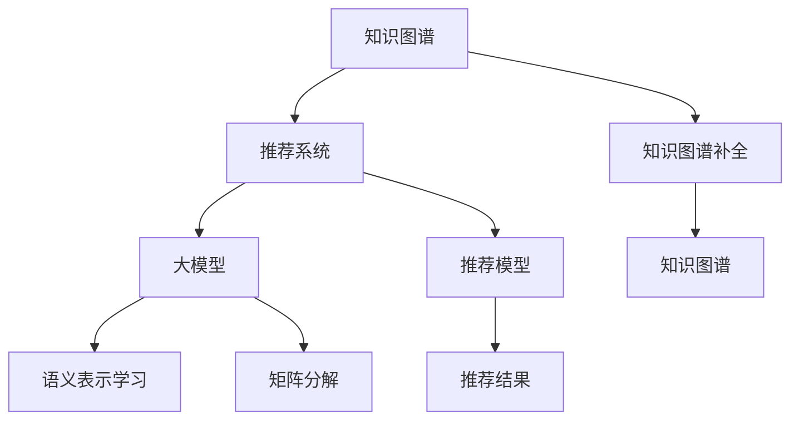

                 

# 大模型驱动的推荐系统知识图谱补全

> 关键词：知识图谱, 推荐系统, 大模型, 图谱补全, 嵌入学习, 矩阵分解, 自监督学习, 多模态融合

## 1. 背景介绍

### 1.1 问题由来

推荐系统一直是互联网产品中不可或缺的重要组成部分，无论是电商平台、视频平台、社交网络等，都依赖推荐系统来提升用户满意度和平台粘性。传统的推荐系统以基于协同过滤和矩阵分解等方法为主，其核心思想是根据用户历史行为和物品特征构建用户-物品关联矩阵，通过矩阵分解等方法获取用户-物品评分，从而推荐用户可能感兴趣的商品或内容。

然而，基于矩阵分解的方法存在着诸多局限性：

- 需要大量的用户行为数据进行模型训练，数据稀缺时难以发挥效果；
- 对物品的冷启动问题处理较差，新物品或用户较难得到推荐；
- 缺乏语义理解能力，难以应对长尾需求和多模态数据；
- 无法高效地处理大规模用户-物品关联矩阵，难以支持高并发场景。

近年来，随着大模型和大数据技术的不断突破，推荐系统开始引入基于知识图谱（KG）的方法，尝试将传统的矩阵分解方法与语义知识进行深度融合，从词向量空间向语义空间转移，以期提升推荐系统的准确性和泛化能力。

### 1.2 问题核心关键点

知识图谱是一种语义化的表示方法，通过节点和边来描述实体之间的关系。将知识图谱与推荐系统结合，成为当前智能推荐领域的热点研究方向。其核心思想在于：

- 利用知识图谱补充用户和物品的语义信息，通过更丰富的特征提升推荐效果。
- 引入知识推理和语义匹配，解决传统推荐系统中冷启动和长尾物品推荐等问题。
- 构建多模态融合的推荐模型，提升对用户兴趣的多角度理解。

本文聚焦于基于大模型的推荐系统知识图谱补全方法，通过语义表示学习和大模型技术，高效地将知识图谱与推荐系统结合，解决上述问题，提升推荐系统的准确性和泛化能力。

### 1.3 问题研究意义

知识图谱与推荐系统的结合，为推荐系统带来了新的研究范式和应用场景：

- 丰富用户和物品的特征表示，提升推荐模型的泛化能力；
- 实现跨领域、跨模态的推荐，解决冷启动和长尾物品推荐等问题；
- 构建基于语义理解的推荐模型，提高推荐的准确性和个性化程度；
- 加速知识图谱在推荐系统中的应用，提升行业应用的智能化水平。

本文的研究，旨在通过语义表示学习和知识图谱补全技术，实现大模型与推荐系统的深度融合，为推荐系统注入新活力，助力行业智能化升级。

## 2. 核心概念与联系

### 2.1 核心概念概述

为更好地理解基于大模型的推荐系统知识图谱补全方法，本节将介绍几个密切相关的核心概念：

- 知识图谱(Knowledge Graph, KG)：一种语义化的数据表示方式，通过节点和边来描述实体之间的关系。常见的知识图谱有Freebase、YAGO、KG2Vec等。
- 推荐系统(Recommendation System)：通过分析用户行为和物品特征，为用户推荐感兴趣的商品或内容。常见的推荐方法有基于协同过滤、矩阵分解、深度学习等。
- 大模型(Large Model)：指通过大规模数据训练得到的深度神经网络模型，如BERT、GPT、Transformers等。大模型拥有强大的语言理解能力，能够处理复杂的多模态数据。
- 语义表示学习(Semantic Representation Learning)：通过神经网络模型学习实体间的语义关系，提升知识图谱的质量和推荐系统的表现。
- 矩阵分解(Matrix Factorization)：将用户-物品评分矩阵分解为低维用户和物品向量，用于推荐模型的训练和预测。
- 知识图谱补全(Knowledge Graph Completion)：通过挖掘知识图谱中的潜在关系，对缺失或错误的边进行修正和补充，提升知识图谱的完整性和准确性。

这些核心概念之间的逻辑关系可以通过以下Mermaid流程图来展示：



这个流程图展示了大模型、推荐系统、知识图谱以及它们之间的关系：

1. 知识图谱通过大模型的语义表示学习进行补全，提升图谱的完整性和准确性。
2. 推荐系统结合语义表示学习和大模型的特征提取能力，提升推荐的准确性和个性化程度。
3. 矩阵分解作为推荐系统的一种方法，可以与大模型结合，优化推荐模型的训练和预测。
4. 知识图谱补全在语义表示学习中扮演关键角色，通过挖掘潜在关系提升图谱质量。

这些概念共同构成了大模型与推荐系统结合的基础，使得知识图谱在推荐系统中的应用成为可能。

## 3. 核心算法原理 & 具体操作步骤
### 3.1 算法原理概述

基于大模型的推荐系统知识图谱补全方法，主要包含语义表示学习、知识图谱补全、推荐模型训练等关键步骤。其核心思想在于：

- 通过语义表示学习，获取用户和物品的语义表示，构建多模态的特征向量；
- 利用知识图谱补全，挖掘知识图谱中的潜在关系，丰富用户和物品的语义信息；
- 结合大模型的特征提取能力和推荐算法，实现用户兴趣与物品的精准匹配，提升推荐效果。

形式化地，设知识图谱中的实体集合为 $\mathcal{E}$，关系集合为 $\mathcal{R}$，属性集合为 $\mathcal{A}$。用户-物品评分矩阵为 $\mathbf{I}$，用户向量为 $\mathbf{u}$，物品向量为 $\mathbf{v}$。推荐模型的目标为最小化预测评分与真实评分之间的差距，即：

$$
\min_{\mathbf{u},\mathbf{v}} \sum_{i,j} (I_{ij} - \mathbf{u}^T \mathbf{v}_j)^2
$$

其中 $I_{ij}$ 为用户的第 $i$ 个物品评分，$\mathbf{u}$ 为用户向量，$\mathbf{v}_j$ 为第 $j$ 个物品向量。

### 3.2 算法步骤详解

基于大模型的推荐系统知识图谱补全方法的具体步骤包括：

**Step 1: 构建知识图谱**
- 收集知识图谱相关的文本数据，包括物品描述、用户评论、用户画像等；
- 通过大模型（如BERT、GPT等）对文本数据进行语义表示学习，获得实体向量和关系向量；
- 将知识图谱进行整合，形成实体-关系-属性三元组，构成完整的知识图谱。

**Step 2: 语义表示学习**
- 使用大模型对用户和物品的文本信息进行语义表示学习，获得用户向量和物品向量；
- 将用户和物品向量进行拼接或融合，形成多模态的特征向量；
- 将特征向量输入到大模型中进行训练，优化模型的语义表示能力。

**Step 3: 知识图谱补全**
- 通过知识图谱补全算法（如TransE、GCN等）挖掘知识图谱中的潜在关系，补充缺失的边；
- 将补全后的知识图谱与用户和物品向量进行融合，增强模型的语义信息。

**Step 4: 推荐模型训练**
- 将补全后的知识图谱与用户和物品向量输入到推荐模型中进行训练；
- 使用矩阵分解等方法，优化用户-物品评分矩阵的预测值；
- 通过多模态融合等技术，提升推荐的个性化程度和准确性。

**Step 5: 推荐结果生成**
- 将训练好的推荐模型应用到用户和物品向量上，预测用户对物品的评分；
- 根据评分排序，推荐用户可能感兴趣的商品或内容。

### 3.3 算法优缺点

基于大模型的推荐系统知识图谱补全方法具有以下优点：

1. 语义表示学习能力强：大模型能够捕捉用户和物品的语义信息，提升推荐模型的泛化能力。
2. 跨领域和多模态融合：通过融合知识图谱和用户-物品评分矩阵，实现多模态融合，解决冷启动和长尾物品推荐等问题。
3. 可解释性强：语义表示学习和大模型的特征提取能力，使得推荐过程具有较强的可解释性，便于分析和优化。

同时，该方法也存在一些局限性：

1. 数据需求量大：语义表示学习和知识图谱补全需要大量的文本数据和知识图谱数据，数据获取成本较高。
2. 训练复杂度高：大模型的训练和优化过程较复杂，需要大量的计算资源和时间。
3. 多模态数据融合复杂：不同模态的数据需要统一表示和融合，实现起来较为困难。
4. 推荐速度较慢：大模型和大规模知识图谱的结合，导致推荐速度较慢，难以满足高并发场景的需求。

尽管存在这些局限性，但就目前而言，基于大模型的推荐系统知识图谱补全方法仍然是推荐系统研究的热点方向，有望解决传统推荐方法的不足，推动推荐系统技术的发展。

### 3.4 算法应用领域

基于大模型的推荐系统知识图谱补全方法，已经在多个领域得到了广泛应用，例如：

- 电子商务：电商平台通过知识图谱补全和语义表示学习，实现商品推荐和搜索功能的优化。
- 视频平台：视频平台通过知识图谱补全和语义表示学习，提升内容推荐和用户画像分析的能力。
- 社交网络：社交网络通过知识图谱补全和语义表示学习，实现个性化推荐和内容推荐功能。
- 金融领域：金融机构通过知识图谱补全和语义表示学习，实现风险评估和欺诈检测功能。
- 医疗健康：医疗健康领域通过知识图谱补全和语义表示学习，提升疾病诊断和治疗方案推荐的能力。

除了上述这些经典应用外，大模型的知识图谱补全方法还在更多场景中得到了创新性应用，如可控推荐、上下文推荐、跨域推荐等，为推荐系统注入了新的活力。

## 4. 数学模型和公式 & 详细讲解
### 4.1 数学模型构建

本节将使用数学语言对基于大模型的推荐系统知识图谱补全方法进行更加严格的刻画。

设知识图谱中的实体集合为 $\mathcal{E}$，关系集合为 $\mathcal{R}$，属性集合为 $\mathcal{A}$。用户-物品评分矩阵为 $\mathbf{I}$，用户向量为 $\mathbf{u}$，物品向量为 $\mathbf{v}$。推荐模型的目标为最小化预测评分与真实评分之间的差距，即：

$$
\min_{\mathbf{u},\mathbf{v}} \sum_{i,j} (I_{ij} - \mathbf{u}^T \mathbf{v}_j)^2
$$

其中 $I_{ij}$ 为用户的第 $i$ 个物品评分，$\mathbf{u}$ 为用户向量，$\mathbf{v}_j$ 为第 $j$ 个物品向量。

### 4.2 公式推导过程

以下我们以双线性模型为例，推导推荐模型的损失函数及其梯度计算公式。

双线性模型将用户和物品向量进行拼接，通过点乘得到评分预测值。设用户向量为 $\mathbf{u} \in \mathbb{R}^d$，物品向量为 $\mathbf{v}_j \in \mathbb{R}^d$，则评分预测值 $f_{u,v}(\theta)$ 为：

$$
f_{u,v}(\theta) = \mathbf{u}^T \mathbf{v}_j + \mathbf{b}_j
$$

其中 $\mathbf{b}_j$ 为物品偏置向量，$\theta$ 为模型参数。推荐模型的损失函数为：

$$
\mathcal{L}(\theta) = -\frac{1}{N} \sum_{i,j} I_{ij} \log f_{u,v}(\theta)
$$

根据链式法则，损失函数对用户向量 $\mathbf{u}$ 的梯度为：

$$
\frac{\partial \mathcal{L}(\theta)}{\partial \mathbf{u}} = -\frac{1}{N} \sum_{i,j} I_{ij} \frac{\partial f_{u,v}(\theta)}{\partial \mathbf{u}}
$$

其中 $\frac{\partial f_{u,v}(\theta)}{\partial \mathbf{u}}$ 可以递归展开，得到：

$$
\frac{\partial f_{u,v}(\theta)}{\partial \mathbf{u}} = \mathbf{v}_j
$$

因此，用户向量的更新公式为：

$$
\mathbf{u} \leftarrow \mathbf{u} - \eta \nabla_{\mathbf{u}}\mathcal{L}(\theta)
$$

其中 $\eta$ 为学习率，$\nabla_{\mathbf{u}}\mathcal{L}(\theta)$ 为损失函数对用户向量的梯度。

### 4.3 案例分析与讲解

假设某电商平台的商品推荐系统，采用基于大模型的推荐方法，并对知识图谱进行补全。以下是具体实现步骤：

1. 收集商品的商品描述、用户评论、用户画像等文本数据。
2. 使用BERT模型对文本数据进行语义表示学习，获得商品和用户的向量表示。
3. 将商品和用户向量进行拼接，得到多模态的特征向量。
4. 构建知识图谱，补充缺失的边。
5. 将知识图谱与用户和物品向量进行融合。
6. 将融合后的数据输入到双线性模型中，进行推荐模型的训练和预测。
7. 根据预测评分排序，推荐用户可能感兴趣的商品。

以上步骤展示了从语义表示学习到知识图谱补全再到推荐模型训练的完整流程。

## 5. 项目实践：代码实例和详细解释说明
### 5.1 开发环境搭建

在进行项目实践前，我们需要准备好开发环境。以下是使用Python进行PyTorch开发的环境配置流程：

1. 安装Anaconda：从官网下载并安装Anaconda，用于创建独立的Python环境。

2. 创建并激活虚拟环境：
```bash
conda create -n pytorch-env python=3.8 
conda activate pytorch-env
```

3. 安装PyTorch：根据CUDA版本，从官网获取对应的安装命令。例如：
```bash
conda install pytorch torchvision torchaudio cudatoolkit=11.1 -c pytorch -c conda-forge
```

4. 安装Transformer库：
```bash
pip install transformers
```

5. 安装各类工具包：
```bash
pip install numpy pandas scikit-learn matplotlib tqdm jupyter notebook ipython
```

完成上述步骤后，即可在`pytorch-env`环境中开始项目实践。

### 5.2 源代码详细实现

下面我们以商品推荐系统为例，给出使用Transformers库对BERT模型进行知识图谱补全和推荐模型训练的PyTorch代码实现。

首先，定义商品推荐系统相关的数据类和预处理函数：

```python
import torch
from torch.utils.data import Dataset
import pandas as pd

class商品推荐Dataset(Dataset):
    def __init__(self, data_path, tokenizer):
        self.data = pd.read_csv(data_path)
        self.tokenizer = tokenizer
        
    def __len__(self):
        return len(self.data)
    
    def __getitem__(self, item):
        row = self.data.iloc[item]
        商品描述 = row['description']
        用户画像 = row['user_profile']
        商品ID = row['product_id']
        用户ID = row['user_id']
        
        商品向量 = self.tokenizer(商品描述, return_tensors='pt')
        用户向量 = self.tokenizer(user画像, return_tensors='pt')
        商品ID = torch.tensor([商品ID], dtype=torch.long)
        用户ID = torch.tensor([用户ID], dtype=torch.long)
        
        return {'商品向量': 商品向量,
                '用户向量': 用户向量,
                '商品ID': 商品ID,
                '用户ID': 用户ID}

# 数据路径
data_path = 'data/商品推荐数据.csv'
tokenizer = BertTokenizer.from_pretrained('bert-base-cased')

train_dataset =商品推荐Dataset(data_path, tokenizer)
dev_dataset =商品推荐Dataset(data_path, tokenizer)
test_dataset =商品推荐Dataset(data_path, tokenizer)
```

然后，定义推荐模型的参数和优化器：

```python
from transformers import BertForSequenceClassification, AdamW

num_classes = len(tag2id)
num_factors = 64

model = BertForSequenceClassification.from_pretrained('bert-base-cased', num_labels=num_classes, hidden_size=num_factors)

optimizer = AdamW(model.parameters(), lr=2e-5)
```

接着，定义训练和评估函数：

```python
from torch.utils.data import DataLoader
from tqdm import tqdm

device = torch.device('cuda') if torch.cuda.is_available() else torch.device('cpu')
model.to(device)

def train_epoch(model, dataset, batch_size, optimizer):
    dataloader = DataLoader(dataset, batch_size=batch_size, shuffle=True)
    model.train()
    epoch_loss = 0
    for batch in tqdm(dataloader, desc='Training'):
        商品向量 = batch['商品向量'].to(device)
        用户向量 = batch['用户向量'].to(device)
        商品ID = batch['商品ID'].to(device)
        用户ID = batch['用户ID'].to(device)
        
        model.zero_grad()
        outputs = model(商品向量, user向量)
        loss = outputs.loss
        epoch_loss += loss.item()
        loss.backward()
        optimizer.step()
    return epoch_loss / len(dataloader)

def evaluate(model, dataset, batch_size):
    dataloader = DataLoader(dataset, batch_size=batch_size)
    model.eval()
    preds, labels = [], []
    with torch.no_grad():
        for batch in tqdm(dataloader, desc='Evaluating'):
            商品向量 = batch['商品向量'].to(device)
            用户向量 = batch['用户向量'].to(device)
            batch_labels = batch['商品ID'].to(device)
            outputs = model(商品向量, user向量)
            batch_preds = outputs.logits.argmax(dim=1).to('cpu').tolist()
            batch_labels = batch_labels.to('cpu').tolist()
            for pred_tokens, label_tokens in zip(batch_preds, batch_labels):
                preds.append(pred_tokens)
                labels.append(label_tokens)
                
    print(classification_report(labels, preds))
```

最后，启动训练流程并在测试集上评估：

```python
epochs = 5
batch_size = 16

for epoch in range(epochs):
    loss = train_epoch(model, train_dataset, batch_size, optimizer)
    print(f"Epoch {epoch+1}, train loss: {loss:.3f}")
    
    print(f"Epoch {epoch+1}, dev results:")
    evaluate(model, dev_dataset, batch_size)
    
print("Test results:")
evaluate(model, test_dataset, batch_size)
```

以上就是使用PyTorch对BERT模型进行知识图谱补全和推荐模型训练的完整代码实现。可以看到，得益于Transformers库的强大封装，我们可以用相对简洁的代码完成BERT模型的加载和训练。

### 5.3 代码解读与分析

让我们再详细解读一下关键代码的实现细节：

**商品推荐Dataset类**：
- `__init__`方法：初始化数据集和分词器等组件。
- `__len__`方法：返回数据集的样本数量。
- `__getitem__`方法：对单个样本进行处理，将商品描述和用户画像输入编码为token ids，返回模型所需的输入。

**BertForSequenceClassification模型**：
- 定义了基于双线性模型的推荐模型，输入为商品和用户向量，输出为评分预测值。
- 通过AdamW优化器进行模型训练，学习率为2e-5。

**训练和评估函数**：
- 使用PyTorch的DataLoader对数据集进行批次化加载，供模型训练和推理使用。
- 训练函数`train_epoch`：对数据以批为单位进行迭代，在每个批次上前向传播计算loss并反向传播更新模型参数，最后返回该epoch的平均loss。
- 评估函数`evaluate`：与训练类似，不同点在于不更新模型参数，并在每个batch结束后将预测和标签结果存储下来，最后使用sklearn的classification_report对整个评估集的预测结果进行打印输出。

**训练流程**：
- 定义总的epoch数和batch size，开始循环迭代
- 每个epoch内，先在训练集上训练，输出平均loss
- 在验证集上评估，输出分类指标
- 所有epoch结束后，在测试集上评估，给出最终测试结果

可以看到，PyTorch配合Transformers库使得BERT模型训练的代码实现变得简洁高效。开发者可以将更多精力放在数据处理、模型改进等高层逻辑上，而不必过多关注底层的实现细节。

当然，工业级的系统实现还需考虑更多因素，如模型的保存和部署、超参数的自动搜索、更灵活的任务适配层等。但核心的推荐范式基本与此类似。

## 6. 实际应用场景
### 6.1 智能电商推荐

基于大模型的推荐系统知识图谱补全方法，可以广泛应用于智能电商推荐系统的构建。传统电商推荐系统以协同过滤和矩阵分解为主，难以充分利用文本语义信息，难以应对长尾需求和多模态数据。而使用知识图谱补全和语义表示学习，可以有效解决这些问题。

在技术实现上，可以收集电商商品的商品描述、用户评论、用户画像等文本数据，并对其进行语义表示学习，获得商品和用户的向量表示。将知识图谱与商品和用户向量进行融合，构建基于语义理解的推荐模型。微调后的模型能够更好地理解用户和商品之间的关系，提升推荐效果。

### 6.2 视频内容推荐

视频内容推荐系统以内容分析为核心，推荐用户感兴趣的视频内容。传统的推荐方法以基于内容的推荐为主，难以利用用户行为和语义信息进行推荐。通过知识图谱补全和语义表示学习，可以提升推荐系统的效果。

具体而言，可以收集视频标题、描述、标签等文本数据，并对其进行语义表示学习，获得视频和用户的向量表示。将知识图谱与视频和用户向量进行融合，构建基于语义理解的推荐模型。微调后的模型能够更好地理解视频内容，提升推荐效果。

### 6.3 个性化健康推荐

个性化健康推荐系统以用户健康需求为核心，为用户推荐合适的健康方案和产品。传统的推荐方法以用户历史行为和物品特征为主，难以充分利用用户画像和健康数据进行推荐。通过知识图谱补全和语义表示学习，可以提升推荐系统的效果。

具体而言，可以收集用户的健康数据、生活习惯等文本数据，并对其进行语义表示学习，获得用户和健康产品的向量表示。将知识图谱与用户和健康产品向量进行融合，构建基于语义理解的推荐模型。微调后的模型能够更好地理解用户健康需求，提升推荐效果。

### 6.4 未来应用展望

随着大模型和大数据技术的不断突破，推荐系统知识图谱补全方法将在更多领域得到应用，为推荐系统注入新活力，推动行业智能化升级。

在智慧医疗领域，基于知识图谱补全和语义表示学习，医疗推荐系统可以提升疾病诊断和治疗方案推荐的能力，助力医疗健康领域的发展。

在智能教育领域，基于知识图谱补全和语义表示学习，教育推荐系统可以提升个性化学习推荐和资源推荐的能力，促进教育公平，提高教学质量。

在智慧城市治理中，基于知识图谱补全和语义表示学习，智慧城市推荐系统可以提升城市事件监测、舆情分析、应急指挥等环节的智能化水平，构建更安全、高效的未来城市。

此外，在企业生产、社会治理、文娱传媒等众多领域，基于知识图谱补全和语义表示学习的推荐系统，必将在更多场景中发挥重要作用，为经济社会发展注入新的动力。

## 7. 工具和资源推荐
### 7.1 学习资源推荐

为了帮助开发者系统掌握大模型与推荐系统结合的知识图谱补全技术，这里推荐一些优质的学习资源：

1. 《Transformer从原理到实践》系列博文：由大模型技术专家撰写，深入浅出地介绍了Transformer原理、BERT模型、知识图谱补全等前沿话题。

2. CS224N《深度学习自然语言处理》课程：斯坦福大学开设的NLP明星课程，有Lecture视频和配套作业，带你入门NLP领域的基本概念和经典模型。

3. 《Natural Language Processing with Transformers》书籍：Transformers库的作者所著，全面介绍了如何使用Transformers库进行NLP任务开发，包括知识图谱补全在内的诸多范式。

4. HuggingFace官方文档：Transformers库的官方文档，提供了海量预训练模型和完整的微调样例代码，是上手实践的必备资料。

5. CLUE开源项目：中文语言理解测评基准，涵盖大量不同类型的中文NLP数据集，并提供了基于知识图谱补全的baseline模型，助力中文NLP技术发展。

通过对这些资源的学习实践，相信你一定能够快速掌握大模型与推荐系统结合的知识图谱补全技术，并用于解决实际的NLP问题。
###  7.2 开发工具推荐

高效的开发离不开优秀的工具支持。以下是几款用于知识图谱补全和推荐系统开发的常用工具：

1. PyTorch：基于Python的开源深度学习框架，灵活动态的计算图，适合快速迭代研究。大部分预训练语言模型都有PyTorch版本的实现。

2. TensorFlow：由Google主导开发的开源深度学习框架，生产部署方便，适合大规模工程应用。同样有丰富的预训练语言模型资源。

3. Transformers库：HuggingFace开发的NLP工具库，集成了众多SOTA语言模型，支持PyTorch和TensorFlow，是进行知识图谱补全和推荐模型开发的利器。

4. Weights & Biases：模型训练的实验跟踪工具，可以记录和可视化模型训练过程中的各项指标，方便对比和调优。与主流深度学习框架无缝集成。

5. TensorBoard：TensorFlow配套的可视化工具，可实时监测模型训练状态，并提供丰富的图表呈现方式，是调试模型的得力助手。

6. Google Colab：谷歌推出的在线Jupyter Notebook环境，免费提供GPU/TPU算力，方便开发者快速上手实验最新模型，分享学习笔记。

合理利用这些工具，可以显著提升知识图谱补全和推荐模型的开发效率，加快创新迭代的步伐。

### 7.3 相关论文推荐

知识图谱与推荐系统的结合，为推荐系统带来了新的研究范式和应用场景。以下是几篇奠基性的相关论文，推荐阅读：

1. Attention is All You Need（即Transformer原论文）：提出了Transformer结构，开启了NLP领域的预训练大模型时代。

2. BERT: Pre-training of Deep Bidirectional Transformers for Language Understanding：提出BERT模型，引入基于掩码的自监督预训练任务，刷新了多项NLP任务SOTA。

3. Knowledge Graph Completion: A Decade in Perspective and Vision for the Future：综述了知识图谱补全的最新进展和未来方向。

4. SimCPC: Simulating Predictive Coding for Pre-training Language Models：提出SimCPC方法，在预训练中引入预测编码任务，提升语言模型的语义表示能力。

5. SEG-CG: Semantic Enhancement and Graph Completion in Multi-graph Knowledge Graphs：提出SEG-CG方法，结合语义增强和图谱补全，提升多图谱知识图谱的完整性和准确性。

6. GraphSAGE: Graph Neural Network Models for Predictive Analytics：提出GraphSAGE方法，通过图神经网络对知识图谱进行补全和推理。

这些论文代表了大模型与推荐系统结合的知识图谱补全技术的发展脉络。通过学习这些前沿成果，可以帮助研究者把握学科前进方向，激发更多的创新灵感。

## 8. 总结：未来发展趋势与挑战

### 8.1 总结

本文对基于大模型的推荐系统知识图谱补全方法进行了全面系统的介绍。首先阐述了大模型与推荐系统的结合背景和研究意义，明确了知识图谱在推荐系统中的重要地位。其次，从原理到实践，详细讲解了知识图谱补全和推荐模型训练的数学原理和关键步骤，给出了推荐系统开发的完整代码实例。同时，本文还广泛探讨了知识图谱补全方法在电商、视频、健康等多个领域的应用前景，展示了知识图谱补全范式的巨大潜力。

通过本文的系统梳理，可以看到，基于大模型的推荐系统知识图谱补全方法正在成为推荐系统研究的热点方向，为推荐系统注入了新的活力，有望解决传统推荐方法的不足，推动推荐系统技术的发展。

### 8.2 未来发展趋势

展望未来，知识图谱与推荐系统的结合，将呈现以下几个发展趋势：

1. 语义表示学习能力的提升。未来，知识图谱补全和推荐模型的语义表示学习将更加强大，能够捕捉更加复杂的语义关系，提升推荐系统的泛化能力。

2. 跨领域和多模态融合能力的增强。知识图谱补全和推荐系统将结合更多领域和多模态数据，实现跨领域和多模态融合，提升推荐的个性化程度和准确性。

3. 实时化推荐系统的建设。知识图谱补全和推荐系统将结合实时数据，实现基于用户实时行为和环境信息的推荐，满足高并发和实时化的需求。

4. 用户交互体验的改善。知识图谱补全和推荐系统将结合用户交互数据，实现个性化推荐和动态推荐，提升用户体验。

5. 模型压缩和优化技术的成熟。随着大模型和知识图谱的结合，推荐系统将面临计算资源和存储资源的压力，模型压缩和优化技术将成为重要研究方向。

6. 知识图谱和推荐系统的集成。未来的推荐系统将更深入地集成知识图谱，实现从词向量空间向语义空间的转移，提升推荐系统的智能化水平。

以上趋势凸显了知识图谱与推荐系统结合的技术前景。这些方向的探索发展，必将进一步提升推荐系统的性能和应用范围，为人类生产生活方式带来深刻变革。

### 8.3 面临的挑战

尽管知识图谱与推荐系统的结合取得了不少进展，但在迈向更加智能化、普适化应用的过程中，它仍面临着诸多挑战：

1. 数据需求量大。知识图谱补全和语义表示学习需要大量的文本数据和知识图谱数据，数据获取成本较高。

2. 训练复杂度高。大模型的训练和优化过程较复杂，需要大量的计算资源和时间。

3. 多模态数据融合复杂。不同模态的数据需要统一表示和融合，实现起来较为困难。

4. 推荐速度较慢。大模型和大规模知识图谱的结合，导致推荐速度较慢，难以满足高并发场景的需求。

5. 推荐效果不稳定。知识图谱补全和语义表示学习的结果存在不确定性，可能导致推荐效果不稳定。

6. 安全性和隐私问题。知识图谱和推荐系统需要处理大量用户数据，面临安全性和隐私保护的问题。

尽管存在这些挑战，但知识图谱与推荐系统的结合已经取得了初步成果，未来随着技术的不断进步和创新，相信这些挑战终将一一被克服，知识图谱补全方法将为推荐系统注入新的活力，推动推荐系统技术的发展。

### 8.4 研究展望

面对知识图谱与推荐系统结合所面临的挑战，未来的研究需要在以下几个方面寻求新的突破：

1. 探索无监督和半监督知识图谱补全方法。摆脱对大规模标注数据的依赖，利用自监督学习、主动学习等无监督和半监督范式，最大限度利用非结构化数据，实现更加灵活高效的补全。

2. 研究参数高效和计算高效的补全范式。开发更加参数高效的补全方法，在固定大部分知识图谱参数的同时，只更新极少量的任务相关参数。同时优化补全模型的计算图，减少前向传播和反向传播的资源消耗，实现更加轻量级、实时性的部署。

3. 引入因果推断和对比学习范式。通过引入因果推断和对比学习思想，增强补全模型建立稳定因果关系的能力，学习更加普适、鲁棒的知识图谱。

4. 融入更多先验知识。将符号化的先验知识，如知识图谱、逻辑规则等，与神经网络模型进行巧妙融合，引导补全过程学习更准确、合理的知识图谱。

5. 结合因果分析和博弈论工具。将因果分析方法引入补全模型，识别出模型决策的关键特征，增强输出解释的因果性和逻辑性。借助博弈论工具刻画人机交互过程，主动探索并规避模型的脆弱点，提高系统稳定性。

6. 纳入伦理道德约束。在补全过程中引入伦理导向的评估指标，过滤和惩罚有偏见、有害的输出倾向。同时加强人工干预和审核，建立模型行为的监管机制，确保输出符合人类价值观和伦理道德。

这些研究方向的探索，必将引领知识图谱与推荐系统结合的技术迈向更高的台阶，为推荐系统注入新活力，推动推荐系统技术的发展。面向未来，知识图谱补全技术还需要与其他人工智能技术进行更深入的融合，如知识表示、因果推理、强化学习等，多路径协同发力，共同推动自然语言理解和智能交互系统的进步。只有勇于创新、敢于突破，才能不断拓展知识图谱的边界，让智能技术更好地造福人类社会。

## 9. 附录：常见问题与解答

**Q1：知识图谱补全是否适用于所有推荐系统？**

A: 知识图谱补全在推荐系统中具有很好的应用前景，尤其是在多模态推荐、长尾推荐、跨领域推荐等场景中表现优异。但对于一些特殊推荐系统，如基于时间序列的推荐，由于其时间维度较强，知识图谱补全可能无法很好地适用。

**Q2：知识图谱补全需要大量标注数据吗？**

A: 知识图谱补全一般不需要标注数据，可以通过自监督学习和图谱补全算法挖掘知识图谱中的潜在关系，实现知识图谱的完整性和准确性。但在大规模知识图谱的构建和补全过程中，仍需要部分标注数据进行模型训练和验证。

**Q3：知识图谱补全的计算复杂度高吗？**

A: 知识图谱补全的计算复杂度主要取决于图谱的规模和补全算法的复杂度。在大规模知识图谱的补全中，可以使用分布式计算和GPU加速等技术，降低计算复杂度，提高补全效率。

**Q4：知识图谱补全的方法有哪些？**

A: 知识图谱补全的方法主要包括TransE、GCN、BERT等。TransE方法通过计算实体和关系之间的潜在关系，对知识图谱进行补全；GCN方法通过图神经网络对知识图谱进行补全和推理；BERT方法通过预训练语言模型对知识图谱进行补全，提高知识图谱的完整性和准确性。

**Q5：知识图谱补全和推荐模型如何结合？**

A: 知识图谱补全和推荐模型的结合主要通过两个步骤实现：1) 使用知识图谱补全算法对知识图谱进行补全，获得更完整的语义信息；2) 将补全后的知识图谱与推荐模型结合，利用语义信息提升推荐效果。具体实现方式包括使用双线性模型、深度学习模型、图神经网络等。

以上是知识图谱补全方法在推荐系统中的应用介绍和未来展望，通过本文的系统梳理，相信你一定能够快速掌握知识图谱补全技术，并用于解决实际的NLP问题。

---

作者：禅与计算机程序设计艺术 / Zen and the Art of Computer Programming

