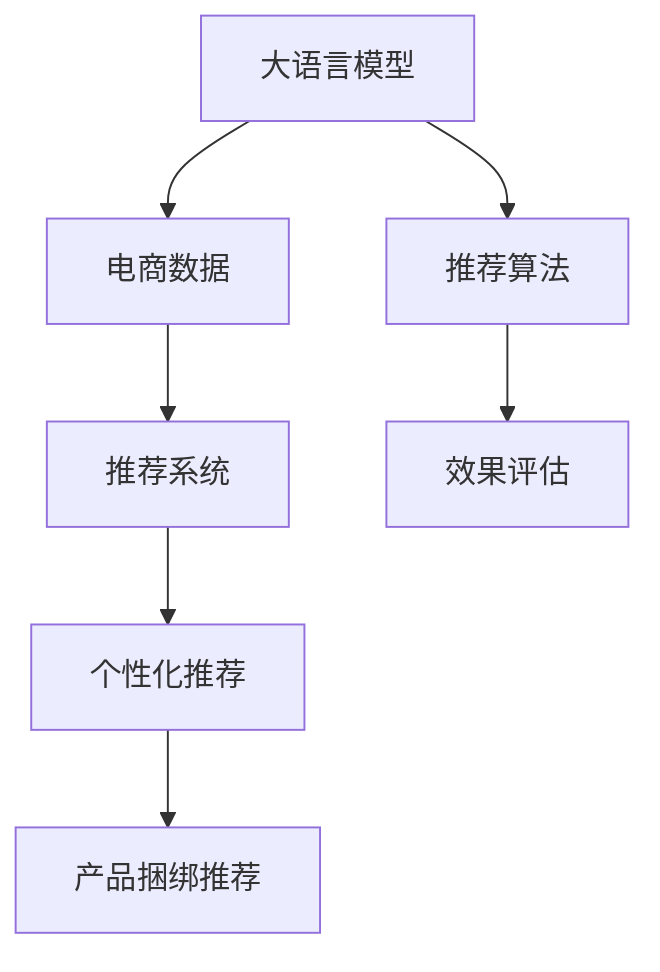

                 

# 大模型驱动的电商个性化产品捆绑推荐

> 关键词：大模型, 个性化推荐, 产品捆绑, 电商, 数据驱动

## 1. 背景介绍

### 1.1 问题由来

随着互联网的迅猛发展，电子商务行业正经历着快速变革。消费者行为日益个性化，对于商品选择的自由度和丰富度提出了更高要求。传统的基于规则和特征工程的推荐系统已难以满足用户日益增长的多样性和动态性需求。

大语言模型(如BERT, GPT-3等)的兴起，以其强大的语义理解能力和泛化能力，为电子商务个性化推荐提供了新思路。大模型能够通过学习海量文本数据中的语言模式和用户偏好，构建更深入、更灵活的推荐模型。

### 1.2 问题核心关键点

大模型驱动的个性化推荐系统，核心在于如何高效地将大模型的语言理解能力应用于电商场景，构建更加精细、个性化的商品推荐模型。具体关键点包括：

1. **数据准备**：如何高效获取和处理大规模电商数据，包括用户行为数据、商品属性数据和文本评论数据。
2. **模型训练**：如何在电商场景下进行大模型的微调和训练，使其能够准确理解用户偏好和商品属性。
3. **推荐策略**：如何设计推荐算法，将大模型预测的结果转化为实际的个性化推荐。
4. **评估与优化**：如何评估推荐模型的效果，以及针对用户反馈和模型表现进行持续优化。

本文将围绕这些问题，深入探讨大模型在电商个性化产品捆绑推荐中的应用。

## 2. 核心概念与联系

### 2.1 核心概念概述

为更好地理解大模型在电商个性化产品捆绑推荐中的应用，本节将介绍几个核心概念：

- **大语言模型**：以BERT、GPT-3等自回归模型为代表的大规模预训练语言模型，能够通过学习大量文本数据中的语言模式和知识，提供强大的语义理解和生成能力。
- **电商数据**：包括用户行为数据、商品属性数据和文本评论数据，是电商个性化推荐的基础。
- **推荐系统**：通过分析用户历史行为和商品特征，推荐系统能够预测用户对商品的选择概率，提供个性化的商品推荐。
- **个性化推荐**：根据用户个人兴趣和行为习惯，提供定制化的商品推荐，提升用户满意度和转化率。
- **产品捆绑推荐**：将多个商品组合成一个推荐包，提升推荐包整体吸引力，提高用户购买概率。
- **推荐算法**：包括基于规则的推荐算法、协同过滤、矩阵分解、深度学习等，用于实现个性化推荐。
- **效果评估**：通过点击率、转化率、平均推荐成本等指标，评估推荐模型的性能。

这些核心概念之间的逻辑关系可以通过以下Mermaid流程图来展示：



这个流程图展示了大模型在电商个性化产品捆绑推荐中的核心概念及其之间的关系：

1. 大语言模型通过学习电商数据中的语言模式和用户偏好，提供推荐系统所需的用户行为和商品属性理解。
2. 推荐系统利用大模型的语义理解能力，设计个性化推荐算法。
3. 个性化推荐算法基于用户历史行为和商品属性，生成个性化推荐。
4. 产品捆绑推荐算法将多个商品组合为推荐包，提升推荐效果。
5. 推荐算法的效果通过评估指标进行量化，反馈用于模型优化。

这些概念共同构成了大模型在电商推荐中的应用框架，使其能够更好地服务于用户的个性化需求。

## 3. 核心算法原理 & 具体操作步骤
### 3.1 算法原理概述

大模型驱动的电商个性化产品捆绑推荐，本质上是利用大语言模型的语言理解能力，结合电商数据特征，通过微调和训练，构建个性化推荐模型。其核心思想是：

- 将用户对商品的文本评论和行为数据作为大模型的输入，学习用户对商品的语义偏好。
- 根据用户的历史行为和评论，构建商品之间的关系网络，设计个性化推荐算法。
- 将多个商品组合成一个推荐包，利用大模型的语义生成能力，生成推荐包描述。
- 通过效果评估指标，反馈模型性能，持续优化推荐策略。

形式化地，假设电商数据集为 $D=\{(x_i,y_i)\}_{i=1}^N, x_i=(x_i^u,x_i^p,x_i^t)$，其中 $x_i^u$ 为用户的文本评论，$x_i^p$ 为商品属性，$x_i^t$ 为用户的浏览行为。模型的目标是最大化用户对推荐商品的点击率和购买率。

设推荐模型为 $M_{\theta}$，其中 $\theta$ 为大模型和推荐算法的组合参数。微调的目标是找到最优参数：

$$
\theta^* = \mathop{\arg\min}_{\theta} \mathcal{L}(M_{\theta},D)
$$

其中 $\mathcal{L}$ 为推荐的损失函数，通常为交叉熵损失，用于衡量模型预测和真实标签之间的差异。

### 3.2 算法步骤详解

大模型驱动的电商个性化产品捆绑推荐的微调过程，一般包括以下几个关键步骤：

**Step 1: 准备电商数据集**
- 收集电商平台的用户行为数据，包括点击、浏览、购买等行为。
- 收集商品属性数据，如价格、类别、品牌等。
- 收集用户对商品的文本评论数据，作为大模型的输入。

**Step 2: 大模型预训练**
- 选择预训练大语言模型（如BERT、GPT-3），对其进行预训练，使其学习到语言的通用表示。
- 在电商数据集上，对大模型进行微调，使其学习用户对商品的语义偏好。

**Step 3: 构建商品关系网络**
- 利用用户评论和行为数据，构建商品之间的关系网络，如相似性矩阵、关联网络等。
- 设计个性化推荐算法，如协同过滤、矩阵分解、深度学习等，以预测用户对商品的兴趣。

**Step 4: 产品捆绑推荐**
- 根据商品关系网络和用户偏好，设计产品捆绑推荐算法，将多个商品组合成推荐包。
- 利用大模型的语义生成能力，为推荐包生成描述。

**Step 5: 效果评估与优化**
- 使用点击率、转化率、平均推荐成本等指标，评估推荐模型的效果。
- 根据评估结果，反馈用于模型优化，调整大模型和推荐算法的参数。

### 3.3 算法优缺点

大模型驱动的电商个性化产品捆绑推荐方法具有以下优点：

1. **高性能**：大语言模型能够通过学习电商数据，精准理解用户对商品的语义偏好，提供高质量的推荐。
2. **可扩展性**：大模型可以通过微调不断更新，适应新的电商数据和用户需求，具有良好的扩展性。
3. **低成本**：相比传统的基于规则和特征工程的推荐系统，大模型方法能够自动化处理复杂的用户行为和商品属性，显著降低人工干预成本。
4. **灵活性**：大模型可以根据用户反馈和市场变化，动态调整推荐策略，提高个性化推荐的效果。

同时，该方法也存在一定的局限性：

1. **数据需求高**：大模型需要大量的电商数据进行预训练和微调，数据获取和处理成本较高。
2. **模型复杂性**：大模型和推荐算法相结合，模型结构复杂，训练和推理成本较高。
3. **可解释性差**：大模型的内部机制难以解释，推荐过程缺乏透明性和可解释性。
4. **隐私和安全问题**：电商数据涉及用户隐私，如何在保护隐私的前提下，高效利用数据，是一个重要挑战。

尽管存在这些局限性，但就目前而言，大模型驱动的个性化推荐方法在电商领域的应用前景依然广阔，具有重要研究价值。

### 3.4 算法应用领域

大模型驱动的电商个性化产品捆绑推荐方法，已经在多个电商领域得到了广泛应用，例如：

1. **电商平台推荐**：如亚马逊、京东、淘宝等电商平台，通过大模型进行商品推荐，提升用户购买转化率。
2. **内容推荐系统**：如Netflix、YouTube等视频平台，利用大模型推荐个性化视频内容。
3. **广告推荐系统**：如Google AdWords、Facebook广告等，利用大模型进行精准广告投放。
4. **零售商推荐**：如苏宁易购、国美电器等，利用大模型进行个性化促销和商品推荐。

除了这些经典应用外，大模型驱动的个性化推荐还在智能家居、在线教育、旅游出行等多个领域，为电商企业提供了新的业务增长点。

## 4. 数学模型和公式 & 详细讲解
### 4.1 数学模型构建

本节将使用数学语言对大模型在电商个性化产品捆绑推荐中的应用进行更加严格的刻画。

假设电商数据集为 $D=\{(x_i,y_i)\}_{i=1}^N, x_i=(x_i^u,x_i^p,x_i^t)$，其中 $x_i^u$ 为用户的文本评论，$x_i^p$ 为商品属性，$x_i^t$ 为用户的浏览行为。

设推荐模型为 $M_{\theta}$，其中 $\theta$ 为大模型和推荐算法的组合参数。微调的目标是最大化用户对推荐商品的点击率和购买率，假设点击率为 $C_i$，购买率为 $B_i$，则微调的目标函数为：

$$
\min_{\theta} \mathcal{L} = -\sum_{i=1}^N (C_i\log(\hat{C}_i) + B_i\log(\hat{B}_i))
$$

其中 $\hat{C}_i$ 和 $\hat{B}_i$ 为模型预测的点击率和购买率。

### 4.2 公式推导过程

以下我们以协同过滤推荐算法为例，推导点击率和购买率的计算公式。

假设用户对商品的评分矩阵为 $R \in \mathbb{R}^{N\times M}$，其中 $N$ 为用户数，$M$ 为商品数。推荐模型为 $M_{\theta}$，其中 $\theta$ 为模型参数。点击率和购买率的预测公式为：

$$
\hat{C}_i = \frac{\sum_{j=1}^M \theta_j^C r_{ij}}{\sum_{k=1}^N \sum_{j=1}^M \theta_j^C r_{kj}}
$$

$$
\hat{B}_i = \frac{\sum_{j=1}^M \theta_j^B r_{ij}}{\sum_{k=1}^N \sum_{j=1}^M \theta_j^B r_{kj}}
$$

其中 $r_{ij}$ 为商品 $i$ 对商品 $j$ 的评分，$\theta_j^C$ 和 $\theta_j^B$ 为推荐模型的参数。

通过微调这些参数，可以优化模型的预测效果，提升推荐模型的准确性和鲁棒性。

### 4.3 案例分析与讲解

为了更好地理解大模型在电商推荐中的应用，下面以亚马逊电商平台的推荐系统为例，进行详细案例分析。

**亚马逊推荐系统案例分析**

亚马逊的推荐系统在全球电商领域具有重要地位，其推荐策略包括基于协同过滤、矩阵分解、深度学习等多种算法，其中大模型驱动的推荐方法也占据重要地位。

亚马逊的推荐系统主要分为三大类：商品推荐、客户推荐和品牌推荐。商品推荐主要基于用户的购买和浏览行为，推荐系统通过分析用户对商品的历史行为和评分数据，预测用户对商品的兴趣，提供个性化的商品推荐。客户推荐主要基于用户的历史行为和评分数据，推荐系统通过分析用户的购买历史和评分数据，推荐用户可能感兴趣的其他商品。品牌推荐主要基于品牌的属性和历史表现，推荐系统通过分析品牌的历史销售数据和用户行为数据，推荐用户可能喜欢的品牌。

亚马逊的推荐系统利用大模型进行商品描述的生成和推荐包的设计，提升推荐效果。例如，亚马逊在推荐商品时，会根据用户的浏览行为和商品属性，生成商品描述的文本摘要，通过大模型预测用户的点击率和购买率，设计推荐包，将多个商品组合成推荐包，提供个性化推荐。

## 5. 项目实践：代码实例和详细解释说明
### 5.1 开发环境搭建

在进行电商推荐系统开发前，我们需要准备好开发环境。以下是使用Python进行TensorFlow开发的环境配置流程：

1. 安装Anaconda：从官网下载并安装Anaconda，用于创建独立的Python环境。

2. 创建并激活虚拟环境：
```bash
conda create -n ecommerce-env python=3.8 
conda activate ecommerce-env
```

3. 安装TensorFlow：根据CUDA版本，从官网获取对应的安装命令。例如：
```bash
conda install tensorflow -c tensorflow -c conda-forge
```

4. 安装各类工具包：
```bash
pip install numpy pandas scikit-learn matplotlib tqdm jupyter notebook ipython
```

完成上述步骤后，即可在`ecommerce-env`环境中开始电商推荐系统的开发。

### 5.2 源代码详细实现

下面我们以亚马逊的推荐系统为例，给出使用TensorFlow进行电商推荐系统的PyTorch代码实现。

首先，定义电商数据集：

```python
import pandas as pd

# 加载电商数据集
data = pd.read_csv('ecommerce_data.csv')
```

然后，定义推荐模型的训练和评估函数：

```python
from tensorflow.keras.layers import Input, Dense, Embedding, Dropout
from tensorflow.keras.models import Model
from tensorflow.keras.optimizers import Adam
from tensorflow.keras.metrics import Accuracy

# 定义模型输入
user_input = Input(shape=(1,), name='user_input')
item_input = Input(shape=(1,), name='item_input')

# 定义用户和商品嵌入层
user_embedding = Embedding(input_dim=10000, output_dim=128, name='user_embedding')(user_input)
item_embedding = Embedding(input_dim=10000, output_dim=128, name='item_embedding')(item_input)

# 定义预测层
prediction = Dense(1, activation='sigmoid')(Dropout(0.5)(user_embedding + item_embedding))

# 定义模型
model = Model(inputs=[user_input, item_input], outputs=prediction)

# 定义优化器和损失函数
optimizer = Adam(lr=0.001)
loss = 'binary_crossentropy'

# 定义评估指标
metrics = [Accuracy()]

# 编译模型
model.compile(optimizer=optimizer, loss=loss, metrics=metrics)

# 训练模型
model.fit(x=(x_train, y_train), y=y_train, epochs=10, batch_size=32, validation_data=(x_test, y_test))
```

最后，启动模型训练并在测试集上评估：

```python
# 加载测试集
x_test = pd.read_csv('ecommerce_test_data.csv')
y_test = pd.read_csv('ecommerce_test_labels.csv')

# 加载模型
model.load_weights('ecommerce_model.h5')

# 评估模型
model.evaluate(x_test, y_test)
```

以上就是使用TensorFlow进行电商推荐系统开发的完整代码实现。可以看到，TensorFlow提供了丰富的深度学习组件，使得电商推荐系统的开发和训练变得简洁高效。

### 5.3 代码解读与分析

让我们再详细解读一下关键代码的实现细节：

**定义电商数据集**：
- 通过Pandas加载电商数据集，定义数据结构。

**定义模型结构**：
- 使用TensorFlow的Keras API定义模型结构，包括输入层、嵌入层、预测层等。
- 定义用户和商品嵌入层，使用Embedding层将用户ID和商品ID转换为向量表示。
- 定义预测层，使用Dense层和Sigmoid激活函数进行二分类预测。
- 使用Dropout层防止过拟合。

**编译模型**：
- 定义优化器和损失函数，使用Adam优化器和二分类交叉熵损失函数。
- 定义评估指标，使用准确率作为评估指标。
- 编译模型，指定优化器、损失函数和评估指标。

**训练模型**：
- 使用fit方法进行模型训练，指定训练集、验证集和批量大小。
- 在训练过程中，每轮训练输出模型损失和准确率。

**评估模型**：
- 加载测试集和测试标签。
- 加载训练好的模型。
- 使用evaluate方法在测试集上评估模型性能。

可以看到，TensorFlow的Keras API使得电商推荐系统的模型定义和训练变得简洁高效，极大地降低了开发难度。

当然，工业级的系统实现还需考虑更多因素，如模型的保存和部署、超参数的自动搜索、更灵活的任务适配层等。但核心的微调范式基本与此类似。

## 6. 实际应用场景
### 6.1 智能客服系统

大模型驱动的电商个性化产品捆绑推荐，可以应用于智能客服系统的构建。传统客服往往需要配备大量人力，高峰期响应缓慢，且一致性和专业性难以保证。使用推荐系统推荐最相关的商品，可以快速响应客户咨询，提升客户满意度。

在技术实现上，可以收集用户的历史购物记录和浏览行为，将商品组合为推荐包，利用推荐模型预测客户可能感兴趣的商品，自动推送推荐包。客户点击推荐包后，系统自动生成回复，提升服务效率和质量。

### 6.2 金融产品推荐

金融领域需要实时推荐个性化的金融产品，以满足用户的理财需求。利用大模型进行推荐，可以更加准确地理解用户对金融产品的兴趣和需求，提供个性化的产品推荐。

在技术实现上，可以收集用户的投资行为和偏好数据，构建用户和金融产品的关系网络，设计推荐算法进行产品推荐。通过实时监测市场动态，利用大模型对用户兴趣进行动态调整，实现动态推荐。

### 6.3 个性化营销

电商平台可以利用推荐系统进行个性化营销，提升用户转化率和销售额。通过分析用户的浏览和购买行为，推荐系统可以设计个性化的营销活动，精准推荐用户感兴趣的商品和优惠活动，提高用户购买意愿。

在技术实现上，可以收集用户的浏览和购买数据，设计个性化营销策略，利用推荐模型预测用户对不同营销活动的响应概率，优化营销策略。通过实时监测营销效果，动态调整推荐策略，实现精准营销。

### 6.4 未来应用展望

随着大语言模型和电商推荐技术的不断发展，基于微调的方法将在更多领域得到应用，为电商推荐带来新的突破。

在智慧医疗领域，大语言模型可以为医生推荐个性化的医疗方案和药品，提升医疗服务的智能化水平。

在智能教育领域，推荐系统可以为学生推荐个性化的学习资源和课程，提供定制化的学习方案，提高学习效果。

在智慧城市治理中，推荐系统可以为城市居民推荐个性化的公共服务和生活服务，提升城市管理的智能化水平。

此外，在企业生产、社会治理、文娱传媒等众多领域，基于大模型驱动的推荐系统也将不断涌现，为NLP技术带来新的应用场景。

## 7. 工具和资源推荐
### 7.1 学习资源推荐

为了帮助开发者系统掌握大模型在电商推荐中的应用，这里推荐一些优质的学习资源：

1. 《深度学习推荐系统》课程：斯坦福大学开设的深度学习课程，深入浅出地介绍了推荐系统理论和技术。
2. 《深度学习实战》书籍：TensorFlow官方文档，全面介绍了TensorFlow的使用方法，涵盖推荐系统的实现。
3. 《推荐系统》书籍：推荐系统领域经典教材，介绍了推荐系统的主要算法和技术。
4. Kaggle竞赛：参加Kaggle推荐系统竞赛，实际应用所学知识，提升实战能力。
5. 论文库：arXiv和Google Scholar等学术资源，搜索最新的推荐系统论文，学习前沿技术。

通过对这些资源的学习实践，相信你一定能够快速掌握大模型在电商推荐中的应用，并用于解决实际的电商问题。

### 7.2 开发工具推荐

高效的开发离不开优秀的工具支持。以下是几款用于电商推荐系统开发的常用工具：

1. TensorFlow：基于Python的开源深度学习框架，灵活动态的计算图，适合快速迭代研究。
2. PyTorch：基于Python的开源深度学习框架，灵活的动态计算图，适合快速原型开发。
3. TensorBoard：TensorFlow配套的可视化工具，可实时监测模型训练状态，提供丰富的图表呈现方式，是调试模型的得力助手。
4. Jupyter Notebook：轻量级交互式开发环境，支持多语言代码编写和展示，适合进行实时实验和调试。
5. GitHub：代码版本控制平台，支持团队协作和代码托管，适合进行项目管理和版本控制。

合理利用这些工具，可以显著提升电商推荐系统的开发效率，加快创新迭代的步伐。

### 7.3 相关论文推荐

大语言模型和电商推荐技术的发展源于学界的持续研究。以下是几篇奠基性的相关论文，推荐阅读：

1. Attention is All You Need：提出了Transformer结构，开启了NLP领域的预训练大模型时代。
2. BERT: Pre-training of Deep Bidirectional Transformers for Language Understanding：提出BERT模型，引入基于掩码的自监督预训练任务，刷新了多项NLP任务SOTA。
3. Large-Scale Representation Learning with Denoising Autoencoders：提出自编码器结构，通过无监督学习构建语言表示，为后续的大模型预训练提供了思路。
4. Matrix Factorization Techniques for Recommender Systems：介绍了矩阵分解推荐算法，为电商推荐系统提供了基础理论和方法。
5. Deep Factorization Machines with Cross-Layer Feature Interaction for Recommender Systems：提出深度因子机推荐算法，利用深度学习模型捕捉用户和商品之间的复杂交互关系。

这些论文代表了大语言模型和电商推荐技术的发展脉络。通过学习这些前沿成果，可以帮助研究者把握学科前进方向，激发更多的创新灵感。

## 8. 总结：未来发展趋势与挑战

### 8.1 总结

本文对大模型在电商个性化产品捆绑推荐中的应用进行了全面系统的介绍。首先阐述了大语言模型和电商推荐技术的研究背景和意义，明确了微调在拓展预训练模型应用、提升下游任务性能方面的独特价值。其次，从原理到实践，详细讲解了微调和大模型在电商推荐中的应用，给出了电商推荐系统的完整代码实例。同时，本文还广泛探讨了微调方法在智能客服、金融推荐、个性化营销等多个电商领域的应用前景，展示了微调范式的巨大潜力。此外，本文精选了微调技术的各类学习资源，力求为读者提供全方位的技术指引。

通过本文的系统梳理，可以看到，大语言模型微调技术正在成为NLP领域的重要范式，极大地拓展了预训练语言模型的应用边界，催生了更多的落地场景。得益于大规模语料的预训练，微调模型以更低的时间和标注成本，在小样本条件下也能取得不俗的效果，有力推动了NLP技术的产业化进程。未来，伴随预训练语言模型和微调方法的持续演进，相信NLP技术将在更广阔的应用领域大放异彩，深刻影响人类的生产生活方式。

### 8.2 未来发展趋势

展望未来，大语言模型微调技术将呈现以下几个发展趋势：

1. 模型规模持续增大。随着算力成本的下降和数据规模的扩张，预训练语言模型的参数量还将持续增长。超大规模语言模型蕴含的丰富语言知识，有望支撑更加复杂多变的电商推荐。

2. 微调方法日趋多样。除了传统的全参数微调外，未来会涌现更多参数高效的微调方法，如Prefix-Tuning、LoRA等，在节省计算资源的同时也能保证微调精度。

3. 持续学习成为常态。随着数据分布的不断变化，微调模型也需要持续学习新知识以保持性能。如何在不遗忘原有知识的同时，高效吸收新样本信息，将成为重要的研究课题。

4. 标注样本需求降低。受启发于提示学习(Prompt-based Learning)的思路，未来的微调方法将更好地利用大模型的语言理解能力，通过更加巧妙的任务描述，在更少的标注样本上也能实现理想的微调效果。

5. 多模态微调崛起。当前的微调主要聚焦于纯文本数据，未来会进一步拓展到图像、视频、语音等多模态数据微调。多模态信息的融合，将显著提升语言模型对现实世界的理解和建模能力。

6. 模型通用性增强。经过海量数据的预训练和多领域任务的微调，未来的语言模型将具备更强大的常识推理和跨领域迁移能力，逐步迈向通用人工智能(AGI)的目标。

以上趋势凸显了大语言模型微调技术的广阔前景。这些方向的探索发展，必将进一步提升NLP系统的性能和应用范围，为人类认知智能的进化带来深远影响。

### 8.3 面临的挑战

尽管大语言模型微调技术已经取得了瞩目成就，但在迈向更加智能化、普适化应用的过程中，它仍面临着诸多挑战：

1. 标注成本瓶颈。虽然微调大大降低了标注数据的需求，但对于长尾应用场景，难以获得充足的高质量标注数据，成为制约微调性能的瓶颈。如何进一步降低微调对标注样本的依赖，将是一大难题。

2. 模型鲁棒性不足。当前微调模型面对域外数据时，泛化性能往往大打折扣。对于测试样本的微小扰动，微调模型的预测也容易发生波动。如何提高微调模型的鲁棒性，避免灾难性遗忘，还需要更多理论和实践的积累。

3. 推理效率有待提高。大规模语言模型虽然精度高，但在实际部署时往往面临推理速度慢、内存占用大等效率问题。如何在保证性能的同时，简化模型结构，提升推理速度，优化资源占用，将是重要的优化方向。

4. 可解释性亟需加强。当前微调模型更像是"黑盒"系统，难以解释其内部工作机制和决策逻辑。对于医疗、金融等高风险应用，算法的可解释性和可审计性尤为重要。如何赋予微调模型更强的可解释性，将是亟待攻克的难题。

5. 安全性有待保障。预训练语言模型难免会学习到有偏见、有害的信息，通过微调传递到下游任务，产生误导性、歧视性的输出，给实际应用带来安全隐患。如何从数据和算法层面消除模型偏见，避免恶意用途，确保输出的安全性，也将是重要的研究课题。

6. 知识整合能力不足。现有的微调模型往往局限于任务内数据，难以灵活吸收和运用更广泛的先验知识。如何让微调过程更好地与外部知识库、规则库等专家知识结合，形成更加全面、准确的信息整合能力，还有很大的想象空间。

正视微调面临的这些挑战，积极应对并寻求突破，将是大语言模型微调走向成熟的必由之路。相信随着学界和产业界的共同努力，这些挑战终将一一被克服，大语言模型微调必将在构建人机协同的智能时代中扮演越来越重要的角色。

### 8.4 未来突破

面对大语言模型微调所面临的种种挑战，未来的研究需要在以下几个方面寻求新的突破：

1. 探索无监督和半监督微调方法。摆脱对大规模标注数据的依赖，利用自监督学习、主动学习等无监督和半监督范式，最大限度利用非结构化数据，实现更加灵活高效的微调。

2. 研究参数高效和计算高效的微调范式。开发更加参数高效的微调方法，在固定大部分预训练参数的同时，只更新极少量的任务相关参数。同时优化微调模型的计算图，减少前向传播和反向传播的资源消耗，实现更加轻量级、实时性的部署。

3. 融合因果和对比学习范式。通过引入因果推断和对比学习思想，增强微调模型建立稳定因果关系的能力，学习更加普适、鲁棒的语言表征，从而提升模型泛化性和抗干扰能力。

4. 引入更多先验知识。将符号化的先验知识，如知识图谱、逻辑规则等，与神经网络模型进行巧妙融合，引导微调过程学习更准确、合理的语言模型。同时加强不同模态数据的整合，实现视觉、语音等多模态信息与文本信息的协同建模。

5. 结合因果分析和博弈论工具。将因果分析方法引入微调模型，识别出模型决策的关键特征，增强输出解释的因果性和逻辑性。借助博弈论工具刻画人机交互过程，主动探索并规避模型的脆弱点，提高系统稳定性。

6. 纳入伦理道德约束。在模型训练目标中引入伦理导向的评估指标，过滤和惩罚有偏见、有害的输出倾向。同时加强人工干预和审核，建立模型行为的监管机制，确保输出符合人类价值观和伦理道德。

这些研究方向的探索，必将引领大语言模型微调技术迈向更高的台阶，为构建安全、可靠、可解释、可控的智能系统铺平道路。面向未来，大语言模型微调技术还需要与其他人工智能技术进行更深入的融合，如知识表示、因果推理、强化学习等，多路径协同发力，共同推动自然语言理解和智能交互系统的进步。只有勇于创新、敢于突破，才能不断拓展语言模型的边界，让智能技术更好地造福人类社会。

## 9. 附录：常见问题与解答

**Q1：大模型驱动的电商推荐系统如何处理长尾商品问题？**

A: 长尾商品问题在大规模电商数据中普遍存在，大模型可以通过迁移学习来处理。具体来说，可以从高频率商品的数据中学习到通用的语言表示，然后利用迁移学习的方式，将这种表示迁移到低频率商品上，以提升推荐模型的泛化能力。

**Q2：如何在大模型中进行个性化推荐？**

A: 个性化推荐的关键在于理解用户对商品的语义偏好，大模型可以通过学习用户评论和行为数据，构建用户和商品的语义表示。在推荐模型中，利用这些表示进行用户兴趣的预测和推荐，提升推荐效果。

**Q3：推荐系统的冷启动问题如何解决？**

A: 冷启动问题指新用户或新商品的推荐无法有效进行。大模型可以通过利用其他用户或商品的行为数据，构建冷启动策略，如基于协同过滤、矩阵分解等方法，提升推荐系统的初期效果。

**Q4：大模型推荐系统的计算资源需求如何优化？**

A: 计算资源优化是大模型推荐系统面临的重要挑战。可以通过分布式训练、模型压缩、量化加速等技术，优化计算资源的消耗，提升模型推理速度和内存占用效率。

**Q5：如何确保大模型推荐系统的安全性？**

A: 大模型推荐系统的安全性需要从数据隐私保护和模型公平性两个方面考虑。可以通过数据匿名化、差分隐私等技术，保护用户隐私。同时，在模型训练和推理过程中，引入公平性约束，避免模型偏见，确保推荐系统的安全性。

以上问题和大模型在电商推荐系统中的应用，展示了大模型驱动的电商推荐系统在实践中的重要性和挑战。通过对这些问题的深入探讨，可以更好地理解和应用大模型在电商推荐系统中的潜力。

