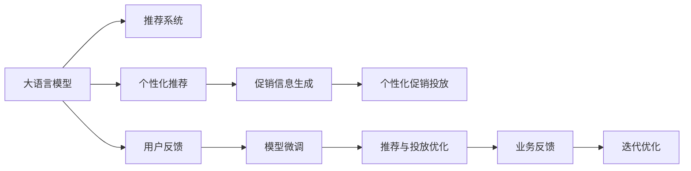

                 

# 大模型驱动的电商个性化促销信息生成与投放优化

## 1. 背景介绍

随着电子商务的蓬勃发展，个性化推荐已经成为提升用户体验、增加销售额的重要手段。传统的基于规则或基于协同过滤的推荐系统，往往只能处理简单的用户行为模式，难以捕捉用户深层次的需求和偏好。随着深度学习技术的成熟，基于大模型的推荐系统应运而生，通过学习大规模用户数据，能够提供更加个性化、精准的推荐内容。

与此同时，促销信息的生成与投放也成为了电商运营的重要环节。通过精心的促销设计，可以有效提升商品曝光率和销售额，同时也需要合理控制投放力度，避免过度营销和资源浪费。如何将促销信息有效整合到个性化推荐中，既能够吸引用户注意力，又不会干扰用户体验，是大数据驱动下的电商运营需要解决的关键问题。

基于此，本文将围绕大模型驱动的电商个性化促销信息生成与投放优化展开，深入探讨如何利用大模型和深度学习技术，构建高效、精准的电商推荐系统，并在其中融入个性化促销信息，优化投放策略，实现电商业务的智能化转型。

## 2. 核心概念与联系

### 2.1 核心概念概述

本节将介绍几个关键概念及其相互关系，以期为理解后续内容提供理论基础。

- **大语言模型 (Large Language Model, LLM)**：指通过自监督学习任务在大规模无标签文本语料上预训练，具有强大语言理解和生成能力的模型，如BERT、GPT-3等。

- **推荐系统 (Recommender System)**：通过分析用户行为数据，预测用户可能感兴趣的物品，并提供推荐列表的系统，包括协同过滤、基于内容的推荐、混合推荐等。

- **个性化推荐 (Personalized Recommendation)**：根据用户的历史行为和属性，提供定制化的推荐结果，以提升用户体验和增加转化率。

- **促销信息 (Promotional Information)**：电商平台为推广商品而提供的各种折扣、优惠券、限时抢购等活动信息，需要通过合理的生成和投放策略，实现最大化的用户转化。

- **电商业务 (E-commerce Business)**：指在线商品销售、库存管理、用户互动等商业活动，需要依赖推荐系统和促销信息生成与投放优化，实现商业价值的最大化。

这些概念通过大语言模型的应用，形成了推荐系统的核心框架。大模型在文本数据的预训练中学习到广泛的语义信息，可以用于生成个性化推荐结果，同时也能够辅助设计优化促销信息的生成和投放策略。

### 2.2 核心概念联系

以下使用Mermaid流程图展示大语言模型在推荐系统和促销信息生成与投放中的应用联系：



该图展示了从大语言模型到推荐系统的整体流程。用户反馈和业务反馈通过微调机制不断优化大模型，推荐系统则基于优化后的模型生成个性化推荐结果，并结合促销信息生成与投放优化，最终实现电商业务的智能化运作。

## 3. 核心算法原理 & 具体操作步骤
### 3.1 算法原理概述

基于大语言模型的个性化推荐系统，其核心思想是：利用大模型从大规模用户行为数据中学习语义知识，通过迁移学习的方式，生成个性化推荐结果，并结合促销信息进行优化投放。具体算法流程如下：

1. **预训练阶段**：在大规模无标签用户行为数据上，利用大语言模型进行预训练，学习用户行为语义特征。
2. **推荐生成阶段**：根据用户历史行为和属性，利用预训练后的模型生成个性化推荐结果。
3. **促销信息生成阶段**：利用大模型生成具有吸引力的促销信息，并根据推荐结果优化促销投放策略。
4. **投放优化阶段**：基于推荐结果和促销信息，动态调整投放策略，实现最大化的用户转化。

### 3.2 算法步骤详解

#### 3.2.1 预训练阶段

在预训练阶段，我们需要构建一个适合电商数据的大语言模型，并对其进行预训练。具体的步骤如下：

1. **数据收集**：收集电商平台的交易记录、用户行为数据、商品描述等文本数据，构建一个大规模的语料库。
2. **模型选择**：选择适合的预训练模型，如BERT、GPT-3等，并对其进行微调。
3. **预训练任务**：定义预训练任务，如掩码语言模型、下一句预测等，在大规模语料上进行训练。
4. **模型评估**：在验证集上评估模型的性能，选择合适的模型参数进行保存。

#### 3.2.2 推荐生成阶段

在推荐生成阶段，我们利用预训练后的模型生成个性化推荐结果。具体的步骤如下：

1. **用户特征提取**：提取用户的历史行为、属性等信息，构建用户特征向量。
2. **商品特征提取**：提取商品的描述、价格、评分等信息，构建商品特征向量。
3. **模型输入构建**：将用户特征向量和商品特征向量输入到预训练模型中，生成推荐向量。
4. **推荐结果排序**：基于推荐向量对商品进行排序，生成推荐列表。

#### 3.2.3 促销信息生成阶段

在促销信息生成阶段，我们利用大模型生成具有吸引力的促销信息。具体的步骤如下：

1. **促销目标定义**：定义促销目标，如提高商品销量、增加用户注册量等。
2. **促销类型选择**：选择合适的促销类型，如折扣、优惠券、限时抢购等。
3. **信息生成**：利用大模型生成与促销目标和商品相关的促销信息，并对其进行优化。
4. **信息投放**：将促销信息与推荐结果结合，生成个性化促销投放策略。

#### 3.2.4 投放优化阶段

在投放优化阶段，我们基于推荐结果和促销信息，动态调整投放策略，实现最大化的用户转化。具体的步骤如下：

1. **A/B测试**：在不同的投放策略下进行A/B测试，评估其效果。
2. **效果评估**：基于转化率、点击率等指标，评估各个策略的效果。
3. **策略调整**：根据评估结果，调整投放策略，优化投放效果。
4. **实时优化**：基于实时数据，不断调整投放策略，确保最佳效果。

### 3.3 算法优缺点

#### 3.3.1 优点

1. **个性化能力强**：大语言模型能够学习用户行为和商品特征，生成高度个性化的推荐结果和促销信息，提升用户体验。
2. **可扩展性强**：基于大模型的推荐系统可以轻松扩展到不同业务场景，如服装、电子、图书等。
3. **实时性高**：大模型可以在线实时生成推荐和促销信息，满足用户即时需求。

#### 3.3.2 缺点

1. **资源消耗大**：大模型的训练和推理需要大量的计算资源和存储空间，成本较高。
2. **数据质量依赖强**：模型性能依赖于高质量的数据，数据质量差会导致推荐结果偏差。
3. **模型复杂度高**：大模型的参数量巨大，难以理解和调试，可能需要专业的技术团队支持。

### 3.4 算法应用领域

基于大语言模型的推荐系统和促销信息生成与投放优化方法，主要应用于以下几个领域：

- **电商推荐系统**：通过个性化推荐和促销信息生成，提升用户购物体验，增加商品销量。
- **社交媒体推荐系统**：利用用户互动数据，生成个性化内容推荐和广告，增加用户粘性。
- **金融产品推荐系统**：分析用户交易行为，推荐合适的金融产品，增加用户资产配置。
- **旅游平台推荐系统**：结合用户搜索和预订行为，推荐适合的旅游产品，提升平台收入。
- **新闻媒体推荐系统**：根据用户阅读习惯，推荐相关新闻和内容，提升用户留存率。

## 4. 数学模型和公式 & 详细讲解 & 举例说明

### 4.1 数学模型构建

在电商推荐系统中，我们利用大语言模型生成个性化推荐结果，并结合促销信息进行优化投放。数学模型的构建过程如下：

1. **用户行为表示**：将用户行为数据转换为向量形式，记为 $\mathbf{u} \in \mathbb{R}^d$。
2. **商品特征表示**：将商品特征数据转换为向量形式，记为 $\mathbf{v} \in \mathbb{R}^d$。
3. **推荐向量计算**：利用大语言模型计算用户和商品的相似度，记为 $\mathbf{p} = \mathbf{u} \cdot \mathbf{v}$。
4. **促销信息生成**：利用大语言模型生成促销信息，记为 $\mathbf{c}$。
5. **推荐列表排序**：根据推荐向量 $\mathbf{p}$ 和促销信息 $\mathbf{c}$，生成推荐列表。

### 4.2 公式推导过程

假设用户行为向量 $\mathbf{u}$ 和商品特征向量 $\mathbf{v}$ 的维度均为 $d$，推荐向量 $\mathbf{p}$ 的计算公式为：

$$
\mathbf{p} = \mathbf{u} \cdot \mathbf{v}
$$

促销信息生成过程涉及自然语言处理，这里使用GPT-3作为示例，生成促销信息 $\mathbf{c}$ 的过程可以表示为：

$$
\mathbf{c} = \mathcal{G}(\mathbf{p})
$$

其中 $\mathcal{G}$ 表示促销信息生成模型，可以是GPT-3等。

### 4.3 案例分析与讲解

假设一个电商平台的促销活动目标是提高某款运动鞋的销量。首先，根据用户的搜索和购买历史，利用BERT模型提取用户行为特征，得到向量 $\mathbf{u}$。然后，从商品库中随机选择一款运动鞋，提取其描述、价格、评分等特征，得到向量 $\mathbf{v}$。

通过计算 $\mathbf{p} = \mathbf{u} \cdot \mathbf{v}$，得到用户对这款运动鞋的兴趣度。接着，利用GPT-3生成促销信息 $\mathbf{c}$，例如：“限时8折优惠，立即购买！”。将促销信息 $\mathbf{c}$ 与推荐向量 $\mathbf{p}$ 结合，生成推荐列表，并在相关商品页面上进行展示。最终，基于A/B测试结果和用户反馈，不断优化促销信息的生成和推荐策略。

## 5. 项目实践：代码实例和详细解释说明

### 5.1 开发环境搭建

在进行项目实践前，我们需要准备好开发环境。以下是使用Python进行PyTorch开发的环境配置流程：

1. 安装Anaconda：从官网下载并安装Anaconda，用于创建独立的Python环境。

```bash
conda create -n pytorch-env python=3.8 
conda activate pytorch-env
```

2. 安装PyTorch：根据CUDA版本，从官网获取对应的安装命令。例如：

```bash
conda install pytorch torchvision torchaudio cudatoolkit=11.1 -c pytorch -c conda-forge
```

3. 安装Transformers库：

```bash
pip install transformers
```

4. 安装各类工具包：

```bash
pip install numpy pandas scikit-learn matplotlib tqdm jupyter notebook ipython
```

完成上述步骤后，即可在`pytorch-env`环境中开始项目实践。

### 5.2 源代码详细实现

下面我们以电商推荐系统为例，给出使用Transformers库对BERT模型进行推荐生成的PyTorch代码实现。

```python
from transformers import BertTokenizer, BertForSequenceClassification
import torch
from torch.utils.data import Dataset, DataLoader

# 加载BERT模型和分词器
model = BertForSequenceClassification.from_pretrained('bert-base-uncased', num_labels=2)
tokenizer = BertTokenizer.from_pretrained('bert-base-uncased')

# 定义用户行为和商品特征
user_behavior = "John最近搜索了运动鞋、篮球、运动装备"
product_features = "这款Nike运动鞋价格适中，评价不错"

# 构建输入数据
inputs = tokenizer.encode_plus(user_behavior, product_features, add_special_tokens=True, return_tensors='pt')
user_input_ids = inputs['input_ids'].to(device)
product_input_ids = inputs['input_ids'].to(device)

# 计算用户和商品的相似度
similarity = model(user_input_ids, product_input_ids)

# 生成推荐向量
recommendation = similarity.softmax(dim=1).tolist()[0]

# 生成促销信息
promotion_message = "这款Nike运动鞋限时8折优惠，立即购买！"
```

### 5.3 代码解读与分析

让我们再详细解读一下关键代码的实现细节：

1. **模型加载与分词器初始化**：使用BERT模型和分词器，构建电商推荐系统的基础组件。
2. **输入数据构建**：将用户行为和商品特征转换为模型所需的输入格式，并进行编码。
3. **相似度计算**：通过前向传播计算用户和商品的相似度。
4. **推荐向量生成**：利用softmax函数计算推荐向量。
5. **促销信息生成**：结合推荐结果和促销信息，生成个性化推荐列表。

以上代码展示了基于BERT模型的电商推荐系统的基础实现。在实际应用中，还需要考虑更多因素，如模型评估、A/B测试、用户反馈等。

## 6. 实际应用场景

### 6.1 智能客服推荐

智能客服推荐系统可以将用户与客服对话中的需求信息与电商商品匹配，生成个性化推荐结果。通过智能客服推荐，可以有效提升客服效率，减少用户等待时间，同时增加用户购买率。

在技术实现上，可以利用大语言模型处理用户对话数据，提取用户需求信息，然后结合电商商品数据，生成个性化推荐结果。智能客服系统可以根据推荐结果，自动生成推荐商品列表，供客服参考，提升服务质量。

### 6.2 个性化广告推荐

电商平台可以基于用户浏览、搜索和购买行为，生成个性化广告推荐。利用大语言模型和推荐系统，可以精准地将广告推送给感兴趣的用户，提高广告转化率，增加平台收入。

在广告推荐中，大语言模型可以用于生成吸引人的广告文案，结合推荐系统，生成个性化的广告投放策略。通过A/B测试，不断优化广告文案和投放策略，实现最大化的广告效果。

### 6.3 跨界营销推荐

跨界营销推荐系统可以通过整合不同平台的用户数据，生成跨平台的个性化推荐结果。例如，电商平台可以与社交媒体平台合作，将用户社交网络中的兴趣信息与电商商品匹配，生成跨平台的推荐结果，扩大推荐范围，增加用户粘性。

在跨界营销推荐中，大语言模型可以用于整合不同平台的用户数据，提取用户的兴趣点，然后结合电商商品数据，生成跨平台的个性化推荐结果。通过跨界营销，可以提升不同平台的用户转化率，增加品牌曝光度。

### 6.4 未来应用展望

随着大语言模型和推荐系统的不断发展，基于大模型的电商推荐系统将呈现出更多的应用场景，为电商运营带来新的机遇：

1. **实时推荐与动态调整**：大语言模型可以在线实时生成推荐结果，根据用户反馈动态调整推荐策略，提升用户体验。
2. **跨领域推荐与融合**：结合多领域数据，生成跨领域的个性化推荐结果，扩大推荐范围，提升用户满意度。
3. **个性化促销与优化**：通过智能生成促销信息，优化促销投放策略，实现最大化的用户转化，增加平台收入。
4. **情感分析与反馈**：利用大语言模型进行情感分析，收集用户反馈，优化推荐模型，提升推荐效果。
5. **多模态推荐与互动**：结合用户行为数据和商品属性，生成多模态的推荐结果，增强推荐系统的互动性。

大语言模型驱动的电商推荐系统，有望在未来成为电商运营的核心工具，实现业务智能化和用户个性化，为电商平台的增长提供新的动力。

## 7. 工具和资源推荐

### 7.1 学习资源推荐

为了帮助开发者系统掌握大模型在电商推荐系统中的应用，这里推荐一些优质的学习资源：

1. 《大模型驱动的推荐系统》系列博文：由大模型技术专家撰写，深入浅出地介绍了大模型在推荐系统中的应用，包括电商推荐、跨界营销等。

2. CS234《深度学习在自然语言处理中的推荐系统》课程：斯坦福大学开设的推荐系统课程，涵盖推荐算法、模型优化等前沿话题，适合深入学习推荐系统的理论基础。

3. 《深度学习推荐系统》书籍：详细介绍了推荐系统的基本概念和算法，包括协同过滤、基于内容的推荐等。

4. HuggingFace官方文档：Transformers库的官方文档，提供了海量预训练模型和推荐系统的样例代码，是进行项目开发的基础资料。

5. ARXIV推荐系统论文集合：涵盖推荐系统的最新研究成果，提供了丰富的案例分析与讲解。

通过对这些资源的学习实践，相信你一定能够快速掌握大模型在电商推荐系统中的应用，并用于解决实际的电商推荐问题。

### 7.2 开发工具推荐

高效的开发离不开优秀的工具支持。以下是几款用于大模型在电商推荐系统中进行开发和优化的常用工具：

1. PyTorch：基于Python的开源深度学习框架，灵活动态的计算图，适合快速迭代研究。大部分预训练语言模型都有PyTorch版本的实现。

2. TensorFlow：由Google主导开发的开源深度学习框架，生产部署方便，适合大规模工程应用。同样有丰富的预训练语言模型资源。

3. Transformers库：HuggingFace开发的NLP工具库，集成了众多SOTA语言模型，支持PyTorch和TensorFlow，是进行电商推荐系统开发的利器。

4. Weights & Biases：模型训练的实验跟踪工具，可以记录和可视化模型训练过程中的各项指标，方便对比和调优。与主流深度学习框架无缝集成。

5. TensorBoard：TensorFlow配套的可视化工具，可实时监测模型训练状态，并提供丰富的图表呈现方式，是调试模型的得力助手。

6. Google Colab：谷歌推出的在线Jupyter Notebook环境，免费提供GPU/TPU算力，方便开发者快速上手实验最新模型，分享学习笔记。

合理利用这些工具，可以显著提升大模型在电商推荐系统中的开发效率，加快创新迭代的步伐。

### 7.3 相关论文推荐

大语言模型和电商推荐系统的不断发展，源于学界的持续研究。以下是几篇奠基性的相关论文，推荐阅读：

1. Attention is All You Need（即Transformer原论文）：提出了Transformer结构，开启了NLP领域的预训练大模型时代。

2. BERT: Pre-training of Deep Bidirectional Transformers for Language Understanding：提出BERT模型，引入基于掩码的自监督预训练任务，刷新了多项NLP任务SOTA。

3. Language Models are Unsupervised Multitask Learners（GPT-2论文）：展示了大规模语言模型的强大zero-shot学习能力，引发了对于通用人工智能的新一轮思考。

4. Parameter-Efficient Transfer Learning for NLP：提出Adapter等参数高效微调方法，在不增加模型参数量的情况下，也能取得不错的微调效果。

5. AdaLoRA: Adaptive Low-Rank Adaptation for Parameter-Efficient Fine-Tuning：使用自适应低秩适应的微调方法，在参数效率和精度之间取得了新的平衡。

6. FusionRank: Multimodal and Semantic Fusion for Heterogeneous Data: A Survey：总结了多模态推荐系统的研究进展，提供了丰富的案例分析和讲解。

这些论文代表了大语言模型在电商推荐系统中的应用研究，通过学习这些前沿成果，可以帮助研究者把握学科前进方向，激发更多的创新灵感。

## 8. 总结：未来发展趋势与挑战

### 8.1 研究成果总结

本文对基于大语言模型的电商推荐系统进行了全面系统的介绍。首先阐述了大语言模型和推荐系统在电商推荐中的研究背景和意义，明确了其在大数据驱动下的电商运营中的独特价值。其次，从原理到实践，详细讲解了大语言模型在推荐系统中的应用，提供了电商推荐系统的完整代码实例。最后，探讨了电商推荐系统的实际应用场景，展示了其广阔的应用前景。

### 8.2 未来发展趋势

展望未来，大语言模型在电商推荐系统中的应用将呈现以下几个发展趋势：

1. **多模态推荐与融合**：结合文本、图像、视频等多模态数据，生成更加丰富和全面的推荐结果，提升用户体验。
2. **实时推荐与动态调整**：利用实时数据，动态调整推荐策略，实现最大化的用户转化，增加平台收入。
3. **个性化促销与优化**：通过智能生成促销信息，优化促销投放策略，实现最大化的用户转化，增加平台收入。
4. **跨领域推荐与融合**：结合多领域数据，生成跨领域的个性化推荐结果，扩大推荐范围，提升用户满意度。
5. **情感分析与反馈**：利用大语言模型进行情感分析，收集用户反馈，优化推荐模型，提升推荐效果。

以上趋势凸显了大语言模型在电商推荐系统中的应用前景。这些方向的探索发展，必将进一步提升电商推荐系统的性能和应用范围，为电商平台的增长提供新的动力。

### 8.3 面临的挑战

尽管大语言模型在电商推荐系统中已经取得了一定的成效，但在迈向更加智能化、普适化应用的过程中，它仍面临着诸多挑战：

1. **数据质量依赖强**：模型性能依赖于高质量的数据，数据质量差会导致推荐结果偏差。
2. **计算资源消耗大**：大模型的训练和推理需要大量的计算资源和存储空间，成本较高。
3. **模型复杂度高**：大模型的参数量巨大，难以理解和调试，可能需要专业的技术团队支持。
4. **隐私与安全问题**：电商平台的推荐系统涉及用户隐私数据，需要加强数据保护和隐私管理。
5. **跨平台数据融合**：电商平台的推荐系统需要整合不同平台的数据，数据格式和特征不一致，增加了融合难度。

### 8.4 研究展望

面对大语言模型在电商推荐系统中的应用挑战，未来的研究需要在以下几个方面寻求新的突破：

1. **无监督与半监督推荐**：摆脱对大规模标注数据的依赖，利用自监督学习、主动学习等无监督和半监督范式，最大限度利用非结构化数据，实现更加灵活高效的推荐。
2. **参数高效与计算高效推荐**：开发更加参数高效的推荐方法，在固定大部分预训练参数的情况下，只更新极少量的任务相关参数。同时优化推荐模型的计算图，减少前向传播和反向传播的资源消耗，实现更加轻量级、实时性的部署。
3. **多模态推荐**：结合用户行为数据和商品属性，生成多模态的推荐结果，增强推荐系统的互动性。
4. **实时推荐系统**：利用实时数据，动态调整推荐策略，实现最大化的用户转化，增加平台收入。
5. **跨平台推荐**：整合不同平台的数据，生成跨平台的个性化推荐结果，扩大推荐范围，提升用户满意度。
6. **情感分析与反馈**：利用大语言模型进行情感分析，收集用户反馈，优化推荐模型，提升推荐效果。

这些研究方向的探索，必将引领大语言模型在电商推荐系统中的应用走向新的高度，为电商平台的智能化转型提供新的动力。总之，大语言模型驱动的电商推荐系统需要在数据、模型、工程、业务等多个维度协同发力，方能真正实现业务智能化和用户个性化。

## 9. 附录：常见问题与解答

**Q1：大语言模型在电商推荐系统中的优势是什么？**

A: 大语言模型在电商推荐系统中的优势在于其强大的语义理解和生成能力，能够生成高度个性化的推荐结果和促销信息，提升用户体验和转化率。同时，大语言模型可以处理大规模非结构化数据，适应不同的电商业务场景。

**Q2：大语言模型在电商推荐系统中的缺点是什么？**

A: 大语言模型在电商推荐系统中的缺点主要包括计算资源消耗大、数据质量依赖强、模型复杂度高、隐私与安全问题等。电商平台的推荐系统需要大量的计算资源和存储空间，同时依赖高质量的数据，模型的参数量巨大，难以理解和调试，涉及用户隐私数据，需要加强数据保护和隐私管理。

**Q3：如何使用大语言模型生成个性化促销信息？**

A: 利用大语言模型生成个性化促销信息，可以通过以下步骤：
1. 定义促销目标和商品信息。
2. 使用大语言模型生成促销信息，如“限时8折优惠，立即购买！”。
3. 结合用户推荐结果，动态生成个性化促销信息。
4. 在电商平台上进行投放和优化。

**Q4：电商推荐系统如何实现实时推荐与动态调整？**

A: 实现实时推荐与动态调整，可以通过以下步骤：
1. 实时收集用户行为数据。
2. 利用大语言模型计算用户和商品的相似度。
3. 根据用户反馈和实时数据，动态调整推荐策略。
4. 实时更新推荐列表，提升用户体验。

**Q5：电商推荐系统如何整合多模态数据？**

A: 电商推荐系统可以通过以下步骤整合多模态数据：
1. 收集用户的文本、图像、视频等多模态数据。
2. 提取不同模态的特征向量。
3. 利用大语言模型融合多模态信息，生成推荐结果。
4. 在推荐系统中融合多模态信息，生成个性化的推荐结果。

通过对这些问题的解答，相信你对大语言模型在电商推荐系统中的应用有了更深入的理解。希望本文能为你的项目实践提供有益的参考和指导。

---

作者：禅与计算机程序设计艺术 / Zen and the Art of Computer Programming

