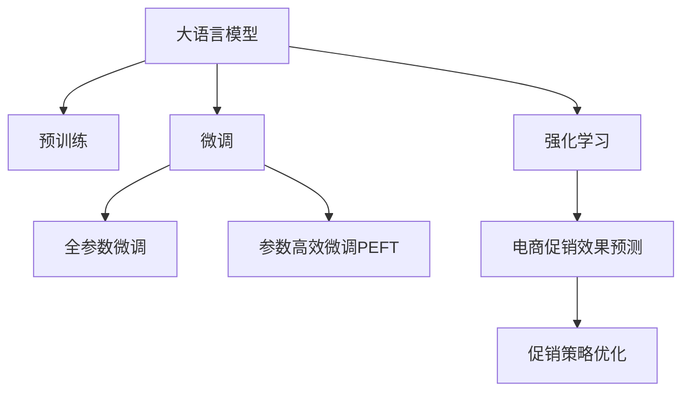

                 

# 大模型驱动的电商个性化促销效果预测与优化

## 1. 背景介绍

随着互联网时代的到来，电子商务成为了人们生活中不可或缺的一部分。电商平台的促销活动丰富多彩，包括打折、满减、赠品、积分兑换等形式。然而，促销效果往往难以预测和量化，导致商家的促销活动效果不佳，甚至造成资源浪费。如何精准预测促销效果，优化促销策略，成为电商平台亟需解决的问题。

近年来，大模型技术，尤其是大语言模型和大规模深度学习模型，在电商领域的应用日益广泛。本文将介绍如何利用大模型技术进行电商促销效果的预测和优化，并详细阐述相关核心算法和操作步骤。

## 2. 核心概念与联系

### 2.1 核心概念概述

为更好地理解基于大模型驱动的电商促销效果预测与优化方法，本节将介绍几个关键概念：

- 大语言模型(Large Language Model, LLM)：以自回归(如GPT)或自编码(如BERT)模型为代表的大规模预训练语言模型。通过在大规模无标签文本语料上进行预训练，学习通用的语言表示，具备强大的语言理解和生成能力。

- 预训练(Pre-training)：指在大规模无标签文本语料上，通过自监督学习任务训练通用语言模型的过程。常见的预训练任务包括言语建模、遮挡语言模型等。预训练使得模型学习到语言的通用表示。

- 微调(Fine-tuning)：指在预训练模型的基础上，使用下游任务的少量标注数据，通过有监督地训练来优化模型在该任务上的性能。通常只需要调整顶层分类器或解码器，并以较小的学习率更新全部或部分的模型参数。

- 迁移学习(Transfer Learning)：指将一个领域学习到的知识，迁移应用到另一个不同但相关的领域的学习范式。大模型的预训练-微调过程即是一种典型的迁移学习方式。

- 强化学习(Reinforcement Learning)：通过奖励机制，训练模型学习最优的决策策略，以实现特定任务。与监督学习不同，强化学习可以处理序列化的决策问题。

- 电商促销效果预测(Promotion Effect Prediction)：预测电商平台促销活动的销售效果，包括销售额、客流量、转化率等指标。

- 促销策略优化(Optimization of Promotion Strategy)：通过精准预测促销效果，优化促销活动的设计和执行，提升商家的ROI和用户体验。

这些概念之间的逻辑关系可以通过以下Mermaid流程图来展示：



这个流程图展示了大语言模型的核心概念及其之间的关系：

1. 大语言模型通过预训练获得基础能力。
2. 微调是对预训练模型进行任务特定的优化，可以分为全参数微调和参数高效微调（PEFT）。
3. 强化学习通过奖励机制，引导模型学习最优的促销策略。
4. 电商促销效果预测利用微调模型对促销活动的销售效果进行预测。
5. 促销策略优化根据预测结果，优化促销活动的设计和执行。

这些概念共同构成了基于大模型驱动的电商促销效果预测与优化框架，使其能够在电商促销场景中发挥强大的作用。通过理解这些核心概念，我们可以更好地把握大模型驱动的电商促销效果预测与优化的工作原理和优化方向。

## 3. 核心算法原理 & 具体操作步骤
### 3.1 算法原理概述

基于大模型驱动的电商促销效果预测与优化，本质上是一个有监督的细粒度迁移学习过程。其核心思想是：利用预训练的大语言模型进行电商促销活动的效果预测，并基于预测结果优化促销策略，以提升促销活动的销售效果。

形式化地，假设预训练模型为 $M_{\theta}$，其中 $\theta$ 为预训练得到的模型参数。给定电商促销活动 $P$ 的历史数据 $D=\{(x_i, y_i)\}_{i=1}^N, x_i \in \mathcal{X}, y_i \in \mathcal{Y}$，其中 $x_i$ 表示促销活动的历史信息，$y_i$ 表示促销活动的销售效果（如销售额、客流量、转化率等）。微调的目标是找到新的模型参数 $\hat{\theta}$，使得：

$$
\hat{\theta}=\mathop{\arg\min}_{\theta} \mathcal{L}(M_{\theta},D)
$$

其中 $\mathcal{L}$ 为针对促销活动设计的损失函数，用于衡量模型预测输出与真实标签之间的差异。常见的损失函数包括均方误差损失、交叉熵损失等。

通过梯度下降等优化算法，微调过程不断更新模型参数 $\theta$，最小化损失函数 $\mathcal{L}$，使得模型输出逼近真实标签。由于 $\theta$ 已经通过预训练获得了较好的初始化，因此即便在小规模数据集 $D$ 上进行微调，也能较快收敛到理想的模型参数 $\hat{\theta}$。

### 3.2 算法步骤详解

基于大模型驱动的电商促销效果预测与优化一般包括以下几个关键步骤：

**Step 1: 准备预训练模型和数据集**
- 选择合适的预训练语言模型 $M_{\theta}$ 作为初始化参数，如 BERT、GPT等。
- 准备电商促销活动 $P$ 的历史数据集 $D$，划分为训练集、验证集和测试集。一般要求数据与预训练数据的分布不要差异过大。

**Step 2: 设计损失函数**
- 根据促销活动的效果指标，选择合适的损失函数，如均方误差损失、交叉熵损失等。
- 对于分类问题，通常使用交叉熵损失函数；对于回归问题，使用均方误差损失函数。

**Step 3: 设置微调超参数**
- 选择合适的优化算法及其参数，如 AdamW、SGD 等，设置学习率、批大小、迭代轮数等。
- 设置正则化技术及强度，包括权重衰减、Dropout、Early Stopping等。
- 确定冻结预训练参数的策略，如仅微调顶层，或全部参数都参与微调。

**Step 4: 执行梯度训练**
- 将训练集数据分批次输入模型，前向传播计算损失函数。
- 反向传播计算参数梯度，根据设定的优化算法和学习率更新模型参数。
- 周期性在验证集上评估模型性能，根据性能指标决定是否触发 Early Stopping。
- 重复上述步骤直到满足预设的迭代轮数或 Early Stopping 条件。

**Step 5: 策略优化**
- 根据模型预测结果，评估促销策略的效果。
- 使用强化学习等方法，优化促销策略的设计和执行，提升促销活动的销售效果。

**Step 6: 测试和部署**
- 在测试集上评估微调后模型 $M_{\hat{\theta}}$ 的性能，对比微调前后的精度提升。
- 使用微调后的模型对新促销活动进行预测，集成到实际的应用系统中。
- 持续收集新的数据，定期重新微调模型，以适应数据分布的变化。

以上是基于大模型驱动的电商促销效果预测与优化的一般流程。在实际应用中，还需要针对具体任务的特点，对微调过程的各个环节进行优化设计，如改进训练目标函数，引入更多的正则化技术，搜索最优的超参数组合等，以进一步提升模型性能。

### 3.3 算法优缺点

基于大模型驱动的电商促销效果预测与优化方法具有以下优点：
1. 预测准确度高。利用大模型预训练获得的广泛知识，能够在少量标注数据下获得较好的预测结果。
2. 推广性强。模型具有较强的泛化能力，可以应用到不同类型的促销活动预测。
3. 计算效率高。微调模型只需更新顶层参数，固定大部分预训练权重，从而节省计算资源。
4. 鲁棒性强。通过正则化技术，可以避免模型过拟合，提升模型的鲁棒性和稳定性。

同时，该方法也存在一定的局限性：
1. 依赖标注数据。促销活动的效果预测依赖于历史数据，需要收集足够的标注数据。
2. 数据分布差异。当历史数据与目标任务的分布差异较大时，微调效果可能不佳。
3. 模型更新慢。大模型参数较多，更新速度较慢，可能需要较长的训练时间。
4. 策略复杂性。强化学习优化促销策略需要复杂的规则设计和调试，可能存在较高的技术门槛。

尽管存在这些局限性，但就目前而言，基于大模型驱动的电商促销效果预测与优化方法仍是一种有效的手段，广泛应用于电商平台的促销效果预测和优化。未来相关研究的重点在于如何进一步降低微调对标注数据的依赖，提高模型的推广能力和更新速度，同时兼顾策略优化的灵活性和可解释性等因素。

### 3.4 算法应用领域

基于大模型驱动的电商促销效果预测与优化方法，在电商领域已经得到了广泛的应用，覆盖了电商促销活动的效果预测和策略优化等多个环节。例如：

- 销售预测：预测促销活动在未来的销售额、客流量等指标。通过微调模型对促销活动进行效果预测，商家可以根据预测结果制定更合理的促销策略。
- 策略优化：根据历史促销数据，使用强化学习等方法，优化促销活动的设计和执行。通过调整促销手段、时间节点、覆盖范围等因素，最大化促销效果。
- 推荐系统：根据用户行为数据和历史促销信息，预测用户的购买意愿，推荐适合的促销活动。通过微调模型提升推荐系统的准确性，提高用户转化率。
- 广告投放：预测广告投放的效果，评估不同广告策略的ROI，优化广告预算和投放策略。通过微调模型预测广告点击率、转化率等指标，提升广告效果。

除了上述这些经典应用外，大模型驱动的电商促销效果预测与优化方法还被创新性地应用到更多场景中，如客户细分、营销效果评估、库存管理等，为电商平台的智能化转型提供了新的技术路径。

## 4. 数学模型和公式 & 详细讲解 & 举例说明
### 4.1 数学模型构建

本节将使用数学语言对基于大模型驱动的电商促销效果预测与优化过程进行更加严格的刻画。

记预训练语言模型为 $M_{\theta}$，其中 $\theta$ 为预训练得到的模型参数。假设电商促销活动 $P$ 的历史数据集为 $D=\{(x_i, y_i)\}_{i=1}^N, x_i \in \mathcal{X}, y_i \in \mathcal{Y}$。

定义模型 $M_{\theta}$ 在促销活动数据 $(x,y)$ 上的损失函数为 $\ell(M_{\theta}(x),y)$，则在数据集 $D$ 上的经验风险为：

$$
\mathcal{L}(\theta) = \frac{1}{N} \sum_{i=1}^N \ell(M_{\theta}(x_i),y_i)
$$

微调的优化目标是最小化经验风险，即找到最优参数：

$$
\theta^* = \mathop{\arg\min}_{\theta} \mathcal{L}(\theta)
$$

在实践中，我们通常使用基于梯度的优化算法（如SGD、Adam等）来近似求解上述最优化问题。设 $\eta$ 为学习率，$\lambda$ 为正则化系数，则参数的更新公式为：

$$
\theta \leftarrow \theta - \eta \nabla_{\theta}\mathcal{L}(\theta) - \eta\lambda\theta
$$

其中 $\nabla_{\theta}\mathcal{L}(\theta)$ 为损失函数对参数 $\theta$ 的梯度，可通过反向传播算法高效计算。

### 4.2 公式推导过程

以下我们以回归问题为例，推导均方误差损失函数及其梯度的计算公式。

假设模型 $M_{\theta}$ 在促销活动数据 $x$ 上的输出为 $\hat{y}=M_{\theta}(x)$，表示预测的促销效果。真实标签 $y$ 为促销活动实际的效果指标，如销售额、客流量等。则均方误差损失函数定义为：

$$
\ell(M_{\theta}(x),y) = \frac{1}{2}(y-\hat{y})^2
$$

将其代入经验风险公式，得：

$$
\mathcal{L}(\theta) = \frac{1}{2N} \sum_{i=1}^N (y_i-M_{\theta}(x_i))^2
$$

根据链式法则，损失函数对参数 $\theta_k$ 的梯度为：

$$
\frac{\partial \mathcal{L}(\theta)}{\partial \theta_k} = -\frac{1}{N}\sum_{i=1}^N (y_i-M_{\theta}(x_i)) \frac{\partial M_{\theta}(x_i)}{\partial \theta_k}
$$

其中 $\frac{\partial M_{\theta}(x_i)}{\partial \theta_k}$ 可进一步递归展开，利用自动微分技术完成计算。

在得到损失函数的梯度后，即可带入参数更新公式，完成模型的迭代优化。重复上述过程直至收敛，最终得到适应电商促销活动的最佳模型参数 $\theta^*$。

## 5. 项目实践：代码实例和详细解释说明
### 5.1 开发环境搭建

在进行电商促销效果预测与优化实践前，我们需要准备好开发环境。以下是使用Python进行TensorFlow开发的环境配置流程：

1. 安装Anaconda：从官网下载并安装Anaconda，用于创建独立的Python环境。

2. 创建并激活虚拟环境：
```bash
conda create -n tf-env python=3.8 
conda activate tf-env
```

3. 安装TensorFlow：根据CUDA版本，从官网获取对应的安装命令。例如：
```bash
conda install tensorflow -c tf -c conda-forge
```

4. 安装各类工具包：
```bash
pip install numpy pandas scikit-learn matplotlib tqdm jupyter notebook ipython
```

完成上述步骤后，即可在`tf-env`环境中开始电商促销效果预测与优化实践。

### 5.2 源代码详细实现

这里我们以促销效果预测任务为例，给出使用TensorFlow对BERT模型进行电商促销效果预测的代码实现。

首先，定义促销效果预测任务的数据处理函数：

```python
from transformers import BertTokenizer
from tensorflow.keras.layers import Dense, Input
from tensorflow.keras.models import Model
import tensorflow as tf

class PromotionEffectDataset(tf.keras.utils.Sequence):
    def __init__(self, texts, labels, tokenizer, max_len=128):
        self.texts = texts
        self.labels = labels
        self.tokenizer = tokenizer
        self.max_len = max_len
        
    def __len__(self):
        return len(self.texts)
    
    def __getitem__(self, item):
        text = self.texts[item]
        label = self.labels[item]
        
        encoding = self.tokenizer(text, return_tensors='tf', max_length=self.max_len, padding='max_length', truncation=True)
        input_ids = encoding['input_ids'][0]
        attention_mask = encoding['attention_mask'][0]
        
        # 将标签转换为向量
        label = tf.constant([label], dtype=tf.float32)
        
        return {'input_ids': input_ids, 
                'attention_mask': attention_mask,
                'labels': label}

# 创建数据集
tokenizer = BertTokenizer.from_pretrained('bert-base-cased')

train_dataset = PromotionEffectDataset(train_texts, train_labels, tokenizer)
dev_dataset = PromotionEffectDataset(dev_texts, dev_labels, tokenizer)
test_dataset = PromotionEffectDataset(test_texts, test_labels, tokenizer)
```

然后，定义模型和损失函数：

```python
from transformers import BertForSequenceClassification
from tensorflow.keras.optimizers import Adam

model = BertForSequenceClassification.from_pretrained('bert-base-cased', num_labels=2)

loss = tf.keras.losses.MeanSquaredError()

optimizer = Adam(learning_rate=2e-5)
```

接着，定义训练和评估函数：

```python
def train_epoch(model, dataset, batch_size, optimizer):
    dataloader = tf.data.Dataset.from_tensor_slices(dataset)
    dataloader = dataloader.shuffle(buffer_size=1024).batch(batch_size).prefetch(tf.data.experimental.AUTOTUNE)
    
    model.train()
    epoch_loss = 0
    for batch in dataloader:
        input_ids = batch['input_ids'][0]
        attention_mask = batch['attention_mask'][0]
        labels = batch['labels'][0]
        
        with tf.GradientTape() as tape:
            outputs = model(input_ids, attention_mask=attention_mask)
            loss = loss(outputs.logits, labels)
        
        grads = tape.gradient(loss, model.trainable_variables)
        optimizer.apply_gradients(zip(grads, model.trainable_variables))
        epoch_loss += loss.numpy()
        
    return epoch_loss / len(dataloader)

def evaluate(model, dataset, batch_size):
    dataloader = tf.data.Dataset.from_tensor_slices(dataset)
    dataloader = dataloader.batch(batch_size).prefetch(tf.data.experimental.AUTOTUNE)
    
    model.eval()
    predictions = []
    labels = []
    with tf.GradientTape() as tape:
        for batch in dataloader:
            input_ids = batch['input_ids'][0]
            attention_mask = batch['attention_mask'][0]
            outputs = model(input_ids, attention_mask=attention_mask)
            predictions.append(outputs.logits.numpy())
            labels.append(batch['labels'][0])
        
    return tf.reduce_mean(tf.square(predictions - labels)).numpy()
```

最后，启动训练流程并在测试集上评估：

```python
epochs = 5
batch_size = 16

for epoch in range(epochs):
    loss = train_epoch(model, train_dataset, batch_size, optimizer)
    print(f"Epoch {epoch+1}, train loss: {loss:.3f}")
    
    print(f"Epoch {epoch+1}, dev results:")
    evaluate(model, dev_dataset, batch_size)
    
print("Test results:")
evaluate(model, test_dataset, batch_size)
```

以上就是使用TensorFlow对BERT进行电商促销效果预测任务的完整代码实现。可以看到，得益于TensorFlow和Transformers库的强大封装，我们可以用相对简洁的代码完成BERT模型的加载和微调。

### 5.3 代码解读与分析

让我们再详细解读一下关键代码的实现细节：

**PromotionEffectDataset类**：
- `__init__`方法：初始化文本、标签、分词器等关键组件。
- `__len__`方法：返回数据集的样本数量。
- `__getitem__`方法：对单个样本进行处理，将文本输入编码为token ids，将标签编码为向量，并对其进行定长padding，最终返回模型所需的输入。

**训练和评估函数**：
- 使用TensorFlow的DataLoader对数据集进行批次化加载，供模型训练和推理使用。
- 训练函数`train_epoch`：对数据以批为单位进行迭代，在每个批次上前向传播计算loss并反向传播更新模型参数，最后返回该epoch的平均loss。
- 评估函数`evaluate`：与训练类似，不同点在于不更新模型参数，并在每个batch结束后将预测和标签结果存储下来，最后使用均方误差计算预测结果与真实标签之间的差异。

**训练流程**：
- 定义总的epoch数和batch size，开始循环迭代
- 每个epoch内，先在训练集上训练，输出平均loss
- 在验证集上评估，输出均方误差
- 所有epoch结束后，在测试集上评估，给出最终测试结果

可以看到，TensorFlow配合Transformers库使得BERT微调的代码实现变得简洁高效。开发者可以将更多精力放在数据处理、模型改进等高层逻辑上，而不必过多关注底层的实现细节。

当然，工业级的系统实现还需考虑更多因素，如模型的保存和部署、超参数的自动搜索、更灵活的任务适配层等。但核心的微调范式基本与此类似。

## 6. 实际应用场景
### 6.1 智能推荐系统

基于大模型驱动的电商促销效果预测与优化方法，可以应用于智能推荐系统的构建。智能推荐系统能够实时推荐用户感兴趣的促销活动，提高用户购买率和转化率。

在技术实现上，可以收集用户的浏览、点击、购买等行为数据，提取和促销活动相关的商品特征和用户行为特征。将特征作为模型输入，通过微调模型预测用户的购买意愿，推荐适合的促销活动。通过强化学习等方法，不断优化推荐策略，提升用户满意度和推荐效果。

### 6.2 库存管理系统

库存管理是电商平台运营中的重要环节。通过预测促销活动的效果，电商平台可以精准调整库存量，避免库存积压和缺货现象。

在技术实现上，可以收集历史促销活动和库存数据，提取促销活动的历史效果和库存变化的规律。通过微调模型预测未来促销活动的效果，指导库存的调度和分配。通过强化学习等方法，不断优化库存管理策略，降低库存成本，提高供应链效率。

### 6.3 广告投放平台

广告投放平台需要精准预测广告效果，优化广告预算和投放策略，提高广告的ROI和点击率。

在技术实现上，可以收集广告的历史投放数据和用户行为数据，提取广告特征和用户行为特征。通过微调模型预测广告的效果，指导广告的投放和优化。通过强化学习等方法，不断优化广告投放策略，提升广告的转化率和ROI。

### 6.4 未来应用展望

随着大模型技术和大数据技术的发展，基于大模型驱动的电商促销效果预测与优化方法将呈现出更加广阔的应用前景。

在智慧物流领域，通过预测促销活动对物流的影响，优化物流资源分配，提升物流效率。在个性化营销领域，通过预测用户对促销活动的反应，优化营销策略，提高用户满意度和忠诚度。

此外，在智慧城市治理、智能家居、智慧医疗等众多领域，基于大模型驱动的电商促销效果预测与优化方法也将不断涌现，为各行各业带来新的技术变革。相信随着技术的日益成熟，大模型驱动的电商促销效果预测与优化方法将成为电商运营的重要工具，推动电商平台的智能化转型和升级。

## 7. 工具和资源推荐
### 7.1 学习资源推荐

为了帮助开发者系统掌握大模型驱动的电商促销效果预测与优化方法，这里推荐一些优质的学习资源：

1. 《深度学习入门：基于Python的理论与实现》系列博文：深入浅出地介绍了深度学习的基本概念和前沿技术，是电商促销效果预测与优化的入门必读书目。

2. 《TensorFlow实战》系列书籍：详细讲解了TensorFlow的深度学习模型构建、训练和优化，提供了丰富的实例代码和实战经验，适合电商领域的开发者。

3. CS294A《深度学习》课程：斯坦福大学开设的深度学习经典课程，有Lecture视频和配套作业，是理解深度学习基本原理和算法的重要资源。

4. 《NLP实战》系列书籍：专注于自然语言处理应用的实践，提供了大量实际案例和代码实现，适合电商促销效果预测与优化任务的开发。

5. 《Transformer从原理到实践》系列博文：由大模型技术专家撰写，深入浅出地介绍了Transformer原理、BERT模型、微调技术等前沿话题，是大模型驱动的电商促销效果预测与优化的重要参考资料。

通过对这些资源的学习实践，相信你一定能够快速掌握大模型驱动的电商促销效果预测与优化技术的精髓，并用于解决实际的电商问题。

### 7.2 开发工具推荐

高效的开发离不开优秀的工具支持。以下是几款用于电商促销效果预测与优化开发的常用工具：

1. TensorFlow：基于Python的开源深度学习框架，灵活动态的计算图，适合快速迭代研究。TensorFlow提供了丰富的深度学习模型和优化算法，支持多种硬件平台，是大模型驱动的电商促销效果预测与优化的主要工具。

2. PyTorch：基于Python的开源深度学习框架，动态计算图，易于实现和调试。PyTorch在大模型微调方面有广泛的实践，是大模型驱动的电商促销效果预测与优化技术的可选工具。

3. HuggingFace Transformers库：提供了丰富的预训练语言模型和微调API，支持多语言和多任务，是大模型驱动的电商促销效果预测与优化的重要辅助工具。

4. Weights & Biases：模型训练的实验跟踪工具，可以记录和可视化模型训练过程中的各项指标，方便对比和调优。与主流深度学习框架无缝集成。

5. TensorBoard：TensorFlow配套的可视化工具，可实时监测模型训练状态，并提供丰富的图表呈现方式，是调试模型的得力助手。

6. Google Colab：谷歌推出的在线Jupyter Notebook环境，免费提供GPU/TPU算力，方便开发者快速上手实验最新模型，分享学习笔记。

合理利用这些工具，可以显著提升电商促销效果预测与优化任务的开发效率，加快创新迭代的步伐。

### 7.3 相关论文推荐

大模型驱动的电商促销效果预测与优化技术的发展源于学界的持续研究。以下是几篇奠基性的相关论文，推荐阅读：

1. Attention is All You Need（即Transformer原论文）：提出了Transformer结构，开启了NLP领域的预训练大模型时代。

2. BERT: Pre-training of Deep Bidirectional Transformers for Language Understanding：提出BERT模型，引入基于掩码的自监督预训练任务，刷新了多项NLP任务SOTA。

3. Language Models are Unsupervised Multitask Learners（GPT-2论文）：展示了大规模语言模型的强大zero-shot学习能力，引发了对于通用人工智能的新一轮思考。

4. Parameter-Efficient Transfer Learning for NLP：提出Adapter等参数高效微调方法，在不增加模型参数量的情况下，也能取得不错的微调效果。

5. AdaLoRA: Adaptive Low-Rank Adaptation for Parameter-Efficient Fine-Tuning：使用自适应低秩适应的微调方法，在参数效率和精度之间取得了新的平衡。

6. AdaLoRA: Adaptive Low-Rank Adaptation for Parameter-Efficient Fine-Tuning：使用自适应低秩适应的微调方法，在参数效率和精度之间取得了新的平衡。

这些论文代表了大模型驱动的电商促销效果预测与优化技术的发展脉络。通过学习这些前沿成果，可以帮助研究者把握学科前进方向，激发更多的创新灵感。

## 8. 总结：未来发展趋势与挑战
### 8.1 总结

本文对基于大模型驱动的电商促销效果预测与优化方法进行了全面系统的介绍。首先阐述了电商促销效果预测与优化的研究背景和意义，明确了大模型技术在电商促销预测与优化中的独特价值。其次，从原理到实践，详细讲解了监督微调的数学原理和关键步骤，给出了电商促销效果预测与优化的完整代码实例。同时，本文还广泛探讨了电商促销效果预测与优化方法在智能推荐、库存管理、广告投放等多个电商场景中的应用前景，展示了大模型技术在电商领域的广泛应用。此外，本文精选了电商促销效果预测与优化技术的各类学习资源，力求为读者提供全方位的技术指引。

通过本文的系统梳理，可以看到，基于大模型驱动的电商促销效果预测与优化方法正在成为电商运营的重要工具，极大地提升了电商平台的智能化水平，促进了电商业务的持续增长。未来，伴随大模型技术和大数据技术的发展，基于大模型驱动的电商促销效果预测与优化方法将进一步拓展应用边界，为电商平台的智能化转型和升级提供新的技术支持。

### 8.2 未来发展趋势

展望未来，基于大模型驱动的电商促销效果预测与优化方法将呈现以下几个发展趋势：

1. 模型规模持续增大。随着算力成本的下降和数据规模的扩张，大语言模型和大规模深度学习模型的参数量还将持续增长。超大批次的训练和推理也将成为可能。

2. 微调方法日趋多样。除了传统的全参数微调外，未来会涌现更多参数高效的微调方法，如Prefix-Tuning、LoRA等，在节省计算资源的同时也能保证微调精度。

3. 持续学习成为常态。随着数据分布的不断变化，微调模型也需要持续学习新知识以保持性能。如何在不遗忘原有知识的同时，高效吸收新样本信息，将成为重要的研究课题。

4. 标注样本需求降低。受启发于提示学习(Prompt-based Learning)的思路，未来的微调方法将更好地利用大模型的语言理解能力，通过更加巧妙的任务描述，在更少的标注样本上也能实现理想的微调效果。

5. 多模态微调崛起。当前的微调主要聚焦于纯文本数据，未来会进一步拓展到图像、视频、语音等多模态数据微调。多模态信息的融合，将显著提升语言模型对现实世界的理解和建模能力。

6. 模型通用性增强。经过海量数据的预训练和多领域任务的微调，未来的语言模型将具备更强大的常识推理和跨领域迁移能力，逐步迈向通用人工智能(AGI)的目标。

以上趋势凸显了大模型驱动的电商促销效果预测与优化技术的广阔前景。这些方向的探索发展，必将进一步提升电商系统的性能和应用范围，为电商平台的智能化转型和升级提供新的技术支持。

### 8.3 面临的挑战

尽管基于大模型驱动的电商促销效果预测与优化方法已经取得了显著成效，但在迈向更加智能化、普适化应用的过程中，它仍面临着诸多挑战：

1. 标注成本瓶颈。尽管电商促销效果预测依赖于历史数据，但获取高质量标注数据仍然是一个成本较高的过程。如何进一步降低微调对标注样本的依赖，将是一大难题。

2. 模型鲁棒性不足。当前微调模型面对域外数据时，泛化性能往往大打折扣。对于测试样本的微小扰动，微调模型的预测也容易发生波动。如何提高微调模型的鲁棒性，避免灾难性遗忘，还需要更多理论和实践的积累。

3. 推理效率有待提高。大模型虽然精度高，但在实际部署时往往面临推理速度慢、内存占用大等效率问题。如何在保证性能的同时，简化模型结构，提升推理速度，优化资源占用，将是重要的优化方向。

4. 可解释性亟需加强。当前微调模型更像是"黑盒"系统，难以解释其内部工作机制和决策逻辑。对于医疗、金融等高风险应用，算法的可解释性和可审计性尤为重要。如何赋予微调模型更强的可解释性，将是亟待攻克的难题。

5. 安全性有待保障。预训练语言模型难免会学习到有偏见、有害的信息，通过微调传递到下游任务，产生误导性、歧视性的输出，给实际应用带来安全隐患。如何从数据和算法层面消除模型偏见，避免恶意用途，确保输出的安全性，也将是重要的研究课题。

6. 知识整合能力不足。现有的微调模型往往局限于任务内数据，难以灵活吸收和运用更广泛的先验知识。如何让微调过程更好地与外部知识库、规则库等专家知识结合，形成更加全面、准确的信息整合能力，还有很大的想象空间。

正视微调面临的这些挑战，积极应对并寻求突破，将是大模型驱动的电商促销效果预测与优化方法走向成熟的必由之路。相信随着学界和产业界的共同努力，这些挑战终将一一被克服，大模型驱动的电商促销效果预测与优化方法必将在构建人机协同的智能时代中扮演越来越重要的角色。

### 8.4 未来突破

面对大模型驱动的电商促销效果预测与优化所面临的种种挑战，未来的研究需要在以下几个方面寻求新的突破：

1. 探索无监督和半监督微调方法。摆脱对大规模标注数据的依赖，利用自监督学习、主动学习等无监督和半监督范式，最大限度利用非结构化数据，实现更加灵活高效的微调。

2. 研究参数高效和计算高效的微调范式。开发更加参数高效的微调方法，在固定大部分预训练参数的同时，只更新极少量的任务相关参数。同时优化微调模型的计算图，减少前向传播和反向传播的资源消耗，实现更加轻量级、实时性的部署。

3. 融合因果和对比学习范式。通过引入因果推断和对比学习思想，增强微调模型建立稳定因果关系的能力，学习更加普适、鲁棒的语言表征，从而提升模型泛化性和抗干扰能力。

4. 引入更多先验知识。将符号化的先验知识，如知识图谱、逻辑规则等，与神经网络模型进行巧妙融合，引导微调过程学习更准确、合理的语言模型。同时加强不同模态数据的整合，实现视觉、语音等多模态信息与文本信息的协同建模。

5. 结合因果分析和博弈论工具。将因果分析方法引入微调模型，识别出模型决策的关键特征，增强输出解释的因果性和逻辑性。借助博弈论工具刻画人机交互过程，主动探索并规避模型的脆弱点，提高系统稳定性。

6. 纳入伦理道德约束。在模型训练目标中引入伦理导向的评估指标，过滤和惩罚有偏见、有害的输出倾向。同时加强人工干预和审核，建立模型行为的监管机制，确保输出符合人类价值观和伦理道德。

这些研究方向的探索，必将引领大模型驱动的电商促销效果预测与优化技术迈向更高的台阶，为构建安全、可靠、可解释、可控的智能系统铺平道路。面向未来，大模型驱动的电商促销效果预测与优化技术还需要与其他人工智能技术进行更深入的融合，如知识表示、因果推理、强化学习等，多路径协同发力，共同推动自然语言理解和智能交互系统的进步。只有勇于创新、敢于突破，才能不断拓展语言模型的边界，让智能技术更好地造福人类社会。

## 9. 附录：常见问题与解答
**Q1：电商促销效果预测依赖于历史数据，如何提升模型的泛化能力？**

A: 电商促销效果预测的泛化能力可以通过以下方法提升：

1. 增加数据多样性。收集更多不同类型、不同场景的促销活动数据，增加模型对复杂情况的理解。

2. 数据增强。通过对历史数据进行回译、近义词替换等方式，丰富训练数据的多样性，提高模型的泛化能力。

3. 正则化。通过L2正则、Dropout等方式，避免模型过拟合，提升泛化能力。

4. 参数高效微调。通过保留预训练参数，只微调顶层参数，减少模型过拟合的风险。

5. 多任务学习。将电商促销效果预测与多个相关任务结合，通过共享参数和损失函数，提升模型的泛化能力。

通过以上方法，可以显著提升电商促销效果预测模型的泛化能力，使其更好地适应不同场景和数据分布。

**Q2：电商促销效果预测与优化的模型复杂度如何控制？**

A: 电商促销效果预测与优化的模型复杂度可以通过以下方法控制：

1. 模型裁剪。在保证性能的前提下，去除不必要的层和参数，减小模型尺寸，提高推理速度。

2. 混合精度训练。采用混合精度计算，减小内存占用，提高训练和推理效率。

3. 模型并行。通过多GPU或多TPU并行计算，加速模型训练和推理过程，减少计算时间。

4. 量化加速。将浮点模型转为定点模型，压缩存储空间，提高计算效率。

5. 数据增强。通过数据增强方式，丰富训练数据的多样性，提高模型的泛化能力。

通过以上方法，可以有效地控制电商促销效果预测与优化模型的复杂度，使其能够在大规模数据上高效运行，提升系统性能。

**Q3：电商促销效果预测与优化的策略优化如何实现？**

A: 电商促销效果预测与优化的策略优化可以通过以下方法实现：

1. 强化学习。通过奖励机制，训练模型学习最优的促销策略，最大化促销效果。

2. 多臂老虎机(MAB)算法。将促销活动比作多臂老虎机，通过不断尝试不同策略，学习最优的投放方案。

3. 贝叶斯优化。通过贝叶斯统计方法，优化促销策略的设计和执行，提升促销效果。

4. 分布式优化。通过分布式优化算法，加速策略优化过程，提升促销效果。

5. 实时优化。根据实时数据反馈，不断调整促销策略，提高促销效果。

通过以上方法，可以有效地实现电商促销效果预测与优化的策略优化，提升促销效果，提高商家ROI和用户体验。

---

作者：禅与计算机程序设计艺术 / Zen and the Art of Computer Programming

