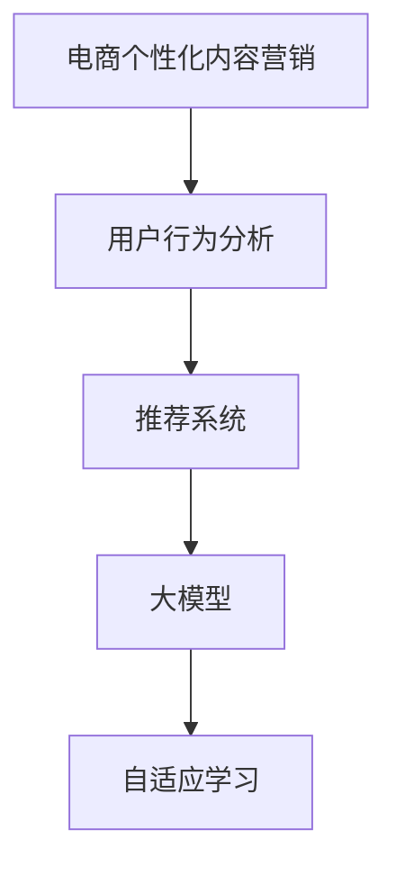

                 

# 大模型驱动的电商个性化内容营销

> 关键词：大模型, 电商, 个性化推荐, 内容营销, 用户行为分析, 深度学习, 推荐系统, 自适应学习

## 1. 背景介绍

随着电商市场的迅猛发展和互联网技术的不断进步，消费者对商品和服务的需求日趋多样化，个性化和精准化的内容营销已成为电商企业提升用户体验、增加用户粘性、促进销售增长的关键手段。与此同时，大数据和人工智能技术的迅猛发展，尤其是预训练大语言模型(Big Language Model, BLM)的崛起，为大模型驱动的电商个性化内容营销提供了新的可能性。

## 2. 核心概念与联系

### 2.1 核心概念概述

为了更深入地理解大模型在电商个性化内容营销中的应用，本节将介绍几个关键概念：

- **电商个性化内容营销**：通过分析用户行为数据，结合商品信息，生成个性化的推荐内容，以提升用户购物体验，促进销售转化。
- **用户行为分析**：对用户在电商网站上的浏览、点击、购买等行为进行数据挖掘和分析，理解用户需求和偏好。
- **推荐系统**：利用机器学习算法，根据用户行为数据和商品特征，为每个用户生成个性化的商品推荐列表。
- **大模型**：如BERT、GPT等大规模预训练语言模型，通过在大规模无标签文本语料上进行预训练，学习到丰富的语言知识和语义表示。
- **自适应学习**：即在大模型基础上进行微调，使其适应特定电商任务，提升个性化推荐效果。
- **注意力机制**：一种机器学习中用于提高模型对关键信息关注度的机制，可用于模型结构和特征选择。

### 2.2 核心概念原理和架构的 Mermaid 流程图



这个流程图展示了大模型在电商个性化内容营销中各关键概念之间的逻辑关系：

1. 电商个性化内容营销以用户行为分析为基础，了解用户需求。
2. 推荐系统根据用户行为和商品特征，生成个性化推荐列表。
3. 大模型在推荐系统中用于提升推荐结果的准确性和多样性。
4. 自适应学习通过微调大模型，使其更好地适应电商领域特定任务，进一步优化推荐效果。

## 3. 核心算法原理 & 具体操作步骤

### 3.1 算法原理概述

大模型驱动的电商个性化内容营销，主要通过两个关键步骤实现：用户行为分析和大模型推荐。

1. **用户行为分析**：收集用户在电商网站上的浏览、点击、购买等行为数据，通过统计分析、机器学习等技术手段，识别用户偏好和需求。
2. **大模型推荐**：将用户行为数据输入预训练大模型中，通过微调或自适应学习，获得更精准的个性化推荐结果。

### 3.2 算法步骤详解

#### 3.2.1 用户行为分析

**Step 1: 数据收集**
收集用户在电商网站上的行为数据，包括浏览记录、点击序列、购买记录等。

**Step 2: 特征工程**
对行为数据进行特征提取，如访问时长、页面停留时间、点击率、购买转化率等。同时，结合商品属性、用户画像等外部信息，构造更加丰富、多维度的特征向量。

**Step 3: 模型训练**
使用机器学习算法，如协同过滤、基于内容的推荐、深度学习等，训练用户行为分析模型，预测用户偏好和需求。

#### 3.2.2 大模型推荐

**Step 4: 数据预处理**
将用户行为数据进行预处理，如归一化、编码等，得到输入到模型的向量表示。

**Step 5: 模型微调**
选择预训练的大模型，如BERT、GPT等，进行微调。微调的目标是使模型能够更好地理解和生成电商领域特定的推荐内容。

**Step 6: 推荐计算**
根据微调后的模型，生成个性化推荐列表。可以使用注意力机制、前向传播、后向传播等技术，实现推荐计算。

### 3.3 算法优缺点

#### 3.3.1 优点

1. **精准度提升**：通过大模型的强大语义表示能力，推荐系统可以更精准地理解用户需求和商品特征，生成个性化推荐。
2. **泛化能力强**：大模型预训练在通用语料上，具有较强的泛化能力，能适应不同电商领域和不同用户群体的需求。
3. **学习效率高**：大模型通过微调即可快速适应电商领域特定任务，节省了从头训练的时间和数据成本。
4. **效果显著**：在学术界和工业界的诸多电商推荐系统中，基于大模型的推荐系统已经刷新了最先进的性能指标。

#### 3.3.2 缺点

1. **依赖标注数据**：大模型微调需要一定的标注数据进行监督学习，这在大数据获取成本较高的场景下可能成为瓶颈。
2. **计算资源消耗大**：大模型参数量庞大，微调过程需要大量的计算资源。
3. **可解释性不足**：微调模型的决策过程通常缺乏可解释性，难以对其推理逻辑进行分析和调试。
4. **偏见问题**：大模型可能继承预训练数据中的偏见，通过微调传递到推荐结果中，造成不良影响。

### 3.4 算法应用领域

大模型驱动的电商个性化内容营销，已在多个领域得到成功应用，包括但不限于以下场景：

- **商品推荐**：根据用户浏览和购买行为，推荐相关商品，提升销售转化。
- **广告投放**：通过分析用户行为数据，生成个性化的广告内容，提高广告点击率和转化率。
- **智能客服**：利用大模型进行对话生成，解答用户问题，提升客服效率和用户满意度。
- **用户画像**：通过分析用户行为数据，生成更精细的用户画像，提供差异化服务。
- **购物助手**：基于用户偏好，推荐个性化的购物计划和搭配方案，提升购物体验。

这些应用场景展示了大模型在电商个性化内容营销中的巨大潜力，推动了电商行业的发展和创新。

## 4. 数学模型和公式 & 详细讲解

### 4.1 数学模型构建

假设电商网站的用户行为数据为 $\mathcal{X}=\{x_1, x_2, ..., x_n\}$，推荐系统的大模型为 $M_{\theta}$。通过微调大模型，生成推荐列表 $\mathcal{Y}=\{y_1, y_2, ..., y_n\}$。

大模型的微调目标为：

$$
\min_{\theta} \frac{1}{N}\sum_{i=1}^N \ell(M_{\theta}(x_i), y_i)
$$

其中 $\ell$ 为损失函数，可以是交叉熵损失、均方误差损失等。

### 4.2 公式推导过程

以交叉熵损失函数为例，推导微调大模型的公式：

$$
\ell(M_{\theta}(x), y) = -y \log M_{\theta}(x) - (1-y) \log(1-M_{\theta}(x))
$$

对用户行为数据 $x_i$ 进行前向传播，计算预测输出 $M_{\theta}(x_i)$。根据交叉熵损失函数，计算损失值 $\ell(M_{\theta}(x_i), y_i)$，反向传播更新模型参数 $\theta$。

### 4.3 案例分析与讲解

假设电商网站收集到用户 A 的浏览数据 $\{x_1, x_2, ..., x_n\}$，通过大模型微调生成推荐列表 $\{y_1, y_2, ..., y_n\}$。

1. **数据预处理**：将浏览数据 $\{x_1, x_2, ..., x_n\}$ 转化为模型的输入向量 $\mathbf{x}$。
2. **模型前向传播**：将输入向量 $\mathbf{x}$ 输入微调后的模型 $M_{\theta}$，得到预测向量 $\mathbf{y} = M_{\theta}(\mathbf{x})$。
3. **损失计算**：根据用户的实际购买记录 $y_i$，计算交叉熵损失 $\ell(y_i, y)$。
4. **反向传播**：通过反向传播算法，更新模型参数 $\theta$，使预测结果 $\mathbf{y}$ 更接近用户购买记录 $y_i$。

## 5. 项目实践：代码实例和详细解释说明

### 5.1 开发环境搭建

为进行大模型驱动的电商个性化内容营销项目开发，需要搭建以下开发环境：

1. **安装 Python 环境**：使用 Anaconda 创建虚拟环境，安装 PyTorch、TensorFlow、Numpy 等库。
2. **安装 Transformers 库**：使用 pip 安装 Transformers 库，支持大模型的微调和推理。
3. **安装电商数据集**：收集电商网站的用户行为数据，准备用于训练和微调的标注数据集。

### 5.2 源代码详细实现

以下是一个使用 PyTorch 实现大模型微调的项目示例：

```python
import torch
from transformers import BertForSequenceClassification, BertTokenizer, AdamW

# 初始化大模型和分词器
model = BertForSequenceClassification.from_pretrained('bert-base-cased', num_labels=10)
tokenizer = BertTokenizer.from_pretrained('bert-base-cased')

# 设置优化器
optimizer = AdamW(model.parameters(), lr=2e-5)

# 数据预处理
def preprocess_data(data):
    encoded = tokenizer(data, padding='max_length', truncation=True, max_length=128)
    return encoded['input_ids'], encoded['attention_mask'], encoded['labels']

# 数据加载器
train_loader = DataLoader(train_dataset, batch_size=16)
dev_loader = DataLoader(dev_dataset, batch_size=16)
test_loader = DataLoader(test_dataset, batch_size=16)

# 训练函数
def train_epoch(model, loader):
    model.train()
    for batch in loader:
        input_ids, attention_mask, labels = preprocess_data(batch)
        input_ids = input_ids.to(device)
        attention_mask = attention_mask.to(device)
        labels = labels.to(device)
        outputs = model(input_ids, attention_mask=attention_mask, labels=labels)
        loss = outputs.loss
        optimizer.zero_grad()
        loss.backward()
        optimizer.step()
        return loss

# 评估函数
def evaluate(model, loader):
    model.eval()
    total_loss = 0
    for batch in loader:
        input_ids, attention_mask, labels = preprocess_data(batch)
        input_ids = input_ids.to(device)
        attention_mask = attention_mask.to(device)
        labels = labels.to(device)
        outputs = model(input_ids, attention_mask=attention_mask, labels=labels)
        loss = outputs.loss
        total_loss += loss.item()
    return total_loss / len(loader)

# 微调模型
device = torch.device('cuda' if torch.cuda.is_available() else 'cpu')
model.to(device)
for epoch in range(10):
    train_loss = train_epoch(model, train_loader)
    print(f'Epoch {epoch+1}, train loss: {train_loss:.3f}')
    dev_loss = evaluate(model, dev_loader)
    print(f'Epoch {epoch+1}, dev loss: {dev_loss:.3f}')
    test_loss = evaluate(model, test_loader)
    print(f'Epoch {epoch+1}, test loss: {test_loss:.3f}')
```

### 5.3 代码解读与分析

在上述代码中，我们使用了 PyTorch 和 Transformers 库实现了一个基本的电商推荐系统。具体步骤如下：

1. **模型初始化**：使用 BERT 模型和分词器作为初始化参数，并设置优化器。
2. **数据预处理**：使用分词器对用户行为数据进行编码，得到输入向量。
3. **训练函数**：在训练集上进行前向传播、损失计算和反向传播，更新模型参数。
4. **评估函数**：在验证集和测试集上进行评估，输出平均损失值。
5. **微调模型**：在每个epoch结束时，输出训练、验证和测试集的损失值。

## 6. 实际应用场景

### 6.1 智能广告投放

大模型驱动的电商个性化内容营销，在智能广告投放中具有重要应用。通过分析用户的浏览和点击行为，生成个性化的广告内容，可以提高广告的点击率和转化率。

**Step 1: 数据收集**：收集用户的广告点击记录、浏览行为等数据。
**Step 2: 特征提取**：提取广告特征、用户行为特征等，构造特征向量。
**Step 3: 模型训练**：训练推荐系统模型，预测广告点击概率。
**Step 4: 广告推荐**：根据用户行为数据，生成个性化的广告推荐列表。

### 6.2 购物助手

购物助手是一个基于大模型的电商推荐系统，通过分析用户的浏览和购买行为，生成个性化的购物计划和搭配方案，提升用户购物体验。

**Step 1: 数据收集**：收集用户的浏览记录、购买记录等数据。
**Step 2: 特征提取**：提取商品特征、用户行为特征等，构造特征向量。
**Step 3: 模型微调**：使用大模型对推荐系统进行微调，提升推荐效果。
**Step 4: 推荐计算**：根据微调后的模型，生成个性化购物计划和搭配方案。

### 6.3 智能客服

智能客服系统通过分析用户的问题和历史对话记录，生成个性化的回复内容，提升客服效率和用户满意度。

**Step 1: 数据收集**：收集用户的对话记录和问题。
**Step 2: 特征提取**：提取问题特征、用户历史对话记录等，构造特征向量。
**Step 3: 模型微调**：使用大模型对回复生成模型进行微调，提升回复质量。
**Step 4: 对话生成**：根据用户的问题和上下文，生成个性化的回复内容。

## 7. 工具和资源推荐

### 7.1 学习资源推荐

为了帮助开发者系统掌握大模型在电商个性化内容营销中的应用，这里推荐一些优质的学习资源：

1. **《自然语言处理基础》**：斯坦福大学提供的课程，系统讲解自然语言处理的基本概念和经典模型。
2. **《深度学习与推荐系统》**：清华大学出版社出版的书籍，详细介绍了推荐系统的基本原理和深度学习算法。
3. **《Transformers》**：Hugging Face 公司出版的书籍，全面介绍了 Transformers 库的使用方法和最佳实践。
4. **《电子商务数据分析》**：阿里研究院出版的书籍，介绍了电子商务数据分析的基本方法和大数据技术。
5. **《电商营销实战》**：京东大学出版的书籍，介绍了电商营销的基本策略和实战技巧。

### 7.2 开发工具推荐

高效的开发离不开优秀的工具支持。以下是几款用于大模型驱动的电商个性化内容营销开发的常用工具：

1. **PyTorch**：基于 Python 的开源深度学习框架，灵活的动态计算图，适合快速迭代研究。
2. **TensorFlow**：由 Google 主导开发的开源深度学习框架，生产部署方便，适合大规模工程应用。
3. **Transformers**：Hugging Face 公司开发的 NLP 工具库，集成了众多 SOTA 语言模型，支持 PyTorch 和 TensorFlow。
4. **Jupyter Notebook**：交互式 Python 开发环境，方便实时调试和展示结果。
5. **Visual Studio Code**：轻量级 Python IDE，支持代码高亮、自动补全等特性。

### 7.3 相关论文推荐

大模型在电商个性化内容营销中的应用，得益于众多学者的研究和实践。以下是几篇奠基性的相关论文，推荐阅读：

1. **Attention is All You Need**：Google 论文，提出 Transformer 模型，奠定了大模型的基础。
2. **BERT: Pre-training of Deep Bidirectional Transformers for Language Understanding**：Google 论文，提出 BERT 模型，引入自监督预训练任务。
3. **GPT-3: Language Models are Unsupervised Multitask Learners**：OpenAI 论文，提出 GPT-3 模型，展示了大模型的强大零样本学习能力。
4. **Parameter-Efficient Transfer Learning for NLP**：Google 论文，提出 Adapter 等参数高效微调方法，提升微调效果。
5. **Self-Attentive Model for E-commerce Intent Prediction**：2019 年 IJCAI 论文，提出自注意力模型，应用于电商用户意图预测。
6. **Big Data Mining and Knowledge Discovery: A Perspective for Electronic Commerce**：2008 年专家文章，讨论大数据在电商中的应用。

这些论文代表了大模型在电商个性化内容营销领域的研究进展，提供了宝贵的理论和实践经验。

## 8. 总结：未来发展趋势与挑战

### 8.1 研究成果总结

大模型驱动的电商个性化内容营销，近年来在理论和应用上都取得了显著进展。通过微调大模型，生成个性化的推荐内容，提升了电商网站的转化率和用户满意度。同时，大模型在智能广告投放、购物助手、智能客服等领域的应用，展示了其强大的应用潜力。

### 8.2 未来发展趋势

展望未来，大模型在电商个性化内容营销领域的发展趋势如下：

1. **更高效的多模态推荐**：未来推荐系统将融合多种模态数据，如文本、图像、音频等，提升推荐效果。
2. **更精细的用户画像**：通过更深入的用户行为分析，生成更精细的用户画像，提供差异化服务。
3. **更个性化的内容生成**：基于大模型的生成能力，生成更加个性化、多样化的推荐内容。
4. **更智能的广告投放**：利用大模型的深度学习能力，实现更智能的广告投放策略，提高广告效果。
5. **更自适应的推荐系统**：根据用户反馈和行为变化，动态调整推荐策略，实现自适应推荐。
6. **更安全的数据管理**：随着数据量的增加，如何保护用户隐私和安全，成为重要的研究方向。

### 8.3 面临的挑战

尽管大模型在电商个性化内容营销领域取得了显著进展，但仍面临以下挑战：

1. **数据隐私问题**：在数据收集和分析过程中，如何保护用户隐私，防止数据泄露。
2. **模型公平性**：大模型可能继承数据中的偏见，需要通过公平性评估和改进，消除偏见。
3. **计算资源消耗**：大模型的参数量庞大，需要大量的计算资源进行微调和推理，如何优化资源消耗成为重要课题。
4. **可解释性不足**：大模型的决策过程缺乏可解释性，难以对其推理逻辑进行分析和调试。
5. **用户信任问题**：用户对推荐系统的信任和依赖，需要增强推荐系统的透明性和可信度。

### 8.4 研究展望

面对大模型在电商个性化内容营销领域面临的挑战，未来的研究需要在以下几个方面寻求新的突破：

1. **隐私保护技术**：研究隐私保护算法，如差分隐私、联邦学习等，保护用户数据隐私。
2. **模型公平性提升**：通过公平性约束和优化，提升大模型的公平性，减少偏见。
3. **资源优化技术**：开发高效的模型压缩和量化技术，优化计算资源消耗。
4. **增强可解释性**：研究可解释性模型，提升推荐系统的透明性和可信度。
5. **多模态融合**：研究多模态数据融合技术，提升推荐系统的综合性能。

这些研究方向将推动大模型在电商个性化内容营销领域的应用，提升推荐系统的效果和可靠性，实现更加个性化、智能化的电商营销。

## 9. 附录：常见问题与解答

**Q1: 大模型在电商推荐中的具体应用场景有哪些？**

A: 大模型在电商推荐中的具体应用场景包括：
1. **商品推荐**：根据用户浏览和购买行为，推荐相关商品。
2. **广告投放**：生成个性化的广告内容，提高广告点击率和转化率。
3. **智能客服**：解答用户问题，提升客服效率和用户满意度。
4. **购物助手**：生成个性化的购物计划和搭配方案。
5. **智能投放**：分析用户行为数据，优化广告投放策略。

**Q2: 在电商推荐系统中，如何选择合适的损失函数？**

A: 在电商推荐系统中，选择合适的损失函数是关键。常见的损失函数包括：
1. **交叉熵损失**：适用于分类任务，如预测用户是否点击广告。
2. **均方误差损失**：适用于回归任务，如预测用户购买概率。
3. **F1 损失**：适用于不平衡数据集，提升模型在少数类别的性能。
4. **余弦相似度损失**：适用于计算用户和商品之间的相似度。

**Q3: 大模型的计算资源消耗大，如何优化？**

A: 优化大模型的计算资源消耗，可以采用以下方法：
1. **模型压缩**：通过剪枝、量化等技术，减少模型参数量，降低计算资源消耗。
2. **模型并行**：使用分布式训练技术，将模型并行化，提高训练效率。
3. **内存优化**：采用动态图、混合精度训练等技术，优化内存占用。
4. **缓存技术**：使用缓存技术，减少重复计算。

**Q4: 大模型的决策过程缺乏可解释性，如何改进？**

A: 改进大模型的可解释性，可以采用以下方法：
1. **模型可视化**：使用可视化工具，如 TensorBoard，展示模型内部结构和特征图。
2. **特征重要性分析**：使用 SHAP 值、LIME 等技术，分析特征对模型预测结果的影响。
3. **解释生成**：使用模型生成技术，如 LSTM 文本生成模型，生成模型的解释。

**Q5: 大模型在电商推荐中容易出现偏差，如何解决？**

A: 解决大模型在电商推荐中的偏见问题，可以采用以下方法：
1. **公平性约束**：在训练过程中加入公平性约束，避免模型偏见。
2. **数据预处理**：通过数据清洗和归一化，减少数据中的偏见。
3. **公平性优化**：通过公平性优化算法，提升模型的公平性。
4. **多模型融合**：使用多个模型进行融合，减少模型偏见。

通过上述问题的探讨和解答，可以帮助开发者更深入地理解大模型在电商个性化内容营销中的应用，提升推荐系统的效果和可靠性。

