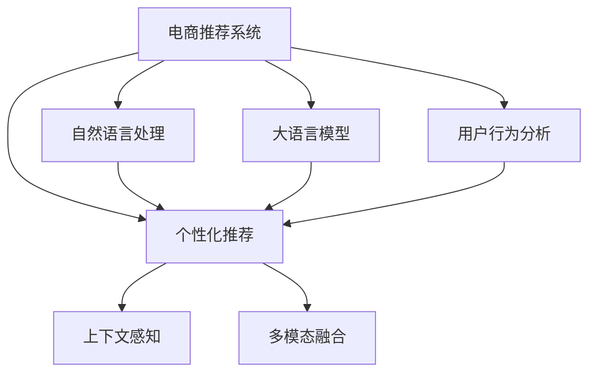

                 

# 大模型驱动的电商个性化活动推荐

> 关键词：电商推荐系统,大语言模型,自然语言处理,深度学习,用户行为分析,活动推荐,智能推荐

## 1. 背景介绍

### 1.1 问题由来
随着电子商务的迅猛发展，电商平台面对的用户数量、商品种类和交易行为日益复杂。如何为每个用户推荐最符合其兴趣和需求的个性化活动，提升用户体验，增加平台收益，成为了电商平台面临的重大挑战。传统的推荐系统基于用户历史行为数据和商品特征构建模型，往往难以捕捉长尾用户的多样化需求，也难以实时应对用户行为的变化。

近年来，随着深度学习和大规模语言模型技术的发展，电商推荐系统开始尝试引入大语言模型（Large Language Model, LLM）技术，通过分析用户对商品活动的自然语言描述和反馈，实现更为精准、灵活的个性化推荐。这种基于大语言模型的推荐方法，可以更好地理解用户的隐性需求，动态调整推荐策略，显著提升了电商平台的个性化推荐效果。

### 1.2 问题核心关键点
大语言模型在电商推荐系统中的应用，主要基于以下核心关键点：

- **用户意图理解**：通过分析用户对商品活动的自然语言描述，理解用户行为背后的深层次意图。
- **上下文感知**：利用大语言模型的上下文感知能力，结合用户的历史行为、实时反馈等信息，生成更加准确的活动推荐。
- **多模态融合**：结合文本数据和用户行为数据，构建多模态融合的推荐模型，提升推荐效果。
- **实时推荐**：通过快速微调和在线学习，实时生成个性化推荐，适应用户的快速变化需求。
- **可解释性**：大语言模型推荐过程具有一定可解释性，可以辅助用户理解推荐理由，增强用户体验。

这些关键点构成了基于大语言模型的电商个性化推荐系统，为用户提供了更加精准、灵活、高效的个性化活动推荐服务。

## 2. 核心概念与联系

### 2.1 核心概念概述

为更好地理解基于大语言模型的电商个性化推荐方法，本节将介绍几个密切相关的核心概念：

- **电商推荐系统**：通过分析用户行为数据和商品特征，为用户推荐商品、活动等内容的智能系统。常见的推荐方法包括协同过滤、内容推荐、基于排序的推荐等。
- **自然语言处理(NLP)**：利用计算机技术处理和理解人类语言的技术，包括文本分析、语义理解、情感分析等。
- **大语言模型**：以自回归(如GPT)或自编码(如BERT)模型为代表的大规模预训练语言模型。通过在大规模无标签文本语料上进行预训练，学习通用的语言知识和常识。
- **用户行为分析**：分析用户的历史浏览、购买、点击等行为数据，提取用户偏好和兴趣点。
- **个性化推荐**：针对每个用户，生成定制化的推荐内容，提升用户满意度和转化率。
- **上下文感知**：指模型能够考虑当前任务的多样化上下文信息，如时间、地点、情境等，生成更加贴合实际的活动推荐。
- **多模态融合**：结合不同类型的数据，如文本、图像、视频等，构建更加全面、准确的推荐模型。

这些核心概念之间的逻辑关系可以通过以下Mermaid流程图来展示：



这个流程图展示了大语言模型在电商推荐系统中的应用流程：

1. 电商推荐系统通过自然语言处理和用户行为分析，获得用户的活动描述和行为特征。
2. 大语言模型利用预训练的知识，对活动描述进行理解和生成，提取用户兴趣。
3. 结合用户行为特征，个性化推荐系统生成符合用户兴趣的活动推荐。
4. 推荐系统同时考虑上下文信息和多种数据源，提升推荐效果。

## 3. 核心算法原理 & 具体操作步骤
### 3.1 算法原理概述

基于大语言模型的电商个性化推荐，本质上是一个自然语言理解和生成与用户行为分析相结合的过程。其核心思想是：利用大语言模型学习用户对商品活动的自然语言描述，理解用户的意图和兴趣，结合用户历史行为数据，生成个性化的活动推荐。

具体来说，假设电商推荐系统有用户活动数据集 $D=\{(a_i, b_i, c_i)\}_{i=1}^N$，其中 $a_i$ 为活动描述，$b_i$ 为活动结果（如点击率、购买率等），$c_i$ 为用户行为数据（如浏览时间、浏览记录等）。设大语言模型为 $M_{\theta}$，其中 $\theta$ 为模型参数。目标是通过大语言模型和用户行为数据，找到最优的模型参数 $\hat{\theta}$，使得推荐效果最佳：

$$
\hat{\theta}=\mathop{\arg\min}_{\theta} \mathcal{L}(M_{\theta},D)
$$

其中 $\mathcal{L}$ 为推荐系统的损失函数，用于衡量推荐结果与实际结果之间的差异。常见的损失函数包括交叉熵损失、均方误差损失等。

### 3.2 算法步骤详解

基于大语言模型的电商个性化推荐一般包括以下几个关键步骤：

**Step 1: 准备数据集和预训练模型**
- 收集电商平台的商品活动数据集，标注用户对活动的反馈结果。
- 选择合适的预训练语言模型 $M_{\theta}$ 作为初始化参数，如 GPT-3、BERT 等。

**Step 2: 设计活动描述处理函数**
- 对活动描述进行预处理，去除无关信息，提取核心特征。
- 对活动描述进行分词和编码，转化为模型所需的输入。

**Step 3: 设计用户行为特征提取函数**
- 从用户的历史行为数据中提取与活动相关的特征，如浏览时长、浏览顺序、点击率等。
- 将用户行为特征转换为数值型或一热向量，方便模型处理。

**Step 4: 设计上下文感知函数**
- 设计上下文感知模块，考虑当前活动的时间、地点、用户情境等信息。
- 将上下文信息与活动描述、用户行为特征进行融合，生成更加全面的输入。

**Step 5: 构建推荐模型**
- 构建包含大语言模型的推荐模型，设计合适的输出层和损失函数。
- 设置微调超参数，选择合适的优化算法及其参数。

**Step 6: 执行梯度训练**
- 将训练集数据分批次输入模型，前向传播计算损失函数。
- 反向传播计算参数梯度，根据设定的优化算法和学习率更新模型参数。
- 周期性在验证集上评估模型性能，根据性能指标决定是否触发 Early Stopping。
- 重复上述步骤直到满足预设的迭代轮数或 Early Stopping 条件。

**Step 7: 测试和部署**
- 在测试集上评估微调后模型的推荐效果，对比微调前后的精度提升。
- 使用微调后的模型对新商品活动进行推荐，集成到电商平台的推荐系统中。
- 持续收集新的用户行为数据和活动反馈，定期重新微调模型，以适应数据分布的变化。

### 3.3 算法优缺点

基于大语言模型的电商个性化推荐方法具有以下优点：
1. 提升推荐效果。通过理解用户对活动的自然语言描述，能够捕捉用户的隐性需求，生成更精准的推荐。
2. 适应性更强。能够快速适应用户行为的动态变化，生成实时推荐。
3. 可解释性高。推荐过程具有一定的可解释性，用户可以理解推荐理由。
4. 灵活度高。能够结合多种数据源，如文本、图像、行为数据等，构建多模态融合的推荐模型。

同时，该方法也存在一定的局限性：
1. 数据标注成本高。获取高质量的标注数据集，需要进行大量的数据处理和人工标注。
2. 模型复杂度高。大语言模型参数量大，计算资源消耗高，需要高性能计算环境。
3. 泛化能力有限。对于大规模数据集的泛化能力还需进一步验证。
4. 技术门槛高。需要掌握深度学习和大规模语言模型的相关知识，技术难度较大。

尽管存在这些局限性，但就目前而言，基于大语言模型的电商推荐方法仍然是大数据、深度学习技术在电商推荐系统中的重要应用方向。未来相关研究的重点在于如何进一步降低标注成本，提高模型的可解释性和可扩展性，同时兼顾算法性能和工程实现难度。

### 3.4 算法应用领域

基于大语言模型的电商个性化推荐方法，在电商推荐系统中的应用已广泛应用于多个场景，包括：

- **商品推荐**：为每个用户推荐符合其兴趣的商品。通过分析用户的商品浏览和购买历史，结合预训练语言模型，生成个性化推荐。
- **活动推荐**：为每个用户推荐符合其兴趣的营销活动。通过分析用户对活动描述的自然语言反馈，结合用户行为数据，生成活动推荐。
- **内容推荐**：为用户推荐感兴趣的文章、视频等媒体内容。通过分析用户对内容的自然语言评价，结合用户行为数据，生成内容推荐。
- **个性化广告**：为用户推荐符合其兴趣的广告内容。通过分析用户对广告的自然语言反馈，结合用户行为数据，生成广告推荐。
- **个性化搜索**：为每个用户推荐符合其兴趣的搜索结果。通过分析用户对搜索查询的自然语言描述，结合用户行为数据，生成搜索结果推荐。

除了这些经典应用外，大语言模型推荐方法还在电商平台的多种应用场景中得到创新性地应用，如客户服务、智能客服、物流优化等，为电商平台带来了全新的技术突破。

## 4. 数学模型和公式 & 详细讲解
### 4.1 数学模型构建

本节将使用数学语言对基于大语言模型的电商个性化推荐过程进行更加严格的刻画。

假设电商推荐系统有用户活动数据集 $D=\{(a_i, b_i, c_i)\}_{i=1}^N$，其中 $a_i$ 为活动描述，$b_i$ 为活动结果，$c_i$ 为用户行为数据。设大语言模型为 $M_{\theta}$，其中 $\theta$ 为模型参数。定义推荐系统的损失函数为：

$$
\mathcal{L}(\theta) = -\frac{1}{N}\sum_{i=1}^N \sum_{j=1}^k \log \sigma(\theta \cdot f(a_i, c_i) + g(b_i, c_i))
$$

其中 $f(a_i, c_i)$ 和 $g(b_i, c_i)$ 为活动描述和结果特征的表示函数，$\sigma$ 为 sigmoid 函数，用于输出推荐结果的概率。

在得到损失函数的梯度后，即可带入参数更新公式，完成模型的迭代优化。重复上述过程直至收敛，最终得到适应电商推荐任务的最优模型参数 $\theta^*$。

### 4.2 公式推导过程

以二分类任务为例，假设推荐系统有三个类别：“感兴趣”、“不感兴趣”和“未知”。活动描述 $a_i$ 通过分词和编码后，表示为 $x_i \in \mathbb{R}^d$，用户行为特征 $c_i$ 表示为 $z_i \in \mathbb{R}^k$。模型的输出为 $\hat{y}_i \in [0,1]$，表示活动 $a_i$ 对用户 $u_i$ 的兴趣程度。

定义损失函数为交叉熵损失，即：

$$
\ell(\hat{y}_i, y_i) = -[y_i\log \hat{y}_i + (1-y_i)\log (1-\hat{y}_i)]
$$

在得到损失函数后，模型的预测概率可以表示为：

$$
\hat{y}_i = \sigma(\theta \cdot f(x_i, z_i) + g(y_i, z_i))
$$

其中 $\sigma(z) = \frac{1}{1+\exp(-z)}$ 为 sigmoid 函数，$f(x_i, z_i)$ 和 $g(y_i, z_i)$ 为模型参数 $\theta$ 的表示函数。

根据链式法则，损失函数对参数 $\theta_k$ 的梯度为：

$$
\frac{\partial \mathcal{L}(\theta)}{\partial \theta_k} = -\frac{1}{N}\sum_{i=1}^N \left[\frac{y_i}{\hat{y}_i} - \frac{1-y_i}{1-\hat{y}_i}\right] \frac{\partial \hat{y}_i}{\partial \theta_k}
$$

将 $\hat{y}_i$ 带入上述梯度公式，可以得到：

$$
\frac{\partial \mathcal{L}(\theta)}{\partial \theta_k} = -\frac{1}{N}\sum_{i=1}^N \left[\frac{y_i}{\hat{y}_i} - \frac{1-y_i}{1-\hat{y}_i}\right] \frac{\partial \hat{y}_i}{\partial x_i} \frac{\partial x_i}{\partial \theta_k} + \left[\frac{y_i}{\hat{y}_i} - \frac{1-y_i}{1-\hat{y}_i}\right] \frac{\partial \hat{y}_i}{\partial z_i} \frac{\partial z_i}{\partial \theta_k}
$$

其中 $\frac{\partial \hat{y}_i}{\partial x_i}$ 和 $\frac{\partial \hat{y}_i}{\partial z_i}$ 可以通过自动微分技术计算得到。

通过优化算法，如梯度下降法，更新模型参数 $\theta$，使得损失函数 $\mathcal{L}(\theta)$ 最小化，即可实现对电商推荐任务的微调。

## 5. 项目实践：代码实例和详细解释说明
### 5.1 开发环境搭建

在进行电商推荐系统微调实践前，我们需要准备好开发环境。以下是使用Python进行PyTorch开发的环境配置流程：

1. 安装Anaconda：从官网下载并安装Anaconda，用于创建独立的Python环境。

2. 创建并激活虚拟环境：
```bash
conda create -n pytorch-env python=3.8 
conda activate pytorch-env
```

3. 安装PyTorch：根据CUDA版本，从官网获取对应的安装命令。例如：
```bash
conda install pytorch torchvision torchaudio cudatoolkit=11.1 -c pytorch -c conda-forge
```

4. 安装TensorFlow：
```bash
pip install tensorflow==2.4.1
```

5. 安装各类工具包：
```bash
pip install numpy pandas scikit-learn matplotlib tqdm jupyter notebook ipython
```

完成上述步骤后，即可在`pytorch-env`环境中开始微调实践。

### 5.2 源代码详细实现

下面我们以电商推荐系统为例，给出使用Transformers库对BERT模型进行微调的PyTorch代码实现。

首先，定义推荐系统的训练函数：

```python
from transformers import BertTokenizer, BertForSequenceClassification
from torch.utils.data import Dataset, DataLoader
import torch
import numpy as np

class ECommerceDataset(Dataset):
    def __init__(self, text, labels, tokenizer, max_len=128):
        self.text = text
        self.labels = labels
        self.tokenizer = tokenizer
        self.max_len = max_len
        
    def __len__(self):
        return len(self.text)
    
    def __getitem__(self, item):
        text = self.text[item]
        label = self.labels[item]
        
        encoding = self.tokenizer(text, return_tensors='pt', max_length=self.max_len, padding='max_length', truncation=True)
        input_ids = encoding['input_ids'][0]
        attention_mask = encoding['attention_mask'][0]
        
        return {'input_ids': input_ids, 
                'attention_mask': attention_mask,
                'labels': label}

tokenizer = BertTokenizer.from_pretrained('bert-base-cased')
train_dataset = ECommerceDataset(train_texts, train_labels, tokenizer, max_len=128)
dev_dataset = ECommerceDataset(dev_texts, dev_labels, tokenizer, max_len=128)
test_dataset = ECommerceDataset(test_texts, test_labels, tokenizer, max_len=128)

model = BertForSequenceClassification.from_pretrained('bert-base-cased', num_labels=2)

optimizer = AdamW(model.parameters(), lr=2e-5)
```

然后，定义模型训练函数：

```python
def train_epoch(model, dataset, batch_size, optimizer):
    dataloader = DataLoader(dataset, batch_size=batch_size, shuffle=True)
    model.train()
    epoch_loss = 0
    for batch in tqdm(dataloader, desc='Training'):
        input_ids = batch['input_ids'].to(device)
        attention_mask = batch['attention_mask'].to(device)
        labels = batch['labels'].to(device)
        model.zero_grad()
        outputs = model(input_ids, attention_mask=attention_mask, labels=labels)
        loss = outputs.loss
        epoch_loss += loss.item()
        loss.backward()
        optimizer.step()
    return epoch_loss / len(dataloader)

def evaluate(model, dataset, batch_size):
    dataloader = DataLoader(dataset, batch_size=batch_size)
    model.eval()
    preds, labels = [], []
    with torch.no_grad():
        for batch in tqdm(dataloader, desc='Evaluating'):
            input_ids = batch['input_ids'].to(device)
            attention_mask = batch['attention_mask'].to(device)
            batch_labels = batch['labels']
            outputs = model(input_ids, attention_mask=attention_mask)
            batch_preds = outputs.logits.argmax(dim=2).to('cpu').tolist()
            batch_labels = batch_labels.to('cpu').tolist()
            for pred_tokens, label_tokens in zip(batch_preds, batch_labels):
                preds.append(pred_tokens[:len(label_tokens)])
                labels.append(label_tokens)
                
    print(classification_report(labels, preds))
```

最后，启动训练流程并在测试集上评估：

```python
epochs = 5
batch_size = 16

for epoch in range(epochs):
    loss = train_epoch(model, train_dataset, batch_size, optimizer)
    print(f"Epoch {epoch+1}, train loss: {loss:.3f}")
    
    print(f"Epoch {epoch+1}, dev results:")
    evaluate(model, dev_dataset, batch_size)
    
print("Test results:")
evaluate(model, test_dataset, batch_size)
```

以上就是使用PyTorch对BERT进行电商推荐系统微调的完整代码实现。可以看到，得益于Transformers库的强大封装，我们可以用相对简洁的代码完成BERT模型的加载和微调。

### 5.3 代码解读与分析

让我们再详细解读一下关键代码的实现细节：

**ECommerceDataset类**：
- `__init__`方法：初始化文本、标签、分词器等关键组件。
- `__len__`方法：返回数据集的样本数量。
- `__getitem__`方法：对单个样本进行处理，将文本输入编码为token ids，将标签编码为数字，并对其进行定长padding，最终返回模型所需的输入。

**BertForSequenceClassification模型**：
- 使用BertForSequenceClassification类，指定模型结构，包含BERT语言模型和线性分类器。

**训练和评估函数**：
- 使用PyTorch的DataLoader对数据集进行批次化加载，供模型训练和推理使用。
- 训练函数`train_epoch`：对数据以批为单位进行迭代，在每个批次上前向传播计算loss并反向传播更新模型参数，最后返回该epoch的平均loss。
- 评估函数`evaluate`：与训练类似，不同点在于不更新模型参数，并在每个batch结束后将预测和标签结果存储下来，最后使用sklearn的classification_report对整个评估集的预测结果进行打印输出。

**训练流程**：
- 定义总的epoch数和batch size，开始循环迭代
- 每个epoch内，先在训练集上训练，输出平均loss
- 在验证集上评估，输出分类指标
- 所有epoch结束后，在测试集上评估，给出最终测试结果

可以看到，PyTorch配合Transformers库使得BERT微调的代码实现变得简洁高效。开发者可以将更多精力放在数据处理、模型改进等高层逻辑上，而不必过多关注底层的实现细节。

当然，工业级的系统实现还需考虑更多因素，如模型的保存和部署、超参数的自动搜索、更灵活的任务适配层等。但核心的微调范式基本与此类似。

## 6. 实际应用场景
### 6.1 电商推荐系统

基于大语言模型的推荐方法，可以广泛应用于电商推荐系统的构建。传统的推荐系统往往只依赖用户历史行为数据和商品特征，难以捕捉用户的隐性需求和实时变化行为。而使用大语言模型进行推荐，可以更好地理解用户的自然语言描述和反馈，生成更加个性化的推荐。

在技术实现上，可以收集电商平台的用户活动数据，如商品浏览、购买、评价等，提取用户对活动描述的自然语言反馈。将活动描述和用户行为数据作为监督数据，在此基础上对预训练语言模型进行微调，使得模型能够理解用户的兴趣和需求，生成符合用户偏好的个性化推荐。

### 6.2 个性化活动推荐

在电商平台上，个性化活动推荐可以为每个用户推荐符合其兴趣的营销活动，如优惠券、限时促销、节日活动等。通过分析用户对活动的自然语言反馈，结合用户历史行为数据，生成个性化活动推荐，提升用户参与度和转化率。

具体而言，可以收集用户对活动描述的自然语言反馈，将反馈结果作为标注数据，在活动中标注用户的参与行为。在微调过程中，考虑活动描述的上下文信息，如时间、地点、情境等，生成更加精准的个性化推荐。

### 6.3 智能客服系统

电商平台的智能客服系统可以借助大语言模型进行推荐，提升客服效率和用户满意度。通过分析用户对商品活动的自然语言反馈，生成个性化活动推荐，指导客服提供更匹配的解决方案。

在技术实现上，可以将用户对商品活动的自然语言反馈作为输入，通过微调模型生成推荐活动。将推荐结果推送给客服系统，帮助客服更快地理解用户需求，提供精准的咨询服务。

### 6.4 未来应用展望

随着大语言模型和推荐技术的不断发展，基于大语言模型的电商个性化推荐系统将呈现以下几个发展趋势：

1. **多模态融合**：结合文本数据、图像数据、用户行为数据等，构建更加全面、准确的推荐模型，提升推荐效果。
2. **实时推荐**：通过快速微调和在线学习，实时生成个性化推荐，适应用户的快速变化需求。
3. **上下文感知**：考虑当前活动的时间、地点、用户情境等信息，生成更加贴合实际的活动推荐。
4. **用户意图理解**：通过分析用户对活动描述的自然语言反馈，理解用户的意图和需求，生成更加精准的个性化推荐。
5. **可解释性**：推荐过程具有一定的可解释性，用户可以理解推荐理由，增强用户体验。

这些趋势凸显了大语言模型在电商推荐系统中的应用潜力。通过结合多模态数据、实时学习、上下文感知等技术，大语言模型推荐系统必将成为电商平台智能化推荐的重要手段，为用户提供更加精准、灵活、高效的个性化推荐服务。

## 7. 工具和资源推荐
### 7.1 学习资源推荐

为了帮助开发者系统掌握大语言模型在电商推荐系统中的应用理论基础和实践技巧，这里推荐一些优质的学习资源：

1. 《Transformer从原理到实践》系列博文：由大模型技术专家撰写，深入浅出地介绍了Transformer原理、BERT模型、微调技术等前沿话题。

2. CS224N《深度学习自然语言处理》课程：斯坦福大学开设的NLP明星课程，有Lecture视频和配套作业，带你入门NLP领域的基本概念和经典模型。

3. 《Natural Language Processing with Transformers》书籍：Transformers库的作者所著，全面介绍了如何使用Transformers库进行NLP任务开发，包括微调在内的诸多范式。

4. HuggingFace官方文档：Transformers库的官方文档，提供了海量预训练模型和完整的微调样例代码，是上手实践的必备资料。

5. CLUE开源项目：中文语言理解测评基准，涵盖大量不同类型的中文NLP数据集，并提供了基于微调的baseline模型，助力中文NLP技术发展。

通过对这些资源的学习实践，相信你一定能够快速掌握大语言模型在电商推荐系统中的应用精髓，并用于解决实际的NLP问题。

### 7.2 开发工具推荐

高效的开发离不开优秀的工具支持。以下是几款用于大语言模型在电商推荐系统中的微调开发的常用工具：

1. PyTorch：基于Python的开源深度学习框架，灵活动态的计算图，适合快速迭代研究。大部分预训练语言模型都有PyTorch版本的实现。

2. TensorFlow：由Google主导开发的开源深度学习框架，生产部署方便，适合大规模工程应用。同样有丰富的预训练语言模型资源。

3. Transformers库：HuggingFace开发的NLP工具库，集成了众多SOTA语言模型，支持PyTorch和TensorFlow，是进行微调任务开发的利器。

4. Weights & Biases：模型训练的实验跟踪工具，可以记录和可视化模型训练过程中的各项指标，方便对比和调优。与主流深度学习框架无缝集成。

5. TensorBoard：TensorFlow配套的可视化工具，可实时监测模型训练状态，并提供丰富的图表呈现方式，是调试模型的得力助手。

6. Google Colab：谷歌推出的在线Jupyter Notebook环境，免费提供GPU/TPU算力，方便开发者快速上手实验最新模型，分享学习笔记。

合理利用这些工具，可以显著提升大语言模型在电商推荐系统中的微调任务的开发效率，加快创新迭代的步伐。

### 7.3 相关论文推荐

大语言模型在电商推荐系统中的应用源于学界的持续研究。以下是几篇奠基性的相关论文，推荐阅读：

1. Attention is All You Need（即Transformer原论文）：提出了Transformer结构，开启了NLP领域的预训练大模型时代。

2. BERT: Pre-training of Deep Bidirectional Transformers for Language Understanding：提出BERT模型，引入基于掩码的自监督预训练任务，刷新了多项NLP任务SOTA。

3. Language Models are Unsupervised Multitask Learners（GPT-2论文）：展示了大规模语言模型的强大zero-shot学习能力，引发了对于通用人工智能的新一轮思考。

4. Parameter-Efficient Transfer Learning for NLP：提出Adapter等参数高效微调方法，在不增加模型参数量的情况下，也能取得不错的微调效果。

5. Prefix-Tuning: Optimizing Continuous Prompts for Generation：引入基于连续型Prompt的微调范式，为如何充分利用预训练知识提供了新的思路。

6. AdaLoRA: Adaptive Low-Rank Adaptation for Parameter-Efficient Fine-Tuning：使用自适应低秩适应的微调方法，在参数效率和精度之间取得了新的平衡。

这些论文代表了大语言模型在电商推荐系统中的应用发展脉络。通过学习这些前沿成果，可以帮助研究者把握学科前进方向，激发更多的创新灵感。

## 8. 总结：未来发展趋势与挑战

### 8.1 总结

本文对基于大语言模型的电商个性化推荐方法进行了全面系统的介绍。首先阐述了大语言模型和推荐系统在电商推荐系统中的应用背景和意义，明确了微调在拓展预训练模型应用、提升推荐效果方面的独特价值。其次，从原理到实践，详细讲解了微调的数学原理和关键步骤，给出了电商推荐系统微调的完整代码实例。同时，本文还广泛探讨了微调方法在电商推荐系统中的实际应用场景，展示了微调范式的广泛应用前景。此外，本文精选了微调技术的各类学习资源，力求为读者提供全方位的技术指引。

通过本文的系统梳理，可以看到，基于大语言模型的电商推荐方法正在成为NLP领域的重要范式，极大地拓展了电商推荐系统的推荐边界，提升了推荐系统的智能化水平。未来，伴随预训练语言模型和微调方法的持续演进，相信电商推荐系统必将在智能化推荐、个性化服务等方面发挥更大的作用，带来更加优质的电商体验。

### 8.2 未来发展趋势

展望未来，大语言模型在电商推荐系统中的应用将呈现以下几个发展趋势：

1. **多模态融合**：结合文本数据、图像数据、用户行为数据等，构建更加全面、准确的推荐模型，提升推荐效果。
2. **实时推荐**：通过快速微调和在线学习，实时生成个性化推荐，适应用户的快速变化需求。
3. **上下文感知**：考虑当前活动的时间、地点、用户情境等信息，生成更加贴合实际的活动推荐。
4. **用户意图理解**：通过分析用户对活动描述的自然语言反馈，理解用户的意图和需求，生成更加精准的个性化推荐。
5. **可解释性**：推荐过程具有一定的可解释性，用户可以理解推荐理由，增强用户体验。

这些趋势凸显了大语言模型在电商推荐系统中的应用潜力。通过结合多模态数据、实时学习、上下文感知等技术，大语言模型推荐系统必将成为电商平台智能化推荐的重要手段，为用户提供更加精准、灵活、高效的个性化推荐服务。

### 8.3 面临的挑战

尽管大语言模型在电商推荐系统中的应用取得了显著进展，但在迈向更加智能化、普适化应用的过程中，它仍面临着诸多挑战：

1. **数据标注成本高**：获取高质量的标注数据集，需要进行大量的数据处理和人工标注，成本较高。如何进一步降低微调对标注样本的依赖，将是一大难题。
2. **模型复杂度高**：大语言模型参数量大，计算资源消耗高，需要高性能计算环境。
3. **泛化能力有限**：对于大规模数据集的泛化能力还需进一步验证。
4. **技术门槛高**：需要掌握深度学习和大规模语言模型的相关知识，技术难度较大。

尽管存在这些局限性，但就目前而言，基于大语言模型的电商推荐方法仍然是大数据、深度学习技术在电商推荐系统中的重要应用方向。未来相关研究的重点在于如何进一步降低标注成本，提高模型的可解释性和可扩展性，同时兼顾算法性能和工程实现难度。

### 8.4 未来突破

面对大语言模型在电商推荐系统中所面临的挑战，未来的研究需要在以下几个方面寻求新的突破：

1. **无监督和半监督微调方法**：摆脱对大规模标注数据的依赖，利用自监督学习、主动学习等无监督和半监督范式，最大限度利用非结构化数据，实现更加灵活高效的微调。
2. **参数高效和计算高效微调范式**：开发更加参数高效的微调方法，在固定大部分预训练参数的同时，只更新极少量的任务相关参数。同时优化微调模型的计算图，减少前向传播和反向传播的资源消耗，实现更加轻量级、实时性的部署。
3. **上下文感知和用户意图理解**：结合因果推断和对比学习思想，增强模型的上下文感知能力和用户意图理解能力，学习更加普适、鲁棒的语言表征，从而提升模型泛化性和抗干扰能力。
4. **多模态数据融合**：结合文本数据、图像数据、用户行为数据等，构建更加全面、准确的推荐模型，提升推荐效果。
5. **实时推荐系统**：通过快速微调和在线学习，实时生成个性化推荐，适应用户的快速变化需求。
6. **可解释性和鲁棒性**：引入更多先验知识，如知识图谱、逻辑规则等，与神经网络模型进行巧妙融合，引导微调过程学习更准确、合理的语言模型。同时加强不同模态数据的整合，实现视觉、语音等多模态信息与文本信息的协同建模。

这些研究方向的探索，必将引领大语言模型在电商推荐系统中的应用走向更高的台阶，为电商平台带来更大的智能化和个性化推荐服务。面向未来，大语言模型推荐技术还需要与其他人工智能技术进行更深入的融合，如知识表示、因果推理、强化学习等，多路径协同发力，共同推动电商推荐系统的进步。只有勇于创新、敢于突破，才能不断拓展电商推荐系统的边界，让智能技术更好地服务于电商市场。

## 9. 附录：常见问题与解答

**Q1：大语言模型在电商推荐系统中是否适用于所有推荐任务？**

A: 大语言模型在电商推荐系统中的应用，主要基于用户对商品活动的自然语言描述和反馈。对于需要大量图像、视频等非文本数据的推荐任务，大语言模型可能难以有效处理。因此，对于这些任务，需要结合多模态融合技术，综合利用文本和图像等多种数据源，构建更加全面的推荐模型。

**Q2：如何选择合适的学习率？**

A: 电商推荐系统的微调学习率一般要比预训练时小1-2个数量级，如果使用过大的学习率，容易破坏预训练权重，导致过拟合。一般建议从1e-5开始调参，逐步减小学习率，直至收敛。也可以使用warmup策略，在开始阶段使用较小的学习率，再逐渐过渡到预设值。

**Q3：电商推荐系统如何处理多模态数据？**

A: 电商推荐系统可以通过结合文本数据、图像数据、用户行为数据等，构建多模态融合的推荐模型。对于文本数据，可以使用预训练语言模型进行处理；对于图像数据，可以使用计算机视觉技术进行特征提取；对于用户行为数据，可以提取浏览时间、浏览顺序、点击率等特征，进行数值化处理。

**Q4：电商推荐系统如何保证推荐结果的实时性？**

A: 电商推荐系统可以通过快速微调和在线学习，实现实时推荐。具体而言，可以在模型微调过程中，不断收集新数据，对模型进行在线学习，更新推荐结果。同时，通过优化模型结构和算法，减少前向传播和反向传播的资源消耗，实现实时推荐。

**Q5：电商推荐系统如何提高推荐结果的可解释性？**

A: 电商推荐系统可以通过引入因果分析方法，增强推荐结果的可解释性。具体而言，可以在推荐过程中，记录用户的浏览记录、点击行为等数据，构建因果模型，解释推荐结果的生成逻辑。同时，可以通过可视化工具，展示模型的训练过程和参数变化，帮助用户理解推荐过程。

这些回答为电商推荐系统中的常见问题提供了明确解答，希望这些解答能帮助你更好地理解和应用大语言模型在电商推荐系统中的应用。

