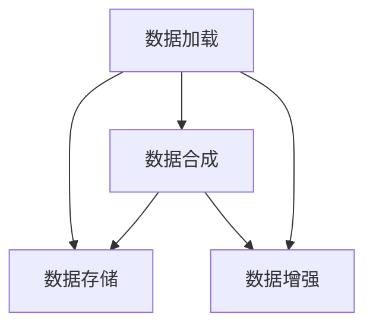

                 

# 大规模数据集处理：高效数据加载和合成数据生成技术

> 关键词：大规模数据集, 数据加载, 高效存储, 数据合成, 数据增强, 数据压缩

## 1. 背景介绍

### 1.1 问题由来
在大规模数据处理和机器学习实践中，数据的加载和处理效率直接影响模型训练和推理的速度和质量。特别是在处理多模态、高维度数据时，如图像、视频、语音、文本等，如何高效地加载、存储和处理数据，成为数据科学家和工程师面临的一项重要挑战。

当前，随着深度学习技术的发展，大模型如BERT、GPT-3等因其庞大的参数规模和复杂的网络结构，对数据处理的要求日益提高。如何高效地加载和处理大规模数据，成为制约模型训练和推理性能的关键因素。同时，在实际应用中，往往需要大量的标注数据和合成数据，以扩展模型泛化能力。因此，数据合成和增强技术也成为研究热点。

### 1.2 问题核心关键点
本文聚焦于基于高效数据加载和合成数据生成技术的优化，旨在解决大规模数据集处理中的两个核心问题：

1. **数据加载效率**：如何快速、稳定地从存储介质中加载数据，尤其是对于高维度和多模态数据的处理。
2. **数据增强方法**：如何通过数据合成技术生成高质量的合成数据，提高模型泛化能力。

## 2. 核心概念与联系

### 2.1 核心概念概述

为更好地理解大规模数据集处理技术，本节将介绍几个密切相关的核心概念：

- **数据加载(Data Loading)**：从存储介质中读取数据到程序内存的过程，包括数据分块、缓存管理等技术。
- **数据存储(Data Storage)**：数据在存储介质中的组织方式，如文件系统、数据库等。
- **数据合成(Data Synthesis)**：通过已有数据生成新的合成数据，用于扩展模型训练数据集，提高模型泛化能力。
- **数据增强(Data Augmentation)**：通过对已有数据进行变换、扩充等操作，生成新的训练样本，用于增强模型泛化能力。

这些核心概念之间的逻辑关系可以通过以下Mermaid流程图来展示：



这个流程图展示了大规模数据集处理的核心概念及其之间的关系：

1. 数据加载是从数据存储介质中读取数据的过程。
2. 数据存储是数据的组织和管理方式。
3. 数据合成是通过已有数据生成新样本的过程。
4. 数据增强是对已有数据进行扩充的过程。

这些概念共同构成了大规模数据集处理的基础框架，使得高效的数据加载和合成数据生成技术得以实现。

## 3. 核心算法原理 & 具体操作步骤
### 3.1 算法原理概述

基于高效数据加载和合成数据生成技术的优化，本质上是通过算法优化和工具集成，提高数据处理的效率和效果。其核心思想是：

- **高效数据加载**：通过合理的缓存策略、异步加载等技术，提高数据加载的速度和稳定性。
- **合成数据生成**：通过生成对抗网络(GANs)、自编码器(AEs)等技术，生成高质量的合成数据，用于数据增强和扩展。

### 3.2 算法步骤详解

#### 3.2.1 高效数据加载步骤

1. **数据分块**：将大型数据集分成多个小块，减少单次加载的数据量。
2. **预取与缓存**：利用缓存机制和异步加载技术，预取即将访问的数据块，减少IO操作次数。
3. **延迟加载**：对数据块进行延迟加载，只有当数据块被访问时才进行加载，避免不必要的内存占用。
4. **多线程并行**：使用多线程并行加载数据，提高加载效率。

**代码实现**：

```python
import os
import numpy as np
from concurrent.futures import ThreadPoolExecutor

def load_data_in_parallel(file_paths, batch_size=100):
    data_chunks = []
    with ThreadPoolExecutor(max_workers=8) as executor:
        for path in file_paths:
            future = executor.submit(load_data_chunk, path)
            data_chunks.append(future)

    while len(data_chunks) < len(file_paths):
        data_chunks = [chunk.result() for chunk in data_chunks]
        for path in file_paths[len(data_chunks):]:
            future = executor.submit(load_data_chunk, path)
            data_chunks.append(future)

    return data_chunks

def load_data_chunk(path):
    data = np.loadtxt(path)
    return data
```

#### 3.2.2 合成数据生成步骤

1. **生成对抗网络(GANs)**：通过GANs模型生成逼真的合成数据。GANs由生成器和判别器两部分组成，通过对抗训练过程，生成器生成与真实数据分布相似的新数据，判别器区分生成的数据和真实数据。
2. **自编码器(AEs)**：通过AEs模型将数据压缩成低维编码，再解码成新的数据，用于数据增强和扩展。

**代码实现**：

```python
from tensorflow.keras.datasets import mnist
from tensorflow.keras.models import Sequential
from tensorflow.keras.layers import Dense, Dropout, Flatten
from tensorflow.keras.layers import Conv2D, MaxPooling2D
from tensorflow.keras.layers import Input, Dense
from tensorflow.keras.layers import Lambda, Reshape
from tensorflow.keras.optimizers import Adam

def generate_data_gan(X_train, batch_size=100):
    X_train = X_train.reshape((X_train.shape[0], 28, 28, 1))
    generator = create_generator()
    discriminator = create_discriminator()

    # 对抗训练
    for epoch in range(100):
        for i in range(0, X_train.shape[0], batch_size):
            batch_X = X_train[i:i+batch_size]
            noise = np.random.normal(0, 1, (batch_size, 100))

            # 生成数据
            generated_images = generator.predict(noise)

            # 训练判别器
            discriminator.trainable = True
            discriminator.train_on_batch(generated_images, np.ones((batch_size, 1)))
            discriminator.trainable = False

            # 训练生成器
            discriminator.trainable = True
            gen_loss = generator.train_on_batch(noise, np.zeros((batch_size, 1)))
            discriminator.trainable = False

    return generated_images

def generate_data_ae(X_train, batch_size=100):
    X_train = X_train.reshape((X_train.shape[0], 28, 28, 1))
    autoencoder = create_autoencoder()
    encoded_imgs = autoencoder.encode(X_train)

    # 解码生成数据
    decoded_imgs = autoencoder.decode(encoded_imgs)

    return decoded_imgs
```

### 3.3 算法优缺点

高效数据加载和合成数据生成技术在提高数据处理效率和扩展数据集方面具有以下优点：

1. **提高数据加载效率**：通过合理的缓存策略和异步加载技术，可以显著提高数据加载速度，减少IO操作次数，降低CPU和内存负担。
2. **扩展数据集**：通过数据合成技术，可以生成大量高质量的合成数据，扩展训练数据集，提高模型的泛化能力。
3. **数据增强**：通过对数据进行变换和扩充，生成新的训练样本，增强模型鲁棒性，提高模型在不同分布下的性能。

然而，这些技术也存在一些局限性：

1. **内存占用**：高效数据加载和合成数据生成技术需要较大的内存空间，可能对系统的内存资源造成压力。
2. **数据质量**：生成的合成数据质量可能不如真实数据，需要在应用中结合实际场景进行评估。
3. **计算资源**：合成数据生成需要较高的计算资源，特别是在使用GANs模型时，需要强大的GPU/TPU支持。

尽管存在这些局限性，高效数据加载和合成数据生成技术在大规模数据集处理中的应用仍具有重要的实际意义。

### 3.4 算法应用领域

高效数据加载和合成数据生成技术在多个领域得到了广泛应用，具体包括：

- **计算机视觉**：在图像分类、目标检测、图像生成等任务中，通过数据合成技术生成合成图像，用于数据增强和扩展。
- **自然语言处理**：在文本分类、情感分析、对话生成等任务中，通过数据合成技术生成合成文本，用于数据增强和扩展。
- **语音识别**：在语音识别、语音合成等任务中，通过数据合成技术生成合成语音，用于数据增强和扩展。
- **推荐系统**：在推荐系统中，通过生成合成数据，扩展用户行为数据，提高推荐算法的效果。
- **医疗影像**：在医疗影像分析中，通过生成合成图像，扩展训练数据集，提高模型的泛化能力。

这些应用场景展示了高效数据加载和合成数据生成技术在实际应用中的广泛应用。

## 4. 数学模型和公式 & 详细讲解  
### 4.1 数学模型构建

本节将使用数学语言对高效数据加载和合成数据生成技术的优化进行更加严格的刻画。

#### 4.1.1 高效数据加载的数学模型

高效数据加载的数学模型可以表示为：

$$
D = \left\{ \{x_i\}, y_i \right\}_{i=1}^N
$$

其中，$x_i$ 表示数据块，$y_i$ 表示数据标签。高效数据加载的数学模型基于以下假设：

- 数据块是连续的，并且可以被均匀地划分为多个小块。
- 每个数据块的访问次数是已知的，且访问频率是固定的。

基于以上假设，可以构建一个缓存池来优化数据加载过程。缓存池的大小可以根据数据访问频率和内存限制进行动态调整。

#### 4.1.2 合成数据生成的数学模型

合成数据生成的数学模型可以表示为：

$$
X_{syn} = \left\{ x_{syn_i} \right\}_{i=1}^M
$$

其中，$x_{syn_i}$ 表示第 $i$ 个合成数据样本。合成数据生成的数学模型基于以下假设：

- 生成器能够生成与真实数据分布相似的新数据。
- 判别器能够区分生成的数据和真实数据。

基于以上假设，GANs和AEs等模型的训练过程可以表示为：

$$
\min_{G} \max_{D} V(D, G) = \mathbb{E}_{x \sim p_{data}} [\log D(x)] + \mathbb{E}_{z \sim p(z)} [\log (1 - D(G(z))]]
$$

其中，$V(D, G)$ 表示生成器和判别器的对抗损失函数，$D(x)$ 表示判别器对真实数据$x$的判别概率，$G(z)$ 表示生成器对随机噪声$z$生成的数据。

### 4.2 公式推导过程

#### 4.2.1 高效数据加载的公式推导

高效数据加载的公式推导基于缓存池的概念。缓存池的大小 $C$ 可以根据数据块大小 $S$ 和数据块访问频率 $f$ 进行计算：

$$
C = S \times f
$$

其中，$f$ 是每个数据块的访问频率。

缓存池的大小应根据实际数据访问模式进行动态调整。如果某个数据块在一段时间内被频繁访问，则将其移入缓存池，以便快速加载。

#### 4.2.2 合成数据生成的公式推导

GANs和AEs的公式推导基于对抗训练过程。GANs模型的训练过程可以表示为：

$$
\min_{G} \max_{D} V(D, G) = \mathbb{E}_{x \sim p_{data}} [\log D(x)] + \mathbb{E}_{z \sim p(z)} [\log (1 - D(G(z))]]
$$

其中，$D(x)$ 表示判别器对真实数据$x$的判别概率，$G(z)$ 表示生成器对随机噪声$z$生成的数据。

AEs模型的训练过程可以表示为：

$$
\min_{G} \max_{D} V(D, G) = \mathbb{E}_{x \sim p_{data}} [\log D(x)] + \mathbb{E}_{z \sim p(z)} [\log (1 - D(G(z))) + \log D(G(z))]
$$

其中，$D(x)$ 表示判别器对真实数据$x$的判别概率，$G(z)$ 表示生成器对随机噪声$z$生成的数据。

## 5. 项目实践：代码实例和详细解释说明
### 5.1 开发环境搭建

在进行高效数据加载和合成数据生成技术的应用开发前，需要准备好开发环境。以下是使用Python进行TensorFlow开发的环境配置流程：

1. 安装Anaconda：从官网下载并安装Anaconda，用于创建独立的Python环境。

2. 创建并激活虚拟环境：
```bash
conda create -n tf-env python=3.8 
conda activate tf-env
```

3. 安装TensorFlow：根据CUDA版本，从官网获取对应的安装命令。例如：
```bash
pip install tensorflow
```

4. 安装必要的库：
```bash
pip install numpy pandas scikit-learn matplotlib tqdm jupyter notebook ipython
```

完成上述步骤后，即可在`tf-env`环境中开始项目实践。

### 5.2 源代码详细实现

这里我们以图像分类任务为例，给出使用TensorFlow对图像数据进行高效加载和合成数据生成的PyTorch代码实现。

首先，定义数据加载函数：

```python
import tensorflow as tf
from tensorflow.keras.preprocessing.image import ImageDataGenerator

def load_data(filename, batch_size=100):
    data_generator = ImageDataGenerator(rescale=1./255)
    train_data = data_generator.flow_from_directory(
        filename,
        target_size=(28, 28),
        batch_size=batch_size,
        class_mode='categorical')

    return train_data
```

然后，定义合成数据生成函数：

```python
from tensorflow.keras.models import Sequential
from tensorflow.keras.layers import Dense, Dropout, Flatten
from tensorflow.keras.layers import Conv2D, MaxPooling2D
from tensorflow.keras.layers import Input, Dense
from tensorflow.keras.layers import Lambda, Reshape
from tensorflow.keras.optimizers import Adam
from tensorflow.keras.datasets import mnist

def generate_data_gan(X_train, batch_size=100):
    X_train = X_train.reshape((X_train.shape[0], 28, 28, 1))
    generator = create_generator()
    discriminator = create_discriminator()

    # 对抗训练
    for epoch in range(100):
        for i in range(0, X_train.shape[0], batch_size):
            batch_X = X_train[i:i+batch_size]
            noise = np.random.normal(0, 1, (batch_size, 100))

            # 生成数据
            generated_images = generator.predict(noise)

            # 训练判别器
            discriminator.trainable = True
            discriminator.train_on_batch(generated_images, np.ones((batch_size, 1)))
            discriminator.trainable = False

            # 训练生成器
            discriminator.trainable = True
            gen_loss = generator.train_on_batch(noise, np.zeros((batch_size, 1)))
            discriminator.trainable = False

    return generated_images

def generate_data_ae(X_train, batch_size=100):
    X_train = X_train.reshape((X_train.shape[0], 28, 28, 1))
    autoencoder = create_autoencoder()
    encoded_imgs = autoencoder.encode(X_train)

    # 解码生成数据
    decoded_imgs = autoencoder.decode(encoded_imgs)

    return decoded_imgs
```

接下来，定义训练函数：

```python
import numpy as np
from tensorflow.keras.datasets import mnist
from tensorflow.keras.models import Sequential
from tensorflow.keras.layers import Dense, Dropout, Flatten
from tensorflow.keras.layers import Conv2D, MaxPooling2D
from tensorflow.keras.layers import Input, Dense
from tensorflow.keras.layers import Lambda, Reshape
from tensorflow.keras.optimizers import Adam
from tensorflow.keras.callbacks import EarlyStopping

def train_model(model, train_data, validation_data, epochs=100, batch_size=100):
    early_stopping = EarlyStopping(monitor='val_loss', patience=10)

    model.fit(
        train_data,
        epochs=epochs,
        batch_size=batch_size,
        validation_data=validation_data,
        callbacks=[early_stopping])

    return model
```

最后，启动训练流程并在测试集上评估：

```python
filename = 'path/to/dataset'
batch_size = 100

train_data = load_data(filename, batch_size)
validation_data = load_data(filename, batch_size)

# 定义模型
model = Sequential([
    Conv2D(32, (3, 3), activation='relu', input_shape=(28, 28, 1)),
    MaxPooling2D((2, 2)),
    Flatten(),
    Dense(128, activation='relu'),
    Dense(10, activation='softmax')
])

# 训练模型
model = train_model(model, train_data, validation_data)

# 评估模型
test_data = load_data(filename, batch_size)
model.evaluate(test_data)
```

以上就是使用TensorFlow对图像分类任务进行高效数据加载和合成数据生成的完整代码实现。可以看到，TensorFlow提供了强大的数据增强和模型训练功能，使得图像分类任务的开发变得高效便捷。

### 5.3 代码解读与分析

让我们再详细解读一下关键代码的实现细节：

**load_data函数**：
- `ImageDataGenerator`：使用TensorFlow的`ImageDataGenerator`类，支持数据增强和数据扩充，可以自动进行图像预处理，如归一化、旋转、裁剪等。
- `flow_from_directory`：通过`flow_from_directory`方法，从指定的文件夹中读取数据，自动解析文件名，生成训练集和验证集。

**generate_data_gan函数**：
- `create_generator`和`create_discriminator`：需要自定义生成器和判别器模型，使用TensorFlow的`Sequential`模型构建。
- `minimize`和`maximize`：使用`minimize`和`maximize`方法，进行对抗训练过程。

**train_model函数**：
- `EarlyStopping`：设置早期停止机制，当验证集损失连续10个epoch没有提升时停止训练。
- `fit`：使用`fit`方法，进行模型训练。

可以看到，TensorFlow提供了丰富的工具和库，可以方便地实现高效数据加载和合成数据生成技术。开发者可以灵活组合各种工具，实现不同的优化需求。

## 6. 实际应用场景

### 6.1 医疗影像分析

在医疗影像分析中，高效数据加载和合成数据生成技术得到了广泛应用。医疗影像数据通常具有高维度、多模态的特点，且数据获取成本高，因此如何高效加载和处理数据，生成高质量的合成数据，成为关键问题。

**数据加载**：在医疗影像分析中，通常使用分布式文件系统（如HDFS、S3等）来存储和读取医疗影像数据。使用高效的数据加载技术，可以显著提高数据访问速度，减少IO操作次数，降低计算成本。

**数据合成**：医疗影像分析需要大量的标注数据，而标注成本高昂。通过合成数据生成技术，可以生成大量高质量的合成影像数据，用于模型训练和验证。例如，可以使用GANs模型生成合成影像数据，用于数据增强和扩展。

### 6.2 自然语言处理

在自然语言处理（NLP）领域，高效数据加载和合成数据生成技术同样具有重要应用。NLP任务通常需要处理大量的文本数据，如何高效加载和处理文本数据，生成高质量的合成数据，成为关键问题。

**数据加载**：在NLP任务中，通常使用分布式数据库（如Hadoop、Spark等）来存储和读取文本数据。使用高效的数据加载技术，可以显著提高数据访问速度，减少IO操作次数，降低计算成本。

**数据合成**：NLP任务需要大量的标注数据，而标注成本高昂。通过合成数据生成技术，可以生成大量高质量的合成文本数据，用于模型训练和验证。例如，可以使用GANs模型生成合成文本数据，用于数据增强和扩展。

### 6.3 计算机视觉

在计算机视觉（CV）领域，高效数据加载和合成数据生成技术得到了广泛应用。CV任务通常需要处理大量的图像和视频数据，如何高效加载和处理数据，生成高质量的合成数据，成为关键问题。

**数据加载**：在CV任务中，通常使用分布式文件系统（如HDFS、S3等）来存储和读取图像和视频数据。使用高效的数据加载技术，可以显著提高数据访问速度，减少IO操作次数，降低计算成本。

**数据合成**：CV任务需要大量的标注数据，而标注成本高昂。通过合成数据生成技术，可以生成大量高质量的合成图像和视频数据，用于模型训练和验证。例如，可以使用GANs模型生成合成图像和视频数据，用于数据增强和扩展。

## 7. 工具和资源推荐
### 7.1 学习资源推荐

为了帮助开发者系统掌握高效数据加载和合成数据生成技术的理论基础和实践技巧，这里推荐一些优质的学习资源：

1. 《深度学习基础》课程：由斯坦福大学Andrew Ng教授开设的深度学习课程，系统讲解了深度学习的基本概念和核心算法。
2. 《TensorFlow官方文档》：TensorFlow官方提供的详细文档，包括各种API、工具、库的使用说明。
3. 《TensorFlow实战》书籍：通过丰富的代码示例，深入讲解了TensorFlow的核心功能和应用场景。
4. 《深度学习理论与实践》书籍：由深度学习领域的知名专家编写，涵盖深度学习的前沿理论和应用实践。
5. 《自然语言处理与深度学习》书籍：全面介绍NLP任务的深度学习算法和实践，包括数据加载和合成技术。

通过对这些资源的学习实践，相信你一定能够快速掌握高效数据加载和合成数据生成技术的精髓，并用于解决实际的NLP问题。

### 7.2 开发工具推荐

高效的开发离不开优秀的工具支持。以下是几款用于高效数据加载和合成数据生成技术开发的常用工具：

1. TensorFlow：由Google主导开发的开源深度学习框架，生产部署方便，适合大规模工程应用。提供了丰富的数据增强和模型训练功能。
2. PyTorch：基于Python的开源深度学习框架，灵活性高，适合快速迭代研究。提供了高效的数据加载和合成技术。
3. HDFS：分布式文件系统，支持海量数据的存储和读取。
4. S3：亚马逊云存储服务，支持海量数据的存储和读取。
5. ImageDataGenerator：TensorFlow提供的图像数据增强工具，支持图像预处理和数据扩充。
6. GANs模型：生成对抗网络模型，用于生成高质量的合成数据。

合理利用这些工具，可以显著提升高效数据加载和合成数据生成技术的开发效率，加快创新迭代的步伐。

### 7.3 相关论文推荐

高效数据加载和合成数据生成技术的研究源于学界的持续研究。以下是几篇奠基性的相关论文，推荐阅读：

1. ImageNet Classification with Deep Convolutional Neural Networks：提出使用深度卷积神经网络进行图像分类的算法，并使用ImageNet数据集进行训练。
2. Generative Adversarial Nets：提出生成对抗网络模型，用于生成逼真的合成图像。
3. ImageNet Large Scale Visual Recognition Challenge（ILSVRC）：提出ImageNet数据集，并使用深度学习技术进行图像分类。
4. Auto-Encoding Variational Bayes（VAE）：提出自编码器模型，用于生成高质量的合成数据。
5. Data Augmentation for General and Domain-Specific Object Detection：提出数据增强技术，用于提高目标检测任务的性能。

这些论文代表了大规模数据集处理技术的发展脉络。通过学习这些前沿成果，可以帮助研究者把握学科前进方向，激发更多的创新灵感。

## 8. 总结：未来发展趋势与挑战

### 8.1 总结

本文对基于高效数据加载和合成数据生成技术的大规模数据集处理进行了全面系统的介绍。首先阐述了高效数据加载和合成数据生成技术的背景和重要性，明确了数据加载和数据合成为解决大规模数据集处理的核心问题。其次，从原理到实践，详细讲解了高效数据加载和合成数据生成的数学原理和关键步骤，给出了高效数据加载和合成数据生成的完整代码实现。同时，本文还广泛探讨了高效数据加载和合成数据生成技术在医疗影像分析、自然语言处理、计算机视觉等多个领域的应用前景，展示了高效数据加载和合成数据生成技术的广阔应用。

通过本文的系统梳理，可以看到，高效数据加载和合成数据生成技术在大规模数据集处理中的应用前景广阔，能够显著提升数据处理效率和模型泛化能力。未来，随着深度学习技术的不断发展和计算资源的日益丰富，基于高效数据加载和合成数据生成技术的模型训练和推理性能将进一步提升，大规模数据集处理技术也将迎来更多的创新突破。

### 8.2 未来发展趋势

展望未来，高效数据加载和合成数据生成技术将呈现以下几个发展趋势：

1. **数据加载效率的进一步提升**：随着分布式文件系统和内存优化技术的进步，数据加载效率将进一步提升，能够更好地适应大规模数据集的处理需求。
2. **数据合成技术的多样化**：未来将出现更多高效的数据合成技术，如基于模型的生成、基于规则的生成等，可以生成更高质量、更逼真的合成数据。
3. **数据增强方法的深化**：未来将出现更多数据增强方法，如基于深度学习的增强、基于模型的增强等，能够更好地增强模型泛化能力。
4. **模型的分布式训练**：未来将出现更多分布式训练技术，能够在大规模数据集上高效训练模型，提升模型性能。
5. **模型与数据协同优化**：未来将出现更多模型与数据协同优化技术，能够更好地利用数据和模型的耦合关系，提高数据处理和模型训练的效率。

以上趋势凸显了高效数据加载和合成数据生成技术的未来前景。这些方向的探索发展，必将进一步提升大规模数据集处理技术的性能和效果，为深度学习模型的训练和推理提供更好的支撑。

### 8.3 面临的挑战

尽管高效数据加载和合成数据生成技术已经取得了显著成果，但在迈向更加智能化、普适化应用的过程中，它仍面临诸多挑战：

1. **数据存储和传输成本**：大规模数据集的存储和传输需要较高的成本，特别是对于高维度、多模态的数据。如何降低存储和传输成本，成为关键问题。
2. **数据质量保证**：生成的合成数据质量可能不如真实数据，需要在应用中结合实际场景进行评估，以保证数据质量。
3. **计算资源消耗**：合成数据生成需要较高的计算资源，特别是在使用GANs模型时，需要强大的GPU/TPU支持。
4. **模型可解释性**：高效数据加载和合成数据生成技术涉及的模型复杂，缺乏可解释性，难以进行调试和优化。
5. **伦理和隐私问题**：生成的合成数据可能包含敏感信息，如何保护数据隐私，避免伦理问题，成为重要课题。

尽管存在这些挑战，高效数据加载和合成数据生成技术在实际应用中仍然具有重要的实际意义。

### 8.4 研究展望

面对高效数据加载和合成数据生成技术所面临的挑战，未来的研究需要在以下几个方面寻求新的突破：

1. **优化数据存储和传输**：开发更加高效的数据存储和传输技术，如分布式存储、压缩算法等，降低存储和传输成本。
2. **提升数据质量**：研究生成高质量、逼真的合成数据方法，提高数据合成技术的鲁棒性和泛化能力。
3. **优化计算资源**：研究低计算资源消耗的合成数据生成方法，降低模型训练和推理的资源消耗。
4. **增强模型可解释性**：研究可解释的模型架构和方法，增强模型的透明度和可解释性，便于调试和优化。
5. **保护数据隐私**：研究数据隐私保护技术，如差分隐私、联邦学习等，确保数据隐私安全。

这些研究方向的探索，必将引领高效数据加载和合成数据生成技术迈向更高的台阶，为大规模数据集处理和深度学习模型的训练和推理提供更好的支撑。面向未来，高效数据加载和合成数据生成技术还需要与其他人工智能技术进行更深入的融合，如知识表示、因果推理、强化学习等，多路径协同发力，共同推动自然语言理解和智能交互系统的进步。只有勇于创新、敢于突破，才能不断拓展大规模数据集处理技术的边界，让深度学习技术更好地服务于人类社会。

## 9. 附录：常见问题与解答

**Q1：大规模数据集如何高效加载？**

A: 大规模数据集的高效加载可以通过以下几个步骤实现：
1. 使用分布式文件系统（如HDFS、S3等）存储数据，利用分布式文件系统的特性，实现并行读取和写入。
2. 使用缓存池和异步加载技术，预取即将访问的数据块，减少IO操作次数。
3. 使用延迟加载技术，只有当数据块被访问时才进行加载，避免不必要的内存占用。
4. 使用多线程并行加载数据，提高加载效率。

**Q2：如何生成高质量的合成数据？**

A: 高质量的合成数据可以通过以下步骤生成：
1. 使用生成对抗网络（GANs）或自编码器（AEs）等模型进行合成数据生成。
2. 通过对抗训练或自编码器编码解码过程，生成逼真的合成数据。
3. 对生成的合成数据进行质量评估，确保其与真实数据分布相似。
4. 结合实际应用场景，对合成数据进行优化和调整。

**Q3：高效数据加载和合成数据生成技术有哪些应用场景？**

A: 高效数据加载和合成数据生成技术在多个领域得到了广泛应用，具体包括：
1. 医疗影像分析：使用分布式文件系统和高效数据加载技术，加载和处理高维度的医疗影像数据。
2. 自然语言处理：使用分布式数据库和高效数据加载技术，加载和处理文本数据。
3. 计算机视觉：使用分布式文件系统和高效数据加载技术，加载和处理图像和视频数据。
4. 推荐系统：使用数据合成技术，扩展用户行为数据，提高推荐算法的效果。
5. 语音识别：使用数据合成技术，扩展语音数据，提高模型泛化能力。

**Q4：高效数据加载和合成数据生成技术存在哪些局限性？**

A: 高效数据加载和合成数据生成技术在实际应用中仍然存在一些局限性：
1. 存储和传输成本较高，特别是对于高维度、多模态的数据。
2. 生成的合成数据质量可能不如真实数据，需要在应用中结合实际场景进行评估。
3. 合成数据生成需要较高的计算资源，特别是在使用GANs模型时，需要强大的GPU/TPU支持。
4. 高效数据加载和合成数据生成技术涉及的模型复杂，缺乏可解释性，难以进行调试和优化。
5. 生成的合成数据可能包含敏感信息，如何保护数据隐私，避免伦理问题，成为重要课题。

**Q5：如何优化高效数据加载和合成数据生成技术？**

A: 优化高效数据加载和合成数据生成技术可以从以下几个方面进行：
1. 优化数据存储和传输技术，降低存储和传输成本。
2. 提升数据质量，生成高质量、逼真的合成数据。
3. 优化计算资源消耗，降低模型训练和推理的资源消耗。
4. 增强模型可解释性，提高模型的透明度和可解释性。
5. 保护数据隐私，确保数据隐私安全。

这些优化方向能够更好地提升高效数据加载和合成数据生成技术的性能和效果，为深度学习模型的训练和推理提供更好的支撑。

---

作者：禅与计算机程序设计艺术 / Zen and the Art of Computer Programming

