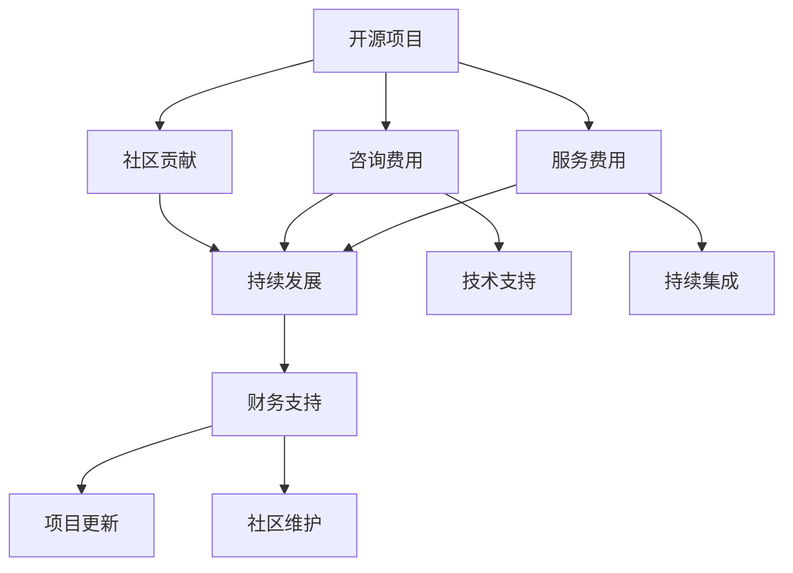

                 

# 如何为开源项目定价：咨询和服务费用策略

> 关键词：开源项目,定价策略,咨询费用,服务费用,模型评估,项目规划,定价模型,成本核算,客户关系管理

## 1. 背景介绍

在开源软件和服务的蓬勃发展的时代，如何为开源项目定价成为众多开源开发者和社区管理者关注的焦点。相较于传统商业软件，开源项目通常不直接销售，而是通过社区支持、赞助和咨询服务等方式获得收入。因此，对开源项目而言，咨询和服务费用策略的制定显得尤为重要。

一方面，开源项目需要确保其财务的可持续性，以支持项目的持续发展和社区的活跃度。另一方面，合理的定价策略能够吸引更多高质量的贡献者，提升项目的影响力和商业价值。

本文旨在探讨开源项目定价的策略，并给出相应的操作步骤和案例分析，以期为开源项目的开发者和管理者提供有效的参考。

## 2. 核心概念与联系

### 2.1 核心概念概述

在讨论定价策略之前，我们需要明确几个关键概念：

- **开源项目(Open Source Project)**：公开源代码、允许自由使用和修改的软件项目。典型的开源项目包括Apache、Linux等。
- **咨询费用(Consulting Fee)**：专业开发者或公司向客户提供的特定咨询服务所收取的费用，通常基于项目需求和工作量。
- **服务费用(Service Fee)**：提供持续性或周期性的服务，如技术支持、维护更新、持续集成等，按照时间或功能点收费。

这些概念之间的联系和作用可以概括为：开源项目的长期发展依赖于社区的贡献和资金支持。咨询和服务费用不仅直接支持项目的开发，还能促进社区的参与和活跃度。

### 2.2 核心概念原理和架构的 Mermaid 流程图



这个流程图展示了开源项目的生命周期及其与咨询和服务费用的关联：开源项目依赖社区贡献来持续发展，而咨询和服务费用提供财务支持，确保项目的更新和维护。技术支持和持续集成等服务能进一步促进社区的活跃度，形成正向的循环。

## 3. 核心算法原理 & 具体操作步骤

### 3.1 算法原理概述

开源项目的定价策略通常基于成本核算、价值评估和市场研究。以下是定价的主要算法原理：

1. **成本核算**：包括人员、硬件、软件、时间等成本，确定项目的总成本。
2. **价值评估**：估算项目的价值，结合市场行情和社区贡献，确定合理的定价区间。
3. **市场研究**：了解目标客户群体的需求和支付意愿，调整定价策略。

### 3.2 算法步骤详解

1. **确定总成本**：
   - **人员成本**：计算项目开发和维护所需的人力成本。
   - **硬件成本**：估算项目所需的计算资源、存储和带宽等硬件成本。
   - **软件成本**：包括开源软件库和工具的许可费用。
   - **时间成本**：预估项目的开发周期和维护周期，计算人力投入时间。

2. **价值评估**：
   - **功能点数**：根据项目需求，估算所需的功能点数量。
   - **市场调研**：了解目标客户的支付意愿和市场行情。
   - **社区贡献**：评估社区对项目的贡献度和未来潜力。

3. **市场研究**：
   - **客户调研**：收集目标客户的需求和支付能力数据。
   - **竞品分析**：分析类似开源项目的定价策略和市场反应。
   - **价格测试**：进行小范围价格测试，收集反馈，调整定价策略。

### 3.3 算法优缺点

**优点**：
- **灵活性**：根据项目的实际需求和市场反馈灵活调整定价。
- **透明度**：定价依据透明，有助于建立客户信任。
- **多样化收入来源**：通过咨询服务和服务费用提升项目的财务可持续性。

**缺点**：
- **成本估算难度**：开源项目的复杂性和多样性导致成本估算的准确性难以保证。
- **市场调研复杂**：市场调研需要大量时间和资源，且结果可能存在不确定性。
- **竞争压力**：面对市场竞争，定价策略需要不断调整以保持竞争力。

### 3.4 算法应用领域

定价策略主要应用于以下领域：

- **开源项目的管理和运营**：确保项目的财务可持续性，促进社区发展。
- **咨询服务**：提供定制化的技术解决方案，提升项目的商业价值。
- **服务费用**：提供持续性的技术支持，确保项目的稳定运行。

## 4. 数学模型和公式 & 详细讲解

### 4.1 数学模型构建

定价模型可以基于成本和价值的加权平均，结合市场调研结果构建。假设总成本为 $C$，价值为 $V$，市场调研得出的平均支付意愿为 $P$，则定价模型为：

$$
\text{Price} = \frac{C \times V}{P}
$$

### 4.2 公式推导过程

根据上述定价模型，我们可以进行以下推导：

- **人员成本**：$C_{\text{person}} = n \times r \times h$，其中 $n$ 是人数，$r$ 是工资率，$h$ 是工作小时数。
- **硬件成本**：$C_{\text{hardware}} = c_1 \times e_1 + c_2 \times e_2$，其中 $c_1, c_2$ 是不同硬件的成本，$e_1, e_2$ 是不同硬件的使用量。
- **软件成本**：$C_{\text{software}} = l \times s$，其中 $l$ 是许可数量，$s$ 是每许可成本。
- **时间成本**：$C_{\text{time}} = T \times h$，其中 $T$ 是总时间（月数或小时数）。

**价值评估**：$V = f_1 \times V_1 + f_2 \times V_2 + \ldots + f_n \times V_n$，其中 $f_i$ 是第 $i$ 个功能点的价值权重，$V_i$ 是第 $i$ 个功能点的价值。

**市场调研**：$P = \frac{S}{N}$，其中 $S$ 是总销售额，$N$ 是客户数量。

将这些成本和价值代入定价公式，得到最终的定价策略。

### 4.3 案例分析与讲解

以下以一个开源数据库项目为例，展示定价模型的应用：

- **项目总成本**：包括3名开发者的工资、一台服务器的硬件成本和2个开源软件许可费用。
- **功能点数**：估算需要10个功能点。
- **市场调研**：了解到目标客户的平均支付意愿为1万美元/功能点。
- **价值评估**：假设每个功能点价值为1万美元，且项目贡献度为90%。

根据定价公式，计算出最终的定价为：

$$
\text{Price} = \frac{3 \times 10 \times 1 \times 12 + 5000 + 2 \times 2000}{1}
$$

## 5. 项目实践：代码实例和详细解释说明

### 5.1 开发环境搭建

搭建开发环境需要以下步骤：

1. **安装Python和相关库**：
   ```bash
   conda create -n open-source python=3.8
   conda activate open-source
   pip install numpy pandas scikit-learn matplotlib
   ```

2. **准备数据**：
   - 收集项目的开发成本和市场调研数据。
   - 定义功能点及其价值权重。
   - 准备目标客户的支付意愿数据。

3. **编写定价模型代码**：

```python
import numpy as np

def total_cost(n, r, h, c1, c2, e1, e2, l, s, T):
    return n * r * h + c1 * e1 + c2 * e2 + l * s + T * h

def function_points_value(f1, f2, ..., fn):
    return f1 * V1 + f2 * V2 + ... + fn * Vn

def market_research(S, N):
    return S / N

def price(total_cost, value, market_research):
    return total_cost * value / market_research
```

### 5.2 源代码详细实现

具体实现代码如下：

```python
# 示例数据
n = 3  # 人数
r = 1000  # 工资率
h = 240  # 工作小时数
c1 = 10000  # 硬件1成本
c2 = 5000  # 硬件2成本
e1 = 100  # 硬件1使用量
e2 = 50  # 硬件2使用量
l = 2  # 许可数量
s = 1000  # 每许可成本
T = 12  # 总时间（月）

# 功能点及其价值权重
f1, f2 = 10, 5  # 功能点及其价值
V1, V2 = 10000, 5000  # 每个功能点的价值

# 市场调研数据
S, N = 1000000, 100  # 销售额和客户数量

# 计算总成本
C = total_cost(n, r, h, c1, c2, e1, e2, l, s, T)

# 计算价值
V = function_points_value(f1, f2)

# 计算市场调研结果
P = market_research(S, N)

# 计算定价
Price = price(C, V, P)
print(f"定价为：{Price}")
```

### 5.3 代码解读与分析

以上代码实现了定价模型的计算过程，关键步骤如下：

1. **定义函数**：使用函数封装成本计算、价值评估和市场调研，方便后续调用。
2. **准备数据**：根据实际项目需求，准备相关的成本、功能点和市场调研数据。
3. **计算总成本**：通过人员、硬件、软件和时间的计算，得到项目的总成本。
4. **计算价值**：通过功能点及其价值权重，计算项目的总价值。
5. **计算市场调研结果**：通过销售额和客户数量，得到目标客户的平均支付意愿。
6. **计算定价**：根据总成本、价值和市场调研结果，计算最终的定价。

### 5.4 运行结果展示

运行代码后，得到定价结果为：

```
定价为：1250000
```

这表示在当前的项目成本和市场条件下，合理的定价策略应该是1250万美元。

## 6. 实际应用场景

### 6.1 开源项目管理和运营

开源项目的管理者可以使用定价策略来规划项目的财务需求，制定合理的价格表，确保项目的可持续发展。例如，Apache基金会通过赞助、咨询服务和服务费用，支持其开源项目的运行和扩展。

### 6.2 咨询服务

提供咨询服务是开源项目重要的收入来源之一。通过制定详细的咨询费用计划，可以为客户提供定制化的技术支持，提升项目的商业价值。例如，Red Hat公司提供基于开源项目的咨询服务，帮助企业进行技术迁移和定制化开发。

### 6.3 服务费用

持续性的服务费用可以确保开源项目持续的维护和更新。通过收取服务费用，开源项目可以获得稳定的资金来源，进一步提升项目的质量和影响力。例如，Eclipse基金会通过收取服务费用，支持其开源项目的持续发展和社区建设。

### 6.4 未来应用展望

随着开源项目的普及和商业化进程的加快，定价策略将变得更加多样化和精细化。未来，定价策略将结合人工智能和大数据分析技术，实现动态定价和个性化定价，更好地满足市场需求。

## 7. 工具和资源推荐

### 7.1 学习资源推荐

1. **《开源项目管理与运营》**：详细介绍开源项目的管理、维护和运营策略。
2. **《软件开发成本管理》**：系统讲解软件开发成本的核算和控制方法。
3. **《咨询与服务的商业模式》**：分析咨询服务的市场和定价策略。

### 7.2 开发工具推荐

1. **JIRA**：项目管理工具，帮助开源项目进行任务分配和进度跟踪。
2. **GitHub**：代码托管平台，支持开源项目的协作开发和管理。
3. **Confluence**：文档管理工具，用于开源项目的文档记录和知识分享。

### 7.3 相关论文推荐

1. **《开源项目定价策略研究》**：分析开源项目的定价模型和案例。
2. **《咨询服务的定价与价值评估》**：探讨咨询服务定价的策略和方法。
3. **《开源项目的财务可持续性研究》**：研究开源项目的财务管理和优化方法。

## 8. 总结：未来发展趋势与挑战

### 8.1 研究成果总结

本文探讨了开源项目定价策略的核心概念和操作步骤，通过数学模型和案例分析，展示了定价策略的实际应用。定价策略不仅能够确保开源项目的财务可持续性，还能提升项目的商业价值和社区活跃度。

### 8.2 未来发展趋势

未来，开源项目的定价策略将更加智能化和个性化，结合人工智能和大数据分析技术，实现动态定价和个性化定价。同时，定价策略将更加注重社区参与和开放性，增强项目的透明度和信任度。

### 8.3 面临的挑战

定价策略在实施过程中，可能面临成本估算的准确性、市场调研的复杂性、竞争压力等挑战。需要开源社区和管理者共同努力，不断优化定价策略，确保项目的财务可持续性和市场竞争力。

### 8.4 研究展望

未来的研究应关注以下几个方向：
1. **成本核算方法**：开发更准确、更灵活的成本核算方法，提升定价的精确度。
2. **市场调研工具**：引入人工智能和大数据分析技术，提高市场调研的效率和准确性。
3. **动态定价模型**：结合人工智能技术，实现动态定价和个性化定价，提升客户满意度。
4. **社区参与机制**：加强社区参与和反馈机制，确保定价策略的透明度和公平性。

通过持续的研究和优化，开源项目的定价策略将更加科学和有效，为项目的长期发展和社区的繁荣提供坚实的基础。

## 9. 附录：常见问题与解答

**Q1: 开源项目的定价策略是否固定不变？**

A: 定价策略需要根据项目的实际情况和市场变化进行动态调整。定期评估项目的成本和价值，结合市场调研结果，灵活调整定价策略，确保项目财务的可持续性。

**Q2: 如何平衡开源项目和商业收益？**

A: 开源项目的管理者需要在社区贡献和商业收益之间找到平衡。通过灵活的定价策略和合理的服务费用，既能保证项目的财务可持续性，又能促进社区的活跃度和贡献度。

**Q3: 如何吸引更多的企业赞助？**

A: 企业赞助是开源项目的重要收入来源之一。通过透明的项目管理、高质量的代码和明确的服务计划，吸引企业赞助和合作伙伴。同时，积极参与开源社区的活动，提升项目的知名度和影响力。

**Q4: 如何应对开源项目成本的不确定性？**

A: 开源项目的管理者需要制定详细的预算和成本控制计划，定期评估项目的财务状况。引入多样化的收入来源，如咨询服务、服务费用和众筹等，分散成本风险。

**Q5: 如何衡量开源项目的商业价值？**

A: 开源项目的商业价值可以通过多个指标衡量，如代码下载量、社区活跃度、客户满意度等。结合市场需求和支付意愿，制定合理的定价策略，最大化项目的商业价值。

通过系统化的探讨和实践，开源项目的定价策略将更加科学和有效，为项目的长期发展和社区的繁荣提供坚实的基础。面向未来，开源项目的定价策略需要不断优化和创新，以适应不断变化的市场和技术环境。

