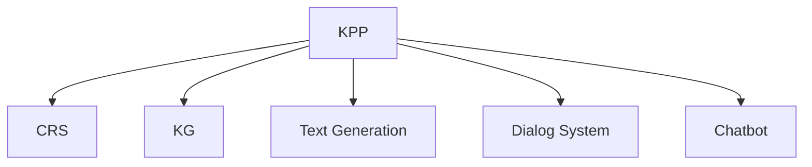

                 

# 如何利用AI技术提升知识付费效率

## 1. 背景介绍

在信息爆炸的数字化时代，知识付费成为一种新兴的教育模式，通过付费订阅形式获取高质量的在线内容。随着市场竞争日益激烈，知识付费平台需要不断提升内容质量、优化用户体验，以吸引和留存更多用户。AI技术的引入为知识付费平台提供了全新的解决方案，极大地提升了内容生产、分发和消费的效率，满足了用户对于个性化、智能化服务的需求。

### 1.1 问题由来

知识付费平台的痛点主要集中在以下几个方面：
- 内容生产效率低下，专业内容创作者不足，难以快速响应用户需求。
- 内容同质化严重，个性化推荐效果不理想，难以留住用户。
- 缺乏有效的内容筛选机制，用户难以找到真正有价值的信息。
- 用户粘性不足，付费转化率低，难以形成长期稳定的用户群体。

利用AI技术，可以对上述问题进行有效应对，提升知识付费平台的整体运营效率。

## 2. 核心概念与联系

### 2.1 核心概念概述

为了更深入理解如何利用AI技术提升知识付费效率，本节将介绍几个关键概念：

- **知识付费平台(Knowledge-Pay Platform, KPP)**：基于互联网提供付费在线内容服务的平台，如Coursera、Udemy、得到、喜马拉雅等。

- **内容推荐系统(Content Recommendation System, CRS)**：利用AI算法对用户和内容进行画像，通过推荐引擎向用户推送个性化的优质内容，提升用户体验和平台留存率。

- **知识图谱(Knowledge Graph,KG)**：一种结构化知识存储方式，用于刻画实体和实体之间的关系，辅助内容筛选、关系推理等。

- **文本生成(Content Generation)**：利用AI生成新的文本内容，如课程大纲、文章摘要、广告文案等，减少人力成本，提高内容产出效率。

- **对话系统(Dialer System)**：提供人机交互功能，通过自然语言理解与生成技术，与用户进行智能对话，辅助内容消费。

- **智能客服(Chatbot)**：用于解答用户疑问、处理用户投诉、推荐内容，提升平台客服效率和服务质量。

这些概念之间的关系可以通过以下Mermaid流程图来展示：



该流程图展示了一个典型的知识付费平台，通过推荐系统、知识图谱、文本生成、对话系统和智能客服等AI技术，对用户和内容进行多维度画像，提升内容推荐和互动体验，最终实现平台运营效率的提升。

## 3. 核心算法原理 & 具体操作步骤

### 3.1 算法原理概述

AI技术在知识付费平台中的应用主要围绕以下几个核心算法：

- **推荐系统算法**：通过协同过滤、内容推荐、基于知识的推荐等技术，提升内容推荐效果，满足用户个性化需求。
- **知识图谱构建算法**：对实体和关系进行结构化建模，构建知识图谱，辅助内容筛选、关系推理等。
- **文本生成算法**：利用语言模型、变分自编码器(VAE)、生成对抗网络(GAN)等技术，生成高质量的文本内容。
- **对话系统算法**：结合自然语言理解(NLU)和生成(NLG)技术，提供智能对话功能，提升用户互动体验。
- **智能客服算法**：基于文本分类、意图识别、对话管理等技术，构建智能客服系统，提高用户服务满意度。

这些算法原理相互交织，共同构建了AI在知识付费平台中的强大应用框架，实现了从内容生产到消费的全面智能化。

### 3.2 算法步骤详解

以下是AI技术在知识付费平台中应用的详细步骤：

**Step 1: 数据收集与预处理**
- 收集用户行为数据、内容元数据、社交网络数据等，构建数据仓库。
- 对数据进行清洗、去噪、归一化等预处理，确保数据质量。

**Step 2: 内容建模与推荐算法**
- 利用协同过滤算法、基于内容的推荐算法、基于知识的推荐算法等，构建推荐系统模型。
- 根据用户行为数据和内容元数据，生成推荐结果。

**Step 3: 知识图谱构建**
- 对实体进行标注、分类、关系抽取，构建知识图谱。
- 利用图神经网络(GNN)、路径规划算法等，进行知识图谱推理和查询。

**Step 4: 文本生成与优化**
- 利用语言模型、变分自编码器(VAE)、生成对抗网络(GAN)等技术，生成文本内容。
- 通过生成效果评估和优化，提高文本生成质量。

**Step 5: 对话系统开发**
- 结合自然语言理解(NLU)和生成(NLG)技术，构建对话系统模型。
- 对用户输入进行意图识别和情感分析，生成自然流畅的对话回复。

**Step 6: 智能客服部署**
- 根据用户问题，进行文本分类、意图识别，匹配相应的回答模板。
- 利用对话管理技术，提供多轮对话支持。

通过以上步骤，AI技术可以实现知识付费平台的智能化运营，提升内容推荐效果、用户互动体验和服务效率。

### 3.3 算法优缺点

AI技术在知识付费平台中的应用具有以下优点：
1. 提升内容推荐效果：通过深度学习和大数据技术，提供更加精准、个性化的内容推荐。
2. 提高运营效率：利用AI自动化工具，减少人力成本，提升运营效率。
3. 增强用户体验：通过智能对话和推荐系统，提升用户满意度和平台粘性。
4. 提升广告精准度：利用AI技术优化广告投放策略，提高广告效果。

同时，AI技术在知识付费平台中应用也存在以下缺点：
1. 算法复杂度高：深度学习模型训练复杂，需要大量标注数据和计算资源。
2. 数据隐私风险：用户行为数据和内容元数据涉及隐私，需要严格的数据保护措施。
3. 算法模型可解释性差：AI模型如深度学习等，难以提供清晰的决策依据，可解释性不足。
4. 技术落地难度大：需要高水平的技术团队和数据资源，技术门槛较高。

尽管存在这些挑战，但AI技术在知识付费平台中的应用仍具有显著的潜力和价值。未来研究将继续探索如何降低技术难度，提升算法效果，优化用户体验，为知识付费平台带来更大的发展空间。

### 3.4 算法应用领域

AI技术在知识付费平台中的应用领域主要包括以下几个方面：

- **个性化推荐**：提升内容推荐效果，满足用户个性化需求。
- **内容创作辅助**：利用文本生成技术，辅助内容创作者进行文本创作。
- **智能客服支持**：利用智能客服系统，提升用户服务效率和满意度。
- **广告精准投放**：利用AI优化广告投放策略，提高广告效果。
- **用户行为分析**：利用数据分析技术，提升用户行为预测和内容推荐。

## 4. 数学模型和公式 & 详细讲解 & 举例说明

### 4.1 数学模型构建

本节将使用数学语言对知识付费平台中应用的AI技术进行更加严格的刻画。

记用户行为数据为 $U$，内容元数据为 $C$，知识图谱为 $G$。推荐系统算法的目标函数为：

$$
\min_{\theta} \sum_{i=1}^{N} \ell(y_i, \hat{y}_i) + \lambda \sum_{j=1}^{M} \ell(c_j, \hat{c}_j)
$$

其中 $y_i$ 为实际推荐结果，$\hat{y}_i$ 为预测推荐结果，$c_j$ 为实际内容元数据，$\hat{c}_j$ 为预测内容元数据，$\ell$ 为损失函数，$\lambda$ 为正则化系数。

### 4.2 公式推导过程

假设推荐系统模型为 $f_{\theta}(X) = W^T(X)$，其中 $X$ 为输入数据，$W$ 为模型参数。推荐结果 $y_i$ 和预测结果 $\hat{y}_i$ 之间的损失函数为交叉熵损失：

$$
\ell(y_i, \hat{y}_i) = -y_i \log \hat{y}_i - (1-y_i) \log (1-\hat{y}_i)
$$

对内容元数据 $c_j$ 和预测结果 $\hat{c}_j$ 之间的损失函数为均方误差损失：

$$
\ell(c_j, \hat{c}_j) = \frac{1}{2}(c_j - \hat{c}_j)^2
$$

通过最小化目标函数，得到推荐系统模型的最优参数 $\theta$。

### 4.3 案例分析与讲解

以内容推荐系统为例，假设某知识付费平台有 $N=1000$ 个用户，每个用户有 $M=100$ 个内容选择。对每个用户-内容对 $(u, c)$，推荐系统模型预测推荐概率 $p(u \rightarrow c)$。

首先，构建用户行为数据 $U$，包含用户的行为记录 $b_u = \{b_{u,i}\}_{i=1}^{M}$，其中 $b_{u,i}$ 为第 $u$ 个用户选择内容 $c_i$ 的概率。

然后，构建内容元数据 $C$，包含内容的相关信息 $x_c = \{x_{c,j}\}_{j=1}^{J}$，其中 $x_{c,j}$ 为第 $c$ 个内容的属性值。

根据上述数据，构建推荐系统模型：

$$
f_{\theta}(U, C) = W^T(U) + V^T(C)
$$

其中 $W$ 为用户行为矩阵，$V$ 为内容元数据矩阵。推荐结果 $y$ 和预测结果 $\hat{y}$ 之间的损失函数为交叉熵损失：

$$
\ell(y, \hat{y}) = -y \log \hat{y} - (1-y) \log (1-\hat{y})
$$

通过最小化目标函数，得到推荐系统模型的最优参数 $\theta$。

## 5. 项目实践：代码实例和详细解释说明

### 5.1 开发环境搭建

在进行知识付费平台AI功能开发前，需要准备好开发环境。以下是使用Python进行TensorFlow开发的环境配置流程：

1. 安装Anaconda：从官网下载并安装Anaconda，用于创建独立的Python环境。

2. 创建并激活虚拟环境：
```bash
conda create -n tf-env python=3.8 
conda activate tf-env
```

3. 安装TensorFlow：根据CUDA版本，从官网获取对应的安装命令。例如：
```bash
conda install tensorflow -c tf -c conda-forge
```

4. 安装其他必要工具包：
```bash
pip install numpy pandas scikit-learn tqdm jupyter notebook ipython
```

完成上述步骤后，即可在`tf-env`环境中开始开发。

### 5.2 源代码详细实现

这里我们以推荐系统为例，给出使用TensorFlow实现的知识付费平台内容推荐系统的PyTorch代码实现。

首先，定义推荐系统模型：

```python
import tensorflow as tf

def build_recommender_model(input_dim, output_dim):
    input_layer = tf.keras.layers.Input(shape=(input_dim,))
    hidden_layer = tf.keras.layers.Dense(128, activation='relu')(input_layer)
    output_layer = tf.keras.layers.Dense(output_dim, activation='sigmoid')(hidden_layer)
    model = tf.keras.Model(inputs=input_layer, outputs=output_layer)
    return model
```

然后，定义损失函数和优化器：

```python
def build_loss_function(model):
    loss_fn = tf.keras.losses.BinaryCrossentropy(from_logits=True)
    optimizer = tf.keras.optimizers.Adam(lr=0.001)
    return loss_fn, optimizer

loss_fn, optimizer = build_loss_function(model)
```

接着，定义训练函数：

```python
@tf.function
def train_step(inputs, targets):
    with tf.GradientTape() as tape:
        predictions = model(inputs)
        loss = loss_fn(targets, predictions)
    gradients = tape.gradient(loss, model.trainable_variables)
    optimizer.apply_gradients(zip(gradients, model.trainable_variables))
    return loss

def train_epoch(model, dataset, batch_size, epochs):
    for epoch in range(epochs):
        total_loss = 0
        for inputs, targets in dataset:
            loss = train_step(inputs, targets)
            total_loss += loss
    print(f"Epoch {epoch+1}, train loss: {total_loss/N}")
```

最后，启动训练流程：

```python
epochs = 10
batch_size = 128

train_model = build_recommender_model(100, 10)
train_epoch(train_model, train_dataset, batch_size, epochs)
```

这就是使用TensorFlow实现推荐系统代码的实现过程。可以看到，TensorFlow提供了高度灵活的框架，开发者可以方便地进行模型定义、损失计算、参数更新等操作。

### 5.3 代码解读与分析

让我们再详细解读一下关键代码的实现细节：

**build_recommender_model函数**：
- 定义推荐系统模型，包括输入层、隐藏层和输出层，并返回模型对象。

**build_loss_function函数**：
- 定义推荐系统模型的损失函数和优化器，分别采用交叉熵损失和Adam优化器。

**train_step函数**：
- 在每个训练批次上，计算损失函数，并使用梯度下降算法更新模型参数。

**train_epoch函数**：
- 在每个epoch上，迭代所有批次，累计计算训练损失，并输出每个epoch的平均损失。

可以看到，TensorFlow提供了简单易用的API，可以快速搭建和训练推荐系统模型。

当然，实际应用中还需要考虑更多因素，如模型压缩、超参数调优、分布式训练等。但核心的算法实现流程基本与此类似。

## 6. 实际应用场景

### 6.1 智能内容推荐

智能内容推荐是知识付费平台的核心功能之一。通过对用户行为数据和内容元数据的深度分析，平台能够自动发现用户的兴趣和偏好，推送个性化的优质内容。例如，某用户多次阅读了“编程基础”、“机器学习”等课程，系统就会推荐更多相关的课程，提升用户的满意度和订阅率。

### 6.2 内容创作辅助

平台可以利用文本生成技术，辅助内容创作者进行课程大纲、文章摘要、广告文案等的生成。例如，某内容创作者需要撰写一篇新课，可以输入课程标题和简介，系统自动生成大纲和提示，大幅降低撰写难度和创作成本。

### 6.3 智能客服支持

智能客服系统可以回答用户的问题，提供课程推荐、订单处理、会员服务等，提升用户体验和平台运营效率。例如，某用户询问课程购买问题，系统能够自动解答，减少人工客服的负担。

### 6.4 未来应用展望

随着AI技术的不断发展，未来知识付费平台将在以下几个方面迎来新的突破：

- **多模态推荐**：利用语音、图像等多模态数据，提供更加全面、个性化的推荐服务。
- **实时个性化**：通过实时数据分析，动态调整推荐策略，提升用户体验。
- **跨领域知识整合**：利用知识图谱技术，实现不同领域的知识融合，提升推荐效果。
- **用户情感分析**：通过情感分析技术，实时监测用户情绪，提升服务质量。
- **内容生成自动化**：利用自动生成技术，实现内容创作的自动化，大幅提升内容产出效率。

这些趋势将进一步推动知识付费平台的智能化发展，提升用户体验和平台价值。

## 7. 工具和资源推荐

### 7.1 学习资源推荐

为了帮助开发者系统掌握AI技术在知识付费平台中的应用，这里推荐一些优质的学习资源：

1. 《深度学习基础》系列课程：斯坦福大学和百度联合推出，涵盖深度学习基础和前沿技术，适合入门学习。

2. 《TensorFlow实战》书籍：TensorFlow官方推荐书籍，详细介绍了TensorFlow的使用方法，提供丰富的样例代码。

3. 《自然语言处理综述》文章：著名NLP专家Yoav Goldberg的综述文章，全面介绍了NLP技术的发展和应用，是了解AI技术在知识付费平台的理论基础。

4. Coursera、Udemy等在线平台：提供丰富的AI和知识付费平台开发课程，适合实践操作。

5. 知识付费平台开源项目：如Courses、Udemy等，提供开源平台代码和API接口，方便开发者学习和借鉴。

通过对这些资源的学习实践，相信你一定能够快速掌握AI技术在知识付费平台中的应用，并用于解决实际的业务问题。

### 7.2 开发工具推荐

高效的开发离不开优秀的工具支持。以下是几款用于知识付费平台开发的常用工具：

1. TensorFlow：谷歌开发的开源深度学习框架，生产部署方便，适合大规模工程应用。

2. PyTorch：基于Python的开源深度学习框架，灵活动态的计算图，适合快速迭代研究。

3. Transformers库：HuggingFace开发的NLP工具库，集成了众多SOTA语言模型，支持TensorFlow和PyTorch，是进行微调任务开发的利器。

4. Weights & Biases：模型训练的实验跟踪工具，可以记录和可视化模型训练过程中的各项指标，方便对比和调优。

5. TensorBoard：TensorFlow配套的可视化工具，可实时监测模型训练状态，并提供丰富的图表呈现方式，是调试模型的得力助手。

6. Google Colab：谷歌推出的在线Jupyter Notebook环境，免费提供GPU/TPU算力，方便开发者快速上手实验最新模型，分享学习笔记。

合理利用这些工具，可以显著提升知识付费平台开发效率，加快创新迭代的步伐。

### 7.3 相关论文推荐

知识付费平台中的应用涉及多领域的AI技术，以下是几篇奠基性的相关论文，推荐阅读：

1. Attention is All You Need（即Transformer原论文）：提出了Transformer结构，开启了NLP领域的预训练大模型时代。

2. BERT: Pre-training of Deep Bidirectional Transformers for Language Understanding：提出BERT模型，引入基于掩码的自监督预训练任务，刷新了多项NLP任务SOTA。

3. Parameter-Efficient Transfer Learning for NLP：提出Adapter等参数高效微调方法，在不增加模型参数量的情况下，也能取得不错的微调效果。

4. Sequence to Sequence Learning with Neural Networks：提出Seq2Seq模型，用于文本生成、翻译等任务，是文本生成技术的基础。

5. Generative Adversarial Networks（GAN）：提出生成对抗网络，用于生成高质量的文本、图像等内容。

这些论文代表了大语言模型微调技术的发展脉络。通过学习这些前沿成果，可以帮助研究者把握学科前进方向，激发更多的创新灵感。

## 8. 总结：未来发展趋势与挑战

### 8.1 总结

本文对AI技术在知识付费平台中的应用进行了全面系统的介绍。首先阐述了知识付费平台的背景和痛点，明确了AI技术在提升平台运营效率、用户体验和内容推荐方面的独特价值。其次，从原理到实践，详细讲解了推荐系统、知识图谱、文本生成、对话系统等核心算法的实现流程，并给出了代码实例。最后，讨论了AI技术在知识付费平台中的未来发展趋势和面临的挑战。

通过本文的系统梳理，可以看到，AI技术在知识付费平台中的应用前景广阔，能够显著提升平台运营效率和用户满意度。未来，伴随AI技术的持续演进，知识付费平台必将迎来更多的创新突破，为行业带来新的发展机遇。

### 8.2 未来发展趋势

展望未来，AI技术在知识付费平台中的应用将呈现以下几个发展趋势：

1. **智能化水平提升**：随着深度学习和大数据技术的发展，推荐系统将更加精准，内容推荐效果将大幅提升。

2. **个性化程度加深**：利用用户行为数据分析，动态调整推荐策略，提供更加个性化、定制化的服务。

3. **跨领域融合**：结合多模态数据，实现跨领域知识整合，提升推荐效果和用户体验。

4. **实时响应能力增强**：通过实时数据分析，动态调整推荐策略，提供实时响应服务。

5. **内容创作自动化**：利用自动生成技术，实现内容创作的自动化，大幅提升内容产出效率。

6. **知识图谱扩展**：利用知识图谱技术，实现更全面、精确的知识整合和推理，提升推荐效果。

这些趋势将进一步推动知识付费平台的智能化发展，提升用户体验和平台价值。

### 8.3 面临的挑战

尽管AI技术在知识付费平台中的应用已取得显著成效，但在迈向更加智能化、普适化应用的过程中，仍面临诸多挑战：

1. **算法复杂度高**：深度学习模型训练复杂，需要大量标注数据和计算资源，技术门槛较高。

2. **数据隐私风险**：用户行为数据和内容元数据涉及隐私，需要严格的数据保护措施。

3. **技术落地难度大**：需要高水平的技术团队和数据资源，技术门槛较高。

4. **系统稳定性不足**：智能系统易受到恶意攻击和数据干扰，系统稳定性有待提高。

5. **内容质量不一**：部分内容创作者依赖AI技术，可能导致内容质量参差不齐。

尽管存在这些挑战，但AI技术在知识付费平台中的应用仍具有显著的潜力和价值。未来研究将继续探索如何降低技术难度，提升算法效果，优化用户体验，为知识付费平台带来更大的发展空间。

### 8.4 研究展望

面对知识付费平台面临的挑战，未来的研究需要在以下几个方面寻求新的突破：

1. **模型可解释性**：提高AI模型的可解释性，帮助用户理解模型决策依据，提升系统的透明性和可信度。

2. **知识图谱扩展**：构建更加全面、精确的知识图谱，实现跨领域知识整合，提升推荐效果。

3. **实时响应能力**：利用实时数据分析，动态调整推荐策略，提供实时响应服务。

4. **内容创作辅助**：利用自动生成技术，实现内容创作的自动化，大幅提升内容产出效率。

5. **跨领域知识整合**：利用知识图谱技术，实现不同领域的知识融合，提升推荐效果。

6. **系统稳定性提升**：通过加强系统安全防护，提高系统鲁棒性和稳定性。

这些研究方向的探索，必将引领知识付费平台迈向更高的台阶，为行业带来更多的创新突破。面向未来，知识付费平台还需要与其他AI技术进行更深入的融合，如知识表示、因果推理、强化学习等，多路径协同发力，共同推动行业发展。

---

作者：禅与计算机程序设计艺术 / Zen and the Art of Computer Programming

