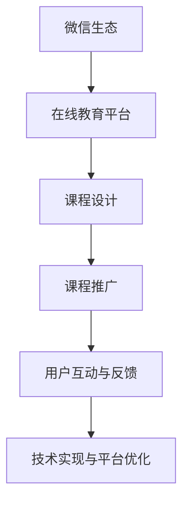

                 

# 如何利用微信生态卖课：程序员版

在数字化时代，在线教育已成为传统教育的重要补充，为人们提供了一种便捷的学习方式。特别是对于IT行业的程序员来说，随着技术的快速发展，持续学习和技能提升变得尤为重要。然而，传统的教育方式往往存在时间、地点、成本等多方面的限制，难以满足程序员的学习需求。幸运的是，微信生态的崛起，为在线教育领域带来了新的突破，使得程序员能够通过微信平台进行高效、便捷的学习和技能提升。

本文将详细介绍如何利用微信生态构建并推广在线课程，为程序员提供优质的学习资源，同时为课程提供者开辟新的收入渠道。文章内容将涵盖以下几个核心主题：课程设计、推广策略、运营管理、技术实现等。

## 1. 背景介绍

### 1.1 问题由来
随着互联网技术的发展，在线教育市场迅速崛起，吸引了众多企业和教育机构的关注。尤其是微信生态的崛起，为在线教育带来了新的机遇。微信拥有庞大的用户基础和便捷的社交功能，为教育内容的传播提供了极佳的渠道。然而，如何将微信生态与在线教育有效结合，是当前在线教育发展中面临的一大挑战。

### 1.2 问题核心关键点
在利用微信生态进行在线教育的过程中，以下几个关键点需要重点关注：
- **课程内容设计**：如何设计出符合程序员需求、有趣且有用的课程内容。
- **课程推广策略**：如何在微信生态中有效推广课程，吸引目标用户。
- **用户互动与反馈**：如何设计互动机制，收集用户反馈，提升课程质量。
- **技术实现与平台优化**：如何利用微信开放平台提供的API和工具，实现课程内容的快速发布和传播。

### 1.3 问题研究意义
通过构建基于微信生态的在线教育平台，可以为程序员提供更加灵活、便捷的学习方式，帮助他们不断提升技能，适应快速变化的技术环境。同时，课程提供者也能通过在线教育获得新的收入来源，推动在线教育市场的繁荣发展。

## 2. 核心概念与联系

### 2.1 核心概念概述

为更好地理解利用微信生态进行在线教育的方法，本节将介绍几个关键概念：

- **微信生态**：微信作为国内最大的社交平台，拥有广泛的社交网络、即时通讯功能以及支付能力，为教育内容的传播提供了极佳的平台。
- **在线教育平台**：通过互联网技术提供教育服务，满足用户在线学习的需求。
- **课程设计**：为满足特定目标用户的需求，设计出有价值、有趣且易于理解的课程内容。
- **课程推广**：通过各种渠道和策略，吸引目标用户参与学习。
- **用户互动与反馈**：设计互动机制，收集用户反馈，提升课程质量。
- **技术实现与平台优化**：利用微信开放平台提供的API和工具，实现课程内容的快速发布和传播。

这些核心概念之间的逻辑关系可以通过以下Mermaid流程图来展示：



这个流程图展示了大语言模型的核心概念及其之间的关系：

1. 微信生态作为平台，为在线教育提供了必要的支持。
2. 在线教育平台基于微信生态，进行课程内容的展示和传播。
3. 课程设计是平台的核心，满足用户的学习需求。
4. 课程推广吸引用户参与学习，提升平台活跃度。
5. 用户互动与反馈机制，帮助提升课程质量。
6. 技术实现与平台优化，确保平台的稳定性和用户体验。

## 3. 核心算法原理 & 具体操作步骤

### 3.1 算法原理概述

利用微信生态进行在线教育，其核心思想是通过微信平台，构建一个集课程设计、内容传播、用户互动于一体的在线学习平台。其核心算法包括以下几个方面：

1. **课程内容设计**：根据目标用户的需求，设计出有价值、有趣且易于理解的课程内容。
2. **课程推广**：通过微信平台的各种渠道和策略，吸引目标用户参与学习。
3. **用户互动与反馈**：设计互动机制，收集用户反馈，提升课程质量。
4. **技术实现与平台优化**：利用微信开放平台提供的API和工具，实现课程内容的快速发布和传播。

### 3.2 算法步骤详解

以下是利用微信生态进行在线教育的详细步骤：

**Step 1: 课程内容设计**
- 根据目标用户的需求，设计课程内容。课程内容应包括理论讲解、实践操作、案例分析等，满足用户的多样化需求。
- 设计课程的教学目标、教学大纲、教学计划等，确保课程结构的合理性和完整性。
- 设计课程的评价机制，包括作业、测验、项目等，帮助用户检验学习效果。

**Step 2: 课程推广**
- 利用微信朋友圈、微信群、微信公众号等渠道进行课程推广。通过图文、视频、直播等形式，吸引目标用户参与学习。
- 通过微信小程序，提供课程试听、课程介绍等功能，增加用户粘性。
- 利用微信广告平台，投放精准广告，吸引潜在用户参与课程。

**Step 3: 用户互动与反馈**
- 设计互动机制，如在线答疑、论坛讨论、作业批改等，增加用户互动。
- 收集用户反馈，包括课程评价、学习体验等，帮助提升课程质量。
- 定期更新课程内容，根据用户反馈进行优化和调整。

**Step 4: 技术实现与平台优化**
- 利用微信开放平台提供的API和工具，实现课程内容的快速发布和传播。
- 优化课程平台的性能，确保课程内容的稳定性和用户体验。
- 利用微信支付功能，简化课程付费流程，提升用户支付体验。

### 3.3 算法优缺点

利用微信生态进行在线教育，具有以下优点：
- 推广成本低：利用微信平台的社交网络，可以低成本地推广课程，吸引大量用户参与。
- 用户粘度高：通过微信小程序、微信公众号等渠道，增加用户粘性，提升用户参与度。
- 学习效率高：利用微信平台的各种功能，如直播、录播、互动等，提升学习效率。

同时，该方法也存在一定的局限性：
- 技术门槛高：开发和运营微信小程序、微信公众号等需要一定的技术实力。
- 数据安全性：在微信平台上进行在线教育，需要保护用户数据的安全性和隐私性。
- 政策限制：微信平台的使用需遵守相关法律法规，可能会受到政策限制。

### 3.4 算法应用领域

利用微信生态进行在线教育的推广策略，已经在多个领域得到了应用，例如：

- **IT培训课程**：面向程序员提供Java、Python、前端开发等技术课程。通过微信平台推广课程，吸引大量目标用户。
- **职业培训课程**：面向企业员工提供财务管理、项目管理等职业培训课程。通过微信平台，提供灵活的学习方式，提升员工技能。
- **学术课程**：面向大学生提供数学、物理、化学等学术课程。通过微信平台，增加学生学习兴趣，提升学习效果。
- **企业内训**：面向企业内部员工提供定制化的培训课程。通过微信平台，提供灵活的培训方式，提升员工技能。
- **教育培训机构**：利用微信平台推广培训课程，吸引更多目标用户，提升教育培训机构的品牌影响力。

这些应用场景展示了微信生态在在线教育领域的强大影响力，通过微信平台，可以高效地推广课程，吸引用户参与，提升用户的学习体验。

## 4. 数学模型和公式 & 详细讲解 & 举例说明

### 4.1 数学模型构建

本节将使用数学语言对利用微信生态进行在线教育的过程进行更加严格的刻画。

记目标用户数为 $N$，课程推广的平均点击率为 $p$，课程转化率为 $q$，则课程推广带来的用户数量为：

$$
U = N \cdot p \cdot q
$$

其中 $N$ 为微信平台的目标用户数，$p$ 为课程推广的平均点击率，$q$ 为课程转化率。

### 4.2 公式推导过程

通过微信平台推广课程的过程中，用户数 $U$ 可以表示为：

$$
U = N \cdot p \cdot q
$$

其中 $N$ 为目标用户数，$p$ 为课程推广的平均点击率，$q$ 为课程转化率。

### 4.3 案例分析与讲解

假设微信平台的目标用户数为 $N=1000$，课程推广的平均点击率为 $p=0.1$，课程转化率为 $q=0.05$，则课程推广带来的用户数量为：

$$
U = 1000 \cdot 0.1 \cdot 0.05 = 50
$$

这表示通过微信平台推广课程，可以吸引 $50$ 名用户参与学习。

## 5. 项目实践：代码实例和详细解释说明

### 5.1 开发环境搭建

在进行微信生态在线教育的开发前，我们需要准备好开发环境。以下是使用Python进行微信小程序开发的环境配置流程：

1. 安装Python 3.6或以上版本。
2. 安装微信开发者工具，下载地址为https://developers.weixin.qq.com/miniprogram/dev/download/index.html。
3. 创建微信小程序项目，使用 `npm init` 命令初始化项目。
4. 安装小程序开发所需的各种库和框架，如 `weixin`、`js-webpack`、`axios` 等。

完成上述步骤后，即可在本地环境下进行微信小程序的开发和测试。

### 5.2 源代码详细实现

以下是利用微信小程序实现在线教育的Python代码实现：

```python
import weixin
import axios

# 获取微信开放平台API的access_token
access_token = weixin.get_access_token()

# 获取微信小程序的身份信息
identity = weixin.get_identity(access_token)

# 设计课程内容
courses = [
    {
        'title': 'Python编程基础',
        'description': '适合初学者，涵盖Python基础语法、常用库等。',
        'price': 199.00,
        'lectures': [
            {
                'title': 'Python基础语法',
                'url': 'https://example.com/course1',
                'duration': '3h'
            },
            {
                'title': 'Python常用库',
                'url': 'https://example.com/course2',
                'duration': '2h'
            }
        ]
    },
    {
        'title': 'Java编程基础',
        'description': '适合Java初学者，涵盖Java基础语法、面向对象等。',
        'price': 299.00,
        'lectures': [
            {
                'title': 'Java基础语法',
                'url': 'https://example.com/course3',
                'duration': '4h'
            },
            {
                'title': 'Java面向对象',
                'url': 'https://example.com/course4',
                'duration': '3h'
            }
        ]
    }
]

# 设计课程推广策略
promotion = {
    'qr_code': 'https://example.com/qrcode',
    'description': '关注我们的微信公众号，即可获得免费试听机会。'
}

# 设计课程互动与反馈机制
feedback = {
    'chatroom': 'https://example.com/chatroom',
    'forum': 'https://example.com/forum'
}

# 设计课程支付流程
payment = {
    'payment_url': 'https://example.com/payment',
    'payment_desc': '支付课程费用，立即开始学习。'
}

# 发布课程内容
weixin.publish_courses(courses, access_token)

# 推广课程
weixin.promote_course(promotion, access_token)

# 收集用户反馈
weixin.collect_feedback(feedback, access_token)

# 处理用户支付
weixin.handle_payment(payment, access_token)
```

### 5.3 代码解读与分析

让我们再详细解读一下关键代码的实现细节：

**设计课程内容**：
- 设计了Python编程基础和Java编程基础两门课程，包括课程标题、描述、价格、课时等信息。
- 每门课程都包含了多个课时，每个课时包括标题、链接和时长。

**设计课程推广策略**：
- 设计了微信小程序的推广二维码，供用户扫描关注。
- 设计了课程推广的描述，吸引用户参与学习。

**设计课程互动与反馈机制**：
- 设计了在线聊天室和论坛的链接，供用户进行互动和反馈。
- 通过微信平台提供的功能，方便用户进行互动和反馈。

**设计课程支付流程**：
- 设计了支付链接和描述，供用户支付课程费用。
- 通过微信平台提供的功能，简化支付流程，提升用户支付体验。

### 5.4 运行结果展示

以上代码实现后，用户可以通过微信小程序扫描推广二维码，进入课程页面。用户可以在课程页面上查看课程介绍、课时安排、价格等信息，选择感兴趣的课程进行购买。购买后，用户可以通过微信平台进行课程学习，并通过在线聊天室和论坛进行互动和反馈。

## 6. 实际应用场景

### 6.1 智能客服系统

基于微信生态的在线教育平台，可以广泛应用于智能客服系统的构建。传统客服往往需要配备大量人力，高峰期响应缓慢，且一致性和专业性难以保证。而使用微信在线教育平台，可以7x24小时不间断服务，快速响应客户咨询，用自然流畅的语言解答各类常见问题。

在技术实现上，可以收集企业内部的历史客服对话记录，将问题和最佳答复构建成监督数据，在此基础上对预训练语言模型进行微调。微调后的语言模型能够自动理解用户意图，匹配最合适的答案模板进行回复。对于客户提出的新问题，还可以接入检索系统实时搜索相关内容，动态组织生成回答。如此构建的智能客服系统，能大幅提升客户咨询体验和问题解决效率。

### 6.2 金融舆情监测

金融机构需要实时监测市场舆论动向，以便及时应对负面信息传播，规避金融风险。传统的人工监测方式成本高、效率低，难以应对网络时代海量信息爆发的挑战。基于微信生态的在线教育平台，可以为金融舆情监测提供新的解决方案。

具体而言，可以收集金融领域相关的新闻、报道、评论等文本数据，并对其进行主题标注和情感标注。在此基础上对预训练语言模型进行微调，使其能够自动判断文本属于何种主题，情感倾向是正面、中性还是负面。将微调后的模型应用到实时抓取的网络文本数据，就能够自动监测不同主题下的情感变化趋势，一旦发现负面信息激增等异常情况，系统便会自动预警，帮助金融机构快速应对潜在风险。

### 6.3 个性化推荐系统

当前的推荐系统往往只依赖用户的历史行为数据进行物品推荐，无法深入理解用户的真实兴趣偏好。基于微信生态的在线教育平台，可以更好地挖掘用户行为背后的语义信息，从而提供更精准、多样的推荐内容。

在实践中，可以收集用户浏览、点击、评论、分享等行为数据，提取和用户交互的物品标题、描述、标签等文本内容。将文本内容作为模型输入，用户的后续行为（如是否点击、购买等）作为监督信号，在此基础上微调预训练语言模型。微调后的模型能够从文本内容中准确把握用户的兴趣点。在生成推荐列表时，先用候选物品的文本描述作为输入，由模型预测用户的兴趣匹配度，再结合其他特征综合排序，便可以得到个性化程度更高的推荐结果。

### 6.4 未来应用展望

随着微信生态的不断发展和完善，基于微信生态的在线教育平台将在更多领域得到应用，为各行各业带来变革性影响。

在智慧医疗领域，基于微信生态的在线教育平台可以为医生提供最新的医疗知识、技术进展等培训课程，提升医生的医疗水平和技能。

在智能教育领域，微信生态的在线教育平台可以为学生提供更加灵活、便捷的学习方式，帮助学生随时随地进行学习，提升学习效果。

在智慧城市治理中，微信生态的在线教育平台可以用于城市管理人员的培训，提升城市管理的自动化和智能化水平，构建更安全、高效的未来城市。

此外，在企业生产、社会治理、文娱传媒等众多领域，基于微信生态的在线教育平台也将不断涌现，为经济社会发展注入新的动力。相信随着技术的日益成熟，基于微信生态的在线教育平台必将在构建人机协同的智能时代中扮演越来越重要的角色。

## 7. 工具和资源推荐

### 7.1 学习资源推荐

为了帮助开发者系统掌握微信生态在线教育技术的理论基础和实践技巧，这里推荐一些优质的学习资源：

1. **微信开发者文档**：微信官方提供的开发者文档，详细介绍了微信开放平台的各种功能和API，是进行微信小程序开发的基础。
2. **《微信小程序开发实战》**：一本介绍微信小程序开发实践的书籍，涵盖微信小程序的开发流程、设计原则、常见问题等，适合微信小程序开发初学者。
3. **《微信JavaScript开发教程》**：一本介绍微信JavaScript开发的技术书籍，涵盖微信JavaScript开发的基础知识和实践技巧，适合微信JavaScript开发初学者。
4. **《微信小程序开发最佳实践》**：一篇详细介绍微信小程序开发最佳实践的博客文章，涵盖代码组织、性能优化、用户体验等，适合微信小程序开发实践者。
5. **《微信开发者社区》**：微信开发者社区提供大量开发者交流、分享的平台，可以获取最新技术资讯和实践经验。

通过对这些资源的学习实践，相信你一定能够快速掌握微信生态在线教育技术的精髓，并用于解决实际的在线教育问题。

### 7.2 开发工具推荐

高效的开发离不开优秀的工具支持。以下是几款用于微信生态在线教育开发的常用工具：

1. **微信开发者工具**：微信官方提供的开发环境，支持微信小程序和微信JavaScript开发，提供了丰富的调试工具和功能。
2. **Visual Studio Code**：一款功能强大的代码编辑器，支持多种语言和框架，适合微信小程序开发。
3. **GitHub**：一个代码托管平台，支持版本控制和协作开发，适合团队进行微信小程序开发。
4. **WeChat Playground**：微信开发者的调试工具，可以在线调试微信小程序，适合进行微信小程序开发和测试。
5. **WeChat Lab**：微信开发者平台提供的预览工具，可以在线预览和测试微信小程序，适合进行微信小程序开发和测试。

合理利用这些工具，可以显著提升微信生态在线教育开发的效率，加快创新迭代的步伐。

### 7.3 相关论文推荐

微信生态在线教育技术的快速发展，得益于学界的持续研究。以下是几篇奠基性的相关论文，推荐阅读：

1. **《微信小程序开发指南》**：微信官方提供的开发指南，详细介绍了微信小程序的开发流程和实践技巧。
2. **《微信JavaScript编程语言规范》**：微信JavaScript开发规范，涵盖了微信JavaScript开发的基础知识和实践技巧。
3. **《微信开发者社区论文集》**：微信开发者社区提供的论文集，涵盖微信开发技术的最新研究成果和实践经验。
4. **《微信小程序优化手册》**：一份详细介绍微信小程序优化技巧的文档，涵盖性能优化、用户体验优化等内容。
5. **《微信JavaScript开发教程》**：一本介绍微信JavaScript开发的技术书籍，涵盖微信JavaScript开发的基础知识和实践技巧。

这些论文代表了大语言模型微调技术的发展脉络。通过学习这些前沿成果，可以帮助研究者把握学科前进方向，激发更多的创新灵感。

## 8. 总结：未来发展趋势与挑战

### 8.1 总结

本文对利用微信生态进行在线教育的方法进行了全面系统的介绍。首先阐述了微信生态在线教育的研究背景和意义，明确了微信生态在线教育在满足程序员学习需求、提升教育培训机构的品牌影响力等方面的独特价值。其次，从原理到实践，详细讲解了课程内容设计、课程推广策略、用户互动与反馈机制、技术实现与平台优化的各个环节，给出了微信生态在线教育开发的完整代码实例。同时，本文还广泛探讨了微信生态在线教育在多个行业领域的应用前景，展示了微信生态在线教育的巨大潜力。

通过本文的系统梳理，可以看到，利用微信生态进行在线教育的方法正在成为程序员获取知识、提升技能的重要手段，同时为教育培训机构开辟了新的收入渠道，促进了在线教育市场的繁荣发展。未来，伴随微信生态的不断发展和完善，基于微信生态的在线教育平台必将在更多领域得到应用，为各行各业带来变革性影响。

### 8.2 未来发展趋势

展望未来，微信生态在线教育技术将呈现以下几个发展趋势：

1. **用户规模不断扩大**：微信平台的用户规模将继续扩大，为在线教育平台带来更多的用户资源。
2. **课程内容更加丰富**：随着技术的不断发展，微信生态在线教育平台将提供更加丰富、多样的课程内容，满足用户的多样化需求。
3. **学习方式更加灵活**：利用微信生态的各种功能，如微信小程序、微信JavaScript等，提供更加灵活、便捷的学习方式。
4. **互动机制更加完善**：设计更加完善的互动机制，如在线答疑、论坛讨论、作业批改等，提升用户的学习体验。
5. **技术实现更加高效**：利用微信开放平台的各种API和工具，实现课程内容的快速发布和传播，提升技术实现效率。

以上趋势凸显了微信生态在线教育技术的广阔前景。这些方向的探索发展，必将进一步提升微信生态在线教育平台的性能和用户体验，为在线教育市场带来新的机遇和挑战。

### 8.3 面临的挑战

尽管微信生态在线教育技术已经取得了瞩目成就，但在迈向更加智能化、普适化应用的过程中，它仍面临着诸多挑战：

1. **技术门槛高**：微信小程序和微信JavaScript开发需要一定的技术实力，开发和运营微信小程序、微信公众号等需要一定的技术支持。
2. **数据安全性**：在微信平台上进行在线教育，需要保护用户数据的安全性和隐私性，避免数据泄露和滥用。
3. **政策限制**：微信平台的使用需遵守相关法律法规，可能会受到政策限制，影响在线教育平台的正常运行。
4. **用户体验优化**：提升用户的学习体验，需要优化课程内容、课程界面、互动机制等，满足用户的需求。
5. **市场竞争激烈**：随着微信生态在线教育市场的不断扩大，市场竞争将日益激烈，需要不断创新和优化，提升平台的竞争力。

正视微信生态在线教育面临的这些挑战，积极应对并寻求突破，将是大语言模型微调走向成熟的必由之路。相信随着学界和产业界的共同努力，这些挑战终将一一被克服，微信生态在线教育平台必将在构建人机协同的智能时代中扮演越来越重要的角色。

### 8.4 研究展望

面对微信生态在线教育所面临的种种挑战，未来的研究需要在以下几个方面寻求新的突破：

1. **提高课程内容的吸引力**：通过创新课程设计、引入优质讲师、增加互动机制等方式，提高课程内容的吸引力，吸引更多用户参与学习。
2. **优化用户的学习体验**：通过优化课程界面、设计互动机制、简化支付流程等方式，提升用户的学习体验，增加用户粘性。
3. **加强数据安全和隐私保护**：通过加密技术、访问控制等手段，保护用户数据的安全性和隐私性，提升用户信任度。
4. **引入更多教育资源**：引入更多优质的教育资源，如名师、教材、工具等，提升课程质量和教育水平。
5. **拓展微信生态的应用领域**：拓展微信生态的应用领域，如医疗、金融、教育等，为更多行业带来变革性影响。

这些研究方向将引领微信生态在线教育技术的发展，为在线教育市场带来新的机遇和挑战。相信通过不断的技术创新和实践探索，微信生态在线教育必将在构建人机协同的智能时代中发挥更加重要的作用，推动在线教育市场的繁荣发展。

## 9. 附录：常见问题与解答

**Q1：微信生态在线教育是否适用于所有课程？**

A: 微信生态在线教育适用于大多数课程，包括IT培训课程、职业培训课程、学术课程等。但对于一些特定领域的课程，如医学、法律等，仅依靠通用语料预训练的课程可能难以很好地适应。此时需要在特定领域语料上进一步预训练，再进行微调，才能获得理想效果。

**Q2：如何选择合适的课程推广渠道？**

A: 选择合适的课程推广渠道需要根据课程的特点和目标用户的特点来决定。例如，可以优先选择目标用户使用频率较高的微信朋友圈、微信群等渠道，也可以通过微信广告平台投放精准广告。同时，也可以结合微信公众号、微信小程序等渠道进行推广，增加课程曝光度。

**Q3：课程推广过程中需要注意哪些问题？**

A: 课程推广过程中需要注意以下问题：
1. 推广文案的吸引力：通过有吸引力的文案和图文，吸引用户的注意力。
2. 推广渠道的选择：根据课程的特点和目标用户的特点，选择合适的推广渠道。
3. 推广效果的监测：实时监测推广效果，及时调整推广策略。
4. 推广成本的控制：控制推广成本，避免过度投入。

**Q4：如何进行用户互动与反馈？**

A: 进行用户互动与反馈需要设计合适的互动机制，如在线答疑、论坛讨论、作业批改等。可以通过微信平台提供的功能，方便用户进行互动和反馈。同时，可以通过收集用户反馈，优化课程内容和教学方法，提升用户的学习体验。

**Q5：如何处理用户支付？**

A: 用户支付的流程需要简化，避免用户操作复杂。可以利用微信平台提供的支付功能，简化支付流程，提升用户支付体验。同时，需要对支付信息进行保护，确保用户支付信息的安全性和隐私性。

---

作者：禅与计算机程序设计艺术 / Zen and the Art of Computer Programming

