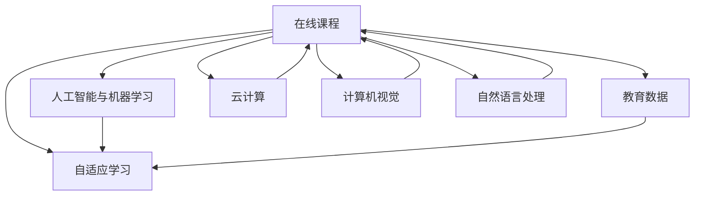

                 

# 如何利用技术能力创建在线课程

> 关键词：在线课程, 技术能力, 教育平台, 自适应学习, 人工智能, 课程设计, 交互式学习, 个性化学习, 教育数据分析

## 1. 背景介绍

### 1.1 问题由来
随着互联网技术的迅猛发展和教育信息化进程的加速，在线课程（Online Course）已成为现代教育的重要组成部分。尤其在疫情背景下，线上学习已成为全球学生的主要学习方式。同时，人们对在线课程的期待也从单纯的视频录制和播放，向更丰富、更高效、更互动的在线教育模式转变。

### 1.2 问题核心关键点
在线课程的构建涉及到多个技术领域的融合，如人工智能（AI）、机器学习（ML）、计算机视觉（CV）、自然语言处理（NLP）、云计算等。技术能力的利用是创造优质在线课程的关键因素之一。

1. **技术能力的应用**：通过AI和ML技术实现个性化学习路径和自适应学习系统；使用CV进行交互式学习体验和内容推荐；借助NLP技术进行智能化的课程内容生成和分析；依托云计算实现大规模在线课程的稳定运行。

2. **技术平台的选择**：选择合适的在线课程构建平台，如Coursera、edX、Udacity等，能够极大地提升课程的开发效率和用户体验。

3. **技术数据的利用**：通过教育数据分析技术，对学生的学习行为、成绩和反馈进行深入挖掘，从而不断优化课程内容和教学策略。

4. **技术支持的互动**：利用聊天机器人、虚拟教室等技术手段，增强教师与学生、学生与学生之间的互动。

5. **技术融合的创新**：将VR/AR、游戏化等新兴技术引入课程设计，提升学习体验和效果。

## 2. 核心概念与联系

### 2.1 核心概念概述

为更好地理解如何利用技术能力创建在线课程，本节将介绍几个密切相关的核心概念：

- **在线课程（Online Course）**：通过互联网平台提供的教育资源和学习体验，包括视频、文本、音频等形式的学习内容。

- **自适应学习（Adaptive Learning）**：根据学生的学习进度、偏好、知识水平等因素，自动调整课程内容和难度，个性化地满足不同学生的需求。

- **人工智能（AI）与机器学习（ML）**：通过数据分析和算法，自动化地处理和优化在线课程的学习过程，提高学习效率和效果。

- **教育数据（Educational Data）**：学生的学习数据，如学习时长、成绩、反馈等，是优化课程和教学策略的重要依据。

- **云计算（Cloud Computing）**：提供大容量、高可扩展的计算资源，支持大规模在线课程的实时处理和存储。

- **计算机视觉（CV）**：通过图像和视频分析技术，提升在线课程的互动性和沉浸感。

- **自然语言处理（NLP）**：处理和分析文本数据，实现课程内容的自动化生成和智能分析。

这些核心概念之间的逻辑关系可以通过以下Mermaid流程图来展示：



这个流程图展示了大语言模型的核心概念及其之间的关系：

1. 在线课程通过自适应学习、AI与ML技术，个性化满足学生需求。
2. 教育数据是优化课程和教学策略的重要依据。
3. 云计算提供了课程运行所需的计算资源。
4. 计算机视觉和自然语言处理技术提升了课程的互动性和智能化水平。

## 3. 核心算法原理 & 具体操作步骤

### 3.1 算法原理概述

创建在线课程的关键算法原理包括个性化推荐、自适应学习路径设计、学习数据分析等。

**个性化推荐算法**：根据学生的学习行为和成绩，推荐适合其知识水平和学习风格的课程内容，确保学生能够高效地学习。

**自适应学习路径设计**：通过学习数据分析，动态调整课程内容和难度，确保学生始终处于最佳学习状态。

**学习数据分析**：利用机器学习技术，分析学生的学习行为、成绩和反馈，发现学生的学习模式和难点，为教学策略优化提供依据。

### 3.2 算法步骤详解

基于技术能力的在线课程构建可以分为以下几个关键步骤：

**Step 1: 准备数据与环境**
- 收集学生的学习数据（如成绩、学习时长、问题提交等），选择适合的在线课程平台（如Coursera、edX等）。
- 搭建计算环境（如AWS、阿里云等），确保平台的稳定运行。

**Step 2: 设计课程内容与结构**
- 根据课程目标和学生需求，设计课程内容和结构，确保课程的逻辑性和连贯性。
- 利用计算机视觉技术，加入图像、视频等多媒体元素，提高课程的互动性和趣味性。

**Step 3: 开发个性化推荐系统**
- 构建学生画像，分析学生的学习行为和兴趣。
- 设计推荐算法，基于学生的学习数据，推荐适合的课程内容和学习路径。

**Step 4: 实现自适应学习系统**
- 利用机器学习技术，实时监控学生的学习进度和表现。
- 根据学生的反馈和学习数据，动态调整课程难度和内容，实现个性化学习。

**Step 5: 集成学习数据分析与反馈**
- 收集学生的学习数据，进行深度分析。
- 根据分析结果，优化课程内容和教学策略。
- 利用自然语言处理技术，分析学生的反馈和评论，发现课程的不足之处。

**Step 6: 部署与运维**
- 将课程部署到云平台，进行大规模在线运行。
- 监控课程运行状态，及时处理故障和问题。

### 3.3 算法优缺点

利用技术能力创建在线课程具有以下优点：
1. 个性化推荐：根据学生的学习行为和兴趣，提供定制化课程，提升学习效果。
2. 自适应学习：根据学生的学习进度和表现，动态调整课程内容，提高学习效率。
3. 数据驱动优化：利用学习数据分析技术，不断优化课程内容和教学策略。

但这些技术手段也存在一定的局限性：
1. 技术复杂度高：需要掌握多种技术，对技术团队的要求较高。
2. 数据隐私和安全：大规模收集和分析学生数据，需确保数据隐私和安全。
3. 技术集成成本：不同技术的集成需要时间和成本投入。

尽管存在这些局限性，但总体而言，利用技术能力创建在线课程是提升教育质量和效率的重要手段，值得在实践中不断探索和完善。

### 3.4 算法应用领域

基于技术能力的在线课程构建技术在多个领域得到了广泛应用：

- **学术教育**：提供科学、数学、文学等各类学科的在线课程，支持大规模学生学习。
- **职业技能培训**：提供在线编程、数据分析、项目管理等职业技能课程，满足企业培训需求。
- **职业继续教育**：提供终身学习的平台，支持成人在职学习，提升职业竞争力。
- **企业内训**：提供定制化企业内训课程，提升员工技能，提高企业竞争力。
- **在线教育游戏**：将游戏化元素融入在线课程，提升学生的学习兴趣和互动性。

此外，技术能力的应用还可以拓展到更广泛的领域，如虚拟现实（VR）和增强现实（AR）课程、智能导师系统等，为教育形式带来新的变革。

## 4. 数学模型和公式 & 详细讲解 & 举例说明

### 4.1 数学模型构建

**个性化推荐模型**：

假设有 $N$ 个学生，每个学生有 $M$ 个课程选项，课程的评分矩阵为 $R \in \mathbb{R}^{N \times M}$，其中 $R_{ij}$ 表示第 $i$ 个学生对第 $j$ 个课程的评分。设学生的特征向量为 $X_i \in \mathbb{R}^k$，课程的特征向量为 $Y_j \in \mathbb{R}^k$。个性化推荐的目标是预测学生对课程的评分 $P_i$。

推荐模型可以表示为：

$$
P_i = \text{softmax}(\theta^T [X_i, Y_j] \cdot b)
$$

其中 $\theta \in \mathbb{R}^{k \times 2}$ 为模型参数，$b \in \mathbb{R}^1$ 为偏置项，$\text{softmax}(\cdot)$ 为softmax函数，表示将输出转化为概率分布。

**自适应学习路径模型**：

假设学生的学习状态向量为 $S_i \in \mathbb{R}^n$，课程的难度向量为 $D_j \in \mathbb{R}^n$，学习路径的调整策略为 $\alpha \in \mathbb{R}^n$。自适应学习路径的目标是找到最优的调整策略 $\alpha^*$，使得学生的学习效果最大化。

自适应学习模型可以表示为：

$$
\max_{\alpha} \sum_{i=1}^N \log p_i(\alpha)
$$

其中 $p_i(\alpha)$ 表示学生在调整策略 $\alpha$ 下的学习效果。

### 4.2 公式推导过程

**个性化推荐模型推导**：

设 $X_i \in \mathbb{R}^k$ 为学生特征向量，$Y_j \in \mathbb{R}^k$ 为课程特征向量，$R_{ij}$ 为学生对课程的评分，$\theta \in \mathbb{R}^{k \times 2}$ 为模型参数，$b \in \mathbb{R}^1$ 为偏置项。

推荐模型的损失函数为：

$$
L(\theta) = \frac{1}{N} \sum_{i=1}^N \log \frac{e^{\theta^T [X_i, Y_j] \cdot b}}{\sum_{j=1}^M e^{\theta^T [X_i, Y_j] \cdot b}}
$$

目标是最小化损失函数：

$$
\min_{\theta} L(\theta)
$$

通过反向传播算法，可以求得参数 $\theta$ 的更新公式为：

$$
\theta \leftarrow \theta - \eta \nabla_{\theta} L(\theta)
$$

其中 $\eta$ 为学习率。

**自适应学习路径模型推导**：

设 $S_i \in \mathbb{R}^n$ 为学生的学习状态向量，$D_j \in \mathbb{R}^n$ 为课程的难度向量，$\alpha \in \mathbb{R}^n$ 为学习路径的调整策略，$p_i(\alpha)$ 为学生在调整策略 $\alpha$ 下的学习效果。

目标是最小化学生的平均学习效果：

$$
\min_{\alpha} \frac{1}{N} \sum_{i=1}^N - \log p_i(\alpha)
$$

通过梯度下降算法，可以求得 $\alpha$ 的更新公式为：

$$
\alpha \leftarrow \alpha - \eta \nabla_{\alpha} \frac{1}{N} \sum_{i=1}^N - \log p_i(\alpha)
$$

其中 $\eta$ 为学习率。

### 4.3 案例分析与讲解

假设我们要为某课程构建个性化推荐系统，选择线性模型作为推荐模型。我们可以使用随机梯度下降（SGD）算法进行模型训练。

首先，收集学生的学习数据，包括特征（如学号、性别、年龄等）和课程评分（如课程难度、成绩等）。然后，利用特征工程，将数据转换为模型的输入形式。接着，使用SGD算法进行模型训练，迭代更新参数 $\theta$ 和偏置项 $b$。

在模型训练完成后，使用测试集评估模型的推荐效果。如果模型效果好，就可以部署到在线课程平台，实现个性化推荐功能。

## 5. 项目实践：代码实例和详细解释说明

### 5.1 开发环境搭建

在进行在线课程构建前，我们需要准备好开发环境。以下是使用Python进行PyTorch开发的环境配置流程：

1. 安装Anaconda：从官网下载并安装Anaconda，用于创建独立的Python环境。

2. 创建并激活虚拟环境：
```bash
conda create -n pytorch-env python=3.8 
conda activate pytorch-env
```

3. 安装PyTorch：根据CUDA版本，从官网获取对应的安装命令。例如：
```bash
conda install pytorch torchvision torchaudio cudatoolkit=11.1 -c pytorch -c conda-forge
```

4. 安装TensorFlow：
```bash
pip install tensorflow
```

5. 安装各类工具包：
```bash
pip install numpy pandas scikit-learn matplotlib tqdm jupyter notebook ipython
```

完成上述步骤后，即可在`pytorch-env`环境中开始在线课程的开发。

### 5.2 源代码详细实现

这里以构建个性化推荐系统为例，给出使用PyTorch进行在线课程开发的完整代码实现。

首先，定义推荐模型的超参数：

```python
import torch
import torch.nn as nn
import torch.optim as optim

# 超参数
EPOCHS = 10
BATCH_SIZE = 32
LEARNING_RATE = 0.01
DROPOUT = 0.5
```

然后，定义推荐模型的层结构：

```python
class RecommendationModel(nn.Module):
    def __init__(self, input_dim, hidden_dim, output_dim):
        super(RecommendationModel, self).__init__()
        self.linear1 = nn.Linear(input_dim, hidden_dim)
        self.linear2 = nn.Linear(hidden_dim, output_dim)
        self.dropout = nn.Dropout(DROPOUT)
        
    def forward(self, x):
        x = self.linear1(x)
        x = self.dropout(x)
        x = torch.relu(x)
        x = self.linear2(x)
        return x
```

接着，定义数据处理函数和训练函数：

```python
# 定义数据处理函数
def preprocess_data(data):
    features = []
    labels = []
    for student, courses in data:
        features.append(student)
        labels.append(courses)
    features = torch.tensor(features, dtype=torch.float)
    labels = torch.tensor(labels, dtype=torch.long)
    return features, labels

# 定义训练函数
def train(model, data, device, optimizer):
    model.to(device)
    for epoch in range(EPOCHS):
        features, labels = preprocess_data(data)
        features = features.to(device)
        labels = labels.to(device)
        optimizer.zero_grad()
        outputs = model(features)
        loss = nn.CrossEntropyLoss()(outputs, labels)
        loss.backward()
        optimizer.step()
        if (epoch + 1) % 2 == 0:
            print(f"Epoch {epoch+1}, loss: {loss.item():.4f}")
```

最后，启动训练流程：

```python
# 准备数据
data = [(1, [1, 2, 3]), (2, [2, 3, 4]), (3, [3, 4, 5])]

# 定义模型
model = RecommendationModel(2, 10, 3).to(device)

# 定义优化器
optimizer = optim.SGD(model.parameters(), lr=LEARNING_RATE)

# 训练模型
train(model, data, device, optimizer)
```

以上即为使用PyTorch构建个性化推荐系统的完整代码实现。可以看到，借助PyTorch的强大框架，我们可以快速搭建和训练推荐模型，并集成到在线课程平台中。

### 5.3 代码解读与分析

让我们再详细解读一下关键代码的实现细节：

**RecommendationModel类**：
- `__init__`方法：初始化模型参数。
- `forward`方法：定义模型的前向传播过程。

**preprocess_data函数**：
- 将学生特征和课程评分数据转换为模型所需的格式。

**train函数**：
- 定义训练的超参数。
- 将数据加载并处理为模型的输入。
- 使用SGD算法进行模型训练。

**训练流程**：
- 定义模型、优化器、数据集。
- 在每个epoch中，进行模型前向传播、计算损失、反向传播更新参数。
- 在每个epoch结束时，打印损失值。

可以看到，PyTorch提供了丰富的模块和函数，方便我们实现复杂的在线课程构建需求。开发者可以在此基础上，进一步拓展模型的结构和功能，满足更加个性化的需求。

## 6. 实际应用场景

### 6.1 在线教育平台

在线教育平台是利用技术能力创建在线课程的主要场景之一。通过AI和ML技术，平台可以实现个性化推荐、自适应学习路径设计等功能，提升学生的学习效果。

在技术实现上，可以收集学生的历史学习数据和行为数据，构建学生画像，利用推荐算法推荐适合的课程和资源。同时，根据学生的学习状态和表现，动态调整课程难度和内容，实现自适应学习。

### 6.2 企业内训系统

企业内训系统通过在线课程的形式，提供专业技能培训，提升员工的技能水平。利用技术能力，内训系统可以实现更加高效、互动的学习体验。

在技术实现上，可以结合视频、互动问答、模拟测试等多种形式，提升学习效果。同时，通过学习数据分析技术，分析员工的学习数据，提供个性化的培训方案，提升培训效果。

### 6.3 在线职业培训

在线职业培训平台提供各类职业技能培训课程，帮助用户提升职业技能。利用技术能力，平台可以实现更加个性化的学习路径和资源推荐。

在技术实现上，可以收集用户的学习行为和反馈数据，分析用户的学习模式和兴趣，提供个性化的课程推荐。同时，通过自适应学习路径设计，动态调整课程难度和内容，提升学习效果。

### 6.4 未来应用展望

随着技术的不断进步，在线课程的构建将更加智能化、个性化。未来的在线课程将具备以下特点：

1. **多模态融合**：结合视频、图像、音频等多模态数据，提升学习体验和效果。
2. **虚拟现实与增强现实**：利用VR/AR技术，增强学习的沉浸感和互动性。
3. **自适应学习系统**：利用AI和ML技术，动态调整课程内容和难度，实现个性化学习。
4. **知识图谱与专家系统**：将知识图谱和专家系统与在线课程结合，提供更加全面、准确的知识和技能。
5. **游戏化学习**：将游戏化元素融入在线课程，提升学生的学习兴趣和参与度。

这些技术手段的应用，将大大提升在线课程的效率和效果，为教育公平和终身学习提供新的可能性。

## 7. 工具和资源推荐

### 7.1 学习资源推荐

为了帮助开发者系统掌握在线课程构建的理论基础和实践技巧，这里推荐一些优质的学习资源：

1. **Coursera、edX、Udacity等在线教育平台**：这些平台提供了丰富的在线课程，涵盖了多种学科和技能，可以深入了解在线课程构建的实际应用。

2. **《深度学习》书籍**：由深度学习专家Ian Goodfellow撰写，深入讲解深度学习算法和应用，包括在线课程构建的诸多技术。

3. **《Python编程：从入门到实践》书籍**：由Eric Matthes撰写，详细介绍了Python编程语言和PyTorch框架，适合在线课程开发的初学者。

4. **DeepLearning.AI**：由Andrew Ng教授创建的深度学习平台，提供系统化的在线课程和实战项目，适合深度学习领域的入门学习。

5. **Kaggle**：数据科学和机器学习竞赛平台，通过参与在线课程和比赛，提升技术能力和实践经验。

通过对这些资源的学习实践，相信你一定能够快速掌握在线课程构建的关键技术，并用于解决实际的课程开发问题。

### 7.2 开发工具推荐

高效的开发离不开优秀的工具支持。以下是几款用于在线课程构建开发的常用工具：

1. **PyTorch**：基于Python的开源深度学习框架，灵活动态的计算图，适合快速迭代研究。

2. **TensorFlow**：由Google主导开发的开源深度学习框架，生产部署方便，适合大规模工程应用。

3. **Scikit-learn**：Python的机器学习库，提供丰富的机器学习算法和工具，适合在线课程推荐系统开发。

4. **Jupyter Notebook**：基于Web的交互式编程环境，方便开发者记录和分享代码。

5. **Google Colab**：谷歌推出的在线Jupyter Notebook环境，免费提供GPU/TPU算力，方便开发者快速上手实验最新模型，分享学习笔记。

合理利用这些工具，可以显著提升在线课程构建的开发效率，加快创新迭代的步伐。

### 7.3 相关论文推荐

在线课程构建技术的发展源于学界的持续研究。以下是几篇奠基性的相关论文，推荐阅读：

1. **《自适应学习系统：一种基于模型的自适应学习框架》**：提出了一种基于模型的自适应学习框架，实现了自适应学习路径设计和个性化学习推荐。

2. **《基于深度学习推荐系统的个性化在线课程设计》**：利用深度学习技术，设计了个性化推荐系统，提升了在线课程的推荐效果。

3. **《基于知识图谱的在线课程推荐系统》**：结合知识图谱技术，提升了在线课程推荐系统的准确性和鲁棒性。

4. **《自适应学习系统：一种基于深度学习的自适应学习路径设计》**：提出了一种基于深度学习的自适应学习路径设计方法，实现了个性化学习路径。

这些论文代表了大语言模型微调技术的发展脉络。通过学习这些前沿成果，可以帮助研究者把握学科前进方向，激发更多的创新灵感。

## 8. 总结：未来发展趋势与挑战

### 8.1 总结

本文对利用技术能力创建在线课程的方法进行了全面系统的介绍。首先阐述了在线课程构建的技术基础和背景，明确了技术能力在提升在线课程质量和效率中的重要作用。其次，从原理到实践，详细讲解了个性化推荐、自适应学习路径设计等关键技术的数学模型和算法实现，给出了完整的代码实例。同时，本文还广泛探讨了在线课程在教育、企业培训、职业培训等实际应用场景中的应用前景，展示了技术能力在构建高效、互动、个性化在线课程中的巨大潜力。

通过本文的系统梳理，可以看到，利用技术能力创建在线课程是提升教育质量和效率的重要手段，值得在实践中不断探索和完善。

### 8.2 未来发展趋势

展望未来，在线课程构建技术将呈现以下几个发展趋势：

1. **多模态融合**：结合视频、图像、音频等多模态数据，提升学习体验和效果。
2. **虚拟现实与增强现实**：利用VR/AR技术，增强学习的沉浸感和互动性。
3. **自适应学习系统**：利用AI和ML技术，动态调整课程内容和难度，实现个性化学习。
4. **知识图谱与专家系统**：将知识图谱和专家系统与在线课程结合，提供更加全面、准确的知识和技能。
5. **游戏化学习**：将游戏化元素融入在线课程，提升学生的学习兴趣和参与度。
6. **持续学习与智能导师**：通过持续学习技术，实现模型的自适应和改进，提供智能导师系统，提升学习效果。

这些技术手段的应用，将大大提升在线课程的效率和效果，为教育公平和终身学习提供新的可能性。

### 8.3 面临的挑战

尽管在线课程构建技术已经取得了瞩目成就，但在迈向更加智能化、普适化应用的过程中，它仍面临着诸多挑战：

1. **技术复杂度高**：需要掌握多种技术，对技术团队的要求较高。
2. **数据隐私和安全**：大规模收集和分析学生数据，需确保数据隐私和安全。
3. **技术集成成本**：不同技术的集成需要时间和成本投入。
4. **模型泛化能力**：在线课程模型需要在不同用户和场景中保持较好的泛化能力。
5. **用户参与度**：如何提升用户的学习兴趣和参与度，增强课程的互动性。

尽管存在这些挑战，但总体而言，利用技术能力创建在线课程是提升教育质量和效率的重要手段，值得在实践中不断探索和完善。

### 8.4 研究展望

面对在线课程构建所面临的挑战，未来的研究需要在以下几个方面寻求新的突破：

1. **多模态融合技术**：研究如何更好地将多模态数据融合到在线课程中，提升学习体验和效果。
2. **自适应学习路径设计**：研究如何更加智能地设计自适应学习路径，满足不同学生的需求。
3. **知识图谱与专家系统**：研究如何结合知识图谱和专家系统，提升在线课程的知识全面性和准确性。
4. **持续学习与智能导师**：研究如何实现在线课程的持续学习，提供智能导师系统，提升学习效果。
5. **游戏化学习技术**：研究如何更好地将游戏化元素融入在线课程，提升学生的学习兴趣和参与度。
6. **数据隐私与安全**：研究如何保护用户隐私，确保数据安全。

这些研究方向的发展，将引领在线课程构建技术迈向更高的台阶，为构建高效、互动、个性化在线课程提供新的可能性。

## 9. 附录：常见问题与解答

**Q1：在线课程构建需要哪些核心技术？**

A: 在线课程构建需要以下核心技术：

1. **个性化推荐**：根据学生的学习行为和兴趣，推荐适合的课程内容。
2. **自适应学习路径设计**：根据学生的学习进度和表现，动态调整课程难度和内容。
3. **学习数据分析**：利用机器学习技术，分析学生的学习行为和成绩，优化课程内容和教学策略。
4. **计算机视觉与自然语言处理**：提升课程的互动性和智能化水平。

**Q2：在线课程构建的数据来源有哪些？**

A: 在线课程构建的数据来源包括：

1. **学习记录**：学生的学习时长、成绩、问题提交等。
2. **学习反馈**：学生的课程评价、作业反馈等。
3. **用户行为数据**：学生的点击、浏览、互动等行为数据。
4. **第三方数据**：公共数据集、教育数据平台等。

**Q3：如何优化在线课程构建的技术实现？**

A: 优化在线课程构建的技术实现可以从以下几个方面入手：

1. **数据清洗与预处理**：保证数据的质量和一致性，提高模型训练效果。
2. **模型选择与优化**：选择适合的模型架构和算法，进行模型调参和优化。
3. **用户参与度提升**：设计互动性强的课程内容，提供多样化的学习方式。
4. **技术平台选择**：选择合适的在线课程平台，提供稳定的运行环境。
5. **持续学习与改进**：通过持续学习技术，不断优化课程内容和教学策略。

这些措施能够帮助在线课程构建技术在实践中不断提升效果，满足不同用户的需求。

**Q4：在线课程构建技术对教育行业有哪些影响？**

A: 在线课程构建技术对教育行业有以下影响：

1. **教育公平**：利用技术手段，打破地域和时间的限制，提供平等的教育资源。
2. **学习效果提升**：通过个性化推荐和自适应学习路径设计，提升学习效果和效率。
3. **教育模式变革**：在线课程的构建将推动教育模式的变革，提升教育质量和学生体验。
4. **教师教学改进**：通过数据分析，发现学生的学习模式和难点，优化教学策略和内容。

这些技术手段的应用，将为教育行业带来深刻的变革，提升教育质量和效率，推动教育公平和终身学习的发展。

---

作者：禅与计算机程序设计艺术 / Zen and the Art of Computer Programming

