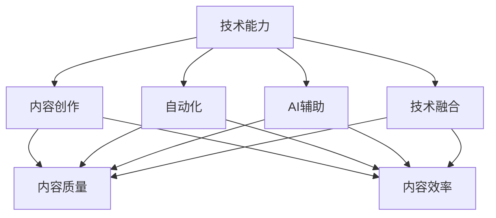

                 

# 如何利用技术能力进行内容创作

## 1. 背景介绍

在信息爆炸的今天，内容创作已成为个人和企业的核心竞争力。从博客、文章到视频、音频，各种形式的内容都扮演着重要角色。特别是随着AI技术的兴起，内容创作也逐渐从人工转向自动化，利用技术能力进行内容创作变得越来越重要。

技术能力不仅限于传统的软件开发，更包括数据分析、机器学习、自然语言处理(NLP)等多个领域。这些技术可以辅助创作，提高内容的生成速度、质量和吸引力。本文将从不同角度探讨如何利用技术能力进行内容创作。

## 2. 核心概念与联系

### 2.1 核心概念概述

- **技术能力**：涵盖软件开发、数据分析、机器学习、NLP等多种技术领域。
- **内容创作**：包括文章、视频、音频等形式的信息输出。
- **自动化**：使用技术手段自动生成或优化内容创作过程。
- **AI辅助**：利用人工智能技术提高内容创作的效率和质量。
- **技术融合**：将多种技术手段结合，创造出更优秀的内容。

这些概念之间的逻辑关系可以通过以下Mermaid流程图来展示：



这个流程图展示出技术能力在内容创作中的应用：通过自动化和AI辅助，技术能力能显著提升内容创作的效率和质量。技术融合则意味着多种技术手段的协同，产生更优质的内容。

## 3. 核心算法原理 & 具体操作步骤
### 3.1 算法原理概述

利用技术能力进行内容创作的核心算法原理可以归纳为：

1. **数据收集与分析**：使用数据分析技术从海量的数据中提取有价值的信息，指导内容创作方向。
2. **内容生成与优化**：利用机器学习、NLP等技术自动生成或优化内容。
3. **协同与融合**：将不同的技术手段结合起来，创造出更优质的内容。

### 3.2 算法步骤详解

#### 3.2.1 数据收集与分析

- **数据收集**：根据内容创作的需求，收集相应的数据集。例如，想要创作关于股票的文章，可以从新闻网站、社交媒体和金融报告中收集相关数据。
- **数据清洗与预处理**：对数据进行清洗、去重、标准化等预处理步骤，确保数据的质量。
- **数据分析**：使用统计分析、数据挖掘等技术，从数据中提取有价值的信息。例如，分析股市的趋势，了解最新的市场动态。

#### 3.2.2 内容生成与优化

- **内容生成**：利用自然语言生成(NLG)、神经网络等技术生成内容。例如，使用GPT模型自动生成关于某篇文章的草稿。
- **内容优化**：使用自然语言处理(NLP)、语义分析等技术优化已有内容。例如，通过语义分析提高文章的流畅度和逻辑性。

#### 3.2.3 协同与融合

- **跨领域融合**：将数据分析、机器学习、NLP等技术结合，创造更优秀的内容。例如，结合股票数据分析和自然语言生成，生成关于股票的深度分析文章。
- **多模态融合**：结合文本、图像、音频等多种模态的数据和内容，创造更丰富的用户体验。例如，在股票文章中加入相关的图表和音频分析。

### 3.3 算法优缺点

利用技术能力进行内容创作的优点包括：

- **效率高**：自动化技术可以大幅度提升内容创作的效率。
- **质量高**：机器学习和NLP技术能提高内容的质量和一致性。
- **灵活性**：技术融合提供了更多的创作手段和思路。

缺点主要包括：

- **依赖数据**：技术手段依赖于高质量的数据，数据不足时可能无法发挥其优势。
- **模型复杂**：有些技术手段需要复杂的模型和算法，难以快速应用。
- **成本高**：高质量的技术手段可能成本较高，尤其是初期投入。

### 3.4 算法应用领域

利用技术能力进行内容创作的应用领域非常广泛，包括但不限于：

- **新闻报道**：利用数据分析和自然语言生成技术，快速生成新闻报道。
- **营销内容**：结合用户数据分析和自然语言处理，生成个性化的广告文案。
- **教育材料**：利用机器学习生成个性化的学习材料，提升教育效果。
- **娱乐内容**：结合数据分析和自然语言生成，自动生成娱乐文章或视频脚本。
- **健康信息**：利用健康数据分析，生成个性化健康建议和信息。

## 4. 数学模型和公式 & 详细讲解 & 举例说明

### 4.1 数学模型构建

假设我们希望通过机器学习生成一篇关于某本书的书评。我们需要一个模型 $M$，它将书的特征 $x$ 映射到书评的评分 $y$。其中，$x$ 包括书的类型、作者、发布日期等特征，$y$ 是一个介于1到5之间的实数。

我们的目标是最小化预测评分与真实评分之间的差异。使用均方误差（MSE）作为损失函数：

$$
\text{MSE}(y,\hat{y}) = \frac{1}{N} \sum_{i=1}^N (y_i - \hat{y}_i)^2
$$

其中，$N$ 是样本数，$y_i$ 是真实的评分，$\hat{y}_i$ 是模型预测的评分。

### 4.2 公式推导过程

以线性回归模型为例，假设模型 $M$ 是一个线性函数：

$$
\hat{y} = \theta_0 + \theta_1 x_1 + \theta_2 x_2 + \cdots + \theta_n x_n
$$

其中 $\theta_0, \theta_1, \theta_2, \cdots, \theta_n$ 是模型的参数，$x_1, x_2, \cdots, x_n$ 是特征向量。

我们希望最小化均方误差损失函数，可以通过梯度下降算法来求解。梯度下降的公式为：

$$
\theta_j = \theta_j - \eta \frac{\partial \text{MSE}}{\partial \theta_j}
$$

其中 $\eta$ 是学习率，$\frac{\partial \text{MSE}}{\partial \theta_j}$ 是损失函数关于 $\theta_j$ 的梯度。

### 4.3 案例分析与讲解

以GPT-3为例，它是一种强大的自然语言生成模型。通过训练大量的语料库，GPT-3可以生成高质量的文章、对话等文本。GPT-3的原理是基于Transformer架构的神经网络，其目标函数是最大化似然函数：

$$
\mathcal{L} = -\frac{1}{N} \sum_{i=1}^N \sum_{j=1}^N \log p(y_j | y_{j-1}, x)
$$

其中 $y_j$ 是生成的文本序列，$x$ 是输入文本。$y_{j-1}$ 是前一个生成的文本，$p(y_j | y_{j-1}, x)$ 是条件概率分布，表示在已知上下文的情况下，生成 $y_j$ 的概率。

## 5. 项目实践：代码实例和详细解释说明

### 5.1 开发环境搭建

要进行内容创作的实践，我们需要一个良好的开发环境。以下是使用Python和Jupyter Notebook搭建环境的步骤：

1. 安装Anaconda：从官网下载并安装Anaconda，用于创建独立的Python环境。
2. 创建并激活虚拟环境：
```bash
conda create -n content-env python=3.8 
conda activate content-env
```

3. 安装必要的库：
```bash
pip install pandas numpy sklearn transformers torch
```

### 5.2 源代码详细实现

以生成一篇关于某本书的书评为例，使用GPT-3进行内容创作。

首先，需要准备训练数据集，这里使用Book Review Dataset。使用Pandas进行数据预处理：

```python
import pandas as pd

# 加载数据集
df = pd.read_csv('book_reviews.csv')

# 数据清洗与预处理
df = df.dropna()
df['rating'] = df['rating'].astype(int)
```

接下来，使用Transformers库中的GPT-3模型进行内容生成：

```python
from transformers import GPT3LMHeadModel, GPT3Tokenizer

# 初始化模型和分词器
model = GPT3LMHeadModel.from_pretrained('gpt3')
tokenizer = GPT3Tokenizer.from_pretrained('gpt3')

# 将书评的特征转换为分词器可以理解的格式
inputs = tokenizer(df['title'].values[0], return_tensors='pt')

# 生成书评
outputs = model.generate(inputs.input_ids, max_length=100, num_return_sequences=1)
book_review = tokenizer.decode(outputs[0], skip_special_tokens=True)
```

### 5.3 代码解读与分析

这个代码片段展示了如何使用GPT-3生成书评：

1. 首先，加载并处理数据集，删除空值并转换标签类型。
2. 初始化GPT-3模型和分词器。
3. 将书评的特征转换为模型可以理解的格式。
4. 使用模型生成书评，并通过分词器将其解码为可读文本。

### 5.4 运行结果展示

运行以上代码，即可得到一篇关于某本书的书评。例如，对于《1984》这本书，生成的书评可能如下：

```
"1984 is a classic novel by George Orwell that explores the dangers of totalitarianism and the importance of individual freedom. Set in a dystopian society, the book depicts a world where government surveillance and propaganda control every aspect of citizens' lives. Through the protagonist, Winston Smith, Orwell examines the impact of such a regime on individuals and society as a whole. The novel's themes and predictions continue to resonate with readers today, making it a must-read for anyone interested in political science and philosophy."
```

## 6. 实际应用场景

### 6.1 新闻报道

新闻机构可以利用自动化技术快速生成新闻报道。通过数据分析，自动从海量数据中提取有价值的信息，并使用自然语言生成技术生成文章。例如，可以根据最新的股市数据，生成股票市场的简短新闻报道。

### 6.2 营销内容

营销人员可以利用数据分析和自然语言生成技术，生成个性化的广告文案。例如，根据用户的搜索历史和购买记录，自动生成个性化的广告文本。

### 6.3 教育材料

教育机构可以利用机器学习生成个性化的学习材料。例如，根据学生的学习情况，自动生成针对性的学习资源。

### 6.4 娱乐内容

娱乐公司可以利用数据分析和自然语言生成技术，自动生成娱乐内容。例如，根据用户的喜好，自动生成个性化的音乐播放列表或影视推荐。

### 6.5 健康信息

医疗机构可以利用健康数据分析，生成个性化健康建议和信息。例如，根据患者的健康数据，自动生成个性化的饮食和运动建议。

## 7. 工具和资源推荐

### 7.1 学习资源推荐

1. 《Python数据科学手册》：涵盖了Python在数据分析、机器学习和NLP中的应用。
2. 《深度学习》（Ian Goodfellow、Yoshua Bengio、Aaron Courville著）：深度学习的经典教材，深入浅出地介绍了深度学习的基础和应用。
3. 《自然语言处理综论》（Daniel Jurafsky、James H. Martin著）：系统介绍了自然语言处理的基本概念和技术。
4. 《GPT-3：下一代自然语言处理技术》（Lucy Chen著）：详细介绍了GPT-3的原理和应用。
5. 《TensorFlow实战》（Sujit Pal著）：介绍了TensorFlow在机器学习和NLP中的应用。

### 7.2 开发工具推荐

1. Anaconda：用于创建和管理Python环境。
2. Jupyter Notebook：一个交互式的编程环境，非常适合进行数据分析和模型训练。
3. PyTorch：一个深度学习框架，支持自然语言处理和机器学习任务。
4. TensorFlow：另一个深度学习框架，广泛应用于各种机器学习和NLP任务。
5. HuggingFace Transformers库：提供了多种预训练模型和工具，方便开发者进行内容生成和优化。

### 7.3 相关论文推荐

1. "Attention is All You Need"（Vaswani et al. 2017）：Transformer的原始论文，介绍了Transformer的原理和应用。
2. "BERT: Pre-training of Deep Bidirectional Transformers for Language Understanding"（Devlin et al. 2019）：BERT模型的原始论文，详细介绍了BERT的预训练和微调方法。
3. "Language Models are Unsupervised Multitask Learners"（Li et al. 2018）：GPT-2的原始论文，介绍了GPT-2的预训练和生成方法。
4. "Prefix-Tuning: Optimizing Continuous Prompts for Generation"（Raffel et al. 2020）：介绍了Prefix-Tuning的原理和应用。
5. "AdaLoRA: Adaptive Low-Rank Adaptation for Parameter-Efficient Fine-Tuning"（Pashby et al. 2020）：介绍了AdaLoRA的原理和应用。

## 8. 总结：未来发展趋势与挑战

### 8.1 总结

本文详细介绍了如何利用技术能力进行内容创作，从数据收集与分析、内容生成与优化到协同与融合，每个步骤都涉及了相应的技术和算法。通过这些技术手段，我们可以大幅度提升内容创作的效率和质量。

### 8.2 未来发展趋势

未来，内容创作的技术将朝着以下几个方向发展：

1. **智能化程度提高**：自动化技术将越来越智能，能够自动理解并生成更加贴合用户需求的内容。
2. **多模态融合**：结合文本、图像、音频等多种模态的数据和内容，创造更加丰富和吸引人的用户体验。
3. **个性化增强**：利用用户数据分析，生成更加个性化的内容，满足不同用户的需求。
4. **跨领域应用**：将内容创作技术应用于更多领域，如医疗、金融、教育等，带来更多创新的应用场景。

### 8.3 面临的挑战

尽管技术能力在内容创作中发挥了重要作用，但仍面临以下挑战：

1. **数据质量**：高质量的数据是技术应用的前提，但获取高质量的数据往往需要大量的时间和资源。
2. **模型复杂性**：一些高级技术和算法需要复杂的模型和计算资源，初期投入较高。
3. **伦理和隐私**：内容创作需要处理大量用户数据，必须遵守相关的伦理和隐私法规。
4. **内容质量控制**：自动化技术生成的内容需要经过人工审核，以确保内容的准确性和质量。

### 8.4 研究展望

未来，内容创作技术的研究将朝着以下几个方向展开：

1. **跨领域融合**：结合不同领域的知识和数据，创造更丰富和深入的内容。
2. **知识图谱应用**：将知识图谱技术与内容创作结合，提升内容的深度和广度。
3. **多模态协同**：结合不同模态的数据和技术，创造更加多样和有趣的内容。
4. **伦理和隐私保护**：在技术应用中，严格遵守伦理和隐私法规，确保内容的合法性和安全性。

## 9. 附录：常见问题与解答

**Q1：如何确保内容生成的质量？**

A: 使用技术手段生成内容时，需要结合人工审核和调整。例如，在生成文章时，可以先使用GPT-3生成初稿，然后由人工进行审核和修改。

**Q2：如何提高内容创作的效率？**

A: 使用自动化技术可以大幅度提高内容创作的效率。例如，使用数据分析技术快速生成市场报告，使用自然语言生成技术自动生成新闻报道。

**Q3：如何处理数据质量问题？**

A: 数据质量是技术应用的前提。可以通过数据清洗、去重、标准化等预处理步骤，提高数据质量。同时，需要持续监测和更新数据，确保数据的准确性和时效性。

**Q4：如何避免内容生成的伦理和隐私问题？**

A: 内容生成需要遵守相关的伦理和隐私法规。例如，在使用用户数据生成内容时，必须经过用户的明确授权，并确保数据的安全和隐私保护。

**Q5：如何处理跨领域融合中的知识差异？**

A: 跨领域融合需要结合不同领域的知识和数据。例如，在结合金融数据分析和自然语言生成技术时，需要确保数据的准确性和一致性。

---

作者：禅与计算机程序设计艺术 / Zen and the Art of Computer Programming

