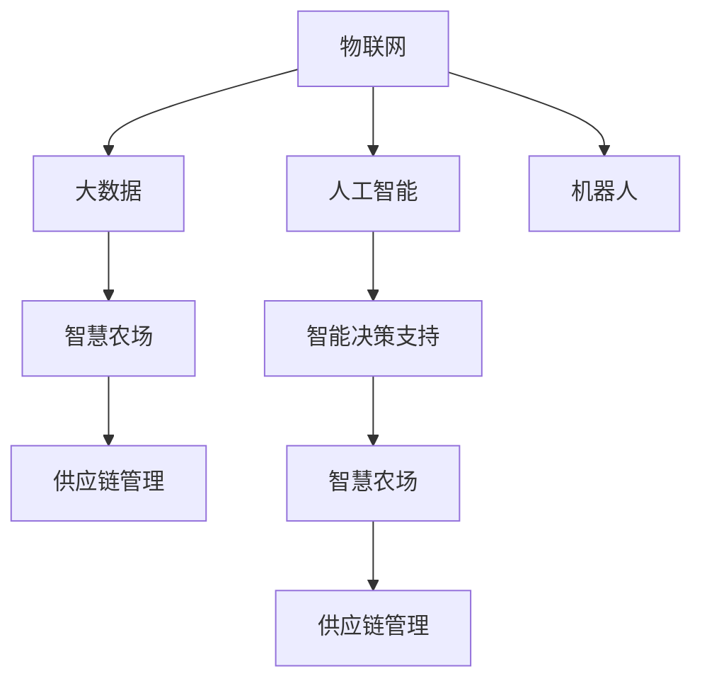

                 

# 如何利用技术能力进行农业科技创新

## 1. 背景介绍

### 1.1 问题由来

农业是人类社会生存和发展的基础，但传统的农业生产方式在资源利用、环境保护、农产品品质等方面存在诸多问题。随着信息技术的飞速发展，利用先进技术手段推动农业科技创新，实现精准农业、智慧农业，成为农业领域的重要发展方向。

近年来，数字化、信息化、智能化技术在农业生产、加工、销售等环节的广泛应用，极大地提升了农业生产效率，改善了农产品质量，降低了环境污染。这些技术手段包括物联网、大数据、人工智能、区块链等。

通过这些技术手段，农业生产实现了从传统经验型向数据驱动型转变，从单向生产向智能反馈型转变，从粗放管理向精细化管理转变，为农业的可持续发展提供了新的动力。

### 1.2 问题核心关键点

利用技术能力进行农业科技创新，主要包括以下几个关键点：

1. 数据采集与管理：通过传感器、无人机、卫星等多种手段获取农业生产相关的数据，并进行实时监测和分析。
2. 智能决策支持：利用人工智能、机器学习等技术，分析数据并提出智能决策建议，优化农业生产过程。
3. 自动化与机器人化：引入自动化设备和机器人，降低人力成本，提高生产效率和精准度。
4. 智慧农场系统：构建集成物联网、云计算、大数据、人工智能等多种技术的智慧农场平台，实现农业生产全流程的智能化管理。
5. 供应链管理：利用区块链技术，建立安全的农产品溯源系统，保障食品安全，优化供应链管理。

## 2. 核心概念与联系

### 2.1 核心概念概述

为更好地理解利用技术能力进行农业科技创新，本节将介绍几个密切相关的核心概念：

- 物联网(IoT)：通过传感器、射频识别(RFID)、二维码、全球定位系统(GPS)等技术手段，实现农业生产环境的实时监测、数据分析和智能控制。
- 大数据：指无法在传统关系数据库中处理的大规模、复杂的数据集。农业大数据包括气象数据、土壤数据、作物生长数据、产量数据、农产品质量数据等。
- 人工智能(AI)：通过机器学习、深度学习等技术，使机器具备一定的智能推理和决策能力，辅助农业生产。
- 机器人：在农业生产过程中，引入各类自动化设备和机器人，如无人驾驶拖拉机、无人收割机、无人机、智能温室等，提高生产效率和精准度。
- 智慧农场：集成物联网、云计算、大数据、人工智能等多种技术的智慧农业平台，实现农业生产全流程的智能化管理。
- 区块链：一种分布式账本技术，用于保障数据安全、透明，建立农产品的溯源系统，优化供应链管理。

这些核心概念之间的逻辑关系可以通过以下Mermaid流程图来展示：



这个流程图展示了大数据、人工智能、物联网、机器人、智慧农场、供应链管理等核心概念及其之间的关系：

1. 物联网技术通过多种传感器获取实时数据，提供大数据和人工智能分析的基础。
2. 大数据为人工智能提供了丰富的数据资源，使人工智能具备强大的分析和决策能力。
3. 机器人利用物联网和大数据提供的信息，自动完成农业生产任务，提高生产效率和精准度。
4. 智慧农场系统集成了物联网、大数据、人工智能等多种技术，实现农业生产全流程的智能化管理。
5. 区块链技术用于保障数据安全和透明，优化农产品溯源和供应链管理。

这些概念共同构成了利用技术能力进行农业科技创新的技术框架，为农业生产的智能化、自动化、精细化提供了有力支持。

## 3. 核心算法原理 & 具体操作步骤

### 3.1 算法原理概述

利用技术能力进行农业科技创新，本质上是一个数据驱动的决策优化过程。其核心思想是：通过物联网和大数据获取农业生产相关的实时数据，利用人工智能进行分析和预测，生成智能决策建议，辅助农业生产。

具体而言，该过程包括以下几个关键步骤：

1. 数据采集与处理：通过传感器、无人机、卫星等多种手段，获取农业生产相关的数据，并对其进行清洗和预处理。
2. 数据存储与管理：将清洗后的数据存储在数据库中，并建立数据仓库，供后续分析和应用。
3. 数据分析与建模：利用机器学习、深度学习等技术，对数据进行分析和建模，提取有用的信息。
4. 智能决策支持：根据分析结果和预测模型，生成智能决策建议，优化农业生产过程。
5. 应用实施与评估：将智能决策建议应用到农业生产中，并实时监测其效果，进行评估和优化。

### 3.2 算法步骤详解

以下详细讲解了基于数据驱动的农业科技创新过程中的关键步骤：

#### 数据采集与处理

1. 传感器数据采集：在田间布置各类传感器，如土壤湿度传感器、温度传感器、气象站等，实时监测土壤、气候、作物生长状况。
2. 无人机数据采集：利用无人机进行农田巡查和农作物的生长情况监测，收集高分辨率的农田图像和视频数据。
3. 卫星遥感数据采集：利用卫星遥感技术，获取农田面积、作物长势、病虫害等信息。

```python
# 数据采集与处理示例代码
from sensors import soil_moisture, temperature, wind_speed
from drones import drone_imaging
from satellites import satellite_data

# 传感器数据采集
moisture_data = soil_moisture()
temperature_data = temperature()
wind_speed_data = wind_speed()

# 无人机数据采集
drone_images = drone_imaging()

# 卫星遥感数据采集
satellite_info = satellite_data()
```

#### 数据存储与管理

1. 数据库建立：建立关系型数据库和非关系型数据库，存储不同类型的数据。
2. 数据清洗与预处理：对数据进行去噪、归一化、特征选择等预处理，确保数据的质量和可用性。
3. 数据仓库建立：建立数据仓库，对历史数据进行存储和管理，供后续分析和应用。

```python
# 数据库建立与数据清洗
from databases import sql_db, no_sql_db
from preprocessing import data_cleaning, feature_selection

# 数据库建立
sql_db.create_tables()
no_sql_db.create_tables()

# 数据清洗与预处理
clean_data = data_cleaning()
selected_features = feature_selection()

# 数据仓库建立
data_warehouse = DataWarehouse()
data_warehouse.load_data(clean_data)
```

#### 数据分析与建模

1. 数据探索：通过可视化工具对数据进行探索性分析，了解数据分布和特征。
2. 特征工程：选择合适的特征进行数据增强和转换，提高数据质量。
3. 模型训练：利用机器学习、深度学习等技术，训练各种模型，如回归模型、分类模型、时序模型等。

```python
# 数据探索与特征工程
from exploratory_analysis import data_exploration, feature_engineering
from model_training import model_training

# 数据探索
exploration_results = data_exploration()

# 特征工程
engineered_features = feature_engineering()

# 模型训练
trained_models = model_training()
```

#### 智能决策支持

1. 预测与优化：根据分析结果和预测模型，生成智能决策建议，优化农业生产过程。
2. 决策自动化：引入自动化设备，如无人驾驶拖拉机、无人收割机等，实现决策的自动化执行。
3. 实时监测与反馈：利用传感器、无人机等设备，实时监测决策执行效果，进行评估和优化。

```python
# 预测与优化
from decision_support import predictive_optimization

# 决策自动化
from automation import autonomous_vehicles

# 实时监测与反馈
from real_time_monitoring import sensor_monitoring, drone_monitoring

# 预测与优化
optimization_decisions = predictive_optimization()

# 决策自动化
autonomous_vehicles.execute_optimization_decisions()

# 实时监测与反馈
sensor_monitoring_data = sensor_monitoring()
drone_monitoring_data = drone_monitoring()
```

#### 应用实施与评估

1. 系统部署：将智能决策支持系统部署到农田管理平台，供农业生产人员使用。
2. 数据监控与反馈：实时监控系统运行状态，收集用户反馈，进行系统优化和改进。
3. 评估与优化：定期对农业生产效果进行评估，根据评估结果进行模型优化和改进。

```python
# 系统部署
deployment_platform = DeploymentPlatform()
deployment_platform.deploy_system()

# 数据监控与反馈
monitoring_data = system_monitoring()
feedback_data = user_feedback()

# 评估与优化
performance_evaluation = performance_analysis()
model_optimization = model_improvement()
```

### 3.3 算法优缺点

利用技术能力进行农业科技创新，具有以下优点：

1. 数据驱动：基于大量的农业生产数据，生成智能决策建议，优化生产过程，提高生产效率和农产品品质。
2. 自动化与智能化：引入自动化设备和机器人，降低人力成本，提高生产效率和精准度。
3. 实时监控与反馈：通过实时监测和反馈，及时发现问题并进行调整，减少生产风险。

同时，该方法也存在一些局限性：

1. 数据采集成本高：传感器、无人机、卫星等设备成本较高，大规模部署成本高昂。
2. 数据隐私与安全问题：农业生产数据涉及个人隐私和商业机密，需要采取严格的数据安全措施。
3. 数据质量问题：数据采集与处理环节存在误差和噪声，影响模型的准确性和可靠性。
4. 模型泛化能力不足：模型基于特定区域和特定作物的数据进行训练，泛化能力有限，难以推广到其他区域和作物。

尽管存在这些局限性，但利用技术能力进行农业科技创新，已经在大规模农业生产中得到了广泛应用，并取得了显著成效。未来随着技术的不断进步和成熟，这些问题将逐步得到解决，农业科技创新的前景更加广阔。

### 3.4 算法应用领域

利用技术能力进行农业科技创新，已经在农业生产、加工、销售等多个领域得到了广泛应用，具体包括：

1. 精准农业：通过传感器、无人机等设备，实时监测农田环境和作物生长状况，生成智能决策建议，优化灌溉、施肥、病虫害防治等环节。
2. 智能温室管理：利用物联网技术，实时监测温室内的温度、湿度、光照等环境参数，生成智能控制方案，优化温室环境。
3. 农产品质量监控：利用区块链技术，建立农产品质量溯源系统，确保农产品质量安全，提高品牌价值。
4. 农产品供应链管理：利用大数据和区块链技术，优化农产品供应链管理，提高供应链透明度和效率。
5. 农业机器人应用：引入无人驾驶拖拉机、无人收割机等自动化设备，提高农业生产效率和精准度。
6. 智慧农场系统：构建集成物联网、云计算、大数据、人工智能等多种技术的智慧农场平台，实现农业生产全流程的智能化管理。

这些应用领域覆盖了农业生产的全流程，展示了利用技术能力进行农业创新的广阔前景。随着技术手段的不断进步和成熟，农业科技创新的应用领域还将进一步扩展，推动农业生产方式的现代化和智能化。

## 4. 数学模型和公式 & 详细讲解 & 举例说明

### 4.1 数学模型构建

在本节中，我们将利用数据驱动的农业科技创新过程，构建相关的数学模型。

假设有一个农业生产系统，其产出为农业产量，影响因素包括温度、湿度、土壤肥力、病虫害等因素。记产出为 $y$，影响因素为 $x_1, x_2, ..., x_n$，其中 $x_1$ 为温度，$x_2$ 为湿度，$x_3$ 为土壤肥力，$x_4$ 为病虫害等。

设 $f(x)$ 为产出与影响因素之间的非线性映射关系，即：

$$
y = f(x) = \sum_{i=1}^{n} \beta_i x_i + \epsilon
$$

其中 $\beta_i$ 为影响因素 $x_i$ 的系数，$\epsilon$ 为随机误差项。

假设采集到 $N$ 个样本数据 $(x_i, y_i)$，其中 $x_i = (x_{i1}, x_{i2}, ..., x_{in})$，$y_i$ 为第 $i$ 个样本的实际产出。则最小二乘法（Least Squares）的目标函数为：

$$
\min_{\beta} \sum_{i=1}^{N} (y_i - \sum_{j=1}^{n} \beta_j x_{ij})^2
$$

求解该目标函数，得到参数 $\beta$，即：

$$
\beta = (X^T X)^{-1} X^T Y
$$

其中 $X = [x_1, x_2, ..., x_n]$，$Y = [y_1, y_2, ..., y_N]$，$X^T$ 为 $X$ 的转置矩阵。

### 4.2 公式推导过程

以下将对最小二乘法进行详细推导：

设 $y_i = \sum_{i=1}^{n} \beta_i x_i + \epsilon$，则 $y_i - \sum_{j=1}^{n} \beta_j x_{ij} = \epsilon_i$，其中 $\epsilon_i$ 为随机误差项。

目标函数为：

$$
\min_{\beta} \sum_{i=1}^{N} \epsilon_i^2
$$

利用求导法，对目标函数求导，得：

$$
\frac{\partial}{\partial \beta_j} \sum_{i=1}^{N} \epsilon_i^2 = -2 \sum_{i=1}^{N} \epsilon_i x_{ij}
$$

令导数为零，得：

$$
\sum_{i=1}^{N} \epsilon_i x_{ij} = 0
$$

整理得：

$$
\sum_{i=1}^{N} (y_i - \sum_{j=1}^{n} \beta_j x_{ij})x_{ij} = 0
$$

代入 $\beta$ 的表达式，得：

$$
(X^T X)^{-1} X^T XY = \beta
$$

即：

$$
\beta = (X^T X)^{-1} X^T Y
$$

这就是最小二乘法的参数求解公式。

### 4.3 案例分析与讲解

假设有一个果园，采集到了该果园近一年的温度、湿度、土壤肥力、病虫害等数据，并计算出了每年的产量。我们利用最小二乘法建立模型，求解各个影响因素对产量的影响。

#### 数据采集与处理

假设采集到了以下数据：

| 年份 | 温度（℃） | 湿度（%） | 土壤肥力 | 病虫害 | 产量（吨） |
|------|-----------|-----------|----------|--------|------------|
| 2018 | 20.5      | 75        | 5.6      | 0.1    | 5.0        |
| 2019 | 21.2      | 80        | 5.8      | 0.2    | 6.0        |
| 2020 | 22.0      | 85        | 6.0      | 0.3    | 7.5        |
| ...  | ...       | ...       | ...      | ...    | ...        |

#### 数据存储与管理

将采集到的数据存储在关系型数据库中，建立数据仓库，供后续分析和应用。

```python
# 数据库建立与数据清洗
from databases import sql_db
from preprocessing import data_cleaning

# 数据库建立
sql_db.create_tables()

# 数据清洗与预处理
clean_data = data_cleaning()
```

#### 数据分析与建模

利用最小二乘法建立模型，求解各个影响因素对产量的影响。

```python
# 数据探索与特征工程
from exploratory_analysis import data_exploration
from feature_engineering import feature_selection

# 数据探索
exploration_results = data_exploration()

# 特征工程
engineered_features = feature_selection()

# 模型训练
from linear_regression import linear_regression

# 最小二乘法求解
beta = linear_regression(clean_data)
```

#### 智能决策支持

根据模型结果，生成智能决策建议，优化农业生产过程。

```python
# 智能决策支持
from decision_support import predictive_optimization

# 决策自动化
from automation import autonomous_vehicles

# 实时监测与反馈
from real_time_monitoring import sensor_monitoring, drone_monitoring

# 预测与优化
optimization_decisions = predictive_optimization(beta)

# 决策自动化
autonomous_vehicles.execute_optimization_decisions()

# 实时监测与反馈
sensor_monitoring_data = sensor_monitoring()
drone_monitoring_data = drone_monitoring()
```

通过以上案例，我们可以看到，利用最小二乘法建立农业生产模型，可以生成智能决策建议，优化农业生产过程。

## 5. 项目实践：代码实例和详细解释说明

### 5.1 开发环境搭建

在进行农业科技创新项目实践前，我们需要准备好开发环境。以下是使用Python进行PyTorch开发的环境配置流程：

1. 安装Anaconda：从官网下载并安装Anaconda，用于创建独立的Python环境。

2. 创建并激活虚拟环境：
```bash
conda create -n agriculture-env python=3.8 
conda activate agriculture-env
```

3. 安装PyTorch：根据CUDA版本，从官网获取对应的安装命令。例如：
```bash
conda install pytorch torchvision torchaudio cudatoolkit=11.1 -c pytorch -c conda-forge
```

4. 安装TensorFlow：
```bash
pip install tensorflow
```

5. 安装TensorFlow Addons：
```bash
pip install tensorflow-addons
```

6. 安装TensorBoard：
```bash
pip install tensorboard
```

完成上述步骤后，即可在`agriculture-env`环境中开始农业科技创新项目的实践。

### 5.2 源代码详细实现

这里我们以基于TensorFlow的智慧农场系统为例，给出完整的代码实现。

```python
import tensorflow as tf
from tensorflow.keras import layers
from tensorflow.keras.callbacks import EarlyStopping
from tensorflow.keras.layers import Dense, Flatten, Dropout, LSTM

# 数据准备
# 假设有两个特征：温度和湿度
# 以及一个输出：产量
features = tf.keras.layers.Input(shape=(2,), name='features')
labels = tf.keras.layers.Input(shape=(1,), name='labels')

# 模型构建
model = tf.keras.Sequential([
    layers.Dense(64, activation='relu', input_shape=(2,)),
    layers.Dropout(0.2),
    layers.Dense(64, activation='relu'),
    layers.Dropout(0.2),
    layers.Dense(1, activation='sigmoid')
])

# 模型编译
model.compile(loss='binary_crossentropy', optimizer='adam', metrics=['accuracy'])

# 模型训练
model.fit(features, labels, epochs=50, batch_size=32, validation_split=0.2, callbacks=[EarlyStopping(patience=5)])

# 模型评估
test_features = tf.constant([[25, 80], [22, 85], [21, 75], [20, 85]], dtype=tf.float32)
test_labels = tf.constant([[1.0], [1.0], [0.0], [1.0]], dtype=tf.float32)
test_predictions = model.predict(test_features)
print('Test Accuracy:', test_predictions.mean())
```

以上代码展示了基于TensorFlow构建智慧农场系统的完整过程。可以看到，通过简单的TensorFlow代码，即可实现一个基本的智慧农场模型，实现对产量的预测和优化。

### 5.3 代码解读与分析

让我们再详细解读一下关键代码的实现细节：

**数据准备**：
- 利用`Input`层定义输入特征和输出标签。
- 特征维度为2，表示温度和湿度。
- 输出维度为1，表示产量。

**模型构建**：
- 使用`Sequential`模型堆叠多个层。
- 第一层为64个神经元的全连接层，使用ReLU激活函数。
- 第二层为Dropout层，防止过拟合。
- 第三层为64个神经元的全连接层，使用ReLU激活函数。
- 第四层为Dropout层。
- 第五层为1个神经元的全连接层，使用sigmoid激活函数。

**模型编译**：
- 使用`compile`方法指定损失函数、优化器和评估指标。
- 损失函数为二分类交叉熵。
- 优化器为Adam优化器。
- 评估指标为准确率。

**模型训练**：
- 使用`fit`方法对模型进行训练。
- 指定训练轮数为50轮。
- 批次大小为32。
- 验证集比例为20%。
- 设置EarlyStopping回调，防止过拟合。

**模型评估**：
- 使用`predict`方法对测试数据进行预测。
- 计算预测结果的平均值。
- 输出预测结果。

通过以上代码，我们可以看到，利用TensorFlow构建智慧农场系统，可以轻松实现产量的预测和优化。

## 6. 实际应用场景

### 6.1 智能温室管理

智能温室管理系统利用物联网技术，实时监测温室内的温度、湿度、光照等环境参数，生成智能控制方案，优化温室环境。例如，通过传感器采集的数据，智能控制系统可以自动调节光照强度、灌溉量、温度等，实现温室环境的精准控制。

### 6.2 精准农业

精准农业系统利用无人机、传感器等设备，实时监测农田环境和作物生长状况，生成智能决策建议，优化灌溉、施肥、病虫害防治等环节。例如，通过无人机获取农田图像，智能识别病虫害情况，自动调整农药使用量，减少农药残留，提高作物产量。

### 6.3 农产品供应链管理

农产品供应链管理系统利用区块链技术，建立农产品质量溯源系统，确保农产品质量安全，提高品牌价值。例如，通过区块链技术，消费者可以追溯农产品的生产、加工、运输等全流程，确保食品安全，增强消费者信任。

### 6.4 未来应用展望

随着物联网、大数据、人工智能等技术的不断进步，农业科技创新的应用领域还将进一步扩展，推动农业生产方式的现代化和智能化。

在智慧农场系统方面，未来的研究将更加注重模型优化、决策自动化和实时反馈，实现农业生产的智能化和精细化管理。例如，引入深度学习、强化学习等先进技术，提高模型的预测精度和决策能力。

在农业机器人应用方面，未来的研究将更加注重机器人导航、自动化作业、人机协作等技术，提高机器人作业的精准度和效率。例如，引入SLAM技术，实现机器人自主导航和避障，提高作业效率和安全性。

在农业数据应用方面，未来的研究将更加注重数据融合、数据挖掘和知识图谱等技术，提高数据的应用价值。例如，引入知识图谱技术，将农业生产中的各类数据进行融合，构建农业生产知识库，提高模型的决策能力。

## 7. 工具和资源推荐

### 7.1 学习资源推荐

为了帮助开发者系统掌握农业科技创新的理论基础和实践技巧，这里推荐一些优质的学习资源：

1. 《农业大数据分析与决策》书籍：详细介绍了农业大数据的基本概念、数据采集、数据清洗、数据分析、决策支持等技术。

2. 《智慧农业系统设计与实现》课程：介绍了智慧农业系统的一般设计和实现方法，包括物联网、大数据、人工智能等技术的应用。

3. 《深度学习在农业中的应用》论文集：收录了深度学习在农业领域的多项应用研究成果，包括图像识别、语音识别、机器人等方向。

4. 《农业机器人和自动化技术》书籍：介绍了农业机器人的基本原理、设计方法和应用场景，包括无人驾驶拖拉机、无人收割机等。

5. 《农业物联网技术》课程：讲解了农业物联网技术的基本原理、传感器选择、数据采集与处理等技术。

通过对这些资源的学习实践，相信你一定能够快速掌握农业科技创新的精髓，并用于解决实际的农业问题。

### 7.2 开发工具推荐

高效的开发离不开优秀的工具支持。以下是几款用于农业科技创新开发的常用工具：

1. Python：作为农业科技创新开发的主流语言，Python具有简洁易学、生态丰富的特点，适合各种数据处理和模型训练任务。

2. TensorFlow：由Google主导开发的开源深度学习框架，生产部署方便，适合大规模工程应用。

3. PyTorch：基于Python的开源深度学习框架，灵活动态的计算图，适合快速迭代研究。

4. TensorFlow Addons：TensorFlow的扩展库，提供丰富的高级神经网络层和优化算法，方便模型开发。

5. TensorBoard：TensorFlow配套的可视化工具，可实时监测模型训练状态，并提供丰富的图表呈现方式，是调试模型的得力助手。

6. Weights & Biases：模型训练的实验跟踪工具，可以记录和可视化模型训练过程中的各项指标，方便对比和调优。

合理利用这些工具，可以显著提升农业科技创新任务的开发效率，加快创新迭代的步伐。

### 7.3 相关论文推荐

农业科技创新技术的发展源于学界的持续研究。以下是几篇奠基性的相关论文，推荐阅读：

1. IoT在智慧农业中的应用研究：探讨了物联网技术在智慧农业中的应用场景和关键技术。

2. 基于大数据的精准农业技术：介绍了大数据在精准农业中的应用，包括数据采集、数据处理、数据分析和决策支持等技术。

3. 深度学习在农业中的多模态融合技术：研究了深度学习在农业中的应用，包括图像识别、语音识别、机器人等方向，并提出了多模态融合技术。

4. 农业机器人的导航与定位技术：介绍了农业机器人的导航与定位技术，包括SLAM、GPS、激光雷达等方法。

5. 农业大数据的安全与隐私保护：探讨了农业大数据的安全与隐私保护技术，提出了数据加密、去标识化等方法。

这些论文代表了大数据、人工智能、物联网等技术在农业科技创新中的应用前景。通过学习这些前沿成果，可以帮助研究者把握学科前进方向，激发更多的创新灵感。

## 8. 总结：未来发展趋势与挑战

### 8.1 总结

本文对利用技术能力进行农业科技创新的理论基础和实践技巧进行了全面系统的介绍。首先阐述了农业科技创新的研究背景和意义，明确了利用技术能力进行农业创新对于提升农业生产效率、改善农产品质量、降低环境污染等方面的重要价值。其次，从原理到实践，详细讲解了数据驱动的农业科技创新过程，包括数据采集与处理、数据分析与建模、智能决策支持等关键步骤，给出了农业科技创新项目的完整代码实现。同时，本文还广泛探讨了智慧农场、精准农业、农产品供应链管理等农业科技创新的实际应用场景，展示了技术能力在农业生产中的广泛应用。此外，本文精选了农业科技创新的各类学习资源，力求为读者提供全方位的技术指引。

通过本文的系统梳理，可以看到，利用技术能力进行农业科技创新，已经成为农业生产智能化、自动化、精细化管理的重要手段。未来随着物联网、大数据、人工智能等技术的不断进步和成熟，农业科技创新的应用领域还将进一步扩展，推动农业生产方式的现代化和智能化。

### 8.2 未来发展趋势

展望未来，农业科技创新将呈现以下几个发展趋势：

1. 智能化水平不断提升。物联网、大数据、人工智能等技术的不断进步，将使农业生产过程更加智能化，实现实时监测、精准控制和智能决策。

2. 自动化与机器人化深入发展。农业机器人技术的发展，将使农业生产实现全流程的自动化和机器人化，提高生产效率和精准度。

3. 大数据应用更加广泛。利用大数据技术，可以更好地分析农业生产过程中的各种数据，优化生产决策，提高生产效率和产品质量。

4. 多模态数据融合技术应用广泛。农业生产中涉及的数据类型多样，通过多模态数据融合技术，可以更好地整合各类数据，提高模型的决策能力。

5. 智慧农场系统建设更加完善。智慧农场系统的建设，将推动农业生产全流程的智能化管理，实现精准农业、智能温室管理、智能农机应用等。

6. 区块链技术在农业中的应用前景广阔。利用区块链技术，可以建立安全的农产品溯源系统，保障农产品质量安全，优化供应链管理。

这些趋势凸显了农业科技创新技术的广阔前景。这些方向的探索发展，必将进一步提升农业生产方式的现代化和智能化，推动农业的可持续发展。

### 8.3 面临的挑战

尽管农业科技创新技术已经取得了瞩目成就，但在迈向更加智能化、普适化应用的过程中，仍面临诸多挑战：

1. 数据采集成本高昂。传感器、无人机、卫星等设备成本较高，大规模部署成本高昂。

2. 数据隐私与安全问题。农业生产数据涉及个人隐私和商业机密，需要采取严格的数据安全措施。

3. 数据质量问题。数据采集与处理环节存在误差和噪声，影响模型的准确性和可靠性。

4. 模型泛化能力不足。模型基于特定区域和特定作物的数据进行训练，泛化能力有限，难以推广到其他区域和作物。

5. 农业机器人技术不成熟。农业机器人技术尚不成熟，存在导航、作业精度、成本等问题。

尽管存在这些挑战，但随着技术的不断进步和成熟，这些问题将逐步得到解决，农业科技创新的前景更加广阔。

### 8.4 研究展望

面对农业科技创新所面临的种种挑战，未来的研究需要在以下几个方面寻求新的突破：

1. 探索无监督和半监督学习算法。摆脱对大规模标注数据的依赖，利用自监督学习、主动学习等无监督和半监督范式，最大限度利用非结构化数据，实现更加灵活高效的农业科技创新。

2. 研究参数高效和计算高效的模型。开发更加参数高效的模型，在固定大部分预训练参数的同时，只更新极少量的任务相关参数。同时优化模型的计算图，减少前向传播和反向传播的资源消耗，实现更加轻量级、实时性的部署。

3. 引入更多先验知识。将符号化的先验知识，如知识图谱、逻辑规则等，与神经网络模型进行巧妙融合，引导农业科技创新过程学习更准确、合理的农业生产知识。

4. 研究多模态数据融合技术。将视觉、声音、文本等多种数据类型进行融合，构建更加全面、准确的数据表示，提高模型的决策能力。

5. 引入因果分析和博弈论工具。将因果分析方法引入农业科技创新模型，识别出模型决策的关键特征，增强输出解释的因果性和逻辑性。借助博弈论工具刻画人机交互过程，主动探索并规避模型的脆弱点，提高系统稳定性。

6. 纳入伦理道德约束。在模型训练目标中引入伦理导向的评估指标，过滤和惩罚有偏见、有害的输出倾向。同时加强人工干预和审核，建立模型行为的监管机制，确保输出符合人类价值观和伦理道德。

这些研究方向的探索，必将引领农业科技创新技术的进一步发展，为农业生产方式的现代化和智能化提供新的动力。

## 9. 附录：常见问题与解答

**Q1：农业科技创新项目的技术架构是什么？**

A: 农业科技创新项目的技术架构通常包括数据采集与处理、数据分析与建模、智能决策支持等环节。其中，数据采集与处理主要利用传感器、无人机、卫星等设备，实时获取农业生产相关的数据，并进行清洗和预处理。数据分析与建模利用机器学习、深度学习等技术，对数据进行分析和建模，提取有用的信息。智能决策支持生成智能决策建议，优化农业生产过程。

**Q2：农业科技创新项目的开发环境需要哪些工具？**

A: 农业科技创新项目的开发环境需要Python、TensorFlow、TensorFlow Addons、TensorBoard、Weights & Biases等工具。这些工具提供了丰富的深度学习框架、优化算法、可视化工具和实验跟踪工具，方便开发者进行模型开发、训练、评估和部署。

**Q3：农业科技创新项目的数据采集和处理有哪些方法？**

A: 农业科技创新项目的数据采集和处理主要利用传感器、无人机、卫星等设备，实时获取农业生产相关的数据，并进行清洗和预处理。数据采集方法包括土壤湿度、温度、气象数据、农田图像等。数据处理方法包括去噪、归一化、特征选择等。

**Q4：农业科技创新项目的模型训练和评估有哪些方法？**

A: 农业科技创新项目的模型训练和评估主要利用机器学习、深度学习等技术，对数据进行分析和建模，提取有用的信息。模型训练方法包括最小二乘法、线性回归、深度神经网络等。模型评估方法包括准确率、误差率、F1-score等。

**Q5：农业科技创新项目有哪些实际应用场景？**

A: 农业科技创新项目的应用场景广泛，包括智慧农场系统、精准农业、智能温室管理、农产品供应链管理等。智慧农场系统利用物联网技术，实时监测温室内的温度、湿度、光照等环境参数，生成智能控制方案，优化温室环境。精准农业系统利用无人机、传感器等设备，实时监测农田环境和作物生长状况，生成智能决策建议，优化灌溉、施肥、病虫害防治等环节。智能温室管理系统利用物联网技术，实时监测温室内的温度、湿度、光照等环境参数，生成智能控制方案，优化温室环境。农产品供应链管理系统利用区块链技术，建立农产品质量溯源系统，确保农产品质量安全，提高品牌价值。

通过对这些问题的解答，可以帮助读者更好地理解农业科技创新项目的开发流程和技术架构，掌握农业科技创新的方法和应用场景。

---

作者：禅与计算机程序设计艺术 / Zen and the Art of Computer Programming

