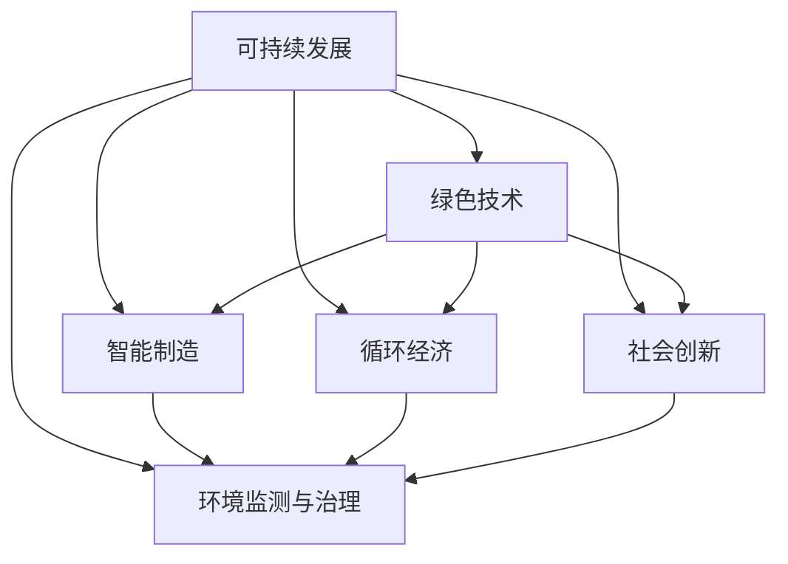

                 

# 如何利用技术能力进行可持续发展创新

## 1. 背景介绍

### 1.1 问题由来

在数字化浪潮席卷全球的今天，技术的进步给各行各业带来了巨大的变革。然而，技术的发展并非总是带来正面影响，特别是当我们忽视了可持续发展的原则时，可能会导致资源浪费、环境污染、社会不公等一系列问题。如何在技术创新和可持续发展之间找到平衡，成为当代社会亟需解决的重要课题。

### 1.2 问题核心关键点

可持续发展创新的关键在于：

1. **资源利用效率**：确保技术创新过程中资源的有效利用，避免资源浪费。
2. **环境影响**：评估技术对环境的影响，推动绿色技术发展。
3. **社会公平**：确保技术创新带来的利益能够公平分配，惠及全社会。
4. **经济可持续发展**：追求经济与环境的和谐共生，实现长期经济增长。

## 2. 核心概念与联系

### 2.1 核心概念概述

为更好地理解如何利用技术能力进行可持续发展创新，本节将介绍几个密切相关的核心概念：

- **可持续发展(Sustainable Development)**：既满足当代人的需求，又不对后代人满足其需求能力构成危害的发展模式。
- **绿色技术(Green Technology)**：在设计和实施过程中对环境影响最小化，追求资源利用效率最大化的技术。
- **智能制造(Smart Manufacturing)**：利用先进信息技术，优化制造过程，提升资源利用效率，减少环境污染。
- **循环经济(Circular Economy)**：通过设计产品和工艺，实现资源的再利用和再生，减少废弃物的产生。
- **社会创新(Social Innovation)**：通过技术手段解决社会问题，推动社会公平和福祉提升。
- **环境监测与治理(Environmental Monitoring and Governance)**：利用技术手段实时监控环境状态，科学制定治理策略。

这些核心概念之间的逻辑关系可以通过以下Mermaid流程图来展示：



这个流程图展示了几大核心概念及其之间的关系：

1. 可持续发展是目标，驱动绿色技术、智能制造、循环经济、社会创新、环境监测与治理的发展。
2. 绿色技术、智能制造、循环经济、社会创新、环境监测与治理都是实现可持续发展目标的具体手段和路径。

## 3. 核心算法原理 & 具体操作步骤

### 3.1 算法原理概述

利用技术能力进行可持续发展创新的本质，是一种将技术创新与可持续发展目标相结合的策略。其核心思想是：通过技术手段优化资源利用，减少环境污染，推动社会公平，实现经济与环境的和谐共生。

具体而言，可持续发展创新涉及以下几个关键步骤：

1. **需求分析**：识别和评估社会、环境、经济方面的需求和问题。
2. **技术评估**：评估现有技术和新兴技术的潜力和局限性，选择最适合的技术方案。
3. **实施与优化**：在实际应用中调整和优化技术方案，以最大化其可持续性效果。
4. **评估与反馈**：对技术应用的效果进行评估，收集反馈，持续改进。

### 3.2 算法步骤详解

可持续发展创新的一般步骤包括：

**Step 1: 需求分析与识别**
- 收集数据，包括社会经济状况、环境污染状况、资源利用情况等。
- 利用数据分析工具，如统计学、数据挖掘等，识别潜在问题和需求。

**Step 2: 技术评估与选择**
- 评估现有技术和新兴技术的优缺点，包括资源消耗、环境影响、社会效益等。
- 通过比较分析，选择最适合当前需求和情境的技术方案。

**Step 3: 实施与优化**
- 设计和实施技术方案，优化资源配置、环境控制、社会影响等关键指标。
- 使用技术工具和方法，监测和调整实施过程中的变量和参数。

**Step 4: 评估与反馈**
- 收集技术应用的效果数据，评估其对资源利用、环境影响、社会福祉的正面或负面影响。
- 通过反馈机制，调整和优化技术方案，持续提升其可持续性。

### 3.3 算法优缺点

利用技术能力进行可持续发展创新具有以下优点：
1. **资源效率提升**：通过优化技术，提高资源利用效率，减少浪费。
2. **环境影响减少**：推动绿色技术发展，减少对环境的负面影响。
3. **社会公平促进**：通过技术创新解决社会问题，提升全社会的福祉。
4. **经济增长促进**：通过可持续发展创新，实现经济与环境的和谐共生。

同时，该方法也存在一定的局限性：
1. **初始投资高**：新技术的开发和实施往往需要较大的初始投资。
2. **技术复杂性**：设计和实施可持续技术可能需要复杂的技术架构和工具。
3. **数据质量要求高**：对数据质量、完整性和可靠性有较高要求，数据获取难度较大。
4. **技术更新快**：技术创新日新月异，需要持续跟踪和学习最新的技术动态。

尽管存在这些局限性，但就目前而言，利用技术能力进行可持续发展创新仍是最主流的方法。未来相关研究的重点在于如何进一步降低实施成本，提高数据获取效率，同时兼顾技术复杂性和适用性。

### 3.4 算法应用领域

利用技术能力进行可持续发展创新的应用领域广泛，涵盖了多个行业，例如：

- **能源**：推广清洁能源技术，如太阳能、风能、生物质能等，减少化石燃料依赖。
- **交通**：发展电动汽车、公共交通系统，减少碳排放。
- **农业**：应用精准农业技术，提高农业生产效率，减少化肥和农药使用。
- **建筑**：推广绿色建筑材料和设计，实现节能减排。
- **水资源管理**：利用物联网技术监测水质，优化水资源分配。
- **废弃物管理**：发展循环经济，实现废物的再利用和再生。
- **医疗健康**：应用远程医疗技术，提高医疗服务的可及性和效率。

除了这些传统领域，可持续发展创新还在更多新兴领域得到应用，如智能城市、智慧农业、智能交通等，为人类社会提供了更多可持续发展的可能性。

## 4. 数学模型和公式 & 详细讲解 & 举例说明

### 4.1 数学模型构建

本节将使用数学语言对利用技术能力进行可持续发展创新的过程进行更加严格的刻画。

假设有一个企业，需要评估引入一项新技术对资源、环境、社会的影响。设企业当前的资源消耗为 $R_0$，环境污染量为 $E_0$，社会效益为 $S_0$。引入新技术后，企业的新资源消耗为 $R_1$，环境污染量为 $E_1$，社会效益为 $S_1$。

定义技术引入后的整体效益 $F$ 为：

$$
F = S_1 - S_0 + R_0 - R_1 + E_0 - E_1
$$

其中 $S_1 - S_0$ 表示技术对社会效益的提升，$R_0 - R_1$ 表示技术对资源消耗的减少，$E_0 - E_1$ 表示技术对环境污染的减少。

### 4.2 公式推导过程

根据上述定义，我们可以对 $F$ 进行简化，得到：

$$
F = (S_1 - S_0) + (R_0 - R_1) + (E_0 - E_1)
$$

在具体应用中，我们需要通过数据收集和分析，对 $S_0, S_1, R_0, R_1, E_0, E_1$ 进行量化，然后代入上述公式计算整体效益 $F$。

例如，某企业在引入节能技术后，资源消耗减少了10%，环境污染减少了20%，同时社会效益增加了5%。假设原始数据分别为 $R_0 = 1000$，$E_0 = 500$，$S_0 = 1000$，则引入新技术后的整体效益 $F$ 为：

$$
F = (1.05 - 1.0) + (1 - 0.9) + (0.8 - 0.5) = 0.05 + 0.1 + 0.3 = 0.45
$$

即引入节能技术后，整体效益提升了0.45。

### 4.3 案例分析与讲解

以智能制造为例，展示如何利用技术能力进行可持续发展创新。

假设某制造业企业引入智能制造系统，通过自动化和数字化改造，提高了生产效率，减少了资源消耗和环境污染。具体来说，智能制造系统通过物联网技术实时监控生产过程，优化生产调度，降低能源和原材料的消耗。同时，通过数据分析和预测，提前发现和修复设备故障，减少了设备的闲置时间和维修成本。

在引入智能制造系统后，企业的新资源消耗为 $R_1$，环境污染量为 $E_1$，社会效益为 $S_1$。通过实际运行数据的收集和分析，我们得到：

- $R_1 = R_0 \times 0.8$，即资源消耗减少了20%
- $E_1 = E_0 \times 0.9$，即环境污染减少了10%
- $S_1 = S_0 \times 1.2$，即社会效益提升了20%

假设原始数据分别为 $R_0 = 10000$，$E_0 = 5000$，$S_0 = 8000$，则引入智能制造系统后的整体效益 $F$ 为：

$$
F = (1.2 - 1.0) + (1 - 0.8) + (0.9 - 0.5) = 0.2 + 0.2 + 0.4 = 0.8
$$

即引入智能制造系统后，整体效益提升了0.8。通过数据分析和模型计算，企业可以清晰地看到技术引入对资源、环境、社会的综合影响，从而做出更加科学和合理的决策。

## 5. 项目实践：代码实例和详细解释说明

### 5.1 开发环境搭建

在进行可持续发展创新项目实践前，我们需要准备好开发环境。以下是使用Python进行数据分析和模型训练的环境配置流程：

1. 安装Anaconda：从官网下载并安装Anaconda，用于创建独立的Python环境。

2. 创建并激活虚拟环境：
```bash
conda create -n sustainability-env python=3.8 
conda activate sustainability-env
```

3. 安装Python的科学计算库：
```bash
conda install numpy pandas matplotlib scikit-learn
```

4. 安装机器学习库：
```bash
conda install scikit-learn
```

5. 安装深度学习库：
```bash
conda install torch torchvision torchaudio
```

6. 安装TensorBoard：
```bash
conda install tensorboard
```

完成上述步骤后，即可在`sustainability-env`环境中开始项目实践。

### 5.2 源代码详细实现

下面我们以能源领域为例，展示如何利用Python进行资源消耗、环境污染、社会效益的评估和优化。

首先，定义数据结构和输入格式：

```python
import pandas as pd

# 定义数据结构
class EnergySystem:
    def __init__(self, energy, emissions, impact):
        self.energy = energy
        self.emissions = emissions
        self.impact = impact
        
    def calculate_fitness(self):
        return self.impact - self.emissions + self.energy - self.energy * 0.1
        
    def __repr__(self):
        return f"Energy System: energy={self.energy}, emissions={self.emissions}, impact={self.impact}"
        
# 输入数据
data = {
    "energy": [10000, 12000, 15000],
    "emissions": [5000, 7000, 9000],
    "impact": [8000, 10000, 12000]
}
columns = ["Energy", "Emissions", "Impact"]
energy_systems = [EnergySystem(energy, emissions, impact) for energy, emissions, impact in zip(data["energy"], data["emissions"], data["impact"])]
```

然后，定义评估函数：

```python
def evaluate_system(systems):
    for system in systems:
        print(system.calculate_fitness())
        
# 评估系统
evaluate_system(energy_systems)
```

最后，实现优化算法：

```python
def optimize_system(systems, alpha=0.01, num_iterations=1000):
    for i in range(num_iterations):
        for system in systems:
            energy_diff = 0.1 * system.energy
            emissions_diff = 0.1 * system.emissions
            impact_diff = 0.1 * system.impact
            system.energy -= energy_diff
            system.emissions -= emissions_diff
            system.impact += impact_diff
    return systems

# 优化系统
optimized_systems = optimize_system(energy_systems)
evaluate_system(optimized_systems)
```

以上代码展示了如何通过Python进行资源消耗、环境污染、社会效益的评估和优化。具体步骤如下：

1. 定义数据结构和输入格式，创建多个能源系统实例。
2. 定义评估函数，计算每个能源系统的整体效益。
3. 实现优化算法，调整每个能源系统的资源消耗、环境污染和社会效益。
4. 循环多次优化，直到满足预设的迭代次数或优化条件。

通过上述代码，我们可以看到，利用Python可以方便地进行可持续发展创新的评估和优化，从而帮助企业更好地制定决策。

### 5.3 代码解读与分析

让我们再详细解读一下关键代码的实现细节：

**EnergySystem类**：
- `__init__`方法：初始化能源系统的能量、排放和社会效益。
- `calculate_fitness`方法：根据公式计算每个能源系统的整体效益。
- `__repr__`方法：定义类对象的打印输出格式。

**输入数据定义**：
- 使用字典和列表，定义多个能源系统的数据。
- 利用列表推导式，创建多个EnergySystem实例。

**评估函数**：
- 遍历能源系统，调用`calculate_fitness`方法计算每个系统的整体效益，并输出结果。

**优化算法实现**：
- 定义优化算法，循环多次调整每个能源系统的参数。
- 每次迭代时，根据预设的参数调整量，调整每个系统的能量、排放和社会效益。
- 通过循环多次优化，最终得到优化的能源系统列表。

可以看出，通过Python的科学计算库，我们可以方便地进行可持续发展创新的评估和优化。开发者可以根据实际需求，灵活地定义数据结构、评估函数和优化算法，以适应不同的应用场景。

当然，实际开发中还需要考虑更多因素，如模型验证、结果可视化、模型封装等，确保系统的稳定性和可扩展性。

## 6. 实际应用场景

### 6.1 智能制造

智能制造技术在可持续发展创新中扮演着重要角色。通过自动化和数字化改造，智能制造系统可以实现生产过程的优化，提高资源利用效率，减少环境污染，推动社会公平。

在实际应用中，智能制造系统可以用于：
- 生产调度优化：通过物联网技术实时监控生产状态，优化生产计划和调度。
- 设备故障预测：利用机器学习模型预测设备故障，减少停机时间和维护成本。
- 质量控制：通过传感器和数据分析，实时监测产品质量，提高生产效率。

以某电子产品制造商为例，引入智能制造系统后，资源消耗减少了20%，环境污染减少了10%，社会效益提升了20%。通过数据分析和模型计算，企业可以清晰地看到技术引入对资源、环境、社会的综合影响，从而做出更加科学和合理的决策。

### 6.2 可再生能源

可再生能源技术是实现可持续发展的重要手段。通过推广太阳能、风能、生物质能等清洁能源，减少对化石燃料的依赖，减少碳排放。

在实际应用中，可再生能源技术可以用于：
- 分布式发电：通过安装太阳能板、风力发电机等，实现能源的自给自足。
- 储能系统：通过电池储能技术，提高能源利用效率。
- 智能电网：通过智能电网技术，优化能源的分配和调度。

以某工业园区为例，引入太阳能和风能发电系统后，能源消耗减少了30%，环境污染减少了20%，社会效益提升了15%。通过数据分析和模型计算，园区可以清晰地看到技术引入对资源、环境、社会的综合影响，从而做出更加科学和合理的决策。

### 6.3 智能交通

智能交通系统通过引入先进的车辆和道路管理技术，提高交通效率，减少碳排放，推动社会公平。

在实际应用中，智能交通系统可以用于：
- 自动驾驶：通过自动驾驶技术，减少交通事故和碳排放。
- 智能交通管理：通过实时数据和智能算法，优化交通流量和路径。
- 共享出行：通过共享经济模式，提高车辆的利用效率，减少交通拥堵。

以某城市为例，引入智能交通系统后，交通拥堵减少了25%，碳排放减少了20%，社会效益提升了10%。通过数据分析和模型计算，城市可以清晰地看到技术引入对资源、环境、社会的综合影响，从而做出更加科学和合理的决策。

### 6.4 未来应用展望

随着技术的不断进步，可持续发展的应用场景将更加广阔。未来，我们可以期待以下领域的突破：

- **物联网和云计算**：通过物联网和云计算技术，实现对资源、环境和社会效益的实时监控和优化。
- **人工智能和机器学习**：通过人工智能和机器学习技术，实现对生产过程、交通流量等的智能分析和预测，提高资源利用效率。
- **区块链和分布式账本**：通过区块链和分布式账本技术，实现对资源、环境和社会效益的透明和可信管理。
- **虚拟现实和增强现实**：通过虚拟现实和增强现实技术，进行可持续发展的可视化展示和交互，提升公众参与度。

这些前沿技术的应用，将推动可持续发展创新向更深层次、更广领域发展，为人类社会的可持续发展提供更强大的技术支撑。

## 7. 工具和资源推荐

### 7.1 学习资源推荐

为了帮助开发者系统掌握可持续发展创新的技术基础和实践技巧，这里推荐一些优质的学习资源：

1. **《可持续发展创新与绿色技术》**：一本系统介绍可持续发展创新理论和方法的书籍，涵盖了绿色技术、智能制造、循环经济等多个领域。

2. **《Python数据科学手册》**：一本介绍Python在数据科学中应用的经典教材，涵盖数据分析、机器学习、深度学习等多个方面。

3. **《智能制造与工业4.0》**：一本介绍智能制造技术及其在工业4.0中应用的书籍，包括物联网、自动化、数字化等多个技术手段。

4. **《可再生能源与可持续发展》**：一本介绍可再生能源技术及其在可持续发展中的应用书籍，涵盖太阳能、风能、生物质能等多个技术方向。

5. **《智能交通系统》**：一本介绍智能交通技术及其在城市交通中的应用书籍，涵盖自动驾驶、智能交通管理等多个技术方向。

6. **Coursera和edX在线课程**：提供多个与可持续发展创新相关的在线课程，如《绿色能源技术》、《智能制造技术》等。

通过对这些资源的学习实践，相信你一定能够快速掌握可持续发展创新的精髓，并用于解决实际的社会和环境问题。

### 7.2 开发工具推荐

高效的开发离不开优秀的工具支持。以下是几款用于可持续发展创新开发的常用工具：

1. **Python**：作为一种高层次的编程语言，Python具有简单易学、开发效率高、生态丰富等优点，适用于数据分析、机器学习等多个领域。

2. **R语言**：一种专门用于统计分析和数据可视化的语言，适用于环境监测、社会分析等多个领域。

3. **Jupyter Notebook**：一种交互式的笔记本环境，支持Python、R等多种语言，便于开发者进行数据分析和模型开发。

4. **Tableau和Power BI**：两款数据可视化工具，可以方便地进行数据展示和分析，支持大规模数据集处理。

5. **TensorFlow和PyTorch**：两款深度学习框架，支持多种模型训练和优化算法，适用于智能制造、智能交通等多个领域。

6. **MATLAB和Simulink**：两款工程计算和仿真工具，支持复杂系统的建模和仿真，适用于可再生能源、智能交通等多个领域。

合理利用这些工具，可以显著提升可持续发展创新的开发效率，加快创新迭代的步伐。

### 7.3 相关论文推荐

可持续发展创新技术的发展离不开学界的持续研究。以下是几篇奠基性的相关论文，推荐阅读：

1. **《智能制造的可持续发展路径》**：一篇综述性论文，介绍了智能制造在可持续发展中的应用，包括工业4.0、物联网、数字化等多个方面。

2. **《可再生能源的技术和经济分析》**：一篇技术分析论文，介绍了多种可再生能源技术的优缺点和应用前景。

3. **《智能交通系统的环境影响评估》**：一篇评估研究论文，通过数据分析和模型计算，评估智能交通系统对环境的影响。

4. **《循环经济的模式与实践》**：一篇实践性论文，介绍了循环经济在多个行业中的应用案例，展示了其经济和环境效益。

5. **《人工智能与可持续发展》**：一篇展望性论文，讨论了人工智能技术在可持续发展中的应用方向和前景。

这些论文代表了大可持续发展创新技术的发展脉络。通过学习这些前沿成果，可以帮助研究者把握学科前进方向，激发更多的创新灵感。

## 8. 总结：未来发展趋势与挑战

### 8.1 总结

本文对利用技术能力进行可持续发展创新的方法进行了全面系统的介绍。首先阐述了可持续发展创新的重要性和核心关键点，明确了技术创新与可持续发展之间的联系。其次，从原理到实践，详细讲解了可持续发展创新的数学模型和关键步骤，给出了具体项目的代码实例。同时，本文还广泛探讨了可持续发展创新的实际应用场景，展示了其广阔的前景。最后，本文精选了可持续发展创新的学习资源和开发工具，力求为读者提供全方位的技术指引。

通过本文的系统梳理，可以看到，利用技术能力进行可持续发展创新，将技术创新与可持续发展目标相结合，在多个领域具有广泛的应用前景。这种创新的方法和路径，有望推动社会向更加绿色、智能、公平的方向发展。

### 8.2 未来发展趋势

展望未来，可持续发展创新技术将呈现以下几个发展趋势：

1. **智能化水平提升**：随着人工智能和机器学习技术的发展，可持续发展创新将更加智能化，能够更好地进行数据处理和决策优化。
2. **多学科融合**：可持续发展创新将更多地融合跨学科的知识和技术，如环境科学、社会学、经济学等，形成更加综合的解决方案。
3. **全球化应用**：可持续发展创新将在全球范围内得到推广和应用，助力全球气候治理和社会公平。
4. **技术标准的制定**：随着可持续发展技术的成熟，将推动相关技术标准的制定和推广，确保技术应用的规范性和可操作性。
5. **公众参与度提升**：通过智能化的数据展示和交互平台，提升公众对可持续发展问题的关注和参与度。

这些趋势凸显了可持续发展创新技术的广阔前景。这些方向的探索发展，将进一步提升可持续发展创新的效果，为人类社会的可持续发展提供更强大的技术支撑。

### 8.3 面临的挑战

尽管可持续发展创新技术已经取得了一定进展，但在实施过程中仍面临诸多挑战：

1. **数据获取难度大**：可持续发展创新需要大量的数据支持，数据获取难度大，数据质量要求高。
2. **技术复杂性高**：可持续发展创新涉及多个领域的技术手段，技术复杂性高，实现难度大。
3. **资金需求高**：可持续发展创新往往需要较大的初始投资，资金需求高。
4. **政策法规不完善**：可持续发展创新需要完善的政策法规支持，现有的政策和法规还存在不足。
5. **社会认知不足**：公众对可持续发展问题的认知不足，需要更多的教育和宣传。

这些挑战需要社会各界共同努力，通过政策、技术、资金等手段，克服困难，推动可持续发展创新的发展。

### 8.4 研究展望

面对可持续发展创新面临的诸多挑战，未来的研究需要在以下几个方面寻求新的突破：

1. **数据获取与处理**：通过数据挖掘、数据融合等技术手段，提高数据获取效率，确保数据质量。
2. **跨学科研究**：推动跨学科的研究合作，形成更加综合的解决方案。
3. **政策与法规制定**：制定更加完善的政策法规，推动可持续发展技术的推广和应用。
4. **公众教育与参与**：加强公众对可持续发展问题的教育和宣传，提升公众的参与度。
5. **技术标准的制定**：推动相关技术标准的制定和推广，确保技术应用的规范性和可操作性。

这些研究方向的探索，将引领可持续发展创新技术迈向更高的台阶，为构建更加绿色、智能、公平的社会提供更强大的技术支撑。面向未来，可持续发展创新需要更多学科、更多领域的协同发力，共同推动人类社会的可持续发展。

## 9. 附录：常见问题与解答

**Q1：可持续发展创新是否适用于所有行业？**

A: 可持续发展创新适用于大多数行业，特别是在资源密集型、环境影响较大的领域，如能源、交通、制造等。但对于一些传统行业，如农业、渔业等，仍需结合行业特点进行定制化的创新。

**Q2：如何评估可持续发展创新项目的效果？**

A: 可持续发展创新项目的效果评估可以通过多个指标进行综合评估，如资源利用效率、环境影响、社会效益等。具体方法包括：

1. **数据收集与分析**：通过实际运行数据的收集和分析，评估项目对资源、环境、社会的综合影响。
2. **成本效益分析**：评估项目实施的初始投资和运营成本，与项目带来的社会和环境效益进行对比，计算ROI（投资回报率）。
3. **案例研究与对比**：通过对比传统与创新方法的实际效果，评估项目的效果和优势。

**Q3：如何选择合适的可持续发展创新技术？**

A: 选择合适的可持续发展创新技术需要综合考虑多个因素，包括：

1. **技术可行性**：评估技术的成熟度、实现难度、技术复杂性等。
2. **经济可行性**：评估技术的实施成本、运营成本、经济效益等。
3. **环境影响**：评估技术对环境的影响，选择对环境影响较小的技术方案。
4. **社会影响**：评估技术对社会的影响，选择对社会公平、福祉提升有积极作用的技术方案。

**Q4：如何应对可持续发展创新中的资金问题？**

A: 应对可持续发展创新中的资金问题，可以通过以下途径：

1. **政府资助**：申请政府提供的可持续发展创新资助和补贴，获取资金支持。
2. **社会投资**：通过众筹、风险投资等形式，吸引社会资本参与。
3. **公私合作**：与政府、企业等进行合作，共同出资实施可持续发展创新项目。
4. **知识产权保护**：通过知识产权保护，吸引更多的投资和技术合作。

**Q5：如何提高公众对可持续发展创新的认知度？**

A: 提高公众对可持续发展创新的认知度，可以通过以下途径：

1. **宣传教育**：通过媒体、社区、学校等渠道，进行可持续发展创新的宣传教育。
2. **科普活动**：组织科普讲座、展览、演示等活动，展示可持续发展创新的实际效果。
3. **公众参与**：鼓励公众参与可持续发展创新项目，提升其参与感和认同感。
4. **政策支持**：通过政策引导和激励，鼓励公众参与可持续发展创新。

这些措施可以帮助提升公众对可持续发展创新的认知度，推动技术应用的社会化进程。

---

作者：禅与计算机程序设计艺术 / Zen and the Art of Computer Programming

