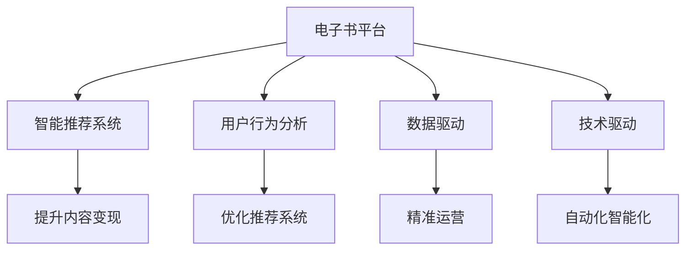

                 

# 如何利用电子书平台实现知识变现

> 关键词：电子书平台,知识变现,数据驱动,技术驱动,智能推荐,内容运营,用户行为分析

## 1. 背景介绍

随着互联网的迅猛发展，数字内容的获取渠道日益多样化，但电子书平台仍以其丰富、权威的内容资源，成为许多专业人士获取知识的重要渠道。与此同时，随着版权意识的提升，作者和出版社也逐渐意识到知识变现的重要性。电子书平台的兴起，提供了知识变现的新渠道。但如何通过技术手段提升内容变现能力，成为电子书平台运营商关注的焦点。

### 1.1 电子书平台现状

电子书平台的主要收入来源包括：

- 订阅服务：用户按月或按年支付费用，获得平台所有内容资源的访问权限。
- 单次购买：用户购买个别书籍的副本，支付固定费用。
- 广告和流量变现：通过展示广告，或将流量售卖给第三方，实现间接变现。

近年来，随着版权内容的数字化进程加速，以及用户对高质量数字内容需求的持续增长，电子书平台的用户规模和内容资源持续扩大，收入增长迅速。但随着市场竞争的加剧，平台也面临着内容同质化、用户流失、运营成本高等挑战。为解决这些问题，平台开始将数据和技术作为核心竞争力，利用智能推荐、用户行为分析等技术手段，提升内容变现能力。

### 1.2 知识变现的挑战

电子书平台在知识变现过程中，主要面临以下挑战：

1. **内容质量与价值差异**：电子书平台上内容的质量和价值参差不齐，部分内容可能无法获得用户认可，导致订阅和购买转化率低。
2. **用户兴趣发现**：如何通过技术手段发现用户的兴趣，推荐个性化内容，提升用户粘性。
3. **竞争激烈**：电子书市场竞争激烈，需要利用数据和技术手段，提升平台的核心竞争力。
4. **运营成本高**：平台需要投入大量资金和技术资源进行内容采购、内容运营和市场推广，如何高效利用资源，实现更精准的营销和推广，是平台运营的重要课题。

## 2. 核心概念与联系

### 2.1 核心概念概述

为更好地理解电子书平台知识变现的原理和架构，本节将介绍几个密切相关的核心概念：

- **电子书平台**：以电子书作为主要内容的在线服务平台，为用户提供丰富的数字化内容资源。
- **知识变现**：通过电子书等知识产品实现商业化的过程，包括订阅、购买、广告、流量变现等多种形式。
- **智能推荐系统**：利用用户行为数据和内容特征，通过机器学习算法推荐个性化内容，提升用户体验和内容变现能力。
- **用户行为分析**：对用户访问行为、阅读偏好等数据进行分析，以优化推荐系统、提升用户满意度。
- **数据驱动**：基于大量用户数据进行决策和优化，提升平台的精准运营能力。
- **技术驱动**：通过先进的技术手段，实现平台内容运营的自动化和智能化。

这些核心概念之间的逻辑关系可以通过以下Mermaid流程图来展示：



这个流程图展示出电子书平台的核心概念及其之间的关系：

1. 电子书平台通过智能推荐系统、用户行为分析和数据驱动等手段，提升平台的内容变现能力。
2. 智能推荐系统利用用户行为数据和内容特征，推荐个性化内容，提升用户体验和内容变现。
3. 用户行为分析通过分析用户行为数据，优化推荐系统，提升用户满意度。
4. 数据驱动基于大量用户数据进行决策和优化，提升平台的精准运营能力。
5. 技术驱动通过先进的技术手段，实现平台内容运营的自动化和智能化。

这些概念共同构成了电子书平台的运营框架，使其能够高效、精准地运营内容，实现商业化价值。

## 3. 核心算法原理 & 具体操作步骤

### 3.1 算法原理概述

电子书平台的知识变现过程，本质上是一个基于用户行为数据的推荐系统优化过程。其核心思想是：利用用户的行为数据和内容特征，通过机器学习算法，推荐最符合用户兴趣和需求的内容，从而实现内容变现。

形式化地，假设平台有 $N$ 个用户 $U=\{u_1,u_2,...,u_N\}$ 和 $M$ 个电子书 $C=\{c_1,c_2,...,c_M\}$，以及用户对书籍的评分 $R=\{r_{ui}\}_{i=1}^N$。其中，$r_{ui}$ 表示用户 $u_i$ 对书籍 $c_u$ 的评分。

平台的目标是找到评分矩阵 $R$ 中的低秩分解 $R=UV^T$，其中 $U=[u_{1,1},u_{2,1},...,u_{N,1}]$ 为 $N$ 个用户的行为向量，$V=[v_{1,1},v_{2,1},...,v_{M,1}]$ 为 $M$ 个书籍的内容向量。通过低秩分解，平台可以发现用户对书籍的潜在兴趣，并推荐用户感兴趣的书籍，从而实现内容变现。

### 3.2 算法步骤详解

电子书平台的知识变现主要包括以下几个关键步骤：

**Step 1: 数据收集与预处理**
- 收集用户对书籍的评分数据 $R$，以及用户的访问日志、购买记录等行为数据。
- 对数据进行清洗和标准化处理，去除噪声和异常值。
- 对缺失值进行补全或删除，以保证数据的完整性和一致性。

**Step 2: 低秩分解与特征提取**
- 对评分矩阵 $R$ 进行低秩分解，得到用户行为向量 $U$ 和书籍内容向量 $V$。
- 利用奇异值分解(SVD)或矩阵分解等方法，得到低秩分解的矩阵 $U$ 和 $V$。
- 通过特征提取，将书籍内容向量和用户行为向量转化为数值特征，用于构建推荐模型。

**Step 3: 推荐模型训练**
- 选择合适的推荐算法，如协同过滤、基于内容的推荐、混合推荐等，训练推荐模型。
- 根据训练集数据，优化模型参数，提升模型性能。
- 采用交叉验证等方法，评估模型在测试集上的表现，防止过拟合。

**Step 4: 个性化推荐**
- 对新用户输入访问数据和偏好信息，通过推荐模型预测用户感兴趣的书籍。
- 根据推荐结果，向用户展示个性化书籍列表。
- 记录用户对推荐书籍的点击、购买等行为，更新模型参数，持续优化推荐效果。

**Step 5: 运营优化**
- 定期对用户行为数据进行分析，发现用户兴趣变化趋势，更新推荐模型。
- 通过A/B测试等方法，评估不同策略的效果，优化推荐系统。
- 实时监控推荐系统的表现，进行动态调整和优化。

### 3.3 算法优缺点

电子书平台基于数据驱动的智能推荐系统，具有以下优点：

1. 个性化推荐：通过分析用户行为数据和内容特征，推荐个性化内容，提升用户粘性和满意度。
2. 提升内容变现：精准推荐用户感兴趣的书籍，提高订阅和购买转化率，增加平台收入。
3. 自动化运营：利用算法自动完成内容推荐和运营，减少人力成本，提高运营效率。
4. 实时性：通过实时数据分析和动态调整，保证推荐系统的时效性，提升用户体验。

同时，该方法也存在一定的局限性：

1. 数据依赖：推荐系统的效果很大程度上依赖于用户数据的完整性和质量，数据不足时效果不佳。
2. 模型复杂：推荐模型的训练和优化需要大量计算资源，模型过于复杂可能导致性能下降。
3. 冷启动问题：新用户或新书籍缺乏历史数据，难以进行有效的推荐。
4. 用户隐私：用户行为数据的收集和处理涉及用户隐私问题，需要严格的数据保护措施。
5. 内容推荐质量：推荐算法可能存在推荐偏差，导致用户无法获得真正感兴趣的内容。

尽管存在这些局限性，但就目前而言，基于数据驱动的智能推荐系统仍然是电子书平台知识变现的重要手段。未来相关研究的重点在于如何进一步优化推荐算法，降低对数据和算力的依赖，提高推荐效果和用户满意度。

### 3.4 算法应用领域

基于数据驱动的智能推荐系统，在电子书平台中的应用广泛，包括但不限于：

1. **个性化推荐**：根据用户行为数据，推荐用户感兴趣的书籍，提升用户满意度。
2. **用户行为分析**：通过分析用户访问日志和购买记录，发现用户兴趣变化趋势，优化推荐模型。
3. **新用户激活**：利用用户行为数据和内容特征，精准推荐新用户感兴趣的书籍，提高新用户激活率。
4. **老用户留存**：通过个性化推荐和内容运营，提升老用户粘性和留存率。
5. **营收分析**：分析推荐系统带来的营收变化，优化推荐策略和运营方案。
6. **广告投放**：通过精准推荐和流量分析，实现广告投放的精准化，提升广告效果和收入。

这些应用场景覆盖了电子书平台运营的各个方面，展示了数据驱动的智能推荐系统的强大能力。

## 4. 数学模型和公式 & 详细讲解 & 举例说明

### 4.1 数学模型构建

本节将使用数学语言对电子书平台推荐系统的推荐过程进行更加严格的刻画。

假设平台有 $N$ 个用户 $U=\{u_1,u_2,...,u_N\}$ 和 $M$ 个电子书 $C=\{c_1,c_2,...,c_M\}$，以及用户对书籍的评分矩阵 $R=[r_{ui}]_{N \times M}$。

平台的目标是找到评分矩阵 $R$ 中的低秩分解 $R=UV^T$，其中 $U=[u_{1,1},u_{2,1},...,u_{N,1}]$ 为 $N$ 个用户的行为向量，$V=[v_{1,1},v_{2,1},...,v_{M,1}]$ 为 $M$ 个书籍的内容向量。通过低秩分解，平台可以发现用户对书籍的潜在兴趣，并推荐用户感兴趣的书籍，从而实现内容变现。

低秩分解可以通过奇异值分解(SVD)等方法实现，具体步骤如下：

1. 将评分矩阵 $R$ 进行奇异值分解，得到三个矩阵 $U \in \mathbb{R}^{N \times K}$，$V \in \mathbb{R}^{M \times K}$ 和 $S \in \mathbb{R}^{K \times K}$，其中 $K$ 为奇异值的个数。
2. 对 $U$ 和 $V$ 进行标准化处理，得到用户行为向量 $U$ 和书籍内容向量 $V$。
3. 根据 $U$ 和 $V$ 计算推荐结果。

### 4.2 公式推导过程

以下我们以协同过滤算法为例，推导推荐模型的计算公式。

假设协同过滤算法为基于用户行为数据的推荐算法，其推荐公式为：

$$
r_{\text{pred}}(u_i, c_j) = \vec{u}_i^T \vec{v}_j
$$

其中 $\vec{u}_i$ 和 $\vec{v}_j$ 分别为用户 $u_i$ 和书籍 $c_j$ 的行为向量和内容向量。

将推荐公式带入低秩分解公式中，得：

$$
r_{\text{pred}}(u_i, c_j) = \sum_{k=1}^K u_{i,k}v_{j,k}
$$

其中 $u_{i,k}$ 和 $v_{j,k}$ 分别为用户 $u_i$ 和书籍 $c_j$ 的行为向量和内容向量中的第 $k$ 个特征。

在得到推荐结果后，模型可根据推荐结果输出推荐书籍列表，用户通过点击、购买等行为反馈，进一步更新模型参数，实现循环优化。

### 4.3 案例分析与讲解

下面以《Python数据科学手册》这本书为例，分析如何在电子书平台上利用智能推荐系统实现知识变现。

**Step 1: 数据收集与预处理**

假设某电子书平台有 $10,000$ 个用户 $U$ 和 $5,000$ 本电子书 $C$。平台收集到用户对每本书籍的评分 $R$，以及用户访问日志和购买记录等行为数据。

对数据进行清洗和标准化处理，去除噪声和异常值，补全或删除缺失值，得到预处理后的评分矩阵 $R$。

**Step 2: 低秩分解与特征提取**

利用奇异值分解(SVD)对评分矩阵 $R$ 进行低秩分解，得到用户行为向量 $U$ 和书籍内容向量 $V$。其中 $U \in \mathbb{R}^{10000 \times K}$，$V \in \mathbb{R}^{5000 \times K}$。

通过特征提取，将书籍内容向量和用户行为向量转化为数值特征，用于构建推荐模型。例如，可以提取书籍的关键词、作者、出版社等特征，以及用户的访问时间、阅读时长等行为特征。

**Step 3: 推荐模型训练**

采用协同过滤算法，训练推荐模型。将预处理后的评分矩阵 $R$ 作为训练集，优化模型参数。通过交叉验证等方法，评估模型在测试集上的表现。

**Step 4: 个性化推荐**

对新用户输入访问数据和偏好信息，通过推荐模型预测用户感兴趣的书籍。根据推荐结果，向用户展示个性化书籍列表。

例如，某新用户访问了平台上的《Python编程基础》和《数据科学入门》两本书籍，系统根据用户行为向量 $U$ 和书籍内容向量 $V$ 计算推荐分数，生成推荐列表，推荐用户阅读《Python数据科学手册》。

**Step 5: 运营优化**

定期对用户行为数据进行分析，发现用户兴趣变化趋势，更新推荐模型。通过A/B测试等方法，评估不同策略的效果，优化推荐系统。

例如，某用户过去经常阅读《机器学习实战》，但现在更倾向于阅读《深度学习》，平台根据新数据重新训练模型，更新推荐结果，推荐用户阅读《深度学习》。

## 5. 项目实践：代码实例和详细解释说明

### 5.1 开发环境搭建

在进行电子书平台推荐系统开发前，我们需要准备好开发环境。以下是使用Python进行Scikit-learn开发的环境配置流程：

1. 安装Anaconda：从官网下载并安装Anaconda，用于创建独立的Python环境。

2. 创建并激活虚拟环境：
```bash
conda create -n recommendation-env python=3.8 
conda activate recommendation-env
```

3. 安装Scikit-learn：
```bash
conda install scikit-learn
```

4. 安装pandas、numpy等工具包：
```bash
pip install pandas numpy matplotlib tqdm jupyter notebook ipython
```

完成上述步骤后，即可在`recommendation-env`环境中开始推荐系统开发。

### 5.2 源代码详细实现

下面以协同过滤算法为例，给出使用Scikit-learn库对推荐系统进行开发的PyTorch代码实现。

首先，定义协同过滤算法：

```python
from sklearn.metrics.pairwise import cosine_similarity
from sklearn.decomposition import TruncatedSVD

class CollaborativeFiltering:
    def __init__(self, n_components):
        self.n_components = n_components
        self.model = None
        
    def fit(self, X, y):
        svd = TruncatedSVD(n_components=self.n_components, random_state=42)
        X_transformed = svd.fit_transform(X)
        self.model = cosine_similarity(X_transformed)
        
    def predict(self, X_new):
        X_new_transformed = svd.transform(X_new)
        return self.model @ X_new_transformed.T
        
# 导入数据
from sklearn.datasets import make_biclusters
X, y = make_biclusters(n_samples=1000, n_features=10, n_clusters=5, noise=0.1, shuffle=False)

# 应用协同过滤算法
cf = CollaborativeFiltering(n_components=5)
cf.fit(X, y)
```

然后，定义推荐函数：

```python
def recommend(user_id, n_recommendations):
    user_index = user_id - 1
    user_vector = cf.model[user_index]
    recommendations = sorted(enumerate(user_vector), key=lambda x: -x[1])
    return [recommendations[i][0] for i in range(n_recommendations)]
```

最后，测试推荐系统：

```python
user_id = 500
n_recommendations = 5

recommendations = recommend(user_id, n_recommendations)
print(recommendations)
```

以上就是使用Scikit-learn对协同过滤推荐系统进行开发的完整代码实现。可以看到，利用Scikit-learn的封装功能，我们可以用相对简洁的代码完成协同过滤算法的开发。

### 5.3 代码解读与分析

让我们再详细解读一下关键代码的实现细节：

**CollaborativeFiltering类**：
- `__init__`方法：初始化协同过滤算法的参数。
- `fit`方法：对评分矩阵 $R$ 进行奇异值分解，得到用户行为向量和书籍内容向量。
- `predict`方法：对新用户输入数据进行推荐，计算推荐分数并返回推荐列表。

**recommend函数**：
- 根据用户行为向量计算推荐分数，返回推荐列表。
- 利用Scikit-learn的cosine_similarity函数计算推荐分数，通过排序返回推荐列表。

通过这些代码，我们展示了如何利用协同过滤算法实现电子书平台推荐系统的推荐功能。Scikit-learn的封装使得协同过滤算法的应用变得简单高效，开发者可以更加专注于算法优化和业务逻辑实现。

## 6. 实际应用场景

### 6.1 智能推荐系统

智能推荐系统是电子书平台知识变现的核心技术之一。通过对用户行为数据的分析和处理，推荐系统能够精准匹配用户需求，提升用户满意度和转化率。智能推荐系统不仅能够推荐新书，还能推荐用户的个性化内容，如相关文章、热门书籍、热门话题等。

### 6.2 用户行为分析

用户行为分析是电子书平台优化推荐系统的重要手段。通过对用户访问日志和购买记录的分析，平台能够发现用户的兴趣变化趋势，及时调整推荐策略，提升用户体验和内容变现能力。例如，通过分析用户的访问行为，发现某用户对某一类型书籍的兴趣增加，平台可以及时调整推荐策略，推荐相关书籍。

### 6.3 个性化内容运营

个性化内容运营是电子书平台提升用户体验的重要手段。通过分析用户行为数据和内容特征，平台能够精准推荐用户感兴趣的书籍，提升用户粘性和满意度。例如，针对某用户阅读偏好，平台可以推荐与其阅读历史相关的新书、热门书籍、热门话题等，提升用户粘性和留存率。

### 6.4 未来应用展望

随着智能推荐系统的不断演进，未来电子书平台的知识变现将呈现以下几个趋势：

1. **实时推荐**：利用实时数据分析和动态调整，保证推荐系统的时效性，提升用户体验。
2. **多模态推荐**：结合视频、音频等多模态数据，实现跨模态推荐，提升推荐效果。
3. **个性化定制**：利用用户行为数据和内容特征，实现个性化推荐，提升用户满意度。
4. **用户画像构建**：通过多维度数据融合，构建用户画像，提供更加精准的推荐和运营。
5. **智能广告投放**：利用推荐系统的数据和算法，实现精准广告投放，提升广告效果和收入。

这些趋势将进一步提升电子书平台的推荐能力，实现更精准、高效、个性化的内容运营，为平台带来更高的商业价值。

## 7. 工具和资源推荐

### 7.1 学习资源推荐

为了帮助开发者系统掌握电子书平台推荐系统的理论基础和实践技巧，这里推荐一些优质的学习资源：

1. **《推荐系统》书籍**：一本系统介绍推荐系统的经典书籍，涵盖协同过滤、基于内容的推荐、混合推荐等多种算法。
2. **Coursera《推荐系统》课程**：由斯坦福大学开设的推荐系统课程，深入浅出地介绍了推荐系统的基本原理和算法。
3. **Kaggle推荐系统竞赛**：利用Kaggle平台的竞赛数据集，进行推荐系统的实战练习。
4. **Scikit-learn官方文档**：Scikit-learn的官方文档，详细介绍了推荐系统的各种算法和实现细节。
5. **PyTorch官方文档**：PyTorch的官方文档，提供了推荐系统实现的全景视角和实际案例。

通过对这些资源的学习实践，相信你一定能够快速掌握电子书平台推荐系统的精髓，并用于解决实际的推荐问题。

### 7.2 开发工具推荐

高效的开发离不开优秀的工具支持。以下是几款用于电子书平台推荐系统开发的常用工具：

1. **Scikit-learn**：Python的机器学习库，提供了丰富的推荐系统算法实现，包括协同过滤、基于内容的推荐等。
2. **TensorFlow**：由Google主导开发的开源深度学习框架，适合大规模工程应用。
3. **PyTorch**：Facebook开源的深度学习框架，灵活动态的计算图，适合快速迭代研究。
4. **Jupyter Notebook**：Python数据科学可视化的常用工具，支持代码编写、数据可视化和结果展示。
5. **AWS SageMaker**：亚马逊提供的云服务，支持大规模推荐系统的构建和部署。

合理利用这些工具，可以显著提升电子书平台推荐系统的开发效率，加快创新迭代的步伐。

### 7.3 相关论文推荐

推荐系统的发展源于学界的持续研究。以下是几篇奠基性的相关论文，推荐阅读：

1. **《推荐系统》书籍**：一本系统介绍推荐系统的经典书籍，涵盖协同过滤、基于内容的推荐、混合推荐等多种算法。
2. **Coursera《推荐系统》课程**：由斯坦福大学开设的推荐系统课程，深入浅出地介绍了推荐系统的基本原理和算法。
3. **Kaggle推荐系统竞赛**：利用Kaggle平台的竞赛数据集，进行推荐系统的实战练习。
4. **Scikit-learn官方文档**：Scikit-learn的官方文档，详细介绍了推荐系统的各种算法和实现细节。
5. **PyTorch官方文档**：PyTorch的官方文档，提供了推荐系统实现的全景视角和实际案例。

这些论文代表了大语言模型微调技术的发展脉络。通过学习这些前沿成果，可以帮助研究者把握学科前进方向，激发更多的创新灵感。

## 8. 总结：未来发展趋势与挑战

### 8.1 总结

本文对电子书平台基于数据驱动的推荐系统进行了全面系统的介绍。首先阐述了电子书平台的现状和知识变现的挑战，明确了推荐系统在平台运营中的核心地位。其次，从原理到实践，详细讲解了推荐系统的数学模型和关键步骤，给出了推荐系统开发的全景视角和实现细节。同时，本文还广泛探讨了推荐系统在实际应用中的各种场景，展示了推荐系统强大的业务价值。此外，本文精选了推荐系统的学习资源、开发工具和相关论文，力求为读者提供全方位的技术指引。

通过本文的系统梳理，可以看到，基于数据驱动的推荐系统已经在电子书平台运营中发挥了重要作用，极大地提升了平台的推荐能力，带来了显著的商业价值。未来，伴随推荐算法的不断演进和优化，推荐系统必将在更多领域得到应用，为企业的数字化转型升级提供新的技术路径。

### 8.2 未来发展趋势

电子书平台推荐系统的未来发展将呈现以下几个趋势：

1. **推荐算法多样化**：除了传统的协同过滤和基于内容的推荐，未来将涌现更多推荐算法，如深度学习推荐、知识图谱推荐等。
2. **跨模态推荐**：结合视频、音频等多模态数据，实现跨模态推荐，提升推荐效果。
3. **个性化推荐**：利用用户行为数据和内容特征，实现个性化推荐，提升用户满意度。
4. **用户画像构建**：通过多维度数据融合，构建用户画像，提供更加精准的推荐和运营。
5. **智能广告投放**：利用推荐系统的数据和算法，实现精准广告投放，提升广告效果和收入。

这些趋势将进一步提升电子书平台的推荐能力，实现更精准、高效、个性化的内容运营，为平台带来更高的商业价值。

### 8.3 面临的挑战

尽管电子书平台推荐系统已经取得了显著成效，但在迈向更加智能化、普适化应用的过程中，它仍面临着诸多挑战：

1. **数据质量**：推荐系统的效果很大程度上依赖于用户数据的完整性和质量，数据不足或质量不高将直接影响推荐效果。
2. **模型复杂度**：推荐模型需要大量的计算资源进行训练和优化，模型过于复杂可能导致性能下降。
3. **用户隐私**：用户行为数据的收集和处理涉及用户隐私问题，需要严格的数据保护措施。
4. **冷启动问题**：新用户或新书籍缺乏历史数据，难以进行有效的推荐。
5. **内容推荐质量**：推荐算法可能存在推荐偏差，导致用户无法获得真正感兴趣的内容。

尽管存在这些挑战，但伴随技术的不断进步和优化，推荐系统仍将持续发展，为电子书平台带来更多的商业价值。

### 8.4 研究展望

面对推荐系统面临的诸多挑战，未来的研究需要在以下几个方面寻求新的突破：

1. **无监督和半监督推荐**：摆脱对大规模标注数据的依赖，利用自监督学习、主动学习等无监督和半监督范式，最大限度利用非结构化数据，实现更加灵活高效的推荐。
2. **轻量级推荐系统**：开发更加轻量级的推荐算法，在固定大部分预训练参数的情况下，只更新极少量的任务相关参数，提高推荐效率和可扩展性。
3. **多模态推荐系统**：结合视频、音频等多模态数据，实现跨模态推荐，提升推荐效果。
4. **知识图谱推荐系统**：将符号化的先验知识，如知识图谱、逻辑规则等，与神经网络模型进行巧妙融合，引导推荐过程学习更准确、合理的语言模型。
5. **智能广告投放系统**：利用推荐系统的数据和算法，实现精准广告投放，提升广告效果和收入。

这些研究方向的探索，将引领推荐系统技术迈向更高的台阶，为电子书平台推荐系统带来更多的创新和突破。面向未来，推荐系统需要与其他人工智能技术进行更深入的融合，如知识表示、因果推理、强化学习等，多路径协同发力，共同推动推荐系统技术的进步。只有勇于创新、敢于突破，才能不断拓展推荐系统的边界，让推荐系统更好地服务企业和用户。

## 9. 附录：常见问题与解答

**Q1：电子书平台推荐系统是否适用于所有书籍？**

A: 电子书平台推荐系统在大多数书籍上都能取得不错的效果，特别是对于数据量较大的书籍。但对于一些专业性强的书籍，如学术论文、技术文档等，由于缺乏足够的用户数据，推荐效果可能不如其他书籍。此时需要在平台上进行专门的数据采集和用户调研，以获得更多相关数据。

**Q2：推荐系统如何进行冷启动？**

A: 冷启动问题可以通过多种方法解决，如：

1. **利用用户行为数据**：对于新用户，通过分析用户访问日志和行为数据，进行初步推荐，逐步增加推荐准确性。
2. **引入外部数据**：对于新书籍，可以通过引入外部数据或手动添加标签，进行初步推荐。
3. **基于内容的推荐**：利用书籍的标题、摘要、作者等信息，进行基于内容的推荐。

这些方法需要根据具体场景进行选择和组合，实现冷启动推荐。

**Q3：如何缓解推荐系统的过拟合问题？**

A: 推荐系统的过拟合问题可以通过以下方法缓解：

1. **正则化**：通过引入L1正则、L2正则等，防止模型过度拟合训练数据。
2. **随机抽样**：利用随机抽样技术，减少模型对特定样本的依赖，提高泛化能力。
3. **特征选择**：通过特征选择技术，去除冗余特征，提高模型的泛化能力。
4. **多模型融合**：通过融合多个推荐模型，提高推荐的稳定性和准确性。

这些方法需要根据具体场景进行选择和组合，实现推荐系统的泛化。

**Q4：推荐系统如何实现个性化推荐？**

A: 推荐系统实现个性化推荐的关键在于对用户行为数据的分析和处理，可以通过以下方法：

1. **基于用户的协同过滤**：根据用户对书籍的评分，找到与其兴趣相似的用户，进行推荐。
2. **基于内容的推荐**：利用书籍的标题、摘要、作者等信息，进行基于内容的推荐。
3. **混合推荐**：结合协同过滤和基于内容的推荐，进行混合推荐，提升推荐效果。

这些方法需要根据具体场景进行选择和组合，实现个性化推荐。

**Q5：推荐系统如何实现实时推荐？**

A: 实现实时推荐需要以下几个步骤：

1. **数据采集**：实时采集用户行为数据，如访问日志、购买记录等。
2. **数据处理**：对采集到的数据进行清洗和处理，去除噪声和异常值。
3. **模型训练**：利用实时数据，实时训练推荐模型，更新模型参数。
4. **实时推荐**：根据实时数据和模型参数，实时推荐用户感兴趣的书籍。

这些步骤需要实时数据采集和处理技术支持，才能实现实时推荐。

通过本文的系统梳理，可以看到，基于数据驱动的推荐系统已经在电子书平台运营中发挥了重要作用，极大地提升了平台的推荐能力，带来了显著的商业价值。未来，伴随推荐算法的不断演进和优化，推荐系统必将在更多领域得到应用，为企业的数字化转型升级提供新的技术路径。总之，推荐系统需要开发者根据具体场景，不断迭代和优化模型、数据和算法，方能得到理想的效果。

---

作者：禅与计算机程序设计艺术 / Zen and the Art of Computer Programming

