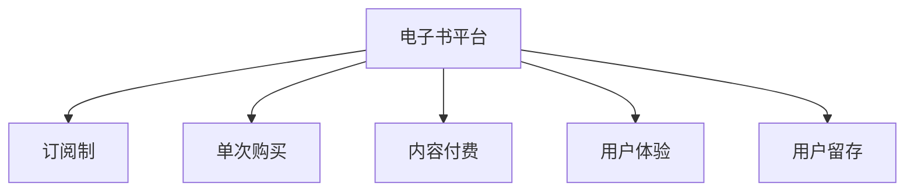

                 

# 如何利用电子书平台实现知识变现

## 1. 背景介绍

### 1.1 问题由来
随着数字化阅读的普及，电子书平台成为人们获取知识的重要渠道。如何通过电子书平台实现知识的有效变现，成为许多内容创作者和平台运营商关注的焦点。这不仅是提升内容创作者收益，更重要的是激发更多的优质内容产出，形成良性的内容生态。

### 1.2 问题核心关键点
电子书平台的知识变现主要通过两种方式：
1. 订阅制：用户为获取长期内容，需要付费订阅，平台按月或按年收取订阅费用。
2. 单次购买：用户为获取特定内容，需要购买单次访问权限，平台按内容收费。

无论是哪种变现方式，关键在于如何精准定位目标受众，构建高质量的内容体系，提升用户体验，并实现商业化运作。

### 1.3 问题研究意义
通过电子书平台实现知识变现，可以：
- 提升内容创作者的经济回报，激励更多优质内容产出。
- 满足用户多样化的阅读需求，提升平台的用户黏性。
- 形成平台与用户之间的良性互动，打造持久的内容生态。
- 提升平台的商业价值，实现可持续的盈利模式。

## 2. 核心概念与联系

### 2.1 核心概念概述

为更好地理解电子书平台的知识变现机制，本节将介绍几个关键概念：

- 电子书平台(E-Book Platform)：在线提供电子书阅读服务的平台，如Amazon Kindle、Apple Books、腾讯阅读等。
- 订阅制(Subscription Model)：用户为获取长期内容而进行的定期支付。
- 单次购买(Single Purchase Model)：用户为获取特定内容而进行的单次付费。
- 内容付费(Content Pricing)：平台根据内容价值，制定合理的价格策略，实现知识变现。
- 用户体验(User Experience)：平台提供的阅读体验，包括易用性、流畅性、互动性等。
- 用户留存(User Retention)：用户长期使用平台，持续产生消费行为的能力。

这些概念之间的逻辑关系可以通过以下Mermaid流程图来展示：



这个流程图展示了几大关键概念之间的联系：

1. 电子书平台通过订阅制和单次购买两种方式实现内容付费。
2. 平台通过提供良好的用户体验，吸引并留住用户。
3. 用户留存是平台长期盈利的关键，需要通过不断优化用户体验和内容体系来实现。

## 3. 核心算法原理 & 具体操作步骤
### 3.1 算法原理概述

电子书平台的知识变现机制，本质上是一种经济学和心理学结合的复杂系统。其核心在于如何平衡内容价值、用户需求、平台收益三者之间的关系，形成健康的商业模式。

从经济学角度，内容创作者提供有价值的内容，平台通过内容付费获取收益。从心理学角度，用户需要满足自身认知需求，通过付费获取优质内容，从而形成消费习惯。

电子书平台的知识变现过程，可以抽象为一个循环过程：

1. 内容创作者提供内容：创作者创作优质内容，上传至平台。
2. 平台推荐内容：平台基于用户偏好推荐相关内容，吸引用户关注。
3. 用户消费内容：用户根据推荐选择付费内容，享受优质阅读体验。
4. 平台收益变现：平台从用户付费中获取收益，支撑平台运营和创作者分成。

### 3.2 算法步骤详解

电子书平台的知识变现一般包括以下几个关键步骤：

**Step 1: 确定内容定位**

- 对目标用户群体进行市场调研，了解他们的需求和偏好。
- 确定内容定位，明确平台将提供什么样的内容，以及如何吸引用户。

**Step 2: 内容创作与发布**

- 策划内容，包括选题、大纲、撰写、校对等。
- 发布内容，上传至电子书平台，并进行适当的营销推广。

**Step 3: 用户获取与互动**

- 设计用户界面(UI)和用户体验(UX)，提升平台易用性和流畅性。
- 提供个性化推荐算法，基于用户行为数据推荐相关内容。
- 设计用户互动机制，如评论、点赞、分享等，增强用户粘性。

**Step 4: 定价与营销**

- 根据内容价值、用户需求、市场竞争等因素，制定合理的价格策略。
- 通过各种营销手段推广内容，吸引用户付费。

**Step 5: 收益分配与优化**

- 按比例将用户付费收益分配给内容创作者，激励更多优质内容产出。
- 实时监控平台运营数据，分析用户行为，优化推荐算法和价格策略。

### 3.3 算法优缺点

电子书平台的知识变现方法具有以下优点：
1. 精准定位用户需求：通过大数据分析和用户反馈，精准定位用户需求，提供有价值的内容。
2. 提升内容创作者收益：平台收益与内容质量直接挂钩，激励更多优质内容产出。
3. 增强用户粘性：个性化推荐和互动机制，提升用户体验，增强用户粘性。
4. 灵活定价策略：根据内容价值和市场竞争，灵活调整价格，优化收益。

同时，该方法也存在一定的局限性：
1. 内容质量依赖创作者：创作者的能力和热情直接影响内容质量，平台需要持续投入人力物力进行内容监管。
2. 用户需求多样：不同用户有不同的阅读需求，难以全面满足所有用户的需求。
3. 竞争激烈：市场上电子书平台众多，竞争激烈，难以形成垄断优势。
4. 付费意愿不稳定：用户付费意愿受经济环境、个人收入等多种因素影响，难以稳定预测。

尽管存在这些局限性，但就目前而言，电子书平台的知识变现方法是电子书行业的主流范式。未来相关研究的重点在于如何进一步提高内容质量、降低平台运营成本，同时兼顾用户需求和平台收益。

### 3.4 算法应用领域

电子书平台的知识变现方法在多个领域得到了应用，例如：

- 教育培训：提供各类在线课程、电子教材等，满足用户学习和培训需求。
- 专业书籍：出版各类专业书籍，满足特定领域用户的需求。
- 娱乐阅读：提供各类小说、漫画等休闲阅读内容，满足娱乐需求。
- 学术研究：提供各类学术论文、会议论文等，满足学术研究和交流需求。

除了这些常见的应用领域外，电子书平台的知识变现方法也在不断拓展到更多场景中，如新闻媒体、社交平台、在线游戏等，为不同行业的数字化转型提供了新的思路。

## 4. 数学模型和公式 & 详细讲解 & 举例说明

### 4.1 数学模型构建

本节将使用数学语言对电子书平台的知识变现机制进行更加严格的刻画。

假设电子书平台有 $N$ 个用户，每个用户有 $M$ 个付费内容，每个内容有 $P$ 个访问量，每个访问量为 $A$。则平台总收益 $R$ 可以表示为：

$$
R = \sum_{u=1}^{N} \sum_{i=1}^{M} \sum_{j=1}^{A} P_i \cdot P_j
$$

其中 $P_i$ 为第 $i$ 个内容的价格。平台收益最大化问题可以表示为：

$$
\max R = \sum_{i=1}^{M} P_i \cdot \sum_{u=1}^{N} \sum_{j=1}^{A} P_j
$$

### 4.2 公式推导过程

为简化问题，我们假设平台上的内容定价为线性，即每个内容的价格与访问量成正比，记为 $P_i = k_i \cdot A_i$，其中 $k_i$ 为第 $i$ 个内容的单价，$A_i$ 为第 $i$ 个内容的平均访问量。则平台总收益 $R$ 可以表示为：

$$
R = \sum_{i=1}^{M} k_i \cdot A_i \cdot \sum_{u=1}^{N} \sum_{j=1}^{A} P_j
$$

根据最优性条件，平台收益最大化时的内容价格 $k_i$ 满足：

$$
k_i = \frac{\partial R}{\partial k_i}
$$

即：

$$
k_i = \frac{\partial (\sum_{j=1}^{A} P_j)}{\partial k_i}
$$

进一步整理可得：

$$
k_i = \frac{\sum_{j=1}^{A} P_j}{\sum_{u=1}^{N} \sum_{j=1}^{A} P_j}
$$

这意味着，内容价格应与平均访问量成正比，反映出平台对热门内容的重视程度。

### 4.3 案例分析与讲解

假设平台上有三种内容 $A$、$B$、$C$，其单价分别为 $k_A = 1$、$k_B = 2$、$k_C = 3$，平均访问量分别为 $A_A = 1000$、$A_B = 500$、$A_C = 100$。平台总收益 $R$ 可以表示为：

$$
R = k_A \cdot A_A + k_B \cdot A_B + k_C \cdot A_C = 1 \cdot 1000 + 2 \cdot 500 + 3 \cdot 100 = 2800
$$

通过上述推导，我们可以看出，平台应根据内容的访问量和使用价值，合理制定内容价格，以最大化收益。

## 5. 项目实践：代码实例和详细解释说明
### 5.1 开发环境搭建

在进行电子书平台知识变现实践前，我们需要准备好开发环境。以下是使用Python进行Django开发的环境配置流程：

1. 安装Anaconda：从官网下载并安装Anaconda，用于创建独立的Python环境。

2. 创建并激活虚拟环境：
```bash
conda create -n ebook-env python=3.8 
conda activate ebooks-env
```

3. 安装Django：
```bash
pip install django
```

4. 安装Django模板：
```bash
pip install django-templates
```

5. 安装Django管理后台：
```bash
pip install django-admin-shell
```

6. 安装Django缓存：
```bash
pip install django-cacheops
```

7. 安装Django图片上传：
```bash
pip install django-image-upload
```

完成上述步骤后，即可在`ebook-env`环境中开始电子书平台知识变现的开发实践。

### 5.2 源代码详细实现

下面我们将通过一个简单的电子书平台为例，实现订阅制和单次购买的变现逻辑。

首先，创建电子书平台的用户模型和内容模型：

```python
from django.db import models

class User(models.Model):
    username = models.CharField(max_length=100)
    email = models.EmailField()

class Content(models.Model):
    title = models.CharField(max_length=100)
    description = models.TextField()
    price = models.DecimalField(max_digits=10, decimal_places=2)
    author = models.ForeignKey(User, on_delete=models.CASCADE)
```

然后，定义用户登录和订阅逻辑：

```python
from django.contrib.auth.models import User
from django.shortcuts import render, redirect

def login(request):
    if request.method == 'POST':
        username = request.POST['username']
        password = request.POST['password']
        user = User.objects.filter(username=username, password=password).first()
        if user:
            request.session['user_id'] = user.id
            return redirect('home')
    return render(request, 'login.html')

def home(request):
    if 'user_id' not in request.session:
        return redirect('login')
    user = User.objects.get(id=request.session['user_id'])
    contents = Content.objects.all()
    return render(request, 'home.html', {'contents': contents})
```

接着，定义单次购买逻辑：

```python
from django.shortcuts import render, redirect

def purchase(request, content_id):
    if 'user_id' not in request.session:
        return redirect('login')
    user = User.objects.get(id=request.session['user_id'])
    content = Content.objects.get(id=content_id)
    if request.method == 'POST':
        amount = request.POST['amount']
        response = redirect(content.url)
        response.content = b'Content purchased.'
        response.status_code = 302
        return response
    return render(request, 'purchase.html', {'content': content, 'user': user})
```

最后，启动电子书平台并测试功能：

```python
from django.urls import path
from django.contrib import admin

urlpatterns = [
    path('login/', login, name='login'),
    path('home/', home, name='home'),
    path('purchase/<int:content_id>/', purchase, name='purchase'),
    path('admin/', admin.site.urls),
]

if __name__ == '__main__':
    from django.core.management import execute_from_command_line
    execute_from_command_line()
```

以上就是电子书平台知识变现的简单代码实现。可以看到，通过Django框架，我们可以快速搭建一个基本的电子书平台，实现订阅制和单次购买的功能。

### 5.3 代码解读与分析

让我们再详细解读一下关键代码的实现细节：

**User和Content模型**：
- `User`模型表示平台用户，包含用户名和密码。
- `Content`模型表示电子书内容，包含标题、描述、价格等信息，并关联作者。

**login函数**：
- 处理用户登录，通过用户名和密码查询数据库，若存在则设置session，并重定向至首页。
- 若登录失败，则返回登录页面。

**home函数**：
- 处理用户首页访问，从数据库查询所有内容，并渲染至页面。
- 若用户未登录，则重定向至登录页面。

**purchase函数**：
- 处理用户购买操作，获取指定内容并判断是否支付成功。
- 若支付成功，则重定向至内容页面，设置响应内容为购买成功消息。
- 若未支付成功，则返回购买页面。

**代码总体结构**：
- Django提供的路由系统`urlpatterns`，将不同URL映射到对应的函数。
- 使用`admin`模块实现后台管理功能。

这个简单的代码示例展示了电子书平台的知识变现基础逻辑，但实际应用中还需要考虑更多因素，如用户注册、支付处理、权限控制等。

## 6. 实际应用场景
### 6.1 智能阅读助手

电子书平台可以结合智能推荐算法，提供个性化阅读助手功能。通过分析用户阅读习惯和内容反馈，平台可以实时推荐用户感兴趣的内容，提升用户阅读体验。

在技术实现上，平台可以记录用户阅读行为，包括阅读时间、停留时长、浏览路径等。基于这些数据，通过协同过滤、内容推荐等算法，为用户推荐相关内容。还可以结合用户的历史阅读记录，进行连续性推荐，提升用户粘性。

### 6.2 企业培训

企业可以通过电子书平台提供定制化的培训课程，提升员工技能。平台可以针对不同岗位、不同级别的员工，提供有针对性的培训内容，满足企业的个性化培训需求。

在技术实现上，企业可以定制培训计划，包含课程大纲、培训目标、学习路径等信息。平台根据员工的学习进度和反馈，动态调整课程推荐，确保培训效果。同时，平台还可以记录员工的学习行为，生成学习报告，帮助企业优化培训方案。

### 6.3 学术论文分享

电子书平台可以提供一个学术社区，方便研究人员分享和获取学术论文。平台可以根据研究领域、论文主题等进行分类和推荐，满足不同领域研究人员的需求。

在技术实现上，平台可以引入自然语言处理技术，自动识别和分类论文。还可以结合社交网络算法，发现和推荐相关论文，促进学术交流和合作。平台还可以提供在线会议和交流功能，支持论文讨论和互动。

### 6.4 未来应用展望

随着电子书平台的不断发展，未来的知识变现应用将更加广泛和深入：

- 多元化内容形式：除了文字内容，还将拓展到视频、音频、图像等多种形式，满足不同用户的需求。
- 智能交互体验：结合AI技术，提供虚拟助手、对话系统等智能交互功能，提升用户体验。
- 个性化推荐系统：结合深度学习技术，实现更精准、更高效的内容推荐，提升用户粘性。
- 数据驱动运营：通过大数据分析和用户行为数据，实现运营优化和决策支持。
- 全球化拓展：拓展海外市场，提升全球用户覆盖，形成全球化的知识生态。

电子书平台的知识变现将不仅限于付费内容，还可以通过内容广告、赞助商合作等方式，实现多元化的盈利模式。相信随着技术的不断进步，电子书平台将在知识传播和变现中发挥更大的作用，推动知识共享和创新。

## 7. 工具和资源推荐
### 7.1 学习资源推荐

为了帮助开发者系统掌握电子书平台的知识变现理论基础和实践技巧，这里推荐一些优质的学习资源：

1. 《电子书平台设计与实现》系列博文：由电子书平台技术专家撰写，深入浅出地介绍了电子书平台的设计思路和实现细节。

2. Django官方文档：Django框架的官方文档，提供了详细的教程和示例代码，是学习Django的必备资料。

3. Python自然语言处理（NLTK）：用于自然语言处理的核心库，提供了丰富的文本处理功能，适用于电子书平台的推荐系统开发。

4. TensorFlow和PyTorch：主流深度学习框架，适用于电子书平台的推荐算法和智能交互系统的开发。

5. Elasticsearch和Solr：用于全文搜索和推荐算法的高性能搜索引擎，适用于电子书平台的个性化推荐系统。

通过对这些资源的学习实践，相信你一定能够快速掌握电子书平台的知识变现精髓，并用于解决实际的电子书平台问题。

### 7.2 开发工具推荐

高效的开发离不开优秀的工具支持。以下是几款用于电子书平台知识变现开发的常用工具：

1. Django：Python的Web框架，适用于搭建复杂、高性能的Web应用，如电子书平台。

2. Elasticsearch：分布式搜索引擎，适用于全文搜索和推荐算法。

3. Redis：高性能内存数据库，适用于缓存和消息队列。

4. Celery：异步任务调度框架，适用于大规模的后台任务处理。

5. RQ：简单的任务队列库，适用于队列管理和任务调度。

6. ImageMagick：用于图像处理的开源工具，适用于电子书平台的图片处理和展示。

合理利用这些工具，可以显著提升电子书平台知识变现任务的开发效率，加快创新迭代的步伐。

### 7.3 相关论文推荐

电子书平台的知识变现方法在学术界也得到了广泛研究。以下是几篇奠基性的相关论文，推荐阅读：

1. 《电子书平台的用户行为分析与推荐算法》：研究电子书平台的用户行为数据，提出基于协同过滤的推荐算法。

2. 《基于深度学习的电子书推荐系统》：利用深度学习技术，提升电子书平台的推荐精度和多样性。

3. 《电子书平台的多元化内容服务》：研究电子书平台的多元化内容形式，提出多模态内容推荐算法。

4. 《电子书平台的内容定价策略》：研究电子书平台的定价模型，提出基于市场竞争和用户需求的定价策略。

5. 《电子书平台的用户留存策略》：研究电子书平台的用户留存策略，提出基于用户体验和内容多样性的留存方法。

这些论文代表了大电子书平台知识变现技术的发展脉络。通过学习这些前沿成果，可以帮助研究者把握学科前进方向，激发更多的创新灵感。

## 8. 总结：未来发展趋势与挑战
### 8.1 总结

本文对电子书平台的知识变现机制进行了全面系统的介绍。首先阐述了电子书平台和内容变现的核心概念，明确了知识变现对内容创作者和平台运营商的重要意义。其次，从原理到实践，详细讲解了知识变现的数学模型和具体操作步骤，给出了电子书平台知识变现的完整代码实例。同时，本文还广泛探讨了知识变现在智能阅读助手、企业培训、学术论文分享等多个领域的应用前景，展示了知识变现范式的巨大潜力。此外，本文精选了知识变现技术的各类学习资源，力求为读者提供全方位的技术指引。

通过本文的系统梳理，可以看到，电子书平台的知识变现机制通过精准定位用户需求、构建高质量的内容体系、提升用户体验和运营数据驱动，实现了商业化运作。这一机制为电子书平台和内容创作者提供了新思路，同时也带来了新的挑战。

### 8.2 未来发展趋势

展望未来，电子书平台的知识变现将呈现以下几个发展趋势：

1. 内容形式多样化：随着技术进步，电子书平台的内容形式将更加丰富多样，涵盖文字、视频、音频、图像等。

2. 个性化推荐系统：结合深度学习技术，实现更精准、更高效的内容推荐，提升用户粘性。

3. 智能交互体验：结合AI技术，提供虚拟助手、对话系统等智能交互功能，提升用户体验。

4. 数据驱动运营：通过大数据分析和用户行为数据，实现运营优化和决策支持。

5. 全球化拓展：拓展海外市场，提升全球用户覆盖，形成全球化的知识生态。

6. 多元化盈利模式：除了内容付费，还可以通过内容广告、赞助商合作等方式，实现多元化的盈利模式。

以上趋势凸显了电子书平台知识变现的广阔前景。这些方向的探索发展，必将进一步提升电子书平台的商业价值，实现更高效的知识变现。

### 8.3 面临的挑战

尽管电子书平台的知识变现技术已经取得了显著成就，但在迈向更加智能化、普适化应用的过程中，它仍面临着诸多挑战：

1. 内容质量提升：尽管内容创作者已非常努力，但内容质量仍有提升空间，特别是在专业领域和个性化需求方面。

2. 平台运营成本：电子书平台的维护和运营成本较高，特别是对大规模内容的管理和推荐系统优化。

3. 用户留存挑战：如何通过个性化推荐和智能交互，持续提升用户粘性，并应对市场竞争。

4. 盈利模式创新：传统的内容付费模式面临挑战，需要寻找新的盈利模式，如内容广告、版权保护等。

5. 技术持续创新：深度学习、自然语言处理等技术的不断进步，要求平台持续跟进，提升技术水平。

6. 用户隐私保护：在个性化推荐和智能交互中，如何保护用户隐私，避免数据滥用。

面对这些挑战，电子书平台需要在内容创作、平台运营、用户体验、技术创新等多方面进行持续改进和优化，才能保持竞争力和市场地位。

### 8.4 研究展望

未来的电子书平台知识变现研究，需要在以下几个方面寻求新的突破：

1. 内容质量提升：通过更好的推荐算法和更精准的内容创作工具，提升内容质量和用户满意度。

2. 运营成本优化：引入自动化管理工具，如AI助手、机器学习等，提升平台运营效率和成本控制。

3. 用户留存优化：结合用户行为数据，优化个性化推荐系统，提升用户粘性和满意度。

4. 盈利模式创新：结合内容广告、赞助商合作、版权保护等多种方式，实现多元化的盈利模式。

5. 技术持续创新：结合深度学习、自然语言处理等技术，提升推荐精度和智能交互能力。

6. 用户隐私保护：引入隐私保护技术，如差分隐私、联邦学习等，保护用户隐私。

这些研究方向的探索，必将引领电子书平台知识变现技术迈向更高的台阶，为平台和用户带来更多的价值。面向未来，电子书平台需要持续创新，才能在数字化阅读时代占据优势，实现可持续的商业化运营。

## 9. 附录：常见问题与解答

**Q1：电子书平台如何判断用户是否付费成功？**

A: 电子书平台通常会设置一个交易状态，如已支付、已退款、已过期等。用户在完成购买操作后，系统将自动更新交易状态。平台可以根据交易状态，判断用户是否已付费成功。

**Q2：电子书平台如何进行用户行为分析？**

A: 电子书平台可以通过记录用户的行为数据，如阅读时间、停留时长、浏览路径等，进行分析。基于这些数据，平台可以构建用户画像，了解用户需求和偏好，从而实现个性化推荐和精准定价。

**Q3：电子书平台如何实现快速内容推荐？**

A: 电子书平台可以通过缓存技术，如Redis、Memcached等，缓存热门内容和推荐结果。同时，平台可以结合协同过滤、内容推荐等算法，快速生成推荐列表，提升用户体验。

**Q4：电子书平台如何进行内容过滤？**

A: 电子书平台可以引入过滤器算法，如基于规则的过滤、基于内容的过滤等，对不适宜的内容进行过滤。同时，平台可以引入用户投诉机制，及时处理不适宜内容，保障用户权益。

**Q5：电子书平台如何应对盗版问题？**

A: 电子书平台可以采用技术手段，如数字水印、DRM技术等，防止盗版。同时，平台可以建立版权保护机制，通过版权证书、权利管理等手段，保障内容创作者的合法权益。

这些问题的解答，展示了电子书平台在知识变现过程中的关键技术和实践细节，为读者提供了深入的思考和参考。

---

作者：禅与计算机程序设计艺术 / Zen and the Art of Computer Programming

