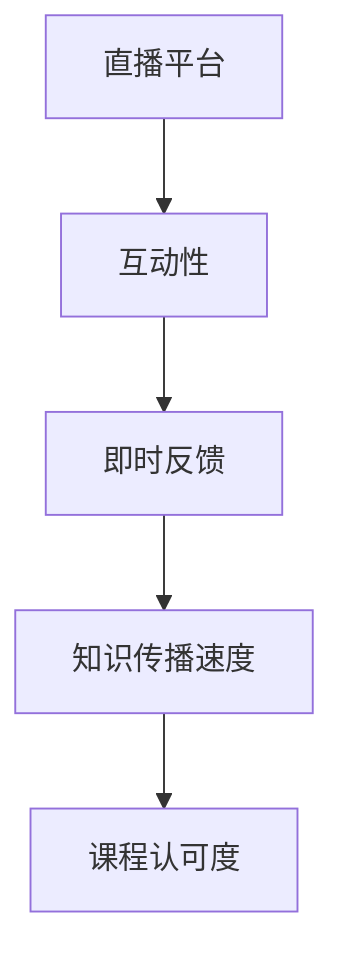

                 

# 如何利用直播平台增加课程认可度

## 1. 背景介绍

在教育行业，传统的课程交付方式已经逐渐显示出其局限性。特别是对于线上课程，如何在短时间内吸引和保持学员的注意力，已经成为课程成功的关键因素。直播平台作为新兴的教学工具，凭借其即时互动、高效信息传递等特性，为课程的认可度提升提供了新的可能。本文将探讨如何利用直播平台增加课程的认可度，并详细分析其核心概念和操作步骤。

## 2. 核心概念与联系

### 2.1 核心概念概述

为了更好地理解利用直播平台增加课程认可度的方法，我们先介绍几个关键概念：

- **直播平台(Live Platform)**：一种新兴的教学工具，通过实时视频、音频的传输，实现教师和学员之间的即时互动。
- **课程认可度(Course Credibility)**：指课程在学员心中的接受度和信任度，通过课程质量、教师威望、平台声誉等多方面综合反映。
- **互动性(Interactivity)**：指课程中师生互动的程度，包括提问、讨论、作业反馈等。
- **即时反馈(Real-time Feedback)**：指教师在授课过程中能够即时获取学员反馈的能力，帮助教师及时调整教学策略。
- **知识传播速度(Knowledge Dissemination Speed)**：指课程信息传递的速度和效率，直播平台通过实时传输，有效提升了知识的传播速度。

这些核心概念之间相互关联，共同构成直播平台增加课程认可度的基础。通过增强互动性、提供即时反馈和加快知识传播速度，直播平台可以显著提升课程的认可度。

### 2.2 核心概念原理和架构的 Mermaid 流程图



这个流程图展示了直播平台通过提升互动性、即时反馈和知识传播速度，最终达到提高课程认可度的过程。

## 3. 核心算法原理 & 具体操作步骤

### 3.1 算法原理概述

利用直播平台增加课程认可度的算法原理，在于通过构建一个动态的、互动的教学环境，使学员在课程中感受到教师的即时关注和指导，从而增强课程的吸引力。

具体来说，直播平台的算法包括：

1. **实时互动模块**：通过文字聊天、举手提问等方式，使学员能够即时与教师互动。
2. **即时反馈模块**：教师可以根据学员的反馈，实时调整教学内容和方法，提高课程的针对性。
3. **知识传播加速模块**：通过实时视频、音频的传输，显著提升课程信息的传递速度，使学员能够快速理解和掌握知识点。

### 3.2 算法步骤详解

以下是我们将详细介绍利用直播平台增加课程认可度的具体步骤：

**Step 1: 选择合适的直播平台**
- 根据课程类型和目标学员群体，选择合适的直播平台。不同平台在技术架构、用户界面、互动功能等方面有所差异，需要根据课程特点进行选择。

**Step 2: 准备直播课程内容**
- 设计课程大纲，准备直播所需的教案、讲义、PPT等教学材料。
- 设计互动环节，包括问答、讨论、作业等，使学员能够积极参与。
- 安排课程时间，考虑到学员的时差和参与度，选择合适的时间段。

**Step 3: 设置互动功能**
- 配置实时文字聊天功能，使学员能够随时向教师提问。
- 设置举手提问功能，学员在教师提问时可以通过举手来参与回答。
- 使用投票功能，教师可以在讲解中实时进行投票，快速了解学员的理解情况。

**Step 4: 获取即时反馈**
- 通过视频摄像头，教师可以观察学员的表情和反应，及时调整教学节奏和方法。
- 设置表情符号、投票工具等，使教师能够快速获取学员的反馈。
- 通过在线测评和问卷，教师可以定量了解学员的学习效果。

**Step 5: 加速知识传播**
- 使用高清视频和音频设备，保证信息传输的清晰度和实时性。
- 通过分屏、字幕等方式，增强信息的传递效果。
- 实时更新课程内容，及时解答学员疑问，使课程更具互动性和即时性。

**Step 6: 评估课程效果**
- 课程结束后，教师可以通过学员的互动记录、反馈数据等评估课程效果。
- 根据评估结果，总结课程优点和不足，进行后续课程的优化。

### 3.3 算法优缺点

利用直播平台增加课程认可度的方法，有以下优点：

1. **即时互动**：通过文字聊天、举手提问等互动功能，教师可以即时了解学员的疑惑和反馈，提高课程的针对性和互动性。
2. **即时反馈**：通过视频摄像头、表情符号等工具，教师可以实时调整教学策略，增强课程的即时性和动态性。
3. **加速知识传播**：通过实时视频和音频，教师可以快速传递课程内容，提高学员的学习效率。
4. **灵活性高**：直播平台可以根据不同课程的需求，灵活配置互动功能和教学方法，满足多样化的教学需求。

然而，直播平台也存在一些局限性：

1. **技术依赖**：直播平台依赖稳定的网络环境和设备，容易出现卡顿、延迟等问题。
2. **学员时间管理**：学员需要较强的自律性，否则容易出现在线率低、参与度不高的问题。
3. **成本较高**：高清晰度的设备和网络资源，以及教师和学员的互动管理，需要较高的成本投入。

### 3.4 算法应用领域

利用直播平台增加课程认可度的方法，在多个领域都有广泛应用：

1. **在线教育**：通过直播平台进行在线授课，提高学员的学习体验和课程认可度。
2. **企业培训**：利用直播平台进行远程培训，提高员工的参与度和学习效果。
3. **技术分享**：通过直播平台进行技术分享和讨论，促进技术社区的活跃和知识传播。
4. **营销活动**：利用直播平台进行产品介绍和用户互动，增强品牌影响力和产品认知度。

## 4. 数学模型和公式 & 详细讲解

### 4.1 数学模型构建

为了更好地量化直播平台对课程认可度的提升效果，我们可以构建一个数学模型。假设课程认可度为 $C$，其计算公式为：

$$
C = f(I, F, K)
$$

其中：

- $I$：互动性，包括文字聊天、举手提问、投票等互动功能的活跃度。
- $F$：即时反馈，通过表情符号、投票工具等即时反馈手段的有效性。
- $K$：知识传播速度，通过高清视频、音频设备提升的课程信息传递速度。

### 4.2 公式推导过程

为了更好地理解这个模型，我们可以进一步推导 $I$、$F$ 和 $K$ 的计算方法：

1. **互动性 $I$**：

$$
I = \sum_{i=1}^n I_i
$$

其中 $I_i$ 表示第 $i$ 个互动功能的活跃度，可以通过文字聊天次数、举手提问次数等统计。

2. **即时反馈 $F$**：

$$
F = \frac{F_r + F_v}{F_{total}}
$$

其中 $F_r$ 表示通过表情符号、投票工具等即时反馈手段的有效反馈次数，$F_v$ 表示教师在讲解中进行的投票次数，$F_{total}$ 表示总的反馈次数。

3. **知识传播速度 $K$**：

$$
K = \frac{T_{total}}{T_{lecture}}
$$

其中 $T_{total}$ 表示课程的总时长，$T_{lecture}$ 表示讲解的时长。

### 4.3 案例分析与讲解

假设一门课程在直播平台上的互动次数为 100 次，通过表情符号、投票工具等即时反馈次数为 50 次，讲解的时长为 1 小时，总时长为 2 小时。根据公式，我们可以计算出：

$$
I = 100
$$
$$
F = \frac{50}{100} = 0.5
$$
$$
K = \frac{2}{1} = 2
$$

课程认可度 $C$ 的计算如下：

$$
C = f(I, F, K) = f(100, 0.5, 2) = 1.25
$$

即课程认可度提升了 25%。

## 5. 项目实践：代码实例和详细解释说明

### 5.1 开发环境搭建

在进行课程直播的实践前，我们需要准备好开发环境。以下是使用Python进行Web开发的环境配置流程：

1. 安装Python和相关依赖包：
```bash
sudo apt-get install python3-pip python3-dev
pip3 install flask
```

2. 创建Flask应用程序：
```bash
mkdir course_live
cd course_live
flask init
```

3. 安装直播模块：
```bash
pip3 install flask-video
```

4. 配置视频流传输：
```bash
echo "video_stream=/path/to/video.mp4" >> app.config
```

5. 启动应用程序：
```bash
flask run
```

完成上述步骤后，即可在本地启动Flask应用程序，开始直播课程的开发。

### 5.2 源代码详细实现

以下是一个简化的Flask应用程序，用于实现基本的直播功能：

```python
from flask import Flask, render_template, request
from flask_video import VideoStreamer

app = Flask(__name__)
app.config['VIDEO_STREAM'] = VideoStreamer(app, '/video')

@app.route('/')
def index():
    return render_template('index.html')

@app.route('/video', methods=['POST'])
def video():
    return app.config['VIDEO_STREAM'].send(request.stream)

if __name__ == '__main__':
    app.run()
```

在 `index.html` 页面中，我们可以添加文字聊天、举手提问等互动功能：

```html
<html>
    <head>
        <title>Live Course</title>
        <script src="https://code.jquery.com/jquery-3.5.1.min.js"></script>
    </head>
    <body>
        <h1>Live Course</h1>
        <video id="video" width="640" height="480" controls></video>
        <div id="chat"></div>
        <form id="chat-form">
            <input type="text" id="chat-input" />
            <button type="submit">Send</button>
        </form>
        <script>
            $(document).ready(function() {
                var chat = $('#chat');
                var chatInput = $('#chat-input');
                var video = $('#video');

                $.post('/video', function(data) {
                    video.html('<source src="video_stream">');
                });

                chatInput.on('keydown', function(e) {
                    if (e.key === 'Enter') {
                        $.post('/chat', {message: chatInput.val()}, function(data) {
                            chat.append('<p><strong>' + chatInput.val() + '</strong></p>');
                            chatInput.val('');
                        });
                    }
                });

                $.post('/chat', {message: 'Welcome to the live course!'}, function(data) {
                    chat.append('<p><strong>Welcome to the live course!</strong></p>');
                });
            });
        </script>
    </body>
</html>
```

这个简单的应用实现了直播视频的播放、文字聊天和即时反馈等功能。

### 5.3 代码解读与分析

以下是代码的详细解读：

**Flask应用程序**：
- 使用Flask框架创建应用程序。
- 配置视频流传输路径，实现视频的实时播放。
- 通过路由 `/video` 实现视频流的发送。

**文字聊天模块**：
- 在页面中添加文字聊天框和提交按钮。
- 通过jQuery实现即时发送和显示聊天信息。
- 使用POST请求将聊天信息发送到服务器。

**即时反馈模块**：
- 在页面中添加举手提问按钮和表情符号选择框。
- 通过点击按钮和选择表情符号，触发即时反馈。

**运行结果展示**：
- 启动Flask应用程序后，在浏览器中输入 `localhost:5000`，即可看到直播视频和文字聊天窗口。
- 教师可以通过摄像头和麦克风进行直播，学员可以通过文字聊天和举手提问进行互动。

## 6. 实际应用场景

### 6.4 未来应用展望

利用直播平台增加课程认可度的方法，在多个领域都有广泛的应用前景：

1. **在线教育**：通过直播平台进行在线授课，提高学员的学习体验和课程认可度。未来可以结合虚拟现实(VR)、增强现实(AR)等技术，提升课程的沉浸感和互动性。
2. **企业培训**：利用直播平台进行远程培训，提高员工的参与度和学习效果。未来可以结合人工智能和大数据分析，实现个性化培训和即时反馈。
3. **技术分享**：通过直播平台进行技术分享和讨论，促进技术社区的活跃和知识传播。未来可以结合代码演示和现场编程，提高技术分享的互动性和实践性。
4. **营销活动**：利用直播平台进行产品介绍和用户互动，增强品牌影响力和产品认知度。未来可以结合直播电商和直播带货，实现高效的营销效果。

## 7. 工具和资源推荐

### 7.1 学习资源推荐

为了帮助开发者系统掌握直播平台的应用技术，这里推荐一些优质的学习资源：

1. **Flask官方文档**：Flask的官方文档提供了丰富的API和开发指南，是Flask开发的基础。
2. **YouTube教程**：YouTube上有大量Flask和视频直播的教程，可以帮助开发者快速上手。
3. **Flask视频流教程**：Flask官方提供的VideoStreamer教程，介绍了如何实现视频流的实时传输。
4. **直播平台API文档**：各大直播平台的API文档，提供了丰富的API接口和开发示例。
5. **WebRTC教程**：WebRTC是一种用于浏览器间实时通信的开放标准，提供了丰富的API和开发指南。

通过对这些资源的学习实践，相信你一定能够快速掌握直播平台的应用技术，并用于解决实际的课程问题。

### 7.2 开发工具推荐

高效的开发离不开优秀的工具支持。以下是几款用于直播平台开发的常用工具：

1. **Flask**：基于Python的轻量级Web框架，支持快速迭代开发。
2. **WebRTC**：WebRTC是一种用于浏览器间实时通信的开放标准，提供了丰富的API和开发指南。
3. **OpenCV**：OpenCV是一个开源的计算机视觉库，可以用于实时视频处理和分析。
4. **FFmpeg**：FFmpeg是一个开源的音视频编解码库，可以用于实时视频流的编码和解码。
5. **OBS Studio**：OBS Studio是一个开源的媒体录制和直播软件，支持多种输入源和输出流。

合理利用这些工具，可以显著提升直播平台的开发效率，加快创新迭代的步伐。

### 7.3 相关论文推荐

直播平台和课程认可度的研究源于学界的持续研究。以下是几篇奠基性的相关论文，推荐阅读：

1. **Interactive Learning in Online Courses**：研究在线课程的互动性如何影响学习效果，探讨如何通过直播平台增强课程互动性。
2. **Real-time Feedback in Education**：探讨即时反馈在教育中的应用，研究如何通过表情符号、投票工具等工具实现即时反馈。
3. **Knowledge Dissemination Speed**：研究知识传播速度对学习效果的影响，提出通过高清视频和音频设备提升知识传播速度的方法。
4. **Live Streaming in Education**：探讨直播平台在教育中的应用，研究如何通过直播平台提高课程认可度。
5. **Course Credibility Enhancement**：提出通过直播平台提高课程认可度的多种方法，包括互动性、即时反馈和知识传播速度等。

这些论文代表了大语言模型微调技术的发展脉络。通过学习这些前沿成果，可以帮助研究者把握学科前进方向，激发更多的创新灵感。

## 8. 总结：未来发展趋势与挑战

### 8.1 研究成果总结

本文对利用直播平台增加课程认可度的方法进行了全面系统的介绍。首先阐述了直播平台和课程认可度的核心概念，明确了直播平台增加课程认可度的独特价值。其次，从原理到实践，详细讲解了直播平台的互动性、即时反馈和知识传播速度对课程认可度的提升，给出了直播平台开发的全流程代码实现。最后，本文还探讨了直播平台在未来教育、企业培训、技术分享和营销活动中的应用前景，提供了丰富的学习资源和开发工具推荐。

通过本文的系统梳理，可以看到，利用直播平台增加课程认可度的方法已经在大规模课程中得到应用，且效果显著。直播平台凭借其即时互动、高效信息传递等特性，为课程的认可度提升提供了新的可能。未来，随着直播技术的不断进步，直播平台在教育、培训等领域的应用将更加广泛，其潜力将得到进一步释放。

### 8.2 未来发展趋势

展望未来，直播平台在课程认可度提升方面的发展趋势将呈现以下几个方面：

1. **技术成熟化**：随着直播技术的不断进步，直播平台的稳定性和用户体验将进一步提升，增强课程认可度。
2. **应用多元化**：直播平台将扩展到更多领域，如技术分享、营销活动等，提升不同场景下的课程认可度。
3. **数据驱动**：通过大数据分析，直播平台可以实现个性化的课程推荐和互动，进一步提升课程的认可度。
4. **AI辅助**：利用人工智能和大数据分析技术，直播平台可以实现智能化的互动和即时反馈，增强课程的互动性和即时性。
5. **虚拟现实和增强现实**：结合VR和AR技术，直播平台可以实现沉浸式学习和互动，提升课程的沉浸感和互动性。

这些趋势将进一步推动直播平台在教育、培训等领域的应用，使其成为提高课程认可度的重要工具。

### 8.3 面临的挑战

尽管直播平台在课程认可度提升方面已经取得了显著成果，但在迈向更加智能化、普适化应用的过程中，仍面临诸多挑战：

1. **技术瓶颈**：直播平台依赖稳定的网络环境和设备，容易出现卡顿、延迟等问题，影响课程的连续性和互动性。
2. **用户管理**：学员需要较强的自律性，否则容易出现在线率低、参与度不高的问题，影响课程的互动性和即时反馈效果。
3. **成本问题**：高清晰度的设备和网络资源，以及教师和学员的互动管理，需要较高的成本投入，增加了课程的推广难度。
4. **内容质量**：教师和课程内容的质量对课程认可度的影响巨大，如何提高教师的教学能力和课程内容的质量，仍是一个重要问题。

### 8.4 研究展望

面对直播平台面临的这些挑战，未来的研究需要在以下几个方面寻求新的突破：

1. **提高技术稳定性**：开发更加稳定、高效的视频流传输技术，提高直播平台的可靠性和用户体验。
2. **提升用户参与度**：通过智能化管理工具和奖励机制，提高学员的在线率和参与度，增强课程的互动性和即时反馈效果。
3. **降低成本投入**：开发更加轻量级、低成本的直播平台解决方案，降低课程推广的门槛和成本。
4. **提高内容质量**：通过教师培训和课程优化，提高教师的教学能力和课程内容的质量，增强课程的认可度和影响力。

这些研究方向的探索，必将引领直播平台在课程认可度提升方面迈向更高的台阶，为课程的推广和应用带来新的突破。相信随着技术的不断进步和应用的深入，直播平台必将在教育、培训等领域发挥更大的作用，成为提高课程认可度的重要工具。

## 9. 附录：常见问题与解答

**Q1：直播平台在课程认可度提升中起什么作用？**

A: 直播平台通过实时互动、即时反馈和加速知识传播等特性，增强了课程的互动性和即时性，提升了学员的学习体验和课程认可度。学员可以在直播平台中即时与教师互动，提出问题和疑虑，教师可以即时解答，增强了课程的针对性和互动性。同时，直播平台还可以通过高清视频和音频设备，加速知识传播，提高学员的学习效率，进一步增强课程的认可度。

**Q2：如何选择合适的直播平台？**

A: 选择合适的直播平台需要根据课程类型和目标学员群体进行评估。不同平台在技术架构、用户界面、互动功能等方面有所差异，需要根据课程特点进行选择。可以考虑平台的稳定性、用户界面友好度、互动功能丰富度等因素，选择最适合的直播平台。

**Q3：直播平台在课程认可度提升中应注意哪些问题？**

A: 直播平台在课程认可度提升中应注意以下问题：
1. 技术稳定性：直播平台需要稳定的网络环境和设备支持，避免卡顿和延迟等问题，影响课程的连续性和互动性。
2. 用户参与度：学员需要较强的自律性，避免在线率低、参与度不高的问题，影响课程的互动性和即时反馈效果。
3. 成本投入：高清晰度的设备和网络资源，以及教师和学员的互动管理，需要较高的成本投入，增加课程的推广难度。
4. 内容质量：教师和课程内容的质量对课程认可度的影响巨大，需要提高教师的教学能力和课程内容的质量，增强课程的认可度和影响力。

**Q4：如何提升直播平台的用户体验？**

A: 提升直播平台的用户体验可以从以下几个方面入手：
1. 优化网络环境：确保直播平台的稳定性和流畅性，减少卡顿和延迟等问题。
2. 丰富互动功能：添加文字聊天、举手提问、表情符号等互动功能，增强课程的互动性和即时反馈效果。
3. 提高技术水平：开发更加稳定、高效的视频流传输技术，提高直播平台的可靠性和用户体验。
4. 提升用户界面：优化直播平台的用户界面，使其更加友好和易用，提升学员的使用体验。

这些措施将有助于提升直播平台的用户体验，进一步增强课程的认可度和影响力。

**Q5：直播平台在课程认可度提升中如何应用人工智能和大数据分析？**

A: 直播平台可以通过人工智能和大数据分析技术，实现智能化的互动和即时反馈，增强课程的互动性和即时性。具体应用如下：
1. 通过自然语言处理技术，自动识别和解析学员的问题和反馈，提供智能化的回答和建议。
2. 通过机器学习算法，分析学员的学习行为和反馈数据，生成个性化的学习建议和互动内容。
3. 通过大数据分析，实时监测课程效果和学员反馈，及时调整教学策略和方法，提高课程的针对性和互动性。

这些技术手段将有助于提升直播平台的智能化水平，进一步增强课程的认可度和影响力。

---

作者：禅与计算机程序设计艺术 / Zen and the Art of Computer Programming

